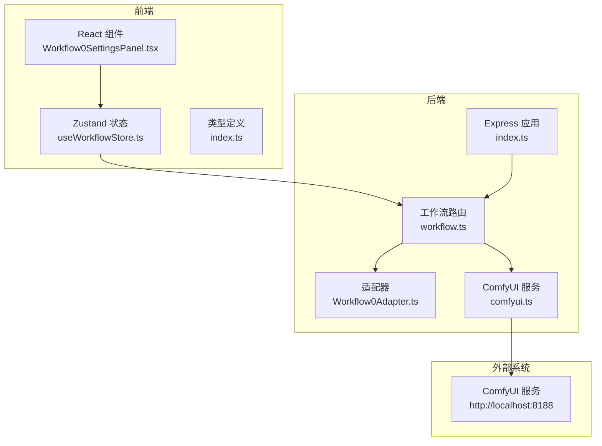
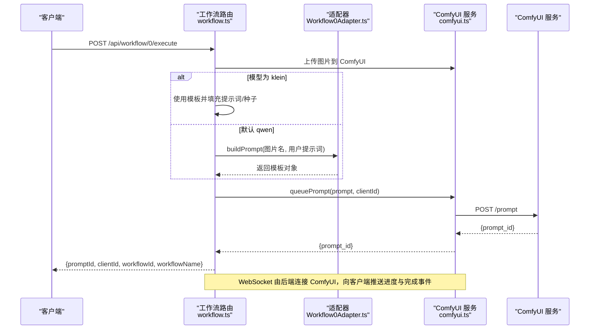
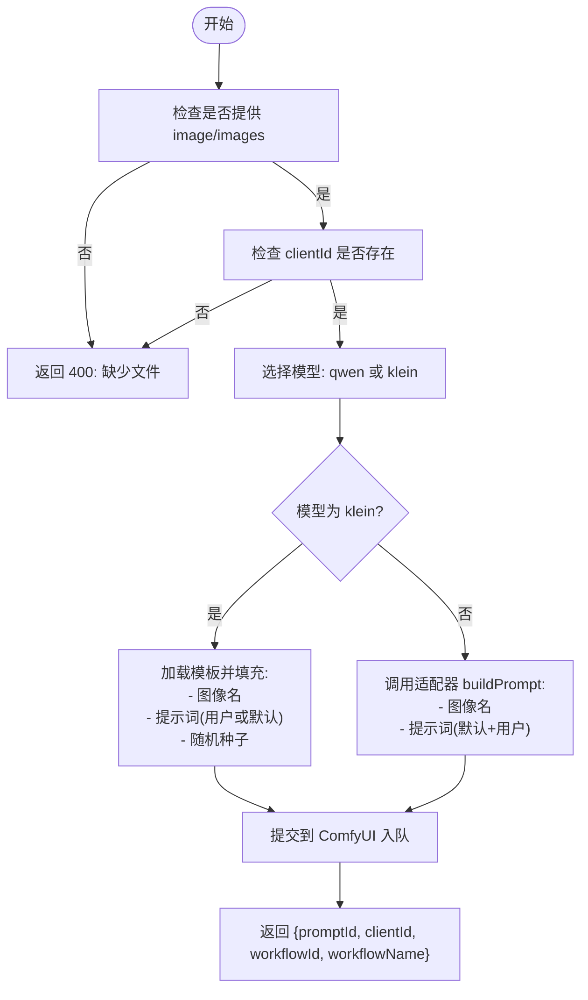
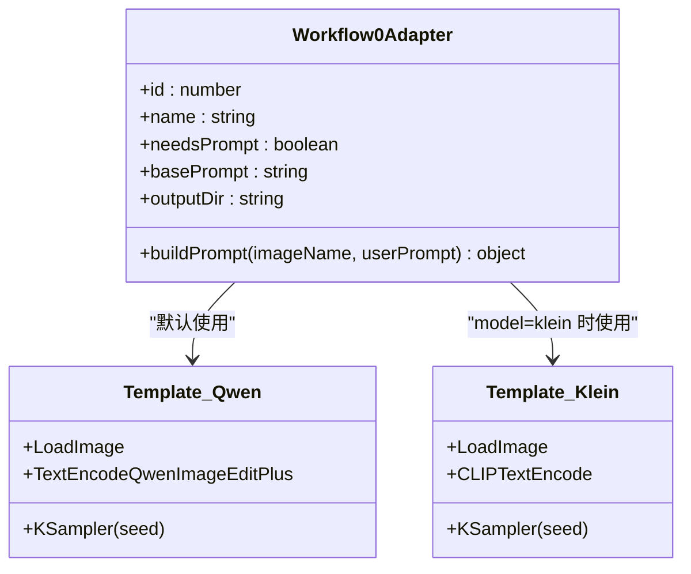
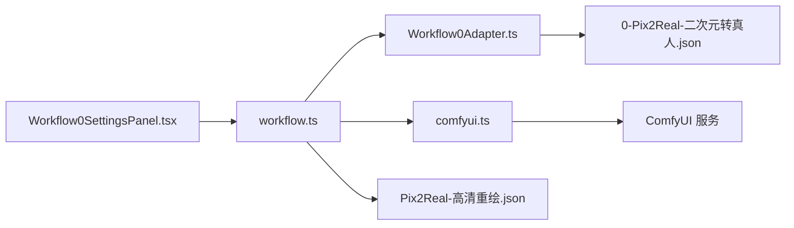

# 二次元转真人工作流 API

<cite>
**本文档引用的文件**
- [server/src/index.ts](file://server/src/index.ts)
- [server/src/routes/workflow.ts](file://server/src/routes/workflow.ts)
- [server/src/adapters/Workflow0Adapter.ts](file://server/src/adapters/Workflow0Adapter.ts)
- [server/src/services/comfyui.ts](file://server/src/services/comfyui.ts)
- [client/src/components/Workflow0SettingsPanel.tsx](file://client/src/components/Workflow0SettingsPanel.tsx)
- [client/src/hooks/useWorkflowStore.ts](file://client/src/hooks/useWorkflowStore.ts)
- [client/src/types/index.ts](file://client/src/types/index.ts)
- [ComfyUI_API/0-Pix2Real-二次元转真人.json](file://ComfyUI_API/0-Pix2Real-二次元转真人.json)
- [ComfyUI_API/Pix2Real-高清重绘.json](file://ComfyUI_API/Pix2Real-高清重绘.json)
- [README.md](file://README.md)
</cite>

## 目录
1. [简介](#简介)
2. [项目结构](#项目结构)
3. [核心组件](#核心组件)
4. [架构总览](#架构总览)
5. [详细组件分析](#详细组件分析)
6. [依赖关系分析](#依赖关系分析)
7. [性能考虑](#性能考虑)
8. [故障排除指南](#故障排除指南)
9. [结论](#结论)
10. [附录](#附录)

## 简介
本文件为“二次元转真人”工作流 API 的权威技术文档，聚焦于 Workflow 0 的执行接口与实现细节。内容涵盖：
- HTTP 接口规范：方法、URL、参数与响应格式
- 支持的模型选择：qwen 默认模型与 klein draw 模型
- 提示词参数传递机制与默认提示词配置
- 文件上传处理流程
- 随机种子生成机制
- 错误处理策略
- 批量处理接口使用方法与注意事项
- 完整调用示例（curl 与 JavaScript fetch）

该系统基于本地 ComfyUI 运行环境，通过 Express 后端桥接 ComfyUI 的 HTTP 与 WebSocket 接口，提供实时进度与输出管理能力。

**章节来源**
- [README.md:1-79](file://README.md#L1-L79)

## 项目结构
后端采用 Express + TypeScript，前端为 Vite + React + TypeScript。核心目录与职责如下：
- server/src：后端服务源码
  - adapters：工作流适配器（每个工作流一个）
  - routes：路由定义（workflow.ts 主要路由）
  - services：ComfyUI 交互封装（HTTP/WS）
- client/src：前端源码
  - components：设置面板等 UI 组件
  - hooks：状态管理与 WebSocket 连接
  - types：类型定义
- ComfyUI_API：工作流 JSON 模板
- output：生成文件输出目录（按工作流分类）



**图表来源**
- [server/src/index.ts:42-61](file://server/src/index.ts#L42-L61)
- [server/src/routes/workflow.ts:22-27](file://server/src/routes/workflow.ts#L22-L27)
- [server/src/adapters/Workflow0Adapter.ts:6-7](file://server/src/adapters/Workflow0Adapter.ts#L6-L7)
- [server/src/services/comfyui.ts:6-7](file://server/src/services/comfyui.ts#L6-L7)

**章节来源**
- [README.md:41-62](file://README.md#L41-L62)

## 核心组件
- Express 应用与静态资源
  - 初始化 CORS、JSON 大小限制、静态目录映射
  - 注册 /api/workflow、/api/output、/api/session 路由
  - 启动 WebSocket 服务器，转发 ComfyUI 事件
- 工作流路由（workflow.ts）
  - 提供工作流列表查询、模型列表查询、队列管理、内存释放等通用接口
  - 实现 Workflow 0 的单图与批量执行接口
- 适配器（Workflow0Adapter.ts）
  - 加载模板 JSON，注入输入图像名、拼接提示词、随机种子
- ComfyUI 服务（comfyui.ts）
  - 封装上传、入队、历史查询、图像下载、系统统计、队列操作、WebSocket 连接
- 前端设置面板（Workflow0SettingsPanel.tsx）
  - 维护 qwen/klein 模型选择的用户偏好

**章节来源**
- [server/src/index.ts:42-61](file://server/src/index.ts#L42-L61)
- [server/src/routes/workflow.ts:29-38](file://server/src/routes/workflow.ts#L29-L38)
- [server/src/adapters/Workflow0Adapter.ts:9-34](file://server/src/adapters/Workflow0Adapter.ts#L9-L34)
- [server/src/services/comfyui.ts:47-60](file://server/src/services/comfyui.ts#L47-L60)
- [client/src/components/Workflow0SettingsPanel.tsx:9-14](file://client/src/components/Workflow0SettingsPanel.tsx#L9-L14)

## 架构总览
后端通过路由层接收请求，根据工作流 ID 选择适配器或直接读取模板，构建 prompt JSON 并提交到 ComfyUI。WebSocket 通道将进度与完成事件回传给前端，完成后自动下载输出并保存到会话目录。



**图表来源**
- [server/src/routes/workflow.ts:312-355](file://server/src/routes/workflow.ts#L312-L355)
- [server/src/adapters/Workflow0Adapter.ts:16-33](file://server/src/adapters/Workflow0Adapter.ts#L16-L33)
- [server/src/services/comfyui.ts:47-60](file://server/src/services/comfyui.ts#L47-L60)

## 详细组件分析

### Workflow 0 执行接口规范
- HTTP 方法与 URL
  - 单图执行：POST /api/workflow/0/execute
  - 批量执行：POST /api/workflow/0/batch
- 请求参数
  - 单图模式
    - 表单字段：image（必填，单文件）
    - 查询参数或 JSON 字段：clientId（必填）
    - JSON 字段：model（可选，默认 qwen；支持 qwen 或 klein）
    - JSON 字段：prompt（可选，追加到默认提示词）
  - 批量模式
    - 表单字段：images（必填，最多 50 张）
    - 查询参数或 JSON 字段：clientId（必填）
    - JSON 字段：prompt（可选，统一提示词）
    - JSON 字段：prompts（可选，字符串数组，长度需与 images 匹配）
- 响应格式
  - 成功：返回 { promptId, clientId, workflowId, workflowName }
  - 失败：返回 { error: string }



**图表来源**
- [server/src/routes/workflow.ts:312-355](file://server/src/routes/workflow.ts#L312-L355)

**章节来源**
- [server/src/routes/workflow.ts:312-355](file://server/src/routes/workflow.ts#L312-L355)

### 模型选择与提示词配置
- 模型选择
  - qwen（默认）：通过适配器加载模板，拼接 basePrompt 与用户提示词
  - klein：直接加载模板，支持自定义提示词或使用内置默认提示词
- 默认提示词
  - qwen 模式：basePrompt 为固定值，用户提示词以逗号追加
  - klein 模式：内置默认提示词，用户提示词为空时使用默认值
- 随机种子
  - qwen 模式：KSampler 节点随机种子范围为 0 到 1125899906842623
  - klein 模式：模板节点随机种子范围为 0 到 4294967295



**图表来源**
- [server/src/adapters/Workflow0Adapter.ts:9-34](file://server/src/adapters/Workflow0Adapter.ts#L9-L34)
- [ComfyUI_API/0-Pix2Real-二次元转真人.json:174-199](file://ComfyUI_API/0-Pix2Real-二次元转真人.json#L174-L199)
- [ComfyUI_API/Pix2Real-高清重绘.json:179-187](file://ComfyUI_API/Pix2Real-高清重绘.json#L179-L187)

**章节来源**
- [server/src/adapters/Workflow0Adapter.ts:16-33](file://server/src/adapters/Workflow0Adapter.ts#L16-L33)
- [server/src/routes/workflow.ts:331-341](file://server/src/routes/workflow.ts#L331-L341)

### 文件上传处理机制
- 单图模式：multipart/form-data，字段名为 image
- 批量模式：multipart/form-data，字段名为 images（最多 50 张）
- 上传流程
  - 将二进制数据上传至 ComfyUI /upload/image
  - 服务端接收返回的文件名（用于后续模板中引用）
- 上传限制
  - 后端 JSON 解析大小限制为 50MB
  - 批量上传最多 50 张图片

**章节来源**
- [server/src/routes/workflow.ts:23-27](file://server/src/routes/workflow.ts#L23-L27)
- [server/src/routes/workflow.ts:457-520](file://server/src/routes/workflow.ts#L457-L520)
- [server/src/services/comfyui.ts:9-25](file://server/src/services/comfyui.ts#L9-L25)

### WebSocket 事件与进度回传
- 客户端连接 /ws，后端分配唯一 clientId 并建立到 ComfyUI 的 WebSocket 连接
- 事件类型
  - execution_start：任务开始
  - progress：进度百分比（value/max）
  - complete：任务完成，携带输出文件信息
  - error：执行错误
- 事件缓冲与重放
  - 对同一 promptId 缓存最近事件，若客户端在任务开始后才注册，将重放已缓存事件

**章节来源**
- [server/src/index.ts:73-219](file://server/src/index.ts#L73-L219)

### 批量处理接口
- URL：POST /api/workflow/:id/batch
- 参数
  - images：多文件表单字段（最多 50 张）
  - clientId：必填
  - prompt 或 prompts：可选
    - prompt：对所有图片使用统一提示词
    - prompts：JSON 数组，逐张图片应用对应提示词
- 响应
  - 返回 { clientId, workflowId, workflowName, tasks: [{ promptId, originalName }] }

**章节来源**
- [server/src/routes/workflow.ts:457-520](file://server/src/routes/workflow.ts#L457-L520)

### 错误处理策略
- 400 错误
  - 缺少文件、缺少 clientId、未知工作流 ID
- 500 错误
  - 上传失败、入队失败、ComfyUI 不可用、内部异常
- 502 错误
  - 获取模型列表、系统统计等接口访问 ComfyUI 失败
- 504 错误
  - 反推提示词/提示词助理超时（超过 180 秒）

**章节来源**
- [server/src/routes/workflow.ts:41-92](file://server/src/routes/workflow.ts#L41-L92)
- [server/src/routes/workflow.ts:151-179](file://server/src/routes/workflow.ts#L151-L179)
- [server/src/routes/workflow.ts:522-539](file://server/src/routes/workflow.ts#L522-L539)
- [server/src/routes/workflow.ts:720-744](file://server/src/routes/workflow.ts#L720-L744)

## 依赖关系分析
- 路由层依赖适配器与 ComfyUI 服务
- 适配器依赖工作流模板 JSON
- WebSocket 事件在后端集中处理并分发给前端
- 前端设置面板影响模型选择，最终体现在请求体中的 model 字段



**图表来源**
- [server/src/routes/workflow.ts:312-355](file://server/src/routes/workflow.ts#L312-L355)
- [server/src/adapters/Workflow0Adapter.ts:6-7](file://server/src/adapters/Workflow0Adapter.ts#L6-L7)
- [ComfyUI_API/0-Pix2Real-二次元转真人.json:1-200](file://ComfyUI_API/0-Pix2Real-二次元转真人.json#L1-L200)
- [ComfyUI_API/Pix2Real-高清重绘.json:1-200](file://ComfyUI_API/Pix2Real-高清重绘.json#L1-L200)

**章节来源**
- [server/src/routes/workflow.ts:312-355](file://server/src/routes/workflow.ts#L312-L355)
- [client/src/components/Workflow0SettingsPanel.tsx:9-14](file://client/src/components/Workflow0SettingsPanel.tsx#L9-L14)

## 性能考虑
- 上传大小限制：后端 JSON 解析限制为 50MB，建议控制单张图片大小
- 批量上限：最多 50 张图片，避免一次性提交过多导致内存压力
- 队列优先级：可通过队列优先级接口将目标任务置顶，减少等待时间
- 内存释放：提供释放内存工作流，降低显存占用
- WebSocket 事件缓冲：避免客户端注册过晚导致进度丢失

[本节为通用指导，不涉及具体文件分析]

## 故障排除指南
- ComfyUI 不可用
  - 确认 ComfyUI 在 http://localhost:8188 正常运行
  - 检查网络连通性与防火墙设置
- 上传失败
  - 检查图片格式与大小是否超出限制
  - 确认 /upload/image 接口可访问
- 入队失败
  - 查看返回的错误信息，确认 clientId 有效
  - 检查模板节点配置是否正确
- 进度无更新
  - 确认 WebSocket 连接正常
  - 检查事件缓冲与重放逻辑是否生效
- 输出缺失
  - 确认任务已完成且后端已下载输出
  - 检查会话输出目录权限

**章节来源**
- [server/src/services/comfyui.ts:47-60](file://server/src/services/comfyui.ts#L47-L60)
- [server/src/index.ts:109-175](file://server/src/index.ts#L109-L175)

## 结论
Workflow 0 的二次元转真人 API 设计清晰，具备完善的模型选择、提示词拼接、文件上传与批量处理能力。通过适配器模式与模板 JSON 的组合，实现了灵活的工作流扩展。配合 WebSocket 实时进度与会话输出管理，满足本地批量图像处理场景的需求。

[本节为总结性内容，不涉及具体文件分析]

## 附录

### API 调用示例

- curl 单图执行（qwen 模型）
  - curl -X POST http://localhost:3000/api/workflow/0/execute \
    -F image=@/path/to/image.png \
    -F clientId=your_client_id \
    -F model=qwen \
    -F prompt="写实风格，高清细节"

- curl 单图执行（klein 模型）
  - curl -X POST http://localhost:3000/api/workflow/0/execute \
    -F image=@/path/to/image.png \
    -F clientId=your_client_id \
    -F model=klein \
    -F prompt="亚洲人，真实照片"

- curl 批量执行
  - curl -X POST http://localhost:3000/api/workflow/0/batch \
    -F images=@/path/to/img1.png \
    -F images=@/path/to/img2.png \
    -F clientId=your_client_id \
    -F prompt="统一提示词"

- JavaScript fetch（单图，qwen）
  ```javascript
  const formData = new FormData();
  formData.append('image', fileInput.files[0]);
  formData.append('clientId', 'your_client_id');
  formData.append('model', 'qwen');
  formData.append('prompt', '写实风格');

  const resp = await fetch('http://localhost:3000/api/workflow/0/execute', {
    method: 'POST',
    body: formData
  });
  const json = await resp.json();
  console.log(json);
  ```

- JavaScript fetch（批量）
  ```javascript
  const formData = new FormData();
  formData.append('images', fileInput1.files[0]);
  formData.append('images', fileInput2.files[0]);
  formData.append('clientId', 'your_client_id');
  formData.append('prompt', '统一提示词');

  const resp = await fetch('http://localhost:3000/api/workflow/0/batch', {
    method: 'POST',
    body: formData
  });
  const json = await resp.json();
  console.log(json);
  ```

**章节来源**
- [server/src/routes/workflow.ts:312-355](file://server/src/routes/workflow.ts#L312-L355)
- [server/src/routes/workflow.ts:457-520](file://server/src/routes/workflow.ts#L457-L520)