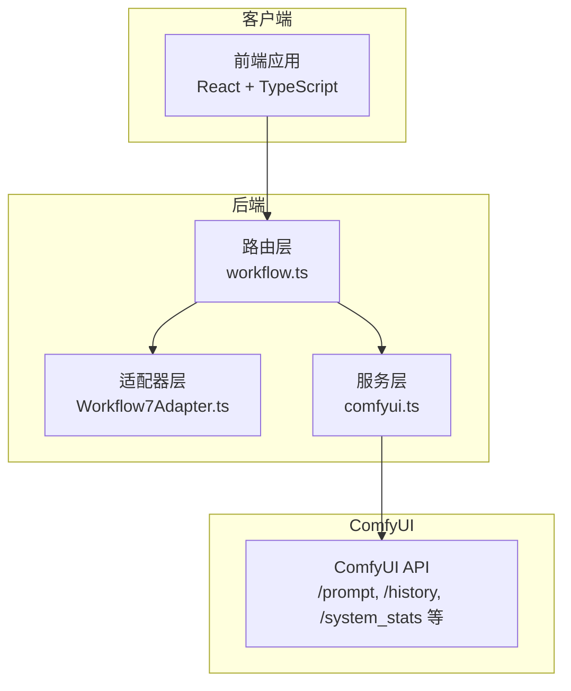
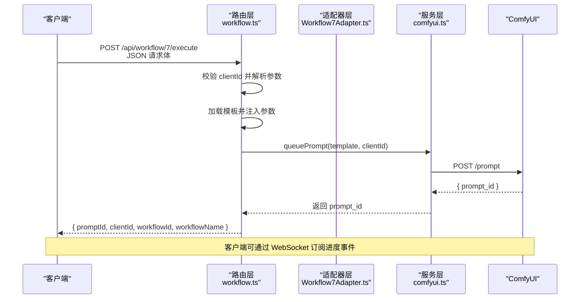
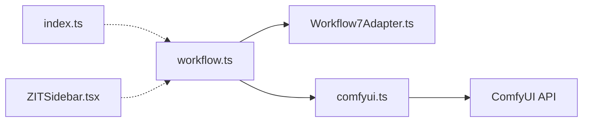

# 快速出图工作流 API

<cite>
**本文档引用的文件**
- [Workflow7Adapter.ts](file://server/src/adapters/Workflow7Adapter.ts)
- [workflow.ts](file://server/src/routes/workflow.ts)
- [comfyui.ts](file://server/src/services/comfyui.ts)
- [Pix2Real-二次元生成.json](file://ComfyUI_API/Pix2Real-二次元生成.json)
- [Pix2Real-ZIT文生图NEW.json](file://ComfyUI_API/Pix2Real-ZIT文生图NEW.json)
- [README.md](file://README.md)
- [index.ts](file://server/src/types/index.ts)
- [ZITSidebar.tsx](file://client/src/components/ZITSidebar.tsx)
- [useWorkflowStore.ts](file://client/src/hooks/useWorkflowStore.ts)
</cite>

## 目录
1. [简介](#简介)
2. [项目结构](#项目结构)
3. [核心组件](#核心组件)
4. [架构总览](#架构总览)
5. [详细组件分析](#详细组件分析)
6. [依赖关系分析](#依赖关系分析)
7. [性能考虑](#性能考虑)
8. [故障排除指南](#故障排除指南)
9. [结论](#结论)
10. [附录](#附录)

## 简介
本文件面向“快速出图工作流 API”的使用者与开发者，系统性说明 Workflow 7（快速出图）的执行接口，包括：
- HTTP 方法、URL 模式、请求参数与响应格式
- 文本到图像生成的完整参数配置：模型选择、尺寸设置、采样器配置、步数与 CFG、随机种子等
- 完整的 API 调用示例与参数组合对生成效果的影响说明
- 模型列表获取接口的使用方法

该系统基于本地 ComfyUI 运行环境，通过 Express 后端路由将前端请求转换为 ComfyUI 可执行的工作流模板，并在完成后返回任务状态与输出文件信息。

## 项目结构
后端采用 Express + TypeScript 架构，核心模块如下：
- 路由层：集中定义所有 API 接口，负责参数解析、模板拼装与调用服务层
- 适配器层：封装各工作流的模板与参数映射逻辑
- 服务层：与 ComfyUI 交互，负责上传文件、入队、查询历史、获取系统统计等
- 类型定义：统一前后端数据结构与事件类型

图表来源
- [workflow.ts:1-862](file://server/src/routes/workflow.ts#L1-L862)
- [Workflow7Adapter.ts:1-14](file://server/src/adapters/Workflow7Adapter.ts#L1-L14)
- [comfyui.ts:1-285](file://server/src/services/comfyui.ts#L1-L285)

章节来源
- [README.md:41-79](file://README.md#L41-L79)

## 核心组件
- 工作流 7 适配器：定义 Workflow 7 的元信息与构建逻辑；注意该工作流通过专用路由执行，不使用通用适配器构建
- 路由处理器：实现 /api/workflow/7/execute 的 POST 接口，解析请求体参数，加载模板，注入参数并入队
- 服务层：封装 ComfyUI 的 HTTP 与 WebSocket 通信，提供上传、入队、历史查询、系统统计等功能
- 类型定义：统一队列响应、历史条目、进度事件等数据结构

章节来源
- [Workflow7Adapter.ts:1-14](file://server/src/adapters/Workflow7Adapter.ts#L1-L14)
- [workflow.ts:94-149](file://server/src/routes/workflow.ts#L94-L149)
- [comfyui.ts:1-285](file://server/src/services/comfyui.ts#L1-L285)
- [index.ts:1-52](file://server/src/types/index.ts#L1-L52)

## 架构总览
下图展示从客户端发起请求到 ComfyUI 执行并返回结果的完整流程。

图表来源
- [workflow.ts:94-149](file://server/src/routes/workflow.ts#L94-L149)
- [comfyui.ts:47-60](file://server/src/services/comfyui.ts#L47-L60)

## 详细组件分析

### 快速出图工作流 API（Workflow 7）
- HTTP 方法与 URL
  - 方法：POST
  - 路径：/api/workflow/7/execute
  - 内容类型：application/json
- 请求参数（JSON Body）
  - clientId: string（必填）
  - model: string（必填，对应 ComfyUI CheckpointLoaderSimple 的模型名称）
  - prompt: string（可选，替换默认提示词；为空则使用模板默认值）
  - width: number（必填，像素）
  - height: number（必填，像素）
  - steps: number（必填，采样步数）
  - cfg: number（必填，引导强度）
  - sampler: string（必填，采样器名称）
  - scheduler: string（必填，调度器名称）
  - name: string（可选，输出文件名前缀）
- 响应字段
  - promptId: string（ComfyUI 任务标识）
  - clientId: string
  - workflowId: number（固定为 7）
  - workflowName: string（固定为“快速出图”）

参数说明与影响
- 模型选择（model）
  - 使用 CheckpointLoaderSimple 节点的 ckpt_name 字段
  - 可通过 /api/workflow/models/checkpoints 获取可用模型列表
- 尺寸设置（width/height）
  - 通过 EmptyLatentImage 节点设置
  - 影响生成分辨率与显存占用
- 采样器与调度器（sampler/scheduler）
  - 通过 KSampler 节点配置
  - 不同采样器与调度器组合会影响生成速度与质量
- 步数与 CFG（steps/cfg）
  - 步数越高通常越耗时但可能更稳定
  - CFG 值越大越贴近提示词，但过高可能导致过度拟合或伪影
- 随机种子（seed）
  - 由后端自动生成（0 到某个上限之间的随机整数），确保每次请求的种子不同
- 输出文件名（name）
  - 通过 SaveImage 节点的 filename_prefix 设置

错误处理
- 缺少 clientId：返回 400 错误
- ComfyUI 入队失败：抛出异常并返回 500
- 模板加载失败：抛出异常并返回 500

章节来源
- [workflow.ts:94-149](file://server/src/routes/workflow.ts#L94-L149)
- [Pix2Real-二次元生成.json:1-145](file://ComfyUI_API/Pix2Real-二次元生成.json#L1-L145)
- [comfyui.ts:228-235](file://server/src/services/comfyui.ts#L228-L235)

### 模型列表获取接口
- 获取 Checkpoint 模型列表
  - 方法：GET
  - 路径：/api/workflow/models/checkpoints
  - 响应：字符串数组（模型名称列表）
- 获取 UNET 模型列表
  - 方法：GET
  - 路径：/api/workflow/models/unets
  - 响应：字符串数组（模型名称列表）
- 获取 LoRA 模型列表
  - 方法：GET
  - 路径：/api/workflow/models/loras
  - 响应：字符串数组（模型名称列表）

章节来源
- [workflow.ts:151-179](file://server/src/routes/workflow.ts#L151-L179)
- [comfyui.ts:228-253](file://server/src/services/comfyui.ts#L228-L253)

### 采样器与调度器配置参考
- 采样器（sampler）常见取值
  - euler, euler_ancestral, dpm_2m, res_multistep_ancestral 等
- 调度器（scheduler）常见取值
  - simple, exponential, ddim_uniform, beta, normal 等
- 步数（steps）与 CFG（cfg）范围建议
  - 步数：4–50（根据显存与时间权衡）
  - CFG：1–12（数值越大越贴合提示词）

章节来源
- [ZITSidebar.tsx:16-29](file://client/src/components/ZITSidebar.tsx#L16-L29)

### API 调用示例与参数组合影响
以下示例展示如何调用快速出图接口，以及参数组合对生成效果的影响。

- 示例一：基础调用
  - 请求体
    - clientId: "abc123"
    - model: "XL-漫画2.5D\\IL-Gembyte_20Emerald.safetensors"
    - prompt: "masterpiece, best quality, ultra high res, hyper-detailed, anime realism, 8K, newest"
    - width: 832
    - height: 1216
    - steps: 30
    - cfg: 6
    - sampler: "euler_ancestral"
    - scheduler: "normal"
    - name: "my_img"
  - 影响说明
    - 该组合偏向高质量二次元风格，适合动漫人物生成
    - 较高的 CFG 会增强提示词约束，但需避免过高导致失真
    - 步数与分辨率平衡显存占用与质量

- 示例二：高分辨率与精细步数
  - 请求体
    - width: 1024
    - height: 1024
    - steps: 40
    - cfg: 7
    - sampler: "euler"
    - scheduler: "simple"
  - 影响说明
    - 更高的分辨率与步数提升细节，但显著增加显存与时间消耗
    - 适合对画质要求极高的场景

- 示例三：强调细节与稳定性
  - 请求体
    - sampler: "dpm_2m"
    - scheduler: "beta"
    - steps: 25
    - cfg: 5.5
  - 影响说明
    - DPM 系列采样器通常更稳定，适合追求一致性的批量生成

- 示例四：使用自定义提示词
  - 请求体
    - prompt: "realistic portrait, photorealistic, detailed skin texture, cinematic lighting"
  - 影响说明
    - 自定义提示词会覆盖模板中的默认提示词，直接影响生成主题与风格

章节来源
- [workflow.ts:94-149](file://server/src/routes/workflow.ts#L94-L149)
- [Pix2Real-二次元生成.json:1-145](file://ComfyUI_API/Pix2Real-二次元生成.json#L1-L145)

## 依赖关系分析
- 路由层依赖适配器层与服务层
- 服务层依赖 ComfyUI 的 HTTP 接口与 WebSocket
- 类型定义贯穿前后端，保证数据一致性

图表来源
- [workflow.ts:1-862](file://server/src/routes/workflow.ts#L1-L862)
- [Workflow7Adapter.ts:1-14](file://server/src/adapters/Workflow7Adapter.ts#L1-L14)
- [comfyui.ts:1-285](file://server/src/services/comfyui.ts#L1-L285)
- [index.ts:1-52](file://server/src/types/index.ts#L1-L52)
- [ZITSidebar.tsx:1-635](file://client/src/components/ZITSidebar.tsx#L1-L635)

## 性能考虑
- 显存与时间权衡
  - 分辨率与步数是主要变量；高分辨率与高步数显著增加显存占用与生成时间
- 采样器选择
  - 不同采样器在速度与稳定性上存在差异，可根据场景选择
- 并发与队列
  - 合理利用队列优先级与取消功能，避免长时间阻塞
- 模型加载
  - 模型列表接口可用于预热与缓存，减少运行时等待

## 故障排除指南
- 常见错误
  - 缺少 clientId：检查请求头或请求体中的 clientId 字段
  - ComfyUI 不可用：确认 ComfyUI 在 http://127.0.0.1:8188 运行
  - 模型不存在：通过 /api/workflow/models/checkpoints 获取可用模型列表
- 日志与调试
  - 后端会在错误时记录详细日志，便于定位问题
  - 前端可通过 WebSocket 订阅进度事件，实时监控任务状态

章节来源
- [workflow.ts:145-148](file://server/src/routes/workflow.ts#L145-L148)
- [comfyui.ts:106-125](file://server/src/services/comfyui.ts#L106-L125)

## 结论
快速出图工作流 API 提供了简洁而强大的文本到图像生成能力。通过合理配置模型、尺寸、采样器与步数等参数，可在质量与效率之间取得最佳平衡。结合模型列表接口与队列管理功能，可满足从个人创作到批量生产的多样化需求。

## 附录

### API 定义汇总
- 快速出图执行接口
  - 方法：POST
  - 路径：/api/workflow/7/execute
  - 请求体字段：clientId, model, prompt, width, height, steps, cfg, sampler, scheduler, name
  - 响应字段：promptId, clientId, workflowId, workflowName
- 模型列表接口
  - GET /api/workflow/models/checkpoints
  - GET /api/workflow/models/unets
  - GET /api/workflow/models/loras

章节来源
- [workflow.ts:94-149](file://server/src/routes/workflow.ts#L94-L149)
- [workflow.ts:151-179](file://server/src/routes/workflow.ts#L151-L179)