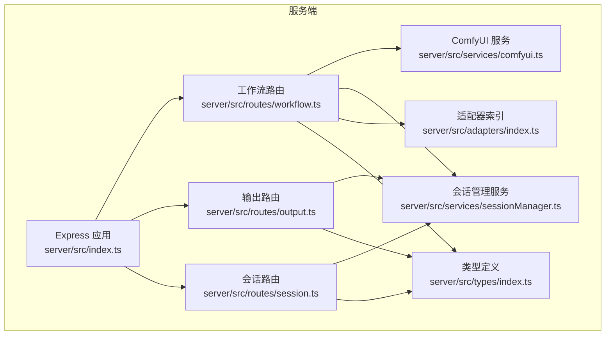
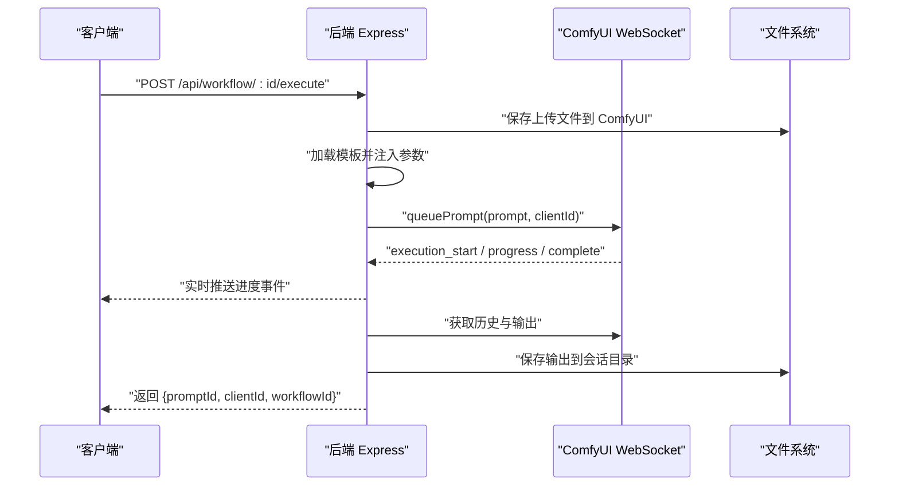
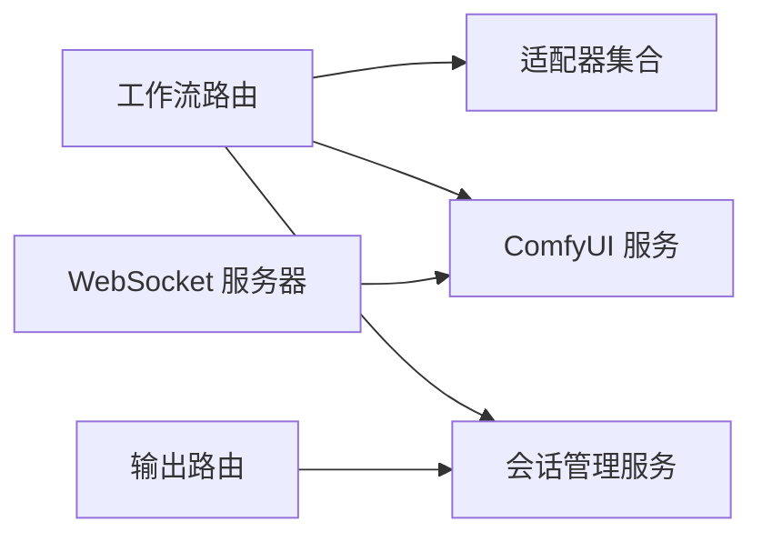

# 核心工作流 API

<cite>
**本文引用的文件**
- [server/src/index.ts](file://server/src/index.ts)
- [server/src/route/workflow.ts](file://server/src/routes/workflow.ts)
- [server/src/services/comfyui.ts](file://server/src/services/comfyui.ts)
- [server/src/services/sessionManager.ts](file://server/src/services/sessionManager.ts)
- [server/src/adapters/index.ts](file://server/src/adapters/index.ts)
- [server/src/adapters/Workflow0Adapter.ts](file://server/src/adapters/Workflow0Adapter.ts)
- [server/src/adapters/Workflow1Adapter.ts](file://server/src/adapters/Workflow1Adapter.ts)
- [server/src/adapters/Workflow2Adapter.ts](file://server/src/adapters/Workflow2Adapter.ts)
- [server/src/adapters/Workflow3Adapter.ts](file://server/src/adapters/Workflow3Adapter.ts)
- [server/src/adapters/Workflow5Adapter.ts](file://server/src/adapters/Workflow5Adapter.ts)
- [server/src/types/index.ts](file://server/src/types/index.ts)
- [server/src/routes/output.ts](file://server/src/routes/output.ts)
- [server/src/routes/session.ts](file://server/src/routes/session.ts)
- [README.md](file://README.md)
</cite>

## 目录
1. [简介](#简介)
2. [项目结构](#项目结构)
3. [核心组件](#核心组件)
4. [架构总览](#架构总览)
5. [详细组件分析](#详细组件分析)
6. [依赖分析](#依赖分析)
7. [性能考虑](#性能考虑)
8. [故障排除指南](#故障排除指南)
9. [结论](#结论)
10. [附录](#附录)

## 简介
本文件面向后端服务与前端集成开发者，系统性梳理核心工作流 API 的设计与实现，覆盖以下工作流的完整执行接口：
- 二次元转真人（Workflow 0）
- 真人精修（Workflow 1）
- 精修放大（Workflow 2）
- 解除装备（Workflow 5）
- 真人转二次元（Workflow 3）

内容涵盖：HTTP 方法与 URL 模式、请求参数、响应格式、文件上传处理、提示词参数传递、客户端 ID 管理、错误处理机制、调用示例（curl 与 JavaScript fetch）、工作流 ID 映射、参数验证规则、超时处理策略等。

## 项目结构
后端采用 Express + TypeScript 构建，核心模块如下：
- 路由层：工作流路由、输出路由、会话路由
- 服务层：ComfyUI 交互服务、会话管理服务
- 适配器层：按工作流拆分的模板适配器，负责将上传资源注入到 ComfyUI JSON 模板中
- 类型定义：统一的事件与数据结构类型



图表来源
- [server/src/index.ts:42-61](file://server/src/index.ts#L42-L61)
- [server/src/routes/workflow.ts:1-28](file://server/src/routes/workflow.ts#L1-L28)
- [server/src/routes/output.ts:11-134](file://server/src/routes/output.ts#L11-L134)
- [server/src/routes/session.ts:15-95](file://server/src/routes/session.ts#L15-L95)
- [server/src/services/comfyui.ts:1-285](file://server/src/services/comfyui.ts#L1-L285)
- [server/src/services/sessionManager.ts:1-164](file://server/src/services/sessionManager.ts#L1-L164)
- [server/src/adapters/index.ts:13-28](file://server/src/adapters/index.ts#L13-L28)
- [server/src/types/index.ts:1-52](file://server/src/types/index.ts#L1-L52)

章节来源
- [README.md:41-79](file://README.md#L41-L79)
- [server/src/index.ts:42-61](file://server/src/index.ts#L42-L61)

## 核心组件
- 工作流路由：集中处理所有工作流的执行、队列、统计、模型列表等 HTTP 接口
- ComfyUI 服务：封装上传图像/视频、入队、历史查询、进度/完成事件订阅、系统统计、队列优先级调整等
- 会话管理服务：会话目录结构、输入/输出/遮罩保存、状态持久化、会话列表与清理
- 适配器：按工作流加载模板 JSON，并注入上传后的文件名、提示词、随机种子等参数
- 类型定义：统一的事件、队列项、历史条目、输出文件等类型

章节来源
- [server/src/routes/workflow.ts:1-800](file://server/src/routes/workflow.ts#L1-L800)
- [server/src/services/comfyui.ts:1-285](file://server/src/services/comfyui.ts#L1-L285)
- [server/src/services/sessionManager.ts:1-164](file://server/src/services/sessionManager.ts#L1-L164)
- [server/src/adapters/index.ts:13-28](file://server/src/adapters/index.ts#L13-L28)
- [server/src/types/index.ts:1-52](file://server/src/types/index.ts#L1-L52)

## 架构总览
后端通过 WebSocket 与 ComfyUI 实时通信，将进度、完成、错误事件转发给浏览器；同时提供 REST API 完成文件上传、模板注入、任务入队与结果下载。



图表来源
- [server/src/routes/workflow.ts:407-455](file://server/src/routes/workflow.ts#L407-L455)
- [server/src/services/comfyui.ts:47-60](file://server/src/services/comfyui.ts#L47-L60)
- [server/src/index.ts:73-219](file://server/src/index.ts#L73-L219)

## 详细组件分析

### 工作流 ID 映射与通用约定
- 工作流 ID 到名称与输出目录的映射由适配器与路由共同维护
- 通用字段：clientId（必填）、prompt（可选，按工作流是否需要提示词而定）、seed 随机化、模板节点参数注入

章节来源
- [server/src/adapters/Workflow0Adapter.ts:9-34](file://server/src/adapters/Workflow0Adapter.ts#L9-L34)
- [server/src/adapters/Workflow1Adapter.ts:9-35](file://server/src/adapters/Workflow1Adapter.ts#L9-L35)
- [server/src/adapters/Workflow2Adapter.ts:9-27](file://server/src/adapters/Workflow2Adapter.ts#L9-L27)
- [server/src/adapters/Workflow3Adapter.ts:9-32](file://server/src/adapters/Workflow3Adapter.ts#L9-L32)
- [server/src/adapters/Workflow5Adapter.ts:4-14](file://server/src/adapters/Workflow5Adapter.ts#L4-L14)
- [server/src/routes/workflow.ts:29-38](file://server/src/routes/workflow.ts#L29-L38)

### 二次元转真人（Workflow 0）
- HTTP 方法与 URL
  - POST /api/workflow/0/execute
- 请求方式
  - 单文件上传：multipart/form-data，字段名为 image
  - 查询参数或请求体字段：clientId（必填），prompt（可选），model（可选，默认 qwen；支持 klein）
- 参数说明
  - image：二进制图片文件
  - clientId：客户端标识符（必填）
  - prompt：用户提示词（可选，为空则使用模板默认提示词）
  - model：模型选择（可选，'qwen' 或 'klein'）
- 响应
  - 返回 promptId、clientId、workflowId、workflowName
- 文件上传与模板注入
  - 先上传图片至 ComfyUI，再根据 model 加载对应模板，设置 LoadImage 节点与提示词节点，最后随机化种子
- 错误处理
  - 缺少文件、缺少 clientId、模板解析失败、ComfyUI 入队失败均返回 4xx/5xx 并包含错误信息
- 超时与进度
  - 通过 WebSocket 实时接收进度与完成事件；完成后从 ComfyUI 下载输出并保存到会话目录

章节来源
- [server/src/routes/workflow.ts:312-355](file://server/src/routes/workflow.ts#L312-L355)
- [server/src/adapters/Workflow0Adapter.ts:16-33](file://server/src/adapters/Workflow0Adapter.ts#L16-L33)
- [server/src/services/comfyui.ts:9-25](file://server/src/services/comfyui.ts#L9-L25)

### 真人精修（Workflow 1）
- HTTP 方法与 URL
  - POST /api/workflow/1/execute
- 请求方式
  - 单文件上传：multipart/form-data，字段名为 image
  - 查询参数或请求体字段：clientId（必填），prompt（可选）
- 参数说明
  - image：二进制图片文件
  - clientId：客户端标识符（必填）
  - prompt：用户提示词（可选，为空则使用模板默认提示词）
- 响应
  - 返回 promptId、clientId、workflowId、workflowName
- 模板注入
  - 设置 LoadImage 节点与 CLIP 文本编码节点，拼接 basePrompt 与用户提示词，随机化种子
- 错误处理
  - 同上

章节来源
- [server/src/routes/workflow.ts:407-455](file://server/src/routes/workflow.ts#L407-L455)
- [server/src/adapters/Workflow1Adapter.ts:16-34](file://server/src/adapters/Workflow1Adapter.ts#L16-L34)

### 精修放大（Workflow 2）
- HTTP 方法与 URL
  - POST /api/workflow/2/execute
- 请求方式
  - 单文件上传：multipart/form-data，字段名为 image
  - 查询参数或请求体字段：clientId（必填），model（可选，默认 seedvr2；支持 klein、sd）
- 参数说明
  - image：二进制图片文件
  - clientId：客户端标识符（必填）
  - model：模型选择（可选，'seedvr2'、'klein'、'sd'）
- 响应
  - 返回 promptId、clientId、workflowId、workflowName
- 模板注入
  - 根据 model 选择不同模板，设置 LoadImage 节点与随机种子
- 错误处理
  - 同上

章节来源
- [server/src/routes/workflow.ts:357-405](file://server/src/routes/workflow.ts#L357-L405)
- [server/src/adapters/Workflow2Adapter.ts:16-26](file://server/src/adapters/Workflow2Adapter.ts#L16-L26)

### 解除装备（Workflow 5）
- HTTP 方法与 URL
  - POST /api/workflow/5/execute
- 请求方式
  - 双文件上传：multipart/form-data，字段名为 image（原图）与 mask（遮罩）
  - 查询参数或请求体字段：clientId（必填），prompt（可选），backPose（可选布尔值）
- 参数说明
  - image：原图二进制文件
  - mask：遮罩二进制文件
  - clientId：客户端标识符（必填）
  - prompt：用户提示词（可选）
  - backPose：是否启用背面姿态（可选）
- 响应
  - 返回 promptId、clientId、workflowId、workflowName
- 模板注入
  - 专用模板路径，设置原图与遮罩文件名、布尔参数、随机种子；prompt 为空则保留模板默认
- 错误处理
  - 同上

章节来源
- [server/src/routes/workflow.ts:40-92](file://server/src/routes/workflow.ts#L40-L92)
- [server/src/adapters/Workflow5Adapter.ts:11-13](file://server/src/adapters/Workflow5Adapter.ts#L11-L13)

### 真人转二次元（Workflow 3）
- HTTP 方法与 URL
  - POST /api/workflow/3/execute
- 请求方式
  - 单文件上传：multipart/form-data，字段名为 image
  - 查询参数或请求体字段：clientId（必填），prompt（可选）
- 参数说明
  - image：二进制图片文件
  - clientId：客户端标识符（必填）
  - prompt：用户提示词（可选，为空则使用模板默认提示词）
- 响应
  - 返回 promptId、clientId、workflowId、workflowName
- 模板注入
  - 设置 LoadImage 节点与提示词节点，用户提示词替换模板中的完整提示词
- 错误处理
  - 同上

章节来源
- [server/src/routes/workflow.ts:407-455](file://server/src/routes/workflow.ts#L407-L455)
- [server/src/adapters/Workflow3Adapter.ts:16-31](file://server/src/adapters/Workflow3Adapter.ts#L16-L31)

### 批量执行（Workflow N）
- HTTP 方法与 URL
  - POST /api/workflow/:id/batch
- 请求方式
  - 多文件上传：multipart/form-data，字段名为 images（最多 50 张）
  - 查询参数或请求体字段：clientId（必填），prompt（可选，或 prompts 为 JSON 数组逐张指定）
- 响应
  - 返回 clientId、workflowId、workflowName、tasks（每项含 promptId 与原始文件名）
- 错误处理
  - 同上

章节来源
- [server/src/routes/workflow.ts:457-520](file://server/src/routes/workflow.ts#L457-L520)

### 通用接口（队列与系统）
- 获取工作流列表
  - GET /api/workflow/
- 获取模型列表
  - GET /api/workflow/models/checkpoints
  - GET /api/workflow/models/unets
  - GET /api/workflow/models/loras
- 队列操作
  - GET /api/workflow/queue
  - POST /api/workflow/queue/prioritize/:promptId
  - POST /api/workflow/cancel-queue/:promptId
- 系统统计
  - GET /api/workflow/system-stats
- 内存释放
  - POST /api/workflow/release-memory

章节来源
- [server/src/routes/workflow.ts:29-38](file://server/src/routes/workflow.ts#L29-L38)
- [server/src/routes/workflow.ts:151-179](file://server/src/routes/workflow.ts#L151-L179)
- [server/src/routes/workflow.ts:522-579](file://server/src/routes/workflow.ts#L522-L579)
- [server/src/routes/workflow.ts:532-540](file://server/src/routes/workflow.ts#L532-L540)
- [server/src/routes/workflow.ts:542-559](file://server/src/routes/workflow.ts#L542-L559)

### 输出与会话
- 输出文件浏览
  - GET /api/output/:workflowId
  - GET /api/output/:workflowId/:filename
  - POST /api/output/open-file
- 会话管理
  - POST /api/session/:sessionId/images
  - POST /api/session/:sessionId/masks
  - PUT /api/session/:sessionId/state
  - POST /api/session/:sessionId/state
  - GET /api/session/:sessionId
  - GET /api/sessions
  - DELETE /api/session/:sessionId

章节来源
- [server/src/routes/output.ts:22-134](file://server/src/routes/output.ts#L22-L134)
- [server/src/routes/session.ts:18-95](file://server/src/routes/session.ts#L18-L95)

### WebSocket 进度与完成事件
- 事件类型
  - execution_start：开始执行
  - progress：进度百分比
  - complete：完成，包含输出文件列表
  - error：错误
- 客户端注册
  - 客户端连接后需发送注册消息，包含 promptId、workflowId、sessionId、tabId，以便完成后回传输出文件链接

章节来源
- [server/src/index.ts:73-219](file://server/src/index.ts#L73-L219)
- [server/src/types/index.ts:10-30](file://server/src/types/index.ts#L10-L30)

## 依赖分析
- 路由依赖适配器与 ComfyUI 服务
- 适配器依赖模板 JSON 文件
- 输出路由依赖会话管理服务进行文件访问
- WebSocket 事件依赖 ComfyUI 服务的连接与历史查询



图表来源
- [server/src/routes/workflow.ts:7-10](file://server/src/routes/workflow.ts#L7-L10)
- [server/src/adapters/index.ts:13-28](file://server/src/adapters/index.ts#L13-L28)
- [server/src/services/comfyui.ts:127-188](file://server/src/services/comfyui.ts#L127-L188)
- [server/src/services/sessionManager.ts:34-44](file://server/src/services/sessionManager.ts#L34-L44)
- [server/src/index.ts:63-219](file://server/src/index.ts#L63-L219)

## 性能考虑
- 图像/视频上传采用内存存储（multer.memoryStorage），建议控制单次批量大小与文件尺寸，避免内存峰值过高
- WebSocket 事件缓冲与重放机制确保客户端在任务开始前连接也能收到历史事件
- 队列优先级调整通过重新入队实现，注意对长队列的影响
- 系统统计接口用于监控 VRAM/内存占用，便于动态调度

章节来源
- [server/src/routes/workflow.ts:23-27](file://server/src/routes/workflow.ts#L23-L27)
- [server/src/index.ts:83-90](file://server/src/index.ts#L83-L90)
- [server/src/services/comfyui.ts:255-284](file://server/src/services/comfyui.ts#L255-L284)

## 故障排除指南
- 400 错误
  - 缺少必需字段（如 image、mask、clientId、prompt 等）
  - 未知工作流 ID
- 500/502/504 错误
  - ComfyUI 不可用或接口调用失败
  - 提示词反推/提示词助理超时（默认 180 秒）
- 常见排查步骤
  - 确认 ComfyUI 在 http://127.0.0.1:8188 正常运行
  - 检查 clientId 是否正确传递并在 WebSocket 注册
  - 使用 GET /api/workflow/system-stats 监控资源使用
  - 使用 GET /api/workflow/queue 查看队列状态

章节来源
- [server/src/routes/workflow.ts:407-455](file://server/src/routes/workflow.ts#L407-L455)
- [server/src/routes/workflow.ts:674-744](file://server/src/routes/workflow.ts#L674-L744)
- [server/src/services/comfyui.ts:106-125](file://server/src/services/comfyui.ts#L106-L125)
- [server/src/services/comfyui.ts:202-221](file://server/src/services/comfyui.ts#L202-L221)

## 结论
该 API 体系以适配器模式解耦工作流模板与执行逻辑，结合 ComfyUI 的队列与 WebSocket 事件，实现了稳定、可扩展的本地图像/视频处理服务。通过明确的参数规范、错误处理与超时策略，能够满足批量与实时场景的需求。

## 附录

### API 调用示例

- curl 示例（二次元转真人）
  - curl -X POST http://localhost:3000/api/workflow/0/execute -F image=@input.png -F clientId="your_client_id" -F prompt="增强细节，保持色调一致"
- curl 示例（解除装备）
  - curl -X POST http://localhost:3000/api/workflow/5/execute -F image=@img.png -F mask=@mask.png -F clientId="your_client_id" -F backPose=true
- curl 示例（批量执行）
  - curl -X POST http://localhost:3000/api/workflow/2/batch -F images=@img1.png -F images=@img2.png -F clientId="your_client_id"

- JavaScript fetch 示例（二次元转真人）
  - ```js
    const formData = new FormData();
    formData.append("image", fileInput.files[0]);
    formData.append("clientId", "your_client_id");
    formData.append("prompt", "增强细节，保持色调一致");
    const resp = await fetch("http://localhost:3000/api/workflow/0/execute", {
      method: "POST",
      body: formData,
    });
    const data = await resp.json();
    console.log(data);
    ```

- JavaScript fetch 示例（解除装备）
  - ```js
    const formData = new FormData();
    formData.append("image", imageFile);
    formData.append("mask", maskFile);
    formData.append("clientId", "your_client_id");
    formData.append("backPose", "true");
    const resp = await fetch("http://localhost:3000/api/workflow/5/execute", {
      method: "POST",
      body: formData,
    });
    const data = await resp.json();
    console.log(data);
    ```

- WebSocket 客户端注册
  - 连接 ws://localhost:3000/ws 后发送注册消息：
  - {"type":"register","promptId":"...","workflowId":0,"sessionId":"...","tabId":0}

章节来源
- [server/src/routes/workflow.ts:40-92](file://server/src/routes/workflow.ts#L40-L92)
- [server/src/routes/workflow.ts:312-355](file://server/src/routes/workflow.ts#L312-L355)
- [server/src/routes/workflow.ts:457-520](file://server/src/routes/workflow.ts#L457-L520)
- [server/src/index.ts:192-213](file://server/src/index.ts#L192-L213)