# 真人精修工作流 API

<cite>
**本文档引用的文件**
- [Workflow1Adapter.ts](file://server/src/adapters/Workflow1Adapter.ts)
- [workflow.ts](file://server/src/routes/workflow.ts)
- [index.ts](file://server/src/adapters/index.ts)
- [index.ts](file://server/src/types/index.ts)
- [Pix2Real-真人精修.json](file://ComfyUI_API/Pix2Real-真人精修.json)
- [Pix2Real-👻真人精修NEW.json](file://ComfyUI_API/Pix2Real-👻真人精修NEW.json)
- [comfyui.ts](file://server/src/services/comfyui.ts)
- [README.md](file://README.md)
</cite>

## 目录
1. [简介](#简介)
2. [项目结构](#项目结构)
3. [核心组件](#核心组件)
4. [架构概览](#架构概览)
5. [详细组件分析](#详细组件分析)
6. [依赖关系分析](#依赖关系分析)
7. [性能考虑](#性能考虑)
8. [故障排除指南](#故障排除指南)
9. [结论](#结论)

## 简介

真人精修工作流是 CorineKit Pix2Real 项目中的一个核心功能模块，专门用于将动漫风格的图像转换为高度逼真的真人照片。该工作流基于 ComfyUI 架构，通过智能的提示词处理机制和先进的图像处理算法，实现从二次元到三次元的高质量转换。

本工作流具有以下特点：
- **智能提示词处理**：结合基础提示词和用户自定义提示词
- **自动化图像处理**：集成图像分割、遮罩处理和颜色匹配
- **批量处理支持**：支持单张和批量图像处理
- **实时进度监控**：通过 WebSocket 实时反馈处理进度

## 项目结构

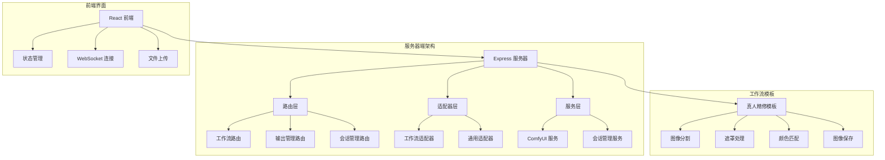

**图表来源**
- [workflow.ts:1-862](file://server/src/routes/workflow.ts#L1-L862)
- [index.ts:1-31](file://server/src/adapters/index.ts#L1-L31)

**章节来源**
- [README.md:41-79](file://README.md#L41-L79)

## 核心组件

### 工作流适配器

工作流适配器模式是该系统的核心设计模式，每个工作流都有对应的适配器类来处理特定的业务逻辑。

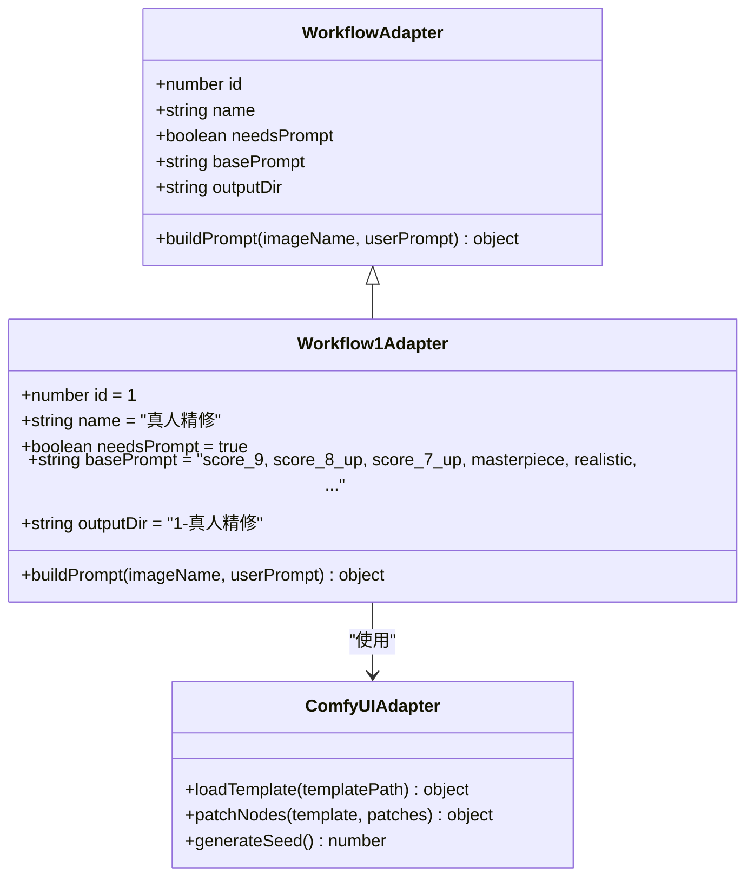

**图表来源**
- [Workflow1Adapter.ts:9-35](file://server/src/adapters/Workflow1Adapter.ts#L9-L35)
- [index.ts:1-8](file://server/src/types/index.ts#L1-L8)

### 路由处理器

路由层负责处理 HTTP 请求，验证参数并调用相应的适配器进行处理。

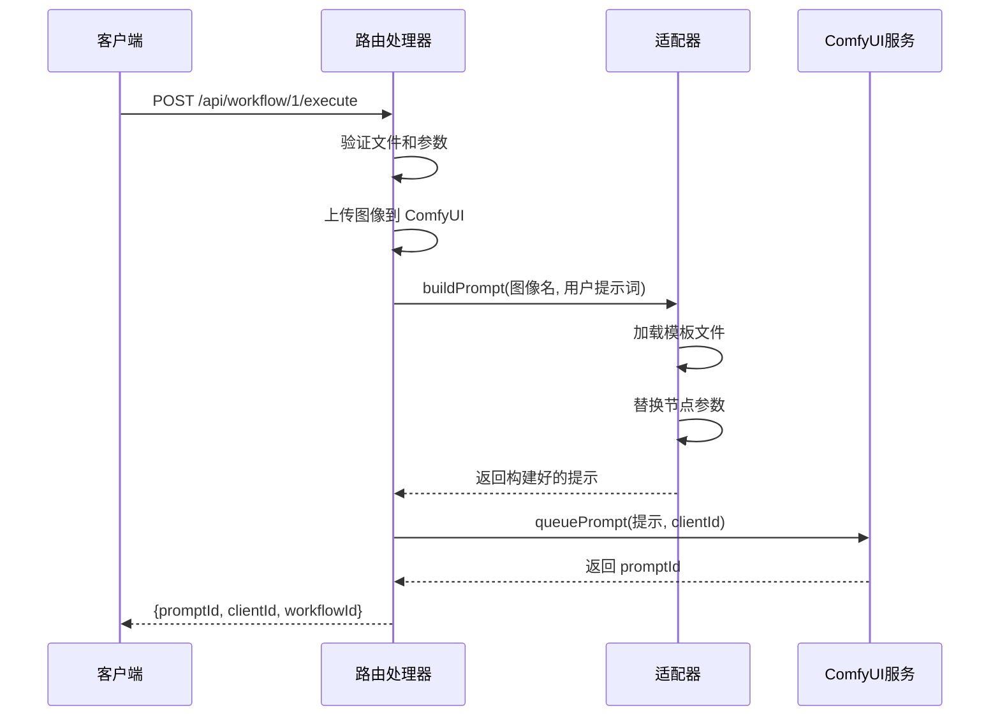

**图表来源**
- [workflow.ts:407-455](file://server/src/routes/workflow.ts#L407-L455)
- [Workflow1Adapter.ts:16-34](file://server/src/adapters/Workflow1Adapter.ts#L16-L34)

**章节来源**
- [Workflow1Adapter.ts:1-36](file://server/src/adapters/Workflow1Adapter.ts#L1-L36)
- [workflow.ts:407-455](file://server/src/routes/workflow.ts#L407-L455)

## 架构概览

真人精修工作流采用分层架构设计，确保了良好的可维护性和扩展性：

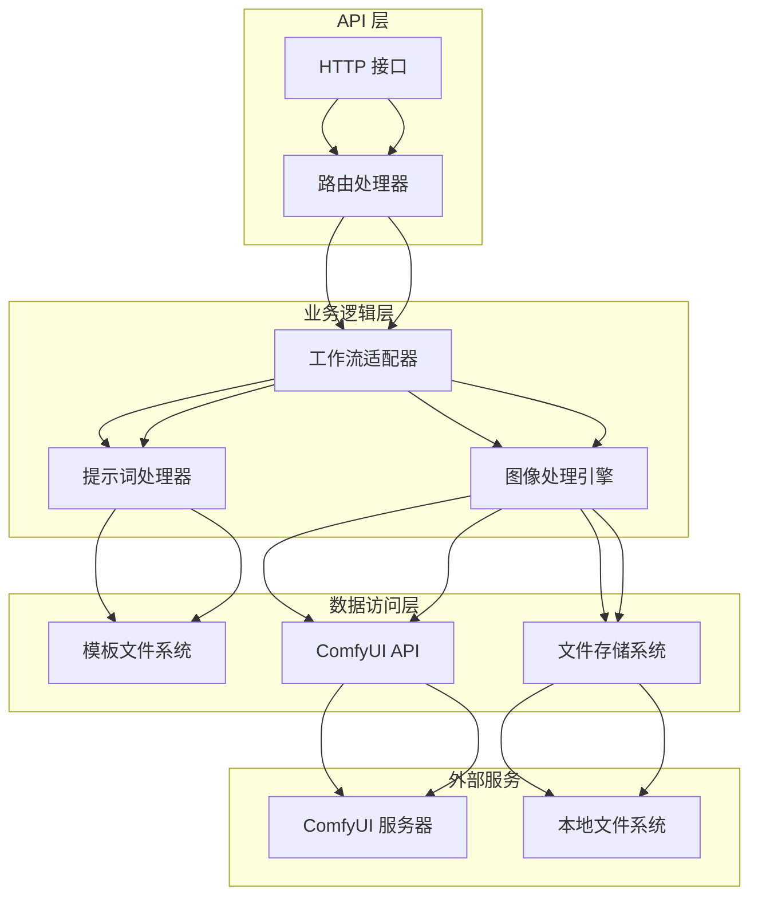

**图表来源**
- [workflow.ts:1-862](file://server/src/routes/workflow.ts#L1-L862)
- [comfyui.ts:1-200](file://server/src/services/comfyui.ts#L1-L200)

## 详细组件分析

### 真人精修工作流执行接口

#### HTTP 接口规范

| 属性 | 详情 |
|------|------|
| **方法** | POST |
| **路径** | `/api/workflow/1/execute` |
| **内容类型** | `multipart/form-data` |
| **认证** | 需要 `clientId` 参数 |

#### 请求参数

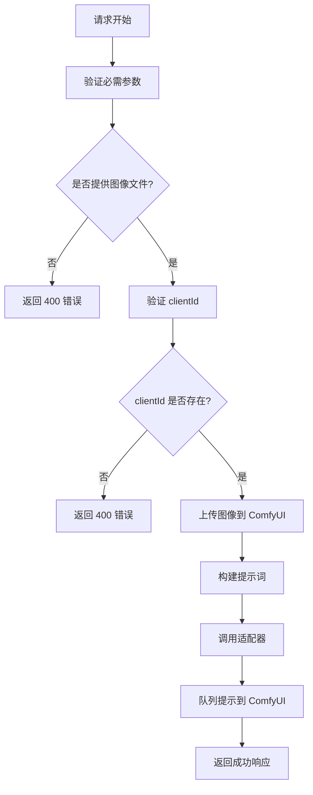

**图表来源**
- [workflow.ts:407-455](file://server/src/routes/workflow.ts#L407-L455)

#### 特殊参数配置

真人精修工作流具有以下特殊参数：

| 参数名称 | 类型 | 必需 | 默认值 | 描述 |
|----------|------|------|--------|------|
| `image` | 文件 | 是 | - | 输入的动漫风格图像文件 |
| `prompt` | 字符串 | 否 | 空字符串 | 用户自定义提示词，将与基础提示词合并 |
| `clientId` | 字符串 | 是 | - | 客户端标识符，用于 WebSocket 进度跟踪 |

#### 提示词处理机制

真人精修工作流采用智能的提示词处理策略：

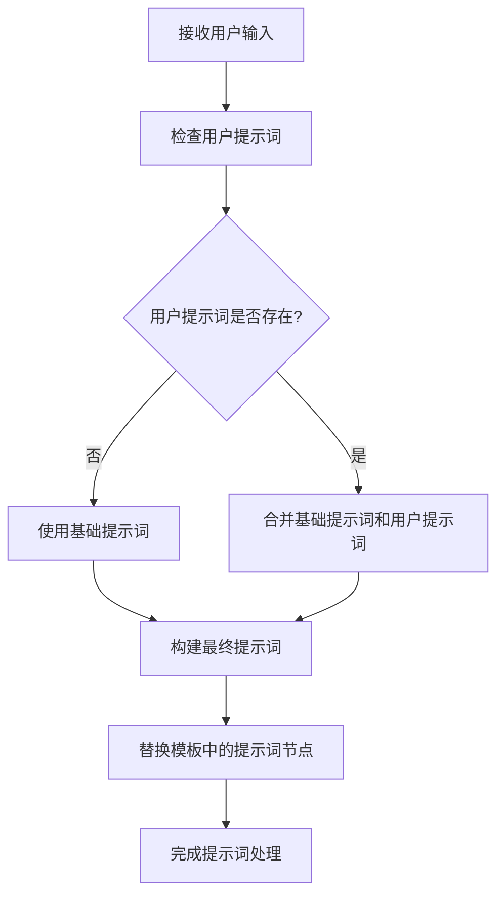

**图表来源**
- [Workflow1Adapter.ts:16-28](file://server/src/adapters/Workflow1Adapter.ts#L16-L28)

#### 文件上传要求

系统支持多种文件格式，但推荐使用高质量的图像文件：

**支持的图像格式：**
- JPEG (.jpg, .jpeg)
- PNG (.png)
- WebP (.webp)

**文件大小限制：**
- 单个文件：最大 50MB
- 批量处理：总大小不超过 500MB

**质量建议：**
- 分辨率：至少 1080p
- 文件大小：建议在 1-10MB 之间
- 颜色空间：sRGB

### ComfyUI 模板解析

真人精修工作流使用复杂的 ComfyUI 模板来实现高级图像处理功能：

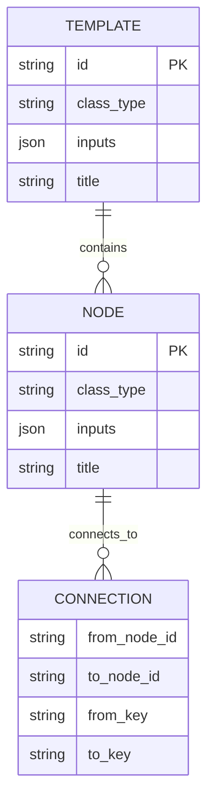

**图表来源**
- [Pix2Real-真人精修.json:1-369](file://ComfyUI_API/Pix2Real-真人精修.json#L1-L369)

#### 关键处理节点

| 节点 ID | 类型 | 功能描述 |
|---------|------|----------|
| `232` | CLIPTextEncode | 负面提示词编码 |
| `233` | CLIPTextEncode | 正面提示词编码（包含基础提示词） |
| `247` | LoadImage | 加载输入图像 |
| `253` | ImageScaleToTotalPixels | 图像缩放处理 |
| `280` | easy imageColorMatch | 颜色匹配 |
| `372` | SaveImage | 保存输出图像 |
| `392` | easy seed | 随机种子生成 |

**章节来源**
- [Workflow1Adapter.ts:16-34](file://server/src/adapters/Workflow1Adapter.ts#L16-L34)
- [Pix2Real-真人精修.json:14-369](file://ComfyUI_API/Pix2Real-真人精修.json#L14-L369)

## 依赖关系分析

### 组件耦合度

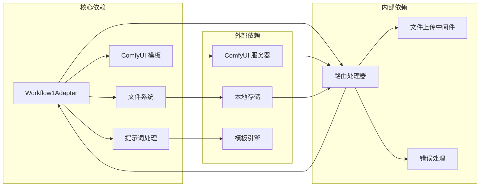

**图表来源**
- [index.ts:13-28](file://server/src/adapters/index.ts#L13-L28)
- [workflow.ts:1-862](file://server/src/routes/workflow.ts#L1-L862)

### 数据流分析

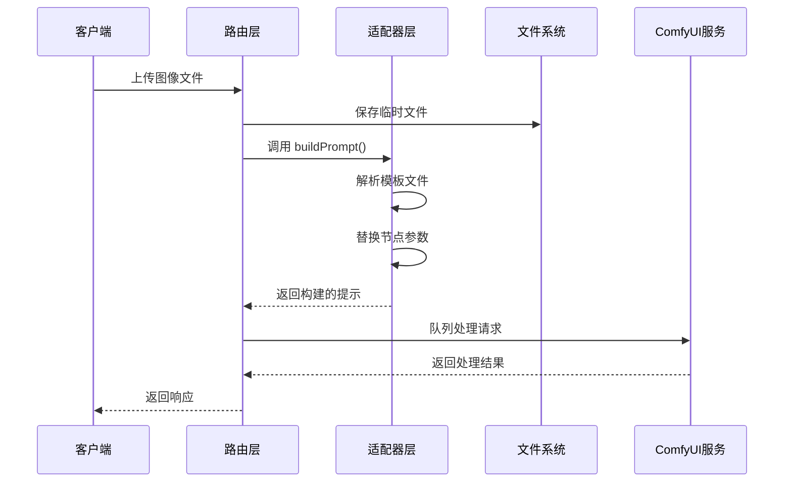

**图表来源**
- [workflow.ts:407-455](file://server/src/routes/workflow.ts#L407-L455)
- [comfyui.ts:47-60](file://server/src/services/comfyui.ts#L47-L60)

**章节来源**
- [index.ts:13-28](file://server/src/adapters/index.ts#L13-L28)
- [workflow.ts:1-862](file://server/src/routes/workflow.ts#L1-L862)

## 性能考虑

### 处理流程优化

真人精修工作流在设计时充分考虑了性能优化：

1. **异步处理**：所有图像处理操作都是异步执行
2. **内存管理**：及时清理临时文件和缓存
3. **并发控制**：合理控制同时处理的任务数量
4. **资源复用**：重用已加载的模型和模板

### 内存使用优化

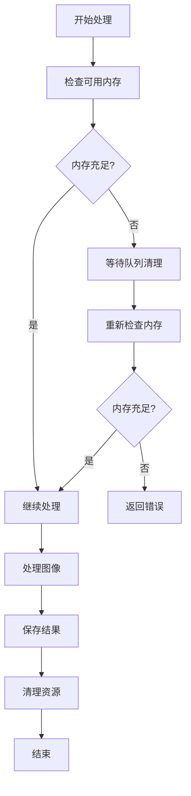

### 并发处理策略

系统支持多任务并发处理，但需要合理配置以避免资源竞争：

- **CPU 密集型任务**：建议并发数不超过 CPU 核心数
- **GPU 密集型任务**：根据显存大小调整并发数
- **I/O 密集型任务**：可以适当增加并发数

## 故障排除指南

### 常见错误及解决方案

| 错误类型 | 错误代码 | 可能原因 | 解决方案 |
|----------|----------|----------|----------|
| 文件上传失败 | 400 | 缺少图像文件或文件过大 | 检查文件大小和格式，确认文件存在 |
| 参数缺失 | 400 | 缺少 clientId | 确保提供有效的客户端标识符 |
| 适配器不存在 | 400 | 工作流 ID 不正确 | 检查工作流 ID 是否在有效范围内 |
| ComfyUI 连接失败 | 502 | ComfyUI 服务不可用 | 检查 ComfyUI 服务器状态和网络连接 |
| 处理超时 | 504 | 处理时间过长 | 增加超时时间或优化图像质量 |

### 错误处理流程

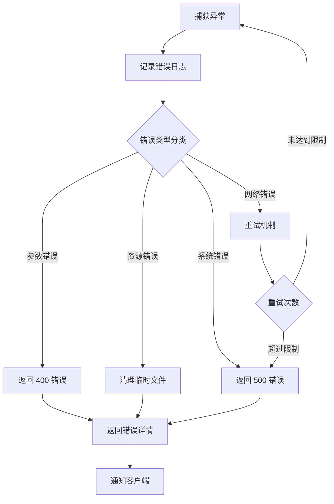

**图表来源**
- [workflow.ts:451-454](file://server/src/routes/workflow.ts#L451-L454)

### 调试工具

系统提供了多种调试工具来帮助诊断问题：

1. **日志记录**：详细的错误日志和处理过程记录
2. **进度监控**：通过 WebSocket 实时监控处理进度
3. **状态查询**：查询当前队列状态和系统资源使用情况
4. **文件检查**：验证输入文件的完整性和格式

**章节来源**
- [workflow.ts:451-454](file://server/src/routes/workflow.ts#L451-L454)

## 结论

真人精修工作流 API 提供了一个强大而灵活的图像处理解决方案，具有以下优势：

1. **模块化设计**：采用适配器模式，易于扩展和维护
2. **智能处理**：结合基础提示词和用户自定义提示词，实现高质量的图像转换
3. **高性能**：异步处理和资源优化，确保高效的处理性能
4. **易用性**：简洁的 API 设计和完善的错误处理机制

该工作流特别适用于需要将动漫风格图像转换为逼真照片的应用场景，如角色设计、游戏开发、虚拟偶像制作等。通过合理的参数配置和优化设置，可以获得最佳的处理效果和用户体验。