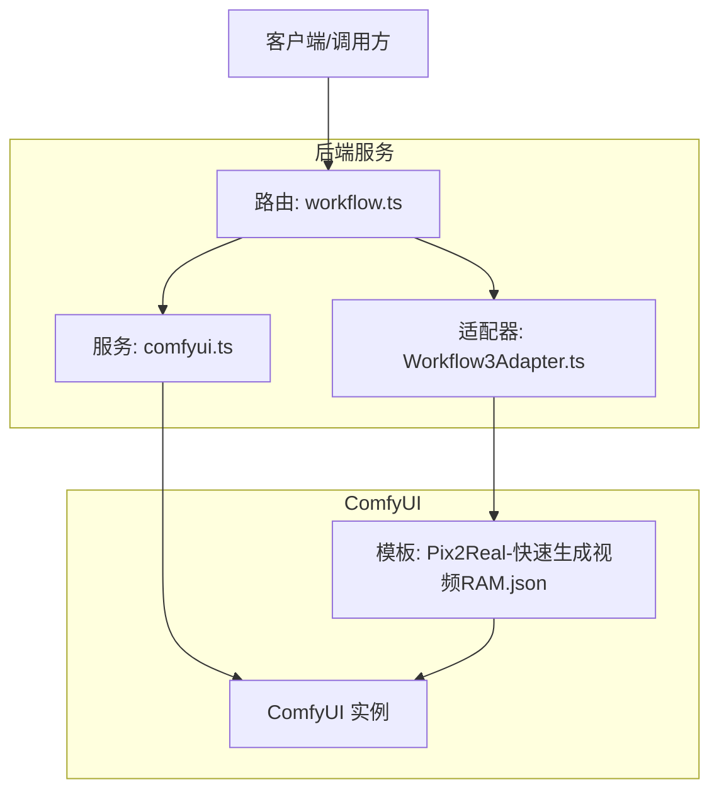
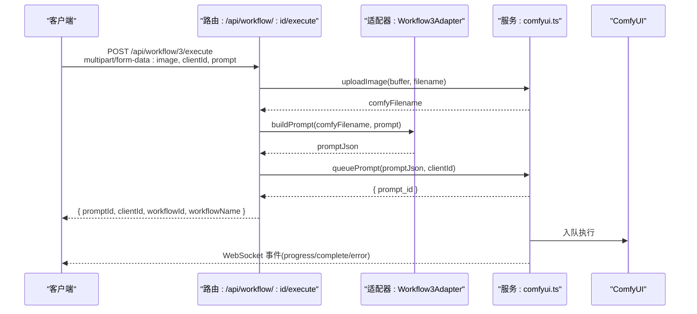
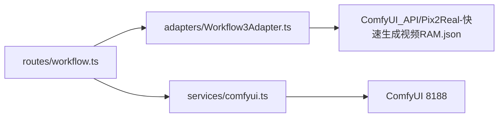

# 真人转二次元工作流 API

<cite>
**本文档引用的文件**
- [Workflow3Adapter.ts](file://server/src/adapters/Workflow3Adapter.ts)
- [workflow.ts](file://server/src/routes/workflow.ts)
- [comfyui.ts](file://server/src/services/comfyui.ts)
- [Pix2Real-快速生成视频RAM.json](file://ComfyUI_API/Pix2Real-快速生成视频RAM.json)
- [Pix2Real-真人转二次元.json](file://ComfyUI_API/Pix2Real-真人转二次元.json)
- [README.md](file://README.md)
- [index.ts](file://server/src/index.ts)
- [index.ts](file://server/src/adapters/index.ts)
- [index.ts](file://server/src/types/index.ts)
</cite>

## 目录
1. [简介](#简介)
2. [项目结构](#项目结构)
3. [核心组件](#核心组件)
4. [架构总览](#架构总览)
5. [详细组件分析](#详细组件分析)
6. [依赖关系分析](#依赖关系分析)
7. [性能考虑](#性能考虑)
8. [故障排除指南](#故障排除指南)
9. [结论](#结论)

## 简介
本文件面向“真人转二次元工作流”（Workflow 3）的 API 使用与集成，详细说明其执行接口、参数配置、提示词处理机制、文件上传要求、调用示例与错误处理策略，并与其它工作流进行区别对比，帮助开发者在本地 ComfyUI 环境中高效集成与扩展。

## 项目结构
- 后端服务采用 Express + TypeScript，路由集中于 workflow 路由模块，通过适配器模式加载 ComfyUI 工作流模板并动态构建执行参数。
- ComfyUI 工作流模板位于 ComfyUI_API 目录，包含多个工作流的 JSON 配置文件。
- 服务层封装了与 ComfyUI 的交互：上传文件、入队、查询历史、WebSocket 进度推送等。

图表来源
- [workflow.ts:407-455](file://server/src/routes/workflow.ts#L407-L455)
- [Workflow3Adapter.ts:9-32](file://server/src/adapters/Workflow3Adapter.ts#L9-L32)
- [comfyui.ts:47-60](file://server/src/services/comfyui.ts#L47-L60)

章节来源
- [README.md:41-79](file://README.md#L41-L79)

## 核心组件
- 适配器（Workflow3Adapter）
  - 定义工作流 ID、名称、是否需要提示词、基础提示词、输出目录。
  - 提供 buildPrompt 方法：读取模板、注入上传图像名、替换正向提示词、随机种子等。
- 路由（workflow.ts）
  - 提供通用执行接口 /api/workflow/:id/execute，支持单图与批量执行。
  - 支持通过 query 或 body 传入 clientId；单图执行需上传 image 文件。
  - 批量执行支持最多 50 张图片，支持按图分配独立提示词数组或统一提示词。
- 服务（comfyui.ts）
  - 封装 ComfyUI HTTP 接口：上传图像/视频、入队、查询历史、获取队列、删除队列项、系统统计、WebSocket 连接。
  - 提供 WebSocket 事件：进度、开始执行、完成、错误。

章节来源
- [Workflow3Adapter.ts:9-32](file://server/src/adapters/Workflow3Adapter.ts#L9-L32)
- [workflow.ts:407-455](file://server/src/routes/workflow.ts#L407-L455)
- [comfyui.ts:9-60](file://server/src/services/comfyui.ts#L9-L60)

## 架构总览
Workflow 3 的执行流程如下：
- 客户端上传图像文件与必要参数（clientId），后端将图像上传至 ComfyUI 并构建工作流模板。
- 适配器根据模板节点映射注入图像名、提示词与随机种子。
- 后端将构建好的模板入队至 ComfyUI，返回 prompt_id。
- 前端通过 WebSocket 订阅进度与完成事件，完成后从 ComfyUI 下载输出文件。

图表来源
- [workflow.ts:407-455](file://server/src/routes/workflow.ts#L407-L455)
- [Workflow3Adapter.ts:16-31](file://server/src/adapters/Workflow3Adapter.ts#L16-L31)
- [comfyui.ts:47-60](file://server/src/services/comfyui.ts#L47-L60)

## 详细组件分析

### 执行接口规范（Workflow 3）
- HTTP 方法与 URL
  - 单图执行：POST /api/workflow/3/execute
  - 批量执行：POST /api/workflow/3/batch
- 请求方式
  - 单图：multipart/form-data
  - 批量：multipart/form-data（images 字段最多 50 张）
- 必填参数
  - clientId：字符串，用于关联任务与前端会话。
- 可选参数
  - image（单图）或 images（批量）：二进制文件
  - prompt：字符串，用于替换模板中的正向提示词（Workflow 3 会完全替换默认提示词）
  - query 参数：clientId（也可放在 body 中）
- 响应字段
  - promptId：ComfyUI 返回的任务标识
  - clientId：回显
  - workflowId：3
  - workflowName：快速生成视频
- 错误状态码
  - 400：缺少必需参数（如 image、clientId）
  - 500：服务器内部错误
  - 502：无法连接 ComfyUI
  - 504：提示词反推/提示词助理等长耗时任务超时

章节来源
- [workflow.ts:407-455](file://server/src/routes/workflow.ts#L407-L455)

### 特殊参数配置
- 提示词处理机制
  - Workflow 3 的 buildPrompt 会完全替换模板中的正向提示词（CLIPTextEncode "Positive Input" 节点），不会与基础提示词拼接。
  - 若未提供 prompt，则使用适配器内置的基础提示词。
- 随机种子
  - 适配器为采样器节点（WanMoeKSampler）设置随机种子，确保每次执行结果不同。
- 输出目录
  - 适配器指定输出目录为 "3-快速生成视频"，用于区分不同工作流的输出路径。

章节来源
- [Workflow3Adapter.ts:16-31](file://server/src/adapters/Workflow3Adapter.ts#L16-L31)
- [Pix2Real-快速生成视频RAM.json:68-80](file://ComfyUI_API/Pix2Real-快速生成视频RAM.json#L68-L80)

### 文件上传要求
- 单图执行
  - Content-Type：multipart/form-data
  - 字段：image（必填）、clientId（必填）、prompt（可选）
- 批量执行
  - Content-Type：multipart/form-data
  - 字段：images（必填，最多 50 张）、clientId（必填）、prompt（可选，或使用 prompts 数组逐图指定）
  - prompts：JSON 数组字符串，长度与 images 相同，若省略则每张图使用统一 prompt

章节来源
- [workflow.ts:457-520](file://server/src/routes/workflow.ts#L457-L520)

### API 调用示例
以下示例展示如何调用 Workflow 3 的执行接口（仅列出关键步骤与参数，不包含具体代码内容）：
- 单图执行
  - 方法：POST
  - URL：/api/workflow/3/execute
  - 头部：Content-Type: multipart/form-data
  - 表单字段：
    - image：二进制文件
    - clientId：字符串
    - prompt：字符串（可选，替换模板提示词）
- 批量执行
  - 方法：POST
  - URL：/api/workflow/3/batch
  - 头部：Content-Type: multipart/form-data
  - 表单字段：
    - images：二进制文件数组（最多 50 张）
    - clientId：字符串
    - prompt：字符串（可选，统一提示词）
    - prompts：JSON 数组字符串（可选，逐图提示词）

章节来源
- [workflow.ts:407-455](file://server/src/routes/workflow.ts#L407-L455)
- [workflow.ts:457-520](file://server/src/routes/workflow.ts#L457-L520)

### 错误处理方案
- 常见错误与处理
  - 缺少 image 或 clientId：返回 400，提示缺失参数
  - 无法连接 ComfyUI：返回 502
  - 任务执行异常：WebSocket 事件中触发 error 类型，包含异常消息
  - 队列操作失败：删除队列项、优先级调整等返回 500
- 建议的客户端处理策略
  - 重试机制：对 502/504 场景进行指数退避重试
  - 超时控制：对长耗时任务设置合理超时时间
  - 用户反馈：显示友好的错误信息并允许重新提交

章节来源
- [workflow.ts:407-455](file://server/src/routes/workflow.ts#L407-L455)
- [comfyui.ts:90-99](file://server/src/services/comfyui.ts#L90-L99)

### 与其他工作流的区别与适用场景
- 与 Workflow 0（二次元转真人）的区别
  - 输入：Workflow 3 以图像为输入，Workflow 0 也以图像为输入，但用途相反
  - 提示词策略：Workflow 3 完全替换提示词；Workflow 0 会将用户提示词追加到基础提示词
  - 模板差异：Workflow 3 使用图像到视频生成链路（WanMoE），Workflow 0 使用漫画风格模型与反推标签
- 与 Workflow 2（精修放大）的区别
  - Workflow 2 专注于放大与细节增强，Workflow 3 关注图像到视频的生成
  - Workflow 2 的 buildPrompt 不涉及提示词替换，而 Workflow 3 会替换提示词
- 适用场景
  - Workflow 3：需要将静态图像转换为短视频序列的场景，适合二次元风格的动态演示与展示

章节来源
- [README.md:64-73](file://README.md#L64-L73)
- [Workflow3Adapter.ts:12-14](file://server/src/adapters/Workflow3Adapter.ts#L12-L14)
- [Pix2Real-快速生成视频RAM.json:182-185](file://ComfyUI_API/Pix2Real-快速生成视频RAM.json#L182-L185)

## 依赖关系分析
- 组件耦合
  - 路由层依赖适配器层与服务层，适配器层依赖模板文件，服务层依赖 ComfyUI HTTP/WS 接口。
- 外部依赖
  - ComfyUI 实例运行在本地 8188 端口，后端通过 HTTP 与 WebSocket 与其通信。
- 潜在循环依赖
  - 适配器与路由之间通过接口契约解耦，无直接循环依赖风险。

图表来源
- [workflow.ts:407-455](file://server/src/routes/workflow.ts#L407-L455)
- [Workflow3Adapter.ts:7-8](file://server/src/adapters/Workflow3Adapter.ts#L7-L8)
- [comfyui.ts:6-7](file://server/src/services/comfyui.ts#L6-L7)

章节来源
- [index.ts:13-24](file://server/src/adapters/index.ts#L13-L24)
- [index.ts:1-8](file://server/src/types/index.ts#L1-L8)

## 性能考虑
- 批量执行优化
  - 单次请求最多 50 张图片，减少网络往返开销。
- 模板复用
  - 适配器只修改必要的节点（图像名、提示词、种子），避免重复解析完整模板。
- 内存与显存管理
  - 模板中包含释放内存与显存的节点，建议在长时间任务后调用释放内存接口。
- WebSocket 进度推送
  - 通过 WebSocket 实时推送进度，避免轮询带来的额外负载。

章节来源
- [workflow.ts:457-520](file://server/src/routes/workflow.ts#L457-L520)
- [comfyui.ts:127-188](file://server/src/services/comfyui.ts#L127-L188)
- [Pix2Real-快速生成视频RAM.json:429-447](file://ComfyUI_API/Pix2Real-快速生成视频RAM.json#L429-L447)

## 故障排除指南
- 无法连接 ComfyUI
  - 确认 ComfyUI 在 http://127.0.0.1:8188 正常运行
  - 检查防火墙与代理设置
- 上传失败
  - 确保 image 字段存在且非空
  - 检查文件大小限制与磁盘空间
- 任务未完成
  - 通过 WebSocket 订阅进度事件，确认任务已入队
  - 使用 /api/workflow/queue 获取队列状态
- 输出文件缺失
  - 确认 SaveImage 节点配置正确，输出目录存在
  - 通过 /api/workflow/:id/open-folder 快速打开输出目录

章节来源
- [comfyui.ts:106-125](file://server/src/services/comfyui.ts#L106-L125)
- [workflow.ts:561-579](file://server/src/routes/workflow.ts#L561-L579)
- [index.ts:116-143](file://server/src/index.ts#L116-L143)

## 结论
Workflow 3 的 API 设计遵循统一的适配器与路由模式，具备良好的扩展性与可维护性。通过明确的参数约定、完善的错误处理与 WebSocket 进度推送，能够满足从单图到批量的多样化业务需求。结合模板的灵活配置与随机种子机制，可实现高质量的图像到视频生成任务。