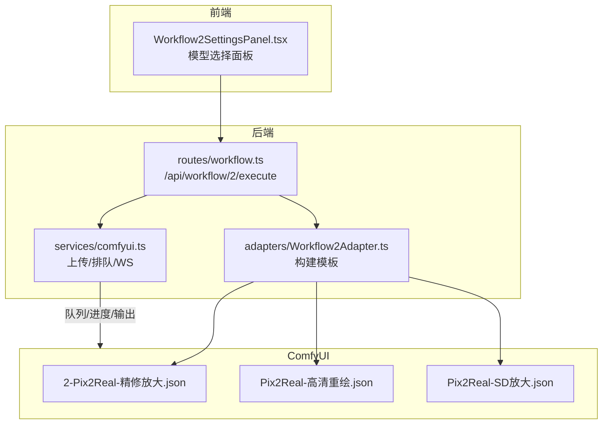
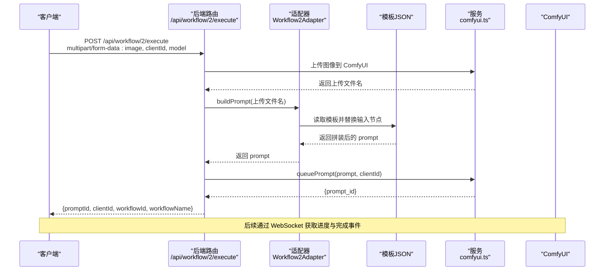
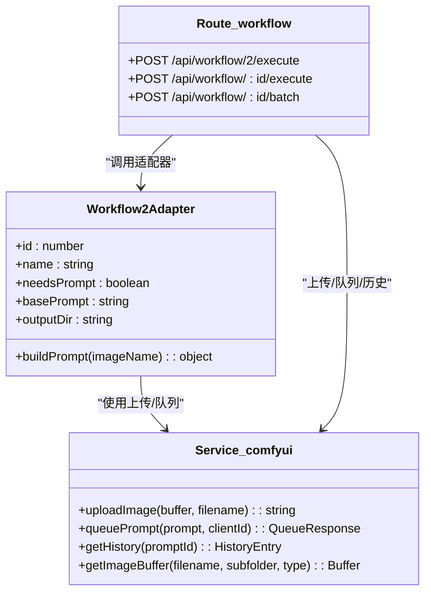

# 精修放大工作流 API

<cite>
**本文引用的文件列表**
- [Workflow2Adapter.ts](file://server/src/adapters/Workflow2Adapter.ts)
- [workflow.ts](file://server/src/routes/workflow.ts)
- [Workflow2SettingsPanel.tsx](file://client/src/components/Workflow2SettingsPanel.tsx)
- [2-Pix2Real-精修放大.json](file://ComfyUI_API/2-Pix2Real-精修放大.json)
- [Pix2Real-高清重绘.json](file://ComfyUI_API/Pix2Real-高清重绘.json)
- [Pix2Real-SD放大.json](file://ComfyUI_API/Pix2Real-SD放大.json)
- [comfyui.ts](file://server/src/services/comfyui.ts)
- [index.ts](file://server/src/types/index.ts)
- [README.md](file://README.md)
</cite>

## 目录
1. [简介](#简介)
2. [项目结构](#项目结构)
3. [核心组件](#核心组件)
4. [架构总览](#架构总览)
5. [详细组件分析](#详细组件分析)
6. [依赖关系分析](#依赖关系分析)
7. [性能考量](#性能考量)
8. [故障排查指南](#故障排查指南)
9. [结论](#结论)
10. [附录](#附录)

## 简介
本文件为“精修放大”工作流（Workflow 2）的详细 API 文档，面向需要通过 HTTP 接口调用该工作流的开发者与集成方。内容涵盖：
- 执行接口的 HTTP 方法、URL 模式、请求参数与响应格式
- 支持的放大模型选择（seedvr2 默认模型、klein upscale 模型、sd 放大模型）
- 放大倍数与质量参数配置
- 完整的 API 调用示例与各模型特点及适用场景
- 放大后图像质量与性能考虑

## 项目结构
精修放大工作流由前端 UI、后端路由与 ComfyUI 工作流模板三部分组成：
- 前端：在工作流标签页中提供模型选择面板，并将用户选择持久化到本地存储
- 后端：Express 路由处理上传与执行，适配器负责拼接 ComfyUI 模板
- ComfyUI 模板：以 JSON 形式描述节点连接与参数，后端按需替换输入节点

图表来源
- [workflow.ts:357-405](file://server/src/routes/workflow.ts#L357-L405)
- [Workflow2Adapter.ts:9-26](file://server/src/adapters/Workflow2Adapter.ts#L9-L26)
- [2-Pix2Real-精修放大.json:1-146](file://ComfyUI_API/2-Pix2Real-精修放大.json#L1-L146)
- [Pix2Real-高清重绘.json:1-446](file://ComfyUI_API/Pix2Real-高清重绘.json#L1-L446)
- [Pix2Real-SD放大.json:1-229](file://ComfyUI_API/Pix2Real-SD放大.json#L1-L229)

章节来源
- [README.md:41-79](file://README.md#L41-L79)

## 核心组件
- 路由处理器：负责解析请求、上传文件、选择模板、调用队列服务并返回结果
- 适配器：根据工作流 ID 加载对应模板，动态替换输入节点（如图像名、种子等）
- ComfyUI 模板：包含节点连接与参数，决定放大算法、分辨率、质量等
- 类型定义：统一后端数据结构（队列响应、历史记录、输出文件等）

章节来源
- [workflow.ts:357-405](file://server/src/routes/workflow.ts#L357-L405)
- [Workflow2Adapter.ts:9-26](file://server/src/adapters/Workflow2Adapter.ts#L9-L26)
- [comfyui.ts:47-83](file://server/src/services/comfyui.ts#L47-L83)
- [index.ts:1-52](file://server/src/types/index.ts#L1-L52)

## 架构总览
精修放大工作流的调用链路如下：
- 前端选择模型（seedvr2/klein/sd），构造表单并发送至后端
- 后端接收文件与参数，上传到 ComfyUI 并根据模型选择模板
- 适配器读取模板 JSON，替换输入节点（图像名、种子等）
- 将拼装好的 prompt 提交到 ComfyUI 队列，返回 promptId
- 前端通过 WebSocket 获取进度与完成事件，拉取输出图像

图表来源
- [workflow.ts:357-405](file://server/src/routes/workflow.ts#L357-L405)
- [Workflow2Adapter.ts:16-26](file://server/src/adapters/Workflow2Adapter.ts#L16-L26)
- [comfyui.ts:47-60](file://server/src/services/comfyui.ts#L47-L60)

## 详细组件分析

### API 接口定义
- HTTP 方法：POST
- URL 模式：/api/workflow/2/execute
- 请求方式：multipart/form-data
- 必填字段：
  - image：二进制图像文件（必填）
  - clientId：字符串，用于关联 WebSocket 进度与 ComfyUI 队列
- 可选字段：
  - model：字符串，可选值为 seedvr2（默认）、klein、sd
  - prompt：字符串，当使用非 seedvr2 模型时可传入提示词（seedvr2 模型无需提示词）
- 响应字段：
  - promptId：提交到队列的提示 ID
  - clientId：传入的客户端 ID
  - workflowId：工作流 ID（固定为 2）
  - workflowName：工作流名称（固定为“精修放大”）

章节来源
- [workflow.ts:357-405](file://server/src/routes/workflow.ts#L357-L405)

### 请求参数详解
- image
  - 类型：二进制文件
  - 作用：作为放大输入图像
- clientId
  - 类型：字符串
  - 作用：用于建立与 ComfyUI 的会话标识，配合 WebSocket 使用
- model
  - 类型：字符串
  - 取值：seedvr2（默认）、klein、sd
  - 说明：决定使用的放大模板与参数
- prompt
  - 类型：字符串
  - 作用：当 model 不为 seedvr2 时，用于覆盖模板中的提示词；seedvr2 模型不需要提示词

章节来源
- [workflow.ts:357-405](file://server/src/routes/workflow.ts#L357-L405)

### 响应格式
- 成功响应示例字段：
  - promptId: 提交到队列的提示 ID（字符串）
  - clientId: 客户端 ID（字符串）
  - workflowId: 工作流 ID（数字，固定为 2）
  - workflowName: 工作流名称（字符串，固定为“精修放大”）
- 错误响应字段：
  - error: 错误信息（字符串）

章节来源
- [workflow.ts:357-405](file://server/src/routes/workflow.ts#L357-L405)
- [index.ts:38-51](file://server/src/types/index.ts#L38-L51)

### 放大模型与参数

#### seedvr2（默认模型）
- 适用场景：高质量图像修复与放大，强调细节增强与色彩校正
- 关键参数（来自模板）：
  - 分辨率：resolution（例如 2048）
  - 最大分辨率：max_resolution（0 表示不限制）
  - 批大小：batch_size（例如 5）
  - 颜色校正：color_correction（例如 lab）
  - 种子：seed（每次执行随机生成）
- 放大倍数：模板中通过“缩放图像（比例）”节点设置 scale_by（例如约 0.5），实际输出分辨率由 resolution 决定
- 输出：保存为“精修放大”目录下的图像文件

章节来源
- [2-Pix2Real-精修放大.json:87-129](file://ComfyUI_API/2-Pix2Real-精修放大.json#L87-L129)

#### klein upscale 模型
- 适用场景：基于 Flux2 的高清重绘与细节增强，适合需要真实感与细节补充的任务
- 关键参数（来自模板）：
  - megapixels：目标总像素（例如 1.5）
  - 分辨率步进：resolution_steps（例如 1）
  - UNet 模型：flux-2-klein-9b-fp8
  - LoRA：F2K_9b-realistic（强度 0.6）
  - 调色：ColorMatch（颜色匹配）
  - 缩放：ImageScaleToTotalPixels（按总像素缩放）
- 放大倍数：由 megapixels 与原图尺寸共同决定
- 输出：保存为“精修放大”目录下的图像文件

章节来源
- [Pix2Real-高清重绘.json:158-266](file://ComfyUI_API/Pix2Real-高清重绘.json#L158-L266)

#### sd 放大模型（UltimateSDUpscale）
- 适用场景：基于 SD 的放大流程，适合需要控制采样步骤、降噪与瓦片参数的场景
- 关键参数（来自模板）：
  - upscale_by：放大倍数（例如 2）
  - 步数：steps（例如 2）
  - CFG：1
  - 采样器：res_multistep
  - 调度器：simple
  - 降噪：denoise（例如 0.15）
  - 瓦片宽度/高度：tile_width/tile_height（由数学节点计算）
  - 掩膜模糊：mask_blur（例如 16）
  - 瓦片填充：tile_padding（例如 32）
  - 放大模型：4x-UltraSharp.pth
  - 图像质量：KOOK_ImageCompression（质量 90）
- 放大倍数：由 upscale_by 决定
- 输出：保存为“精修放大”目录下的图像文件

章节来源
- [Pix2Real-SD放大.json:70-124](file://ComfyUI_API/Pix2Real-SD放大.json#L70-L124)

### 前端模型选择与持久化
- 前端提供“精修放大”标签页的模型选择面板，支持 seedvr2/klein/sd
- 用户选择会被写入本地存储（localStorage），下次打开时恢复
- 发起执行时，前端会将 model 参数附加到 multipart/form-data 中

章节来源
- [Workflow2SettingsPanel.tsx:1-59](file://client/src/components/Workflow2SettingsPanel.tsx#L1-L59)

### 执行流程与错误处理
- 文件上传：后端通过服务函数上传图像到 ComfyUI，返回文件名
- 模板拼装：根据 model 选择模板，替换输入节点（图像名、种子等）
- 提交队列：将拼装好的 prompt 提交到 ComfyUI 队列，返回 promptId
- 错误处理：对缺失参数、上传失败、队列失败等情况返回 4xx/5xx 与错误信息

章节来源
- [workflow.ts:357-405](file://server/src/routes/workflow.ts#L357-L405)
- [comfyui.ts:9-25](file://server/src/services/comfyui.ts#L9-L25)

## 依赖关系分析

图表来源
- [Workflow2Adapter.ts:9-26](file://server/src/adapters/Workflow2Adapter.ts#L9-L26)
- [workflow.ts:357-405](file://server/src/routes/workflow.ts#L357-L405)
- [comfyui.ts:9-60](file://server/src/services/comfyui.ts#L9-L60)

章节来源
- [workflow.ts:357-405](file://server/src/routes/workflow.ts#L357-L405)
- [Workflow2Adapter.ts:9-26](file://server/src/adapters/Workflow2Adapter.ts#L9-L26)
- [comfyui.ts:9-60](file://server/src/services/comfyui.ts#L9-L60)

## 性能考量
- seedvr2
  - 优点：高质量修复与细节增强，支持颜色校正与批处理
  - 注意：分辨率与批大小会影响显存占用；建议根据显存情况调整 resolution 与 batch_size
- klein upscale
  - 优点：基于 Flux2 的真实感增强，LoRA 可提升细节
  - 注意：megapixels 与 resolution_steps 会显著影响显存与耗时
- sd 放大
  - 优点：可控性强（steps、denoise、tile 参数）
  - 注意：upscale_by 与 tile 尺寸/填充会直接影响显存与速度；质量压缩可减少体积但可能损失细节

[本节为通用性能指导，不直接分析具体文件]

## 故障排查指南
- 常见错误与原因
  - 400 缺少参数：未提供 image 或 clientId
  - 500 队列失败：ComfyUI 服务不可达或模板参数异常
  - 502 系统状态查询失败：ComfyUI 未运行或无 GPU
- 排查步骤
  - 确认 ComfyUI 服务运行于 http://127.0.0.1:8188
  - 检查 clientId 是否正确传递
  - 检查模型参数是否为允许值（seedvr2/klein/sd）
  - 查看后端日志与 ComfyUI 队列状态
- 相关接口
  - 获取系统状态：GET /api/workflow/system-stats
  - 取消队列项：POST /api/workflow/cancel-queue/:promptId
  - 优先队列：POST /api/workflow/queue/prioritize/:promptId

章节来源
- [workflow.ts:532-579](file://server/src/routes/workflow.ts#L532-L579)
- [comfyui.ts:106-125](file://server/src/services/comfyui.ts#L106-L125)

## 结论
精修放大工作流提供了三种主流放大路径：seedvr2（默认）、klein upscale 与 SD 放大。通过统一的 POST /api/workflow/2/execute 接口，结合前端模型选择与后端适配器模板拼装，用户可以灵活地在不同模型间切换，满足从细节修复到真实感增强的不同需求。建议根据硬件资源与质量要求选择合适的模型与参数组合，并结合队列管理与系统监控保障稳定运行。

[本节为总结性内容，不直接分析具体文件]

## 附录

### API 调用示例（不含代码片段）
- 基本调用
  - 方法：POST
  - URL：/api/workflow/2/execute
  - 表单字段：
    - image：二进制图像文件
    - clientId：字符串
    - model：seedvr2（默认）/klein/sd
    - prompt：当 model 不为 seedvr2 时可选
  - 成功响应：包含 promptId、clientId、workflowId、workflowName
- 批量调用
  - 方法：POST
  - URL：/api/workflow/2/batch
  - 表单字段：
    - images：多个图像文件
    - clientId：字符串
    - model：同上
    - prompt 或 prompts：单个提示词或 JSON 数组
  - 成功响应：包含任务数组（每个任务含 promptId 与原始文件名）

章节来源
- [workflow.ts:457-520](file://server/src/routes/workflow.ts#L457-L520)

### 模型特点与适用场景
- seedvr2
  - 特点：高质量修复与细节增强，支持颜色校正与批处理
  - 适用：追求自然细节与色彩一致性的图像修复
- klein upscale
  - 特点：Flux2 + LoRA，真实感增强
  - 适用：需要更强真实感与细节补充的任务
- sd 放大
  - 特点：可控性强（steps、denoise、tile）
  - 适用：需要精细控制放大过程与输出质量的场景

章节来源
- [2-Pix2Real-精修放大.json:87-129](file://ComfyUI_API/2-Pix2Real-精修放大.json#L87-L129)
- [Pix2Real-高清重绘.json:158-266](file://ComfyUI_API/Pix2Real-高清重绘.json#L158-L266)
- [Pix2Real-SD放大.json:70-124](file://ComfyUI_API/Pix2Real-SD放大.json#L70-L124)