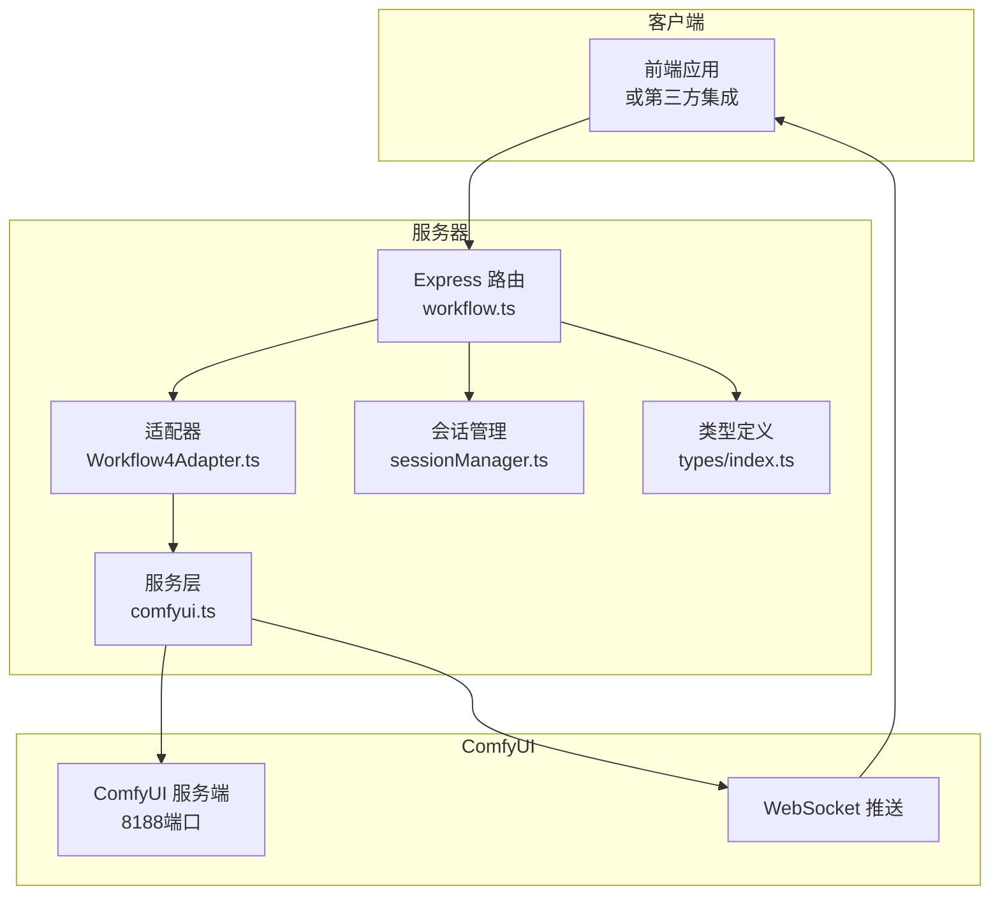
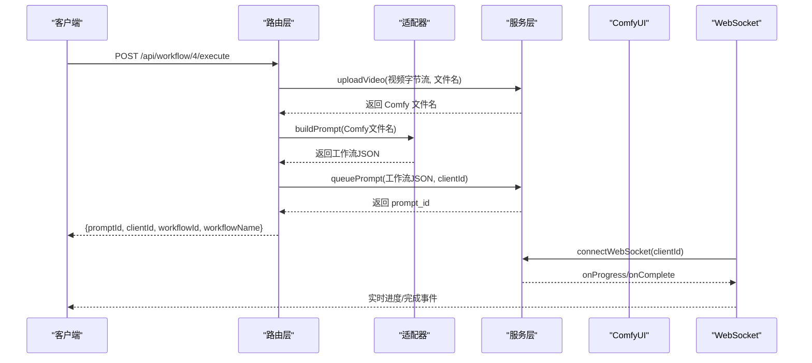
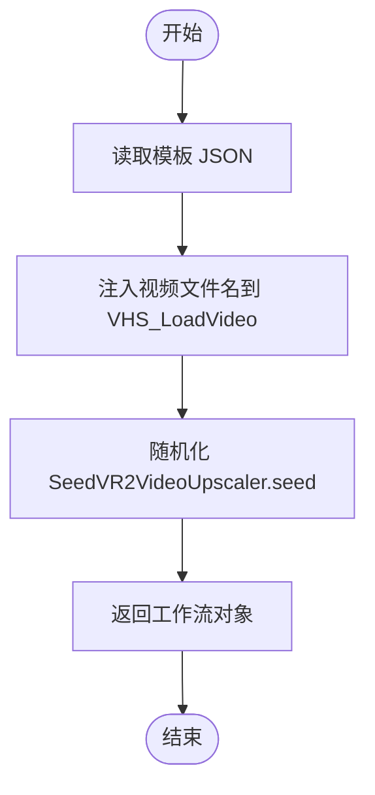
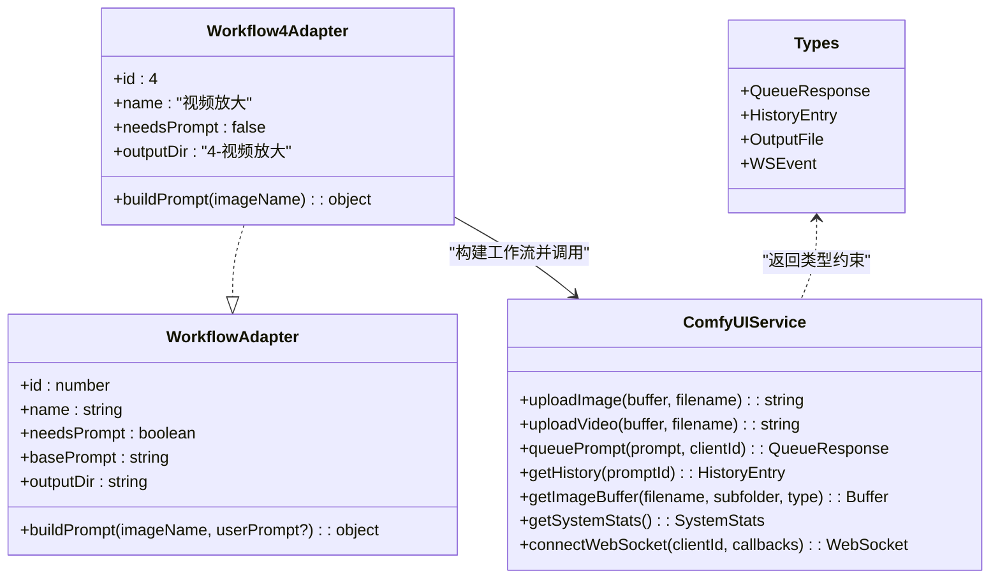

# 视频处理工作流 API

<cite>
**本文档引用的文件**
- [server/src/adapters/Workflow4Adapter.ts](file://server/src/adapters/Workflow4Adapter.ts)
- [server/src/routes/workflow.ts](file://server/src/routes/workflow.ts)
- [server/src/services/comfyui.ts](file://server/src/services/comfyui.ts)
- [server/src/types/index.ts](file://server/src/types/index.ts)
- [ComfyUI_API/4-Pix2Real-视频放大.json](file://ComfyUI_API/4-Pix2Real-视频放大.json)
- [server/src/index.ts](file://server/src/index.ts)
- [server/src/services/sessionManager.ts](file://server/src/services/sessionManager.ts)
- [server/src/adapters/index.ts](file://server/src/adapters/index.ts)
</cite>

## 目录
1. [简介](#简介)
2. [项目结构](#项目结构)
3. [核心组件](#核心组件)
4. [架构总览](#架构总览)
5. [详细组件分析](#详细组件分析)
6. [依赖关系分析](#依赖关系分析)
7. [性能考虑](#性能考虑)
8. [故障排除指南](#故障排除指南)
9. [结论](#结论)
10. [附录](#附录)

## 简介
本文件面向使用视频处理工作流 API 的开发者与集成方，系统性说明 Workflow 4（视频放大）的执行接口，涵盖：
- HTTP 方法与 URL 模式
- 请求参数与响应格式
- 视频文件上传处理流程
- 视频参数配置（分辨率、帧率等）
- 帧率控制与视频输出格式
- 完整调用示例与注意事项
- 格式支持、文件大小限制与处理时间估算

## 项目结构
后端采用 Express + WebSocket 架构，路由层负责接收请求、解析参数、调用适配器构建 ComfyUI 工作流模板、上传媒体文件至 ComfyUI、入队并返回任务信息；服务层封装与 ComfyUI 的交互（HTTP/WS），类型定义统一了事件与数据结构。

图表来源
- [server/src/routes/workflow.ts:1-862](file://server/src/routes/workflow.ts#L1-L862)
- [server/src/adapters/Workflow4Adapter.ts:1-28](file://server/src/adapters/Workflow4Adapter.ts#L1-L28)
- [server/src/services/comfyui.ts:1-285](file://server/src/services/comfyui.ts#L1-L285)
- [server/src/services/sessionManager.ts:1-164](file://server/src/services/sessionManager.ts#L1-L164)
- [server/src/types/index.ts:1-52](file://server/src/types/index.ts#L1-L52)

章节来源
- [server/src/routes/workflow.ts:1-862](file://server/src/routes/workflow.ts#L1-L862)
- [server/src/adapters/Workflow4Adapter.ts:1-28](file://server/src/adapters/Workflow4Adapter.ts#L1-L28)
- [server/src/services/comfyui.ts:1-285](file://server/src/services/comfyui.ts#L1-L285)
- [server/src/services/sessionManager.ts:1-164](file://server/src/services/sessionManager.ts#L1-L164)
- [server/src/types/index.ts:1-52](file://server/src/types/index.ts#L1-L52)

## 核心组件
- Workflow 4 适配器：根据模板构建视频放大工作流，注入上传后的视频文件名与随机种子。
- 路由层：提供通用执行接口与批量接口，区分图片与视频上传路径。
- 服务层：封装 ComfyUI 的上传、入队、历史查询、系统统计、WebSocket 连接等。
- 类型定义：统一事件、队列项、历史条目等数据结构。
- 会话管理：保存输出文件到会话目录，便于后续下载与展示。

章节来源
- [server/src/adapters/Workflow4Adapter.ts:9-27](file://server/src/adapters/Workflow4Adapter.ts#L9-L27)
- [server/src/routes/workflow.ts:407-455](file://server/src/routes/workflow.ts#L407-L455)
- [server/src/services/comfyui.ts:9-45](file://server/src/services/comfyui.ts#L9-L45)
- [server/src/types/index.ts:1-52](file://server/src/types/index.ts#L1-L52)
- [server/src/services/sessionManager.ts:34-44](file://server/src/services/sessionManager.ts#L34-L44)

## 架构总览
Workflow 4 的执行链路如下：
1. 客户端向后端发送 POST 请求，携带视频文件与必要参数。
2. 后端通过 multer 将视频上传至 ComfyUI 的上传接口。
3. 适配器读取模板并注入视频文件名与随机种子，生成最终工作流 JSON。
4. 后端将工作流入队至 ComfyUI，返回任务标识与客户端 ID。
5. WebSocket 推送进度、完成状态与输出文件链接。
6. 输出文件可从会话目录或静态输出目录访问。

图表来源
- [server/src/routes/workflow.ts:407-455](file://server/src/routes/workflow.ts#L407-L455)
- [server/src/adapters/Workflow4Adapter.ts:16-26](file://server/src/adapters/Workflow4Adapter.ts#L16-L26)
- [server/src/services/comfyui.ts:27-60](file://server/src/services/comfyui.ts#L27-L60)
- [server/src/index.ts:93-189](file://server/src/index.ts#L93-L189)

章节来源
- [server/src/routes/workflow.ts:407-455](file://server/src/routes/workflow.ts#L407-L455)
- [server/src/adapters/Workflow4Adapter.ts:16-26](file://server/src/adapters/Workflow4Adapter.ts#L16-L26)
- [server/src/services/comfyui.ts:27-60](file://server/src/services/comfyui.ts#L27-L60)
- [server/src/index.ts:93-189](file://server/src/index.ts#L93-L189)

## 详细组件分析

### Workflow 4 执行接口规范
- HTTP 方法：POST
- URL 模式：/api/workflow/4/execute
- 内容类型：multipart/form-data（单文件上传）
- 请求体字段：
  - file：必填，视频文件（支持常见视频格式）
  - clientId：必填，客户端标识，用于 WebSocket 订阅与队列关联
  - prompt：可选，用户提示词（当前适配器不使用）
- 响应体字段：
  - promptId：任务标识
  - clientId：传入的客户端 ID
  - workflowId：4
  - workflowName：视频放大

注意：
- 该接口与通用执行接口共享逻辑，当 workflowId=4 时，上传路径使用视频上传接口。
- 通用批量接口 /api/workflow/:id/batch 对于 id=4 同样走视频上传路径。

章节来源
- [server/src/routes/workflow.ts:407-455](file://server/src/routes/workflow.ts#L407-L455)
- [server/src/services/comfyui.ts:27-45](file://server/src/services/comfyui.ts#L27-L45)

### 视频文件上传处理
- 上传接口：/upload/image（ComfyUI）
- 上传参数：
  - image：二进制视频内容
  - overwrite：true
  - subfolder：空字符串
  - type：input
- 返回值：Comfy 文件名（用于工作流模板注入）

章节来源
- [server/src/services/comfyui.ts:27-45](file://server/src/services/comfyui.ts#L27-L45)

### 视频参数配置与分辨率设置
- 模板节点：VHS_LoadVideo（节点 968）
  - video：注入上传后的视频文件名
  - force_rate：帧率（例如 16）
  - custom_width/custom_height：自定义分辨率（0 表示不强制）
  - frame_load_cap/skip_first_frames/select_every_nth：帧采样控制
  - format：视频格式（如 AnimateDiff）
- 分辨率与放大：
  - SeedVR2VideoUpscaler（节点 1153）提供分辨率输入与最大分辨率限制
  - 支持颜色校正、批大小、均匀批大小等参数
- 输出格式：
  - VHS_VideoCombine（节点 1082/1152）指定输出格式为 video/h264-mp4，像素格式 yuv420p，CRF 19，保存元数据等

章节来源
- [ComfyUI_API/4-Pix2Real-视频放大.json:17-58](file://ComfyUI_API/4-Pix2Real-视频放大.json#L17-L58)
- [ComfyUI_API/4-Pix2Real-视频放大.json:115-146](file://ComfyUI_API/4-Pix2Real-视频放大.json#L115-L146)
- [ComfyUI_API/4-Pix2Real-视频放大.json:1082-1152](file://ComfyUI_API/4-Pix2Real-视频放大.json#L1082-L1152)

### 帧率控制
- 输入帧率：VHS_LoadVideo.force_rate 控制
- 中间帧插值：RIFE VFI（节点 1150）进行插值，提升到更高帧率
- 最终输出帧率：VHS_VideoCombine.frame_rate 控制

章节来源
- [ComfyUI_API/4-Pix2Real-视频放大.json:17-58](file://ComfyUI_API/4-Pix2Real-视频放大.json#L17-L58)
- [ComfyUI_API/4-Pix2Real-视频放大.json:1150-1154](file://ComfyUI_API/4-Pix2Real-视频放大.json#L1150-L1154)
- [ComfyUI_API/4-Pix2Real-视频放大.json:1082-1152](file://ComfyUI_API/4-Pix2Real-视频放大.json#L1082-L1152)

### 适配器构建流程
- 读取模板 JSON
- 注入视频文件名到 VHS_LoadVideo
- 随机化 SeedVR2VideoUpscaler.seed
- 返回工作流对象供入队

图表来源
- [server/src/adapters/Workflow4Adapter.ts:16-26](file://server/src/adapters/Workflow4Adapter.ts#L16-L26)

章节来源
- [server/src/adapters/Workflow4Adapter.ts:16-26](file://server/src/adapters/Workflow4Adapter.ts#L16-L26)

### WebSocket 事件与输出下载
- 事件类型：
  - execution_start：开始执行
  - progress：进度（value/max/percentage）
  - complete：完成，包含输出文件列表
  - error：错误
- 输出文件：
  - 图像输出：类型为 output
  - 视频输出：来自 VHS_VideoCombine 的 gif 列表
- 下载与保存：
  - 通过 /view 接口获取二进制缓冲区
  - 保存到会话 output 目录，返回可访问 URL

章节来源
- [server/src/services/comfyui.ts:127-188](file://server/src/services/comfyui.ts#L127-L188)
- [server/src/index.ts:109-189](file://server/src/index.ts#L109-L189)
- [server/src/services/comfyui.ts:73-83](file://server/src/services/comfyui.ts#L73-L83)

### API 调用示例
以下为典型调用步骤（以 curl 形式示意）：
- 单视频执行
  - curl -X POST http://localhost:8189/api/workflow/4/execute \
    -F file=@your_video.mp4 \
    -F clientId=YOUR_CLIENT_ID
- 批量执行（最多 50 个）
  - curl -X POST http://localhost:8189/api/workflow/4/batch \
    -F images=@video1.mp4 \
    -F images=@video2.mp4 \
    -F clientId=YOUR_CLIENT_ID
- 获取系统状态
  - curl http://localhost:8189/api/workflow/system-stats
- 获取队列
  - curl http://localhost:8189/api/workflow/queue

章节来源
- [server/src/routes/workflow.ts:407-455](file://server/src/routes/workflow.ts#L407-L455)
- [server/src/routes/workflow.ts:532-569](file://server/src/routes/workflow.ts#L532-L569)

## 依赖关系分析

图表来源
- [server/src/adapters/Workflow4Adapter.ts:9-27](file://server/src/adapters/Workflow4Adapter.ts#L9-L27)
- [server/src/types/index.ts:1-52](file://server/src/types/index.ts#L1-L52)
- [server/src/services/comfyui.ts:9-285](file://server/src/services/comfyui.ts#L9-L285)

章节来源
- [server/src/adapters/Workflow4Adapter.ts:9-27](file://server/src/adapters/Workflow4Adapter.ts#L9-L27)
- [server/src/types/index.ts:1-52](file://server/src/types/index.ts#L1-L52)
- [server/src/services/comfyui.ts:9-285](file://server/src/services/comfyui.ts#L9-L285)

## 性能考虑
- 视频上传：使用内存存储（multer.memoryStorage），适合中小视频；大视频可能导致内存压力。
- 显存与内存：可通过 /api/workflow/system-stats 获取 VRAM/内存使用率，必要时调用 /api/workflow/release-memory 释放资源。
- 队列优先级：支持 /api/workflow/queue/prioritize/:promptId 将指定任务置顶。
- 输出下载：WebSocket 完成事件中自动下载并保存到会话目录，避免重复网络往返。

章节来源
- [server/src/routes/workflow.ts:23-27](file://server/src/routes/workflow.ts#L23-L27)
- [server/src/services/comfyui.ts:106-125](file://server/src/services/comfyui.ts#L106-L125)
- [server/src/routes/workflow.ts:571-579](file://server/src/routes/workflow.ts#L571-L579)
- [server/src/index.ts:109-189](file://server/src/index.ts#L109-L189)

## 故障排除指南
- 400 错误（缺少参数）
  - 无 file 或 clientId：检查 multipart 字段与 clientId 是否传入
- 500 错误（内部异常）
  - 上传失败、入队失败、ComfyUI 不可用：查看服务端日志
- 502/504 超时
  - 系统不可用或 LLM/反推类任务超时：检查 ComfyUI 状态与模型加载情况
- WebSocket 未收到事件
  - 确保已连接 /ws 并在连接后订阅对应 clientId 的事件
- 输出文件无法访问
  - 确认会话目录存在且有写权限；通过 /api/session-files 或静态输出目录访问

章节来源
- [server/src/routes/workflow.ts:407-455](file://server/src/routes/workflow.ts#L407-L455)
- [server/src/services/comfyui.ts:47-60](file://server/src/services/comfyui.ts#L47-L60)
- [server/src/index.ts:93-189](file://server/src/index.ts#L93-L189)

## 结论
Workflow 4 提供了基于模板的工作流执行能力，结合 ComfyUI 的视频处理节点，能够实现视频帧率提升、分辨率放大与高质量输出。通过统一的上传、入队与 WebSocket 推送机制，客户端可以可靠地跟踪任务进度与获取输出文件。建议在生产环境中关注内存与显存使用、合理设置帧率与分辨率参数，并利用队列优先级与系统监控保障稳定性。

## 附录

### 技术细节清单
- 视频格式支持：模板中使用 VHS 节点与 AnimateDiff 格式，输出为 H.264 MP4（yuv420p）
- 文件大小限制：后端 JSON 解析限制为 50MB；上传接口未显式限制，但受 ComfyUI 默认限制影响
- 处理时间估算：取决于视频长度、分辨率、帧率与硬件性能；建议先小视频测试
- 客户端 ID：必须提供，用于队列关联与 WebSocket 订阅
- 输出目录：会话 output 目录与静态 output 目录均可访问

章节来源
- [ComfyUI_API/4-Pix2Real-视频放大.json:17-58](file://ComfyUI_API/4-Pix2Real-视频放大.json#L17-L58)
- [ComfyUI_API/4-Pix2Real-视频放大.json:1082-1152](file://ComfyUI_API/4-Pix2Real-视频放大.json#L1082-L1152)
- [server/src/index.ts:51-60](file://server/src/index.ts#L51-L60)
- [server/src/services/sessionManager.ts:34-44](file://server/src/services/sessionManager.ts#L34-L44)