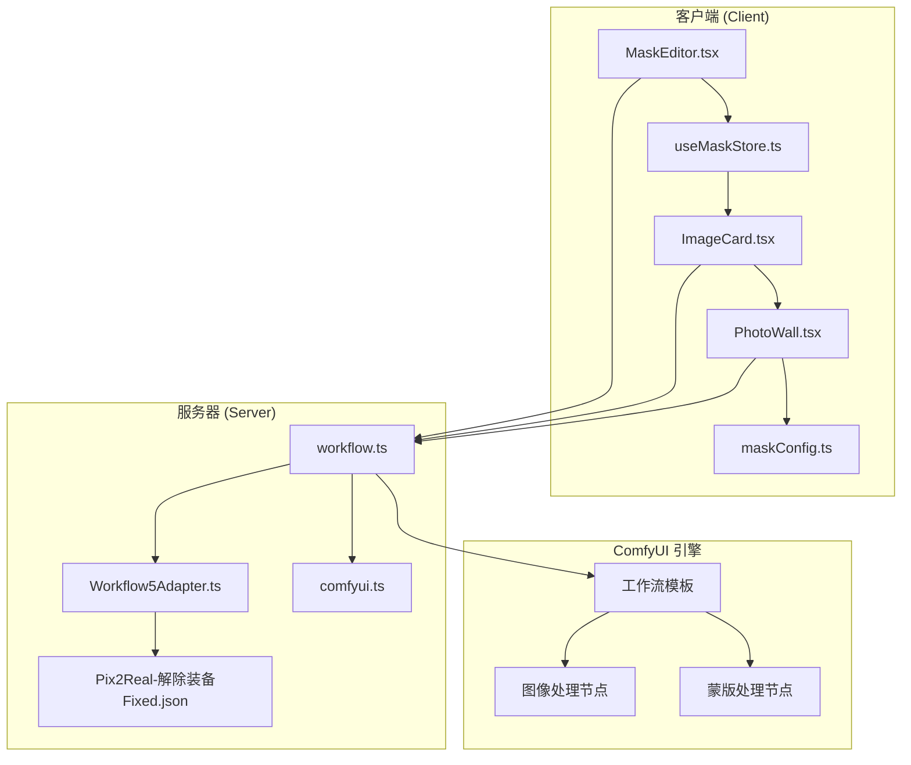
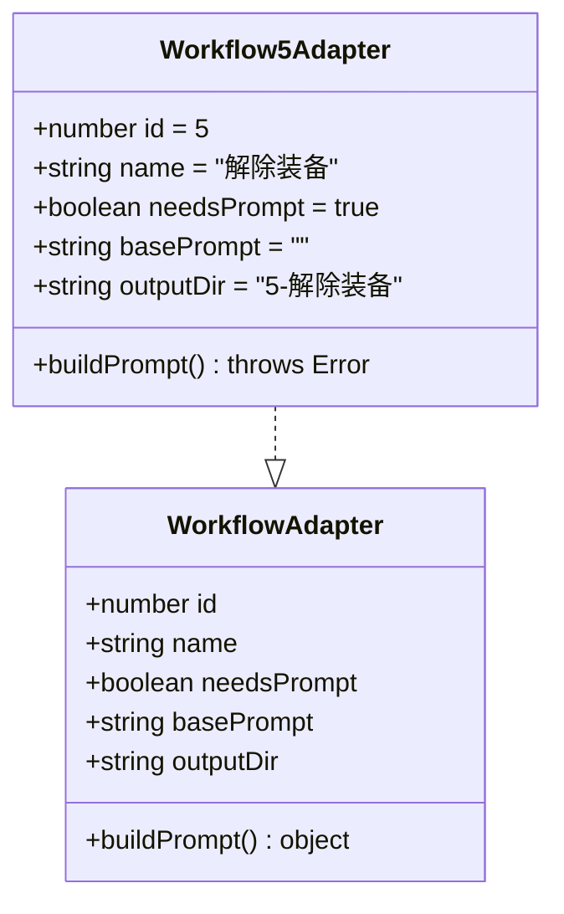
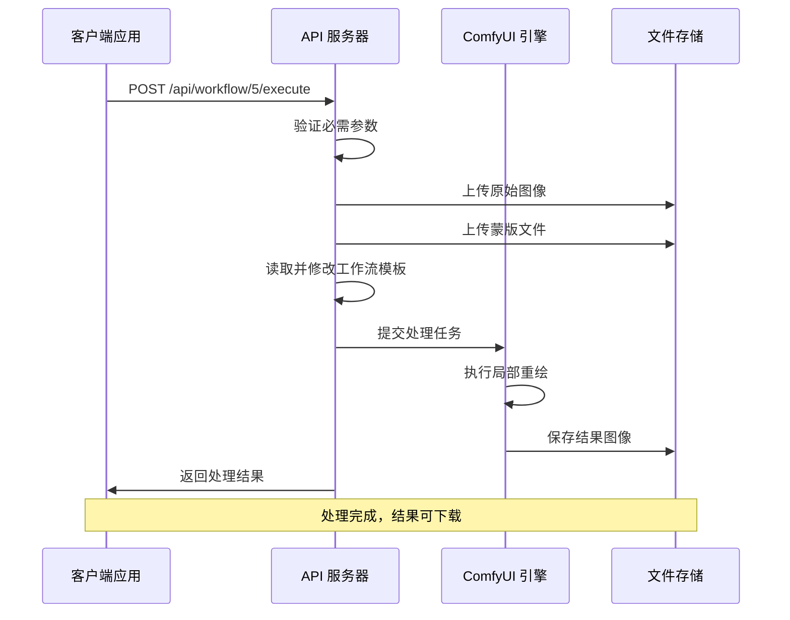
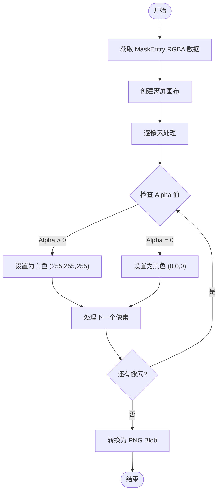
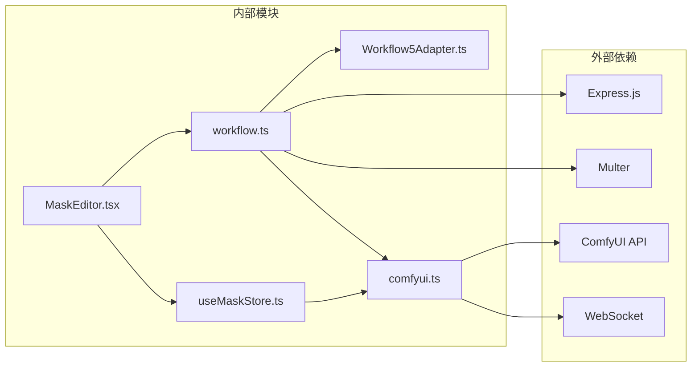
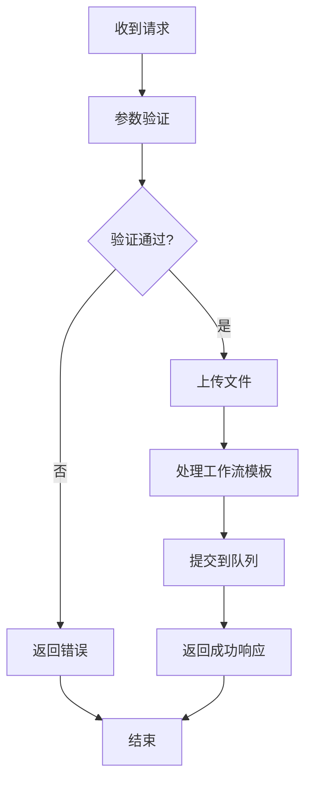

# 解除装备工作流 API

<cite>
**本文档引用的文件**
- [Workflow5Adapter.ts](file://server/src/adapters/Workflow5Adapter.ts)
- [workflow.ts](file://server/src/routes/workflow.ts)
- [Pix2Real-解除装备.json](file://ComfyUI_API/Pix2Real-解除装备.json)
- [Pix2Real-解除装备Fixed.json](file://ComfyUI_API/Pix2Real-解除装备Fixed.json)
- [MaskEditor.tsx](file://client/src/components/MaskEditor.tsx)
- [useMaskStore.ts](file://client/src/hooks/useMaskStore.ts)
- [maskConfig.ts](file://client/src/config/maskConfig.ts)
- [comfyui.ts](file://server/src/services/comfyui.ts)
- [2026-02-25-jiechuazhuangbei-workflow-design.md](file://docs/plans/2026-02-25-jiechuazhuangbei-workflow-design.md)
- [2026-02-25-jiechuazhuangbei-impl.md](file://docs/plans/2026-02-25-jiechuazhuangbei-impl.md)
</cite>

## 目录
1. [简介](#简介)
2. [项目结构](#项目结构)
3. [核心组件](#核心组件)
4. [架构概览](#架构概览)
5. [详细组件分析](#详细组件分析)
6. [依赖关系分析](#依赖关系分析)
7. [性能考虑](#性能考虑)
8. [故障排除指南](#故障排除指南)
9. [结论](#结论)
10. [附录](#附录)

## 简介

解除装备工作流 API 是一个专门用于移除图像中特定装备或衣物的 AI 图像处理系统。该系统基于 ComfyUI 工作流引擎，通过精确的蒙版分割技术实现高质量的局部重绘效果。

本 API 支持两种工作模式：
- **模式 A（叠加模式）**：用户直接在图像上绘制蒙版，无需输出图像
- **模式 B（混合模式）**：支持实时混合结果的高级编辑功能

系统的核心特性包括：
- 基于白/黑蒙版的精确分割
- 可选的"后位 LoRA"增强模式
- 自动化的蒙版识别与填充
- 高质量的局部重绘算法

## 项目结构



**图表来源**
- [workflow.ts:40-92](file://server/src/routes/workflow.ts#L40-L92)
- [MaskEditor.tsx:141-375](file://client/src/components/MaskEditor.tsx#L141-L375)
- [Workflow5Adapter.ts:4-14](file://server/src/adapters/Workflow5Adapter.ts#L4-L14)

**章节来源**
- [workflow.ts:1-862](file://server/src/routes/workflow.ts#L1-L862)
- [MaskEditor.tsx:1-375](file://client/src/components/MaskEditor.tsx#L1-L375)

## 核心组件

### 服务器端适配器

Workflow5Adapter 提供了工作流的基本元数据配置：



**图表来源**
- [Workflow5Adapter.ts:4-14](file://server/src/adapters/Workflow5Adapter.ts#L4-L14)

### 专用执行路由

工作流 5 使用专用的 POST 路由，支持同时上传原始图像和蒙版文件：

**HTTP 接口规范**
- **方法**: POST
- **URL**: `/api/workflow/5/execute`
- **认证**: 需要 `clientId` 参数
- **内容类型**: `multipart/form-data`
- **必需字段**:
  - `image`: 原始图像文件
  - `mask`: 白/黑蒙版 PNG 文件
  - `clientId`: 客户端标识符

**请求参数**

| 参数名 | 类型 | 必需 | 描述 | 默认值 |
|--------|------|------|------|--------|
| image | File | 是 | 原始图像文件 | - |
| mask | File | 是 | 白/黑蒙版 PNG 文件 | - |
| clientId | String | 是 | ComfyUI 客户端 ID | - |
| prompt | String | 否 | 用户自定义提示词 | 使用 JSON 默认值 |
| backPose | String | 否 | 是否启用后位 LoRA 模式 | "false" |

**响应格式**

成功响应包含以下字段：

| 字段名 | 类型 | 描述 |
|--------|------|------|
| promptId | String | ComfyUI 提示 ID |
| clientId | String | 客户端标识符 |
| workflowId | Number | 工作流 ID (固定为 5) |
| workflowName | String | 工作流名称 ("解除装备") |

**章节来源**
- [workflow.ts:40-92](file://server/src/routes/workflow.ts#L40-L92)
- [Workflow5Adapter.ts:4-14](file://server/src/adapters/Workflow5Adapter.ts#L4-L14)

## 架构概览



**图表来源**
- [workflow.ts:40-92](file://server/src/routes/workflow.ts#L40-L92)
- [comfyui.ts:9-60](file://server/src/services/comfyui.ts#L9-L60)

## 详细组件分析

### 蒙版处理机制

#### 蒙版格式要求

系统要求蒙版文件必须满足以下格式规范：

**PNG 格式规范**
- **颜色模式**: RGB (无 Alpha 通道)
- **像素值**: 
  - 被选中区域: 白色 (255,255,255)
  - 背景区域: 黑色 (0,0,0)
- **透明度**: 完全不透明 (Alpha = 255)

**客户端转换流程**



**图表来源**
- [2026-02-25-jiechuazhuangbei-impl.md:81-100](file://docs/plans/2026-02-25-jiechuazhuangbei-impl.md#L81-L100)

#### 蒙版识别与填充

系统提供了自动蒙版识别功能，使用 SAM 分割算法：

**自动识别流程**
1. 上传原始图像到 ComfyUI
2. 执行 SAM 分割工作流
3. 等待处理完成（超时时间 120 秒）
4. 返回生成的蒙版 PNG 文件

**章节来源**
- [workflow.ts:812-837](file://server/src/routes/workflow.ts#L812-L837)
- [MaskEditor.tsx:196-235](file://client/src/components/MaskEditor.tsx#L196-L235)

### backPose 参数详解

backPose 参数控制是否启用"后位 LoRA"增强模式：

**参数行为**
- **backPose = "true"**: 启用后位 LoRA 模型
- **backPose = "false"**: 使用标准 UNet 模型

**技术实现**
在工作流模板中，backPose 参数通过 `easy ifElse` 节点控制：
- 当 backPose 为真时，使用 `Klein_9B-后位.safetensors` LoRA 模型
- 当 backPose 为假时，使用标准 UNet 模型

**章节来源**
- [workflow.ts:62-78](file://server/src/routes/workflow.ts#L62-L78)
- [Pix2Real-解除装备Fixed.json:343-359](file://ComfyUI_API/Pix2Real-解除装备Fixed.json#L343-L359)

### 提示词处理机制

工作流 5 的提示词处理采用替换模式：

**提示词行为**
- **用户提供提示词**: 替换 JSON 中的默认提示词
- **用户留空**: 保持 JSON 中的默认提示词
- **默认提示词**: "沿边缘去除镂空绿色区域部分的衣服，区域边缘外衣服保留，镂空展示该区域内部的身体"

**提示词节点**
- 节点 314: CLIPTextEncode
- 输入键: `text`
- 支持: 中文和英文混合

**章节来源**
- [workflow.ts:76-78](file://server/src/routes/workflow.ts#L76-L78)
- [Pix2Real-解除装备Fixed.json:83-94](file://ComfyUI_API/Pix2Real-解除装备Fixed.json#L83-L94)

## 依赖关系分析



**图表来源**
- [workflow.ts:1-12](file://server/src/routes/workflow.ts#L1-L12)
- [comfyui.ts:1-7](file://server/src/services/comfyui.ts#L1-L7)

### 关键依赖关系

1. **Express.js**: Web 服务器框架
2. **Multer**: 文件上传中间件
3. **ComfyUI API**: 图像处理引擎
4. **WebSocket**: 实时状态更新
5. **Zustand**: 状态管理

**章节来源**
- [workflow.ts:1-12](file://server/src/routes/workflow.ts#L1-L12)
- [comfyui.ts:1-7](file://server/src/services/comfyui.ts#L1-L7)

## 性能考虑

### 内存优化策略

1. **流式文件处理**: 使用 `memoryStorage()` 避免磁盘 I/O
2. **批量处理限制**: 单次请求最多 1 个文件
3. **超时控制**: 
   - 蒙版识别: 120 秒
   - 通用工作流: 180 秒
4. **资源清理**: 自动清理临时文件和对象 URL

### 并发处理

- **队列管理**: ComfyUI 内置任务队列
- **优先级调整**: 支持重新排队操作
- **状态监控**: WebSocket 实时进度更新

## 故障排除指南

### 常见错误及解决方案

**1. 缺少必需参数**
- **错误**: "No image file provided" 或 "No mask file provided"
- **原因**: 未正确上传文件
- **解决**: 确保同时上传 `image` 和 `mask` 字段

**2. clientId 缺失**
- **错误**: "clientId is required"
- **原因**: 未提供客户端标识符
- **解决**: 在查询参数或请求体中提供 `clientId`

**3. 蒙版格式错误**
- **错误**: 蒙版未正确识别
- **原因**: PNG 格式不符合要求
- **解决**: 确保 PNG 为 RGB 格式，白色表示蒙版区域

**4. ComfyUI 连接失败**
- **错误**: "ComfyUI unavailable"
- **原因**: ComfyUI 服务未启动
- **解决**: 启动 ComfyUI 服务后再试

**章节来源**
- [workflow.ts:47-60](file://server/src/routes/workflow.ts#L47-L60)
- [comfyui.ts:106-125](file://server/src/services/comfyui.ts#L106-L125)

### 错误处理流程



**图表来源**
- [workflow.ts:40-92](file://server/src/routes/workflow.ts#L40-L92)

## 结论

解除装备工作流 API 提供了一个完整、高效的图像局部重绘解决方案。其核心优势包括：

1. **精确的蒙版分割**: 基于白/黑蒙版的高精度分割
2. **灵活的工作流**: 支持多种模式和参数配置
3. **用户友好**: 完善的前端编辑器和自动识别功能
4. **高性能**: 优化的文件处理和并发控制

该系统特别适用于需要精确控制图像局部区域的应用场景，如服装设计、图像修复和创意编辑等。

## 附录

### API 调用示例

**单张图片执行**
```bash
curl -X POST http://localhost:3000/api/workflow/5/execute \
  -H "Content-Type: multipart/form-data" \
  -F "image=@photo.jpg" \
  -F "mask=@mask.png" \
  -F "clientId=abc123" \
  -F "prompt=移除绿色衣服" \
  -F "backPose=true"
```

**批量执行**
```javascript
// 客户端 JavaScript 示例
const formData = new FormData();
formData.append('image', imageFile);
formData.append('mask', maskBlob, 'mask.png');
formData.append('clientId', clientId);
formData.append('prompt', userPrompt);
formData.append('backPose', String(backPose));

const response = await fetch('/api/workflow/5/execute', {
  method: 'POST',
  body: formData
});
```

### 蒙版制作最佳实践

1. **蒙版精度**
   - 使用细笔刷绘制边缘细节
   - 确保蒙版区域完全覆盖目标对象
   - 避免包含不必要的背景区域

2. **色彩规范**
   - 蒙版区域必须为纯白色
   - 背景区域必须为纯黑色
   - 确保 Alpha 通道完全不透明

3. **分辨率考虑**
   - 蒙版分辨率应与原图一致
   - 高分辨率蒙版获得更精细的结果
   - 避免过度缩放导致细节丢失

4. **后处理技巧**
   - 可以使用羽化效果平滑边缘
   - 对复杂边缘使用多层蒙版
   - 定期保存中间结果以防意外

**章节来源**
- [2026-02-25-jiechuazhuangbei-workflow-design.md:28-35](file://docs/plans/2026-02-25-jiechuazhuangbei-workflow-design.md#L28-L35)
- [MaskEditor.tsx:157-168](file://client/src/components/MaskEditor.tsx#L157-L168)