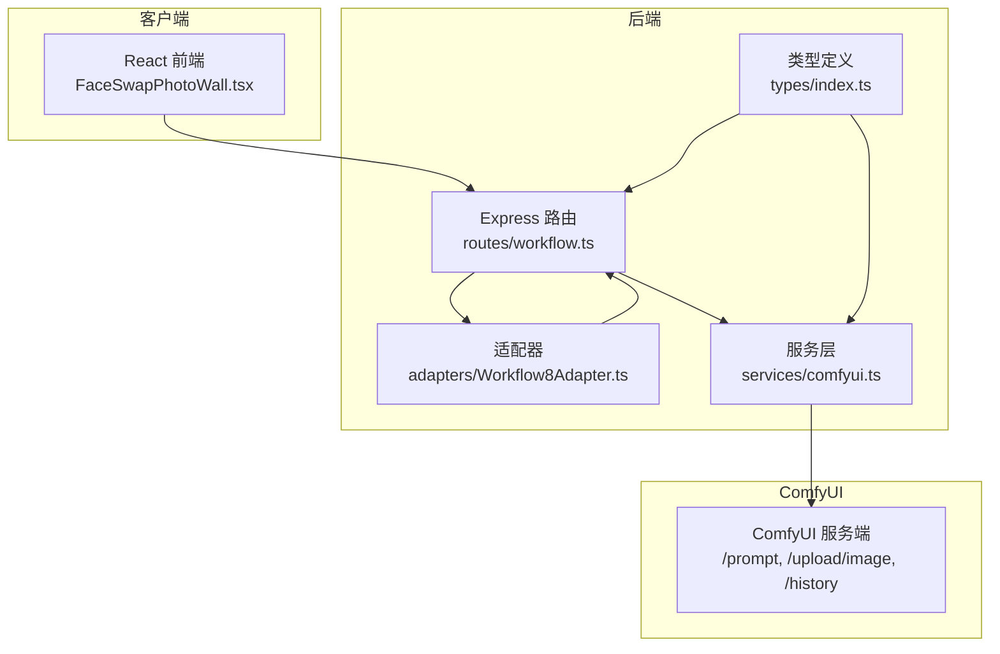
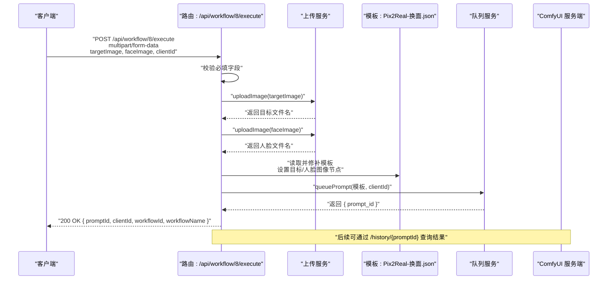
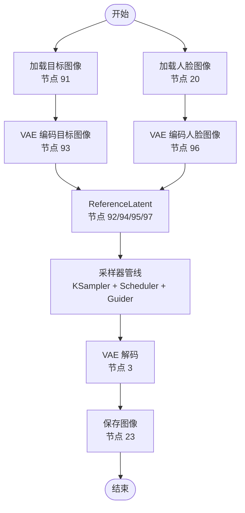
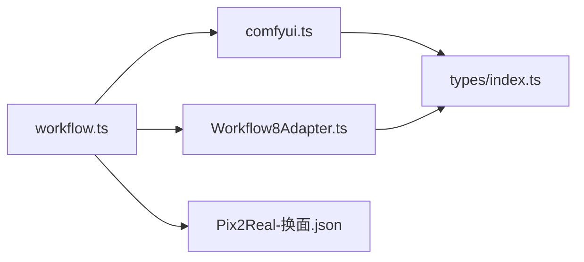

# 黑兽换脸工作流 API

<cite>
**本文引用的文件**
- [Workflow8Adapter.ts](file://server/src/adapters/Workflow8Adapter.ts)
- [workflow.ts](file://server/src/routes/workflow.ts)
- [comfyui.ts](file://server/src/services/comfyui.ts)
- [index.ts](file://server/src/types/index.ts)
- [Pix2Real-换面.json](file://ComfyUI_API/Pix2Real-换面.json)
- [FaceSwapPhotoWall.tsx](file://client/src/components/FaceSwapPhotoWall.tsx)
- [README.md](file://README.md)
</cite>

## 目录
1. [简介](#简介)
2. [项目结构](#项目结构)
3. [核心组件](#核心组件)
4. [架构总览](#架构总览)
5. [详细组件分析](#详细组件分析)
6. [依赖关系分析](#依赖关系分析)
7. [性能考量](#性能考量)
8. [故障排查指南](#故障排查指南)
9. [结论](#结论)
10. [附录](#附录)

## 简介
本文件面向“黑兽换脸”工作流（Workflow 8）的 API 使用与实现进行完整说明。该工作流通过上传两张图像（目标图像与人脸图像），调用 ComfyUI 中的换脸模板，完成高质量的人脸替换。本文涵盖：
- 执行接口的 HTTP 方法、URL 模式、请求参数与响应格式
- 同时上传目标图像与人脸图像的要求及校验规则
- 换脸算法处理机制与模板节点映射
- 文件上传验证、错误处理策略
- 换脸质量影响因素、参数配置建议与最佳实践
- 完整的 API 调用示例与注意事项

## 项目结构
后端采用 Express + TypeScript，前端使用 Vite + React + TypeScript。工作流模板位于 ComfyUI_API 目录，路由集中于 server/src/routes/workflow.ts，适配器模式用于加载与修补模板，服务层封装 ComfyUI 的上传、队列与历史查询等操作。

图表来源
- [workflow.ts:1-862](file://server/src/routes/workflow.ts#L1-L862)
- [Workflow8Adapter.ts:1-14](file://server/src/adapters/Workflow8Adapter.ts#L1-L14)
- [comfyui.ts:1-285](file://server/src/services/comfyui.ts#L1-L285)
- [index.ts:1-52](file://server/src/types/index.ts#L1-L52)

章节来源
- [README.md: 项目结构:41-62](file://README.md#L41-L62)
- [workflow.ts: 路由与适配器注册:1-862](file://server/src/routes/workflow.ts#L1-L862)

## 核心组件
- 工作流适配器（Workflow 8）
  - 适配器负责声明工作流 ID、名称、是否需要提示词、输出目录等元信息；对于 Workflow 8，明确指出其使用专用的 /8/execute 路由，不走通用 buildPrompt 流程。
- 路由处理器（/api/workflow/8/execute）
  - 使用多字段表单上传，要求同时提供 targetImage 与 faceImage；校验 clientId 存在性；将两张图片上传至 ComfyUI 并注入模板节点；入队生成的任务包含 promptId、clientId、workflowId、workflowName。
- 服务层（ComfyUI 交互）
  - 提供上传图像、入队、查询历史、获取系统统计、WebSocket 连接等能力，统一错误处理与状态码。
- 模板（Pix2Real-换面.json）
  - 包含换脸相关节点（VAE 编码/解码、UNet 加载、采样器、随机种子、保存图像等），通过路由注入目标图像与人脸图像路径。

章节来源
- [Workflow8Adapter.ts: 适配器定义:1-14](file://server/src/adapters/Workflow8Adapter.ts#L1-L14)
- [workflow.ts: /8/execute 路由实现:263-310](file://server/src/routes/workflow.ts#L263-L310)
- [comfyui.ts: 上传与队列接口:9-60](file://server/src/services/comfyui.ts#L9-L60)
- [Pix2Real-换面.json: 模板节点结构:1-369](file://ComfyUI_API/Pix2Real-换面.json#L1-L369)

## 架构总览
下图展示从客户端到 ComfyUI 的完整调用链路，以及关键错误处理点。

图表来源
- [workflow.ts: /8/execute 实现:263-310](file://server/src/routes/workflow.ts#L263-L310)
- [comfyui.ts: uploadImage/queuePrompt:9-60](file://server/src/services/comfyui.ts#L9-L60)
- [Pix2Real-换面.json: 模板节点映射:226-296](file://ComfyUI_API/Pix2Real-换面.json#L226-L296)

## 详细组件分析

### 接口定义：Workflow 8 执行
- HTTP 方法
  - POST
- URL 模式
  - /api/workflow/8/execute
- 查询参数
  - clientId: string（可选，优先使用查询参数，否则使用请求体中的 clientId）
- 表单字段（multipart/form-data）
  - targetImage: 单文件（目标图像）
  - faceImage: 单文件（人脸图像）
  - clientId: 字符串（必填）
- 请求体
  - 无（使用 multipart/form-data）
- 成功响应
  - 200 OK
  - 结构：{ promptId: string, clientId: string, workflowId: number, workflowName: string }
- 失败响应
  - 400 Bad Request：缺少 targetImage、faceImage 或 clientId
  - 500 Internal Server Error：服务器内部错误或 ComfyUI 调用失败

章节来源
- [workflow.ts: /8/execute 路由:263-310](file://server/src/routes/workflow.ts#L263-L310)

### 文件上传与验证规则
- 必须同时上传目标图像与人脸图像，缺一不可
- 必须提供 clientId，否则返回 400
- 上传流程
  - 将两张图片分别上传至 ComfyUI，返回文件名
  - 将文件名写入模板对应节点（目标图像与人脸图像节点）
  - 随机生成种子并注入模板
  - 入队生成任务
- 错误处理
  - 任何一步失败均抛出异常并返回 500
  - 上传失败会包含具体状态码与消息

章节来源
- [workflow.ts: 上传与模板修补逻辑:267-305](file://server/src/routes/workflow.ts#L267-L305)
- [comfyui.ts: uploadImage:9-25](file://server/src/services/comfyui.ts#L9-L25)

### 换脸算法处理机制与模板节点映射
- 模板核心节点（摘取关键节点）
  - LoadImage（目标图像）：节点编号 91
  - LoadImage（人脸图像）：节点编号 20
  - VAEEncode（目标图像 latent）：节点编号 93
  - VAEEncode（人脸图像 latent）：节点编号 96
  - ReferenceLatent（将人脸 latent 参考到目标 latent）：节点编号 94、92、95、97
  - KSamplerSelect + CFGGuider + Flux2Scheduler + SamplerCustomAdvanced：采样管线
  - VAE 解码 SaveImage：最终输出
  - Seed：随机种子节点编号 158
- 处理流程要点
  - 目标图像与人脸图像分别经 VAE 编码得到 latent
  - 通过 ReferenceLatent 将人脸 latent 的特征迁移到目标 latent 上
  - 使用采样器与调度器生成新图像，VAE 解码后保存
  - 模板中包含随机种子节点，确保每次运行结果不同
- 输出目录
  - 适配器声明输出目录为 “8-黑兽换脸”，最终产物保存在该目录下

图表来源
- [Pix2Real-换面.json: 关键节点:160-180](file://ComfyUI_API/Pix2Real-换面.json#L160-L180)
- [Pix2Real-换面.json: ReferenceLatent 链路:235-330](file://ComfyUI_API/Pix2Real-换面.json#L235-L330)
- [Workflow8Adapter.ts: 输出目录](file://server/src/adapters/Workflow8Adapter.ts#L8)

章节来源
- [Pix2Real-换面.json: 节点结构与连接:1-369](file://ComfyUI_API/Pix2Real-换面.json#L1-L369)
- [Workflow8Adapter.ts: 输出目录](file://server/src/adapters/Workflow8Adapter.ts#L8)

### API 调用示例
- curl 示例（Linux/macOS）
  - POST /api/workflow/8/execute
  - Content-Type: multipart/form-data
  - 参数：
    - targetImage: 目标图像文件
    - faceImage: 人脸图像文件
    - clientId: 客户端标识字符串
  - 示例命令（请根据实际路径与值调整）：
    - curl -X POST "http://localhost:3000/api/workflow/8/execute?clientId=<你的clientId>" \
      -F "targetImage=@/path/to/target.jpg" \
      -F "faceImage=@/path/to/face.jpg"
- 前端调用示例（React 组件）
  - 在前端组件中，用户拖拽目标图像与人脸图像后，构造 FormData 并调用 /api/workflow/8/execute
  - 参考路径：[FaceSwapPhotoWall.tsx:257-276](file://client/src/components/FaceSwapPhotoWall.tsx#L257-L276)

章节来源
- [workflow.ts: /8/execute 路由:263-310](file://server/src/routes/workflow.ts#L263-L310)
- [FaceSwapPhotoWall.tsx: 前端调用示例:257-276](file://client/src/components/FaceSwapPhotoWall.tsx#L257-L276)

### 换脸质量的影响因素与参数配置建议
- 图像质量与分辨率
  - 目标图像与人脸图像建议为高分辨率、清晰的正面照，避免过度模糊或畸变
- 人脸覆盖范围
  - 人脸图像需尽量覆盖完整面部，避免遮挡或过小
- 亮度与色调一致性
  - 目标图像与人脸图像的光照、色调尽量接近，有助于自然融合
- 随机种子
  - 模板内置随机种子节点，每次运行都会生成不同结果；如需复现，可在模板中固定种子值
- 采样步数与调度器
  - 采样步数越多通常越精细但耗时更长；可根据硬件性能与时间预算调整
- 输出命名
  - 模板默认保存前缀为 “Klein-BFS”，可按需修改以区分批次

章节来源
- [Pix2Real-换面.json: 采样与保存节点:1-369](file://ComfyUI_API/Pix2Real-换面.json#L1-L369)

### 最佳实践与注意事项
- 必须同时提供目标图像与人脸图像，否则请求会被拒绝
- 始终提供有效的 clientId，否则无法入队
- 若出现 500 错误，检查 ComfyUI 是否正常运行、网络连通性与磁盘空间
- 建议先在浏览器中打开输出目录确认结果路径
- 对于批量任务，建议分批提交并监控队列状态

章节来源
- [workflow.ts: 错误处理与响应:267-310](file://server/src/routes/workflow.ts#L267-L310)
- [comfyui.ts: getQueue:202-221](file://server/src/services/comfyui.ts#L202-L221)

## 依赖关系分析
- 路由依赖适配器与服务层
  - /8/execute 路由依赖上传服务与队列服务，同时读取模板文件
- 适配器提供元信息与输出目录
  - 适配器声明工作流 ID、名称与输出目录，供前端与文件管理使用
- 类型定义贯穿前后端
  - QueueResponse、HistoryEntry 等类型在路由与服务层之间传递

图表来源
- [workflow.ts:1-862](file://server/src/routes/workflow.ts#L1-L862)
- [Workflow8Adapter.ts:1-14](file://server/src/adapters/Workflow8Adapter.ts#L1-L14)
- [comfyui.ts:1-285](file://server/src/services/comfyui.ts#L1-L285)
- [index.ts:1-52](file://server/src/types/index.ts#L1-L52)

章节来源
- [workflow.ts:1-862](file://server/src/routes/workflow.ts#L1-L862)
- [index.ts:1-52](file://server/src/types/index.ts#L1-L52)

## 性能考量
- 上传与解码
  - 两张图像均需上传并进行 VAE 编码，图像越大耗时越长
- 采样与解码
  - 采样步数与图像尺寸直接影响生成时间
- 内存占用
  - 可通过释放内存工作流降低显存占用，避免 OOM
- 并发与队列
  - 建议控制并发数量，合理利用队列优先级功能

[本节为通用指导，无需特定文件来源]

## 故障排查指南
- 400 错误
  - 缺少 targetImage、faceImage 或 clientId
  - 检查 multipart/form-data 是否正确构造
- 500 错误
  - 上传失败：检查 ComfyUI 服务端状态与磁盘空间
  - 入队失败：检查 /prompt 接口可用性与网络连通性
- 结果为空或质量差
  - 检查输入图像分辨率与光照一致性
  - 调整采样步数与随机种子
- 获取历史与进度
  - 可通过 /history/{promptId} 查询任务状态与输出文件列表

章节来源
- [workflow.ts: 错误处理:267-310](file://server/src/routes/workflow.ts#L267-L310)
- [comfyui.ts: getHistory:62-71](file://server/src/services/comfyui.ts#L62-L71)

## 结论
Workflow 8 的黑兽换脸 API 通过严格的双图像上传校验与模板化的节点映射，实现了稳定的人脸替换流程。结合合理的图像质量、参数配置与错误处理策略，可获得高质量的换脸结果。建议在生产环境中配合队列监控与内存管理，确保稳定性与性能。

[本节为总结，无需特定文件来源]

## 附录

### API 参考摘要
- 端点：POST /api/workflow/8/execute
- 查询参数：clientId（可选，优先查询参数）
- 表单字段：
  - targetImage: 目标图像（必填）
  - faceImage: 人脸图像（必填）
  - clientId: 客户端标识（必填）
- 成功响应：{ promptId, clientId, workflowId, workflowName }
- 失败响应：400 或 500，携带错误信息

章节来源
- [workflow.ts: /8/execute:263-310](file://server/src/routes/workflow.ts#L263-L310)