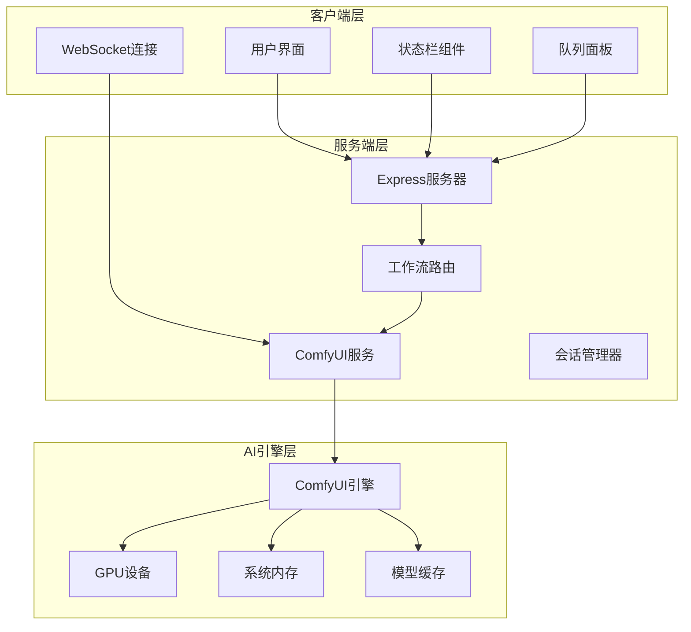
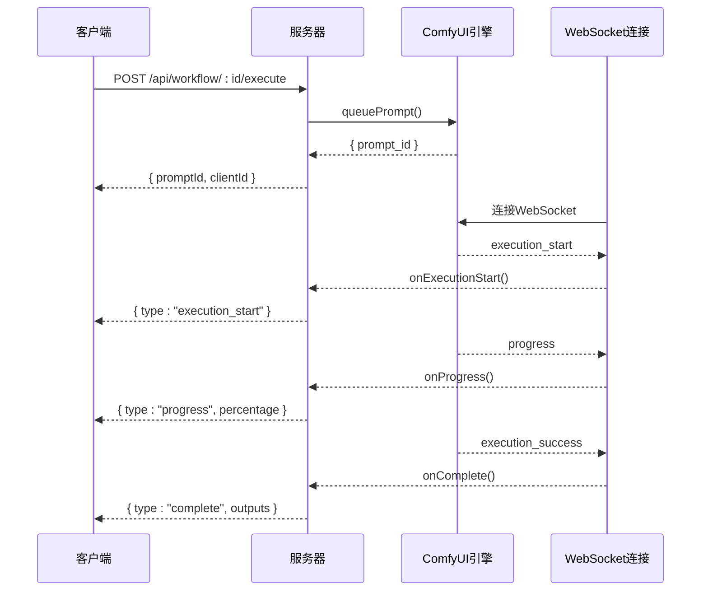
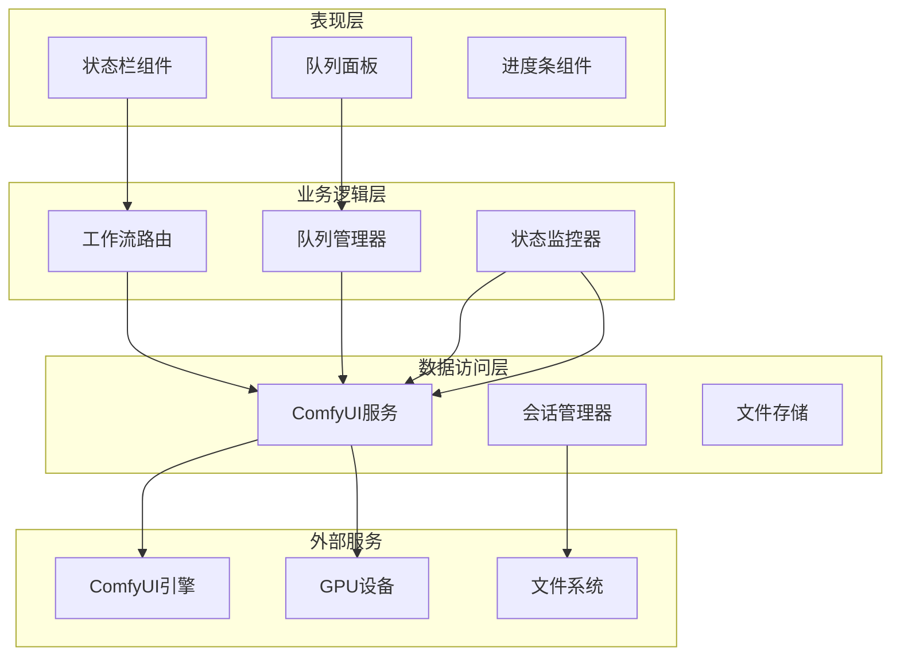
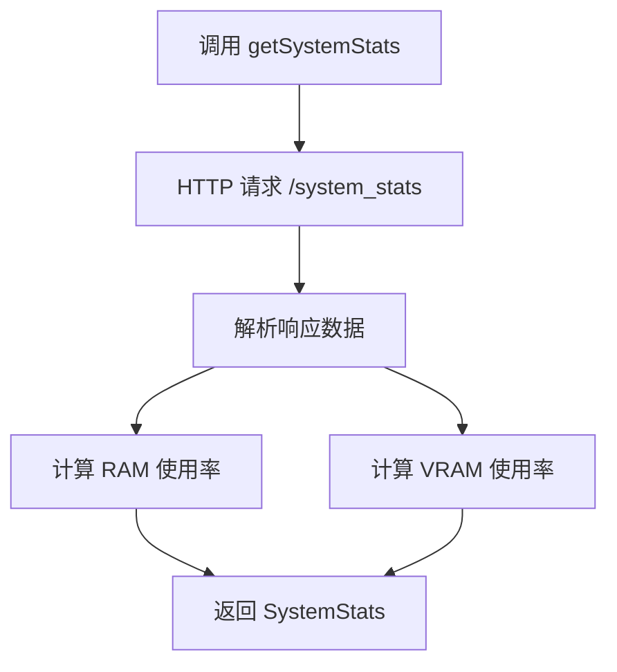
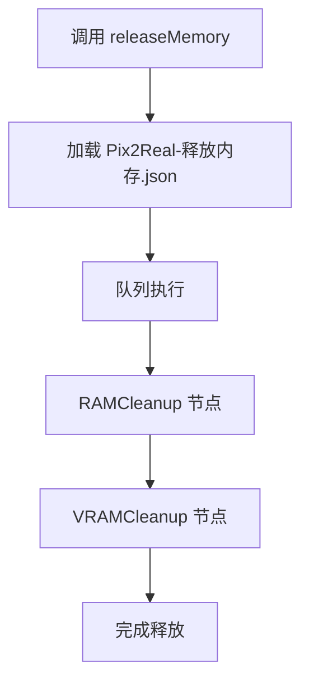
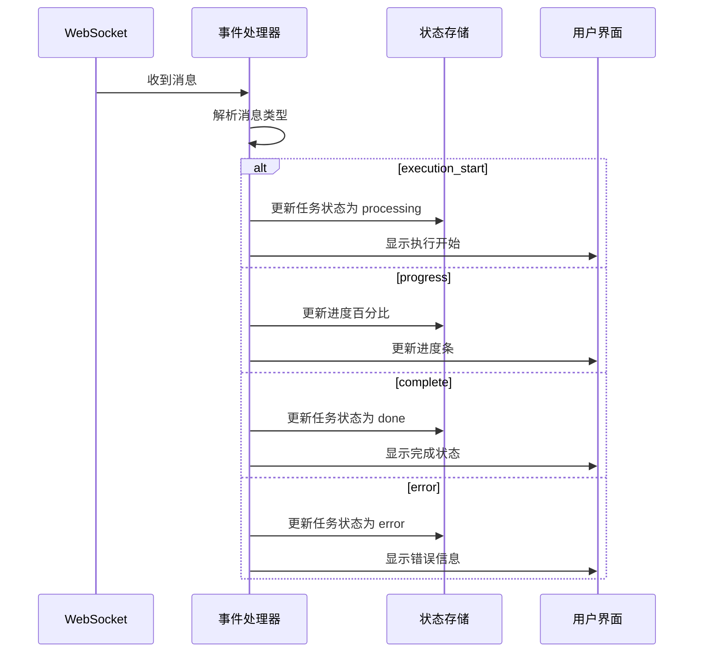
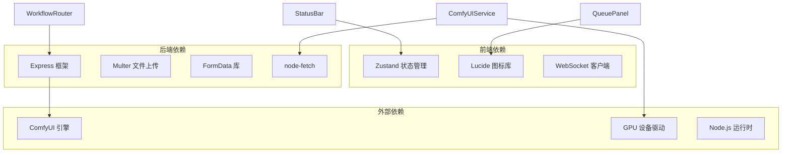

# 系统监控 API

<cite>
**本文档引用的文件**
- [server/src/index.ts](file://server/src/index.ts)
- [server/src/routes/workflow.ts](file://server/src/routes/workflow.ts)
- [server/src/services/comfyui.ts](file://server/src/services/comfyui.ts)
- [server/src/types/index.ts](file://server/src/types/index.ts)
- [client/src/components/StatusBar.tsx](file://client/src/components/StatusBar.tsx)
- [client/src/components/QueuePanel.tsx](file://client/src/components/QueuePanel.tsx)
- [client/src/hooks/useWorkflowStore.ts](file://client/src/hooks/useWorkflowStore.ts)
- [ComfyUI_API/Pix2Real-释放内存.json](file://ComfyUI_API/Pix2Real-释放内存.json)
</cite>

## 目录
1. [简介](#简介)
2. [项目结构](#项目结构)
3. [核心组件](#核心组件)
4. [架构概览](#架构概览)
5. [详细组件分析](#详细组件分析)
6. [依赖关系分析](#依赖关系分析)
7. [性能考虑](#性能考虑)
8. [故障排除指南](#故障排除指南)
9. [结论](#结论)
10. [附录](#附录)

## 简介

系统监控 API 是 CorineKit Pix2Real 项目中的核心监控组件，负责实时监控和管理系统资源使用情况，包括 GPU 显存和系统内存状态。该 API 提供了完整的系统状态监控、内存释放、工作流执行状态跟踪等功能，为用户提供了直观的资源使用可视化界面。

本系统通过与 ComfyUI 的深度集成，实现了对 AI 工作流执行过程的全面监控，包括进度跟踪、错误处理、资源管理等关键功能。系统采用前后端分离架构，前端提供实时的状态显示和交互控制，后端负责与 ComfyUI 的通信和数据处理。

## 项目结构

系统监控 API 的整体架构由以下主要组件构成：



**图表来源**
- [server/src/index.ts:1-228](file://server/src/index.ts#L1-L228)
- [server/src/routes/workflow.ts:1-862](file://server/src/routes/workflow.ts#L1-L862)
- [server/src/services/comfyui.ts:1-285](file://server/src/services/comfyui.ts#L1-L285)

**章节来源**
- [server/src/index.ts:1-228](file://server/src/index.ts#L1-L228)
- [server/src/routes/workflow.ts:1-862](file://server/src/routes/workflow.ts#L1-L862)

## 核心组件

### 系统状态监控接口

系统监控 API 提供了两个核心的监控接口：

#### 系统统计接口
- **端点**: `GET /api/workflow/system-stats`
- **功能**: 获取当前系统的 GPU 显存和系统内存使用率
- **响应格式**: 
  ```json
  {
    "vram": number | null,
    "ram": number
  }
  ```
- **vram 字段**: GPU 显存使用百分比 (0-100)，无 GPU 时为 null
- **ram 字段**: 系统内存使用百分比 (0-100)

#### 内存释放接口
- **端点**: `POST /api/workflow/release-memory`
- **功能**: 触发系统内存释放操作，清理 GPU 显存和系统内存缓存
- **请求参数**: 
  - `clientId`: 客户端标识符 (必需)
- **响应格式**: `{ "promptId": string, "clientId": string }`

### 工作流执行状态监控

系统提供了完整的工作流执行状态跟踪机制：



**图表来源**
- [server/src/index.ts:73-219](file://server/src/index.ts#L73-L219)
- [server/src/services/comfyui.ts:127-188](file://server/src/services/comfyui.ts#L127-L188)

**章节来源**
- [server/src/routes/workflow.ts:531-559](file://server/src/routes/workflow.ts#L531-L559)
- [server/src/services/comfyui.ts:101-125](file://server/src/services/comfyui.ts#L101-L125)

## 架构概览

系统监控 API 采用了分层架构设计，确保了良好的可维护性和扩展性：



**图表来源**
- [server/src/index.ts:42-61](file://server/src/index.ts#L42-L61)
- [server/src/routes/workflow.ts:29-38](file://server/src/routes/workflow.ts#L29-L38)

## 详细组件分析

### 状态栏组件 (StatusBar)

状态栏组件是系统监控的核心可视化组件，提供了实时的资源使用情况展示：

#### 实时监控机制
- **轮询频率**: 每 2 秒向 `/api/workflow/system-stats` 发送请求
- **平滑动画**: 使用 requestAnimationFrame 实现 VRAM/RAM 使用率的平滑过渡效果
- **颜色编码**: 根据使用率动态调整颜色 (绿色: 正常, 黄色: 警告, 红色: 危险)

#### 监控指标
- **显存使用率**: 显示 GPU 显存使用百分比，无 GPU 时显示为 null
- **内存使用率**: 显示系统内存使用百分比
- **状态指示**: 通过颜色和进度条直观反映资源使用状况

**章节来源**
- [client/src/components/StatusBar.tsx:67-102](file://client/src/components/StatusBar.tsx#L67-L102)
- [client/src/components/StatusBar.tsx:216-239](file://client/src/components/StatusBar.tsx#L216-L239)

### 队列面板组件 (QueuePanel)

队列面板提供了工作流执行队列的可视化管理界面：

#### 队列状态展示
- **运行中任务**: 显示当前正在执行的任务，带脉冲动画效果
- **排队中任务**: 显示等待执行的任务
- **任务详情**: 包括工作流名称、图像文件名、进度条等信息

#### 交互功能
- **置顶功能**: 将任务移动到队列前端执行
- **取消功能**: 删除队列中的任务
- **定位功能**: 双击任务在主界面中定位对应的图像卡片

**章节来源**
- [client/src/components/QueuePanel.tsx:37-87](file://client/src/components/QueuePanel.tsx#L37-L87)
- [client/src/components/QueuePanel.tsx:89-116](file://client/src/components/QueuePanel.tsx#L89-L116)

### ComfyUI 服务层

ComfyUI 服务层封装了与 ComfyUI 引擎的所有交互逻辑：

#### 系统统计服务


**图表来源**
- [server/src/services/comfyui.ts:106-125](file://server/src/services/comfyui.ts#L106-L125)

#### 内存释放服务
内存释放功能通过执行预定义的 ComfyUI 工作流模板实现：



**图表来源**
- [server/src/routes/workflow.ts:542-559](file://server/src/routes/workflow.ts#L542-L559)
- [ComfyUI_API/Pix2Real-释放内存.json:1-39](file://ComfyUI_API/Pix2Real-释放内存.json#L1-L39)

**章节来源**
- [server/src/services/comfyui.ts:101-125](file://server/src/services/comfyui.ts#L101-L125)
- [server/src/routes/workflow.ts:542-559](file://server/src/routes/workflow.ts#L542-L559)

### WebSocket 事件处理

系统通过 WebSocket 实时接收 ComfyUI 的执行状态更新：

#### 事件类型
- **execution_start**: 工作流开始执行
- **progress**: 执行进度更新 (包含百分比)
- **complete**: 工作流执行完成
- **error**: 执行过程中发生错误

#### 事件处理流程


**图表来源**
- [server/src/index.ts:94-188](file://server/src/index.ts#L94-L188)

**章节来源**
- [server/src/index.ts:94-188](file://server/src/index.ts#L94-L188)
- [server/src/types/index.ts:10-30](file://server/src/types/index.ts#L10-L30)

## 依赖关系分析

系统监控 API 的依赖关系呈现清晰的分层结构：



**图表来源**
- [client/src/hooks/useWorkflowStore.ts:1-645](file://client/src/hooks/useWorkflowStore.ts#L1-L645)
- [server/src/index.ts:1-14](file://server/src/index.ts#L1-L14)

### 组件耦合度分析

- **低耦合**: 前端组件与后端服务通过 HTTP API 和 WebSocket 进行松耦合通信
- **高内聚**: 每个模块专注于特定的功能领域 (监控、队列管理、状态存储)
- **清晰边界**: 各层之间的职责明确，便于独立测试和维护

**章节来源**
- [client/src/hooks/useWorkflowStore.ts:1-645](file://client/src/hooks/useWorkflowStore.ts#L1-L645)
- [server/src/routes/workflow.ts:1-862](file://server/src/routes/workflow.ts#L1-L862)

## 性能考虑

### 监控频率优化

系统采用了智能的监控策略来平衡性能和实时性：

#### 状态栏监控
- **轮询间隔**: 2 秒一次，避免过度频繁的 API 调用
- **平滑动画**: 使用 requestAnimationFrame 实现 60fps 的流畅动画效果
- **目标值缓存**: 使用目标值和当前值的差值计算，减少不必要的 UI 更新

#### 队列监控
- **轮询间隔**: 2 秒一次，与状态栏监控保持一致
- **增量更新**: 只在队列状态发生变化时更新 UI
- **错误容错**: 在 ComfyUI 不可用时保持界面稳定

### 内存管理最佳实践

#### 自动内存释放
- **触发时机**: 当显存使用率超过阈值或用户手动触发时
- **清理策略**: 同时清理 RAM 缓存和 GPU 显存缓存
- **重试机制**: 支持最多 3 次重试，确保清理操作的成功

#### 工作流优化
- **批量处理**: 支持批量执行多个工作流，提高吞吐量
- **优先级管理**: 允许用户调整任务优先级，优化资源分配
- **错误恢复**: 自动处理执行错误，提供重试机制

### 性能监控指标

#### 关键指标
- **响应时间**: API 请求的平均响应时间
- **并发处理**: 同时处理的工作流数量
- **资源利用率**: GPU 显存和 CPU 内存的使用效率
- **错误率**: 执行失败的比例

#### 监控建议
- **定期检查**: 建议每 5 分钟检查一次系统状态
- **阈值设置**: 设置合理的资源使用阈值警报
- **日志记录**: 记录重要的性能指标变化

## 故障排除指南

### 常见问题诊断

#### ComfyUI 连接问题
**症状**: `/api/workflow/system-stats` 返回 502 错误
**解决方案**:
1. 检查 ComfyUI 服务是否正常运行
2. 验证 ComfyUI_URL 配置是否正确
3. 确认防火墙设置允许本地连接

#### WebSocket 连接失败
**症状**: 状态栏不更新，进度条不显示
**解决方案**:
1. 检查 WebSocket 服务器是否启动
2. 验证客户端和服务器的版本兼容性
3. 查看浏览器开发者工具中的网络错误

#### 内存释放无效
**症状**: 调用 `/api/workflow/release-memory` 后资源使用率不变
**解决方案**:
1. 确认工作流已完全停止执行
2. 检查是否有其他进程占用 GPU 显存
3. 重启 ComfyUI 服务以强制释放资源

### 调试方法

#### 日志分析
- **前端日志**: 查看浏览器控制台中的错误信息
- **后端日志**: 检查服务器输出的详细错误堆栈
- **ComfyUI 日志**: 分析 AI 引擎的执行日志

#### 性能分析
- **网络监控**: 使用浏览器开发者工具分析 API 调用性能
- **内存分析**: 监控前端应用的内存使用情况
- **CPU 分析**: 检查主线程的阻塞情况

**章节来源**
- [server/src/services/comfyui.ts:106-125](file://server/src/services/comfyui.ts#L106-L125)
- [server/src/index.ts:177-188](file://server/src/index.ts#L177-L188)

## 结论

系统监控 API 为 CorineKit Pix2Real 项目提供了完整的资源监控和管理工作流。通过精心设计的架构和用户友好的界面，系统能够有效地帮助用户监控和管理 AI 工作流的执行状态。

### 主要优势
- **实时监控**: 提供准确的 GPU 显存和系统内存使用情况
- **直观界面**: 通过状态栏和队列面板直观展示系统状态
- **自动化管理**: 支持自动内存释放和工作流优先级管理
- **错误处理**: 完善的错误处理和恢复机制

### 改进建议
- **指标扩展**: 可以添加更多系统指标如 CPU 使用率、磁盘 I/O 等
- **历史记录**: 提供资源使用的历史趋势分析
- **告警机制**: 实现基于阈值的自动告警功能
- **性能优化**: 进一步优化监控频率和数据传输效率

## 附录

### API 接口规范

#### 系统统计接口
- **方法**: GET
- **路径**: `/api/workflow/system-stats`
- **响应**: `{"vram": number | null, "ram": number}`
- **状态码**: 200 成功, 502 ComfyUI 不可用

#### 内存释放接口
- **方法**: POST  
- **路径**: `/api/workflow/release-memory`
- **请求体**: `{"clientId": string}`
- **响应**: `{"promptId": string, "clientId": string}`
- **状态码**: 200 成功, 400 缺少 clientId, 500 服务器错误

### 监控数据可视化建议

#### 颜色编码标准
- **绿色 (0-60%)**: 正常使用率，无需担心
- **黄色 (60-85%)**: 警告使用率，建议关注
- **红色 (85-100%)**: 危险使用率，需要立即采取措施

#### 最佳实践
- **定期监控**: 建议每 2-5 分钟检查一次系统状态
- **阈值设置**: 根据工作负载设置合适的资源使用阈值
- **预防性维护**: 在使用率达到 70% 时考虑释放内存
- **性能调优**: 根据监控结果调整工作流参数和并发度