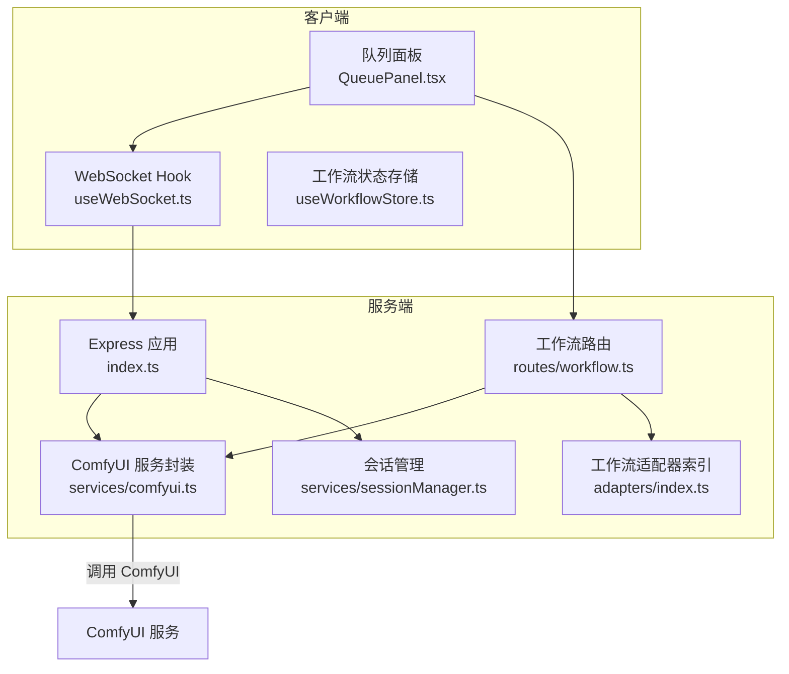
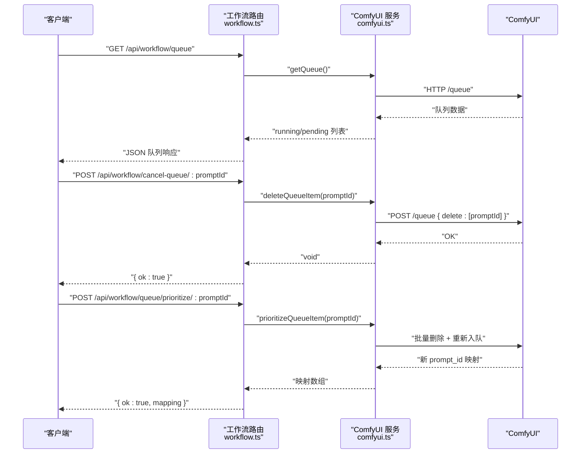
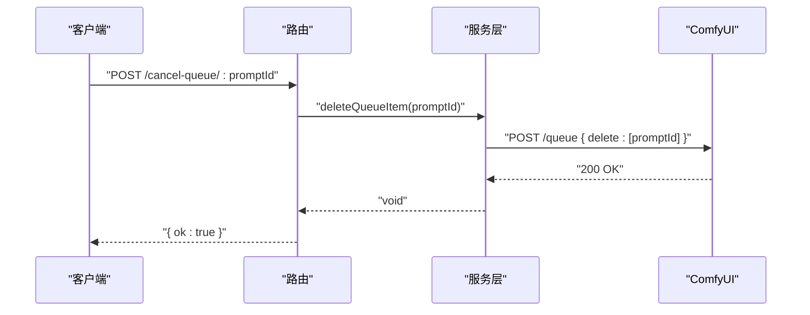
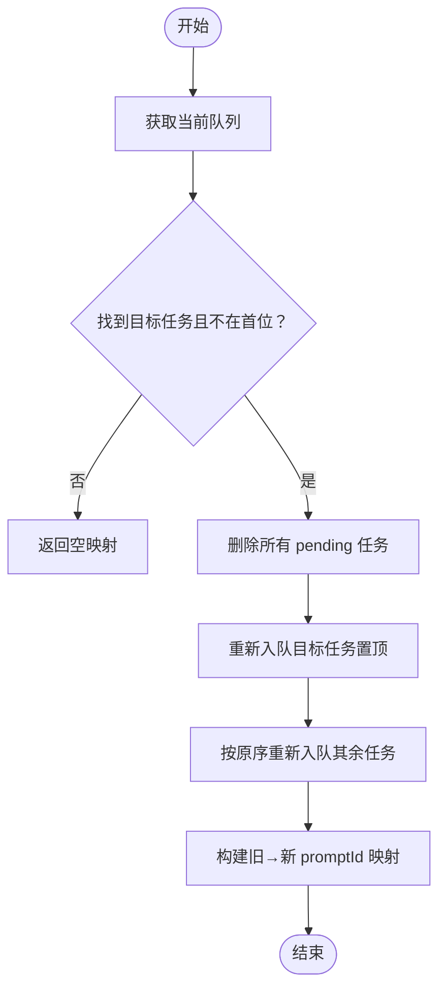
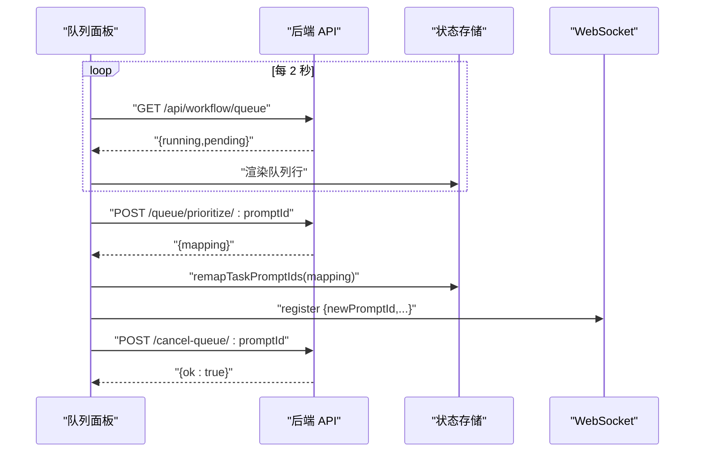
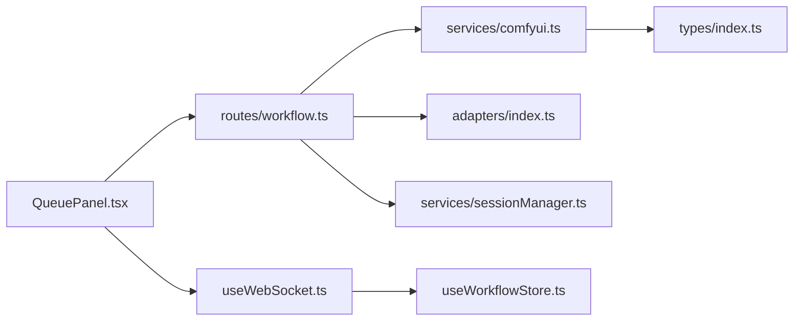

# 队列管理 API

<cite>
**本文引用的文件**
- [server/src/index.ts](file://server/src/index.ts)
- [server/src/routes/workflow.ts](file://server/src/routes/workflow.ts)
- [server/src/services/comfyui.ts](file://server/src/services/comfyui.ts)
- [server/src/services/sessionManager.ts](file://server/src/services/sessionManager.ts)
- [server/src/adapters/index.ts](file://server/src/adapters/index.ts)
- [server/src/types/index.ts](file://server/src/types/index.ts)
- [client/src/components/QueuePanel.tsx](file://client/src/components/QueuePanel.tsx)
- [client/src/hooks/useWorkflowStore.ts](file://client/src/hooks/useWorkflowStore.ts)
- [client/src/hooks/useWebSocket.ts](file://client/src/hooks/useWebSocket.ts)
- [client/src/tabs/Workflow0SettingsPanel.tsx](file://client/src/components/Workflow0SettingsPanel.tsx)
- [client/src/tabs/Workflow2SettingsPanel.tsx](file://client/src/components/Workflow2SettingsPanel.tsx)
- [client/src/tabs/Workflow7SettingsPanel.tsx](file://client/src/components/Workflow7SettingsPanel.tsx)
- [client/src/tabs/Workflow9SettingsPanel.tsx](file://client/src/components/Workflow9SettingsPanel.tsx)
</cite>

## 目录
1. [简介](#简介)
2. [项目结构](#项目结构)
3. [核心组件](#核心组件)
4. [架构总览](#架构总览)
5. [详细组件分析](#详细组件分析)
6. [依赖关系分析](#依赖关系分析)
7. [性能考量](#性能考量)
8. [故障排查指南](#故障排查指南)
9. [结论](#结论)
10. [附录：API 参考与最佳实践](#附录api-参考与最佳实践)

## 简介
本文件面向“队列管理 API”的使用与维护，聚焦工作流队列的管理接口，包括：
- 获取队列状态：GET /api/workflow/queue
- 取消队列项：POST /api/workflow/cancel-queue/:promptId
- 优先级调整：POST /api/workflow/queue/prioritize/:promptId

同时，文档阐述队列的工作原理、状态管理、并发控制机制，并提供队列监控与管理的最佳实践，包括队列长度控制、超时处理、错误恢复策略。最后给出具体的 API 调用示例与队列状态查询方法。

## 项目结构
后端采用 Express + WebSocket 架构，路由层负责暴露队列管理接口；服务层封装与 ComfyUI 的交互；前端通过 WebSocket 实时接收进度与完成事件，并在 UI 中展示队列面板。

图表来源
- [server/src/index.ts:62-219](file://server/src/index.ts#L62-L219)
- [server/src/routes/workflow.ts:561-579](file://server/src/routes/workflow.ts#L561-L579)
- [server/src/services/comfyui.ts:47-284](file://server/src/services/comfyui.ts#L47-L284)
- [client/src/components/QueuePanel.tsx:37-121](file://client/src/components/QueuePanel.tsx#L37-L121)

章节来源
- [server/src/index.ts:42-61](file://server/src/index.ts#L42-L61)
- [server/src/routes/workflow.ts:22-520](file://server/src/routes/workflow.ts#L22-L520)

## 核心组件
- 队列管理路由
  - GET /api/workflow/queue：获取当前运行中与待处理的任务列表
  - POST /api/workflow/cancel-queue/:promptId：从队列中移除指定任务
  - POST /api/workflow/queue/prioritize/:promptId：将指定任务置顶至下一个执行位置
- ComfyUI 服务封装
  - 提供队列查询、任务删除、优先级重排、系统统计等底层能力
- 前端队列面板
  - 定时轮询队列状态，支持置顶与删除操作，并在执行过程中同步进度

章节来源
- [server/src/routes/workflow.ts:561-579](file://server/src/routes/workflow.ts#L561-L579)
- [server/src/services/comfyui.ts:202-284](file://server/src/services/comfyui.ts#L202-L284)
- [client/src/components/QueuePanel.tsx:37-121](file://client/src/components/QueuePanel.tsx#L37-L121)

## 架构总览
后端通过 Express 暴露 REST 接口，同时提供 WebSocket 通道用于实时事件推送。前端通过 WebSocket 订阅进度、完成与错误事件，并在 UI 中展示队列面板。队列管理 API 通过服务层直接与 ComfyUI 通信，实现对队列的读取、删除与重排。

图表来源
- [server/src/routes/workflow.ts:561-579](file://server/src/routes/workflow.ts#L561-L579)
- [server/src/services/comfyui.ts:90-284](file://server/src/services/comfyui.ts#L90-L284)

## 详细组件分析

### 队列状态查询 /api/workflow/queue
- 功能：返回当前正在运行与等待中的任务列表
- 请求方式：GET
- 路由实现：调用服务层 getQueue()，内部通过 HTTP 查询 ComfyUI 的 /queue 接口
- 响应结构：包含 running 与 pending 两个数组，每项包含 queueNumber、promptId、prompt、clientId 等字段
- 错误处理：当 ComfyUI 不可用时返回 502 并携带错误信息

```mermaid
flowchart TD
Start(["请求进入"]) --> CallGetQueue["调用 getQueue()"]
CallGetQueue --> FetchComfy["HTTP /queue"]
FetchComfy --> Ok{"响应成功？"}
Ok --> |是| MapItems["映射为 {queueNumber,promptId,prompt,clientId}"]
MapItems --> Return["返回 {running,pending}"]
Ok --> |否| Err["抛出错误或返回 502"]
```

图表来源
- [server/src/routes/workflow.ts:561-569](file://server/src/routes/workflow.ts#L561-L569)
- [server/src/services/comfyui.ts:202-221](file://server/src/services/comfyui.ts#L202-L221)

章节来源
- [server/src/routes/workflow.ts:561-569](file://server/src/routes/workflow.ts#L561-L569)
- [server/src/services/comfyui.ts:202-221](file://server/src/services/comfyui.ts#L202-L221)

### 取消队列项 /api/workflow/cancel-queue/:promptId
- 功能：从队列中移除指定的待处理任务
- 请求方式：POST
- 路由实现：调用服务层 deleteQueueItem(promptId)，内部向 ComfyUI 的 /queue 接口发送删除请求
- 响应：成功返回 { ok:true }，失败返回 500 与错误信息
- 注意：仅对 pending 队列中的任务有效；running 中的任务无法直接删除

图表来源
- [server/src/routes/workflow.ts:522-530](file://server/src/routes/workflow.ts#L522-L530)
- [server/src/services/comfyui.ts:90-99](file://server/src/services/comfyui.ts#L90-L99)

章节来源
- [server/src/routes/workflow.ts:522-530](file://server/src/routes/workflow.ts#L522-L530)
- [server/src/services/comfyui.ts:90-99](file://server/src/services/comfyui.ts#L90-L99)

### 优先级调整 /api/workflow/queue/prioritize/:promptId
- 功能：将指定的待处理任务置顶，使其成为下一个执行的任务
- 请求方式：POST
- 路由实现：调用服务层 prioritizeQueueItem(promptId)
- 实现要点：
  - 先获取当前队列，定位目标任务
  - 删除所有 pending 任务
  - 将目标任务重新入队至首位
  - 再按原顺序将其他任务依次重新入队
  - 返回旧 promptId → 新 promptId 的映射，便于前端更新注册信息
- 响应：{ ok:true, mapping }

图表来源
- [server/src/routes/workflow.ts:571-579](file://server/src/routes/workflow.ts#L571-L579)
- [server/src/services/comfyui.ts:255-284](file://server/src/services/comfyui.ts#L255-L284)

章节来源
- [server/src/routes/workflow.ts:571-579](file://server/src/routes/workflow.ts#L571-L579)
- [server/src/services/comfyui.ts:255-284](file://server/src/services/comfyui.ts#L255-L284)

### 前端队列面板与交互
- 轮询刷新：每 2 秒拉取一次队列状态，构建运行中/排队中行
- 置顶操作：调用 /api/workflow/queue/prioritize/:promptId，收到映射后更新本地状态并重新注册新的 promptId
- 删除操作：调用 /api/workflow/cancel-queue/:promptId
- 定位功能：双击队列行可跳转到对应卡片并高亮闪烁

图表来源
- [client/src/components/QueuePanel.tsx:37-121](file://client/src/components/QueuePanel.tsx#L37-L121)
- [client/src/hooks/useWorkflowStore.ts:166-195](file://client/src/hooks/useWorkflowStore.ts#L166-L195)
- [client/src/hooks/useWebSocket.ts:91-98](file://client/src/hooks/useWebSocket.ts#L91-L98)

章节来源
- [client/src/components/QueuePanel.tsx:37-121](file://client/src/components/QueuePanel.tsx#L37-L121)
- [client/src/hooks/useWorkflowStore.ts:166-195](file://client/src/hooks/useWorkflowStore.ts#L166-L195)
- [client/src/hooks/useWebSocket.ts:91-98](file://client/src/hooks/useWebSocket.ts#L91-L98)

## 依赖关系分析
- 路由层依赖服务层提供的队列查询、删除、重排与系统统计能力
- 服务层依赖 ComfyUI 的 HTTP 与 WebSocket 接口
- 前端依赖 WebSocket 通道接收进度与完成事件，并与路由层交互以管理队列

图表来源
- [server/src/routes/workflow.ts:1-11](file://server/src/routes/workflow.ts#L1-L11)
- [server/src/services/comfyui.ts:1-8](file://server/src/services/comfyui.ts#L1-L8)
- [server/src/types/index.ts:1-52](file://server/src/types/index.ts#L1-L52)
- [server/src/adapters/index.ts:13-28](file://server/src/adapters/index.ts#L13-L28)
- [server/src/services/sessionManager.ts:6](file://server/src/services/sessionManager.ts#L6)
- [client/src/components/QueuePanel.tsx:35](file://client/src/components/QueuePanel.tsx#L35)
- [client/src/hooks/useWebSocket.ts:29](file://client/src/hooks/useWebSocket.ts#L29)
- [client/src/hooks/useWorkflowStore.ts:1-50](file://client/src/hooks/useWorkflowStore.ts#L1-L50)

章节来源
- [server/src/routes/workflow.ts:1-11](file://server/src/routes/workflow.ts#L1-L11)
- [server/src/services/comfyui.ts:1-8](file://server/src/services/comfyui.ts#L1-L8)
- [client/src/components/QueuePanel.tsx:35](file://client/src/components/QueuePanel.tsx#L35)

## 性能考量
- 队列轮询频率：前端默认每 2 秒轮询一次，可根据队列负载适当降低频率以减少请求压力
- 批量重排策略：优先级调整会一次性删除并重新入队全部 pending 任务，建议在队列较长时谨慎使用，避免频繁触发重排
- WebSocket 事件去重：服务端已对执行开始与完成事件进行去重处理，前端无需重复处理
- 资源回收：可通过释放内存工作流清理显存/内存，避免长时间运行导致资源耗尽

## 故障排查指南
- 队列查询失败
  - 现象：返回 502 或无响应
  - 排查：确认 ComfyUI 是否正常运行，网络连通性是否良好
  - 参考：[server/src/routes/workflow.ts:561-569](file://server/src/routes/workflow.ts#L561-L569)、[server/src/services/comfyui.ts:202-221](file://server/src/services/comfyui.ts#L202-L221)
- 取消队列项无效
  - 现象：调用成功但任务仍在运行
  - 排查：仅对 pending 队列有效；若任务已进入执行阶段则无法删除
  - 参考：[server/src/routes/workflow.ts:522-530](file://server/src/routes/workflow.ts#L522-L530)、[server/src/services/comfyui.ts:90-99](file://server/src/services/comfyui.ts#L90-L99)
- 优先级调整后输出丢失
  - 现象：任务被置顶但输出保存路径异常
  - 排查：确保收到映射后，前端重新向 WebSocket 注册新的 promptId，以便正确保存输出
  - 参考：[client/src/components/QueuePanel.tsx:107-112](file://client/src/components/QueuePanel.tsx#L107-L112)、[server/src/index.ts:195-209](file://server/src/index.ts#L195-L209)
- 进度不更新
  - 现象：任务执行中无进度事件
  - 排查：检查 WebSocket 连接状态与消息解析逻辑；确认 ComfyUI 版本兼容性
  - 参考：[client/src/hooks/useWebSocket.ts:26-51](file://client/src/hooks/useWebSocket.ts#L26-L51)、[server/src/services/comfyui.ts:143-181](file://server/src/services/comfyui.ts#L143-L181)

章节来源
- [server/src/routes/workflow.ts:522-569](file://server/src/routes/workflow.ts#L522-L569)
- [server/src/services/comfyui.ts:90-221](file://server/src/services/comfyui.ts#L90-L221)
- [client/src/components/QueuePanel.tsx:107-112](file://client/src/components/QueuePanel.tsx#L107-L112)
- [client/src/hooks/useWebSocket.ts:26-51](file://client/src/hooks/useWebSocket.ts#L26-L51)

## 结论
队列管理 API 通过简洁的三个接口实现了对 ComfyUI 队列的完整控制：查询、删除与重排。配合前端队列面板与 WebSocket 实时事件，用户可以直观地管理任务队列。在实际部署中，建议结合业务场景合理设置轮询频率、谨慎使用优先级调整，并建立完善的错误恢复与资源回收机制，以获得稳定高效的队列管理体验。

## 附录：API 参考与最佳实践

### API 参考
- 获取队列状态
  - 方法：GET
  - 路径：/api/workflow/queue
  - 成功响应：包含 running 与 pending 数组
  - 失败响应：502 或错误信息
  - 参考：[server/src/routes/workflow.ts:561-569](file://server/src/routes/workflow.ts#L561-L569)
- 取消队列项
  - 方法：POST
  - 路径：/api/workflow/cancel-queue/:promptId
  - 成功响应：{ ok:true }
  - 失败响应：500 或错误信息
  - 参考：[server/src/routes/workflow.ts:522-530](file://server/src/routes/workflow.ts#L522-L530)
- 优先级调整
  - 方法：POST
  - 路径：/api/workflow/queue/prioritize/:promptId
  - 成功响应：{ ok:true, mapping:[{ oldPromptId,newPromptId }] }
  - 失败响应：500 或错误信息
  - 参考：[server/src/routes/workflow.ts:571-579](file://server/src/routes/workflow.ts#L571-L579)

### 最佳实践
- 队列长度控制
  - 在业务入口处限制单次提交数量，避免队列过长导致延迟增大
  - 对高频任务启用优先级调整时，建议仅对少量关键任务使用
- 超时处理
  - 对于长时间运行的任务，建议在前端显示预计剩余时间，并提供取消按钮
  - 对于反推提示词等外部服务较慢的任务，可在服务端设置合理的超时阈值
- 错误恢复策略
  - 对于网络波动导致的失败，建议在前端实现指数退避重试
  - 对于任务执行错误，记录错误信息并在 UI 中提供重试入口
- 输出管理
  - 优先级调整后务必重新注册新的 promptId，确保输出文件能正确保存到会话目录
  - 参考：[server/src/index.ts:195-209](file://server/src/index.ts#L195-L209)、[server/src/services/sessionManager.ts:34-44](file://server/src/services/sessionManager.ts#L34-L44)

### 队列状态查询方法
- 前端轮询
  - 使用定时器每 2 秒调用 GET /api/workflow/queue，解析 running 与 pending 列表
  - 参考：[client/src/components/QueuePanel.tsx:37-87](file://client/src/components/QueuePanel.tsx#L37-L87)
- WebSocket 实时事件
  - 订阅 WebSocket 事件，监听 execution_start、progress、complete、error
  - 参考：[client/src/hooks/useWebSocket.ts:26-51](file://client/src/hooks/useWebSocket.ts#L26-L51)