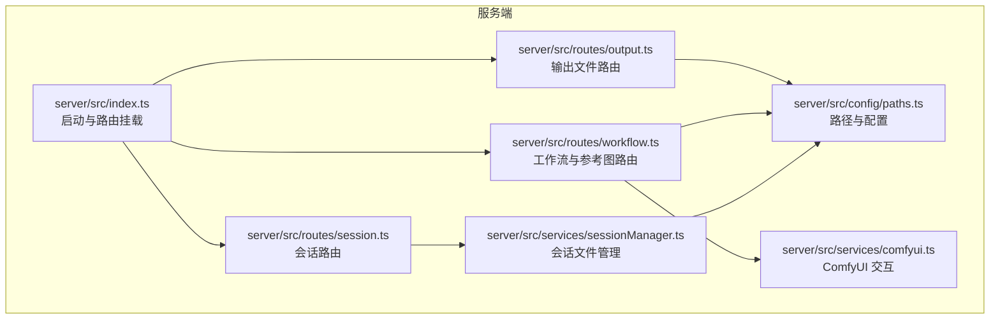
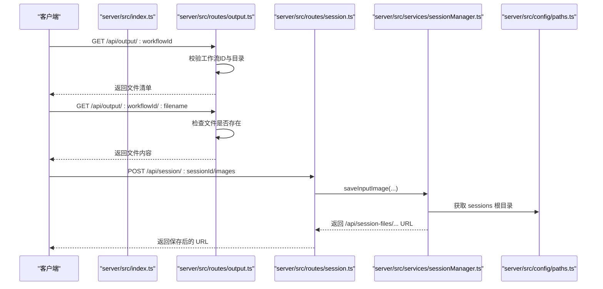
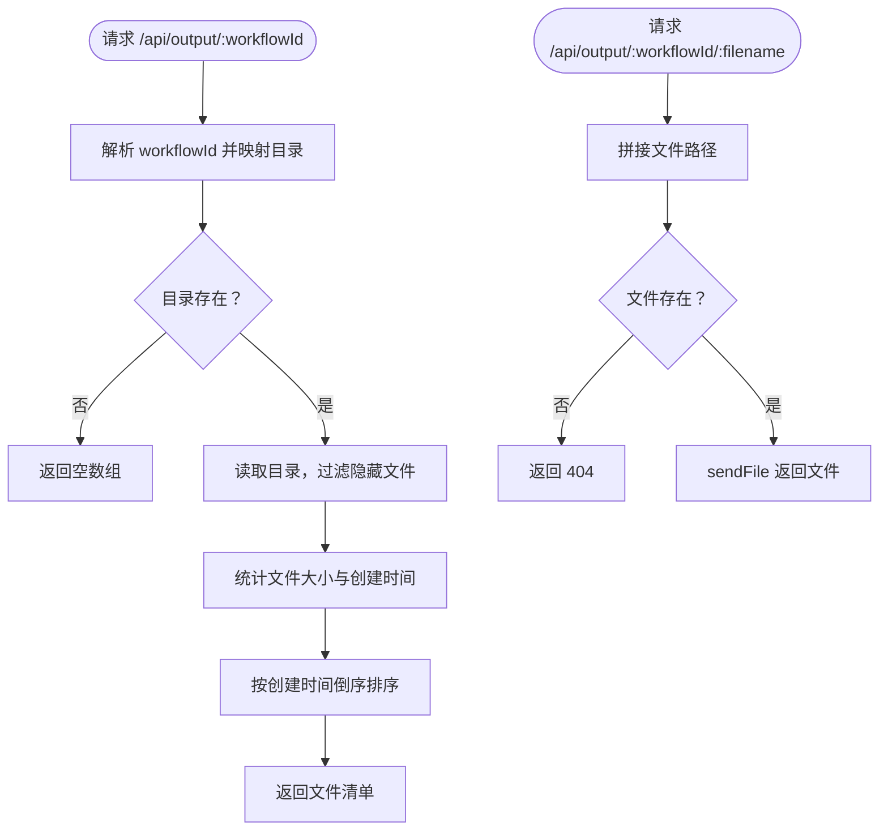
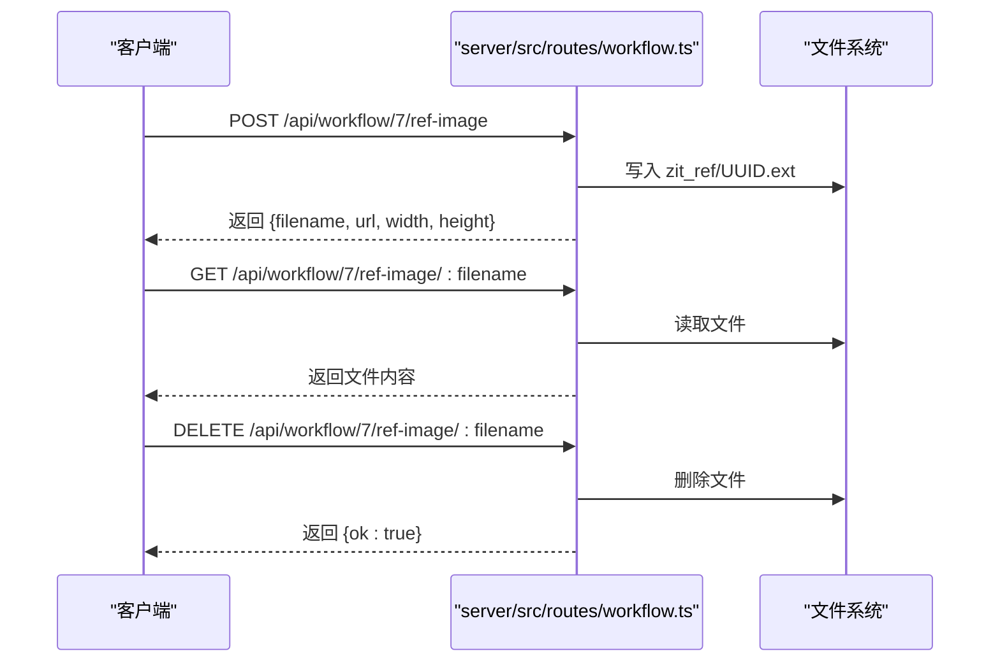
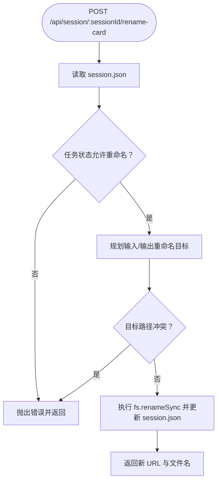
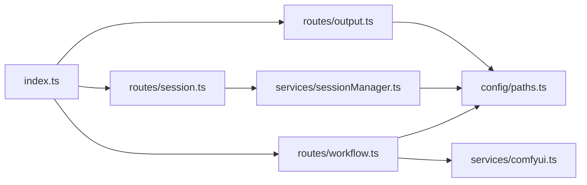

# 文件管理 API

<cite>
**本文引用的文件**
- [server/src/routes/output.ts](file://server/src/routes/output.ts)
- [server/src/routes/workflow.ts](file://server/src/routes/workflow.ts)
- [server/src/routes/session.ts](file://server/src/routes/session.ts)
- [server/src/services/sessionManager.ts](file://server/src/services/sessionManager.ts)
- [server/src/config/paths.ts](file://server/src/config/paths.ts)
- [server/src/index.ts](file://server/src/index.ts)
- [server/src/services/comfyui.ts](file://server/src/services/comfyui.ts)
</cite>

## 目录
1. [简介](#简介)
2. [项目结构](#项目结构)
3. [核心组件](#核心组件)
4. [架构总览](#架构总览)
5. [详细组件分析](#详细组件分析)
6. [依赖关系分析](#依赖关系分析)
7. [性能考量](#性能考量)
8. [故障排查指南](#故障排查指南)
9. [结论](#结论)
10. [附录](#附录)

## 简介
本文件管理 API 文档面向 CorineKit Pix2Real 的服务端，聚焦以下能力：
- 参考图像上传接口：POST /api/workflow/7/ref-image
- 输出文件访问接口：GET /api/output/* 与静态文件访问 /output/*
- 文件清理与会话管理：会话级输入/输出/掩码文件的保存、重命名、封面生成与会话删除
- 文件存储结构、命名规则与路径规范
- 文件类型支持、大小限制与格式要求
- 批量文件操作与文件夹管理
- 存储空间监控与错误恢复机制

## 项目结构
服务端采用 Express + WebSocket 架构，文件管理相关路由集中在 output、workflow、session 三个模块，并通过 sessionManager 统一管理会话内的输入/输出/掩码文件；路径与数据根目录由 paths 模块集中管理。

**图表来源**
- [server/src/index.ts:118-146](file://server/src/index.ts#L118-L146)
- [server/src/routes/output.ts:1-139](file://server/src/routes/output.ts#L1-L139)
- [server/src/routes/workflow.ts:1-800](file://server/src/routes/workflow.ts#L1-L800)
- [server/src/routes/session.ts:1-163](file://server/src/routes/session.ts#L1-L163)
- [server/src/services/sessionManager.ts:1-539](file://server/src/services/sessionManager.ts#L1-L539)
- [server/src/config/paths.ts:1-156](file://server/src/config/paths.ts#L1-L156)
- [server/src/services/comfyui.ts:1-200](file://server/src/services/comfyui.ts#L1-L200)

**章节来源**
- [server/src/index.ts:118-146](file://server/src/index.ts#L118-L146)
- [server/src/config/paths.ts:141-155](file://server/src/config/paths.ts#L141-L155)

## 核心组件
- 输出文件路由：提供列出与下载工作流输出文件的能力，并支持打开文件（跨平台）。
- 参考图像路由：为工作流 7（快速出图）提供参考图上传、访问与删除。
- 会话文件路由：提供会话内输入图像、掩码、状态的保存与读取，以及封面生成、批量重命名等。
- 会话文件管理：负责在会话目录下创建 input/masks/output 子目录，保存/重命名文件并更新会话状态。
- 路径与配置：集中管理 sessions 与 output 根目录，支持运行时切换 sessions 根目录。
- ComfyUI 交互：负责将生成结果下载到会话输出目录。

**章节来源**
- [server/src/routes/output.ts:27-78](file://server/src/routes/output.ts#L27-L78)
- [server/src/routes/workflow.ts:440-483](file://server/src/routes/workflow.ts#L440-L483)
- [server/src/routes/session.ts:21-52](file://server/src/routes/session.ts#L21-L52)
- [server/src/services/sessionManager.ts:11-62](file://server/src/services/sessionManager.ts#L11-L62)
- [server/src/config/paths.ts:74-100](file://server/src/config/paths.ts#L74-L100)
- [server/src/services/comfyui.ts:9-45](file://server/src/services/comfyui.ts#L9-L45)

## 架构总览
文件管理涉及三层：
- 路由层：暴露 REST 接口，解析参数与文件上传。
- 业务层：根据工作流/会话上下文进行文件保存、重命名、封面生成等。
- 存储层：以 sessions 与 output 为根目录，按会话/工作流/标签组织文件。

**图表来源**
- [server/src/routes/output.ts:27-78](file://server/src/routes/output.ts#L27-L78)
- [server/src/routes/session.ts:21-36](file://server/src/routes/session.ts#L21-L36)
- [server/src/services/sessionManager.ts:22-48](file://server/src/services/sessionManager.ts#L22-L48)
- [server/src/config/paths.ts:74-76](file://server/src/config/paths.ts#L74-L76)

## 详细组件分析

### 输出文件接口（/api/output/* 与 /output/*）
- 列出输出文件
  - 方法：GET /api/output/:workflowId
  - 行为：根据工作流 ID 映射到 output 下的子目录，读取非隐藏文件并返回文件名、大小、创建时间与访问 URL。
  - 注意：若目录不存在则返回空数组。
- 下载单个输出文件
  - 方法：GET /api/output/:workflowId/:filename
  - 行为：校验文件存在后通过 sendFile 返回文件内容。
- 打开文件（跨平台）
  - 方法：POST /api/output/open-file
  - 行为：支持 /api/session-files/、/output/、/api/output/ 三种 URL 形式，解码后定位文件并调用系统默认应用打开。
- 静态文件访问
  - 路径：/output/*
  - 行为：Express 静态服务，直接访问 output 根目录下的文件。

**图表来源**
- [server/src/routes/output.ts:27-58](file://server/src/routes/output.ts#L27-L58)
- [server/src/routes/output.ts:60-78](file://server/src/routes/output.ts#L60-L78)

**章节来源**
- [server/src/routes/output.ts:27-78](file://server/src/routes/output.ts#L27-L78)
- [server/src/index.ts:134-139](file://server/src/index.ts#L134-L139)

### 参考图像接口（/api/workflow/7/ref-image）
- 上传参考图
  - 方法：POST /api/workflow/7/ref-image
  - 行为：保存至 zit_ref 目录，文件名为 UUID + 原始扩展名，返回文件名、访问 URL 与图像尺寸。
- 访问参考图
  - 方法：GET /api/workflow/7/ref-image/:filename
  - 行为：根据扩展名设置 Content-Type 并返回文件内容。
- 删除参考图
  - 方法：DELETE /api/workflow/7/ref-image/:filename
  - 行为：尝试删除文件，忽略异常。

**图表来源**
- [server/src/routes/workflow.ts:440-483](file://server/src/routes/workflow.ts#L440-L483)

**章节来源**
- [server/src/routes/workflow.ts:440-483](file://server/src/routes/workflow.ts#L440-L483)

### 会话文件接口（/api/session/*）
- 上传输入图像
  - 方法：POST /api/session/:sessionId/images
  - 行为：保存至 sessions/{sessionId}/tab-{tabId}/input，返回 /api/session-files/... URL。
- 上传掩码
  - 方法：POST /api/session/:sessionId/masks
  - 行为：保存至 sessions/{sessionId}/tab-{tabId}/masks，掩码键含冒号在 Windows 上会被替换为下划线。
- 保存会话状态
  - 方法：PUT/POST /api/session/:sessionId/state
  - 行为：确保目录存在并写入 session.json。
- 读取会话
  - 方法：GET /api/session/:sessionId
  - 行为：返回会话状态。
- 会话列表
  - 方法：GET /api/sessions
  - 行为：枚举 sessions 根目录下的有效会话。
- 删除会话
  - 方法：DELETE /api/session/:sessionId
  - 行为：递归删除会话目录。
- 生成封面
  - 方法：POST /api/session/:sessionId/cover
  - 行为：复制源文件为封面并更新 session.json。
- 单卡重命名
  - 方法：POST /api/session/:sessionId/rename-card
  - 行为：重命名输入与输出文件，更新 session.json。
- 批量重命名
  - 方法：POST /api/session/:sessionId/rename-cards-batch
  - 行为：事务性批量重命名，预检冲突与任务状态，全部成功或不变更。

**图表来源**
- [server/src/routes/session.ts:115-132](file://server/src/routes/session.ts#L115-L132)
- [server/src/services/sessionManager.ts:256-360](file://server/src/services/sessionManager.ts#L256-L360)

**章节来源**
- [server/src/routes/session.ts:21-160](file://server/src/routes/session.ts#L21-L160)
- [server/src/services/sessionManager.ts:11-62](file://server/src/services/sessionManager.ts#L11-L62)
- [server/src/services/sessionManager.ts:256-360](file://server/src/services/sessionManager.ts#L256-L360)
- [server/src/services/sessionManager.ts:381-538](file://server/src/services/sessionManager.ts#L381-L538)

### 路径与存储结构
- sessions 根目录
  - 默认：项目根/sessions
  - 运行时可通过设置面板切换，支持绝对路径校验与写权限探测。
- output 根目录
  - 默认：项目根/output
  - 按工作流 ID 映射到子目录，如 0-二次元转真人、1-真人精修 等。
- 会话内目录
  - sessions/{sessionId}/tab-{0..5}/{input|masks|output}
- 参考图像目录
  - zit_ref（工作流 7 使用）

```mermaid
graph TB
Root["项目根目录"]
Sessions["sessions/<sessionId>/tab-<tab>/<input|masks|output>"]
Output["output/<workflow-dir>"]
ZitRef["zit_ref"]
Root --> Sessions
Root --> Output
Root --> ZitRef
```

**图表来源**
- [server/src/config/paths.ts:70-100](file://server/src/config/paths.ts#L70-L100)
- [server/src/config/paths.ts:141-143](file://server/src/config/paths.ts#L141-L143)
- [server/src/index.ts:82-100](file://server/src/index.ts#L82-L100)

**章节来源**
- [server/src/config/paths.ts:70-137](file://server/src/config/paths.ts#L70-L137)
- [server/src/index.ts:82-100](file://server/src/index.ts#L82-L100)

### 文件类型支持、大小限制与格式要求
- 图像类型
  - 支持 PNG/JPEG/GIF/WebP/BMP，参考图像访问接口按扩展名设置 Content-Type。
- 尺寸探测
  - 上传参考图时，服务端通过解析图像缓冲区头部信息获取宽度与高度。
- 大小限制
  - 服务端 JSON 解析限制为 50MB（见启动配置）。
  - 上传中间件使用内存存储，建议控制单次上传体积以避免内存压力。
- 格式要求
  - 掩码键在 Windows 上不允许冒号，会自动替换为下划线。
  - 文件名前缀在特定工作流中会做路径分隔符替换，避免与子目录冲突。

**章节来源**
- [server/src/routes/workflow.ts:460-474](file://server/src/routes/workflow.ts#L460-L474)
- [server/src/routes/workflow.ts:88-120](file://server/src/routes/workflow.ts#L88-L120)
- [server/src/index.ts:127](file://server/src/index.ts#L127)
- [server/src/services/sessionManager.ts:59-61](file://server/src/services/sessionManager.ts#L59-L61)
- [server/src/routes/workflow.ts:322-326](file://server/src/routes/workflow.ts#L322-L326)

### 批量文件操作与文件夹管理
- 单卡重命名
  - 重命名输入文件与对应输出文件，更新 session.json。
- 批量重命名
  - 事务性：先全量预检（标签合法性、任务状态、目标路径冲突），无冲突才执行重命名并一次性写回状态。
- 会话清理
  - 删除指定会话目录。
  - 按最近更新时间裁剪旧会话（pruneOldSessions）。

**章节来源**
- [server/src/services/sessionManager.ts:256-360](file://server/src/services/sessionManager.ts#L256-L360)
- [server/src/services/sessionManager.ts:381-538](file://server/src/services/sessionManager.ts#L381-L538)
- [server/src/services/sessionManager.ts:220-226](file://server/src/services/sessionManager.ts#L220-L226)

### 存储空间监控与错误恢复
- 存储空间监控
  - 通过列出 sessions 与 output 目录并统计文件数量与大小实现（建议在上层 UI 层汇总展示）。
- 错误恢复
  - 输出下载流程在完成事件后延迟读取历史，避免磁盘写入尚未完成导致的空输出。
  - 对于打开文件接口，支持多种 URL 形式并进行解码与存在性校验，失败时返回明确错误。

**章节来源**
- [server/src/index.ts:350-420](file://server/src/index.ts#L350-L420)
- [server/src/routes/output.ts:80-136](file://server/src/routes/output.ts#L80-L136)

## 依赖关系分析
- 路由层依赖业务层与配置层：
  - output 路由依赖 paths 获取 output 根目录。
  - session 路由依赖 sessionManager 完成文件保存与重命名。
  - workflow 路由依赖 paths 与 comfyui 服务。
- 业务层依赖配置层：
  - sessionManager 依赖 paths 获取 sessions 根目录。
- 静态服务依赖：
  - /output/* 与 /api/session-files/* 由 Express 静态服务直接提供。

**图表来源**
- [server/src/routes/output.ts:1-12](file://server/src/routes/output.ts#L1-L12)
- [server/src/routes/session.ts:1-16](file://server/src/routes/session.ts#L1-L16)
- [server/src/services/sessionManager.ts:1-7](file://server/src/services/sessionManager.ts#L1-L7)
- [server/src/routes/workflow.ts:1-27](file://server/src/routes/workflow.ts#L1-L27)
- [server/src/index.ts:8-18](file://server/src/index.ts#L8-L18)

**章节来源**
- [server/src/index.ts:8-18](file://server/src/index.ts#L8-L18)

## 性能考量
- 上传中间件使用内存存储，建议控制单次上传体积，避免内存峰值过高。
- 输出下载流程在完成事件后进行历史读取重试，减少“假空输出”带来的用户体验问题。
- 静态服务直接读取磁盘，适合大文件分发；建议结合 CDN 或外部存储优化跨网络访问。

## 故障排查指南
- 上传参考图返回 400
  - 检查是否提供 image 字段与正确的文件类型。
- 打开文件返回 400/404
  - 检查 URL 是否为受支持的三种形式之一，确认文件存在且路径解码正确。
- 会话重命名抛出“任务正在执行中”
  - 等待任务完成后重试，或调整任务状态。
- 会话重命名抛出“文件名冲突”
  - 确认目标文件名未被其他文件占用，或更换标签。
- 输出为空
  - 等待一段时间后重试，确认 ComfyUI 历史已提交完成。

**章节来源**
- [server/src/routes/workflow.ts:440-483](file://server/src/routes/workflow.ts#L440-L483)
- [server/src/routes/output.ts:80-136](file://server/src/routes/output.ts#L80-L136)
- [server/src/services/sessionManager.ts:276-281](file://server/src/services/sessionManager.ts#L276-L281)
- [server/src/services/sessionManager.ts:296-299](file://server/src/services/sessionManager.ts#L296-L299)
- [server/src/index.ts:350-420](file://server/src/index.ts#L350-L420)

## 结论
本文档梳理了 Pix2Real 的文件管理 API，覆盖参考图像、输出文件、会话文件的上传、访问、删除与重命名等核心能力，并明确了存储结构、命名规则、类型支持与错误恢复机制。建议在生产环境中配合存储监控与 CDN 优化，以提升稳定性与性能。

## 附录
- 关键路径
  - sessions 根目录：由 paths 提供，默认位于项目根/sessions，支持运行时切换。
  - output 根目录：默认位于项目根/output，按工作流映射到子目录。
  - 参考图像目录：zit_ref，工作流 7 使用。
- 重要提醒
  - sessions 根目录切换会持久化到 config.json，需确保写权限与路径合法性。
  - 批量重命名具备事务性保障，预检通过后一次性写回，失败则不变更。

**章节来源**
- [server/src/config/paths.ts:24-66](file://server/src/config/paths.ts#L24-L66)
- [server/src/config/paths.ts:141-143](file://server/src/config/paths.ts#L141-L143)
- [server/src/routes/workflow.ts:294-300](file://server/src/routes/workflow.ts#L294-L300)