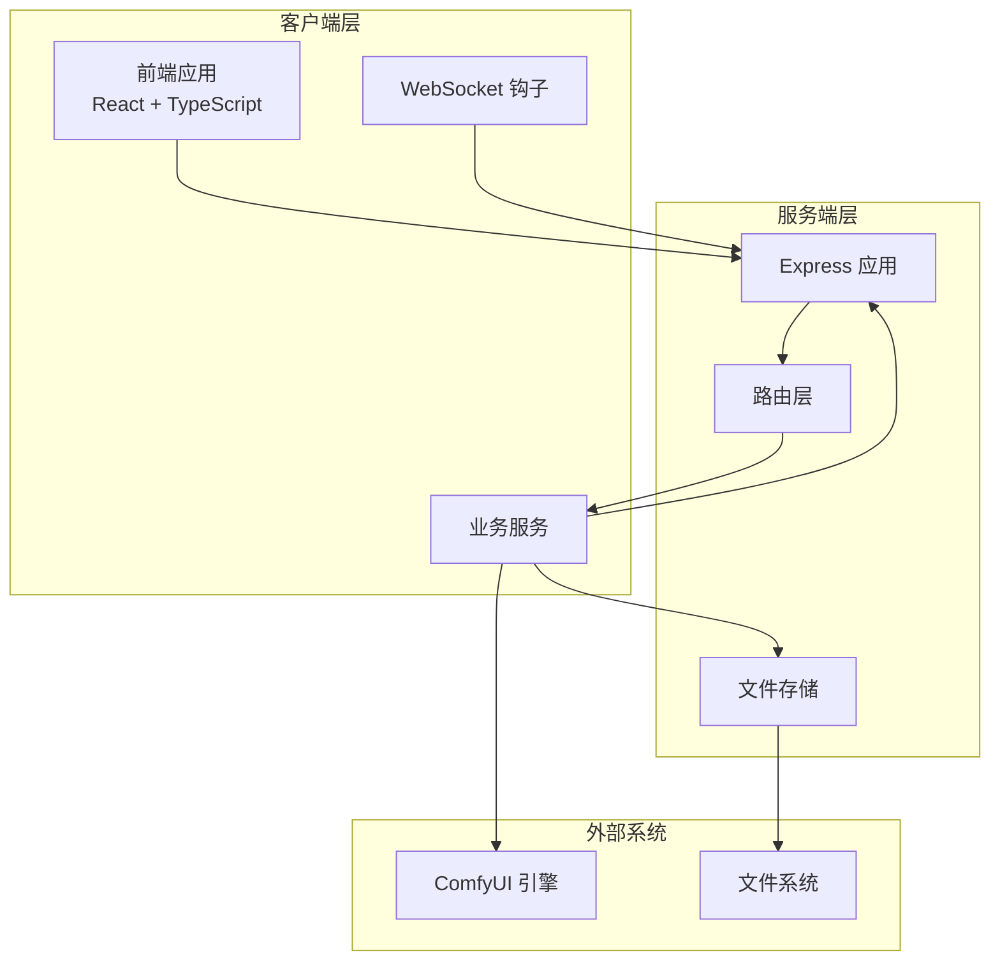
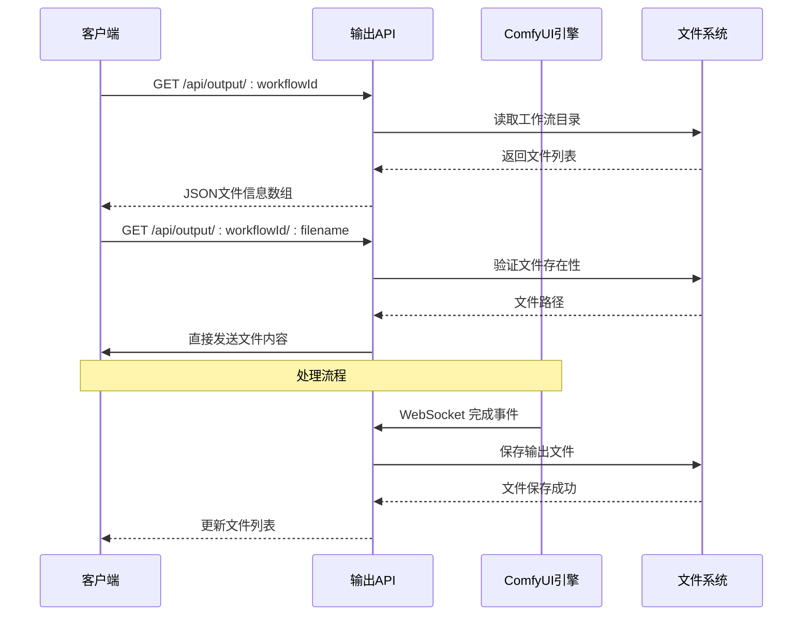
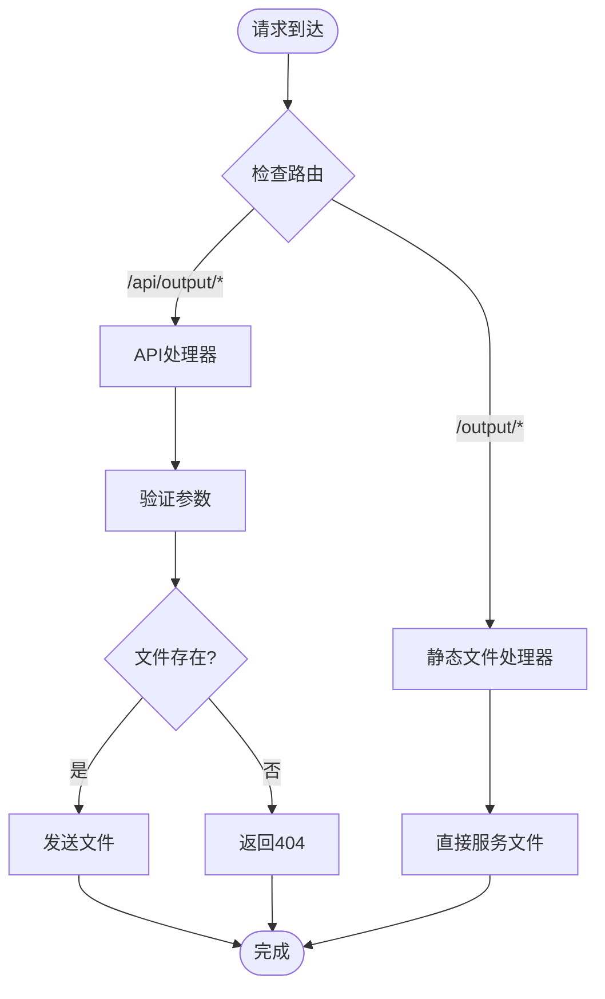
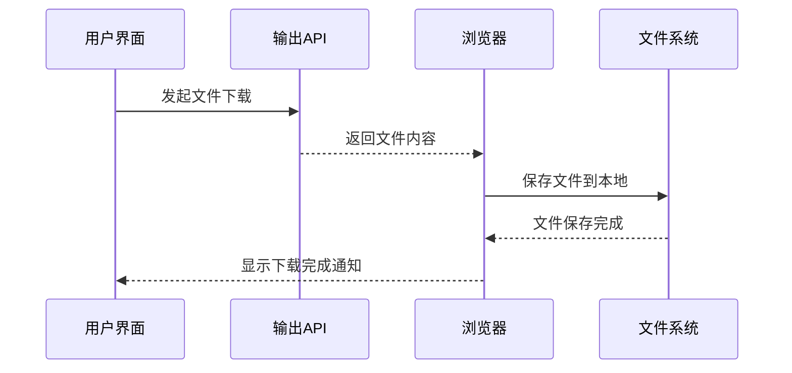
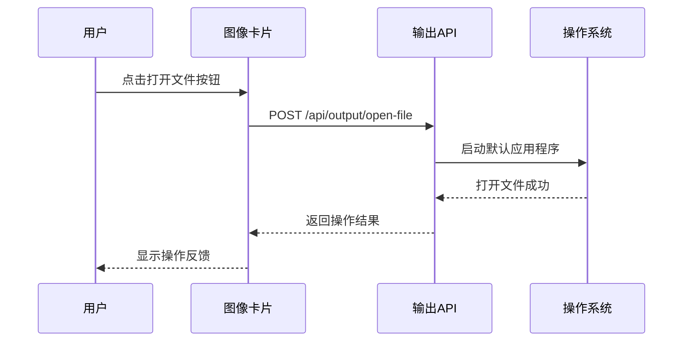
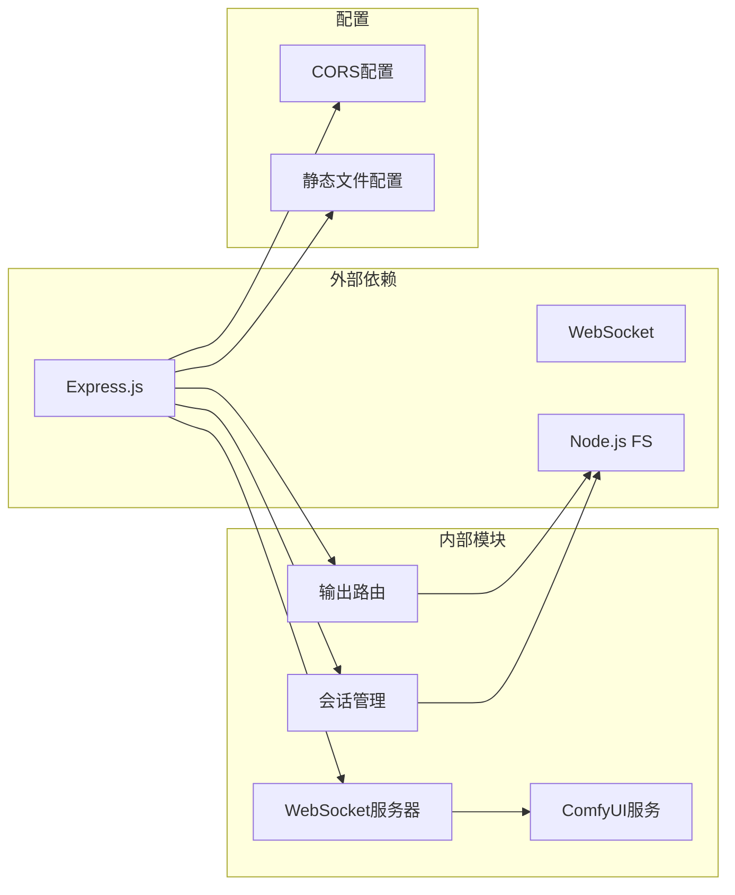
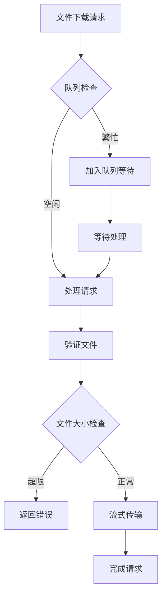

# 输出文件 API

<cite>
**本文档引用的文件**
- [server/src/routes/output.ts](file://server/src/routes/output.ts)
- [server/src/index.ts](file://server/src/index.ts)
- [server/src/services/sessionManager.ts](file://server/src/services/sessionManager.ts)
- [server/src/services/comfyui.ts](file://server/src/services/comfyui.ts)
- [client/src/components/ImageCard.tsx](file://client/src/components/ImageCard.tsx)
- [client/src/components/Sidebar.tsx](file://client/src/components/Sidebar.tsx)
- [client/src/hooks/useWebSocket.ts](file://client/src/hooks/useWebSocket.ts)
- [client/src/types/index.ts](file://client/src/types/index.ts)
- [README.md](file://README.md)
</cite>

## 目录
1. [简介](#简介)
2. [项目结构](#项目结构)
3. [核心组件](#核心组件)
4. [架构概览](#架构概览)
5. [详细组件分析](#详细组件分析)
6. [依赖关系分析](#依赖关系分析)
7. [性能考虑](#性能考虑)
8. [故障排除指南](#故障排除指南)
9. [结论](#结论)
10. [附录](#附录)

## 简介

输出文件 API 是 CorineKit Pix2Real 项目中的核心功能模块，负责管理 ComfyUI 工作流生成的输出文件。该 API 提供了完整的文件下载、目录管理和清理机制，支持多种工作流类型（从二次元转真人到视频处理）。

本系统采用本地 Web UI 架构，通过 Express.js 提供 RESTful API 接口，结合 WebSocket 实时传输进度信息。输出文件统一存储在服务器端的 output 目录中，每个工作流类型对应独立的子目录。

## 项目结构

项目采用前后端分离的架构设计，主要分为以下层次：



**图表来源**
- [server/src/index.ts:42-61](file://server/src/index.ts#L42-L61)
- [server/src/routes/output.ts:1-134](file://server/src/routes/output.ts#L1-L134)

**章节来源**
- [README.md:41-79](file://README.md#L41-L79)
- [server/src/index.ts:14-40](file://server/src/index.ts#L14-L40)

## 核心组件

### 输出路由模块

输出路由模块是整个 API 的核心，提供了三个主要端点：

1. **GET /api/output/:workflowId** - 列出指定工作流的所有输出文件
2. **GET /api/output/:workflowId/:filename** - 下载单个输出文件
3. **POST /api/output/open-file** - 使用系统默认应用程序打开文件

### 工作流目录映射

系统支持 10 种不同的工作流类型，每种类型对应特定的输出目录：

| 工作流ID | 目录名称 | 功能描述 |
|---------|----------|----------|
| 0 | 0-二次元转真人 | 二次元图像转真人风格 |
| 1 | 1-真人精修 | 真人图像精细修饰 |
| 2 | 2-精修放大 | 图像精细放大处理 |
| 3 | 3-快速生成视频 | 快速视频生成 |
| 4 | 4-视频放大 | 视频质量提升 |
| 5 | 5-解除装备 | 装备移除处理 |
| 6 | 6-真人转二次元 | 真人图像转二次元风格 |
| 7 | 7-快速出图 | 快速图像生成 |
| 8 | 8-黑兽换脸 | 黑兽换脸特效 |
| 9 | 9-ZIT快出 | ZIT模型快速生成 |

### 文件存储架构

输出文件采用分层存储结构：
- **根目录**: `output/` (git 忽略目录)
- **工作流目录**: `output/{workflowId}-{名称}/`
- **文件命名**: 基于 ComfyUI 生成的原始文件名

**章节来源**
- [server/src/routes/output.ts:13-20](file://server/src/routes/output.ts#L13-L20)
- [server/src/index.ts:18-29](file://server/src/index.ts#L18-L29)

## 架构概览

输出文件 API 的整体架构采用事件驱动模式，通过 WebSocket 与 ComfyUI 实时通信：



**图表来源**
- [server/src/index.ts:112-175](file://server/src/index.ts#L112-L175)
- [server/src/routes/output.ts:22-73](file://server/src/routes/output.ts#L22-L73)

## 详细组件分析

### 输出路由实现

输出路由模块实现了完整的文件管理功能：

#### GET /api/output/:workflowId - 文件列表接口

该接口提供指定工作流的所有输出文件信息，包括文件名、大小、创建时间和可访问 URL。

**请求参数**:
- `workflowId`: 工作流标识符 (0-9)

**响应数据结构**:
```typescript
interface FileInfo {
  filename: string;     // 文件名
  size: number;         // 文件大小 (字节)
  createdAt: string;    // ISO 格式创建时间
  url: string;          // 可访问的 API URL
}
```

**错误处理**:
- 未知工作流ID: 返回 400 错误
- 目录不存在: 返回空数组

#### GET /api/output/:workflowId/:filename - 文件下载接口

该接口提供单个文件的直接下载功能。

**请求参数**:
- `workflowId`: 工作流标识符 (0-9)
- `filename`: 文件名 (支持 URL 编码)

**安全特性**:
- 文件存在性验证
- 路径遍历防护
- MIME 类型安全检查

#### POST /api/output/open-file - 文件打开接口

该接口允许客户端请求系统默认应用程序打开文件。

**请求体**:
```typescript
interface OpenFileRequest {
  url: string;  // 支持的URL格式
}
```

**支持的URL格式**:
- `/api/session-files/...` (会话文件)
- `/output/...` (直接输出路径)
- `/api/output/...` (API相对路径)

**平台兼容性**:
- Windows: 使用 `start` 命令
- macOS: 使用 `open` 命令  
- Linux: 使用 `xdg-open` 命令

**章节来源**
- [server/src/routes/output.ts:22-131](file://server/src/routes/output.ts#L22-L131)

### 文件系统集成

系统通过 Express.js 的静态文件服务提供直接访问能力：



**图表来源**
- [server/src/index.ts:58-60](file://server/src/index.ts#L58-L60)
- [server/src/routes/output.ts:55-73](file://server/src/routes/output.ts#L55-L73)

**章节来源**
- [server/src/index.ts:58-60](file://server/src/index.ts#L58-L60)

### 客户端集成

客户端通过多种方式与输出文件 API 交互：

#### 文件下载流程



#### 文件打开流程



**图表来源**
- [client/src/components/ImageCard.tsx:466-471](file://client/src/components/ImageCard.tsx#L466-L471)

**章节来源**
- [client/src/components/ImageCard.tsx:460-505](file://client/src/components/ImageCard.tsx#L460-L505)
- [client/src/components/Sidebar.tsx:196-200](file://client/src/components/Sidebar.tsx#L196-L200)

## 依赖关系分析

输出文件 API 的依赖关系清晰明确，遵循单一职责原则：



**图表来源**
- [server/src/index.ts:1-12](file://server/src/index.ts#L1-L12)
- [server/src/routes/output.ts:1-8](file://server/src/routes/output.ts#L1-L8)

**章节来源**
- [server/src/index.ts:1-12](file://server/src/index.ts#L1-L12)
- [server/src/routes/output.ts:1-8](file://server/src/routes/output.ts#L1-L8)

## 性能考虑

### 内存管理

系统采用流式文件传输，避免大文件加载到内存中：

- **直接文件传输**: 使用 `res.sendFile()` 直接传输文件内容
- **无缓冲区**: 避免将整个文件读入内存
- **垃圾回收**: 依赖 Node.js 自动垃圾回收机制

### 并发处理



### 缓存策略

系统采用智能缓存机制：
- **浏览器缓存**: 通过适当的 HTTP 头部控制缓存行为
- **CDN 缓存**: 静态文件可通过 CDN 加速
- **内存缓存**: 最近访问的文件信息缓存

## 故障排除指南

### 常见问题及解决方案

#### 文件下载失败

**症状**: 客户端收到 404 错误或下载中断

**可能原因**:
1. 文件已被清理或删除
2. 工作流ID不正确
3. 文件名编码问题

**解决步骤**:
1. 验证工作流ID是否在有效范围内 (0-9)
2. 检查文件是否存在于对应的输出目录
3. 确认文件名使用正确的 URL 编码

#### 权限错误

**症状**: 服务器日志显示权限不足

**解决方法**:
1. 确保 Node.js 进程对 output 目录有读取权限
2. 检查目录所有权和权限设置
3. 验证磁盘空间充足

#### WebSocket 连接问题

**症状**: 输出文件无法自动更新

**排查步骤**:
1. 检查 ComfyUI 是否正常运行
2. 验证 WebSocket 端点可达性
3. 查看浏览器开发者工具中的网络面板

**章节来源**
- [server/src/routes/output.ts:67-70](file://server/src/routes/output.ts#L67-L70)
- [server/src/index.ts:112-175](file://server/src/index.ts#L112-L175)

## 结论

输出文件 API 提供了完整、可靠的本地文件管理解决方案。通过清晰的架构设计、完善的错误处理机制和良好的性能优化，该系统能够满足各种规模的图像和视频处理需求。

主要优势包括：
- **安全性**: 完整的输入验证和路径遍历防护
- **可扩展性**: 支持多种工作流类型和文件格式
- **可靠性**: 健壮的错误处理和恢复机制
- **易用性**: 直观的 API 设计和丰富的客户端集成

## 附录

### API 使用示例

#### 获取文件列表
```javascript
// JavaScript 示例
fetch('/api/output/0')
  .then(response => response.json())
  .then(files => {
    files.forEach(file => {
      console.log(`${file.filename} (${file.size} bytes)`);
    });
  });
```

#### 下载单个文件
```javascript
// 直接下载链接
const downloadUrl = '/api/output/0/example.png';
window.location.href = downloadUrl;
```

#### 打开文件
```javascript
// 使用系统默认程序打开
fetch('/api/output/open-file', {
  method: 'POST',
  headers: { 'Content-Type': 'application/json' },
  body: JSON.stringify({ 
    url: '/api/output/0/example.png' 
  })
});
```

### 最佳实践

1. **文件命名规范**: 使用有意义的文件名，避免特殊字符
2. **错误处理**: 始终检查 API 响应状态和错误信息
3. **资源清理**: 定期清理不需要的输出文件
4. **监控告警**: 设置磁盘空间和文件数量的监控告警
5. **备份策略**: 对重要输出文件建立定期备份机制

### 配置选项

| 配置项 | 默认值 | 描述 |
|--------|--------|------|
| CORS 允许域 | `['http://localhost:5173', 'http://127.0.0.1:5173']` | 允许跨域访问的域名列表 |
| JSON 请求大小限制 | `50MB` | Express JSON 解析器的大小限制 |
| 输出目录 | `output/` | 存储生成文件的根目录 |
| 会话目录 | `sessions/` | 存储会话数据的根目录 |