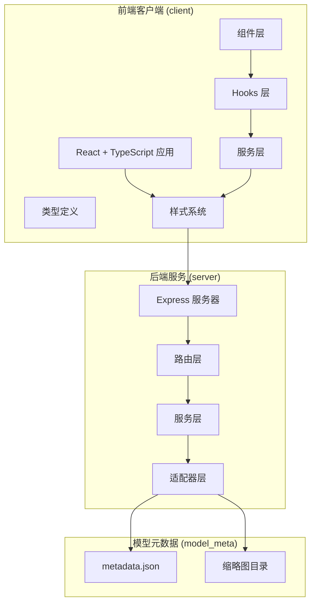
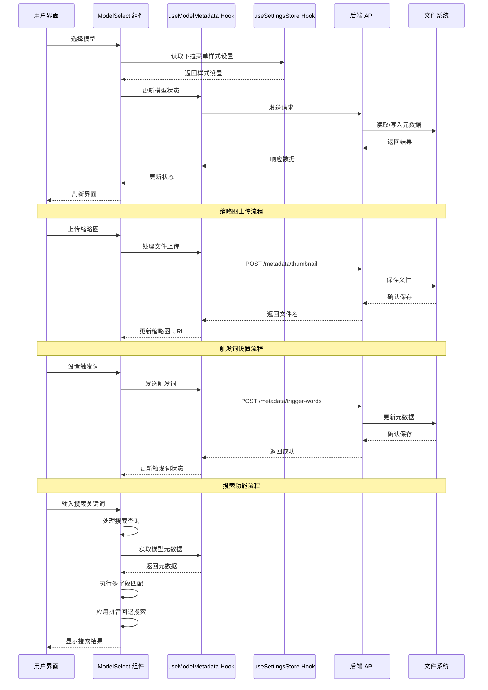
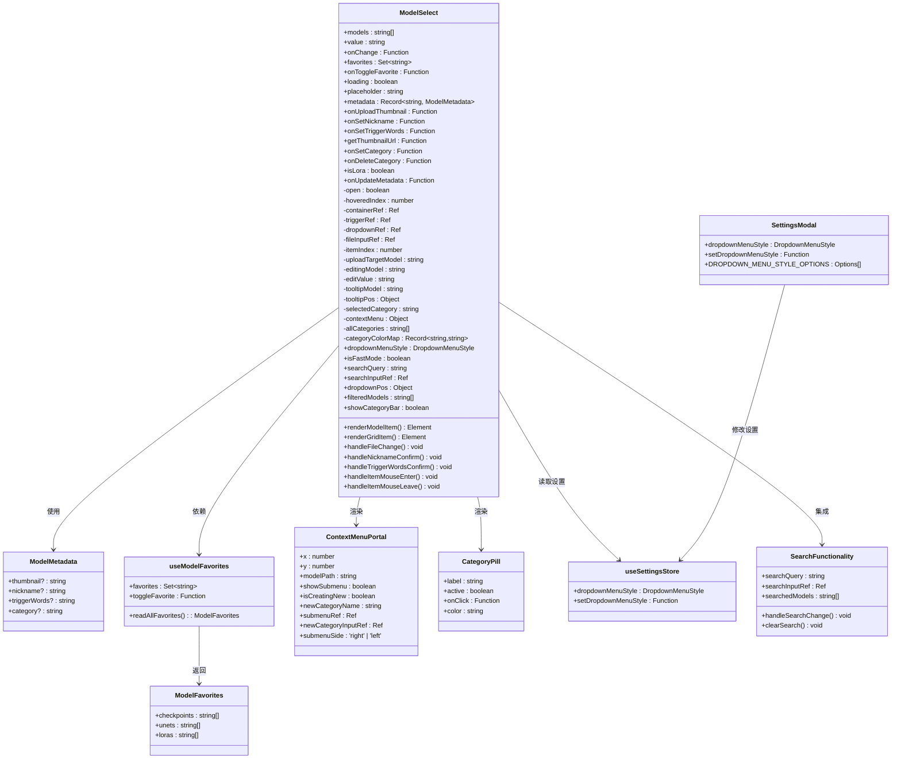
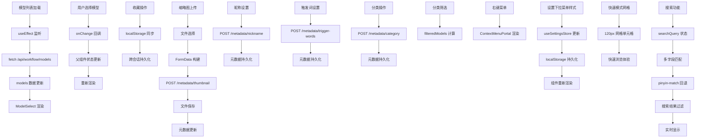
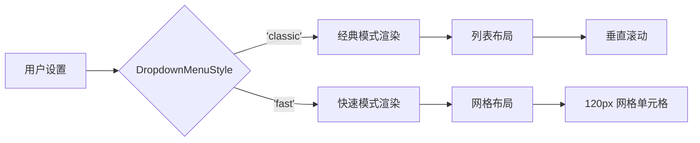
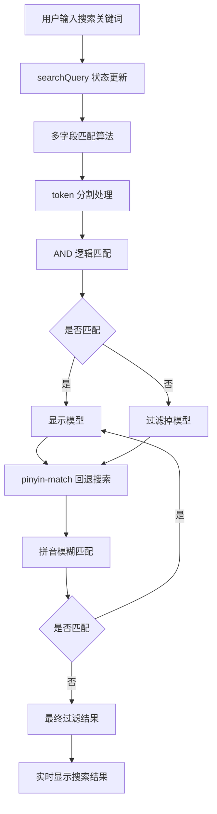
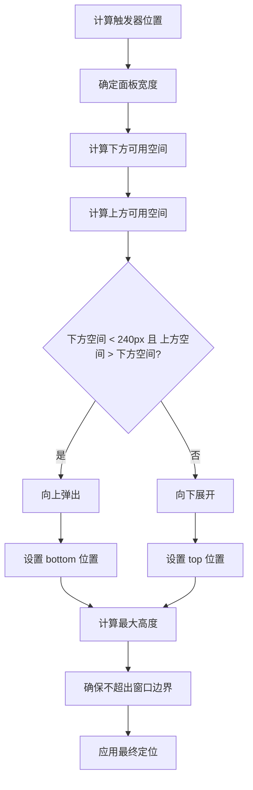
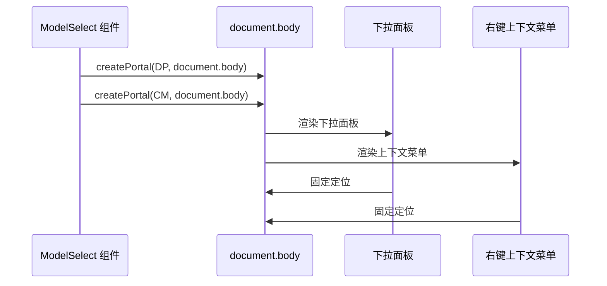
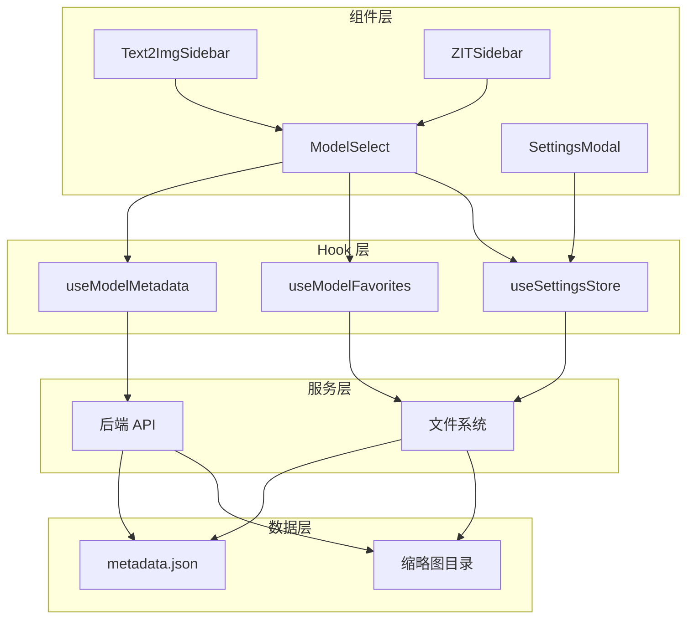

# Model Select 组件

<cite>
**本文档引用的文件**
- [ModelSelect.tsx](file://client/src/components/ModelSelect.tsx)
- [useModelMetadata.ts](file://client/src/hooks/useModelMetadata.ts)
- [Text2ImgSidebar.tsx](file://client/src/components/Text2ImgSidebar.tsx)
- [ZITSidebar.tsx](file://client/src/components/ZITSidebar.tsx)
- [SettingsModal.tsx](file://client/src/components/SettingsModal.tsx)
- [useSettingsStore.ts](file://client/src/hooks/useSettingsStore.ts)
- [SegmentedControl.tsx](file://client/src/components/SegmentedControl.tsx)
- [metadata.json](file://model_meta/metadata.json)
- [global.css](file://client/src/styles/global.css)
- [variables.css](file://client/src/styles/variables.css)
- [index.ts](file://client/src/types/index.ts)
- [package.json](file://client/package.json)
</cite>

## 更新摘要
**变更内容**
- 新增完整的搜索功能，支持多字段匹配和拼音回退搜索
- 实现动态下拉定位，支持向上弹出和向下展开
- 添加搜索输入框和清除按钮，提升搜索体验
- 集成 pinyin-match 依赖，增强中文搜索能力
- 优化搜索状态管理和焦点控制
- 增强搜索过滤算法，支持 AND 多 token 和子串优先

## 目录
1. [简介](#简介)
2. [项目结构](#项目结构)
3. [核心组件](#核心组件)
4. [架构概览](#架构概览)
5. [详细组件分析](#详细组件分析)
6. [双模式下拉菜单系统](#双模式下拉菜单系统)
7. [搜索功能增强](#搜索功能增强)
8. [动态下拉定位](#动态下拉定位)
9. [React Portal 技术实现](#react-portal-技术实现)
10. [视觉设计规范](#视觉设计规范)
11. [依赖关系分析](#依赖关系分析)
12. [性能考虑](#性能考虑)
13. [故障排除指南](#故障排除指南)
14. [结论](#结论)

## 简介

Model Select 组件是 CorineKit Pix2Real 项目中的核心 UI 组件，专门用于在 ComfyUI 模型列表中进行选择和管理。该组件在两个主要侧边栏（文本到图像侧边栏和 ZIT 快速出图侧边栏）中得到广泛应用，提供了丰富的功能，包括模型选择、收藏管理、缩略图上传、昵称设置、触发词管理和模型分类等功能，为用户提供了直观且高效的模型管理体验。

CorineKit Pix2Real 是一个基于本地 Web UI 的批量图像/视频处理工具，通过与 ComfyUI 集成，实现了从动漫风格到真实感风格的转换、人物精修、图像放大、视频生成等多种功能。该项目支持实时进度更新和一键输出文件夹访问，为用户提供完整的 AI 图像处理解决方案。

**更新** 新增双模式下拉菜单系统，提供经典模式和快速模式两种选择，满足不同用户的使用习惯和工作流程需求。同时集成了完整的搜索功能，显著提升了模型选择的效率和准确性。

## 项目结构

该项目采用前后端分离的架构设计，主要包含以下核心模块：



**图表来源**
- [global.css:1-263](file://client/src/styles/global.css#L1-L263)

**章节来源**
- [global.css:1-263](file://client/src/styles/global.css#L1-L263)

## 核心组件

Model Select 组件是本项目中最复杂的 UI 组件之一，具有以下核心特性：

### 主要功能特性
- **双模式下拉菜单**：支持经典模式和快速模式两种显示方式
- **React Portal 渲染**：使用 createPortal 将菜单渲染到 document.body
- **固定定位和右对齐**：下拉菜单使用 fixed 定位并支持右对齐
- **网格布局快速浏览**：快速模式下使用 120px 网格单元格
- **模型选择界面**：提供下拉菜单形式的模型选择界面
- **收藏管理**：支持将常用模型添加到收藏夹，使用统一的 #f59e0b 颜色标识
- **缩略图预览**：鼠标悬停时显示模型缩略图
- **昵称自定义**：允许用户为模型设置个性化昵称
- **触发词管理**：支持设置和查看模型触发词，支持一键复制
- **模型分类**：支持为模型设置分类并按分类筛选
- **分类颜色标识**：为不同分类分配颜色，便于视觉识别
- **右键上下文菜单**：提供便捷的分类操作界面
- **缩略图上传**：支持为模型上传自定义缩略图
- **响应式设计**：适配不同屏幕尺寸和设备
- **完整搜索功能**：支持多字段匹配和拼音回退搜索
- **动态下拉定位**：支持向上弹出和向下展开
- **搜索输入框**：提供实时搜索和过滤功能
- **清除按钮**：一键清空搜索内容

### 技术实现特点
- **纯函数组件**：使用 React Hooks 实现状态管理
- **高性能渲染**：通过 useCallback 优化函数引用
- **内存优化**：合理使用 useRef 和 useEffect
- **类型安全**：完整的 TypeScript 类型定义
- **用户体验**：流畅的动画过渡和交互反馈
- **分类系统**：支持最多12个分类的颜色映射
- **设置持久化**：通过 useSettingsStore 实现设置持久化
- **搜索算法优化**：支持 AND 多 token 和子串优先匹配
- **拼音搜索支持**：集成 pinyin-match 库实现中文拼音搜索

### 组件使用场景

ModelSelect 组件在项目中被广泛使用，主要出现在以下场景：

#### 文本到图像侧边栏
在文本到图像工作流中，用户可以：
- 选择主模型（checkpoints）
- 选择 LoRA 模型（可选）
- 管理模型收藏
- 查看模型缩略图
- 设置模型昵称
- 设置模型触发词
- 管理模型分类
- 使用搜索功能快速查找模型

#### ZIT 快速出图侧边栏
在 ZIT 工作流中，用户可以：
- 选择 UNet 模型
- 选择 LoRA 模型（可选）
- 管理模型收藏
- 上传自定义缩略图
- 设置模型触发词
- 管理模型分类
- 使用搜索功能快速查找模型

**章节来源**
- [Text2ImgSidebar.tsx:278-296](file://client/src/components/Text2ImgSidebar.tsx#L278-L296)
- [ZITSidebar.tsx:283-301](file://client/src/components/ZITSidebar.tsx#L283-L301)

## 架构概览

Model Select 组件在整个系统架构中扮演着重要的角色，它连接了用户界面、数据管理和后端服务：



**图表来源**
- [ModelSelect.tsx:137-148](file://client/src/components/ModelSelect.tsx#L137-L148)
- [useModelMetadata.ts:29-44](file://client/src/hooks/useModelMetadata.ts#L29-L44)
- [useSettingsStore.ts:32-35](file://client/src/hooks/useSettingsStore.ts#L32-L35)

## 详细组件分析

### ModelSelect 组件架构



**图表来源**
- [ModelSelect.tsx:74-89](file://client/src/components/ModelSelect.tsx#L74-L89)
- [ModelSelect.tsx:699-731](file://client/src/components/ModelSelect.tsx#L699-L731)
- [useModelMetadata.ts:3-8](file://client/src/hooks/useModelMetadata.ts#L3-L8)
- [SettingsModal.tsx:19-22](file://client/src/components/SettingsModal.tsx#L19-L22)
- [useSettingsStore.ts:5-10](file://client/src/hooks/useSettingsStore.ts#L5-L10)

### 数据流分析



**图表来源**
- [Text2ImgSidebar.tsx:69-95](file://client/src/components/Text2ImgSidebar.tsx#L69-L95)
- [ZITSidebar.tsx:65-95](file://client/src/components/ZITSidebar.tsx#L65-L95)
- [useModelMetadata.ts:13-27](file://client/src/hooks/useModelMetadata.ts#L13-L27)
- [useSettingsStore.ts:32-35](file://client/src/hooks/useSettingsStore.ts#L32-L35)

### 组件使用场景

ModelSelect 组件在项目中被广泛使用，主要出现在以下场景：

#### 文本到图像侧边栏
在文本到图像工作流中，用户可以：
- 选择主模型（checkpoints）
- 选择 LoRA 模型（可选）
- 管理模型收藏
- 查看模型缩略图
- 设置模型昵称
- 设置模型触发词
- 管理模型分类
- 使用搜索功能快速查找模型

#### ZIT 快速出图侧边栏
在 ZIT 工作流中，用户可以：
- 选择 UNet 模型
- 选择 LoRA 模型（可选）
- 管理模型收藏
- 上传自定义缩略图
- 设置模型触发词
- 管理模型分类
- 使用搜索功能快速查找模型

**章节来源**
- [Text2ImgSidebar.tsx:278-296](file://client/src/components/Text2ImgSidebar.tsx#L278-L296)
- [ZITSidebar.tsx:283-301](file://client/src/components/ZITSidebar.tsx#L283-L301)

## 双模式下拉菜单系统

Model Select 组件新增了强大的双模式下拉菜单系统，为用户提供两种不同的模型选择体验：

### 模式类型定义

```typescript
type DropdownMenuStyle = 'classic' | 'fast';
```

### 经典模式 (Classic Mode)
- **列表布局**：传统的垂直列表显示所有模型
- **完整信息**：显示模型的完整信息，包括收藏状态、触发词等
- **滚动区域**：支持垂直滚动查看更多模型
- **适合场景**：模型数量较少或需要详细信息时使用

### 快速模式 (Fast Mode)
- **网格布局**：使用 120px 最小宽度的网格显示模型
- **缩略图优先**：仅显示有缩略图的模型，提供快速浏览体验
- **视觉冲击**：通过缩略图提供更强的视觉识别效果
- **适合场景**：模型数量较多或需要快速浏览时使用

### 模式切换机制



**图表来源**
- [ModelSelect.tsx:146-148](file://client/src/components/ModelSelect.tsx#L146-L148)
- [useSettingsStore.ts:5-10](file://client/src/hooks/useSettingsStore.ts#L5-L10)

### 模式特定功能

#### 快速模式特有功能
- **缩略图网格**：使用 `gridTemplateColumns: 'repeat(auto-fill, minmax(120px, 1fr))'`
- **快速筛选**：仅显示有缩略图的模型
- **收藏优先**：收藏模型优先显示在网格中
- **标题覆盖**：网格项底部显示模型标题

#### 经典模式特有功能
- **详细信息**：显示模型的完整信息
- **收藏分组**：收藏模型和普通模型分组显示
- **分割线**：收藏模型和普通模型之间有分割线
- **动作图标**：悬停时显示上传、编辑、触发词等操作图标

**章节来源**
- [ModelSelect.tsx:258-262](file://client/src/components/ModelSelect.tsx#L258-L262)
- [ModelSelect.tsx:762-778](file://client/src/components/ModelSelect.tsx#L762-L778)
- [ModelSelect.tsx:779-807](file://client/src/components/ModelSelect.tsx#L779-L807)

## 搜索功能增强

Model Select 组件新增了完整的搜索功能，显著提升了模型选择的效率和准确性：

### 搜索功能架构



**图表来源**
- [ModelSelect.tsx:284-306](file://client/src/components/ModelSelect.tsx#L284-L306)

### 搜索算法实现

#### 多字段匹配
搜索功能支持在以下字段中进行匹配：
- **模型路径**：完整的模型文件路径
- **显示名称**：从路径中提取的模型名称
- **昵称**：用户自定义的模型昵称
- **分类**：模型所属的分类标签
- **触发词**：模型的触发词标签

#### Token 处理
- **空白字符分割**：使用 `q.split(/\s+/)` 将搜索词分割为多个 token
- **AND 逻辑**：所有 token 必须都匹配才算通过
- **子串优先**：首先尝试子串匹配，然后进行拼音回退搜索

#### 拼音回退搜索
- **pinyin-match 集成**：使用 `PinyinMatch.match()` 进行拼音匹配
- **多级回退**：支持全拼、首字母、混合模式的拼音匹配
- **性能优化**：仅在子串匹配失败时才执行拼音匹配

### 搜索界面设计

#### 搜索输入框
- **位置**：位于下拉菜单顶部工具栏
- **占位符**：显示 "搜索名称 / 触发词 / 分类 / 路径…"
- **样式**：与整体设计风格保持一致
- **实时响应**：输入时立即更新搜索结果

#### 清除按钮
- **条件显示**：仅在有搜索内容时显示
- **一键清空**：点击后立即清空搜索查询
- **焦点恢复**：清空后自动恢复搜索框焦点
- **样式设计**：与搜索图标对称排列

### 搜索状态管理

#### 状态变量
- **searchQuery**：当前搜索查询字符串
- **searchInputRef**：搜索输入框的引用
- **searchedModels**：经过搜索过滤后的模型列表

#### 生命周期管理
- **打开时聚焦**：下拉菜单打开时自动聚焦搜索框
- **关闭时清理**：下拉菜单关闭时清空搜索查询
- **Esc 键处理**：支持 Esc 键快速关闭或清空搜索

**章节来源**
- [ModelSelect.tsx:136-137](file://client/src/components/ModelSelect.tsx#L136-L137)
- [ModelSelect.tsx:778-834](file://client/src/components/ModelSelect.tsx#L778-L834)
- [ModelSelect.tsx:284-306](file://client/src/components/ModelSelect.tsx#L284-L306)
- [ModelSelect.tsx:204-211](file://client/src/components/ModelSelect.tsx#L204-L211)

## 动态下拉定位

Model Select 组件实现了智能的动态下拉定位系统，能够根据可用空间自动决定菜单的显示方向：

### 定位算法



**图表来源**
- [ModelSelect.tsx:153-176](file://client/src/components/ModelSelect.tsx#L153-L176)

### 定位参数

#### 基础参数
- **panelWidth**：面板宽度，快速模式下最小为 460px
- **left**：左对齐位置，通过 `rect.right - panelWidth` 计算
- **maxPanelHeight**：最大面板高度，经典模式 400px，快速模式 520px
- **margin**：边距设置为 8px

#### 空间计算
- **spaceBelow**：触发器底部到窗口底部的距离
- **spaceAbove**：触发器顶部到窗口顶部的距离
- **minDesired**：最小期望高度，取 `Math.min(maxPanelHeight, 240)`
- **placeAbove**：判断是否向上弹出的条件

#### 安全边界
- **left 边界**：确保 `Math.max(0, left)` 防止超出窗口左侧
- **高度边界**：确保 `Math.max(160, Math.min(maxPanelHeight, availableHeight))`

### 定位决策逻辑

#### 向上弹出条件
当满足以下条件时，菜单将向上弹出：
- 下方可用空间小于 240px（最小期望高度）
- 上方可用空间大于下方可用空间

#### 向下展开条件
当不满足向上弹出条件时，菜单将向下展开：
- 使用 `rect.bottom + 4` 作为顶部位置
- 计算可用高度并应用最大高度限制

#### 自适应高度
- **最小高度**：160px，确保基本可读性
- **最大高度**：经典模式 400px，快速模式 520px
- **实际高度**：取可用高度与最大高度的最小值

### 定位效果

#### 用户体验
- **无缝适配**：自动适应不同屏幕尺寸和浏览器窗口大小
- **无遮挡**：确保菜单内容完全可见，不会被浏览器地址栏或工具栏遮挡
- **一致性**：无论向上还是向下显示，都保持相同的视觉效果和交互行为

#### 技术实现
- **实时计算**：每次打开菜单时重新计算定位参数
- **响应式更新**：窗口大小变化时自动重新定位
- **边界保护**：确保菜单始终在可视区域内

**章节来源**
- [ModelSelect.tsx:153-176](file://client/src/components/ModelSelect.tsx#L153-L176)
- [ModelSelect.tsx:396-411](file://client/src/components/ModelSelect.tsx#L396-L411)

## React Portal 技术实现

Model Select 组件采用了先进的 React Portal 技术，将下拉菜单和上下文菜单渲染到 `document.body`，提供了更好的定位和层级管理：

### Portal 渲染机制



**图表来源**
- [ModelSelect.tsx:704-811](file://client/src/components/ModelSelect.tsx#L704-L811)
- [ModelSelect.tsx:845-858](file://client/src/components/ModelSelect.tsx#L845-L858)

### Portal 组件实现

#### 下拉面板 Portal
- **渲染位置**：使用 `createPortal(dropdownRef.current, document.body)`
- **固定定位**：`position: 'fixed'` 确保不受父容器溢出影响
- **右对齐**：通过计算 `left = rect.right - panelWidth` 实现右对齐
- **层级管理**：`zIndex: 10000` 确保菜单显示在最顶层

#### 上下文菜单 Portal
- **渲染位置**：使用 `createPortal(ContextMenuPortal, document.body)`
- **固定定位**：`position: 'fixed'` 确保跟随鼠标位置
- **层级管理**：`zIndex: 10001` 确保上下文菜单在下拉菜单之上
- **智能布局**：根据屏幕空间自动调整菜单方向

### Portal 技术优势

1. **独立定位**：不受父容器溢出和定位影响
2. **层级控制**：精确控制 z-index 层级关系
3. **DOM 结构**：保持清晰的 DOM 结构，便于调试
4. **性能优化**：减少不必要的 DOM 重排
5. **用户体验**：提供更好的菜单显示效果

**章节来源**
- [ModelSelect.tsx:150-162](file://client/src/components/ModelSelect.tsx#L150-L162)
- [ModelSelect.tsx:974-986](file://client/src/components/ModelSelect.tsx#L974-L986)

## 视ual Design Specifications

### 颜色系统

ModelSelect 组件采用统一的颜色设计系统，确保视觉一致性和品牌识别度：

#### 主要颜色定义
- **收藏星标颜色**：#f59e0b（橙黄色）
- **主色调**：var(--color-primary) (#2196F3)
- **次级文字颜色**：var(--color-text-secondary) (#666666)
- **边框颜色**：var(--color-border) (#e0e0e0)
- **表面颜色**：var(--color-surface) (#f5f5f5)

#### 颜色使用规范
- **收藏状态**：星标图标使用 #f59e0b 实心填充
- **未收藏状态**：星标图标使用 #f59e0b 边框，文字颜色使用 var(--color-text-secondary)
- **触发词状态**：已设置触发词的标签使用 var(--color-primary) 主色调
- **分类颜色**：使用 HSL(30° 步进) 确保色彩均匀分布

#### 颜色一致性改进
**更新** 标准化星标图标颜色为 #f59e0b，提升视觉一致性

- **统一收藏标识**：所有收藏模型的星标图标现在使用统一的 #f59e0b 颜色
- **对比度优化**：#f59e0b 提供良好的视觉对比度，确保在不同主题下都能清晰可见
- **品牌一致性**：与项目整体视觉设计保持一致的品牌色彩
- **无障碍设计**：颜色选择符合无障碍设计标准，确保色盲用户也能区分收藏状态

### 快速模式视觉设计

**更新** 新增快速模式的视觉设计规范

#### 网格布局设计
- **单元格尺寸**：120px 最小宽度，支持自适应调整
- **间距控制**：8px 间隙，确保网格间的视觉平衡
- **圆角设计**：6px 圆角，提供柔和的视觉效果
- **边框样式**：2px 选中边框，突出当前选择的模型

#### 缩略图设计
- **比例保持**：`aspectRatio: '1'` 确保正方形显示
- **覆盖层设计**：底部渐变遮罩，提供更好的文字可读性
- **标题显示**：11px 字体大小，居中对齐，支持省略号显示
- **滤镜效果**：悬停时 10% 亮度提升，增强交互反馈

#### 分类颜色集成
- **颜色映射**：每个分类分配唯一颜色，便于视觉识别
- **标题着色**：模型标题根据分类颜色着色
- **胶囊按钮**：分类筛选使用彩色胶囊按钮

### 搜索界面设计

**更新** 新增搜索界面的视觉设计规范

#### 搜索工具栏
- **布局设计**：采用 Flexbox 布局，支持左右对齐
- **间距控制**：图标与输入框之间 6px 间距
- **边框样式**：输入框使用 1px 边框，保持与整体设计一致
- **圆角设计**：输入框圆角 4px，与其他 UI 元素保持统一

#### 搜索输入框
- **字体大小**：12px 字体，确保在小尺寸下仍可读
- **内边距**：4px 顶部和 6px 侧边内边距
- **占位符颜色**：使用 `var(--color-text-secondary)` 确保可读性
- **焦点状态**：获得焦点时保持与整体设计的一致性

#### 清除按钮
- **尺寸设计**：13px 尺寸，与搜索图标保持一致
- **交互设计**：悬停时使用 `cursor: 'pointer'` 提示可点击
- **颜色状态**：使用 `var(--color-text-secondary)` 颜色
- **过渡动画**：0.15s 过渡时间，提供流畅的交互反馈

**章节来源**
- [ModelSelect.tsx:384-387](file://client/src/components/ModelSelect.tsx#L384-L387)
- [variables.css:1-31](file://client/src/styles/variables.css#L1-L31)
- [ModelSelect.tsx:764-769](file://client/src/components/ModelSelect.tsx#L764-L769)
- [ModelSelect.tsx:600-654](file://client/src/components/ModelSelect.tsx#L600-L654)
- [ModelSelect.tsx:778-834](file://client/src/components/ModelSelect.tsx#L778-L834)

## 依赖关系分析

### 组件间依赖关系



**图表来源**
- [ModelSelect.tsx:8](file://client/src/components/ModelSelect.tsx#L8)
- [useModelMetadata.ts:10-215](file://client/src/hooks/useModelMetadata.ts#L10-L215)
- [useSettingsStore.ts:19-38](file://client/src/hooks/useSettingsStore.ts#L19-L38)

### 外部依赖分析

组件依赖的主要外部资源包括：

- **React 生态系统**：使用 React Hooks 进行状态管理
- **Lucide React**：图标库，提供用户界面元素
- **pinyin-match**：中文拼音匹配库，支持中文搜索
- **ComfyUI API**：后端服务接口
- **浏览器存储**：localStorage 用于数据持久化
- **React Portal**：用于上下文菜单的 DOM 操作
- **Zustand**：轻量级状态管理库

**更新** 新增 pinyin-match 依赖，版本为 ^1.2.10

**章节来源**
- [ModelSelect.tsx:1-3](file://client/src/components/ModelSelect.tsx#L1-L3)
- [useModelMetadata.ts:1-1](file://client/src/hooks/useModelMetadata.ts#L1-L1)
- [useSettingsStore.ts:1](file://client/src/hooks/useSettingsStore.ts#L1)
- [package.json:13](file://client/package.json#L13)

## 性能考虑

### 渲染优化策略

ModelSelect 组件采用了多种性能优化技术：

1. **函数引用缓存**：使用 useCallback 包装事件处理器，避免不必要的重新渲染
2. **条件渲染**：根据 loading 状态和模型数量动态调整渲染内容
3. **虚拟滚动**：下拉面板支持最大高度限制，防止大量数据导致的性能问题
4. **懒加载**：缩略图仅在需要时加载，减少初始渲染负担
5. **分类颜色缓存**：分类颜色信息存储在本地，避免重复计算
6. **筛选优化**：使用 useMemo 优化分类筛选逻辑
7. **Portal 优化**：Portal 组件只在需要时渲染，减少 DOM 节点数量
8. **搜索算法优化**：使用 useMemo 缓存搜索结果，避免重复计算
9. **定位计算优化**：仅在打开菜单时计算定位，关闭时清理计算结果
10. **焦点管理优化**：使用 requestAnimationFrame 确保焦点操作的时机正确

### 内存管理

- **引用清理**：使用 useRef 创建 DOM 引用，在组件卸载时自动清理
- **事件监听器**：在 useEffect 中正确绑定和解绑全局事件监听器
- **状态同步**：通过 localStorage 实现跨会话状态同步，避免重复加载
- **Portal 卸载**：正确处理 React Portal 组件的卸载
- **搜索状态清理**：下拉菜单关闭时自动清空搜索查询

### 网络请求优化

- **请求去重**：避免重复的 API 请求
- **错误处理**：优雅处理网络请求失败的情况
- **超时控制**：为异步操作设置合理的超时机制
- **批量更新**：元数据更新采用批量方式，减少网络请求次数

### 模式切换优化

**更新** 新增模式切换的性能优化策略

- **模式缓存**：下拉菜单样式设置缓存在 localStorage 中
- **条件渲染**：根据当前模式选择性渲染相应的内容
- **网格优化**：快速模式下仅渲染有缩略图的模型
- **滚动优化**：经典模式下使用虚拟滚动处理大量模型
- **搜索缓存**：搜索结果使用 useMemo 缓存，避免重复计算

### 搜索功能性能优化

**更新** 新增搜索功能的性能优化策略

- **搜索结果缓存**：使用 useMemo 缓存搜索结果
- **分词缓存**：token 分割结果缓存，避免重复处理
- **拼音匹配优化**：仅在子串匹配失败时执行拼音匹配
- **AND 逻辑优化**：使用 every 方法进行短路求值
- **实时响应**：使用防抖或节流优化频繁输入的性能

**章节来源**
- [useSettingsStore.ts:32-35](file://client/src/hooks/useSettingsStore.ts#L32-L35)
- [ModelSelect.tsx:258-262](file://client/src/components/ModelSelect.tsx#L258-L262)
- [ModelSelect.tsx:284-306](file://client/src/components/ModelSelect.tsx#L284-L306)

## 故障排除指南

### 常见问题及解决方案

#### 模型列表为空
**症状**：下拉菜单显示"（无可用模型）"
**可能原因**：
- ComfyUI 服务未启动
- 模型文件路径配置错误
- 网络连接问题

**解决方法**：
1. 确认 ComfyUI 在 `http://localhost:8188` 正常运行
2. 检查模型文件是否存在于正确的目录结构中
3. 验证网络连接和防火墙设置

#### 缩略图无法显示
**症状**：鼠标悬停时缩略图不显示
**可能原因**：
- 缩略图文件不存在或路径错误
- 权限问题
- 缓存问题

**解决方法**：
1. 检查 `model_meta/thumbnails` 目录是否存在
2. 验证缩略图文件权限设置
3. 清除浏览器缓存后重试

#### 收藏功能异常
**症状**：收藏的模型在刷新后丢失
**可能原因**：
- localStorage 访问被阻止
- 浏览器隐私设置
- 存储空间不足

**解决方法**：
1. 检查浏览器的 localStorage 功能是否启用
2. 确认有足够的存储空间
3. 尝试在不同的浏览器中测试

#### 缩略图上传失败
**症状**：上传自定义缩略图时出现错误
**可能原因**：
- 文件格式不支持
- 文件大小超出限制
- 服务器权限问题

**解决方法**：
1. 确认文件格式为 JPG、PNG、WEBP 或 GIF
2. 检查文件大小是否符合要求
3. 验证服务器写入权限

#### 触发词功能异常
**症状**：触发词设置或复制功能失效
**可能原因**：
- 后端 API 未正确响应
- 元数据文件权限问题
- 浏览器剪贴板权限

**解决方法**：
1. 检查后端服务是否正常运行
2. 验证 metadata.json 文件权限
3. 确认浏览器剪贴板权限设置

#### 分类功能异常
**症状**：模型分类或筛选功能失效
**可能原因**：
- 分类颜色缓存损坏
- 元数据格式错误
- 本地存储权限问题

**解决方法**：
1. 清除浏览器本地存储中的分类颜色缓存
2. 检查 metadata.json 文件格式是否正确
3. 验证浏览器本地存储权限

#### 右键菜单不显示
**症状**：右键点击模型无反应
**可能原因**：
- 右键事件处理异常
- Portal 渲染失败
- 浏览器兼容性问题

**解决方法**：
1. 检查浏览器开发者工具是否有错误信息
2. 确认 React Portal 功能正常
3. 尝试在不同浏览器中测试

#### 下拉菜单样式设置失效
**症状**：设置界面无法切换下拉菜单样式
**可能原因**：
- Zustand 状态管理异常
- localStorage 权限问题
- 组件重新渲染问题

**解决方法**：
1. 检查浏览器控制台是否有状态管理错误
2. 确认 localStorage 功能正常
3. 刷新页面后重试设置

#### 快速模式网格显示异常
**症状**：快速模式下网格布局错乱
**可能原因**：
- CSS Grid 不支持
- 网格单元格尺寸计算错误
- 缩略图加载失败

**解决方法**：
1. 检查浏览器对 CSS Grid 的支持
2. 验证 120px 网格单元格计算逻辑
3. 确认缩略图文件完整性

#### 星标图标颜色异常
**症状**：收藏星标图标颜色不正确
**可能原因**：
- CSS 变量未正确应用
- 颜色值被覆盖
- 浏览器缓存问题

**解决方法**：
1. 检查 CSS 变量是否正确加载
2. 确认 #f59e0b 颜色值未被其他样式覆盖
3. 清除浏览器缓存后重试

#### 搜索功能异常
**症状**：搜索功能无法正常工作
**可能原因**：
- pinyin-match 依赖未正确安装
- 搜索算法逻辑错误
- 搜索状态管理异常

**解决方法**：
1. 确认 pinyin-match 依赖已正确安装（版本 ^1.2.10）
2. 检查搜索算法实现是否正确
3. 验证搜索状态变量和事件处理逻辑
4. 检查多字段匹配和拼音回退搜索的实现

#### 动态定位功能异常
**症状**：下拉菜单无法正确向上或向下弹出
**可能原因**：
- 定位计算逻辑错误
- 窗口尺寸检测异常
- 边界条件处理不当

**解决方法**：
1. 检查定位计算函数的实现
2. 验证窗口尺寸和触发器位置的获取
3. 确认边界条件和安全检查逻辑
4. 测试不同屏幕尺寸下的定位效果

#### 搜索输入框焦点问题
**症状**：搜索输入框无法自动聚焦或清除后不恢复焦点
**可能原因**：
- useRef 引用管理异常
- useEffect 生命周期问题
- requestAnimationFrame 使用错误

**解决方法**：
1. 检查 searchInputRef 的初始化和使用
2. 验证 useEffect 的依赖数组和清理逻辑
3. 确认 requestAnimationFrame 的使用时机
4. 测试不同浏览器下的焦点行为

**章节来源**
- [useModelMetadata.ts:13-27](file://client/src/hooks/useModelMetadata.ts#L13-L27)
- [metadata.json:1-311](file://model_meta/metadata.json#L1-L311)
- [useSettingsStore.ts:32-35](file://client/src/hooks/useSettingsStore.ts#L32-L35)
- [package.json:13](file://client/package.json#L13)

## 结论

Model Select 组件作为 CorineKit Pix2Real 项目的核心 UI 组件，展现了现代前端开发的最佳实践。经过本次重大功能增强，该组件不仅功能更加丰富、用户体验更加优秀，还具备了更强的组织能力和可扩展性。

### 主要优势

1. **双模式设计**：经典模式和快速模式满足不同使用场景和用户偏好
2. **现代化技术栈**：采用 React Portal、CSS Grid 等现代前端技术
3. **功能完整性**：涵盖了模型选择、收藏管理、缩略图处理、触发词管理和分类组织等所有核心功能
4. **用户体验**：提供了直观的操作界面和流畅的交互体验，包括右键菜单和分类筛选
5. **组织能力**：强大的分类系统帮助用户更好地管理大量模型
6. **性能优化**：采用了多种优化策略确保组件的高效运行
7. **可扩展性**：模块化的架构设计便于功能扩展和维护
8. **视觉一致性**：标准化的星标图标颜色(#f59e0b)提升了整体视觉体验
9. **智能搜索**：完整的搜索功能支持多字段匹配和拼音回退搜索
10. **动态定位**：智能的下拉菜单定位系统适应不同屏幕环境
11. **现代化依赖**：集成 pinyin-match 等现代前端库提升功能完整性

### 技术亮点

- **TypeScript 类型安全**：完整的类型定义确保代码质量
- **React Hooks 最佳实践**：合理使用各种 Hooks 实现复杂的状态管理
- **异步处理**：优雅处理网络请求和文件操作
- **错误处理**：完善的错误处理机制提升系统稳定性
- **分类系统**：支持最多12个分类的颜色映射，提供良好的视觉体验
- **颜色标准化**：统一的 #f59e0b 收藏标识颜色，提升视觉一致性
- **Portal 技术**：先进的 React Portal 实现，提供更好的定位和层级管理
- **网格布局**：120px 网格单元格的快速浏览体验
- **搜索算法**：多字段匹配和拼音回退搜索的智能算法
- **动态定位**：基于空间检测的智能菜单定位系统

### 新功能价值

1. **双模式下拉菜单**：显著提升了用户的选择灵活性和工作效率
2. **React Portal 实现**：提供了更好的菜单显示效果和用户体验
3. **固定定位和右对齐**：解决了传统定位方式的局限性
4. **快速模式网格**：120px 网格单元格提供了直观的视觉浏览体验
5. **设置持久化**：通过 localStorage 实现设置的跨会话持久化
6. **智能布局**：根据屏幕空间自动调整菜单方向
7. **完整搜索功能**：多字段匹配和拼音回退搜索显著提升搜索效率
8. **动态定位系统**：智能的向上弹出和向下展开机制
9. **搜索界面设计**：美观实用的搜索输入框和清除按钮
10. **pinyin-match 集成**：专业的中文拼音搜索支持

### 发展建议

1. **国际化支持**：添加多语言支持以扩大用户群体
2. **主题定制**：提供更多主题选项满足不同用户偏好
3. **键盘导航**：增强键盘快捷键支持提升无障碍体验
4. **性能监控**：集成性能监控工具持续优化用户体验
5. **模型导入导出**：支持模型元数据的导入导出功能
6. **颜色主题扩展**：考虑支持用户自定义收藏图标颜色
7. **移动端优化**：针对移动设备优化下拉菜单的交互体验
8. **无障碍增强**：进一步提升无障碍设计，支持更多辅助功能
9. **搜索建议**：添加搜索历史和热门搜索建议功能
10. **高级过滤**：支持更复杂的过滤条件和组合搜索

Model Select 组件的成功实现为整个 CorineKit Pix2Real 项目奠定了坚实的基础，为用户提供了专业级的 AI 图像处理工具。新增的双模式下拉菜单系统、React Portal 技术实现、快速浏览体验、完整的搜索功能和动态定位系统进一步提升了组件的专业性和实用性，为用户提供了更加完善的工作流程支持。标准化的星标图标颜色(#f59e0b)作为本次更新的重要改进，显著提升了视觉一致性和用户体验。这些创新功能的集成展示了现代前端开发的技术实力和用户体验设计理念，为项目的未来发展奠定了良好的基础。