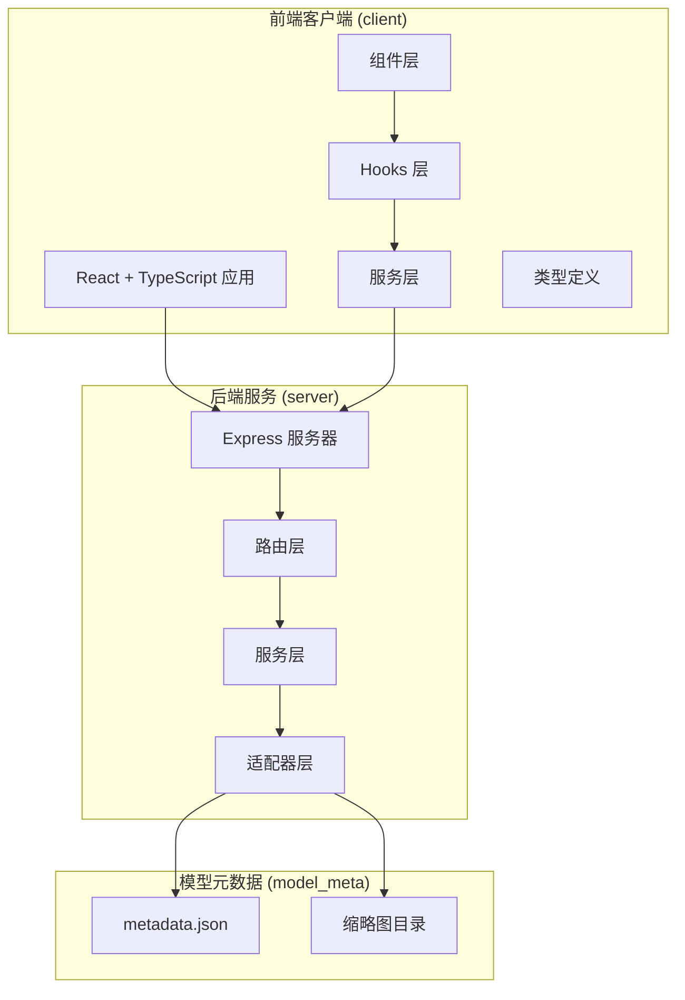
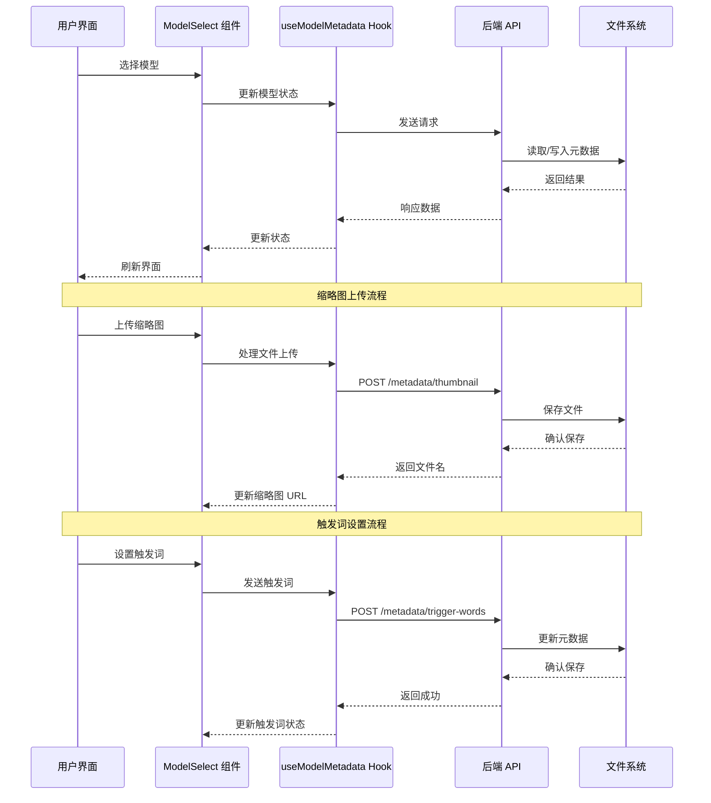
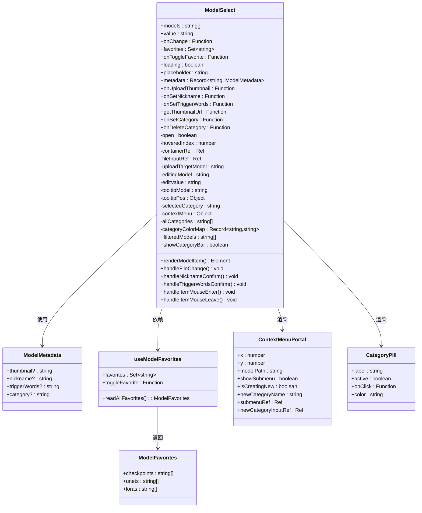
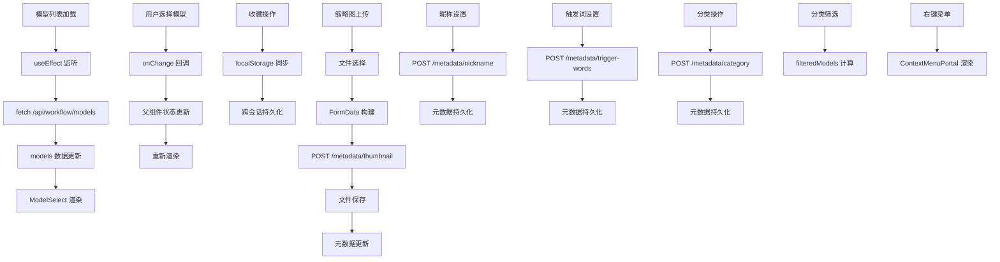
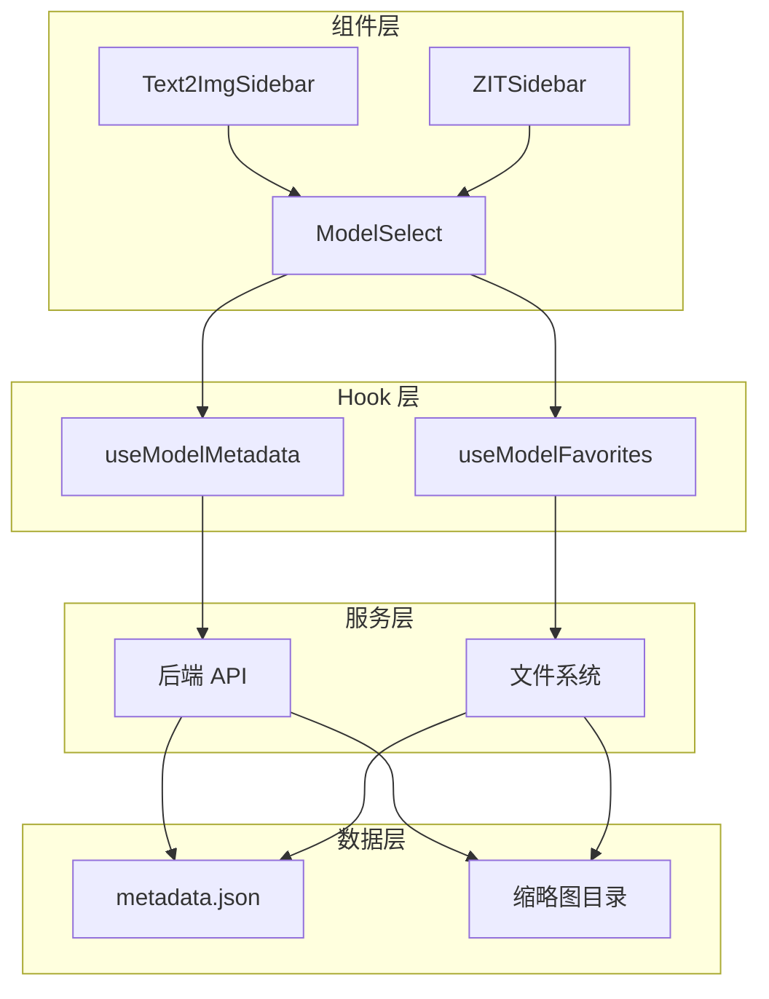

# Model Select 组件

<cite>
**本文档引用的文件**
- [ModelSelect.tsx](file://client/src/components/ModelSelect.tsx)
- [useModelMetadata.ts](file://client/src/hooks/useModelMetadata.ts)
- [modelMeta.ts](file://server/src/routes/modelMeta.ts)
- [metadata.json](file://model_meta/metadata.json)
- [Text2ImgSidebar.tsx](file://client/src/components/Text2ImgSidebar.tsx)
- [ZITSidebar.tsx](file://client/src/components/ZITSidebar.tsx)
- [README.md](file://README.md)
</cite>

## 更新摘要
**变更内容**
- 新增完整的触发词显示系统，支持模型触发词的设置、编辑和复制
- 新增模型分类管理功能，支持按分类筛选和颜色标识
- 新增右键上下文菜单，提供便捷的分类操作
- 新增分类筛选条，支持快速浏览和过滤模型
- 扩展 useModelMetadata 钩子，增加触发词和分类管理能力

## 目录
1. [简介](#简介)
2. [项目结构](#项目结构)
3. [核心组件](#核心组件)
4. [架构概览](#架构概览)
5. [详细组件分析](#详细组件分析)
6. [新增功能详解](#新增功能详解)
7. [依赖关系分析](#依赖关系分析)
8. [性能考虑](#性能考虑)
9. [故障排除指南](#故障排除指南)
10. [结论](#结论)

## 简介

Model Select 组件是 CorineKit Pix2Real 项目中的一个核心 UI 组件，专门用于在 ComfyUI 模型列表中进行选择和管理。该组件提供了丰富的功能，包括模型选择、收藏管理、缩略图上传、昵称设置、触发词管理和模型分类等功能，为用户提供了直观且高效的模型管理体验。

CorineKit Pix2Real 是一个基于本地 Web UI 的批量图像/视频处理工具，通过与 ComfyUI 集成，实现了从动漫风格到真实感风格的转换、人物精修、图像放大、视频生成等多种功能。该项目支持实时进度更新和一键输出文件夹访问，为用户提供完整的 AI 图像处理解决方案。

## 项目结构

该项目采用前后端分离的架构设计，主要包含以下核心模块：



**图表来源**
- [README.md:41-62](file://README.md#L41-L62)

**章节来源**
- [README.md:1-79](file://README.md#L1-L79)

## 核心组件

Model Select 组件是本项目中最复杂的 UI 组件之一，具有以下核心特性：

### 主要功能特性
- **模型选择界面**：提供下拉菜单形式的模型选择界面
- **收藏管理**：支持将常用模型添加到收藏夹
- **缩略图预览**：鼠标悬停时显示模型缩略图
- **昵称自定义**：允许用户为模型设置个性化昵称
- **触发词管理**：支持设置和查看模型触发词，支持一键复制
- **模型分类**：支持为模型设置分类并按分类筛选
- **分类颜色标识**：为不同分类分配颜色，便于视觉识别
- **右键上下文菜单**：提供便捷的分类操作界面
- **缩略图上传**：支持为模型上传自定义缩略图
- **响应式设计**：适配不同屏幕尺寸和设备

### 技术实现特点
- **纯函数组件**：使用 React Hooks 实现状态管理
- **高性能渲染**：通过 useCallback 优化函数引用
- **内存优化**：合理使用 useRef 和 useEffect
- **类型安全**：完整的 TypeScript 类型定义
- **用户体验**：流畅的动画过渡和交互反馈
- **分类系统**：支持最多12个分类的颜色映射

**章节来源**
- [ModelSelect.tsx:1-447](file://client/src/components/ModelSelect.tsx#L1-L447)

## 架构概览

Model Select 组件在整个系统架构中扮演着重要的角色，它连接了用户界面、数据管理和后端服务：



**图表来源**
- [ModelSelect.tsx:80-88](file://client/src/components/ModelSelect.tsx#L80-L88)
- [useModelMetadata.ts:27-42](file://client/src/hooks/useModelMetadata.ts#L27-L42)
- [modelMeta.ts:49-83](file://server/src/routes/modelMeta.ts#L49-L83)

## 详细组件分析

### ModelSelect 组件架构



**图表来源**
- [ModelSelect.tsx:5-17](file://client/src/components/ModelSelect.tsx#L5-L17)
- [ModelSelect.tsx:405-411](file://client/src/components/ModelSelect.tsx#L405-L411)
- [useModelMetadata.ts:3-6](file://client/src/hooks/useModelMetadata.ts#L3-L6)

### 数据流分析



**图表来源**
- [Text2ImgSidebar.tsx:67-74](file://client/src/components/Text2ImgSidebar.tsx#L67-L74)
- [ZITSidebar.tsx:49-56](file://client/src/components/ZITSidebar.tsx#L49-L56)
- [useModelMetadata.ts:27-59](file://client/src/hooks/useModelMetadata.ts#L27-L59)

### 组件使用场景

ModelSelect 组件在项目中被广泛使用，主要出现在以下场景：

#### 文本到图像侧边栏
在文本到图像工作流中，用户可以：
- 选择主模型（checkpoints）
- 选择 LoRA 模型（可选）
- 管理模型收藏
- 查看模型缩略图
- 设置模型昵称
- 设置模型触发词
- 管理模型分类

#### ZIT 快速出图侧边栏
在 ZIT 工作流中，用户可以：
- 选择 UNet 模型
- 选择 LoRA 模型（可选）
- 管理模型收藏
- 上传自定义缩略图
- 设置模型触发词
- 管理模型分类

**章节来源**
- [Text2ImgSidebar.tsx:246-258](file://client/src/components/Text2ImgSidebar.tsx#L246-L258)
- [ZITSidebar.tsx:251-263](file://client/src/components/ZITSidebar.tsx#L251-L263)

## 新增功能详解

### 触发词显示系统

ModelSelect 组件新增了完整的触发词显示系统，为用户提供便捷的触发词管理功能：

#### 功能特性
- **触发词设置**：支持为模型设置自定义触发词
- **触发词编辑**：双击触发词图标即可进入编辑模式
- **触发词复制**：点击触发词条目可一键复制到剪贴板
- **视觉标识**：已设置触发词的模型会以主色调标识
- **状态同步**：触发词状态与后端元数据保持同步

#### 用户交互流程
1. 用户点击模型右侧的标签图标
2. 输入框自动聚焦，用户可编辑触发词
3. 按 Enter 键确认，或点击其他区域确认
4. 触发词显示区域出现，支持一键复制
5. 触发词状态实时更新到元数据文件

**章节来源**
- [ModelSelect.tsx:508-528](file://client/src/components/ModelSelect.tsx#L508-L528)
- [Text2ImgSidebar.tsx:355-395](file://client/src/components/Text2ImgSidebar.tsx#L355-L395)

### 模型分类管理系统

组件新增了强大的模型分类管理功能，支持按分类组织和筛选模型：

#### 分类功能特性
- **分类设置**：右键点击模型打开分类菜单
- **颜色标识**：每个分类分配唯一颜色，便于视觉识别
- **分类筛选**：顶部显示分类筛选条，支持快速过滤
- **新建分类**：支持创建新的分类并分配颜色
- **分类删除**：支持移除模型的分类设置

#### 分类颜色系统
- **HSL 色彩空间**：使用 HSL(30° 步进) 确保色彩均匀分布
- **颜色缓存**：分类颜色保存在本地存储中
- **循环分配**：新分类自动分配下一个可用颜色
- **一致性保证**：同一分类在不同会话中保持相同颜色

#### 分类筛选条
- **智能显示**：仅当存在已分类模型时显示筛选条
- **全分类视图**：显示所有分类的筛选按钮
- **未分类模型**：特殊显示未分类模型的筛选按钮
- **颜色标注**：分类按钮显示对应的颜色标识

**章节来源**
- [ModelSelect.tsx:194-224](file://client/src/components/ModelSelect.tsx#L194-L224)
- [ModelSelect.tsx:585-618](file://client/src/components/ModelSelect.tsx#L585-L618)

### 右键上下文菜单

新增的右键上下文菜单提供了便捷的分类操作界面：

#### 菜单功能
- **移入分类**：打开分类子菜单进行分类操作
- **新建分类**：支持创建新的分类
- **移除分类**：删除模型的当前分类
- **智能布局**：根据屏幕位置自动调整菜单方向

#### 上下文菜单组件
- **Portal 渲染**：使用 React Portal 将菜单渲染到 body
- **事件处理**：正确处理点击和键盘事件
- **焦点管理**：自动聚焦新建分类输入框
- **状态同步**：菜单状态与模型状态保持同步

**章节来源**
- [ModelSelect.tsx:361-373](file://client/src/components/ModelSelect.tsx#L361-L373)
- [ModelSelect.tsx:680-694](file://client/src/components/ModelSelect.tsx#L680-L694)

### useModelMetadata 钩子扩展

useModelMetadata 钩子新增了触发词和分类管理功能：

#### 新增 API 方法
- **setTriggerWords**：设置模型触发词
- **deleteTriggerWords**：删除模型触发词
- **getTriggerWords**：获取模型触发词
- **setCategory**：设置模型分类
- **deleteCategory**：删除模型分类
- **getCategory**：获取模型分类

#### 数据结构扩展
```typescript
interface ModelMetadata {
  thumbnail?: string;
  nickname?: string;
  triggerWords?: string;
  category?: string;
}
```

#### 后端 API 支持
- **POST /metadata/trigger-words**：设置触发词
- **DELETE /metadata/trigger-words**：删除触发词
- **POST /metadata/category**：设置分类
- **DELETE /metadata/category**：删除分类

**章节来源**
- [useModelMetadata.ts:3-8](file://client/src/hooks/useModelMetadata.ts#L3-L8)
- [useModelMetadata.ts:114-150](file://client/src/hooks/useModelMetadata.ts#L114-L150)
- [modelMeta.ts:149-204](file://server/src/routes/modelMeta.ts#L149-L204)

## 依赖关系分析

### 组件间依赖关系



**图表来源**
- [ModelSelect.tsx:7-8](file://client/src/components/ModelSelect.tsx#L7-L8)
- [useModelMetadata.ts:8-122](file://client/src/hooks/useModelMetadata.ts#L8-L122)
- [modelMeta.ts:28-39](file://server/src/routes/modelMeta.ts#L28-L39)

### 外部依赖分析

组件依赖的主要外部资源包括：

- **React 生态系统**：使用 React Hooks 进行状态管理
- **Lucide React**：图标库，提供用户界面元素
- **ComfyUI API**：后端服务接口
- **浏览器存储**：localStorage 用于数据持久化
- **React Portal**：用于上下文菜单的 DOM 操作

**章节来源**
- [ModelSelect.tsx:1-3](file://client/src/components/ModelSelect.tsx#L1-L3)
- [useModelMetadata.ts:1-1](file://client/src/hooks/useModelMetadata.ts#L1-L1)

## 性能考虑

### 渲染优化策略

ModelSelect 组件采用了多种性能优化技术：

1. **函数引用缓存**：使用 useCallback 包装事件处理器，避免不必要的重新渲染
2. **条件渲染**：根据 loading 状态和模型数量动态调整渲染内容
3. **虚拟滚动**：下拉面板支持最大高度限制，防止大量数据导致的性能问题
4. **懒加载**：缩略图仅在需要时加载，减少初始渲染负担
5. **分类颜色缓存**：分类颜色信息存储在本地，避免重复计算
6. **筛选优化**：使用 useMemo 优化分类筛选逻辑

### 内存管理

- **引用清理**：使用 useRef 创建 DOM 引用，在组件卸载时自动清理
- **事件监听器**：在 useEffect 中正确绑定和解绑全局事件监听器
- **状态同步**：通过 localStorage 实现跨会话状态同步，避免重复加载
- **Portal 卸载**：正确处理 React Portal 组件的卸载

### 网络请求优化

- **请求去重**：避免重复的 API 请求
- **错误处理**：优雅处理网络请求失败的情况
- **超时控制**：为异步操作设置合理的超时机制
- **批量更新**：元数据更新采用批量方式，减少网络请求次数

## 故障排除指南

### 常见问题及解决方案

#### 模型列表为空
**症状**：下拉菜单显示"（无可用模型）"
**可能原因**：
- ComfyUI 服务未启动
- 模型文件路径配置错误
- 网络连接问题

**解决方法**：
1. 确认 ComfyUI 在 `http://localhost:8188` 正常运行
2. 检查模型文件是否存在于正确的目录结构中
3. 验证网络连接和防火墙设置

#### 缩略图无法显示
**症状**：鼠标悬停时缩略图不显示
**可能原因**：
- 缩略图文件不存在或路径错误
- 权限问题
- 缓存问题

**解决方法**：
1. 检查 `model_meta/thumbnails` 目录是否存在
2. 验证缩略图文件权限设置
3. 清除浏览器缓存后重试

#### 收藏功能异常
**症状**：收藏的模型在刷新后丢失
**可能原因**：
- localStorage 访问被阻止
- 浏览器隐私设置
- 存储空间不足

**解决方法**：
1. 检查浏览器的 localStorage 功能是否启用
2. 确认有足够的存储空间
3. 尝试在不同的浏览器中测试

#### 缩略图上传失败
**症状**：上传自定义缩略图时出现错误
**可能原因**：
- 文件格式不支持
- 文件大小超出限制
- 服务器权限问题

**解决方法**：
1. 确认文件格式为 JPG、PNG、WEBP 或 GIF
2. 检查文件大小是否符合要求
3. 验证服务器写入权限

#### 触发词功能异常
**症状**：触发词设置或复制功能失效
**可能原因**：
- 后端 API 未正确响应
- 元数据文件权限问题
- 浏览器剪贴板权限

**解决方法**：
1. 检查后端服务是否正常运行
2. 验证 metadata.json 文件权限
3. 确认浏览器剪贴板权限设置

#### 分类功能异常
**症状**：模型分类或筛选功能失效
**可能原因**：
- 分类颜色缓存损坏
- 元数据格式错误
- 本地存储权限问题

**解决方法**：
1. 清除浏览器本地存储中的分类颜色缓存
2. 检查 metadata.json 文件格式是否正确
3. 验证浏览器本地存储权限

#### 右键菜单不显示
**症状**：右键点击模型无反应
**可能原因**：
- 右键事件处理异常
- Portal 渲染失败
- 浏览器兼容性问题

**解决方法**：
1. 检查浏览器开发者工具是否有错误信息
2. 确认 React Portal 功能正常
3. 尝试在不同浏览器中测试

**章节来源**
- [modelMeta.ts:13-26](file://server/src/routes/modelMeta.ts#L13-L26)
- [useModelMetadata.ts:27-42](file://client/src/hooks/useModelMetadata.ts#L27-L42)

## 结论

Model Select 组件作为 CorineKit Pix2Real 项目的核心 UI 组件，展现了现代前端开发的最佳实践。经过本次重大功能增强，该组件不仅功能更加丰富、用户体验更加优秀，还具备了更强的组织能力和可扩展性。

### 主要优势

1. **功能完整性**：涵盖了模型选择、收藏管理、缩略图处理、触发词管理和分类组织等所有核心功能
2. **用户体验**：提供了直观的操作界面和流畅的交互体验，包括右键菜单和分类筛选
3. **组织能力**：强大的分类系统帮助用户更好地管理大量模型
4. **性能优化**：采用了多种优化策略确保组件的高效运行
5. **可扩展性**：模块化的架构设计便于功能扩展和维护

### 技术亮点

- **TypeScript 类型安全**：完整的类型定义确保代码质量
- **React Hooks 最佳实践**：合理使用各种 Hooks 实现复杂的状态管理
- **异步处理**：优雅处理网络请求和文件操作
- **错误处理**：完善的错误处理机制提升系统稳定性
- **分类系统**：支持最多12个分类的颜色映射，提供良好的视觉体验

### 新功能价值

1. **触发词系统**：显著提升了模型使用的便利性和效率
2. **分类管理**：为大规模模型管理提供了有效的组织方案
3. **右键菜单**：提供了更便捷的操作方式
4. **筛选功能**：改善了用户体验，特别是在模型数量较多时

### 发展建议

1. **国际化支持**：添加多语言支持以扩大用户群体
2. **主题定制**：提供更多主题选项满足不同用户偏好
3. **键盘导航**：增强键盘快捷键支持提升无障碍体验
4. **性能监控**：集成性能监控工具持续优化用户体验
5. **模型导入导出**：支持模型元数据的导入导出功能

Model Select 组件的成功实现为整个 CorineKit Pix2Real 项目奠定了坚实的基础，为用户提供了专业级的 AI 图像处理工具。新增的功能进一步提升了组件的专业性和实用性，为用户提供了更加完善的工作流程支持。