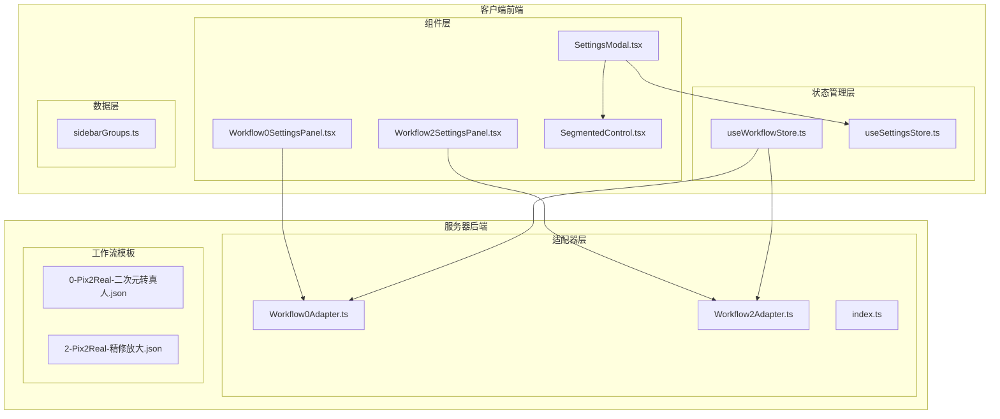
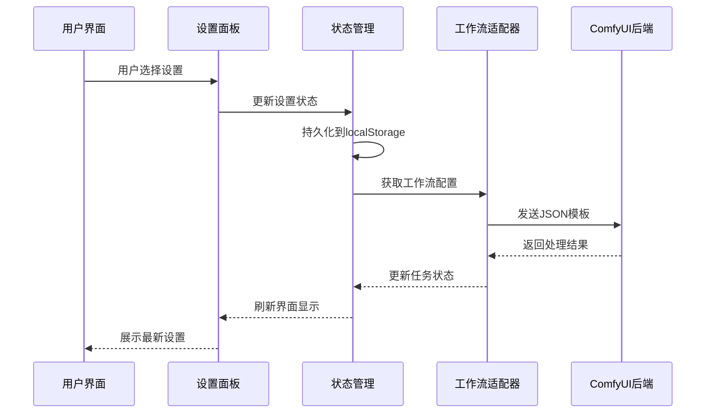
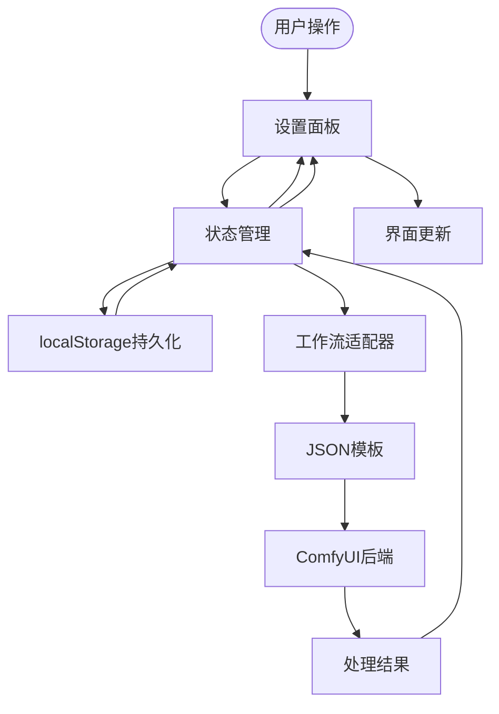
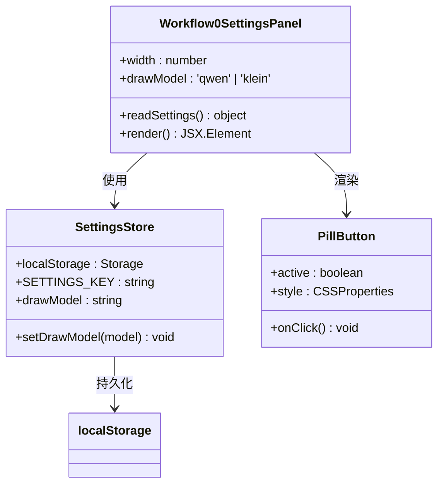
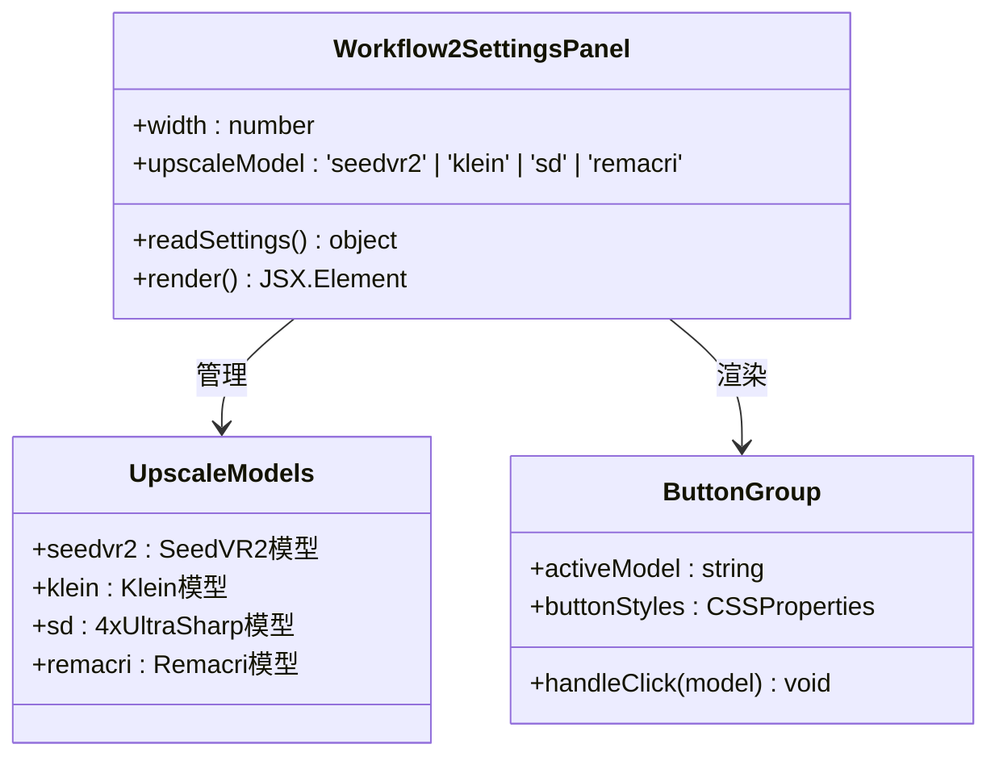
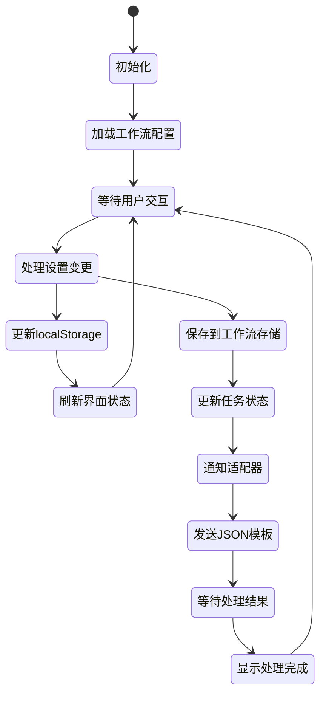
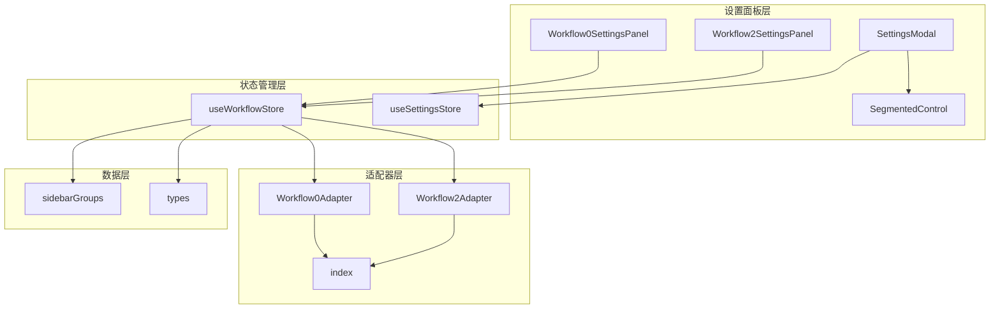

# 工作流设置面板

<cite>
**本文档引用的文件**
- [Workflow0SettingsPanel.tsx](file://client/src/components/Workflow0SettingsPanel.tsx)
- [Workflow2SettingsPanel.tsx](file://client/src/components/Workflow2SettingsPanel.tsx)
- [useWorkflowStore.ts](file://client/src/hooks/useWorkflowStore.ts)
- [useSettingsStore.ts](file://client/src/hooks/useSettingsStore.ts)
- [SettingsModal.tsx](file://client/src/components/SettingsModal.tsx)
- [SegmentedControl.tsx](file://client/src/components/SegmentedControl.tsx)
- [sidebarGroups.ts](file://client/src/data/sidebarGroups.ts)
- [Workflow0Adapter.ts](file://server/src/adapters/Workflow0Adapter.ts)
- [Workflow2Adapter.ts](file://server/src/adapters/Workflow2Adapter.ts)
- [index.ts](file://server/src/adapters/index.ts)
- [settings-panel.md](file://docs/settings-panel.md)
</cite>

## 目录
1. [简介](#简介)
2. [项目结构](#项目结构)
3. [核心组件](#核心组件)
4. [架构概览](#架构概览)
5. [详细组件分析](#详细组件分析)
6. [依赖关系分析](#依赖关系分析)
7. [性能考虑](#性能考虑)
8. [故障排除指南](#故障排除指南)
9. [结论](#结论)

## 简介

工作流设置面板是 CorineKit Pix2Real 图像处理系统中的关键组件，负责为不同的工作流提供可配置的参数设置界面。该系统支持多种AI驱动的图像处理工作流，包括二次元转真人、真人精修、精修放大等，每个工作流都有其特定的设置选项。

系统采用React + TypeScript 构建，使用Zustand进行状态管理，通过本地存储实现设置持久化。工作流设置面板与ComfyUI后端集成，通过JSON模板驱动实际的AI处理流程。

## 项目结构

工作流设置面板位于客户端前端代码中，主要包含以下关键目录和文件：

**图表来源**
- [Workflow0SettingsPanel.tsx:1-58](file://client/src/components/Workflow0SettingsPanel.tsx#L1-L58)
- [Workflow2SettingsPanel.tsx:1-60](file://client/src/components/Workflow2SettingsPanel.tsx#L1-L60)
- [useWorkflowStore.ts:1-690](file://client/src/hooks/useWorkflowStore.ts#L1-L690)

**章节来源**
- [Workflow0SettingsPanel.tsx:1-58](file://client/src/components/Workflow0SettingsPanel.tsx#L1-L58)
- [Workflow2SettingsPanel.tsx:1-60](file://client/src/components/Workflow2SettingsPanel.tsx#L1-L60)
- [useWorkflowStore.ts:1-690](file://client/src/hooks/useWorkflowStore.ts#L1-L690)

## 核心组件

### 工作流设置面板组件

系统实现了两个专门的工作流设置面板：

1. **Workflow0SettingsPanel** - 面向二次元转真人工作流的绘制模型选择
2. **Workflow2SettingsPanel** - 面向精修放大工作流的放大模型选择

每个面板都具有以下特征：
- 使用localStorage进行设置持久化
- 提供直观的按钮式切换界面
- 支持响应式宽度调整
- 集成到主界面布局中

### 状态管理系统

工作流状态通过Zustand管理，包含：
- 活动工作流标识
- 每个工作流的独立数据存储
- 图像处理任务状态
- 会话管理功能

**章节来源**
- [useWorkflowStore.ts:1-690](file://client/src/hooks/useWorkflowStore.ts#L1-L690)
- [useSettingsStore.ts:1-31](file://client/src/hooks/useSettingsStore.ts#L1-L31)

## 架构概览

系统采用分层架构设计，确保前后端分离和模块化：

**图表来源**
- [SettingsModal.tsx:24-239](file://client/src/components/SettingsModal.tsx#L24-L239)
- [useSettingsStore.ts:16-31](file://client/src/hooks/useSettingsStore.ts#L16-L31)

### 数据流架构

**图表来源**
- [Workflow0SettingsPanel.tsx:5-14](file://client/src/components/Workflow0SettingsPanel.tsx#L5-L14)
- [Workflow2SettingsPanel.tsx:5-14](file://client/src/components/Workflow2SettingsPanel.tsx#L5-L14)

## 详细组件分析

### Workflow0SettingsPanel 组件分析

Workflow0SettingsPanel 是针对二次元转真人工作流的设置面板，专注于绘制模型的选择：

**图表来源**
- [Workflow0SettingsPanel.tsx:9-58](file://client/src/components/Workflow0SettingsPanel.tsx#L9-L58)
- [Workflow0SettingsPanel.tsx:16-34](file://client/src/components/Workflow0SettingsPanel.tsx#L16-L34)

#### 核心功能特性

1. **绘制模型选择**：提供Qwen和Klein两种AI绘制模型的切换
2. **状态持久化**：使用localStorage自动保存用户选择
3. **响应式设计**：支持自定义宽度和滚动内容区域
4. **视觉反馈**：激活状态的按钮具有明显的视觉指示

**章节来源**
- [Workflow0SettingsPanel.tsx:1-58](file://client/src/components/Workflow0SettingsPanel.tsx#L1-L58)

### Workflow2SettingsPanel 组件分析

Workflow2SettingsPanel 面向精修放大工作流，提供多种放大模型选择：

**图表来源**
- [Workflow2SettingsPanel.tsx:9-60](file://client/src/components/Workflow2SettingsPanel.tsx#L9-L60)
- [Workflow2SettingsPanel.tsx:24-34](file://client/src/components/Workflow2SettingsPanel.tsx#L24-L34)

#### 放大模型选项

系统提供四种不同的放大模型：

| 模型名称 | 技术特点 | 适用场景 |
|---------|----------|----------|
| SeedVR2 | 专为视频优化的超分辨率模型 | 视频质量提升、动态内容处理 |
| Klein | 平衡质量和速度的通用模型 | 一般性图像放大需求 |
| 4xUltraSharp | 注重细节锐化的模型 | 需要极致清晰度的图像处理 |
| Remacri | 去噪和细节增强模型 | 低质量图像的降噪和增强 |

**章节来源**
- [Workflow2SettingsPanel.tsx:1-60](file://client/src/components/Workflow2SettingsPanel.tsx#L1-L60)

### 状态管理架构

工作流状态管理采用Zustand实现，提供集中式的状态控制：

**图表来源**
- [useWorkflowStore.ts:99-690](file://client/src/hooks/useWorkflowStore.ts#L99-L690)
- [useSettingsStore.ts:16-31](file://client/src/hooks/useSettingsStore.ts#L16-L31)

**章节来源**
- [useWorkflowStore.ts:1-690](file://client/src/hooks/useWorkflowStore.ts#L1-L690)
- [useSettingsStore.ts:1-31](file://client/src/hooks/useSettingsStore.ts#L1-L31)

## 依赖关系分析

### 组件间依赖关系

**图表来源**
- [index.ts:14-32](file://server/src/adapters/index.ts#L14-L32)
- [SettingsModal.tsx:24-31](file://client/src/components/SettingsModal.tsx#L24-L31)

### 外部依赖分析

系统的关键外部依赖包括：

1. **Zustand** - 轻量级状态管理库
2. **React** - 用户界面构建框架  
3. **Lucide-React** - 图标库
4. **ComfyUI** - AI图像处理后端

这些依赖确保了系统的现代化架构和强大的功能实现。

**章节来源**
- [index.ts:1-32](file://server/src/adapters/index.ts#L1-L32)
- [SettingsModal.tsx:1-239](file://client/src/components/SettingsModal.tsx#L1-L239)

## 性能考虑

### 状态管理优化

系统在状态管理方面采用了多项优化策略：

1. **局部状态更新**：仅更新受影响的状态片段
2. **批量操作**：支持多个状态变更的批处理
3. **内存管理**：及时清理不再使用的对象URL
4. **懒加载**：按需加载工作流适配器

### 渲染性能

- 使用React.memo避免不必要的重新渲染
- 优化CSS变量使用减少样式计算
- 实现虚拟滚动处理大量图像数据
- 按需加载工作流模板文件

## 故障排除指南

### 常见问题及解决方案

1. **设置不持久化**
   - 检查localStorage权限
   - 验证键名一致性
   - 确认JSON序列化正确性

2. **工作流适配器错误**
   - 验证JSON模板完整性
   - 检查节点连接关系
   - 确认模型文件存在

3. **状态同步问题**
   - 检查Zustand状态更新逻辑
   - 验证事件监听器注册
   - 确认副作用清理

**章节来源**
- [Workflow0SettingsPanel.tsx:5-7](file://client/src/components/Workflow0SettingsPanel.tsx#L5-L7)
- [Workflow2SettingsPanel.tsx:5-7](file://client/src/components/Workflow2SettingsPanel.tsx#L5-L7)

## 结论

工作流设置面板作为CorineKit Pix2Real系统的核心组件，成功实现了以下目标：

1. **模块化设计**：每个工作流都有独立的设置面板，便于维护和扩展
2. **用户体验优化**：直观的界面设计和即时反馈机制
3. **技术架构先进**：采用现代前端技术和最佳实践
4. **可扩展性强**：清晰的架构为未来功能扩展奠定基础

系统通过精心设计的状态管理和组件架构，为用户提供了一个强大而易用的AI图像处理工具。未来可以进一步优化性能，增加更多工作流类型，并改进用户界面的个性化定制能力。