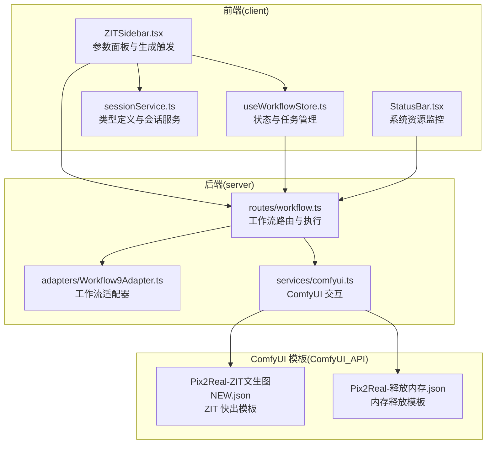
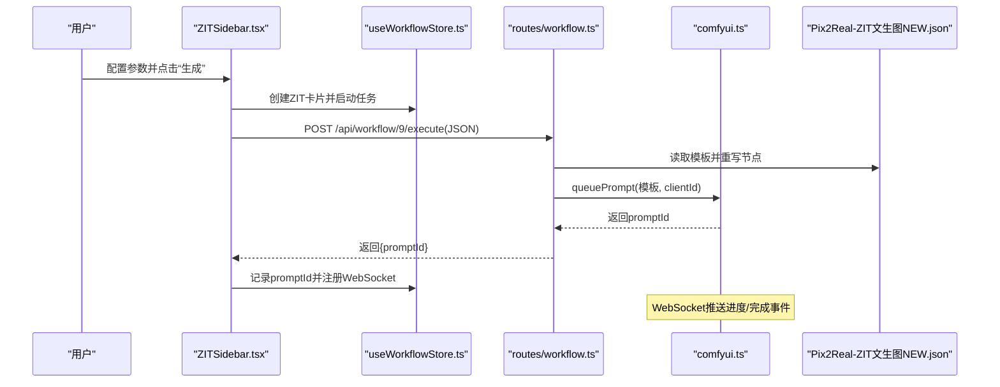
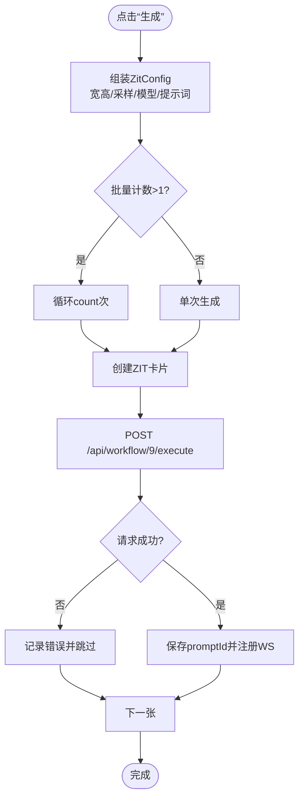
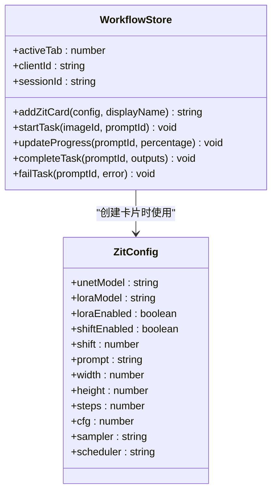
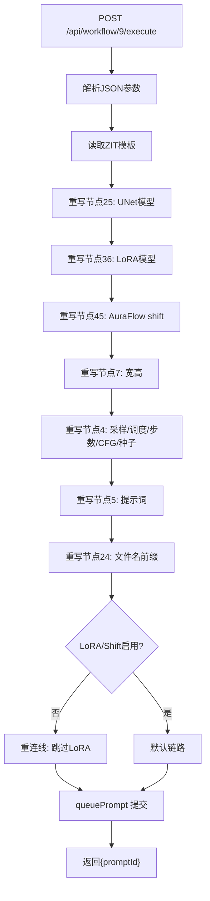
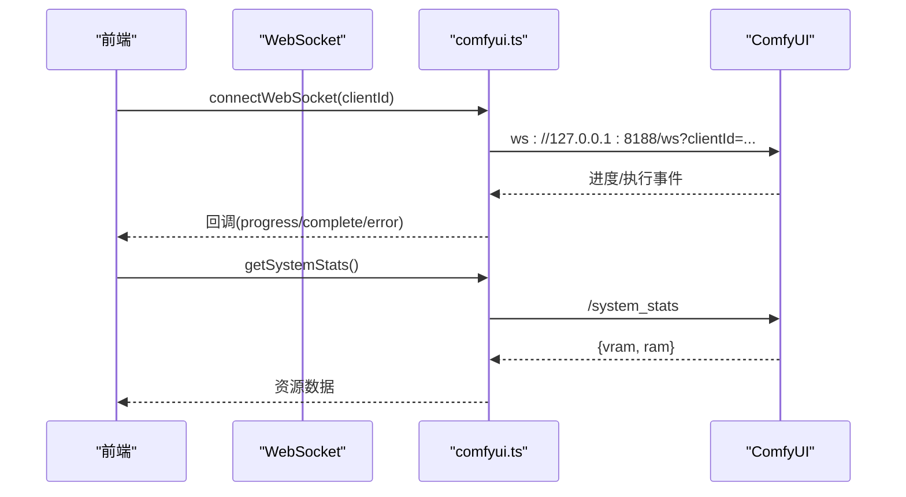
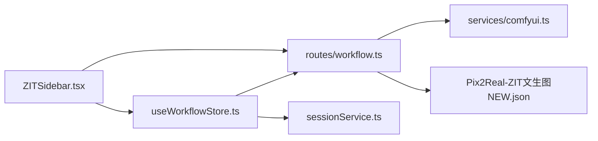

# ZIT 快出

<cite>
**本文档引用的文件**
- [README.md](file://README.md)
- [ZITSidebar.tsx](file://client/src/components/ZITSidebar.tsx)
- [useWorkflowStore.ts](file://client/src/hooks/useWorkflowStore.ts)
- [sessionService.ts](file://client/src/services/sessionService.ts)
- [workflow.ts](file://server/src/routes/workflow.ts)
- [Workflow9Adapter.ts](file://server/src/adapters/Workflow9Adapter.ts)
- [comfyui.ts](file://server/src/services/comfyui.ts)
- [Pix2Real-ZIT文生图NEW.json](file://ComfyUI_API/Pix2Real-ZIT文生图NEW.json)
- [Pix2Real-释放内存.json](file://ComfyUI_API/Pix2Real-释放内存.json)
- [StatusBar.tsx](file://client/src/components/StatusBar.tsx)
</cite>

## 目录
1. [简介](#简介)
2. [项目结构](#项目结构)
3. [核心组件](#核心组件)
4. [架构总览](#架构总览)
5. [详细组件分析](#详细组件分析)
6. [依赖关系分析](#依赖关系分析)
7. [性能考量](#性能考量)
8. [故障排除指南](#故障排除指南)
9. [结论](#结论)
10. [附录](#附录)

## 简介
ZIT 快出是本项目提供的一个面向“文本到图像”的快速生成工作流，专为批量高效产出而设计。其核心目标是在保证生成质量的前提下，最大化吞吐与响应速度，支持一键批量生成、参数预设、提示词智能辅助、以及与 ComfyUI 的深度集成。该工作流通过专用的后端路由直接接收 JSON 参数，绕过传统文件上传路径，从而减少 IO 开销，提升批处理效率。

## 项目结构
该项目采用前后端分离架构：前端使用 React + TypeScript 构建 Web UI，后端使用 Express + TypeScript 提供 API 与 ComfyUI 通信。ComfyUI 工作流模板集中存放于 ComfyUI_API 目录，前端通过适配器与路由将用户配置动态注入模板并提交至 ComfyUI 执行。

**图表来源**
- [ZITSidebar.tsx:1-635](file://client/src/components/ZITSidebar.tsx#L1-L635)
- [useWorkflowStore.ts:1-645](file://client/src/hooks/useWorkflowStore.ts#L1-L645)
- [sessionService.ts:1-134](file://client/src/services/sessionService.ts#L1-L134)
- [workflow.ts:180-261](file://server/src/routes/workflow.ts#L180-L261)
- [Workflow9Adapter.ts:1-14](file://server/src/adapters/Workflow9Adapter.ts#L1-L14)
- [comfyui.ts:1-200](file://server/src/services/comfyui.ts#L1-L200)
- [Pix2Real-ZIT文生图NEW.json:1-172](file://ComfyUI_API/Pix2Real-ZIT文生图NEW.json#L1-L172)
- [Pix2Real-释放内存.json:1-39](file://ComfyUI_API/Pix2Real-释放内存.json#L1-L39)

**章节来源**
- [README.md:41-79](file://README.md#L41-L79)

## 核心组件
- ZIT 参数面板（ZITSidebar）
  - 负责 UNet/LoRA 模型选择、提示词输入、比例预设、采样器与调度器配置、采样算法偏移（AuraFlow）、批量数量与自定义命名等。
  - 支持提示词智能辅助（自然语言↔标签互转、按需扩写），并持久化草稿至本地存储。
- 工作流状态与任务管理（useWorkflowStore）
  - 维护每个标签页内的图像列表、任务队列、进度与输出映射；支持批量卡片创建与任务启动。
- 专用执行路由（workflow.ts）
  - 提供 /api/workflow/9/execute 接口，接收 JSON 参数，动态重写模板节点（模型、LoRA、尺寸、采样参数、提示词、文件名前缀等），并提交至 ComfyUI。
- ComfyUI 服务层（comfyui.ts）
  - 封装上传、入队、历史查询、WebSocket 进度监听、系统资源统计等底层能力。
- 模板与适配器（Workflow9Adapter + Pix2Real-ZIT文生图NEW.json）
  - 适配器声明工作流属性；模板定义节点连接与默认参数，后端在运行时按需重连线与赋值。

**章节来源**
- [ZITSidebar.tsx:1-635](file://client/src/components/ZITSidebar.tsx#L1-L635)
- [useWorkflowStore.ts:1-645](file://client/src/hooks/useWorkflowStore.ts#L1-L645)
- [workflow.ts:180-261](file://server/src/routes/workflow.ts#L180-L261)
- [Workflow9Adapter.ts:1-14](file://server/src/adapters/Workflow9Adapter.ts#L1-L14)
- [comfyui.ts:1-200](file://server/src/services/comfyui.ts#L1-L200)
- [Pix2Real-ZIT文生图NEW.json:1-172](file://ComfyUI_API/Pix2Real-ZIT文生图NEW.json#L1-L172)

## 架构总览
ZIT 快出的执行链路从 UI 参数收集开始，经由前端状态管理与后端路由，动态构建 ComfyUI 模板并提交执行，同时通过 WebSocket 实时推送进度，最终回传结果文件路径。

**图表来源**
- [ZITSidebar.tsx:107-156](file://client/src/components/ZITSidebar.tsx#L107-L156)
- [useWorkflowStore.ts:377-396](file://client/src/hooks/useWorkflowStore.ts#L377-L396)
- [workflow.ts:180-261](file://server/src/routes/workflow.ts#L180-L261)
- [comfyui.ts:47-60](file://server/src/services/comfyui.ts#L47-L60)
- [Pix2Real-ZIT文生图NEW.json:1-172](file://ComfyUI_API/Pix2Real-ZIT文生图NEW.json#L1-L172)

## 详细组件分析

### ZIT 参数面板（ZITSidebar）
- 功能要点
  - 模型与 LoRA 列表加载与选择，支持启用/禁用 LoRA 与 AuraFlow 偏移。
  - 比例预设（1:1、3:4、9:16、4:3、16:9），自动计算宽高。
  - 采样器与调度器选择，步数与 CFG 调整，支持采样算法偏移（shift）。
  - 批量生成数量限制（1–32），自定义输出名称。
  - 提示词智能辅助：自然语言↔标签互转、按需扩写。
  - 本地草稿持久化，刷新不丢失。
- 关键行为
  - 点击“生成”时，根据当前配置构造 ZitConfig，批量创建卡片并逐个发起 /api/workflow/9/execute 请求，随后注册 WebSocket 监听进度。

**图表来源**
- [ZITSidebar.tsx:107-156](file://client/src/components/ZITSidebar.tsx#L107-L156)
- [sessionService.ts:15-28](file://client/src/services/sessionService.ts#L15-L28)

**章节来源**
- [ZITSidebar.tsx:1-635](file://client/src/components/ZITSidebar.tsx#L1-L635)
- [sessionService.ts:1-134](file://client/src/services/sessionService.ts#L1-L134)

### 工作流状态与任务管理（useWorkflowStore）
- 职责
  - 维护每个标签页的数据隔离（images、prompts、tasks、zitConfigs 等）。
  - 提供 addZitCard、startTask、updateProgress、completeTask、failTask 等任务生命周期方法。
  - 支持跨标签页的任务状态同步与进度更新。
- ZIT 卡片创建
  - 使用占位 PNG 文件作为临时占位，便于会话恢复与序列化。

**图表来源**
- [useWorkflowStore.ts:571-593](file://client/src/hooks/useWorkflowStore.ts#L571-L593)
- [sessionService.ts:15-28](file://client/src/services/sessionService.ts#L15-L28)

**章节来源**
- [useWorkflowStore.ts:1-645](file://client/src/hooks/useWorkflowStore.ts#L1-L645)
- [sessionService.ts:1-134](file://client/src/services/sessionService.ts#L1-L134)

### 专用执行路由（workflow.ts）
- 路由 /api/workflow/9/execute
  - 接收 JSON 参数（clientId、unetModel、loraModel、loraEnabled、shiftEnabled、shift、prompt、width、height、steps、cfg、sampler、scheduler、name）。
  - 读取 ZIT 模板，重写以下节点：
    - 25: UNet 模型
    - 36: LoRA 模型
    - 45: AuraFlow shift
    - 7: 图像宽高
    - 4: 采样器、调度器、步数、CFG、随机种子
    - 5: 提示词
    - 24: 输出文件名前缀
  - 根据 loraEnabled 与 shiftEnabled 动态重连模型链路（LoRA bypass、shift bypass 或默认链路）。
  - 调用 queuePrompt 提交至 ComfyUI 并返回 promptId。
- 错误处理
  - 对必填项缺失、模板读取失败、queuePrompt 失败等情况进行统一错误返回。

**图表来源**
- [workflow.ts:180-261](file://server/src/routes/workflow.ts#L180-L261)
- [Pix2Real-ZIT文生图NEW.json:1-172](file://ComfyUI_API/Pix2Real-ZIT文生图NEW.json#L1-L172)

**章节来源**
- [workflow.ts:180-261](file://server/src/routes/workflow.ts#L180-L261)

### ComfyUI 服务层（comfyui.ts）
- 能力
  - 上传图像/视频、入队、获取历史、查看图像、删除队列项、系统资源统计、WebSocket 连接与事件分发。
- WebSocket 事件
  - progress、executing（开始/完成）、execution_success、execution_error 等，用于驱动前端进度条与状态切换。
- 系统资源监控
  - 提供 VRAM/内存使用率查询，前端 StatusBar 以平滑动画展示变化。

**图表来源**
- [comfyui.ts:127-188](file://server/src/services/comfyui.ts#L127-L188)
- [StatusBar.tsx:69-102](file://client/src/components/StatusBar.tsx#L69-L102)

**章节来源**
- [comfyui.ts:1-200](file://server/src/services/comfyui.ts#L1-L200)
- [StatusBar.tsx:69-102](file://client/src/components/StatusBar.tsx#L69-L102)

### 模板与适配器（Workflow9Adapter + Pix2Real-ZIT文生图NEW.json）
- 适配器
  - 声明工作流 ID、名称、是否需要提示词、输出目录等元信息；明确 ZIT 使用专用路由而非模板拼接。
- 模板
  - 包含 UNet/CLIP/VAE 加载器、LoRA 加载器、K采样器、VAE 解码、保存图像等节点。
  - 默认模型与权重位于 Z-image 目录，支持 AuraFlow 采样与 shift 偏移。

**章节来源**
- [Workflow9Adapter.ts:1-14](file://server/src/adapters/Workflow9Adapter.ts#L1-L14)
- [Pix2Real-ZIT文生图NEW.json:1-172](file://ComfyUI_API/Pix2Real-ZIT文生图NEW.json#L1-L172)

## 依赖关系分析
- 前端依赖
  - ZITSidebar 依赖 useWorkflowStore 与 WebSocket Hook，负责参数收集与任务启动。
  - useWorkflowStore 依赖 sessionService 的类型定义，维护 ZitConfig。
- 后端依赖
  - workflow 路由依赖 ComfyUI 服务层与模板文件，负责参数校验、模板重写与入队。
- 模板依赖
  - ZIT 模板定义了固定的节点编号与连接关系，后端通过精确重写实现参数注入。

**图表来源**
- [ZITSidebar.tsx:1-635](file://client/src/components/ZITSidebar.tsx#L1-L635)
- [useWorkflowStore.ts:1-645](file://client/src/hooks/useWorkflowStore.ts#L1-L645)
- [workflow.ts:180-261](file://server/src/routes/workflow.ts#L180-L261)
- [comfyui.ts:1-200](file://server/src/services/comfyui.ts#L1-L200)
- [sessionService.ts:1-134](file://client/src/services/sessionService.ts#L1-L134)
- [Pix2Real-ZIT文生图NEW.json:1-172](file://ComfyUI_API/Pix2Real-ZIT文生图NEW.json#L1-L172)

**章节来源**
- [ZITSidebar.tsx:1-635](file://client/src/components/ZITSidebar.tsx#L1-L635)
- [useWorkflowStore.ts:1-645](file://client/src/hooks/useWorkflowStore.ts#L1-L645)
- [workflow.ts:180-261](file://server/src/routes/workflow.ts#L180-L261)
- [comfyui.ts:1-200](file://server/src/services/comfyui.ts#L1-L200)
- [sessionService.ts:1-134](file://client/src/services/sessionService.ts#L1-L134)

## 性能考量
- 生成速度优化
  - 专用路由避免文件上传开销，直接以 JSON 注入参数，适合批量流水线。
  - 降低 steps、合理 CFG 与采样器选择可缩短生成时间；AuraFlow + shift 在部分模型上具备更快收敛。
  - 控制批量数量（1–32），避免一次性堆积过多任务导致队列拥堵。
- 内存与显存管理
  - 使用内存释放模板（Pix2Real-释放内存.json）在必要时清理缓存与显存，维持稳定吞吐。
  - 通过系统资源监控（/api/workflow/system-stats）观察 VRAM/内存占用，及时干预。
- 质量与稳定性
  - 对于精细细节，适当提高 steps 与 CFG；LoRA 可增强风格一致性但可能增加显存压力。
  - 采样器与调度器组合影响稳定性与速度，建议先用 euler/simple 快速验证，再调整为更稳定方案。
- 批量生产的最佳实践
  - 预设常用配置（比例、采样、模型、LoRA），利用草稿持久化减少重复输入。
  - 分批执行，结合进度监控，避免长时间卡顿；必要时暂停其他工作流释放资源。

[本节为通用性能指导，无需特定文件引用]

## 故障排除指南
- 常见问题与定位
  - 无法生成或无响应
    - 检查 ComfyUI 是否正常运行（端口 8188），确认 WebSocket 连接建立。
    - 查看后端日志与前端控制台错误信息，确认 /api/workflow/9/execute 返回的 promptId。
  - 显存不足或 OOM
    - 减小批量数量、降低分辨率或 steps，启用内存释放模板清理缓存。
    - 切换更轻量的 UNet/LoRA 模型组合。
  - 提示词无效或生成偏差
    - 确认提示词长度与格式；使用提示词助手进行自然语言↔标签互转与扩写。
  - 进度不更新
    - 确认 WebSocket 注册成功（register promptId），检查后端 connectWebSocket 事件回调。
- 相关接口与事件
  - /api/workflow/9/execute：提交参数并获取 promptId。
  - /api/workflow/system-stats：查询系统资源使用情况。
  - WebSocket 事件：progress、execution_start、complete、error。

**章节来源**
- [workflow.ts:180-261](file://server/src/routes/workflow.ts#L180-L261)
- [comfyui.ts:127-188](file://server/src/services/comfyui.ts#L127-L188)
- [StatusBar.tsx:69-102](file://client/src/components/StatusBar.tsx#L69-L102)

## 结论
ZIT 快出通过“专用路由 + 模板重写 + WebSocket 实时反馈”的组合，在保证生成质量的同时实现了高效的批量生产。其参数面板直观易用，配合提示词助手与资源监控，能够满足从个人创作到小规模生产的多样化需求。建议在实际使用中结合内容类型与硬件条件，动态调整采样参数与批量策略，并定期清理内存显存以维持稳定吞吐。

[本节为总结性内容，无需特定文件引用]

## 附录

### 使用场景与优化建议
- 场景一：批量头像/立绘生成
  - 选择 3:4 或 9:16 比例，启用 LoRA 提升风格一致性，步数 8–12，CFG 2–4。
- 场景二：短视频封面/截图素材
  - 选择 16:9，步数 6–10，强调速度；必要时关闭 LoRA 与 shift 以节省显存。
- 场景三：风格探索与迭代
  - 使用提示词助手进行自然语言↔标签互转，逐步微调提示词与采样器组合。

### 参数对照与建议
- 步数（steps）：越高质量量越高，但耗时增长；建议 6–12。
- CFG：数值越大越贴合提示词，但可能引入伪影；建议 1–4。
- 采样器：euler/euler_a 快速稳定；dpm2m/res_ms 更平滑但稍慢。
- 调度器：simple/exponential 快速；ddim/beta/normal 更可控。
- AuraFlow + shift：在支持的模型上可显著提速，建议 2–4。

[本节为通用建议，无需特定文件引用]