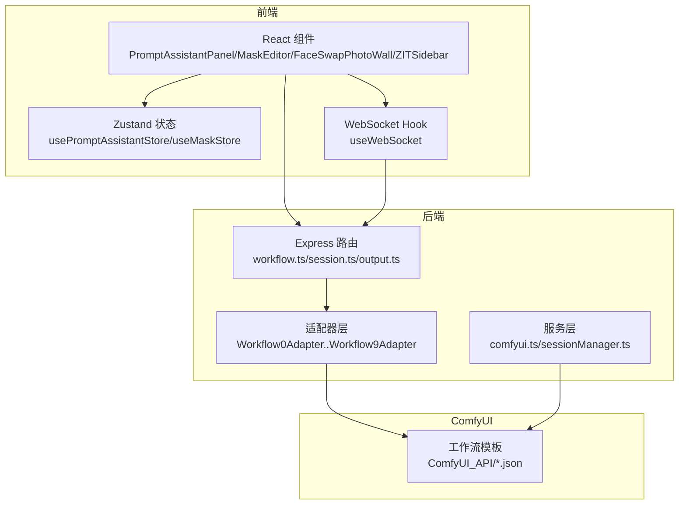
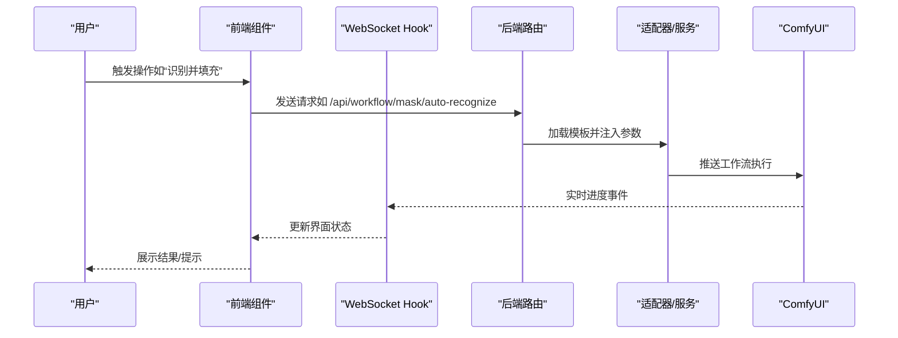
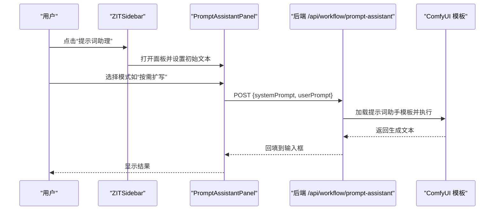
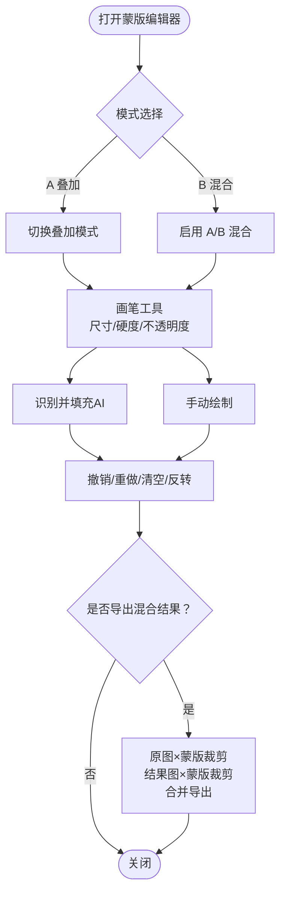
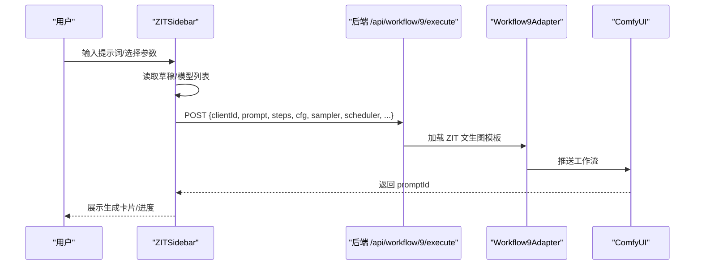
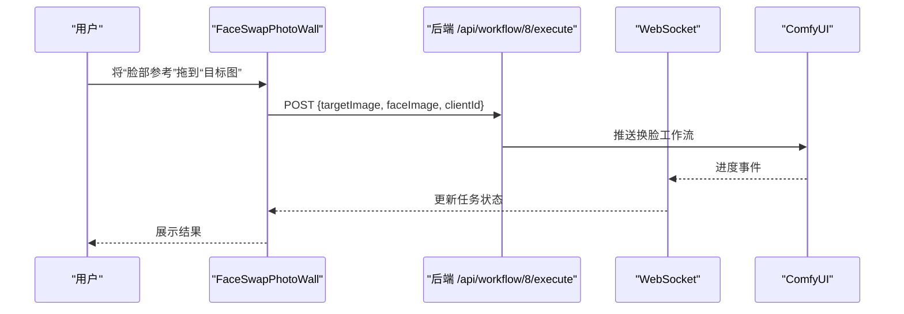
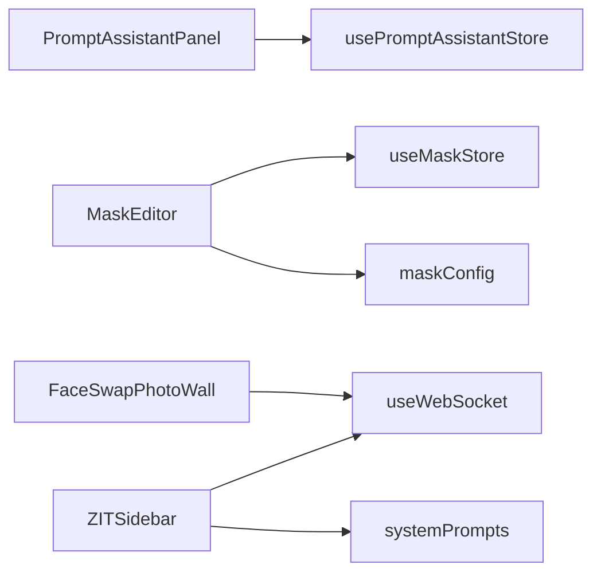

# 专业功能

<cite>
**本文引用的文件**
- [README.md](file://README.md)
- [PromptAssistantPanel.tsx](file://client/src/components/PromptAssistantPanel.tsx)
- [MaskEditor.tsx](file://client/src/components/MaskEditor.tsx)
- [FaceSwapPhotoWall.tsx](file://client/src/components/FaceSwapPhotoWall.tsx)
- [ZITSidebar.tsx](file://client/src/components/ZITSidebar.tsx)
- [usePromptAssistantStore.ts](file://client/src/hooks/usePromptAssistantStore.ts)
- [useMaskStore.ts](file://client/src/hooks/useMaskStore.ts)
- [maskConfig.ts](file://client/src/config/maskConfig.ts)
- [systemPrompts.ts](file://client/src/components/prompt-assistant/systemPrompts.ts)
- [Pix2Real-提示词助手.json](file://ComfyUI_API/Pix2Real-提示词助手.json)
- [Pix2Real-自动识别.json](file://ComfyUI_API/Pix2Real-自动识别.json)
- [SystemPrompt.txt](file://docs/SystemPrompt.txt)
</cite>

## 目录
1. [简介](#简介)
2. [项目结构](#项目结构)
3. [核心组件](#核心组件)
4. [架构总览](#架构总览)
5. [详细组件分析](#详细组件分析)
6. [依赖关系分析](#依赖关系分析)
7. [性能考量](#性能考量)
8. [故障排查指南](#故障排查指南)
9. [结论](#结论)
10. [附录](#附录)

## 简介
本文件聚焦 CorineKit Pix2Real 的专业功能，围绕提示词助手、蒙版编辑、快速出图（ZIT）、黑兽换脸等高级能力进行系统化说明。内容涵盖工作机制、数据流、交互流程、配置项与最佳实践，并提供面向高级用户的技巧与工作流优化建议。

## 项目结构
- 前端采用 Vite + React + TypeScript，通过 Zustand 管理状态，WebSocket 实时接收 ComfyUI 进度事件。
- 后端基于 Express，适配器模式封装不同工作流，统一加载 ComfyUI JSON 模板并动态注入参数。
- 专业功能主要分布在客户端组件与 ComfyUI 工作流模板中，分别对应提示词助手、蒙版编辑、ZIT 快出、黑兽换脸等。

**图表来源**
- [README.md:41-79](file://README.md#L41-L79)

**章节来源**
- [README.md:1-79](file://README.md#L1-L79)

## 核心组件
- 提示词助手：多模式面板，支持标签转换、创建变体、按需扩写、脑补后续、分镜生成、标签合成器；通过系统提示词驱动。
- 蒙版编辑：AI 自动识别与手动绘制双通道，支持多种叠加模式、撤销/重做、导出混合结果。
- ZIT 快出：基于文本生成图像的快速工作流，集成模型列表、LoRA 开关、采样器/调度器、批处理与草稿持久化。
- 黑兽换脸：专用 UI 区域，支持拖拽换脸、多选批量、任务队列与进度跟踪。

**章节来源**
- [PromptAssistantPanel.tsx:1-139](file://client/src/components/PromptAssistantPanel.tsx#L1-L139)
- [MaskEditor.tsx:1-375](file://client/src/components/MaskEditor.tsx#L1-L375)
- [ZITSidebar.tsx:1-635](file://client/src/components/ZITSidebar.tsx#L1-L635)
- [FaceSwapPhotoWall.tsx:1-861](file://client/src/components/FaceSwapPhotoWall.tsx#L1-L861)

## 架构总览
提示词助手与 ZIT 快出均通过前端调用后端接口触发 ComfyUI 执行；蒙版编辑器在前端完成绘制与历史管理，必要时调用后端进行 AI 识别；黑兽换脸在专用区域完成拖拽与任务注册。

**图表来源**
- [MaskEditor.tsx:218-235](file://client/src/components/MaskEditor.tsx#L218-L235)
- [README.md:74-79](file://README.md#L74-L79)

## 详细组件分析

### 提示词助手
- 功能定位：将自然语言与标签双向互转，生成提示词变体、按需扩写、续拍与分镜脚本。
- 交互入口：ZIT 侧边栏的“提示词助理”按钮或面板内多标签页切换。
- 系统提示词：包含“自然语言→标签”、“标签→自然语言”、“创建变体”、“按需扩写”、“脑补后续”、“分镜生成”六类规则。
- 数据流：用户输入经系统提示词封装后提交到后端，后端以 ComfyUI 模板执行推理，返回结果回填到输入框。

**图表来源**
- [ZITSidebar.tsx:442-462](file://client/src/components/ZITSidebar.tsx#L442-L462)
- [PromptAssistantPanel.tsx:19-139](file://client/src/components/PromptAssistantPanel.tsx#L19-L139)
- [systemPrompts.ts:4-145](file://client/src/components/prompt-assistant/systemPrompts.ts#L4-L145)
- [Pix2Real-提示词助手.json:1-106](file://ComfyUI_API/Pix2Real-提示词助手.json#L1-L106)

**章节来源**
- [ZITSidebar.tsx:158-179](file://client/src/components/ZITSidebar.tsx#L158-L179)
- [PromptAssistantPanel.tsx:1-139](file://client/src/components/PromptAssistantPanel.tsx#L1-L139)
- [usePromptAssistantStore.ts:1-33](file://client/src/hooks/usePromptAssistantStore.ts#L1-L33)
- [systemPrompts.ts:4-145](file://client/src/components/prompt-assistant/systemPrompts.ts#L4-L145)
- [SystemPrompt.txt:1-146](file://docs/SystemPrompt.txt#L1-L146)

### 蒙版编辑器
- 模式与用途：
  - 模式 A：叠加模式，用于覆盖式绘制（如“解除装备”）。
  - 模式 B：A/B 混合模式，支持与输出结果叠加混合并导出。
- AI 自动识别：上传原图，调用后端接口，返回二值蒙版，前端应用到画布。
- 手动绘制：画笔尺寸、硬度、不透明度调节；撤销/重做；清空/反转；蒙版可见性切换。
- 导出混合：将原图与结果图按蒙版进行裁剪混合，保存到指定路径。

**图表来源**
- [MaskEditor.tsx:141-375](file://client/src/components/MaskEditor.tsx#L141-L375)
- [useMaskStore.ts:12-51](file://client/src/hooks/useMaskStore.ts#L12-L51)
- [maskConfig.ts:3-20](file://client/src/config/maskConfig.ts#L3-L20)
- [Pix2Real-自动识别.json:1-161](file://ComfyUI_API/Pix2Real-自动识别.json#L1-L161)

**章节来源**
- [MaskEditor.tsx:1-375](file://client/src/components/MaskEditor.tsx#L1-L375)
- [useMaskStore.ts:1-51](file://client/src/hooks/useMaskStore.ts#L1-L51)
- [maskConfig.ts:1-20](file://client/src/config/maskConfig.ts#L1-L20)

### ZIT 快出（快速文本生成图像）
- 模型与 LoRA：动态加载 UNet 与 LoRA 列表，支持启用/禁用 LoRA。
- 采样参数：步数、CFG、采样器、调度器、AuraFlow 偏移（Shift）。
- 提示词与快捷动作：支持自然语言↔标签互转、按需扩写等快捷操作。
- 批处理与草稿：支持批量生成与本地草稿持久化，自动生成命名。

**图表来源**
- [ZITSidebar.tsx:107-156](file://client/src/components/ZITSidebar.tsx#L107-L156)
- [ZITSidebar.tsx:158-179](file://client/src/components/ZITSidebar.tsx#L158-L179)

**章节来源**
- [ZITSidebar.tsx:1-635](file://client/src/components/ZITSidebar.tsx#L1-L635)

### 黑兽换脸
- 专用布局：左右分区（脸部参考/目标图），支持拖拽换脸与多选批量。
- 任务队列：检测目标图是否正在处理，避免并发冲突；支持多选批量换脸。
- 通信：通过 WebSocket 注册任务，实时更新进度。

**图表来源**
- [FaceSwapPhotoWall.tsx:257-282](file://client/src/components/FaceSwapPhotoWall.tsx#L257-L282)

**章节来源**
- [FaceSwapPhotoWall.tsx:1-861](file://client/src/components/FaceSwapPhotoWall.tsx#L1-L861)

## 依赖关系分析
- 组件耦合：
  - PromptAssistantPanel 依赖 usePromptAssistantStore 与 Mode* 子面板。
  - MaskEditor 依赖 useMaskStore、maskConfig 与 MaskCanvas。
  - ZITSidebar 依赖 useWorkflowStore、useWebSocket、systemPrompts。
  - FaceSwapPhotoWall 依赖 useWorkflowStore、useWebSocket。
- 外部依赖：
  - ComfyUI 模板通过适配器加载并注入参数。
  - WebSocket 单例连接确保多组件共享进度事件。

**图表来源**
- [PromptAssistantPanel.tsx:1-139](file://client/src/components/PromptAssistantPanel.tsx#L1-L139)
- [MaskEditor.tsx:1-375](file://client/src/components/MaskEditor.tsx#L1-L375)
- [ZITSidebar.tsx:1-635](file://client/src/components/ZITSidebar.tsx#L1-L635)
- [FaceSwapPhotoWall.tsx:1-861](file://client/src/components/FaceSwapPhotoWall.tsx#L1-L861)

**章节来源**
- [README.md:74-79](file://README.md#L74-L79)

## 性能考量
- VRAM 释放：后端提供释放内存接口，可在长时间批量处理后清理显存。
- 采样参数：合理设置步数与 CFG，可平衡质量与速度；AuraFlow 偏移仅在特定采样器生效。
- 蒙版识别：自动识别前可先缩放图像以提升分割效率；适当调整扩展与模糊参数减少噪点。
- 批处理：ZIT 支持批量生成，建议根据显存与队列长度分批执行，避免阻塞。

**章节来源**
- [README.md:13](file://README.md#L13)
- [ZITSidebar.tsx:528-557](file://client/src/components/ZITSidebar.tsx#L528-L557)
- [Pix2Real-自动识别.json:1-161](file://ComfyUI_API/Pix2Real-自动识别.json#L1-L161)

## 故障排查指南
- 提示词助手无响应
  - 检查后端接口 /api/workflow/prompt-assistant 是否可达。
  - 确认系统提示词已正确传入，且 ComfyUI 模板加载成功。
- 蒙版识别失败
  - 确认上传图像格式与尺寸；检查 /api/workflow/mask/auto-recognize 返回状态码与错误信息。
  - 调整 SAM3 分割阈值与扩展/模糊参数。
- ZIT 生成卡住
  - 查看 WebSocket 是否正常接收进度；检查采样器/调度器与模型配置是否匹配。
  - 若显存不足，尝试降低分辨率或步数，或使用释放内存功能。
- 黑兽换脸报错
  - 确保目标图未处于处理中；检查 clientId 与文件上传是否成功。

**章节来源**
- [MaskEditor.tsx:218-235](file://client/src/components/MaskEditor.tsx#L218-L235)
- [ZITSidebar.tsx:137-156](file://client/src/components/ZITSidebar.tsx#L137-L156)
- [FaceSwapPhotoWall.tsx:266-282](file://client/src/components/FaceSwapPhotoWall.tsx#L266-L282)

## 结论
本项目通过模块化的前端组件与适配器模式的后端架构，实现了提示词助手、蒙版编辑、ZIT 快出与黑兽换脸等专业功能。建议在实际使用中结合系统提示词规则、合理的采样参数与蒙版策略，配合批处理与显存管理，以获得稳定高效的产出体验。

## 附录

### 使用场景与最佳实践
- 提示词助手
  - 场景：需要将中文描述精确映射为英文标签，或把标签还原为可读性强的中文描述。
  - 最佳实践：先用“自然语言→标签”提取关键视觉元素，再用“按需扩写”细化细节，最后用“创建变体”探索不同风格。
- 蒙版编辑
  - 场景：真人精修、解除装备等需要局部重绘或替换。
  - 最佳实践：优先使用“识别并填充”，再用“反转”修正误检区域；导出混合时保留原图与结果图以便比对。
- ZIT 快出
  - 场景：快速验证提示词效果与风格，批量生成对比素材。
  - 最佳实践：启用 LoRA 时注意模型兼容性；使用草稿功能保存常用参数组合。
- 黑兽换脸
  - 场景：多人物场景下的批量换脸与一致性保持。
  - 最佳实践：多选目标图时谨慎操作，避免并发冲突；换脸前确保目标图清晰且无遮挡。

### 高级技巧与工作流优化
- 提示词工程：利用系统提示词的严格规则，先拆解再重构，逐步提升细节密度。
- 蒙版策略：先粗后细，AI 识别作为初稿，手动微调提升边界精度；批量处理时统一画笔参数。
- 采样器选择：不同采样器/调度器对风格影响显著，建议建立参数对照表。
- 任务编排：ZIT 与换脸可并行执行，但需关注队列与显存占用，必要时分时段运行。