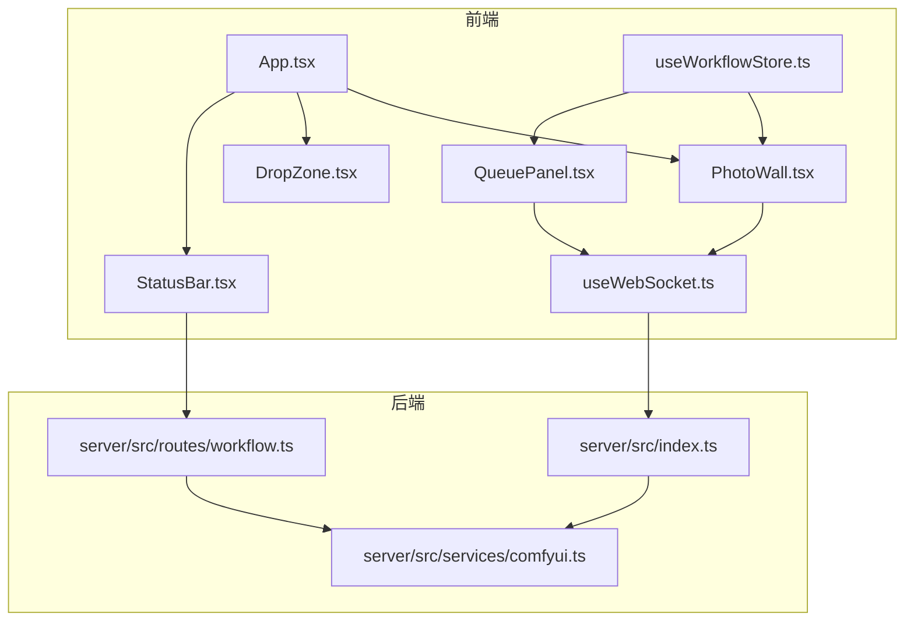
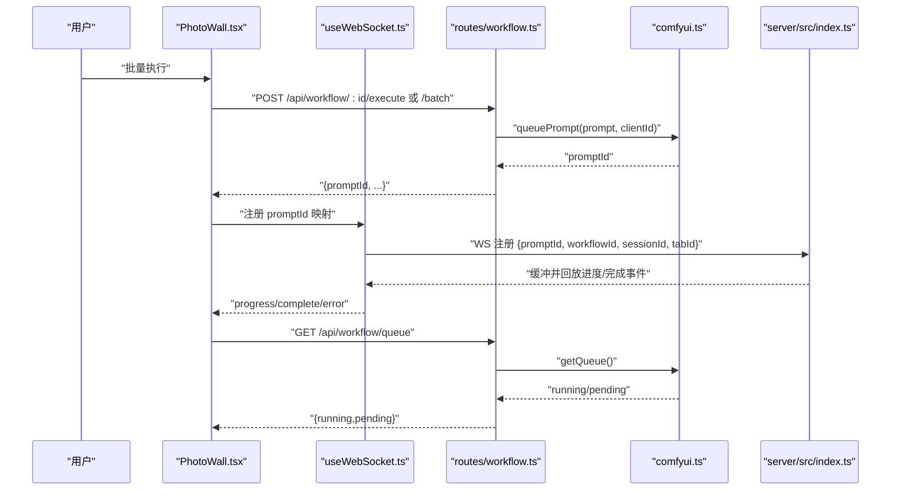
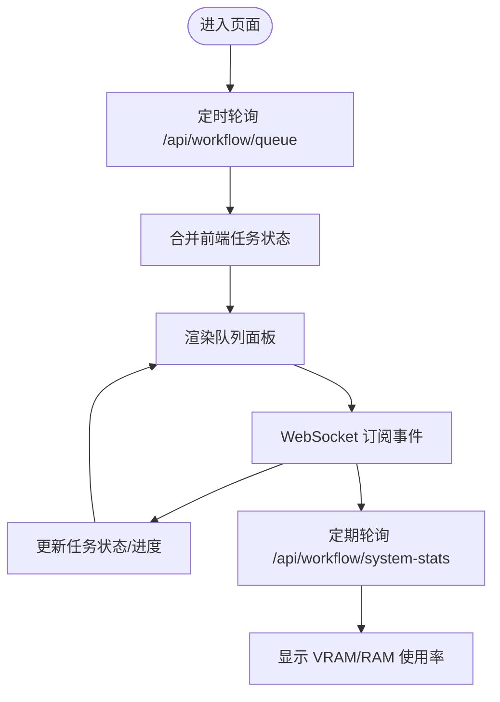
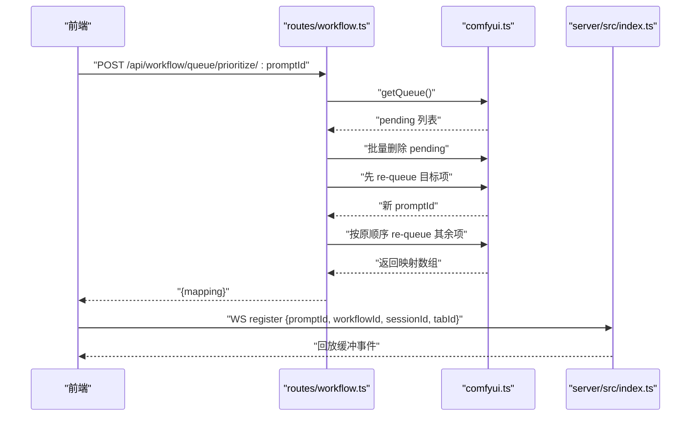
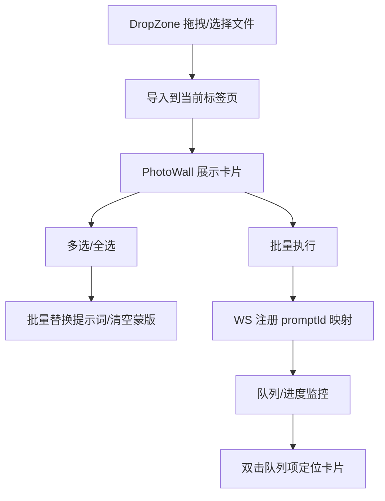
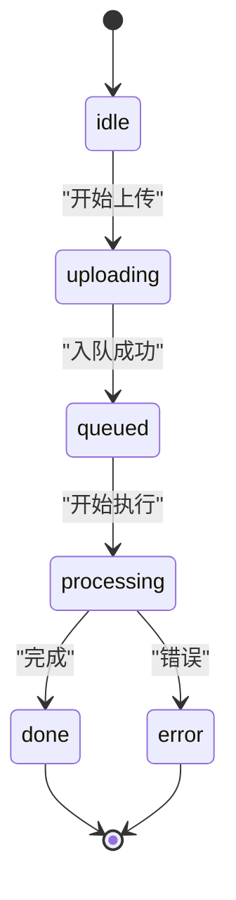
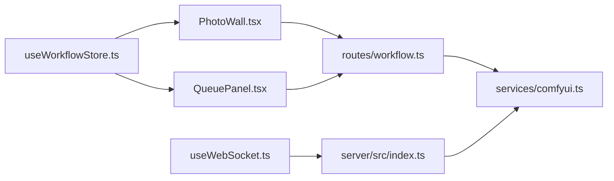

# 批量处理

<cite>
**本文引用的文件**
- [client/src/components/QueuePanel.tsx](file://client/src/components/QueuePanel.tsx)
- [client/src/components/DropZone.tsx](file://client/src/components/DropZone.tsx)
- [client/src/components/PhotoWall.tsx](file://client/src/components/PhotoWall.tsx)
- [client/src/components/App.tsx](file://client/src/components/App.tsx)
- [client/src/components/StatusBar.tsx](file://client/src/components/StatusBar.tsx)
- [client/src/components/ProgressOverlay.tsx](file://client/src/components/ProgressOverlay.tsx)
- [client/src/hooks/useWorkflowStore.ts](file://client/src/hooks/useWorkflowStore.ts)
- [client/src/hooks/useWebSocket.ts](file://client/src/hooks/useWebSocket.ts)
- [client/src/hooks/useDragStore.ts](file://client/src/hooks/useDragStore.ts)
- [client/src/services/sessionService.ts](file://client/src/services/sessionService.ts)
- [client/src/types/index.ts](file://client/src/types/index.ts)
- [server/src/index.ts](file://server/src/index.ts)
- [server/src/routes/workflow.ts](file://server/src/routes/workflow.ts)
- [server/src/services/comfyui.ts](file://server/src/services/comfyui.ts)
</cite>

## 目录
1. [简介](#简介)
2. [项目结构](#项目结构)
3. [核心组件](#核心组件)
4. [架构总览](#架构总览)
5. [详细组件分析](#详细组件分析)
6. [依赖关系分析](#依赖关系分析)
7. [性能考量](#性能考量)
8. [故障排查指南](#故障排查指南)
9. [结论](#结论)
10. [附录](#附录)

## 简介
本文件系统性阐述该批量处理系统的设计与实现，覆盖文件队列管理、并发处理策略、进度监控、用户界面与操作流程、优化策略与最佳实践，以及错误处理与故障恢复方案。系统通过前端状态管理与 WebSocket 实时事件驱动，结合后端与 ComfyUI 的队列与进度推送，形成完整的批处理闭环。

## 项目结构
- 前端（React + Zustand）负责文件拖拽上传、批量选择、参数统一设置、任务队列展示与进度跟踪、系统资源监控与释放。
- 后端（Express + ws）负责路由编排、与 ComfyUI 的交互、队列查询与优先级调整、输出下载与持久化、WebSocket 事件桥接。
- 会话与存储：支持会话状态序列化/反序列化、图片与蒙版上传、输出文件落盘。

图表来源
- [client/src/components/App.tsx:1-335](file://client/src/components/App.tsx#L1-L335)
- [client/src/components/PhotoWall.tsx:1-578](file://client/src/components/PhotoWall.tsx#L1-L578)
- [client/src/components/DropZone.tsx:1-171](file://client/src/components/DropZone.tsx#L1-L171)
- [client/src/components/QueuePanel.tsx:1-306](file://client/src/components/QueuePanel.tsx#L1-L306)
- [client/src/components/StatusBar.tsx:1-243](file://client/src/components/StatusBar.tsx#L1-L243)
- [client/src/hooks/useWebSocket.ts:1-99](file://client/src/hooks/useWebSocket.ts#L1-L99)
- [client/src/hooks/useWorkflowStore.ts:1-645](file://client/src/hooks/useWorkflowStore.ts#L1-L645)
- [server/src/index.ts:1-228](file://server/src/index.ts#L1-L228)
- [server/src/routes/workflow.ts:1-862](file://server/src/routes/workflow.ts#L1-L862)
- [server/src/services/comfyui.ts:1-285](file://server/src/services/comfyui.ts#L1-L285)

章节来源
- [client/src/components/App.tsx:1-335](file://client/src/components/App.tsx#L1-L335)
- [server/src/index.ts:1-228](file://server/src/index.ts#L1-L228)

## 核心组件
- 文件拖拽与批量导入：DropZone 支持文件与文件夹拖拽，PhotoWall 提供批量执行入口与多选工具条。
- 任务队列与进度：QueuePanel 展示运行中/排队中的任务；StatusBar 展示系统资源使用率；ProgressOverlay 展示单卡进度。
- 状态与消息：useWorkflowStore 统一管理任务状态、进度、输出；useWebSocket 单例连接 ComfyUI 事件；类型定义集中于 types/index.ts。
- 后端编排：routes/workflow.ts 提供执行、队列、优先级、内存释放、模型列表等接口；server/src/index.ts 作为 WebSocket 中继与输出落盘。

章节来源
- [client/src/components/DropZone.tsx:1-171](file://client/src/components/DropZone.tsx#L1-L171)
- [client/src/components/PhotoWall.tsx:181-240](file://client/src/components/PhotoWall.tsx#L181-L240)
- [client/src/components/QueuePanel.tsx:26-87](file://client/src/components/QueuePanel.tsx#L26-L87)
- [client/src/components/StatusBar.tsx:44-133](file://client/src/components/StatusBar.tsx#L44-L133)
- [client/src/components/ProgressOverlay.tsx:9-101](file://client/src/components/ProgressOverlay.tsx#L9-L101)
- [client/src/hooks/useWorkflowStore.ts:356-443](file://client/src/hooks/useWorkflowStore.ts#L356-L443)
- [client/src/hooks/useWebSocket.ts:75-99](file://client/src/hooks/useWebSocket.ts#L75-L99)
- [client/src/types/index.ts:1-58](file://client/src/types/index.ts#L1-L58)
- [server/src/routes/workflow.ts:457-520](file://server/src/routes/workflow.ts#L457-L520)
- [server/src/routes/workflow.ts:561-579](file://server/src/routes/workflow.ts#L561-L579)
- [server/src/routes/workflow.ts:542-559](file://server/src/routes/workflow.ts#L542-L559)
- [server/src/services/comfyui.ts:47-60](file://server/src/services/comfyui.ts#L47-L60)
- [server/src/services/comfyui.ts:202-221](file://server/src/services/comfyui.ts#L202-L221)

## 架构总览
系统采用“前端状态机 + 后端编排 + ComfyUI 队列”的三层协作模式：
- 前端负责 UI 与状态管理，通过 WebSocket 订阅进度与完成事件，驱动界面更新。
- 后端负责将前端请求转换为 ComfyUI 的 prompt 并入队，同时提供队列查询与优先级调整。
- ComfyUI 负责实际推理与输出生成，后端在完成后将输出下载至会话目录并通知前端。

图表来源
- [client/src/components/PhotoWall.tsx:181-240](file://client/src/components/PhotoWall.tsx#L181-L240)
- [client/src/hooks/useWebSocket.ts:75-99](file://client/src/hooks/useWebSocket.ts#L75-L99)
- [server/src/routes/workflow.ts:407-455](file://server/src/routes/workflow.ts#L407-L455)
- [server/src/routes/workflow.ts:457-520](file://server/src/routes/workflow.ts#L457-L520)
- [server/src/routes/workflow.ts:561-569](file://server/src/routes/workflow.ts#L561-L569)
- [server/src/services/comfyui.ts:47-60](file://server/src/services/comfyui.ts#L47-L60)
- [server/src/services/comfyui.ts:202-221](file://server/src/services/comfyui.ts#L202-L221)
- [server/src/index.ts:73-219](file://server/src/index.ts#L73-L219)

## 详细组件分析

### 文件队列管理与进度监控
- 队列面板：周期性拉取后端队列信息，合并前端任务状态，渲染运行中/排队中任务列表，支持置顶与取消。
- 进度订阅：WebSocket 接收 execution_start/progress/complete/error，前端状态机更新任务状态与进度。
- 资源监控：StatusBar 定期轮询系统统计，平滑显示 VRAM/RAM 使用率，支持一键释放缓存。

图表来源
- [client/src/components/QueuePanel.tsx:37-87](file://client/src/components/QueuePanel.tsx#L37-L87)
- [client/src/hooks/useWebSocket.ts:26-51](file://client/src/hooks/useWebSocket.ts#L26-L51)
- [client/src/components/StatusBar.tsx:68-108](file://client/src/components/StatusBar.tsx#L68-L108)

章节来源
- [client/src/components/QueuePanel.tsx:26-121](file://client/src/components/QueuePanel.tsx#L26-L121)
- [client/src/components/StatusBar.tsx:44-133](file://client/src/components/StatusBar.tsx#L44-L133)
- [client/src/hooks/useWebSocket.ts:75-99](file://client/src/hooks/useWebSocket.ts#L75-L99)

### 并发处理策略
- 单实例 WebSocket：useWebSocket 以单例方式维护连接，避免重复连接与资源浪费。
- 队列优先级：后端支持将指定任务置顶，通过删除全部待处理项并重新入队的方式实现，返回旧/新 promptId 映射以便前端重映射。
- 事件缓冲：服务端在客户端注册前缓冲 execution_start/progress，确保首次连接也能收到历史事件。

图表来源
- [server/src/routes/workflow.ts:571-579](file://server/src/routes/workflow.ts#L571-L579)
- [server/src/services/comfyui.ts:255-284](file://server/src/services/comfyui.ts#L255-L284)
- [server/src/index.ts:192-213](file://server/src/index.ts#L192-L213)

章节来源
- [server/src/routes/workflow.ts:571-579](file://server/src/routes/workflow.ts#L571-L579)
- [server/src/services/comfyui.ts:255-284](file://server/src/services/comfyui.ts#L255-L284)
- [server/src/index.ts:80-90](file://server/src/index.ts#L80-L90)

### 用户界面与操作流程
- 文件拖拽上传：DropZone 支持文件与文件夹拖拽，自动过滤图片/视频类型，导入到当前标签页。
- 批量选择与参数设置：PhotoWall 提供多选工具条，支持批量替换提示词、清空蒙版、批量执行。
- 任务定位：QueuePanel 支持双击定位到对应卡片，高亮闪烁效果辅助视觉定位。
- 输出管理：拖拽输出卡片到删除区可直接删除输出；支持删除整张图片及其关联蒙版。

图表来源
- [client/src/components/DropZone.tsx:39-91](file://client/src/components/DropZone.tsx#L39-L91)
- [client/src/components/PhotoWall.tsx:165-240](file://client/src/components/PhotoWall.tsx#L165-L240)
- [client/src/components/QueuePanel.tsx:123-133](file://client/src/components/QueuePanel.tsx#L123-L133)

章节来源
- [client/src/components/DropZone.tsx:39-91](file://client/src/components/DropZone.tsx#L39-L91)
- [client/src/components/PhotoWall.tsx:165-240](file://client/src/components/PhotoWall.tsx#L165-L240)
- [client/src/components/QueuePanel.tsx:123-133](file://client/src/components/QueuePanel.tsx#L123-L133)

### 数据模型与状态流转
- 任务状态：idle/uploading/queued/processing/done/error，前端状态机统一管理。
- WebSocket 消息：connected、execution_start、progress、complete、error，驱动 UI 更新。
- 会话数据：支持图片、提示词、任务、输出索引、蒙版等序列化与恢复。

图表来源
- [client/src/types/index.ts:17-25](file://client/src/types/index.ts#L17-L25)
- [client/src/hooks/useWorkflowStore.ts:377-499](file://client/src/hooks/useWorkflowStore.ts#L377-L499)

章节来源
- [client/src/types/index.ts:1-58](file://client/src/types/index.ts#L1-L58)
- [client/src/hooks/useWorkflowStore.ts:356-499](file://client/src/hooks/useWorkflowStore.ts#L356-L499)

## 依赖关系分析
- 前端依赖
  - Zustand 状态管理：集中管理任务、提示词、蒙版、会话等。
  - WebSocket 单例：全局共享连接，避免重复连接。
  - 类型系统：统一前后端消息格式，降低耦合。
- 后端依赖
  - Express 路由：暴露执行、队列、模型、内存释放等接口。
  - ComfyUI 服务：封装上传、入队、历史查询、进度与完成事件、系统统计。
  - WebSocket 中继：转发 ComfyUI 事件到前端，维护 prompt→workflow 映射。

图表来源
- [client/src/hooks/useWorkflowStore.ts:96-195](file://client/src/hooks/useWorkflowStore.ts#L96-L195)
- [client/src/hooks/useWebSocket.ts:10-73](file://client/src/hooks/useWebSocket.ts#L10-L73)
- [server/src/routes/workflow.ts:1-38](file://server/src/routes/workflow.ts#L1-L38)
- [server/src/services/comfyui.ts:1-25](file://server/src/services/comfyui.ts#L1-L25)
- [server/src/index.ts:62-90](file://server/src/index.ts#L62-L90)

章节来源
- [client/src/hooks/useWorkflowStore.ts:96-195](file://client/src/hooks/useWorkflowStore.ts#L96-L195)
- [client/src/hooks/useWebSocket.ts:10-73](file://client/src/hooks/useWebSocket.ts#L10-L73)
- [server/src/routes/workflow.ts:1-38](file://server/src/routes/workflow.ts#L1-L38)
- [server/src/services/comfyui.ts:1-25](file://server/src/services/comfyui.ts#L1-L25)
- [server/src/index.ts:62-90](file://server/src/index.ts#L62-L90)

## 性能考量
- 并发与队列
  - 合理设置并发：根据 GPU 显存与任务复杂度控制同时执行的任务数，避免显存溢出。
  - 优先级策略：对紧急任务使用置顶，减少等待时间。
- 资源监控
  - 定期轮询系统统计，动态调整任务节奏；当显存/内存接近阈值时暂停新任务。
  - 提供一键释放缓存，清理显存与临时占用。
- I/O 与网络
  - 批量上传时限制单次文件数量，避免内存峰值过高。
  - 输出下载采用二进制流直传，减少中间层拷贝。
- 前端渲染
  - PhotoWall 使用懒加载与滚动锚定，保证大量卡片场景下的流畅性。
  - 队列面板与进度条采用节流更新，避免频繁重绘。

[本节为通用指导，无需列出章节来源]

## 故障排查指南
- 无法连接 ComfyUI
  - 检查后端日志与 ComfyUI 服务状态；确认 /api/workflow/system-stats 是否可用。
  - 前端 WebSocket 自动重连，若长时间无响应，尝试刷新页面。
- 任务卡住或进度为 0
  - 查看队列面板是否显示排队；检查系统资源使用率是否过高。
  - 在 StatusBar 点击“释放缓存”后重试。
- 任务被取消或失败
  - 在队列面板点击“从队列删除”移除待处理项；查看错误消息并修正参数后重试。
  - 对于提示词反推/提示词助理等慢任务，注意超时阈值（约 180 秒）。
- 输出缺失
  - 确认会话输出目录存在且可写；通过“打开输出目录”按钮定位文件路径。

章节来源
- [server/src/services/comfyui.ts:106-125](file://server/src/services/comfyui.ts#L106-L125)
- [client/src/components/StatusBar.tsx:110-133](file://client/src/components/StatusBar.tsx#L110-L133)
- [server/src/routes/workflow.ts:709-744](file://server/src/routes/workflow.ts#L709-L744)

## 结论
该批量处理系统通过清晰的前后端分层与事件驱动机制，实现了稳定高效的批处理能力。前端以状态机为核心，后端以路由与 ComfyUI 集成为基础，配合 WebSocket 实时事件与会话持久化，满足了从文件导入、批量执行到进度监控与输出管理的完整闭环。建议在生产环境中结合资源监控与优先级策略，持续优化并发与稳定性。

[本节为总结性内容，无需列出章节来源]

## 附录
- 最佳实践清单
  - 控制并发：依据显存与任务复杂度设定最大并发数。
  - 参数统一：批量替换提示词时先预览再应用，避免误改。
  - 资源管理：高峰期使用“释放缓存”，降低显存压力。
  - 错误恢复：失败任务可重试或取消，必要时清理会话后重试。
  - 大文件处理：拆分批次、分时段执行，避免长时间占用资源。

[本节为通用指导，无需列出章节来源]