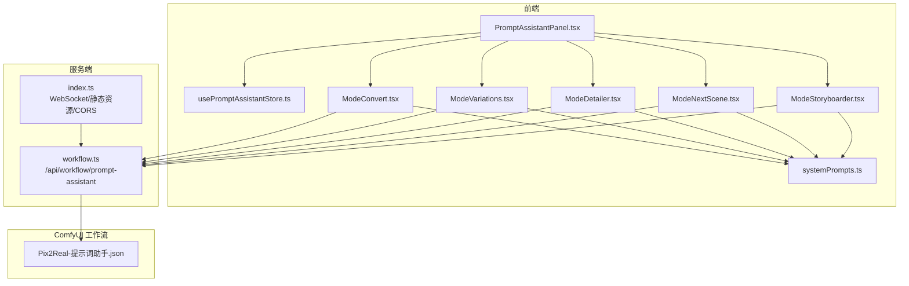
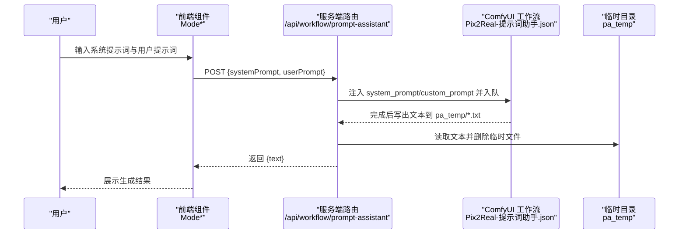
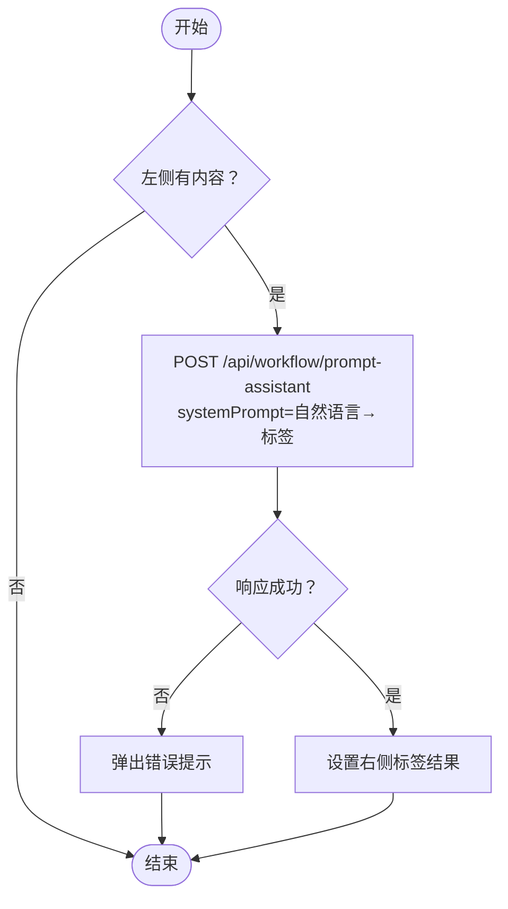
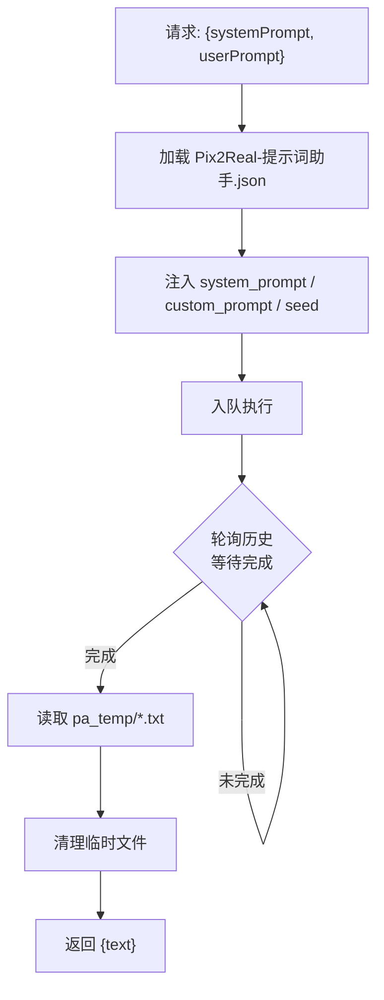
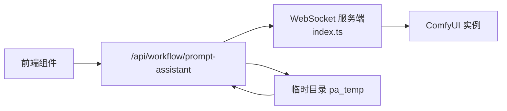

# 提示词助手

<cite>
**本文引用的文件**
- [PromptAssistantPanel.tsx](file://client/src/components/PromptAssistantPanel.tsx)
- [usePromptAssistantStore.ts](file://client/src/hooks/usePromptAssistantStore.ts)
- [systemPrompts.ts](file://client/src/components/prompt-assistant/systemPrompts.ts)
- [ModeConvert.tsx](file://client/src/components/prompt-assistant/ModeConvert.tsx)
- [ModeVariations.tsx](file://client/src/components/prompt-assistant/ModeVariations.tsx)
- [ModeDetailer.tsx](file://client/src/components/prompt-assistant/ModeDetailer.tsx)
- [ModeNextScene.tsx](file://client/src/components/prompt-assistant/ModeNextScene.tsx)
- [ModeStoryboarder.tsx](file://client/src/components/prompt-assistant/ModeStoryboarder.tsx)
- [Pix2Real-提示词助手.json](file://ComfyUI_API/Pix2Real-提示词助手.json)
- [SystemPrompt.txt](file://docs/提示词助理开发需求/SystemPrompt.txt)
- [workflow.ts](file://server/src/routes/workflow.ts)
- [index.ts](file://server/src/index.ts)
- [index.ts（类型）](file://client/src/types/index.ts)
- [package.json](file://package.json)
</cite>

## 目录
1. [简介](#简介)
2. [项目结构](#项目结构)
3. [核心组件](#核心组件)
4. [架构总览](#架构总览)
5. [详细组件分析](#详细组件分析)
6. [依赖关系分析](#依赖关系分析)
7. [性能与参数优化](#性能与参数优化)
8. [故障排除指南](#故障排除指南)
9. [结论](#结论)
10. [附录](#附录)

## 简介
提示词助手是一个基于本地大模型推理的智能提示词生成与编辑工具，支持多模式工作流：自然语言与标签互转、提示词变体生成、按需扩写、分镜续拍与分镜脚本生成。系统通过前端 React 组件收集用户输入，经由服务端 Express 路由调度 ComfyUI 工作流，最终输出可直接用于图像/视频生成的提示词文本。

## 项目结构
该功能横跨前端与服务端两部分：
- 前端负责用户界面与交互、状态管理、与服务端 API 的通信。
- 服务端负责接收请求、加载 ComfyUI 工作流模板、注入系统提示词与用户提示词、轮询执行完成状态并读取输出文本。

图表来源
- [PromptAssistantPanel.tsx:1-139](file://client/src/components/PromptAssistantPanel.tsx#L1-L139)
- [usePromptAssistantStore.ts:1-33](file://client/src/hooks/usePromptAssistantStore.ts#L1-L33)
- [systemPrompts.ts:1-145](file://client/src/components/prompt-assistant/systemPrompts.ts#L1-L145)
- [ModeConvert.tsx:1-195](file://client/src/components/prompt-assistant/ModeConvert.tsx#L1-L195)
- [ModeVariations.tsx:1-151](file://client/src/components/prompt-assistant/ModeVariations.tsx#L1-L151)
- [ModeDetailer.tsx:1-142](file://client/src/components/prompt-assistant/ModeDetailer.tsx#L1-L142)
- [ModeNextScene.tsx:1-142](file://client/src/components/prompt-assistant/ModeNextScene.tsx#L1-L142)
- [ModeStoryboarder.tsx:1-171](file://client/src/components/prompt-assistant/ModeStoryboarder.tsx#L1-L171)
- [workflow.ts:746-800](file://server/src/routes/workflow.ts#L746-L800)
- [index.ts:42-61](file://server/src/index.ts#L42-L61)
- [Pix2Real-提示词助手.json:1-106](file://ComfyUI_API/Pix2Real-提示词助手.json#L1-L106)

章节来源
- [package.json:1-15](file://package.json#L1-L15)
- [index.ts:42-61](file://server/src/index.ts#L42-L61)

## 核心组件
- 状态与入口
  - PromptAssistantPanel：主面板容器，提供标签页切换与各模式内容区域。
  - usePromptAssistantStore：Zustand 状态，维护面板开关、活动模式、初始文本与会话键。
- 系统提示词
  - systemPrompts：集中管理六种模式的系统提示词，确保前后端一致。
- 各模式组件
  - ModeConvert：自然语言↔标签双向转换。
  - ModeVariations：根据标记与权重生成提示词变体。
  - ModeDetailer：对指定段落进行按点数扩写。
  - ModeNextScene：基于当前镜头生成下一镜头。
  - ModeStoryboarder：根据故事大纲生成分镜脚本。
- 服务端路由
  - /api/workflow/prompt-assistant：接收系统提示词与用户提示词，注入到工作流模板，轮询完成并读取文本输出。

章节来源
- [PromptAssistantPanel.tsx:1-139](file://client/src/components/PromptAssistantPanel.tsx#L1-L139)
- [usePromptAssistantStore.ts:1-33](file://client/src/hooks/usePromptAssistantStore.ts#L1-L33)
- [systemPrompts.ts:1-145](file://client/src/components/prompt-assistant/systemPrompts.ts#L1-L145)
- [workflow.ts:746-800](file://server/src/routes/workflow.ts#L746-L800)

## 架构总览
提示词助手采用“前端交互 + 服务端编排 + ComfyUI 工作流”的三层架构：
- 前端负责 UI 与用户输入；调用 /api/workflow/prompt-assistant 发送 systemPrompt 与 userPrompt。
- 服务端解析请求，加载 Pix2Real-提示词助手.json 模板，设置 system_prompt 与 custom_prompt，入队执行。
- ComfyUI 执行完成后，服务端轮询历史记录，读取 easy saveText 写出的文本文件，返回给前端。

图表来源
- [workflow.ts:746-800](file://server/src/routes/workflow.ts#L746-L800)
- [Pix2Real-提示词助手.json:1-106](file://ComfyUI_API/Pix2Real-提示词助手.json#L1-L106)

## 详细组件分析

### 系统提示词与规则
系统提示词定义了每个模式的职责边界、输出格式与约束，确保生成结果稳定可控：
- 自然语言→标签：严格映射、无幻觉、按重要性排序、英文逗号分隔。
- 标签→自然语言：字面化描述、空间结构组织、零修饰语。
- 变体生成：按标记与权重生成 5 条差异明显的变体，保持原结构。
- 按需扩写：仅扩展方括号内内容，按点数增加细节，无缝融合。
- 脑补后续：保持角色与环境一致性，动作连续，输出长度匹配。
- 分镜生成：统一角色外观、继承环境特征、镜头数量自适应、纯视觉描述。

章节来源
- [systemPrompts.ts:1-145](file://client/src/components/prompt-assistant/systemPrompts.ts#L1-L145)
- [SystemPrompt.txt:1-153](file://docs/提示词助理开发需求/SystemPrompt.txt#L1-L153)

### ModeConvert：自然语言↔标签互转
- 功能要点
  - 双列布局，左侧自然语言，右侧标签。
  - 支持箭头按钮双向转换，带复制按钮与加载态。
  - 调用 /api/workflow/prompt-assistant，传入对应系统提示词与用户输入。
- 错误处理
  - 请求失败弹出错误提示，避免静默失败。
- 最佳实践
  - 输入尽量具体，避免抽象表达；必要时先用“标签→自然语言”验证理解一致性。

图表来源
- [ModeConvert.tsx:45-69](file://client/src/components/prompt-assistant/ModeConvert.tsx#L45-L69)
- [workflow.ts:746-800](file://server/src/routes/workflow.ts#L746-L800)

章节来源
- [ModeConvert.tsx:1-195](file://client/src/components/prompt-assistant/ModeConvert.tsx#L1-L195)

### ModeVariations：提示词变体生成
- 功能要点
  - 用户输入原始提示词，使用 # 标记要变化的部分，@ 数值表示强度，括号内为偏好。
  - 输出 5 条变体，每条独立编号。
- 处理逻辑
  - 前端解析响应，去除编号与空行，保留前 5 条。
- 使用技巧
  - 对关键元素（如服装、表情、背景）分别加权，观察不同强度下的效果。

章节来源
- [ModeVariations.tsx:1-151](file://client/src/components/prompt-assistant/ModeVariations.tsx#L1-L151)
- [systemPrompts.ts:51-73](file://client/src/components/prompt-assistant/systemPrompts.ts#L51-L73)

### ModeDetailer：按需扩写
- 功能要点
  - 仅对 [ ] 或 【】 内容扩写，按点数增加细节。
  - 输出时移除括号，与原文无缝融合。
- 使用技巧
  - 用点数表达“想要多少细节”，逐步迭代直到满意。

章节来源
- [ModeDetailer.tsx:1-142](file://client/src/components/prompt-assistant/ModeDetailer.tsx#L1-L142)
- [systemPrompts.ts:75-92](file://client/src/components/prompt-assistant/systemPrompts.ts#L75-L92)

### ModeNextScene：脑补后续
- 功能要点
  - 基于当前镜头生成下一镜头，保持角色外观与环境一致性，动作连贯。
  - 输出长度与输入大致匹配，纯视觉描述。
- 使用技巧
  - 先确定角色与场景基调，再逐镜头推进剧情。

章节来源
- [ModeNextScene.tsx:1-142](file://client/src/components/prompt-assistant/ModeNextScene.tsx#L1-L142)
- [systemPrompts.ts:94-111](file://client/src/components/prompt-assistant/systemPrompts.ts#L94-L111)

### ModeStoryboarder：分镜脚本生成
- 功能要点
  - 输入故事大纲，输出若干镜头脚本，镜头间逻辑连贯。
  - 角色外观与环境特征需在后续镜头中继承与复用。
- 使用技巧
  - 明确角色全称与关键特征，避免后续镜头出现不一致。

章节来源
- [ModeStoryboarder.tsx:1-171](file://client/src/components/prompt-assistant/ModeStoryboarder.tsx#L1-L171)
- [systemPrompts.ts:113-143](file://client/src/components/prompt-assistant/systemPrompts.ts#L113-L143)

### 服务端路由与工作流执行
- /api/workflow/prompt-assistant
  - 接收 { systemPrompt, userPrompt }。
  - 加载 Pix2Real-提示词助手.json，注入 system_prompt 与 custom_prompt。
  - 设置随机种子，配置保存路径到 pa_temp，入队执行。
  - 轮询历史直到完成，读取写出的文本文件，返回给前端。
- ComfyUI 工作流
  - llama_cpp_model_loader：加载 Qwen3-VL 模型与投影。
  - llama_cpp_parameters：采样参数（温度、top_k、top_p、min_p、典型采样、重复惩罚等）。
  - llama_cpp_instruct_adv：执行指令式推理。
  - easy saveText：将结果写入 pa_temp 目录，供服务端读取。

图表来源
- [workflow.ts:746-800](file://server/src/routes/workflow.ts#L746-L800)
- [Pix2Real-提示词助手.json:1-106](file://ComfyUI_API/Pix2Real-提示词助手.json#L1-L106)

章节来源
- [workflow.ts:746-800](file://server/src/routes/workflow.ts#L746-L800)
- [Pix2Real-提示词助手.json:1-106](file://ComfyUI_API/Pix2Real-提示词助手.json#L1-L106)

## 依赖关系分析
- 前端依赖
  - Zustand：全局状态管理（面板开关、活动模式、初始文本）。
  - Lucide 图标：复制、完成等交互反馈。
  - fetch：与服务端通信。
- 服务端依赖
  - Express：HTTP 服务与路由。
  - ws：WebSocket 事件桥接 ComfyUI。
  - ComfyUI 服务封装：上传文件、入队、轮询历史、下载输出。
- 工作流依赖
  - llama_cpp_* 节点：模型加载与推理。
  - easy saveText：输出文本持久化到 pa_temp。

图表来源
- [index.ts:63-219](file://server/src/index.ts#L63-L219)
- [workflow.ts:746-800](file://server/src/routes/workflow.ts#L746-L800)

章节来源
- [index.ts:1-228](file://server/src/index.ts#L1-L228)
- [workflow.ts:1-862](file://server/src/routes/workflow.ts#L1-L862)

## 性能与参数优化
- 采样参数调优（来自工作流模板）
  - temperature：影响创造性与稳定性，数值越高越发散。
  - top_k / top_p：控制核采样范围，平衡多样性与稳定性。
  - min_p：抑制低概率词，提升聚焦度。
  - typical_p：典型采样，有助于稳定输出。
  - repeat_penalty / frequency_penalty / presence_penalty：抑制重复与引入新内容。
  - mirostat_*：动态调节 token 级别的困惑度，适合长文本稳定生成。
- 文本长度与上下文
  - max_tokens 控制单次最大输出长度，结合 n_ctx（上下文窗口）合理设置。
- I/O 与缓存
  - 使用 pa_temp 作为中间输出目录，完成后立即清理，避免磁盘膨胀。
- 并发与批处理
  - 若需要批量生成提示词，可在前端聚合请求或服务端实现批处理队列（当前路由为单次执行）。

章节来源
- [Pix2Real-提示词助手.json:1-106](file://ComfyUI_API/Pix2Real-提示词助手.json#L1-L106)
- [workflow.ts:746-800](file://server/src/routes/workflow.ts#L746-L800)

## 故障排除指南
- 服务端无法连接 ComfyUI
  - 检查 WebSocket 地址与端口，确认 /ws 可达。
  - 查看服务端日志中的连接与错误事件。
- 超时问题
  - 默认轮询超时约 180 秒，若模型较大或系统较慢，可能需要延长等待时间或优化模型参数。
- 输出为空
  - 确认工作流已正确写出文本文件到 pa_temp，且文件名唯一。
  - 检查系统提示词与用户提示词是否满足模式约束。
- CORS 限制
  - 确保前端访问地址在允许列表中（默认 localhost:5173）。
- 权限与路径
  - 确保 pa_temp 目录存在且可写。

章节来源
- [index.ts:42-61](file://server/src/index.ts#L42-L61)
- [workflow.ts:746-800](file://server/src/routes/workflow.ts#L746-L800)

## 结论
提示词助手通过明确的系统提示词与稳定的 ComfyUI 工作流，实现了从自然语言到标签、从标签到自然语言、从单一提示词到变体/扩写/分镜的完整链路。其模块化设计便于扩展更多模式，同时采样参数与 I/O 流程为性能优化提供了明确抓手。建议在实际使用中遵循模式约束、逐步调参，并结合批处理与缓存策略以提升效率。

## 附录

### 使用场景与最佳实践
- 优化提示词质量
  - 先用“标签→自然语言”回译，验证理解一致性。
  - 使用“变体生成”探索不同权重与偏好组合。
- 处理复杂场景描述
  - 将复杂场景拆分为角色、环境、光照三段，分别扩写与细化。
  - 使用“分镜生成”将故事大纲转化为镜头清单，再逐镜头完善。
- 批量生成高质量提示词
  - 在前端聚合输入，或在服务端实现批处理队列，统一注入系统提示词与用户提示词。
  - 利用复制按钮快速应用到其他任务。

### 配置参数速查
- 采样参数（来自工作流模板）
  - max_tokens、top_k、top_p、min_p、typical_p、temperature、repeat_penalty、frequency_penalty、presence_penalty、mirostat_mode、mirostat_eta、mirostat_tau、state_uid
- 模型与上下文
  - model、mmproj、chat_handler、n_ctx、vram_limit、image_min_tokens、image_max_tokens
- 输出与清理
  - 临时输出目录 pa_temp，完成后清理

章节来源
- [Pix2Real-提示词助手.json:1-106](file://ComfyUI_API/Pix2Real-提示词助手.json#L1-L106)
- [workflow.ts:746-800](file://server/src/routes/workflow.ts#L746-L800)