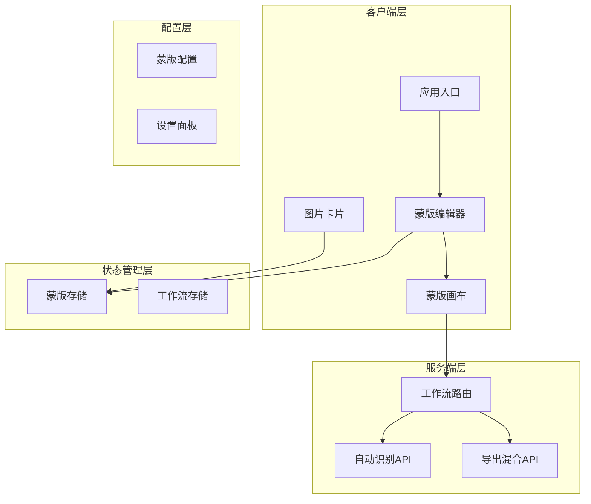
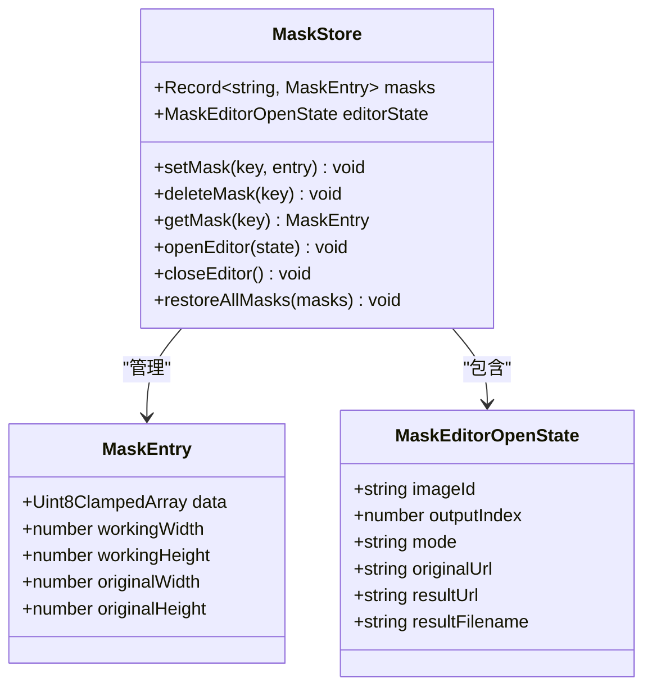
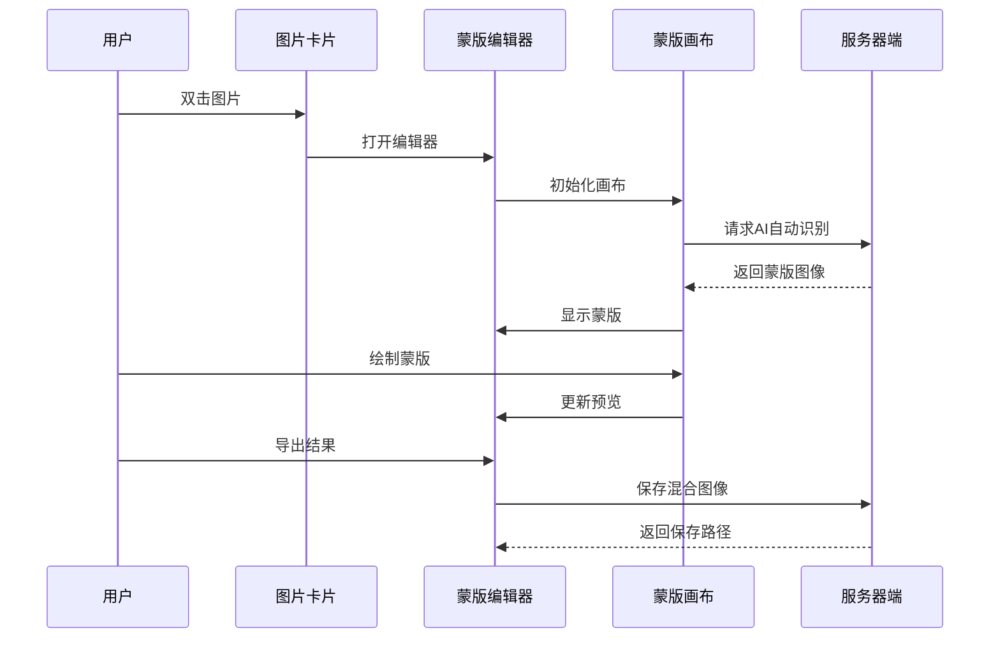
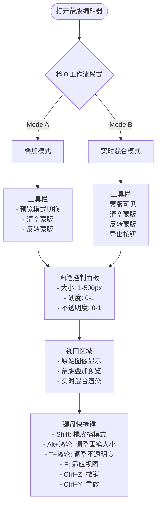
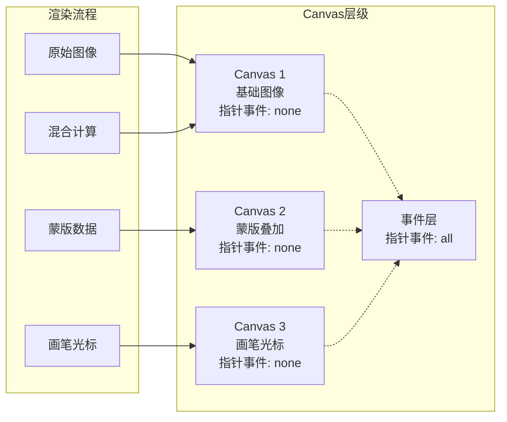
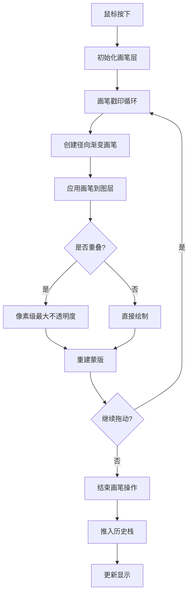
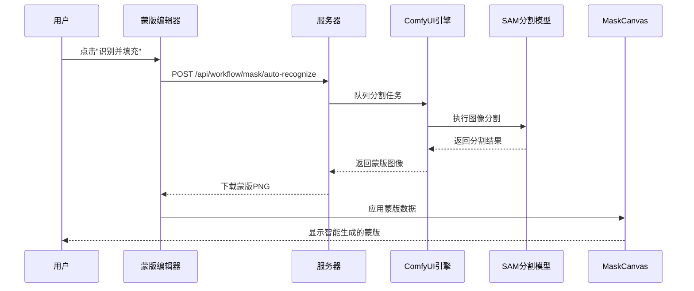
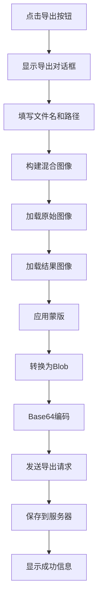
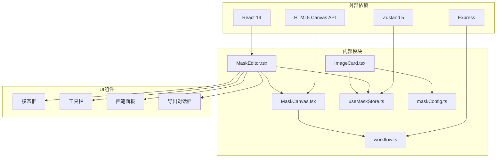

# 蒙版编辑器

<cite>
**本文档引用的文件**
- [MaskEditor.tsx](file://client/src/components/MaskEditor.tsx)
- [MaskCanvas.tsx](file://client/src/components/MaskCanvas.tsx)
- [useMaskStore.ts](file://client/src/hooks/useMaskStore.ts)
- [maskConfig.ts](file://client/src/config/maskConfig.ts)
- [ImageCard.tsx](file://client/src/components/ImageCard.tsx)
- [workflow.ts](file://server/src/routes/workflow.ts)
- [2026-02-24-mask-editor-design.md](file://docs/plans/2026-02-24-mask-editor-design.md)
- [2026-02-24-mask-editor.md](file://docs/plans/2026-02-24-mask-editor.md)
</cite>

## 目录
1. [简介](#简介)
2. [项目结构](#项目结构)
3. [核心组件](#核心组件)
4. [架构概览](#架构概览)
5. [详细组件分析](#详细组件分析)
6. [依赖关系分析](#依赖关系分析)
7. [性能考虑](#性能考虑)
8. [故障排除指南](#故障排除指南)
9. [结论](#结论)
10. [附录](#附录)

## 简介

蒙版编辑器是一个集成了AI自动识别和手动绘制功能的智能蒙版编辑系统。该系统支持两种编辑模式：叠加模式（Mode A）和实时混合模式（Mode B），为用户提供从AI自动分割到精细手绘的完整蒙版编辑体验。

系统的核心特性包括：
- AI自动识别：基于SAM分割算法的智能蒙版生成
- 手动绘制：软硬刷子、透明度控制、撤销重做功能
- 实时预览：Mode B模式下的实时混合预览
- 批量处理：支持多张图片的蒙版编辑和导出
- 精度控制：可调节的画笔大小、硬度和不透明度参数

## 项目结构

蒙版编辑器采用模块化架构，主要由以下组件构成：

**图表来源**
- [MaskEditor.tsx:141-375](file://client/src/components/MaskEditor.tsx#L141-L375)
- [MaskCanvas.tsx:39-677](file://client/src/components/MaskCanvas.tsx#L39-L677)
- [useMaskStore.ts:32-51](file://client/src/hooks/useMaskStore.ts#L32-L51)

**章节来源**
- [MaskEditor.tsx:1-375](file://client/src/components/MaskEditor.tsx#L1-L375)
- [MaskCanvas.tsx:1-677](file://client/src/components/MaskCanvas.tsx#L1-L677)
- [useMaskStore.ts:1-51](file://client/src/hooks/useMaskStore.ts#L1-L51)

## 核心组件

### 蒙版存储系统

蒙版存储使用Zustand状态管理库，提供响应式的蒙版数据管理：

**图表来源**
- [useMaskStore.ts:4-29](file://client/src/hooks/useMaskStore.ts#L4-L29)

### 蒙版配置系统

系统通过配置文件定义不同工作流标签页的蒙版模式：

| 标签页 | 名称 | 蒙版模式 | 说明 |
|--------|------|----------|------|
| 0 | 二次元转真人 | Mode A | 开发测试用，原图覆盖模式 |
| 1 | 真人精修 | Mode B | 实时混合模式，需要选择输出图 |
| 2 | 精修放大 | None | 不需要蒙版 |
| 3 | 快速生成视频 | None | 视频标签页 |
| 4 | 视频放大 | None | 视频标签页 |

**章节来源**
- [maskConfig.ts:5-16](file://client/src/config/maskConfig.ts#L5-L16)
- [2026-02-24-mask-editor-design.md:15-22](file://docs/plans/2026-02-24-mask-editor-design.md#L15-L22)

## 架构概览

蒙版编辑器采用分层架构设计，确保各组件职责清晰、耦合度低：

**图表来源**
- [ImageCard.tsx:302-328](file://client/src/components/ImageCard.tsx#L302-L328)
- [MaskEditor.tsx:196-235](file://client/src/components/MaskEditor.tsx#L196-L235)
- [workflow.ts:812-859](file://server/src/routes/workflow.ts#L812-L859)

## 详细组件分析

### 蒙版编辑器主界面

蒙版编辑器采用全屏模态框设计，提供直观的编辑环境：

**图表来源**
- [MaskEditor.tsx:269-375](file://client/src/components/MaskEditor.tsx#L269-L375)
- [2026-02-24-mask-editor-design.md:129-142](file://docs/plans/2026-02-24-mask-editor-design.md#L129-L142)

#### 工具栏功能详解

| 功能 | Mode A | Mode B | 说明 |
|------|--------|--------|------|
| 预览模式切换 | ✅ | ❌ | 暗色叠加/高亮显示/红色叠加 |
| 蒙版可见 | ❌ | ✅ | 切换蒙版叠加显示 |
| 清空蒙版 | ✅ | ✅ | 清除所有绘制内容 |
| 反转蒙版 | ✅ | ✅ | 将前景和背景互换 |
| 导出 | ❌ | ✅ | 保存混合后的最终图像 |

**章节来源**
- [MaskEditor.tsx:305-323](file://client/src/components/MaskEditor.tsx#L305-L323)

### 蒙版画布系统

蒙版画布是整个系统的渲染核心，采用三层Canvas架构：

**图表来源**
- [MaskCanvas.tsx:668-677](file://client/src/components/MaskCanvas.tsx#L668-L677)
- [2026-02-24-mask-editor-design.md:63-70](file://docs/plans/2026-02-24-mask-editor-design.md#L63-L70)

#### 画笔系统实现

画笔系统采用非累积软画笔技术，确保边缘质量：

**图表来源**
- [MaskCanvas.tsx:207-276](file://client/src/components/MaskCanvas.tsx#L207-L276)
- [MaskCanvas.tsx:234-286](file://client/src/components/MaskCanvas.tsx#L234-L286)

**章节来源**
- [MaskCanvas.tsx:203-286](file://client/src/components/MaskCanvas.tsx#L203-L286)

### AI自动识别系统

系统集成了SAM分割算法，提供智能的蒙版生成能力：

**图表来源**
- [MaskEditor.tsx:196-235](file://client/src/components/MaskEditor.tsx#L196-L235)
- [workflow.ts:812-859](file://server/src/routes/workflow.ts#L812-L859)

#### 自动识别工作流程

| 步骤 | 操作 | 超时时间 | 错误处理 |
|------|------|----------|----------|
| 1 | 接收图像文件 | - | 400错误: 无图像文件 |
| 2 | 上传到ComfyUI | - | 服务器异常 |
| 3 | 队列SAM分割任务 | - | 队列失败 |
| 4 | 轮询执行状态 | 120秒 | 504超时错误 |
| 5 | 获取输出文件 | - | 500分割失败 |
| 6 | 返回蒙版图像 | - | 成功响应 |

**章节来源**
- [workflow.ts:812-859](file://server/src/routes/workflow.ts#L812-L859)

### 导出系统

Mode B模式支持将混合结果导出到指定目录：

**图表来源**
- [MaskEditor.tsx:363-371](file://client/src/components/MaskEditor.tsx#L363-L371)
- [workflow.ts:626-655](file://server/src/routes/workflow.ts#L626-L655)

**章节来源**
- [MaskEditor.tsx:363-371](file://client/src/components/MaskEditor.tsx#L363-L371)

## 依赖关系分析

蒙版编辑器的依赖关系呈现清晰的层次结构：

**图表来源**
- [MaskEditor.tsx:1-10](file://client/src/components/MaskEditor.tsx#L1-L10)
- [MaskCanvas.tsx:1-10](file://client/src/components/MaskCanvas.tsx#L1-L10)
- [useMaskStore.ts:1-5](file://client/src/hooks/useMaskStore.ts#L1-L5)

### 关键依赖关系

1. **状态管理依赖**：MaskEditor依赖useMaskStore进行蒙版数据管理
2. **渲染依赖**：MaskCanvas依赖HTML5 Canvas API进行高性能渲染
3. **网络通信依赖**：workflow路由提供AI识别和导出功能
4. **配置依赖**：maskConfig定义不同工作流的蒙版模式

**章节来源**
- [useMaskStore.ts:32-51](file://client/src/hooks/useMaskStore.ts#L32-L51)
- [maskConfig.ts:5-16](file://client/src/config/maskConfig.ts#L5-L16)

## 性能考虑

蒙版编辑器在设计时充分考虑了性能优化：

### 内存管理

- **工作分辨率限制**：最长边不超过2048px，平衡质量与性能
- **历史记录优化**：最多保存30步撤销操作，避免内存泄漏
- **数据类型优化**：使用Uint8ClampedArray存储蒙版数据，减少GC压力

### 渲染优化

- **离屏Canvas**：所有画笔操作在离屏Canvas上完成，减少主线程阻塞
- **增量更新**：仅在必要时标记画布为脏，避免不必要的重绘
- **帧率控制**：使用requestAnimationFrame确保60fps渲染

### 网络优化

- **图像缓存**：AI识别结果通过URL对象缓存，避免重复下载
- **批量处理**：支持多张图片的蒙版编辑，提高工作效率
- **超时控制**：AI识别超时时间为120秒，防止长时间等待

## 故障排除指南

### 常见问题及解决方案

#### AI自动识别失败

**问题症状**：点击"识别并填充"后出现错误提示

**可能原因**：
1. 图像格式不支持（仅支持PNG、WEBP、JPG）
2. ComfyUI服务不可用
3. SAM模型加载失败

**解决步骤**：
1. 检查图像文件格式是否为支持的格式
2. 确认服务器端日志中无异常
3. 重新尝试识别或调整图像质量

#### 蒙版编辑卡顿

**问题症状**：画笔操作响应迟缓

**可能原因**：
1. 图像分辨率过高
2. 浏览器性能不足
3. 历史记录过多

**解决步骤**：
1. 缩小画笔尺寸（建议小于200px）
2. 降低蒙版分辨率
3. 清理历史记录或重启应用

#### 导出失败

**问题症状**：导出对话框显示错误信息

**可能原因**：
1. 磁盘空间不足
2. 文件名包含非法字符
3. 权限不足

**解决步骤**：
1. 检查目标目录磁盘空间
2. 使用简单的文件名（仅字母数字和下划线）
3. 以管理员权限运行应用

**章节来源**
- [workflow.ts:841-844](file://server/src/routes/workflow.ts#L841-L844)
- [MaskEditor.tsx:209-235](file://client/src/components/MaskEditor.tsx#L209-L235)

## 结论

蒙版编辑器是一个功能完整、性能优异的智能蒙版编辑系统。通过AI自动识别与手动绘制的有机结合，用户可以高效地创建高质量的蒙版。系统的模块化设计确保了良好的可维护性和扩展性，而精心的性能优化则保证了流畅的用户体验。

主要优势包括：
- **智能化程度高**：AI自动识别大幅减少手工绘制工作量
- **操作便捷**：直观的界面设计和丰富的快捷键支持
- **性能优秀**：多层Canvas架构和优化的数据结构
- **扩展性强**：清晰的架构设计便于功能扩展

未来可以考虑的功能增强：
- 支持蒙版导入导出
- 添加蒙版平滑和细化工具
- 实现跨会话的蒙版持久化
- 增加蒙版预设库功能

## 附录

### 快捷键参考表

| 快捷键 | 功能 | 说明 |
|--------|------|------|
| `Shift` | 橡皮擦模式 | 按住切换到擦除模式 |
| `Alt + 滚轮` | 调整画笔大小 | ±5px增减 |
| `T + 滚轮` | 调整不透明度 | ±0.1增减 |
| `F` | 适应视图 | 重置缩放和平移 |
| `Ctrl + Z` | 撤销 | 撤销上一步操作 |
| `Ctrl + Y` | 重做 | 重做被撤销的操作 |
| `Ctrl + Shift + Z` | 重做 | 替代重做快捷键 |

### 最佳实践建议

1. **提高识别精度**
   - 使用高质量的输入图像（分辨率≥1080p）
   - 确保主体清晰可见，避免遮挡
   - 在光线充足的环境下拍摄

2. **处理复杂边界**
   - 使用较小的画笔尺寸处理细节部分
   - 适当降低画笔硬度获得自然过渡
   - 分多次轻描细绘而非一次性重描

3. **优化编辑效率**
   - 合理设置画笔参数，避免频繁调整
   - 利用撤销重做功能快速试验不同效果
   - 定期保存中间结果，防止意外丢失

4. **蒙版质量控制**
   - 保持蒙版边缘的自然过渡
   - 避免过度绘制导致的锯齿现象
   - 定期检查蒙版的整体一致性