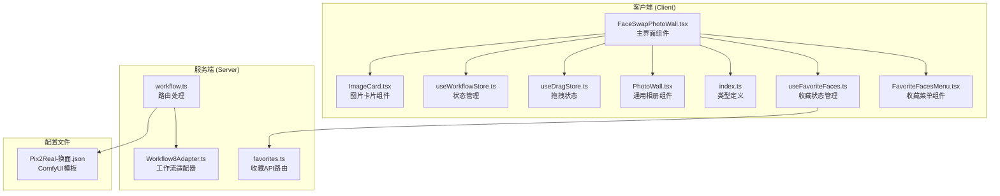
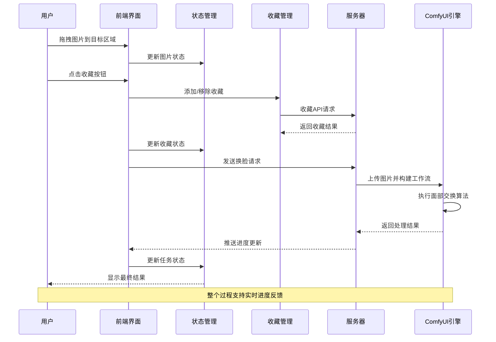
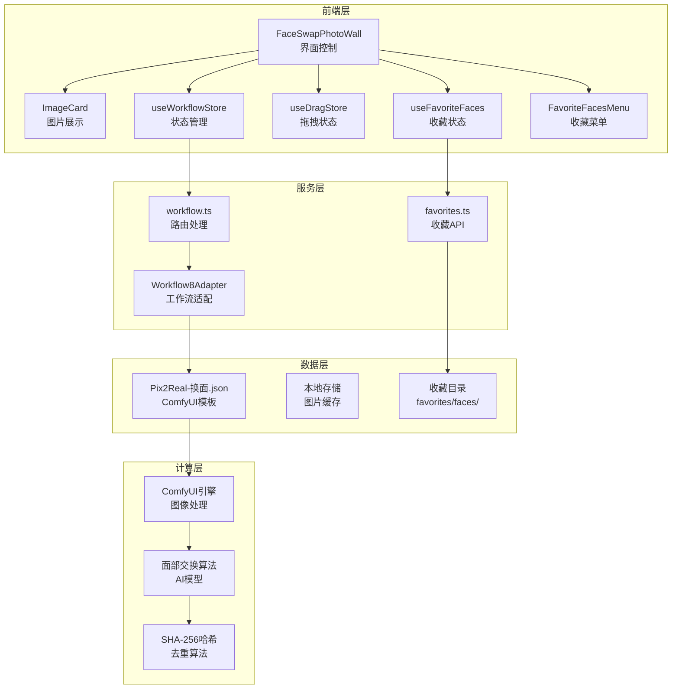
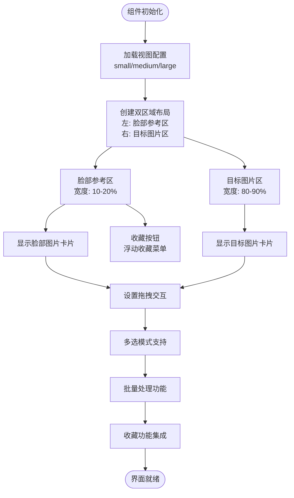
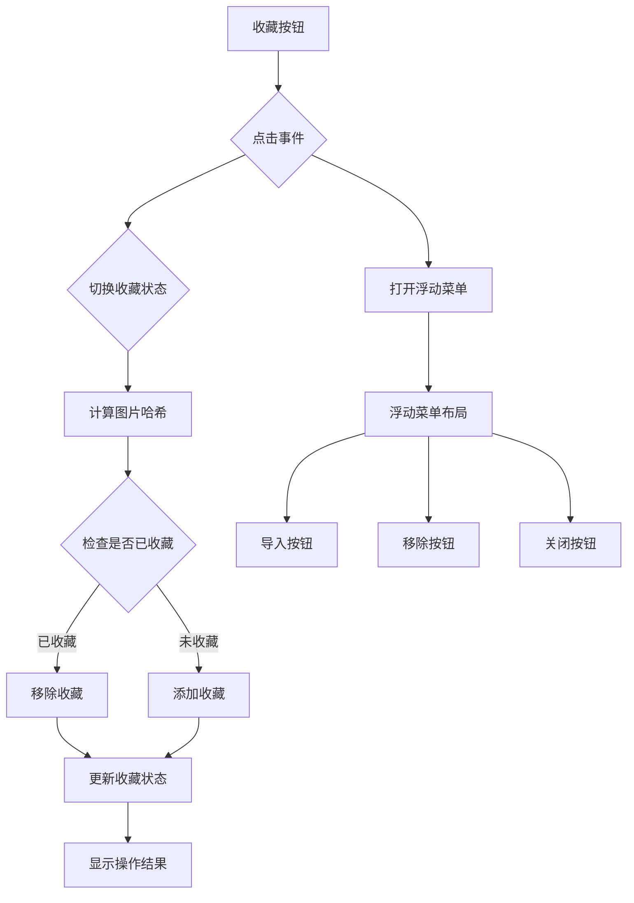
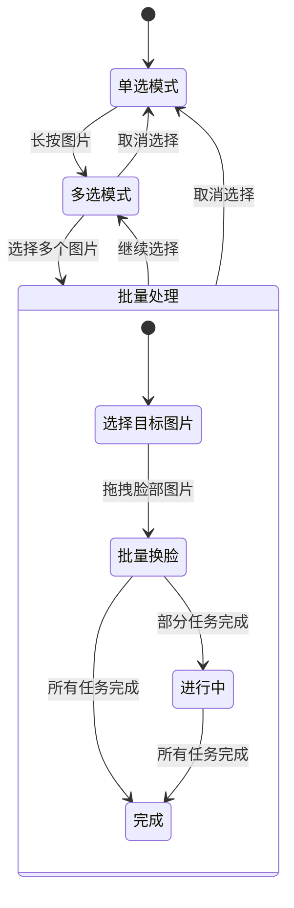
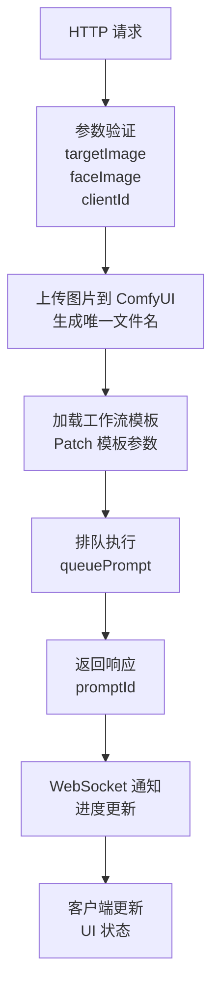
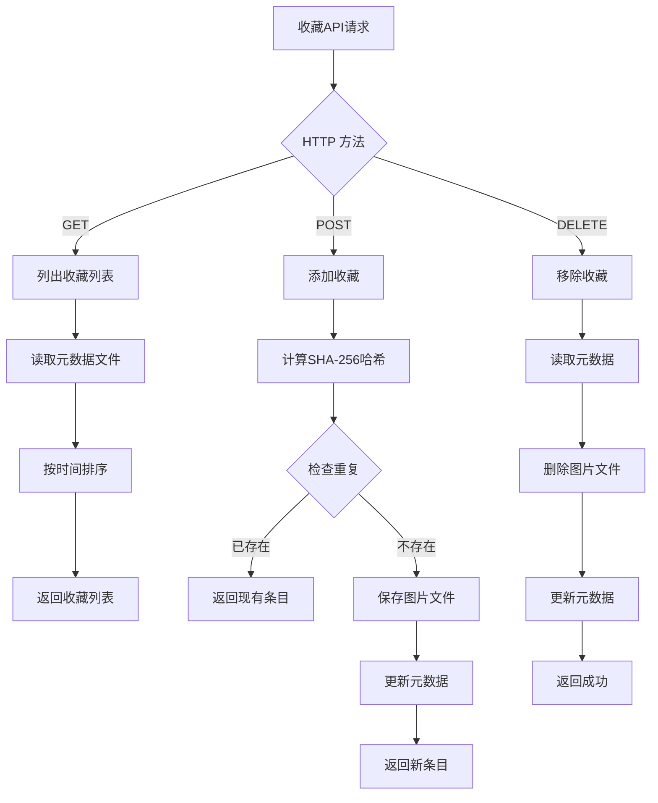
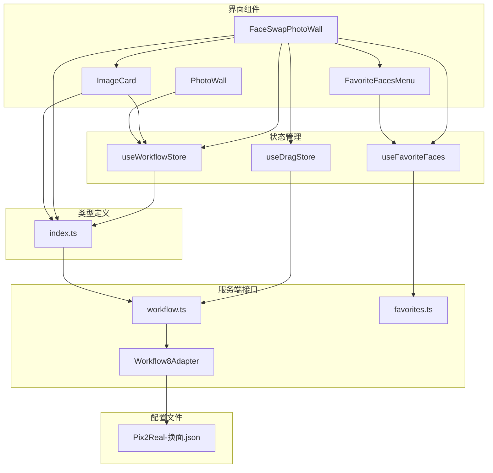

# 面部交换

<cite>
**本文档引用的文件**
- [FaceSwapPhotoWall.tsx](file://client/src/components/FaceSwapPhotoWall.tsx)
- [ImageCard.tsx](file://client/src/components/ImageCard.tsx)
- [useWorkflowStore.ts](file://client/src/hooks/useWorkflowStore.ts)
- [useDragStore.ts](file://client/src/hooks/useDragStore.ts)
- [useFavoriteFaces.ts](file://client/src/hooks/useFavoriteFaces.ts)
- [FavoriteFacesMenu.tsx](file://client/src/components/FavoriteFacesMenu.tsx)
- [PhotoWall.tsx](file://client/src/components/PhotoWall.tsx)
- [index.ts](file://client/src/types/index.ts)
- [favorites.ts](file://server/src/routes/favorites.ts)
- [Pix2Real-换面.json](file://ComfyUI_API/Pix2Real-换面.json)
- [workflow.ts](file://server/src/routes/workflow.ts)
- [Workflow8Adapter.ts](file://server/src/adapters/Workflow8Adapter.ts)
</cite>

## 更新摘要
**变更内容**
- 新增完整的面部收藏功能集成
- 在FaceSwapPhotoWall中添加收藏按钮和浮动收藏菜单
- 实现跨会话的面部参考收藏和管理
- 新增useFavoriteFaces状态管理hook
- 新增FavoriteFacesMenu浮动菜单组件
- 新增服务器端收藏API路由

## 目录
1. [简介](#简介)
2. [项目结构](#项目结构)
3. [核心组件](#核心组件)
4. [架构概览](#架构概览)
5. [详细组件分析](#详细组件分析)
6. [依赖关系分析](#依赖关系分析)
7. [性能考虑](#性能考虑)
8. [故障排除指南](#故障排除指南)
9. [结论](#结论)

## 简介

面部交换功能是 CorineKit Pix2Real 项目中的一个核心特性，允许用户通过简单的拖拽操作将一张图片中的人脸替换到另一张图片中。该功能基于 ComfyUI 图像生成框架构建，实现了从人脸检测、特征匹配到图像融合的完整技术链路。

**更新** 新增了完整的面部收藏功能，用户可以将常用的面部参考图片收藏起来，实现跨会话的收藏管理。收藏功能支持SHA-256哈希去重、浮动菜单操作和批量导入功能。

本功能采用双区域布局设计，左侧为"脸部参考区"，右侧为目标图片区，用户可以通过直观的拖拽操作实现批量面部交换。系统支持多选模式、批量处理和实时预览功能，为用户提供高效便捷的面部交换体验。

## 项目结构

面部交换功能主要分布在以下目录结构中：

**图表来源**
- [FaceSwapPhotoWall.tsx:1-1152](file://client/src/components/FaceSwapPhotoWall.tsx#L1-L1152)
- [workflow.ts:260-459](file://server/src/routes/workflow.ts#L260-L459)

**章节来源**
- [FaceSwapPhotoWall.tsx:1-1152](file://client/src/components/FaceSwapPhotoWall.tsx#L1-L1152)
- [workflow.ts:260-459](file://server/src/routes/workflow.ts#L260-L459)

## 核心组件

### 面部交换主界面组件

FaceSwapPhotoWall 是面部交换功能的核心组件，负责实现双区域布局和拖拽交互逻辑。

**主要功能特性：**
- **双区域布局**：左侧脸部参考区，右侧目标图片区
- **拖拽操作**：支持跨区域拖拽和区域内拖拽
- **多选模式**：支持批量选择和批量处理
- **实时预览**：显示处理进度和结果
- **收藏功能**：支持面部图片收藏和管理

**章节来源**
- [FaceSwapPhotoWall.tsx:213-1152](file://client/src/components/FaceSwapPhotoWall.tsx#L213-L1152)

### 图片卡片组件

ImageCard 组件提供了标准的图片展示和交互功能，为面部交换提供了基础的图片处理能力。

**核心功能：**
- **长按选择**：支持长按进入多选模式
- **拖拽支持**：可拖拽到其他区域
- **状态显示**：显示处理状态和进度
- **批量操作**：支持批量删除和操作

**章节来源**
- [ImageCard.tsx:42-1055](file://client/src/components/ImageCard.tsx#L42-L1055)

### 收藏状态管理系统

useFavoriteFaces 提供了完整的收藏状态管理，包括收藏列表、哈希缓存和去重逻辑。

**关键状态：**
- **收藏列表**：存储所有已收藏的面部图片信息
- **哈希缓存**：缓存图片的SHA-256哈希值用于去重
- **加载状态**：管理收藏列表的加载和刷新
- **操作状态**：跟踪收藏操作的进行状态

**章节来源**
- [useFavoriteFaces.ts:1-110](file://client/src/hooks/useFavoriteFaces.ts#L1-L110)

## 架构概览

面部交换功能采用前后端分离的架构设计，实现了完整的图像处理流水线。

**图表来源**
- [FaceSwapPhotoWall.tsx:256-282](file://client/src/components/FaceSwapPhotoWall.tsx#L256-L282)
- [workflow.ts:267-310](file://server/src/routes/workflow.ts#L267-L310)

### 技术架构

系统采用模块化的架构设计，各组件职责明确：

**图表来源**
- [Pix2Real-换面.json:1-369](file://ComfyUI_API/Pix2Real-换面.json#L1-L369)
- [Workflow8Adapter.ts:1-14](file://server/src/adapters/Workflow8Adapter.ts#L1-L14)

## 详细组件分析

### 面部交换界面组件

FaceSwapPhotoWall 实现了完整的双区域布局和交互逻辑。

#### 布局设计

**图表来源**
- [FaceSwapPhotoWall.tsx:14-19](file://client/src/components/FaceSwapPhotoWall.tsx#L14-L19)
- [FaceSwapPhotoWall.tsx:538-708](file://client/src/components/FaceSwapPhotoWall.tsx#L538-L708)

#### 拖拽交互机制

系统实现了复杂的拖拽交互逻辑，支持多种拖拽场景：

**拖拽类型：**
- **外部文件拖拽**：从系统拖拽图片到指定区域
- **跨区域拖拽**：将脸部图片拖拽到目标图片上
- **区域内拖拽**：在同区域内移动图片位置
- **长按拖拽**：长按进入多选模式进行批量操作

**拖拽状态管理：**
- 使用计数器避免重复触发 dragenter/dragleave 事件
- 支持拖拽高亮效果和视觉反馈
- 实现拖拽区域的智能判断

**章节来源**
- [FaceSwapPhotoWall.tsx:381-394](file://client/src/components/FaceSwapPhotoWall.tsx#L381-L394)
- [FaceSwapPhotoWall.tsx:421-471](file://client/src/components/FaceSwapPhotoWall.tsx#L421-L471)

### 收藏功能集成

**更新** 新增了完整的收藏功能，实现了跨会话的面部参考管理。

#### 收藏按钮设计

**图表来源**
- [FaceSwapPhotoWall.tsx:737-761](file://client/src/components/FaceSwapPhotoWall.tsx#L737-L761)
- [FaceSwapPhotoWall.tsx:264-275](file://client/src/components/FaceSwapPhotoWall.tsx#L264-L275)

#### 收藏状态管理

系统实现了智能的收藏状态管理：

**哈希去重机制：**
- 使用 SHA-256 算法计算图片哈希值
- 自动检测重复收藏的图片
- 缓存哈希值避免重复计算

**收藏菜单功能：**
- 浮动菜单支持键盘和鼠标操作
- 点击外部区域自动关闭
- 支持 ESC 键快速关闭

**批量导入功能：**
- 支持从收藏菜单批量导入到脸部参考区
- 自动去重避免重复导入
- 保持收藏状态同步

**章节来源**
- [FaceSwapPhotoWall.tsx:318-351](file://client/src/components/FaceSwapPhotoWall.tsx#L318-L351)
- [useFavoriteFaces.ts:27-33](file://client/src/hooks/useFavoriteFaces.ts#L27-L33)

### 多选和批量处理

系统支持高效的多选和批量处理功能：

**批量处理特点：**
- 支持多张目标图片同时处理
- 自动跳过正在处理的图片
- 实时显示处理进度
- 错误处理和重试机制

**章节来源**
- [FaceSwapPhotoWall.tsx:446-471](file://client/src/components/FaceSwapPhotoWall.tsx#L446-L471)
- [useWorkflowStore.ts:117-129](file://client/src/hooks/useWorkflowStore.ts#L117-L129)

### ComfyUI 工作流集成

面部交换功能基于 ComfyUI 的工作流系统实现：

#### 工作流模板

系统使用专门的面部交换工作流模板：

**关键节点：**
- **LoadImage (目标图片)**: 加载目标图片
- **LoadImage (脸部图片)**: 加载脸部参考图片  
- **VAEEncode**: VAE 编码处理
- **ReferenceLatent**: 参考潜变量生成
- **VAEDecode**: VAE 解码输出
- **SaveImage**: 保存处理结果

**提示词配置：**
工作流使用特定的提示词来指导面部交换过程，确保面部特征的准确替换和自然融合。

**章节来源**
- [Pix2Real-换面.json:1-369](file://ComfyUI_API/Pix2Real-换面.json#L1-L369)
- [workflow.ts:292-296](file://server/src/routes/workflow.ts#L292-L296)

### 服务器端处理

服务器端实现了完整的请求处理和 ComfyUI 集成功能：

**图表来源**
- [workflow.ts:267-310](file://server/src/routes/workflow.ts#L267-L310)

**服务器端特性：**
- **文件上传处理**：支持 Multer 文件上传中间件
- **工作流执行**：动态构建和执行 ComfyUI 工作流
- **进度监控**：通过 WebSocket 实时推送处理进度
- **错误处理**：完善的异常捕获和错误响应

**章节来源**
- [workflow.ts:263-310](file://server/src/routes/workflow.ts#L263-L310)
- [Workflow8Adapter.ts:1-14](file://server/src/adapters/Workflow8Adapter.ts#L1-L14)

### 收藏服务器端处理

**更新** 新增了完整的收藏服务器端处理功能。

#### 收藏API设计

**图表来源**
- [favorites.ts:52-89](file://server/src/routes/favorites.ts#L52-L89)

**服务器端特性：**
- **哈希去重**：使用 SHA-256 算法确保收藏唯一性
- **文件存储**：图片文件存储在 favorites/faces/ 目录
- **元数据管理**：JSON 格式存储收藏信息
- **自动扩展名**：根据原文件名自动确定扩展名

**章节来源**
- [favorites.ts:1-114](file://server/src/routes/favorites.ts#L1-L114)

## 依赖关系分析

### 组件间依赖关系

**图表来源**
- [FaceSwapPhotoWall.tsx:1-1152](file://client/src/components/FaceSwapPhotoWall.tsx#L1-L1152)
- [useWorkflowStore.ts:1-645](file://client/src/hooks/useWorkflowStore.ts#L1-L645)

### 数据流分析

系统实现了清晰的数据流向：

**输入数据流：**
- 用户上传的图片文件
- 拖拽操作产生的状态变化
- 多选模式下的批量操作
- 收藏操作产生的状态变化

**处理数据流：**
- 图片预处理和格式转换
- ComfyUI 工作流执行
- 收藏哈希计算和去重
- 处理结果的存储和缓存

**输出数据流：**
- 处理进度的实时反馈
- 最终结果图片的展示
- 收藏状态的更新
- 错误信息的用户提示

**章节来源**
- [index.ts:1-58](file://client/src/types/index.ts#L1-L58)
- [useWorkflowStore.ts:377-475](file://client/src/hooks/useWorkflowStore.ts#L377-L475)

## 性能考虑

### 前端性能优化

**虚拟滚动优化：**
- 使用 IntersectionObserver 实现懒加载
- 动态计算卡片高度避免布局抖动
- 智能的可视区域检测减少渲染负担

**状态管理优化：**
- 使用 Zustand 提供高性能的状态管理
- 组件级状态隔离避免不必要的重渲染
- 稳定的回调函数引用减少副作用

**拖拽性能：**
- 使用 OffscreenCanvas 进行图像处理
- 优化拖拽事件监听避免性能瓶颈
- 智能的拖拽状态管理

**收藏性能优化：**
- 惰性计算图片哈希值避免重复计算
- 哈希值缓存减少重复计算开销
- 浮动菜单按需加载避免初始渲染压力

### 服务器端性能优化

**并发处理：**
- 支持多图片并发处理
- 智能的任务队列管理
- 内存和资源的有效利用

**缓存策略：**
- 图片文件的临时存储
- 处理结果的缓存管理
- 重复任务的去重处理

**收藏性能优化：**
- 元数据文件的内存缓存
- 哈希计算的异步处理
- 文件系统操作的批量优化

## 故障排除指南

### 常见问题及解决方案

**面部交换失败：**
- 检查图片格式是否为支持的格式
- 确认目标图片中包含清晰的人脸
- 验证网络连接和服务器状态

**拖拽功能异常：**
- 确认浏览器支持 HTML5 拖拽 API
- 检查是否有其他元素阻止拖拽事件
- 刷新页面重新建立连接

**处理进度不更新：**
- 检查 WebSocket 连接状态
- 确认服务器端工作流正常运行
- 查看浏览器开发者工具的网络请求

**收藏功能异常：**
- 检查收藏目录权限和空间
- 确认哈希计算是否正常
- 验证元数据文件格式

**性能问题：**
- 减少同时处理的图片数量
- 关闭不必要的浏览器标签页
- 清理浏览器缓存和 Cookie

### 技术限制说明

**硬件要求：**
- 需要足够的内存来处理高分辨率图片
- GPU 加速可显著提升处理速度
- 稳定的网络连接保证实时通信

**软件兼容性：**
- 支持主流现代浏览器
- 需要启用 JavaScript 和 WebSocket
- 推荐使用最新版本的浏览器

**处理限制：**
- 图片大小建议不超过 4MB
- 支持的图片格式：JPEG、PNG、WEBP
- 单次批量处理建议不超过 10 张图片

**收藏限制：**
- 收藏数量无限制但受磁盘空间约束
- 哈希计算可能影响大文件处理性能
- 元数据文件过大可能影响加载速度

## 结论

面部交换功能通过精心设计的界面和强大的技术架构，为用户提供了直观、高效的面部交换体验。系统采用模块化的设计理念，实现了良好的可扩展性和维护性。

**主要优势：**
- 直观的拖拽操作简化了复杂的图像处理流程
- 双区域布局提高了工作效率
- 实时进度反馈增强了用户体验
- 批量处理功能支持大规模应用
- **新增** 收藏功能实现了跨会话的面部参考管理

**技术亮点：**
- 基于 ComfyUI 的专业图像处理框架
- 完整的前后端分离架构设计
- 高效的状态管理和性能优化
- 灵活的工作流配置和扩展能力
- **新增** 智能的收藏状态管理和去重机制

**收藏功能特色：**
- SHA-256 哈希去重确保收藏唯一性
- 浮动菜单提供便捷的操作入口
- 跨会话持久化存储收藏内容
- 批量导入功能提升使用效率

该功能为后续的图像处理应用奠定了坚实的技术基础，其设计理念和实现方式可以作为类似功能开发的参考模板。新增的收藏功能进一步提升了用户体验，使用户能够更好地管理和复用常用的面部参考资源。