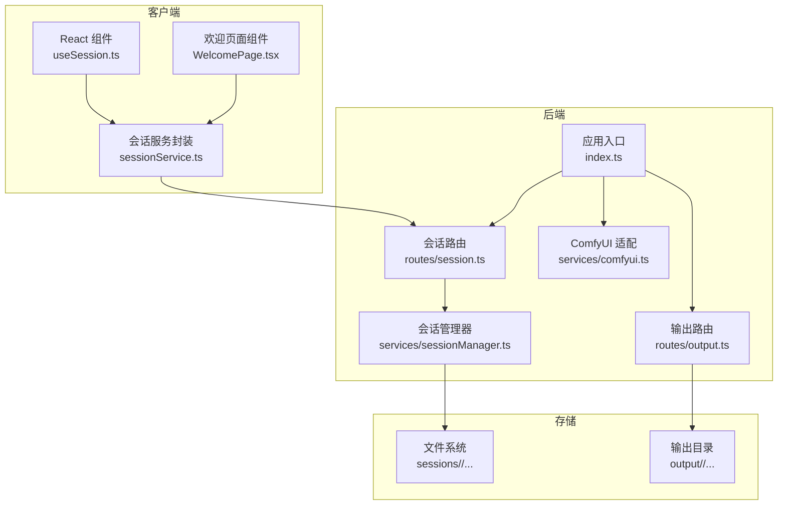
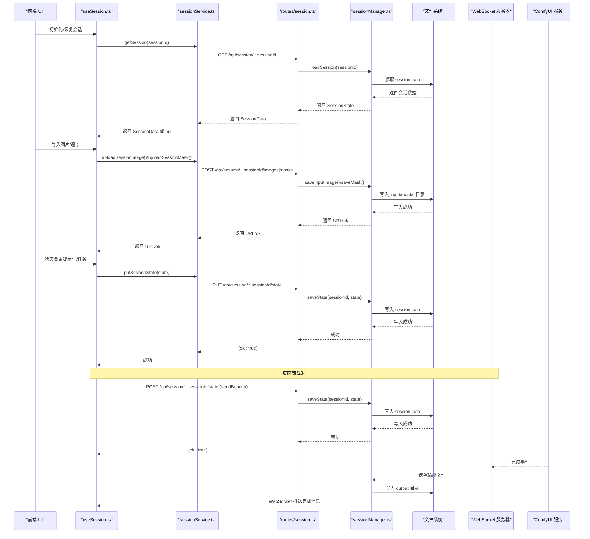
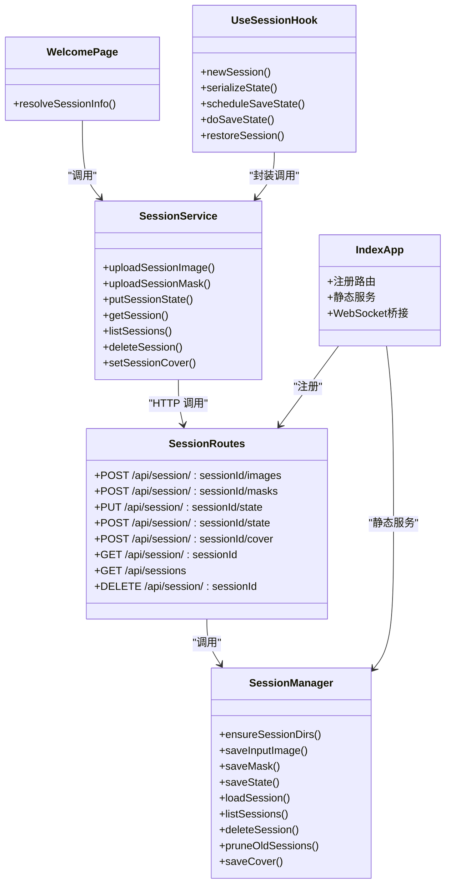

# 会话 API

<cite>
**本文引用的文件**
- [server/src/routes/session.ts](file://server/src/routes/session.ts)
- [server/src/services/sessionManager.ts](file://server/src/services/sessionManager.ts)
- [client/src/services/sessionService.ts](file://client/src/services/sessionService.ts)
- [client/src/components/WelcomePage.tsx](file://client/src/components/WelcomePage.tsx)
- [server/src/index.ts](file://server/src/index.ts)
- [server/src/routes/output.ts](file://server/src/routes/output.ts)
- [server/src/services/comfyui.ts](file://server/src/services/comfyui.ts)
- [client/src/hooks/useSession.ts](file://client/src/hooks/useSession.ts)
- [server/src/types/index.ts](file://server/src/types/index.ts)
- [client/src/types/index.ts](file://client/src/types/index.ts)
- [TODO-session-persistence.md](file://TODO-session-persistence.md)
- [README.md](file://README.md)
</cite>

## 目录
1. [简介](#简介)
2. [项目结构](#项目结构)
3. [核心组件](#核心组件)
4. [架构总览](#架构总览)
5. [详细组件分析](#详细组件分析)
6. [依赖关系分析](#依赖关系分析)
7. [性能考量](#性能考量)
8. [故障排查指南](#故障排查指南)
9. [结论](#结论)
10. [附录](#附录)

## 简介
本文件面向 CorineKit Pix2Real 的会话 API 系统，提供全面的技术文档，涵盖：
- 会话管理的 RESTful API 设计与实现：创建、列表获取、删除等核心接口
- 会话状态管理的 API 流程：状态查询、数据更新、文件上传/下载的完整工作流
- 客户端会话服务的实现机制：请求封装、响应处理、错误重试策略
- 使用示例：完整的请求/响应格式、参数校验、状态码说明
- 自动化清理与维护：定期清理策略、内存管理、资源回收
- API 集成最佳实践与性能优化建议

## 项目结构
会话 API 位于后端 Express 服务与前端 React Hook 之间，采用"路由层 → 服务层 → 文件系统"的分层设计，并通过静态文件服务对外暴露会话文件。

图表来源
- [server/src/routes/session.ts:1-114](file://server/src/routes/session.ts#L1-L114)
- [server/src/services/sessionManager.ts:1-213](file://server/src/services/sessionManager.ts#L1-L213)
- [server/src/index.ts:1-228](file://server/src/index.ts#L1-L228)
- [server/src/routes/output.ts:1-134](file://server/src/routes/output.ts#L1-L134)
- [server/src/services/comfyui.ts:1-285](file://server/src/services/comfyui.ts#L1-L285)
- [client/src/components/WelcomePage.tsx:35-84](file://client/src/components/WelcomePage.tsx#L35-L84)

章节来源
- [README.md:41-62](file://README.md#L41-L62)
- [TODO-session-persistence.md:1-120](file://TODO-session-persistence.md#L1-L120)

## 核心组件
- 会话路由层：提供会话创建、状态保存、文件上传、会话查询与删除等 RESTful 接口
- 会话管理器：负责目录结构保证、文件读写、会话状态序列化与反序列化、会话列表与清理
- 客户端会话服务：封装 typed API 调用，统一错误处理与返回值解析
- 欢迎页面组件：重构后的 resolveSessionInfo 函数负责同时处理预览URL和图像计数的单一职责
- 应用入口：注册路由、启动静态文件服务、建立 WebSocket 与 ComfyUI 的桥接
- 输出路由：提供输出文件列表与下载、以及一键打开系统默认应用
- 类型定义：前后端统一的数据模型与 WebSocket 事件类型

章节来源
- [server/src/routes/session.ts:1-114](file://server/src/routes/session.ts#L1-L114)
- [server/src/services/sessionManager.ts:1-213](file://server/src/services/sessionManager.ts#L1-L213)
- [client/src/services/sessionService.ts:1-157](file://client/src/services/sessionService.ts#L1-L157)
- [client/src/components/WelcomePage.tsx:35-84](file://client/src/components/WelcomePage.tsx#L35-L84)
- [server/src/index.ts:1-228](file://server/src/index.ts#L1-L228)
- [server/src/routes/output.ts:1-134](file://server/src/routes/output.ts#L1-L134)
- [server/src/types/index.ts:1-52](file://server/src/types/index.ts#L1-L52)
- [client/src/types/index.ts:1-58](file://client/src/types/index.ts#L1-L58)

## 架构总览
会话 API 的端到端流程如下：
- 客户端在挂载时根据本地存储决定是否新建或恢复会话
- 新导入的图片与绘制的遮罩实时上传至会话目录
- 用户操作触发状态变更，通过防抖保存会话 JSON
- 页面卸载时通过 sendBeacon 发送最终状态，确保不丢失
- ComfyUI 完成任务后，后端将输出文件下载到会话输出目录并通过 WebSocket 推送进度与完成事件

图表来源
- [client/src/hooks/useSession.ts:1-422](file://client/src/hooks/useSession.ts#L1-L422)
- [client/src/services/sessionService.ts:1-157](file://client/src/services/sessionService.ts#L1-L157)
- [server/src/routes/session.ts:1-114](file://server/src/routes/session.ts#L1-L114)
- [server/src/services/sessionManager.ts:1-213](file://server/src/services/sessionManager.ts#L1-L213)
- [server/src/index.ts:1-228](file://server/src/index.ts#L1-L228)

## 详细组件分析

### 会话路由层（routes/session.ts）
- 负责接收并校验请求参数，调用会话管理器执行具体操作
- 支持多文件上传（multipart），使用内存存储以简化部署
- 提供会话状态保存的两种触发方式：PUT（常规保存）与 POST（页面卸载时 sendBeacon）
- 新增会话封面设置接口：POST /api/session/:sessionId/cover

关键接口
- POST /api/session/:sessionId/images
  - 请求体字段：image(File)、tabId(number)、imageId(string)
  - 返回：url(string)
- POST /api/session/:sessionId/masks
  - 请求体字段：mask(File PNG)、tabId(number)、maskKey(string)
  - 返回：{ok:true}
- PUT /api/session/:sessionId/state
  - 请求体：activeTab(number)、tabData(Record<number, any>)
  - 返回：{ok:true}
- POST /api/session/:sessionId/state
  - 同上，用于 sendBeacon 场景
- POST /api/session/:sessionId/cover
  - 请求体：{ sourceUrl: string }
  - 返回：{ coverUrl: string }
- GET /api/session/:sessionId
  - 返回：SessionData
- GET /api/sessions
  - 返回：SessionMeta[]
- DELETE /api/session/:sessionId
  - 返回：{ok:true}

章节来源
- [server/src/routes/session.ts:1-114](file://server/src/routes/session.ts#L1-L114)

### 会话管理器（services/sessionManager.ts）
- 目录结构
  - sessions/<sessionId>/tab-0..5/input、masks、output、cover(.jpg|.png|.webp)
  - 确保目录存在，避免运行时异常
- 文件 I/O
  - saveInputImage：将输入图像写入 input 目录，返回可访问的 URL
  - saveMask：将遮罩 PNG 写入 masks 目录，maskKey 中的冒号替换为下划线以兼容 Windows
  - saveOutputFile：将 ComfyUI 输出写入会话 output 目录
  - saveCover：复制指定源文件作为会话封面，标记手动封面状态
- 状态管理
  - saveState/loadSession：序列化/反序列化 SessionState，包含 createdAt/updatedAt/manualCover/coverExt
  - listSessions：列出所有会话并按 updatedAt 倒序排序，包含封面信息
  - deleteSession：删除指定会话目录
  - pruneOldSessions：仅保留最近 N 个会话

数据模型
- SessionState：sessionId、createdAt、updatedAt、activeTab、tabData、manualCover、coverExt
- SerializedTabData：images、prompts、tasks、selectedOutputIndex、backPoseToggles 等
- SerializedImage、SerializedTask：用于序列化的子结构
- SessionMeta：包含封面相关字段的会话元数据

章节来源
- [server/src/services/sessionManager.ts:1-213](file://server/src/services/sessionManager.ts#L1-L213)

### 客户端会话服务（client/src/services/sessionService.ts）
- typed API 封装：uploadSessionImage、uploadSessionMask、putSessionState、getSession、listSessions、deleteSession、setSessionCover
- 错误处理：非 2xx 抛出错误，便于上层统一处理
- 与后端一致的类型定义，确保数据结构一致性

章节来源
- [client/src/services/sessionService.ts:1-157](file://client/src/services/sessionService.ts#L1-L157)

### 欢迎页面组件（client/src/components/WelcomePage.tsx）
- **重构** resolveSessionInfo 函数现在承担单一职责：同时处理预览URL和图像计数
- 预览URL优先级：
  1. 如果设置了手动封面，直接使用封面文件
  2. 否则查找第一个输出文件作为预览
  3. 最后回退到第一个输入文件
- 图像计数统计：
  - 统计所有标签页中的输入图像数量
  - 统计所有标签页中任务输出的数量
  - 返回包含预览URL和图像总数的对象

章节来源
- [client/src/components/WelcomePage.tsx:35-84](file://client/src/components/WelcomePage.tsx#L35-L84)

### 客户端会话钩子（client/src/hooks/useSession.ts）
- 会话生命周期
  - 初始化：从 localStorage 读取 sessionId，不存在则生成 UUID
  - 恢复：根据设置决定是恢复、新建还是显示欢迎页
  - 自动保存：订阅 store 变更，防抖保存；导入图片时异步上传并回填 sessionUrl
  - 卸载：beforeunload 使用 sendBeacon 触发最终保存
- 空会话清理：空会话且已保存过，会在欢迎页返回时删除服务器记录
- 遮罩保存：将 RGBA 数据转换为灰度 PNG 并上传
- 图像恢复：通过 /api/session-files 下载文件并重建 File 对象

章节来源
- [client/src/hooks/useSession.ts:1-422](file://client/src/hooks/useSession.ts#L1-L422)

### 应用入口与静态文件（server/src/index.ts）
- 注册会话路由与输出路由
- 启动时确保 sessions 与 output 目录存在
- 静态服务：/api/session-files → sessions 目录；/output → output 目录
- WebSocket：连接 ComfyUI，转发进度、完成与错误事件，并在完成后将输出文件保存到会话 output 目录

章节来源
- [server/src/index.ts:1-228](file://server/src/index.ts#L1-L228)

### 输出路由与文件打开（server/src/routes/output.ts）
- 列出工作流输出文件：GET /api/output/:workflowId
- 下载单个文件：GET /api/output/:workflowId/:filename
- 打开文件：POST /api/output/open-file，支持 /api/session-files、/output、/api/output 三种 URL

章节来源
- [server/src/routes/output.ts:1-134](file://server/src/routes/output.ts#L1-L134)

### 类型定义（前后端）
- 服务端类型：WorkflowAdapter、ProgressEvent、CompleteEvent、ErrorEvent、WSEvent、OutputFile、QueueResponse、HistoryEntry
- 客户端类型：ImageItem、WorkflowInfo、TaskStatus、TaskInfo、WSMessage 等

章节来源
- [server/src/types/index.ts:1-52](file://server/src/types/index.ts#L1-L52)
- [client/src/types/index.ts:1-58](file://client/src/types/index.ts#L1-L58)

## 依赖关系分析

图表来源
- [server/src/routes/session.ts:1-114](file://server/src/routes/session.ts#L1-L114)
- [server/src/services/sessionManager.ts:1-213](file://server/src/services/sessionManager.ts#L1-L213)
- [client/src/services/sessionService.ts:1-157](file://client/src/services/sessionService.ts#L1-L157)
- [client/src/components/WelcomePage.tsx:35-84](file://client/src/components/WelcomePage.tsx#L35-L84)
- [client/src/hooks/useSession.ts:1-422](file://client/src/hooks/useSession.ts#L1-L422)
- [server/src/index.ts:1-228](file://server/src/index.ts#L1-L228)

## 性能考量
- 上传文件使用内存存储（multer.memoryStorage），适合小规模并发；若需要高并发，建议改为临时磁盘存储并配合流式处理
- 会话状态保存采用防抖（500ms）减少频繁写入，页面卸载时使用 sendBeacon 确保最终落盘
- 目录结构固定为 0..5 个标签页，避免动态扩展带来的 IO 开销
- 输出文件直接保存到会话 output 目录，避免重复拷贝，降低磁盘占用
- WebSocket 事件缓冲与重放机制，减少客户端注册延迟导致的消息丢失
- **新增** 欢迎页面的 resolveSessionInfo 函数采用 Promise.all 并行处理多个会话的信息解析，提升列表加载性能

[本节为通用性能建议，无需特定文件来源]

## 故障排查指南
常见问题与定位方法
- 400 缺少必填字段
  - 检查 multipart 字段：image/tabId/imageId 或 mask/tabId/maskKey 是否齐全
  - 检查封面设置请求体：sourceUrl 是否存在
- 404 会话不存在
  - 确认 sessionId 是否正确，或先调用列表接口确认存在
- 上传失败
  - 检查文件大小限制与类型；确认 sessions 目录权限
- 状态保存失败
  - 检查请求体结构是否符合 SessionState；确认磁盘空间与权限
- 输出无法打开
  - 检查 /api/output/open-file 的 URL 是否正确，路径是否存在
- **新增** 封面设置失败
  - 检查 sourceUrl 格式是否正确（必须以 /api/session-files/ 开头）
  - 确认源文件是否存在且可访问

章节来源
- [server/src/routes/session.ts:25-28](file://server/src/routes/session.ts#L25-L28)
- [server/src/routes/session.ts:42-44](file://server/src/routes/session.ts#L42-L44)
- [server/src/routes/session.ts:93-96](file://server/src/routes/session.ts#L93-L96)
- [server/src/services/sessionManager.ts:91-110](file://server/src/services/sessionManager.ts#L91-L110)
- [server/src/routes/output.ts:76-104](file://server/src/routes/output.ts#L76-L104)

## 结论
会话 API 通过清晰的分层设计与严格的类型约束，实现了可靠的会话创建、状态持久化、文件上传下载与自动化清理。客户端采用事件驱动与防抖策略，确保在复杂交互场景下的稳定性与性能。结合 WebSocket 的实时进度推送，整体用户体验流畅可靠。**重构后的欢迎页面 resolveSessionInfo 函数提升了会话列表加载性能，同时保持了预览URL和图像计数的准确计算。**

[本节为总结性内容，无需特定文件来源]

## 附录

### API 使用示例与规范

- 创建会话
  - 客户端：无显式创建接口，首次保存状态即创建会话目录
  - 后端：PUT /api/session/:sessionId/state（首次保存）
- 列出会话
  - GET /api/sessions
  - 返回：SessionMeta[]（按 updatedAt 倒序）
- 获取会话详情
  - GET /api/session/:sessionId
  - 返回：SessionData（含 activeTab、tabData、images、tasks 等）
- 保存会话状态
  - PUT /api/session/:sessionId/state
  - 请求体：{ activeTab:number, tabData:Record<number,any> }
  - 返回：{ ok:true }
  - 备注：页面卸载时可用 POST + sendBeacon 触发
- 设置会话封面
  - POST /api/session/:sessionId/cover
  - 请求体：{ sourceUrl: string }
  - 返回：{ coverUrl: string }
  - 备注：sourceUrl 必须是 /api/session-files/ 开头的有效会话文件路径
- 上传输入图像
  - POST /api/session/:sessionId/images
  - 表单字段：image(File)、tabId(number)、imageId(string)
  - 返回：{ url:string }
- 上传遮罩
  - POST /api/session/:sessionId/masks
  - 表单字段：mask(File PNG)、tabId(number)、maskKey(string)
  - 返回：{ ok:true }
- 删除会话
  - DELETE /api/session/:sessionId
  - 返回：{ ok:true }

章节来源
- [server/src/routes/session.ts:18-113](file://server/src/routes/session.ts#L18-L113)
- [client/src/services/sessionService.ts:69-156](file://client/src/services/sessionService.ts#L69-L156)

### 会话清理与维护
- 自动清理
  - pruneOldSessions(keep=5)：仅保留最近 5 个会话
- 手动清理
  - DELETE /api/session/:sessionId
- 空会话清理
  - 客户端在欢迎页返回时，若会话为空且已保存过，则删除服务器记录

章节来源
- [server/src/services/sessionManager.ts:206-212](file://server/src/services/sessionManager.ts#L206-L212)
- [client/src/hooks/useSession.ts:389-395](file://client/src/hooks/useSession.ts#L389-L395)

### 客户端实现要点
- 请求封装：统一的 typed API 函数，集中错误处理
- 响应处理：解析 JSON 并抛出错误，便于上层捕获
- 重试策略：当前未内置自动重试，建议在业务层根据场景增加指数退避重试
- 防抖保存：500ms 防抖，避免频繁写入
- 卸载保存：beforeunload 使用 sendBeacon，确保最终落盘
- **新增** 欢迎页面优化：resolveSessionInfo 函数重构为单一职责，同时处理预览URL和图像计数，提升列表加载性能

章节来源
- [client/src/services/sessionService.ts:69-156](file://client/src/services/sessionService.ts#L69-L156)
- [client/src/hooks/useSession.ts:177-181](file://client/src/hooks/useSession.ts#L177-L181)
- [client/src/hooks/useSession.ts:397-418](file://client/src/hooks/useSession.ts#L397-L418)
- [client/src/components/WelcomePage.tsx:35-84](file://client/src/components/WelcomePage.tsx#L35-L84)

### 最佳实践与性能优化建议
- 上传优化
  - 大文件建议使用分片上传或临时磁盘存储，避免内存压力
  - 前端可添加上传进度条与取消能力
- 状态保存
  - 对于高频变更（如滑块），建议合并变更后再触发保存
  - 在批量操作期间禁用自动保存，操作结束后一次性保存
- 清理策略
  - 定期清理旧会话（如每日凌晨），保留最近 N 个
  - 监控 sessions 目录大小，超过阈值时触发清理
- 错误处理
  - 区分网络错误与业务错误，对网络错误进行重试
  - 对于不可恢复的错误，引导用户重试或联系支持
- WebSocket
  - 客户端断线重连时，发送注册消息以重放缓冲事件
  - 服务端对缓冲事件进行去重与幂等处理
- **新增** 欢迎页面优化
  - 利用 Promise.all 并行处理多个会话信息解析
  - 合理的预览URL选择策略，提升用户体验
  - 准确的图像计数统计，帮助用户快速了解会话内容

[本节为通用最佳实践建议，无需特定文件来源]