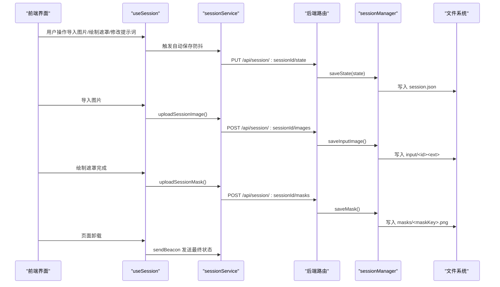
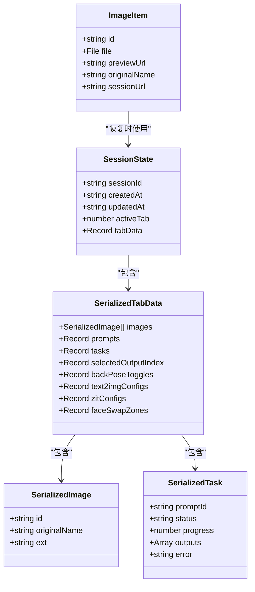
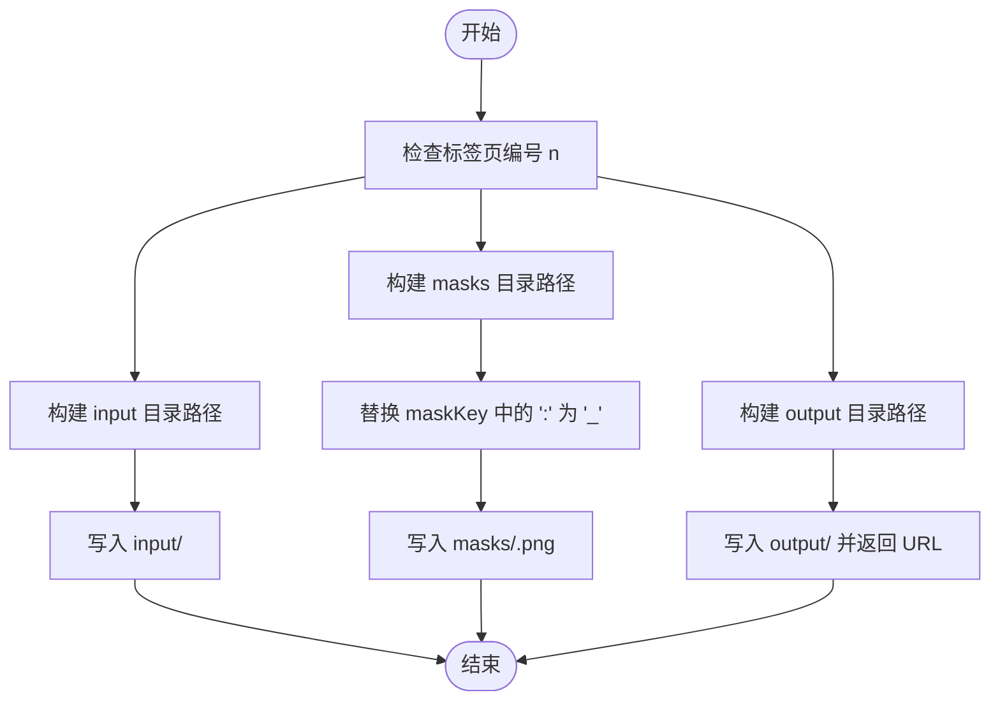
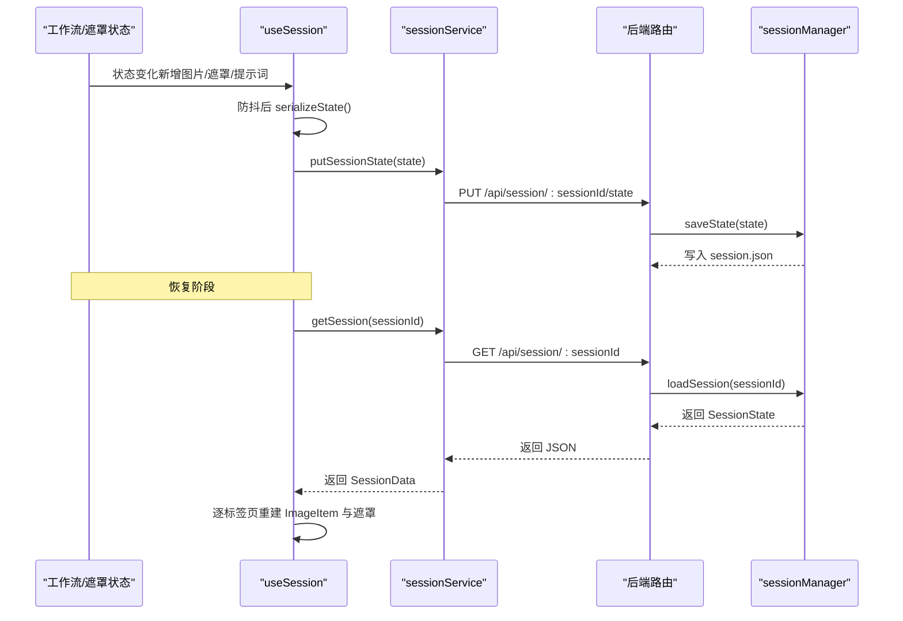
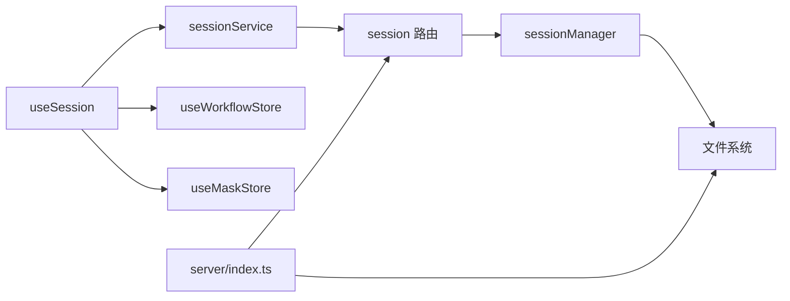

# 会话持久化

<cite>
**本文引用的文件**
- [client/src/services/sessionService.ts](file://client/src/services/sessionService.ts)
- [server/src/services/sessionManager.ts](file://server/src/services/sessionManager.ts)
- [server/src/routes/session.ts](file://server/src/routes/session.ts)
- [client/src/hooks/useSession.ts](file://client/src/hooks/useSession.ts)
- [client/src/hooks/useWorkflowStore.ts](file://client/src/hooks/useWorkflowStore.ts)
- [client/src/hooks/useMaskStore.ts](file://client/src/hooks/useMaskStore.ts)
- [client/src/types/index.ts](file://client/src/types/index.ts)
- [server/src/index.ts](file://server/src/index.ts)
- [sessions/187f40a5-66a0-4b2f-95fb-d6c9b6baeba6/session.json](file://sessions/187f40a5-66a0-4b2f-95fb-d6c9b6baeba6/session.json)
- [TODO-session-persistence.md](file://TODO-session-persistence.md)
</cite>

## 目录
1. [简介](#简介)
2. [项目结构](#项目结构)
3. [核心组件](#核心组件)
4. [架构总览](#架构总览)
5. [详细组件分析](#详细组件分析)
6. [依赖关系分析](#依赖关系分析)
7. [性能考量](#性能考量)
8. [故障排除指南](#故障排除指南)
9. [结论](#结论)

## 简介
本文件针对 CorineKit Pix2Real 的会话持久化系统进行深入技术文档化，重点覆盖以下方面：
- 会话数据的存储结构设计：SessionState 接口与 SerializedTabData 的数据模型
- per-tab 图像隔离的实现原理：每个标签页独立的 input/masks/output 目录结构、文件命名规则与路径生成策略
- 数据序列化与反序列化流程：JSON 文件格式、字段映射与版本兼容性处理
- 文件 I/O 最佳实践：错误处理、性能优化与磁盘空间管理
- 具体代码示例与故障排除指南

## 项目结构
会话持久化系统由前端与后端协同实现，采用“状态 JSON + 文件系统”的混合存储方案：
- 前端负责状态序列化、文件上传、自动保存与恢复
- 后端负责目录管理、文件写入、静态资源服务与会话列表管理
- 输出文件不复制到会话目录，仅记录可访问 URL

```mermaid
graph TB
subgraph "前端"
A["useSession 钩子<br/>自动保存/恢复"]
B["sessionService 服务<br/>API 封装"]
C["useWorkflowStore<br/>工作流状态"]
D["useMaskStore<br/>遮罩状态"]
end
subgraph "后端"
E["Express 路由<br/>session 路由"]
F["sessionManager 服务<br/>文件 I/O 与状态管理"]
G["静态文件服务<br/>/api/session-files"]
end
subgraph "文件系统"
H["sessions/<sessionId>/<tab-n>/<input|masks|output>"]
end
A --> B
B --> E
E --> F
F --> H
C --> A
D --> A
G --> H
```

图表来源
- [server/src/routes/session.ts:1-95](file://server/src/routes/session.ts#L1-L95)
- [server/src/services/sessionManager.ts:1-164](file://server/src/services/sessionManager.ts#L1-L164)
- [client/src/services/sessionService.ts:1-134](file://client/src/services/sessionService.ts#L1-L134)
- [client/src/hooks/useSession.ts:1-422](file://client/src/hooks/useSession.ts#L1-L422)
- [server/src/index.ts:58-61](file://server/src/index.ts#L58-L61)

章节来源
- [TODO-session-persistence.md:13-27](file://TODO-session-persistence.md#L13-L27)
- [server/src/index.ts:37-40](file://server/src/index.ts#L37-L40)

## 核心组件
- SessionState 与 SerializedTabData：定义会话的完整状态模型，包含活动标签页、各标签页的图像、提示词、任务、选中输出索引、开关状态以及可选的工作流配置等
- sessionService：提供 typed API 封装，包括上传输入图、上传遮罩、保存/加载/删除会话状态
- sessionManager：后端文件 I/O 与状态管理，负责目录创建、文件写入、会话 JSON 读写、会话列表与清理
- useSession：前端会话生命周期管理，包含自动保存、恢复、空会话清理、beforeunload 刷新等
- useWorkflowStore/useMaskStore：状态容器，配合 useSession 完成序列化与恢复

章节来源
- [client/src/services/sessionService.ts:30-67](file://client/src/services/sessionService.ts#L30-L67)
- [server/src/services/sessionManager.ts:61-89](file://server/src/services/sessionManager.ts#L61-L89)
- [client/src/hooks/useSession.ts:138-175](file://client/src/hooks/useSession.ts#L138-L175)
- [client/src/hooks/useWorkflowStore.ts:35-88](file://client/src/hooks/useWorkflowStore.ts#L35-L88)
- [client/src/hooks/useMaskStore.ts:21-30](file://client/src/hooks/useMaskStore.ts#L21-L30)

## 架构总览
会话持久化遵循“状态 JSON + 文件系统”的双轨存储策略：
- 状态 JSON：记录非二进制数据（图像元信息、任务状态、配置等），便于快速读取与跨设备恢复
- 文件系统：存放输入图、遮罩 PNG 与输出文件，避免 JSON 过大导致性能问题

图表来源
- [client/src/hooks/useSession.ts:164-181](file://client/src/hooks/useSession.ts#L164-L181)
- [client/src/services/sessionService.ts:103-121](file://client/src/services/sessionService.ts#L103-L121)
- [server/src/routes/session.ts:18-68](file://server/src/routes/session.ts#L18-L68)
- [server/src/services/sessionManager.ts:91-110](file://server/src/services/sessionManager.ts#L91-L110)

## 详细组件分析

### 数据模型与序列化机制
- SessionState
  - 字段：sessionId、createdAt、updatedAt、activeTab、tabData
  - 作用：完整会话快照，用于保存与恢复
- SerializedTabData
  - 字段：images、prompts、tasks、selectedOutputIndex、backPoseToggles、text2imgConfigs、zitConfigs、faceSwapZones
  - 作用：序列化后的标签页数据，去除二进制对象（如 File），仅保留可持久化字段
- ImageItem
  - 字段：id、file、previewUrl、originalName、sessionUrl?
  - 作用：前端展示用的图像项；恢复后使用 sessionUrl 替代 Blob URL

图表来源
- [client/src/services/sessionService.ts:30-67](file://client/src/services/sessionService.ts#L30-L67)
- [client/src/types/index.ts:1-8](file://client/src/types/index.ts#L1-L8)

章节来源
- [client/src/services/sessionService.ts:30-67](file://client/src/services/sessionService.ts#L30-L67)
- [client/src/types/index.ts:1-8](file://client/src/types/index.ts#L1-L8)

### per-tab 图像隔离与文件系统组织
- 目录结构
  - sessions/<sessionId>/tab-<n>/input：存放输入图（扩展名来自原始文件）
  - sessions/<sessionId>/tab-<n>/masks：存放遮罩 PNG（文件名为 maskKey.replace(':', '_') + '.png'）
  - sessions/<sessionId>/tab-<n>/output：存放输出文件（由后端下载并写入）
- 文件命名规则
  - 输入图：以 imageId.ext 命名，ext 来自原始文件扩展名或默认 .png
  - 遮罩：maskKey 中的冒号替换为下划线，后缀固定为 .png
  - 输出：直接使用 ComfyUI 输出文件名
- 路径生成策略
  - 前端恢复时根据 sessionId、tabId、imageId 与 ext 生成 input 路径
  - 遮罩路径基于 maskKey 的安全名称生成
  - 输出路径通过 saveOutputFile 返回统一的 /api/session-files/<...> URL

图表来源
- [server/src/services/sessionManager.ts:20-57](file://server/src/services/sessionManager.ts#L20-L57)
- [client/src/hooks/useSession.ts:326-359](file://client/src/hooks/useSession.ts#L326-L359)

章节来源
- [server/src/services/sessionManager.ts:10-16](file://server/src/services/sessionManager.ts#L10-L16)
- [server/src/services/sessionManager.ts:20-57](file://server/src/services/sessionManager.ts#L20-L57)
- [client/src/hooks/useSession.ts:326-359](file://client/src/hooks/useSession.ts#L326-L359)

### 数据序列化与反序列化流程
- 序列化（前端）
  - 从 useWorkflowStore 与 useMaskStore 读取当前状态
  - 将 File 对象剔除，仅保留可持久化字段（如 images 的 id、originalName、ext）
  - 通过 sessionService.putSessionState 保存至后端
- 反序列化（前端）
  - 调用 getSession 获取 session.json
  - 逐标签页重建 ImageItem（通过 /api/session-files 下载文件并构造 File）
  - 逐标签页探测 masks/<maskKey>.png 并还原为遮罩像素数据
  - 恢复工作流与遮罩状态容器

图表来源
- [client/src/hooks/useSession.ts:138-175](file://client/src/hooks/useSession.ts#L138-L175)
- [client/src/services/sessionService.ts:103-121](file://client/src/services/sessionService.ts#L103-L121)
- [server/src/routes/session.ts:51-68](file://server/src/routes/session.ts#L51-L68)
- [server/src/services/sessionManager.ts:91-120](file://server/src/services/sessionManager.ts#L91-L120)

章节来源
- [client/src/hooks/useSession.ts:138-175](file://client/src/hooks/useSession.ts#L138-L175)
- [client/src/services/sessionService.ts:103-121](file://client/src/services/sessionService.ts#L103-L121)
- [server/src/services/sessionManager.ts:91-120](file://server/src/services/sessionManager.ts#L91-L120)

### 版本兼容性与迁移策略
- 当前实现未显式声明版本字段，但通过读取现有 session.json 的 createdAt 保持时间戳一致性
- 若未来引入字段变更，建议：
  - 在 SessionState 中增加 version 字段
  - 在 loadSession 时进行字段校验与默认值填充
  - 提供迁移函数将旧字段映射到新字段

章节来源
- [server/src/services/sessionManager.ts:91-110](file://server/src/services/sessionManager.ts#L91-L110)

### 文件 I/O 最佳实践
- 错误处理
  - 前端：对 fetchAsFile、fetchMaskEntry、uploadSessionImage、uploadSessionMask 设置 try/catch 并记录警告
  - 后端：对 JSON 解析、文件读写、目录创建设置异常捕获与日志
- 性能优化
  - 前端：使用防抖（500ms）减少频繁保存；仅在必要时上传文件；使用 HEAD 请求探测遮罩是否存在
  - 后端：使用 multer.memoryStorage 处理上传；确保 sessionsBase 目录存在；静态服务 sessionsBase
- 磁盘空间管理
  - 后端提供 pruneOldSessions(keep=5) 仅保留最近 N 个会话
  - 空会话检测：若会话为空且已保存过，则在欢迎页或切换时删除服务器记录

章节来源
- [client/src/hooks/useSession.ts:177-181](file://client/src/hooks/useSession.ts#L177-L181)
- [client/src/hooks/useSession.ts:398-418](file://client/src/hooks/useSession.ts#L398-L418)
- [server/src/routes/session.ts](file://server/src/routes/session.ts#L16)
- [server/src/services/sessionManager.ts:157-163](file://server/src/services/sessionManager.ts#L157-L163)

## 依赖关系分析
- 前端依赖
  - useSession 依赖 sessionService、useWorkflowStore、useMaskStore
  - useWorkflowStore 与 useMaskStore 依赖 types/index.ts 中的接口定义
- 后端依赖
  - session 路由依赖 sessionManager 与 multer
  - index.ts 注册路由并提供静态文件服务

图表来源
- [client/src/hooks/useSession.ts:8-16](file://client/src/hooks/useSession.ts#L8-L16)
- [client/src/hooks/useWorkflowStore.ts:1-4](file://client/src/hooks/useWorkflowStore.ts#L1-L4)
- [client/src/hooks/useMaskStore.ts:1-2](file://client/src/hooks/useMaskStore.ts#L1-L2)
- [server/src/routes/session.ts:1-13](file://server/src/routes/session.ts#L1-L13)
- [server/src/index.ts:54-61](file://server/src/index.ts#L54-L61)

章节来源
- [client/src/hooks/useSession.ts:8-16](file://client/src/hooks/useSession.ts#L8-L16)
- [server/src/routes/session.ts:1-13](file://server/src/routes/session.ts#L1-L13)
- [server/src/index.ts:54-61](file://server/src/index.ts#L54-L61)

## 性能考量
- 自动保存策略
  - 使用 500ms 防抖，避免频繁写入
  - 仅在状态发生有意义变化时触发保存
- 文件上传
  - 仅对新增图片触发上传，使用 Set 记录已上传的 (tab:imageId)
  - 遮罩保存在 mask 设置完成后触发，避免重复保存
- 静态服务
  - sessionsBase 通过 /api/session-files 暴露，避免将大文件写入 JSON
- 内存与并发
  - multer.memoryStorage 适合小文件；如需支持超大文件，应考虑分块上传或临时文件落盘

## 故障排除指南
- 无法恢复会话
  - 检查 session.json 是否存在且可解析
  - 确认 /api/session-files 下对应 input/masks 路径是否可用
  - 查看控制台是否有 “Could not restore image” 或 “Failed to fetch mask” 警告
- 上传失败
  - 检查 /api/session/:sessionId/images 与 /api/session/:sessionId/masks 的请求参数（image/tabId/imageId、mask/tabId/maskKey）
  - 确认 sessionsBase 目录权限与磁盘空间
- 遮罩缺失
  - 确认 maskKey 中的冒号已被替换为下划线
  - 确认 masks/<maskKey>.png 文件存在
- 空会话被删除
  - 若会话为空且已保存过，会在欢迎页或切换时被删除；可通过 newSession 创建新会话

章节来源
- [client/src/hooks/useSession.ts:309-384](file://client/src/hooks/useSession.ts#L309-L384)
- [client/src/hooks/useSession.ts:390-395](file://client/src/hooks/useSession.ts#L390-L395)
- [server/src/routes/session.ts:18-49](file://server/src/routes/session.ts#L18-L49)
- [server/src/services/sessionManager.ts:150-155](file://server/src/services/sessionManager.ts#L150-L155)

## 结论
本会话持久化系统通过“状态 JSON + 文件系统”的组合，实现了对输入图、遮罩与任务状态的可靠持久化与跨设备恢复。per-tab 隔离确保了多标签页场景下的数据清晰与可维护性；前端的自动保存与恢复机制提升了用户体验；后端的静态文件服务与清理策略保障了性能与磁盘空间。未来可在版本字段与迁移策略上进一步增强兼容性。