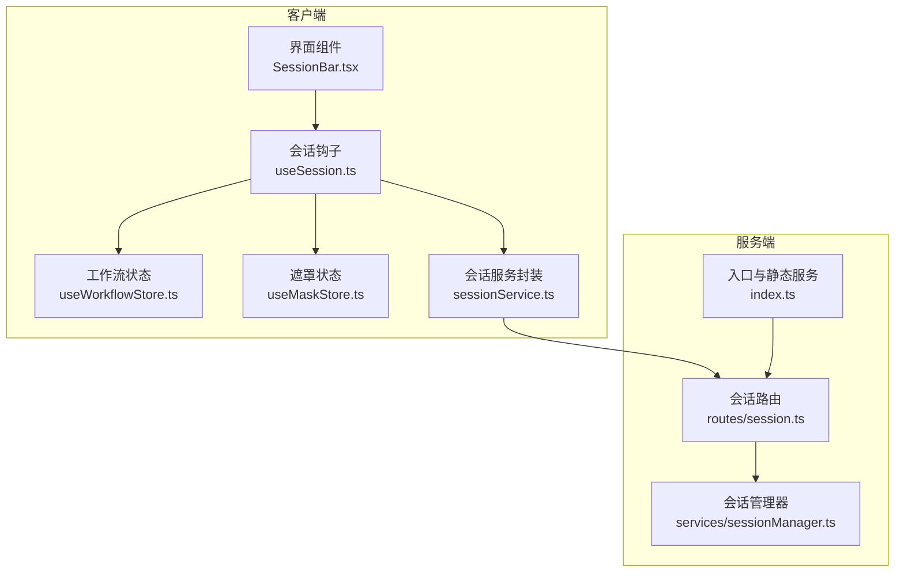
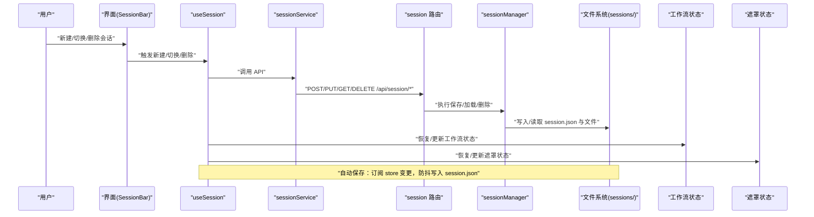
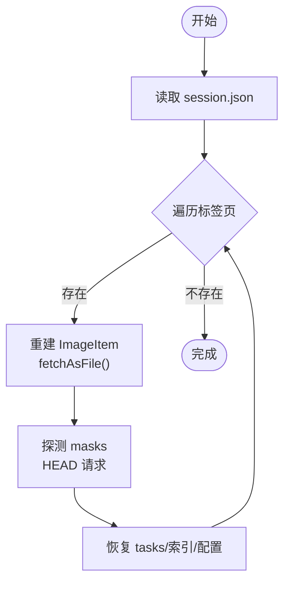
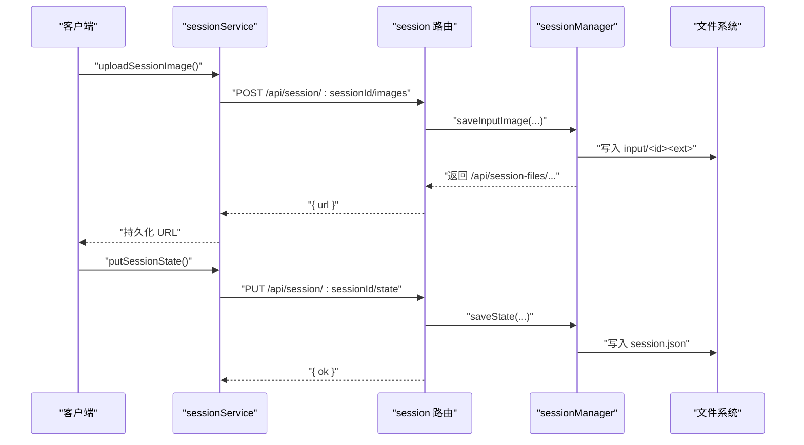
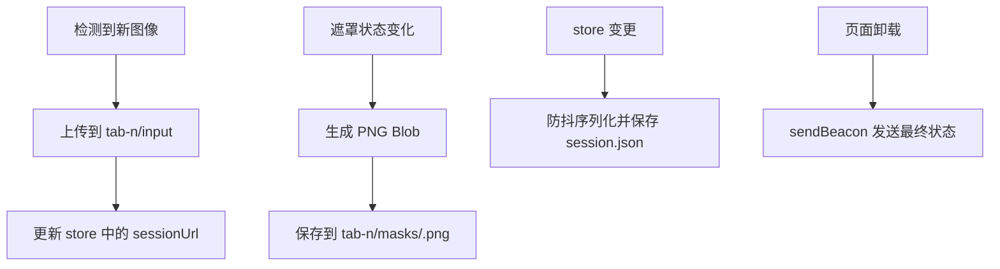
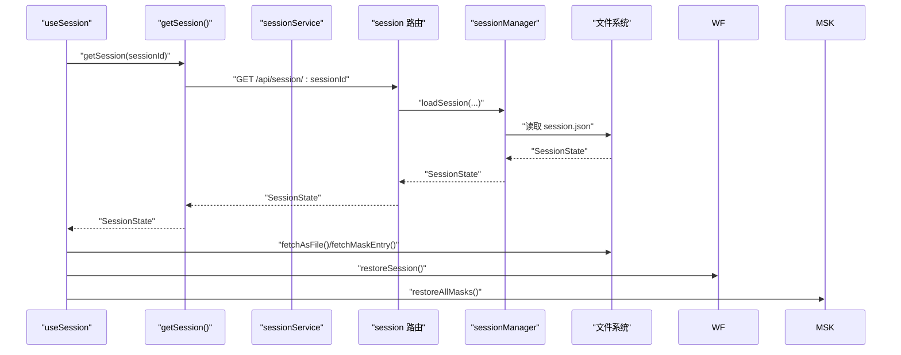
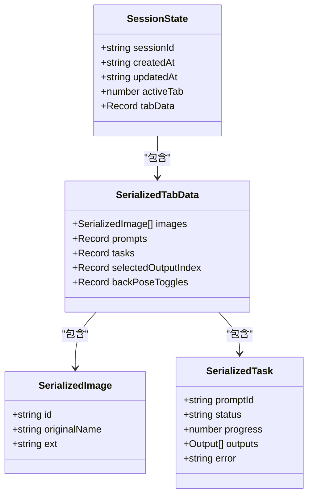
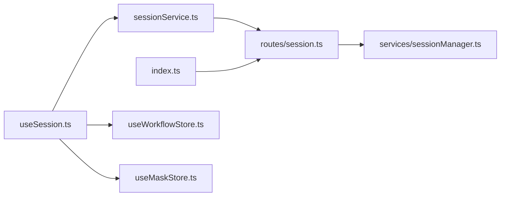

# 会话管理

<cite>
**本文引用的文件**
- [server/src/services/sessionManager.ts](file://server/src/services/sessionManager.ts)
- [server/src/routes/session.ts](file://server/src/routes/session.ts)
- [client/src/services/sessionService.ts](file://client/src/services/sessionService.ts)
- [client/src/hooks/useSession.ts](file://client/src/hooks/useSession.ts)
- [client/src/hooks/useWorkflowStore.ts](file://client/src/hooks/useWorkflowStore.ts)
- [client/src/hooks/useMaskStore.ts](file://client/src/hooks/useMaskStore.ts)
- [client/src/components/SessionBar.tsx](file://client/src/components/SessionBar.tsx)
- [server/src/index.ts](file://server/src/index.ts)
- [client/src/types/index.ts](file://client/src/types/index.ts)
- [server/src/types/index.ts](file://server/src/types/index.ts)
- [TODO-session-persistence.md](file://TODO-session-persistence.md)
- [sessions/187f40a5-66a0-4b2f-95fb-d6c9b6baeba6/session.json](file://sessions/187f40a5-66a0-4b2f-95fb-d6c9b6baeba6/session.json)
- [README.md](file://README.md)
</cite>

## 目录
1. [简介](#简介)
2. [项目结构](#项目结构)
3. [核心组件](#核心组件)
4. [架构总览](#架构总览)
5. [详细组件分析](#详细组件分析)
6. [依赖关系分析](#依赖关系分析)
7. [性能考虑](#性能考虑)
8. [故障排除指南](#故障排除指南)
9. [结论](#结论)
10. [附录](#附录)

## 简介
本文件系统性阐述 CorineKit Pix2Real 的会话管理系统，覆盖会话持久化机制（数据结构、文件存储、状态恢复）、会话 API 设计与实现（创建、序列化、清理）、per-tab 图像隔离的设计与实现（状态隔离、数据同步、资源管理），并提供最佳实践（备份、性能优化、故障恢复）与 API 使用示例及故障排除指南。

## 项目结构
会话管理涉及前后端协作：前端负责状态序列化、增量上传与自动保存；后端负责目录与文件持久化、会话状态 JSON 管理、静态文件服务与清理策略。

图表来源
- [client/src/components/SessionBar.tsx:1-381](file://client/src/components/SessionBar.tsx#L1-L381)
- [client/src/hooks/useSession.ts:1-422](file://client/src/hooks/useSession.ts#L1-L422)
- [client/src/services/sessionService.ts:1-134](file://client/src/services/sessionService.ts#L1-L134)
- [server/src/routes/session.ts:1-95](file://server/src/routes/session.ts#L1-L95)
- [server/src/services/sessionManager.ts:1-164](file://server/src/services/sessionManager.ts#L1-L164)
- [server/src/index.ts:1-228](file://server/src/index.ts#L1-L228)

章节来源
- [README.md: 项目结构与特性:41-62](file://README.md#L41-L62)
- [TODO-session-persistence.md: 会话持久化目标与策略:1-120](file://TODO-session-persistence.md#L1-L120)

## 核心组件
- 会话管理器（后端）
  - 目录与文件操作：确保会话目录、输入图、遮罩、输出文件保存与安全命名
  - 会话状态：序列化/反序列化 session.json，含创建/更新时间、活动标签页、各标签页数据
  - 清理策略：列出会话、删除会话、裁剪旧会话
- 会话路由（后端）
  - 提供上传输入图、上传遮罩、保存/加载/删除会话状态与会话列表
- 会话服务封装（前端）
  - 类型化 API 封装：上传图片/遮罩、保存/加载/删除会话、列出会话
- 会话钩子（前端）
  - 自动保存：基于 store 订阅的防抖保存、页面卸载前 flush
  - 状态恢复：从服务器拉取 session.json，重建 ImageItem 与遮罩，恢复 store 与遮罩状态
  - per-tab 隔离：按 tab-0..9 维度组织输入图与遮罩
- 工作流与遮罩状态（前端）
  - 工作流状态：包含 images、prompts、tasks、selectedOutputIndex、backPoseToggles、配置等
  - 遮罩状态：以键值对存储遮罩像素数据，支持批量恢复
- 入口与静态服务（后端）
  - 确保 sessions 目录存在，静态服务映射 /api/session-files → sessions 目录

章节来源
- [server/src/services/sessionManager.ts: 会话管理器接口与实现:1-164](file://server/src/services/sessionManager.ts#L1-L164)
- [server/src/routes/session.ts: 会话路由定义:1-95](file://server/src/routes/session.ts#L1-L95)
- [client/src/services/sessionService.ts: 前端会话 API 封装:1-134](file://client/src/services/sessionService.ts#L1-L134)
- [client/src/hooks/useSession.ts: 会话钩子与自动保存/恢复:1-422](file://client/src/hooks/useSession.ts#L1-L422)
- [client/src/hooks/useWorkflowStore.ts: 工作流状态与恢复:1-645](file://client/src/hooks/useWorkflowStore.ts#L1-L645)
- [client/src/hooks/useMaskStore.ts: 遮罩状态:1-51](file://client/src/hooks/useMaskStore.ts#L1-L51)
- [server/src/index.ts: 静态服务与会话目录:37-61](file://server/src/index.ts#L37-L61)

## 架构总览
会话管理采用“事件驱动静默自动保存”策略：导入图片立即复制到会话目录；任务完成更新 session.json；遮罩绘制结束保存 PNG；提示词变更 500ms 防抖更新；页面关闭前 flush。

图表来源
- [client/src/components/SessionBar.tsx:66-71](file://client/src/components/SessionBar.tsx#L66-L71)
- [client/src/hooks/useSession.ts:164-181](file://client/src/hooks/useSession.ts#L164-L181)
- [client/src/services/sessionService.ts:103-121](file://client/src/services/sessionService.ts#L103-L121)
- [server/src/routes/session.ts:18-92](file://server/src/routes/session.ts#L18-L92)
- [server/src/services/sessionManager.ts:91-120](file://server/src/services/sessionManager.ts#L91-L120)

## 详细组件分析

### 会话管理器（后端）
- 数据结构
  - SessionState：sessionId、createdAt、updatedAt、activeTab、tabData
  - SerializedTabData：images、prompts、tasks、selectedOutputIndex、backPoseToggles、配置字段
  - SerializedImage、SerializedTask：用于序列化存储的数据载体
- 文件存储策略
  - 目录：sessions/<sessionId>/tab-<n>/input、masks、output
  - 输入图：按扩展名保存，返回持久化 URL
  - 遮罩：maskKey 中冒号替换为下划线，避免 Windows 非法字符
  - 输出文件：下载至 session output 目录，返回 URL
- 状态恢复算法
  - 读取 session.json，逐标签页重建 images（fetch → File → Blob URL），恢复 tasks、selectedOutputIndex、backPoseToggles、配置
  - 遮罩探测：按 maskKey 与安全名尝试 HEAD 请求，存在则下载还原为 RGBA 像素
- 清理维护
  - 列出会话：按 updatedAt 倒序
  - 删除会话：递归删除目录
  - 裁剪旧会话：仅保留最近 N 个

图表来源
- [server/src/services/sessionManager.ts:112-120](file://server/src/services/sessionManager.ts#L112-L120)
- [client/src/hooks/useSession.ts:316-366](file://client/src/hooks/useSession.ts#L316-L366)

章节来源
- [server/src/services/sessionManager.ts: 数据结构与 I/O:61-120](file://server/src/services/sessionManager.ts#L61-L120)
- [server/src/services/sessionManager.ts: 目录与文件保存:10-57](file://server/src/services/sessionManager.ts#L10-L57)
- [server/src/services/sessionManager.ts: 列表/删除/裁剪:124-164](file://server/src/services/sessionManager.ts#L124-L164)
- [client/src/hooks/useSession.ts: 恢复流程:316-366](file://client/src/hooks/useSession.ts#L316-L366)

### 会话 API（前后端）
- 客户端 API
  - 上传输入图：multipart/form-data，返回持久化 URL
  - 上传遮罩：PNG，保存为 masks/<safeName>.png
  - 保存/加载/删除会话：PUT/GET/DELETE /api/session/:sessionId/state 与 /api/session/:sessionId
  - 列出最近会话：GET /api/session
- 服务端路由
  - POST /api/session/:sessionId/images：校验参数，保存输入图
  - POST /api/session/:sessionId/masks：保存遮罩
  - PUT/POST /api/session/:sessionId/state：保存 session.json（支持 sendBeacon）
  - GET /api/session/:sessionId、GET /api/session、DELETE /api/session/:sessionId

图表来源
- [client/src/services/sessionService.ts:69-113](file://client/src/services/sessionService.ts#L69-L113)
- [server/src/routes/session.ts:18-68](file://server/src/routes/session.ts#L18-L68)
- [server/src/services/sessionManager.ts:20-44](file://server/src/services/sessionManager.ts#L20-L44)
- [server/src/services/sessionManager.ts:91-110](file://server/src/services/sessionManager.ts#L91-L110)

章节来源
- [client/src/services/sessionService.ts: API 定义:69-134](file://client/src/services/sessionService.ts#L69-L134)
- [server/src/routes/session.ts: 路由实现:18-92](file://server/src/routes/session.ts#L18-L92)

### per-tab 图像隔离与数据同步
- per-tab 隔离
  - 目录结构：每个 sessionId 下按 tab-0..9 维度组织 input 与 masks
  - 恢复时按 tab 重建 images，并根据 imageId 关联 tasks 与 selectedOutputIndex
- 数据同步
  - 图像：首次检测到新图像即异步上传，成功后更新 store 中的 sessionUrl
  - 遮罩：遮罩状态变化即保存 PNG，保存时解析 tabId（从 maskKey 解析 imageId，再在 store 中定位 tab）
  - 状态：工作流与遮罩状态分别订阅，仅序列化非文件字段写入 session.json
- 资源管理
  - 上传去重：uploadedImages/savedMasks 集合避免重复上传/保存
  - 空会话清理：欢迎页或新建会话时若为空且已保存过，删除服务器记录

图表来源
- [client/src/hooks/useSession.ts:188-233](file://client/src/hooks/useSession.ts#L188-L233)
- [client/src/hooks/useSession.ts:235-265](file://client/src/hooks/useSession.ts#L235-L265)
- [client/src/hooks/useSession.ts:397-418](file://client/src/hooks/useSession.ts#L397-L418)

章节来源
- [client/src/hooks/useSession.ts: 图像上传与去重:188-233](file://client/src/hooks/useSession.ts#L188-L233)
- [client/src/hooks/useSession.ts: 遮罩保存与 tab 解析:235-265](file://client/src/hooks/useSession.ts#L235-L265)
- [client/src/hooks/useSession.ts: 自动保存与卸载 flush:164-181](file://client/src/hooks/useSession.ts#L164-L181)
- [client/src/hooks/useSession.ts: 卸载前 flush:397-418](file://client/src/hooks/useSession.ts#L397-L418)

### 状态恢复算法详解
- 步骤
  - 读取 session.json，获取 activeTab 与 tabData
  - 对每个标签页：
    - 重建 images：拼接 /api/session-files/{sessionId}/tab-{n}/input/{id}{ext}，fetch → File → Blob URL
    - 探测 masks：按 maskKey 与安全名尝试 HEAD，存在则 fetch → RGBA 像素
  - 恢复工作流与遮罩状态：restoreSession 与 restoreAllMasks
  - 设置最后保存时间与停止恢复标志位
- 错误处理
  - 单个图像/遮罩失败不影响整体恢复，记录警告并跳过
  - 会话不存在返回空，按设置行为显示欢迎页或新建会话

图表来源
- [client/src/services/sessionService.ts:115-121](file://client/src/services/sessionService.ts#L115-L121)
- [server/src/routes/session.ts:70-79](file://server/src/routes/session.ts#L70-L79)
- [server/src/services/sessionManager.ts:112-120](file://server/src/services/sessionManager.ts#L112-L120)
- [client/src/hooks/useSession.ts:316-366](file://client/src/hooks/useSession.ts#L316-L366)

章节来源
- [client/src/services/sessionService.ts: 获取会话:115-121](file://client/src/services/sessionService.ts#L115-L121)
- [server/src/routes/session.ts: 加载会话:70-79](file://server/src/routes/session.ts#L70-L79)
- [server/src/services/sessionManager.ts: 读取与解析:112-120](file://server/src/services/sessionManager.ts#L112-L120)
- [client/src/hooks/useSession.ts: 恢复逻辑:316-366](file://client/src/hooks/useSession.ts#L316-L366)

### 类型与数据模型
- 前端类型
  - ImageItem：包含 sessionUrl（持久化 URL）
  - TaskInfo：包含 outputs（文件名与 URL）
  - Store 数据：TabData 包含 images、prompts、tasks、selectedOutputIndex、backPoseToggles、配置等
- 后端类型
  - SessionState、SerializedTabData、SerializedImage、SerializedTask
  - WebSocket 事件类型：Progress、Complete、Error

图表来源
- [server/src/services/sessionManager.ts:61-89](file://server/src/services/sessionManager.ts#L61-L89)
- [client/src/types/index.ts:1-58](file://client/src/types/index.ts#L1-L58)
- [server/src/types/index.ts:10-36](file://server/src/types/index.ts#L10-L36)

章节来源
- [server/src/services/sessionManager.ts: 类型定义:61-89](file://server/src/services/sessionManager.ts#L61-L89)
- [client/src/types/index.ts: 前端类型:1-58](file://client/src/types/index.ts#L1-L58)
- [server/src/types/index.ts: 事件类型:10-36](file://server/src/types/index.ts#L10-L36)

## 依赖关系分析
- 组件耦合
  - useSession 依赖 sessionService、useWorkflowStore、useMaskStore
  - sessionService 依赖后端路由
  - session 路由依赖 sessionManager
  - index.ts 注册路由并提供静态文件服务
- 外部依赖
  - multer：内存上传存储
  - express 静态服务：/api/session-files → sessions 目录
  - 浏览器：fetch、File、Blob、URL.createObjectURL、navigator.sendBeacon

图表来源
- [client/src/hooks/useSession.ts:1-16](file://client/src/hooks/useSession.ts#L1-L16)
- [client/src/services/sessionService.ts:1-134](file://client/src/services/sessionService.ts#L1-L134)
- [server/src/routes/session.ts:1-16](file://server/src/routes/session.ts#L1-L16)
- [server/src/services/sessionManager.ts:1-6](file://server/src/services/sessionManager.ts#L1-L6)
- [server/src/index.ts:53-60](file://server/src/index.ts#L53-L60)

章节来源
- [server/src/index.ts: 路由注册与静态服务:53-60](file://server/src/index.ts#L53-L60)
- [server/src/routes/session.ts: 路由依赖:1-16](file://server/src/routes/session.ts#L1-L16)

## 性能考虑
- 上传与保存
  - 图像与遮罩采用异步上传，避免阻塞主线程
  - 防抖保存：500ms，减少频繁写入
- 文件系统
  - 输入图与遮罩按 tab 维度分隔，便于清理与并发访问
  - 遮罩安全命名避免 Windows 非法字符
- 网络
  - sendBeacon 在卸载前发送最终状态，保证数据不丢失
  - 列表与删除采用轻量 JSON，避免大文件传输
- 存储
  - 输出文件不复制到会话目录，仅记录 URL，节省空间
  - 裁剪旧会话，默认保留最近 5 个

## 故障排除指南
- 会话恢复失败
  - 现象：部分图像或遮罩未恢复
  - 排查：检查 /api/session-files 下对应路径是否存在；确认 session.json 中的 id/ext 是否正确
  - 参考
    - [client/src/hooks/useSession.ts: 恢复流程:316-366](file://client/src/hooks/useSession.ts#L316-L366)
    - [sessions/187f40a5-66a0-4b2f-95fb-d6c9b6baeba6/session.json:1-492](file://sessions/187f40a5-66a0-4b2f-95fb-d6c9b6baeba6/session.json#L1-L492)
- 遮罩保存失败
  - 现象：遮罩未保存或文件名异常
  - 排查：确认 maskKey 中冒号被替换为下划线；检查 tabId 解析是否正确
  - 参考
    - [server/src/services/sessionManager.ts: 遮罩保存与安全名:46-57](file://server/src/services/sessionManager.ts#L46-L57)
    - [client/src/hooks/useSession.ts: 遮罩保存与 tab 解析:235-265](file://client/src/hooks/useSession.ts#L235-L265)
- 自动保存未生效
  - 现象：页面刷新后状态未持久化
  - 排查：确认 store 订阅是否触发；检查防抖定时器；确认 isRestoring 标志位
  - 参考
    - [client/src/hooks/useSession.ts: 自动保存与防抖:164-181](file://client/src/hooks/useSession.ts#L164-L181)
- 会话列表为空
  - 现象：/api/session 返回空数组
  - 排查：确认 sessions 目录存在；检查 session.json 是否损坏；确认静态服务映射
  - 参考
    - [server/src/index.ts: 静态服务与 sessions 目录:37-61](file://server/src/index.ts#L37-L61)
    - [server/src/services/sessionManager.ts: 列表与错误处理:130-148](file://server/src/services/sessionManager.ts#L130-L148)

章节来源
- [client/src/hooks/useSession.ts: 恢复与保存逻辑:316-418](file://client/src/hooks/useSession.ts#L316-L418)
- [server/src/services/sessionManager.ts: 列表与错误处理:130-148](file://server/src/services/sessionManager.ts#L130-L148)
- [server/src/index.ts: 静态服务与目录:37-61](file://server/src/index.ts#L37-L61)

## 结论
该会话管理系统通过清晰的 per-tab 隔离、事件驱动的自动保存与稳健的状态恢复机制，实现了跨页面的无缝会话延续。后端提供可靠的文件存储与清理策略，前端通过防抖与去重优化提升用户体验。建议在生产环境启用定期备份与监控，确保数据安全与性能稳定。

## 附录

### API 使用示例（路径）
- 上传输入图
  - [client/src/services/sessionService.ts: uploadSessionImage:69-85](file://client/src/services/sessionService.ts#L69-L85)
- 上传遮罩
  - [client/src/services/sessionService.ts: uploadSessionMask:87-100](file://client/src/services/sessionService.ts#L87-L100)
- 保存会话状态
  - [client/src/services/sessionService.ts: putSessionState:102-113](file://client/src/services/sessionService.ts#L102-L113)
- 加载会话
  - [client/src/services/sessionService.ts: getSession:115-121](file://client/src/services/sessionService.ts#L115-L121)
- 列出会话
  - [client/src/services/sessionService.ts: listSessions:123-128](file://client/src/services/sessionService.ts#L123-L128)
- 删除会话
  - [client/src/services/sessionService.ts: deleteSession:129-133](file://client/src/services/sessionService.ts#L129-L133)

### 最佳实践
- 数据备份
  - 定期导出会话目录（sessions/）与输出目录（output/）
  - 使用版本控制或云存储进行异地备份
- 性能优化
  - 控制单次上传文件大小，合理拆分批次
  - 使用防抖与去重策略，减少网络与磁盘压力
- 故障恢复
  - 会话损坏时优先修复 session.json；必要时删除并重新开始
  - 清理旧会话前确认不再需要，避免误删