# AI智能代理系统

<cite>
**本文档引用的文件**
- [README.md](file://README.md)
- [package.json](file://package.json)
- [client/package.json](file://client/package.json)
- [server/package.json](file://server/package.json)
- [client/src/main.tsx](file://client/src/main.tsx)
- [server/src/index.ts](file://server/src/index.ts)
- [server/src/routers/agent.ts](file://server/src/routes/agent.ts)
- [server/src/services/agentService.ts](file://server/src/services/agentService.ts)
- [client/src/hooks/useAgentStore.ts](file://client/src/hooks/useAgentStore.ts)
- [docs/plans/2026-04-13-ai-agent-feature-requirement.md](file://docs/plans/2026-04-13-ai-agent-feature-requirement.md)
- [docs/SystemPrompt.txt](file://docs/SystemPrompt.txt)
- [server/src/services/llmService.ts](file://server/src/services/llmService.ts)
- [server/src/services/intentParser.ts](file://server/src/services/intentParser.ts)
- [server/src/adapters/index.ts](file://server/src/adapters/index.ts)
- [server/src/services/comfyui.ts](file://server/src/services/comfyui.ts)
- [model_meta/metadata.json](file://model_meta/metadata.json)
- [client/src/components/prompt-assistant/systemPrompts.ts](file://client/src/components/prompt-assistant/systemPrompts.ts)
</cite>

## 目录
1. [项目概述](#项目概述)
2. [项目结构](#项目结构)
3. [核心组件](#核心组件)
4. [架构概览](#架构概览)
5. [详细组件分析](#详细组件分析)
6. [依赖关系分析](#依赖关系分析)
7. [性能考虑](#性能考虑)
8. [故障排除指南](#故障排除指南)
9. [结论](#结论)

## 项目概述

AI智能代理系统是一个基于ComfyUI的图像生成与处理应用，专为二次元图像创作场景设计。该系统通过引入AI智能代理，让用户能够以自然语言对话的方式完成图像生成和处理任务，显著降低了操作门槛并提升了使用效率。

### 主要特性

- **5种内置工作流**：二次元转真人、真人精修、精修放大、快速生成视频、视频放大
- **批量处理**：支持多文件同时处理
- **实时进度**：通过WebSocket实现实时进度更新
- **AI智能代理**：基于Grok API的自然语言理解与生成
- **会话管理**：支持会话持久化和输出文件管理
- **模型推荐**：智能推荐基础模型和LoRA组合
- **工作流编排**：自动规划并执行多步骤任务链

## 项目结构

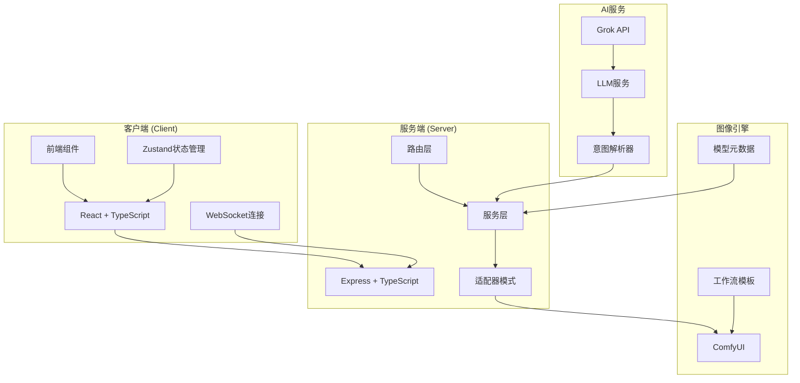

**图表来源**
- [README.md:41-62](file://README.md#L41-L62)
- [server/src/index.ts:52-73](file://server/src/index.ts#L52-L73)

**章节来源**
- [README.md:1-79](file://README.md#L1-L79)
- [package.json:1-15](file://package.json#L1-L15)

## 核心组件

### 1. AI智能代理核心

AI智能代理是整个系统的核心，负责理解用户意图、推荐合适的模型和参数，并协调多个工作流的执行。

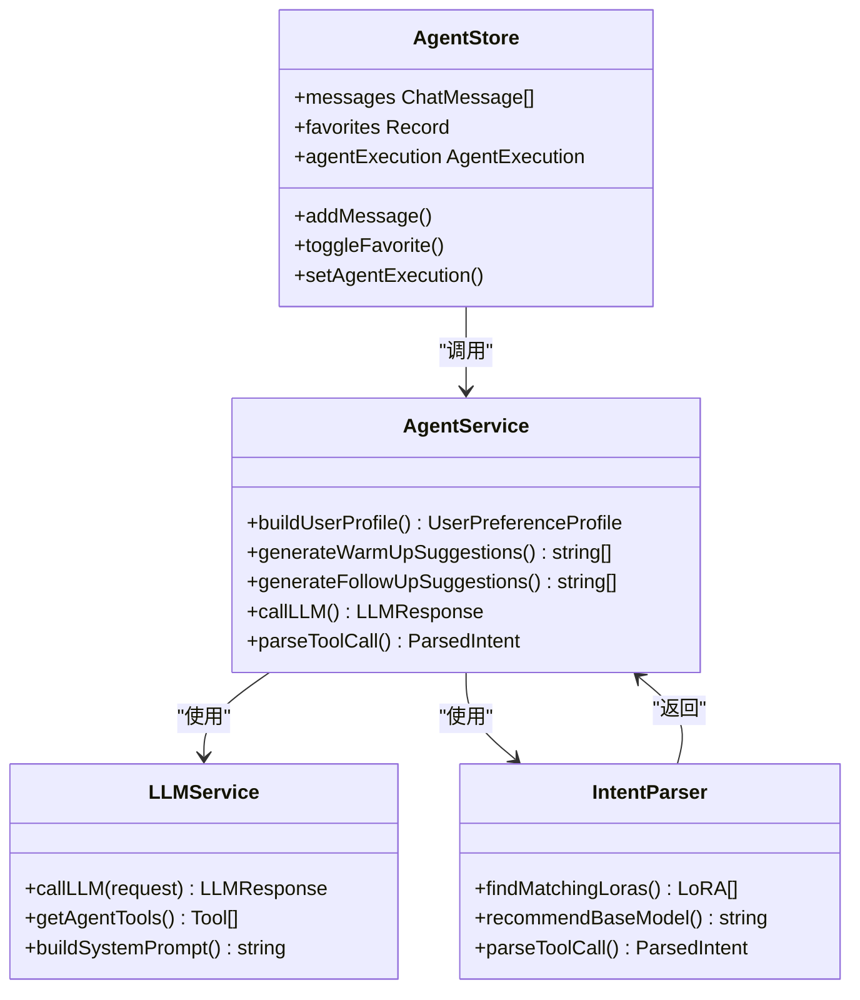

**图表来源**
- [server/src/services/agentService.ts:1-118](file://server/src/services/agentService.ts#L1-L118)
- [server/src/services/llmService.ts:1-354](file://server/src/services/llmService.ts#L1-L354)
- [server/src/services/intentParser.ts:1-537](file://server/src/services/intentParser.ts#L1-L537)
- [client/src/hooks/useAgentStore.ts:1-226](file://client/src/hooks/useAgentStore.ts#L1-L226)

### 2. 工作流适配器系统

系统采用适配器模式，为每个工作流提供专门的参数映射和配置。

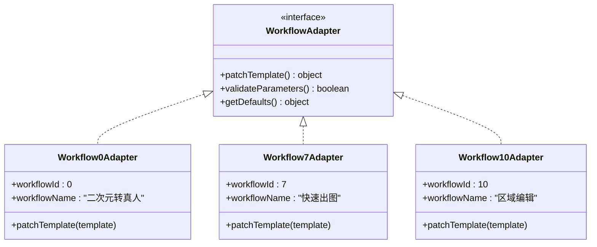

**图表来源**
- [server/src/adapters/index.ts:1-33](file://server/src/adapters/index.ts#L1-L33)

### 3. 模型元数据管理系统

系统维护完整的模型元数据，包括LoRA、基础模型、触发词等信息。

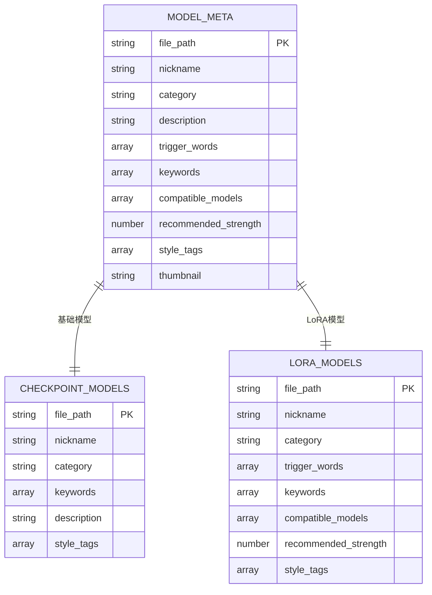

**图表来源**
- [model_meta/metadata.json:1-800](file://model_meta/metadata.json#L1-L800)

**章节来源**
- [server/src/services/agentService.ts:1-118](file://server/src/services/agentService.ts#L1-L118)
- [server/src/services/llmService.ts:1-354](file://server/src/services/llmService.ts#L1-L354)
- [server/src/services/intentParser.ts:1-537](file://server/src/services/intentParser.ts#L1-L537)

## 架构概览

系统采用前后端分离架构，通过REST API和WebSocket实现实时通信。

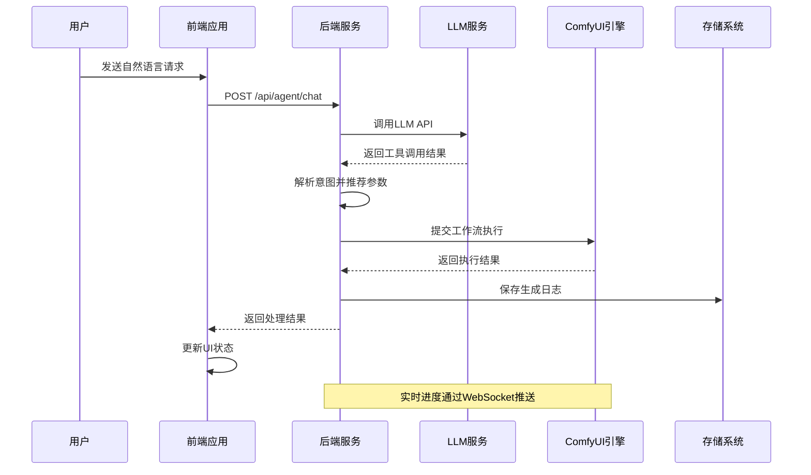

**图表来源**
- [server/src/index.ts:85-242](file://server/src/index.ts#L85-L242)
- [server/src/routers/agent.ts:492-602](file://server/src/routers/agent.ts#L492-L602)

**章节来源**
- [server/src/index.ts:1-264](file://server/src/index.ts#L1-L264)
- [server/src/routers/agent.ts:1-927](file://server/src/routers/agent.ts#L1-L927)

## 详细组件分析

### 1. AI代理对话系统

#### 对话流程

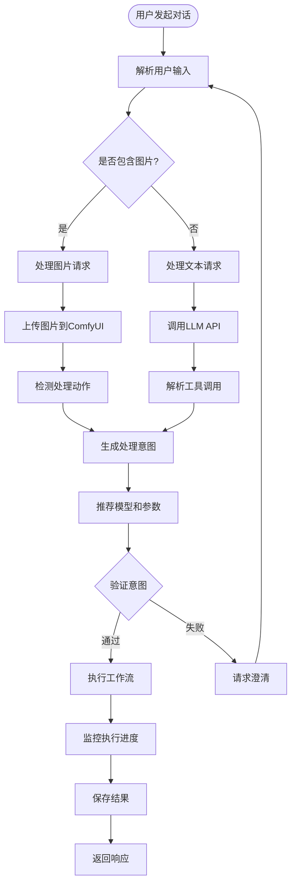

**图表来源**
- [server/src/routers/agent.ts:492-602](file://server/src/routers/agent.ts#L492-L602)
- [server/src/services/llmService.ts:113-197](file://server/src/services/llmService.ts#L113-L197)

#### 意图解析机制

系统通过多种策略解析用户意图：

1. **直接匹配**：基于关键词的直接匹配
2. **语义理解**：通过LLM进行语义分析
3. **上下文推理**：利用对话历史进行推理
4. **模型推荐**：基于用户偏好和历史使用情况

**章节来源**
- [server/src/services/intentParser.ts:1-537](file://server/src/services/intentParser.ts#L1-L537)
- [server/src/services/llmService.ts:1-354](file://server/src/services/llmService.ts#L1-L354)

### 2. 模型推荐系统

#### 推荐算法

```mermaid
flowchart LR
Input[用户输入] --> ExtractKeywords["提取关键词"]
ExtractKeywords --> SearchLoras["搜索匹配的LoRA"]
SearchLoras --> ScoreCalculation["计算匹配分数"]
ScoreCalculation --> CategoryDedup["按类别去重"]
CategoryDedup --> StrengthSelection["选择推荐强度"]
StrengthSelection --> ModelRecommendation["推荐基础模型"]
ModelRecommendation --> ParameterOptimization["参数优化"]
ParameterOptimization --> FinalRecommendation["最终推荐结果"]
```

**图表来源**
- [server/src/services/intentParser.ts:30-81](file://server/src/services/intentParser.ts#L30-L81)
- [server/src/services/intentParser.ts:140-258](file://server/src/services/intentParser.ts#L140-L258)

#### 推荐规则

| 类别 | 默认强度 | 限制数量 | 说明 |
|------|----------|----------|------|
| 角色 | 0.8 | 1 | 角色LoRA优先级最高 |
| 姿势 | 0.7 | 1 | 姿势LoRA次之 |
| 表情 | 0.65 | 1 | 表情LoRA |
| 风格 | 0.6 | 1 | 风格LoRA |
| 性别 | 0.7 | 1 | 性别相关LoRA |
| 多视角 | 0.7 | 1 | 多视角LoRA |
| 滑块 | 0.5 | 1 | 数量和比例类LoRA |

**章节来源**
- [server/src/services/intentParser.ts:88-130](file://server/src/services/intentParser.ts#L88-L130)
- [model_meta/metadata.json:121-800](file://model_meta/metadata.json#L121-L800)

### 3. 工作流执行系统

#### 执行流程

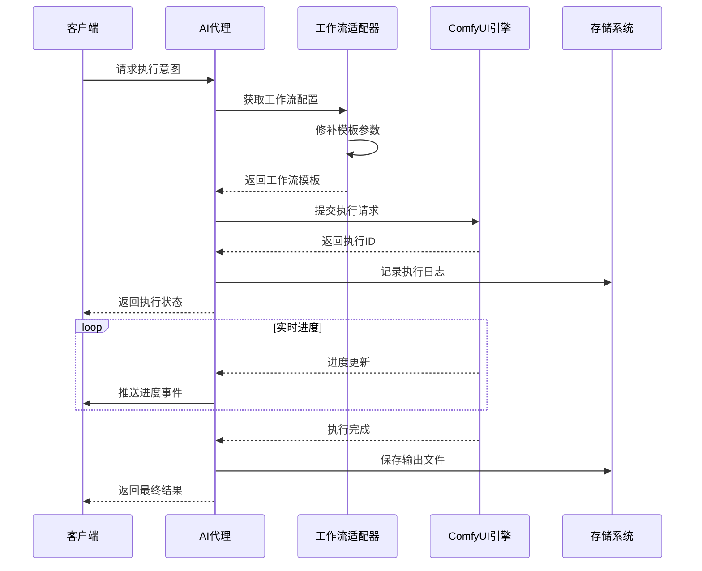

**图表来源**
- [server/src/routers/agent.ts:633-750](file://server/src/routers/agent.ts#L633-L750)
- [server/src/services/comfyui.ts:47-60](file://server/src/services/comfyui.ts#L47-L60)

**章节来源**
- [server/src/routers/agent.ts:604-800](file://server/src/routers/agent.ts#L604-L800)
- [server/src/services/comfyui.ts:1-285](file://server/src/services/comfyui.ts#L1-L285)

### 4. 状态管理系统

#### 状态存储结构

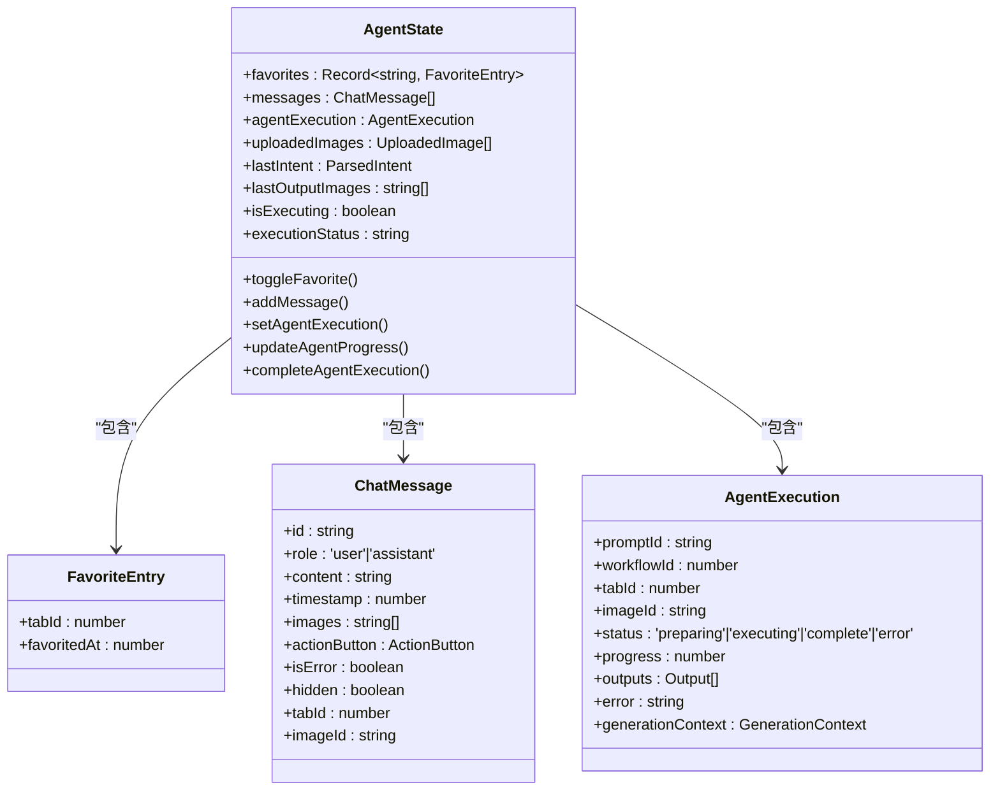

**图表来源**
- [client/src/hooks/useAgentStore.ts:54-122](file://client/src/hooks/useAgentStore.ts#L54-L122)

**章节来源**
- [client/src/hooks/useAgentStore.ts:1-226](file://client/src/hooks/useAgentStore.ts#L1-L226)

## 依赖关系分析

### 1. 技术栈依赖

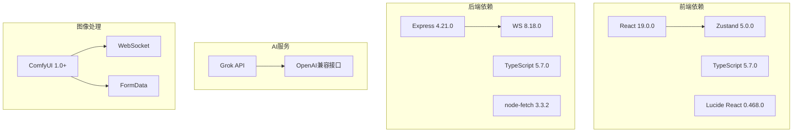

**图表来源**
- [client/package.json:11-25](file://client/package.json#L11-L25)
- [server/package.json:11-28](file://server/package.json#L11-L28)

### 2. 核心模块依赖

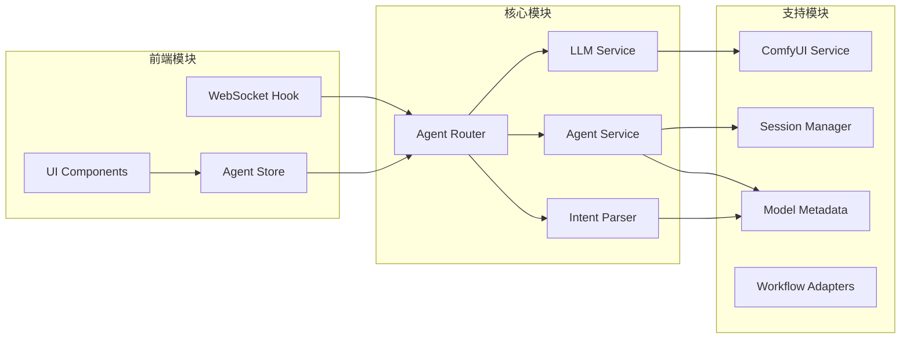

**图表来源**
- [server/src/index.ts:8-16](file://server/src/index.ts#L8-L16)
- [server/src/routers/agent.ts:1-14](file://server/src/routers/agent.ts#L1-L14)

**章节来源**
- [package.json:1-15](file://package.json#L1-L15)
- [server/src/index.ts:1-264](file://server/src/index.ts#L1-L264)

## 性能考虑

### 1. 并发处理优化

系统采用以下策略优化并发性能：

- **单实例WebSocket连接**：确保每个客户端只有一个WebSocket连接
- **事件缓冲机制**：防止客户端连接延迟导致的进度丢失
- **异步文件操作**：生成日志和收藏操作不阻塞主线程
- **缓存机制**：模型元数据缓存减少文件读取开销

### 2. 内存管理

- **及时清理**：完成的执行任务自动清理事件缓冲
- **会话隔离**：每个会话独立的输出目录和日志
- **资源释放**：WebSocket断开时自动释放相关资源

### 3. 网络优化

- **CORS配置**：允许本地开发环境访问
- **静态文件服务**：直接提供输出文件和模型缩略图
- **压缩传输**：WebSocket消息的高效序列化

## 故障排除指南

### 1. 常见问题诊断

#### ComfyUI连接问题

**症状**：WebSocket连接失败，无法接收进度更新

**解决方案**：
1. 确认ComfyUI在`http://localhost:8188`运行
2. 检查防火墙设置
3. 验证网络连接稳定性

#### LLM API错误

**症状**：AI代理无法生成建议或回复

**解决方案**：
1. 检查Grok API密钥配置
2. 验证网络连接
3. 查看API响应状态码

#### 模型加载失败

**症状**：工作流执行时报模型找不到错误

**解决方案**：
1. 确认模型文件存在于ComfyUI模型目录
2. 检查模型元数据文件完整性
3. 验证模型文件格式正确性

### 2. 日志分析

系统提供了详细的日志记录机制：

- **服务器启动日志**：显示端口、输出目录等信息
- **WebSocket连接日志**：记录连接建立和断开
- **执行错误日志**：捕获工作流执行异常
- **LLM调用日志**：记录API调用和响应

**章节来源**
- [server/src/index.ts:247-261](file://server/src/index.ts#L247-L261)
- [server/src/services/llmService.ts:72-76](file://server/src/services/llmService.ts#L72-L76)

## 结论

AI智能代理系统通过将先进的LLM技术和传统的图像生成工作流相结合，为用户提供了一个强大而易用的AI图像创作平台。系统的主要优势包括：

### 核心优势

1. **自然语言交互**：用户可以通过自然语言描述复杂的图像生成需求
2. **智能推荐**：基于用户偏好和上下文的智能模型和参数推荐
3. **工作流编排**：支持多步骤任务的自动编排和执行
4. **实时反馈**：通过WebSocket提供实时的执行进度反馈
5. **可扩展性**：模块化的架构设计支持新功能的轻松扩展

### 技术特色

- **适配器模式**：为不同工作流提供统一的接口
- **意图解析**：复杂的自然语言理解和意图提取
- **状态管理**：完整的会话和执行状态跟踪
- **实时通信**：高效的WebSocket通信机制

### 应用前景

该系统不仅适用于个人创作者，也可作为企业级图像生成服务平台的基础架构，为各种图像处理需求提供智能化解决方案。通过持续的功能扩展和技术优化，系统有望成为AI图像创作领域的重要工具。