# AI智能代理系统

<cite>
**本文档引用的文件**
- [README.md](file://README.md)
- [package.json](file://package.json)
- [client/package.json](file://client/package.json)
- [server/package.json](file://server/package.json)
- [client/src/main.tsx](file://client/src/main.tsx)
- [server/src/index.ts](file://server/src/index.ts)
- [server/src/routes/agent.ts](file://server/src/routes/agent.ts)
- [server/src/services/agentService.ts](file://server/src/services/agentService.ts)
- [client/src/hooks/useAgentStore.ts](file://client/src/hooks/useAgentStore.ts)
- [docs/plans/2026-04-13-ai-agent-feature-requirement.md](file://docs/plans/2026-04-13-ai-agent-feature-requirement.md)
- [docs/SystemPrompt.txt](file://docs/SystemPrompt.txt)
- [docs/系统提示词优化方案.md](file://docs/系统提示词优化方案.md)
- [server/src/services/llmService.ts](file://server/src/services/llmService.ts)
- [server/src/services/intentParser.ts](file://server/src/services/intentParser.ts)
- [server/src/services/profileService.ts](file://server/src/services/profileService.ts)
- [server/src/adapters/index.ts](file://server/src/adapters/index.ts)
- [server/src/services/comfyui.ts](file://server/src/services/comfyui.ts)
- [model_meta/metadata.json](file://model_meta/metadata.json)
- [client/src/components/prompt-assistant/systemPrompts.ts](file://client/src/components/prompt-assistant/systemPrompts.ts)
- [server/src/types/index.ts](file://server/src/types/index.ts)
- [client/src/components/AgentDialog.tsx](file://client/src/components/AgentDialog.tsx)
- [client/src/components/PromptDiff.tsx](file://client/src/components/PromptDiff.tsx)
- [client/src/components/AgentFab.tsx](file://client/src/components/AgentFab.tsx)
</cite>

## 更新摘要
**变更内容**
- 新增AgentDialog组件的三种聊天模式：智能代理(agent)、配置助理(config_assistant)、智能问答(smart_qa)
- 引入PromptDiff组件用于提示词差异可视化，展示标签级修改对比
- 增强LoRA冲突检测和配置快照功能，支持配置变更的版本控制和回滚
- 新增配置助理模式下的LoRA锁定机制和冲突处理流程
- 完善配置快照管理，支持配置变更的保存、恢复和状态追踪

## 目录
1. [项目概述](#项目概述)
2. [项目结构](#项目结构)
3. [核心组件](#核心组件)
4. [架构概览](#架构概览)
5. [详细组件分析](#详细组件分析)
6. [聊天模式系统](#聊天模式系统)
7. [配置助理与冲突检测](#配置助理与冲突检测)
8. [配置快照与版本控制](#配置快照与版本控制)
9. [提示词差异可视化](#提示词差异可视化)
10. [用户成熟度与LoRA探索系统](#用户成熟度与lora探索系统)
11. [依赖关系分析](#依赖关系分析)
12. [性能考虑](#性能考虑)
13. [故障排除指南](#故障排除指南)
14. [结论](#结论)

## 项目概述

AI智能代理系统是一个基于ComfyUI的图像生成与处理应用，专为二次元图像创作场景设计。该系统通过引入AI智能代理，让用户能够以自然语言对话的方式完成图像生成和处理任务，显著降低了操作门槛并提升了使用效率。

### 主要特性

- **5种内置工作流**：二次元转真人、真人精修、精修放大、快速生成视频、视频放大
- **批量处理**：支持多文件同时处理
- **实时进度**：通过WebSocket实现实时进度更新
- **AI智能代理**：基于Grok API的自然语言理解与生成
- **会话管理**：支持会话持久化和输出文件管理
- **模型推荐**：智能推荐基础模型和LoRA组合
- **工作流编排**：自动规划并执行多步骤任务链
- **用户成熟度评估**：三阶段用户学习曲线分析
- **智能LoRA探索**：基于用户画像的模型发现算法
- **多模式聊天界面**：智能代理、配置助理、智能问答三种模式
- **配置快照管理**：支持配置变更的版本控制和回滚
- **LoRA冲突检测**：智能识别和处理LoRA配置冲突
- **提示词差异可视化**：标签级提示词修改对比展示

## 项目结构

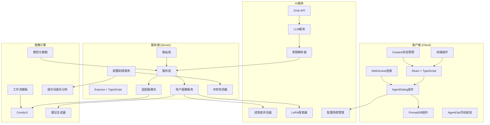
```mermaid
graph TB
subgraph "客户端 (Client)"
A[React + TypeScript]
B[前端组件]
C[Zustand状态管理]
D[WebSocket连接]
E[AgentDialog组件]
F[PromptDiff组件]
G[AgentFab浮动按钮]
end
subgraph "服务端 (Server)"
H[Express + TypeScript]
I[路由层]
J[服务层]
K[适配器模式]
L[用户画像服务]
M[配置助理服务]
N[冲突检测器]
end
subgraph "AI服务"
O[Grok API]
P[LLM服务]
Q[意图解析器]
R[成熟度评估器]
S[LoRA探索器]
T[配置快照管理]
end
subgraph "图像引擎"
U[ComfyUI]
V[工作流模板]
W[模型元数据]
X[建议生成器]
Y[提示词差异分析]
end
A --> E
B --> A
C --> A
D --> E
I --> J
J --> K
J --> L
K --> U
L --> R
L --> S
L --> X
O --> P
P --> Q
Q --> J
W --> J
V --> U
E --> F
E --> T
M --> N
M --> Y
```

**图表来源**
- [README.md:41-62](file://README.md#L41-L62)
- [server/src/index.ts:52-73](file://server/src/index.ts#L52-L73)
- [client/src/components/AgentDialog.tsx:27-31](file://client/src/components/AgentDialog.tsx#L27-L31)
- [client/src/components/PromptDiff.tsx:1-125](file://client/src/components/PromptDiff.tsx#L1-L125)

**章节来源**
- [README.md:1-79](file://README.md#L1-L79)
- [package.json:1-15](file://package.json#L1-L15)

## 核心组件

### 1. AI智能代理核心

AI智能代理是整个系统的核心，负责理解用户意图、推荐合适的模型和参数，并协调多个工作流的执行。

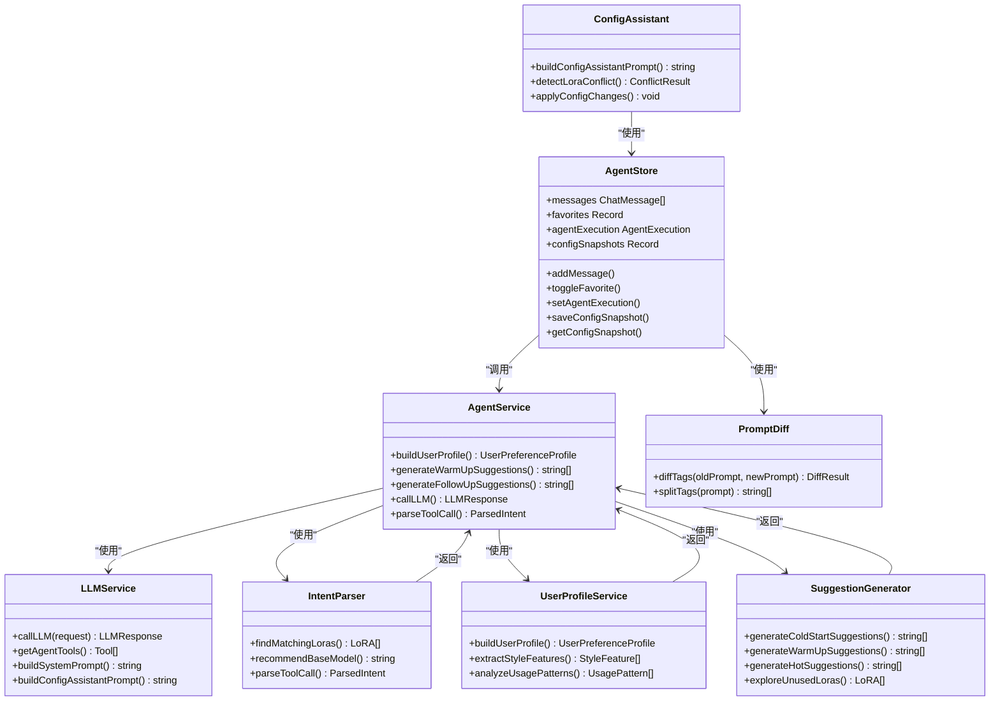
```mermaid
classDiagram
class AgentService {
+buildUserProfile() UserPreferenceProfile
+generateWarmUpSuggestions() string[]
+generateFollowUpSuggestions() string[]
+callLLM() LLMResponse
+parseToolCall() ParsedIntent
}
class LLMService {
+callLLM(request) LLMResponse
+getAgentTools() Tool[]
+buildSystemPrompt() string
+buildConfigAssistantPrompt() string
}
class IntentParser {
+findMatchingLoras() LoRA[]
+recommendBaseModel() string
+parseToolCall() ParsedIntent
}
class AgentStore {
+messages ChatMessage[]
+favorites Record
+agentExecution AgentExecution
+configSnapshots Record
+addMessage()
+toggleFavorite()
+setAgentExecution()
+saveConfigSnapshot()
+getConfigSnapshot()
}
class UserProfileService {
+buildUserProfile() UserPreferenceProfile
+extractStyleFeatures() StyleFeature[]
+analyzeUsagePatterns() UsagePattern[]
}
class SuggestionGenerator {
+generateColdStartSuggestions() string[]
+generateWarmUpSuggestions() string[]
+generateHotSuggestions() string[]
+exploreUnusedLoras() LoRA[]
}
class PromptDiff {
+diffTags(oldPrompt, newPrompt) DiffResult
+splitTags(prompt) string[]
}
class ConfigAssistant {
+buildConfigAssistantPrompt() string
+detectLoraConflict() ConflictResult
+applyConfigChanges() void
}
AgentService --> LLMService : "使用"
AgentService --> IntentParser : "使用"
AgentService --> UserProfileService : "使用"
AgentService --> SuggestionGenerator : "使用"
AgentStore --> AgentService : "调用"
AgentStore --> PromptDiff : "使用"
ConfigAssistant --> AgentStore : "使用"
IntentParser --> AgentService : "返回"
UserProfileService --> AgentService : "返回"
SuggestionGenerator --> AgentService : "返回"
```

**图表来源**
- [server/src/services/agentService.ts:1-118](file://server/src/services/agentService.ts#L1-L118)
- [server/src/services/llmService.ts:1-354](file://server/src/services/llmService.ts#L1-L354)
- [server/src/services/intentParser.ts:1-537](file://server/src/services/intentParser.ts#L1-L537)
- [server/src/services/profileService.ts:1-238](file://server/src/services/profileService.ts#L1-L238)
- [server/src/routes/agent.ts:177-466](file://server/src/routes/agent.ts#L177-L466)
- [client/src/hooks/useAgentStore.ts:1-337](file://client/src/hooks/useAgentStore.ts#L1-L337)
- [client/src/components/PromptDiff.tsx:1-125](file://client/src/components/PromptDiff.tsx#L1-L125)

### 2. 工作流适配器系统

系统采用适配器模式，为每个工作流提供专门的参数映射和配置。

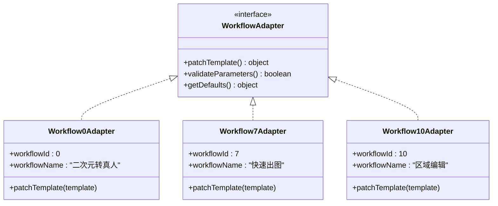
```mermaid
classDiagram
class WorkflowAdapter {
<<interface>>
+patchTemplate() object
+validateParameters() boolean
+getDefaults() object
}
class Workflow0Adapter {
+workflowId : 0
+workflowName : "二次元转真人"
+patchTemplate(template)
}
class Workflow7Adapter {
+workflowId : 7
+workflowName : "快速出图"
+patchTemplate(template)
}
class Workflow10Adapter {
+workflowId : 10
+workflowName : "区域编辑"
+patchTemplate(template)
}
WorkflowAdapter <|.. Workflow0Adapter
WorkflowAdapter <|.. Workflow7Adapter
WorkflowAdapter <|.. Workflow10Adapter
```

**图表来源**
- [server/src/adapters/index.ts:1-33](file://server/src/adapters/index.ts#L1-L33)

### 3. 模型元数据管理系统

系统维护完整的模型元数据，包括LoRA、基础模型、触发词等信息。

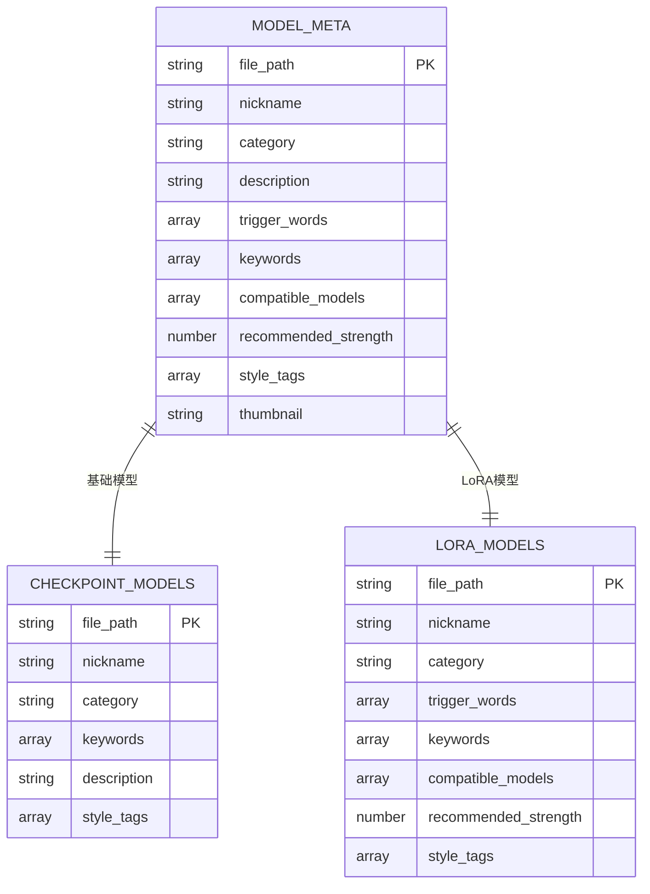
```mermaid
erDiagram
MODEL_META {
string file_path PK
string nickname
string category
string description
array trigger_words
array keywords
array compatible_models
number recommended_strength
array style_tags
string thumbnail
}
CHECKPOINT_MODELS {
string file_path PK
string nickname
string category
array keywords
string description
array style_tags
}
LORA_MODELS {
string file_path PK
string nickname
string category
array trigger_words
array keywords
array compatible_models
number recommended_strength
array style_tags
}
MODEL_META ||--|| CHECKPOINT_MODELS : "基础模型"
MODEL_META ||--|| LORA_MODELS : "LoRA模型"
```

**图表来源**
- [model_meta/metadata.json:1-800](file://model_meta/metadata.json#L1-L800)

**章节来源**
- [server/src/services/agentService.ts:1-118](file://server/src/services/agentService.ts#L1-L118)
- [server/src/services/llmService.ts:1-354](file://server/src/services/llmService.ts#L1-L354)
- [server/src/services/intentParser.ts:1-537](file://server/src/services/intentParser.ts#L1-L537)

## 架构概览

系统采用前后端分离架构，通过REST API和WebSocket实现实时通信。

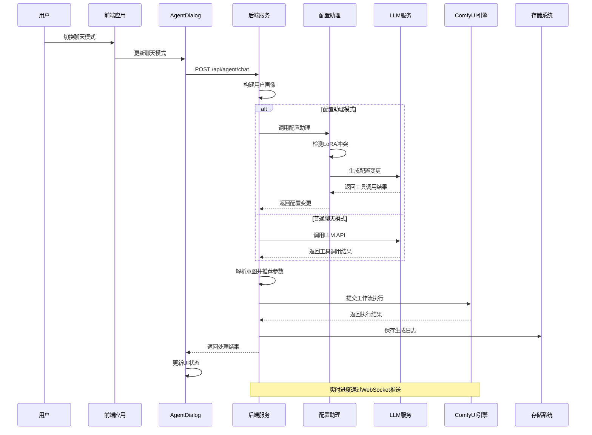
```mermaid
sequenceDiagram
participant User as 用户
participant Frontend as 前端应用
participant Dialog as AgentDialog
participant Backend as 后端服务
participant ConfigAssistant as 配置助理
participant LLM as LLM服务
participant ComfyUI as ComfyUI引擎
participant Storage as 存储系统
User->>Frontend : 切换聊天模式
Frontend->>Dialog : 更新聊天模式
Dialog->>Backend : POST /api/agent/chat
Backend->>Backend : 构建用户画像
alt 配置助理模式
Backend->>ConfigAssistant : 调用配置助理
ConfigAssistant->>ConfigAssistant : 检测LoRA冲突
ConfigAssistant->>LLM : 生成配置变更
LLM-->>ConfigAssistant : 返回工具调用结果
ConfigAssistant-->>Backend : 返回配置变更
else 普通聊天模式
Backend->>LLM : 调用LLM API
LLM-->>Backend : 返回工具调用结果
end
Backend->>Backend : 解析意图并推荐参数
Backend->>ComfyUI : 提交工作流执行
ComfyUI-->>Backend : 返回执行结果
Backend->>Storage : 保存生成日志
Backend-->>Dialog : 返回处理结果
Dialog->>Dialog : 更新UI状态
Note over Backend,ComfyUI : 实时进度通过WebSocket推送
```

**图表来源**
- [server/src/index.ts:85-242](file://server/src/index.ts#L85-L242)
- [server/src/routes/agent.ts:492-602](file://server/src/routes/agent.ts#L492-L602)
- [client/src/components/AgentDialog.tsx:257-281](file://client/src/components/AgentDialog.tsx#L257-L281)

**章节来源**
- [server/src/index.ts:1-264](file://server/src/index.ts#L1-L264)
- [server/src/routes/agent.ts:1-927](file://server/src/routes/agent.ts#L1-L927)

## 详细组件分析

### 1. AI代理对话系统

#### 对话流程

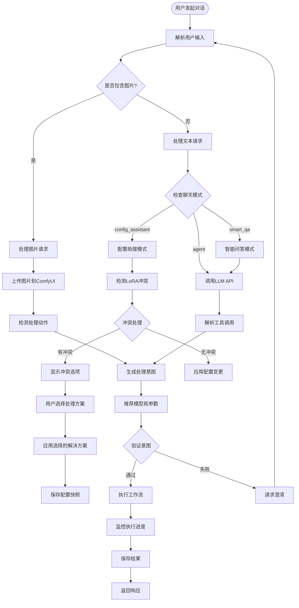
```mermaid
flowchart TD
Start([用户发起对话]) --> ParseInput["解析用户输入"]
ParseInput --> CheckImage{"是否包含图片?"}
CheckImage --> |是| ProcessImage["处理图片请求"]
CheckImage --> |否| ProcessText["处理文本请求"]
ProcessImage --> UploadImage["上传图片到ComfyUI"]
UploadImage --> DetectAction["检测处理动作"]
DetectAction --> GenerateIntent["生成处理意图"]
ProcessText --> CheckMode{"检查聊天模式"}
CheckMode --> |config_assistant| ConfigAssistant["配置助理模式"]
CheckMode --> |smart_qa| SmartQA["智能问答模式"]
CheckMode --> |agent| CallLLM["调用LLM API"]
ConfigAssistant --> DetectConflict["检测LoRA冲突"]
DetectConflict --> ResolveConflict{"冲突处理"}
ResolveConflict --> |有冲突| ShowOptions["显示冲突选项"]
ResolveConflict --> |无冲突| ApplyConfig["应用配置变更"]
ShowOptions --> UserChoice["用户选择处理方案"]
UserChoice --> ApplyResolution["应用选择的解决方案"]
ApplyResolution --> SaveSnapshot["保存配置快照"]
SmartQA --> CallLLM
CallLLM --> ParseToolCall["解析工具调用"]
ParseToolCall --> GenerateIntent
GenerateIntent --> RecommendModel["推荐模型和参数"]
RecommendModel --> ValidateIntent{"验证意图"}
ValidateIntent --> |通过| ExecuteWorkflow["执行工作流"]
ValidateIntent --> |失败| AskClarification["请求澄清"]
ExecuteWorkflow --> MonitorProgress["监控执行进度"]
MonitorProgress --> SaveResults["保存结果"]
SaveResults --> ReturnResponse["返回响应"]
AskClarification --> ParseInput
```

**图表来源**
- [server/src/routes/agent.ts:492-602](file://server/src/routes/agent.ts#L492-L602)
- [server/src/services/llmService.ts:113-197](file://server/src/services/llmService.ts#L113-L197)
- [client/src/components/AgentDialog.tsx:832-879](file://client/src/components/AgentDialog.tsx#L832-L879)

#### 意图解析机制

系统通过多种策略解析用户意图：

1. **直接匹配**：基于关键词的直接匹配
2. **语义理解**：通过LLM进行语义分析
3. **上下文推理**：利用对话历史进行推理
4. **模型推荐**：基于用户偏好和历史使用情况

**章节来源**
- [server/src/services/intentParser.ts:1-537](file://server/src/services/intentParser.ts#L1-L537)
- [server/src/services/llmService.ts:1-354](file://server/src/services/llmService.ts#L1-L354)

### 2. 模型推荐系统

#### 推荐算法


```mermaid
flowchart LR
Input[用户输入] --> ExtractKeywords["提取关键词"]
ExtractKeywords --> SearchLoras["搜索匹配的LoRA"]
SearchLoras --> ScoreCalculation["计算匹配分数"]
ScoreCalculation --> CategoryDedup["按类别去重"]
CategoryDedup --> StrengthSelection["选择推荐强度"]
StrengthSelection --> ModelRecommendation["推荐基础模型"]
ModelRecommendation --> ParameterOptimization["参数优化"]
ParameterOptimization --> FinalRecommendation["最终推荐结果"]
```

**图表来源**
- [server/src/services/intentParser.ts:30-81](file://server/src/services/intentParser.ts#L30-L81)
- [server/src/services/intentParser.ts:140-258](file://server/src/services/intentParser.ts#L140-L258)

#### 推荐规则

| 类别 | 默认强度 | 限制数量 | 说明 |
|------|----------|----------|------|
| 角色 | 0.8 | 1 | 角色LoRA优先级最高 |
| 姿势 | 0.7 | 1 | 姿势LoRA次之 |
| 表情 | 0.65 | 1 | 表情LoRA |
| 风格 | 0.6 | 1 | 风格LoRA |
| 性别 | 0.7 | 1 | 性别相关LoRA |
| 多视角 | 0.7 | 1 | 多视角LoRA |
| 滑块 | 0.5 | 1 | 数量和比例类LoRA |

**章节来源**
- [server/src/services/intentParser.ts:88-130](file://server/src/services/intentParser.ts#L88-L130)
- [model_meta/metadata.json:121-800](file://model_meta/metadata.json#L121-L800)

### 3. 工作流执行系统

#### 执行流程

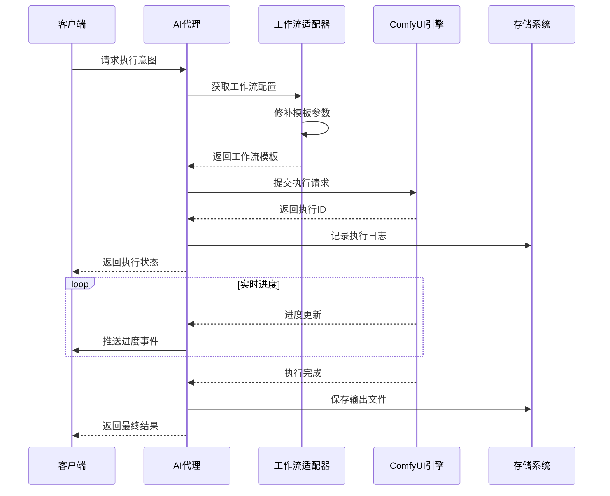
```mermaid
sequenceDiagram
participant Client as 客户端
participant Agent as AI代理
participant Adapter as 工作流适配器
participant ComfyUI as ComfyUI引擎
participant Storage as 存储系统
Client->>Agent : 请求执行意图
Agent->>Adapter : 获取工作流配置
Adapter->>Adapter : 修补模板参数
Adapter-->>Agent : 返回工作流模板
Agent->>ComfyUI : 提交执行请求
ComfyUI-->>Agent : 返回执行ID
Agent->>Storage : 记录执行日志
Agent-->>Client : 返回执行状态
loop 实时进度
ComfyUI-->>Agent : 进度更新
Agent->>Client : 推送进度事件
end
ComfyUI-->>Agent : 执行完成
Agent->>Storage : 保存输出文件
Agent-->>Client : 返回最终结果
```

**图表来源**
- [server/src/routes/agent.ts:633-750](file://server/src/routes/agent.ts#L633-L750)
- [server/src/services/comfyui.ts:47-60](file://server/src/services/comfyui.ts#L47-L60)

**章节来源**
- [server/src/routes/agent.ts:604-800](file://server/src/routes/agent.ts#L604-L800)
- [server/src/services/comfyui.ts:1-285](file://server/src/services/comfyui.ts#L1-L285)

### 4. 状态管理系统

#### 状态存储结构

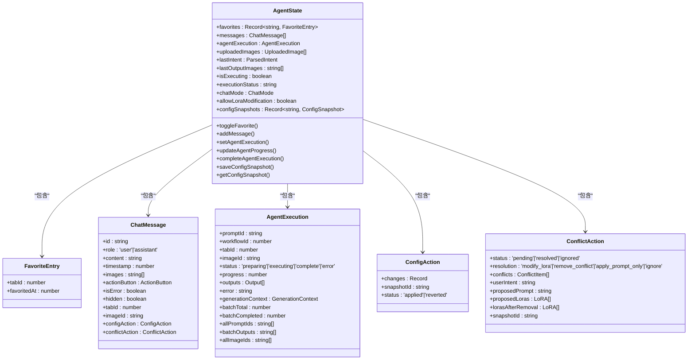
```mermaid
classDiagram
class AgentState {
+favorites : Record~string, FavoriteEntry~
+messages : ChatMessage[]
+agentExecution : AgentExecution
+uploadedImages : UploadedImage[]
+lastIntent : ParsedIntent
+lastOutputImages : string[]
+isExecuting : boolean
+executionStatus : string
+chatMode : ChatMode
+allowLoraModification : boolean
+configSnapshots : Record~string, ConfigSnapshot~
+toggleFavorite()
+addMessage()
+setAgentExecution()
+updateAgentProgress()
+completeAgentExecution()
+saveConfigSnapshot()
+getConfigSnapshot()
}
class FavoriteEntry {
+tabId : number
+favoritedAt : number
}
class ChatMessage {
+id : string
+role : 'user'|'assistant'
+content : string
+timestamp : number
+images : string[]
+actionButton : ActionButton
+isError : boolean
+hidden : boolean
+tabId : number
+imageId : string
+configAction : ConfigAction
+conflictAction : ConflictAction
}
class ConfigAction {
+changes : Record
+snapshotId : string
+status : 'applied'|'reverted'
}
class ConflictAction {
+status : 'pending'|'resolved'|'ignored'
+resolution : 'modify_lora'|'remove_conflict'|'apply_prompt_only'|'ignore'
+conflicts : ConflictItem[]
+userIntent : string
+proposedPrompt : string
+proposedLoras : LoRA[]
+lorasAfterRemoval : LoRA[]
+snapshotId : string
}
class AgentExecution {
+promptId : string
+workflowId : number
+tabId : number
+imageId : string
+status : 'preparing'|'executing'|'complete'|'error'
+progress : number
+outputs : Output[]
+error : string
+generationContext : GenerationContext
+batchTotal : number
+batchCompleted : number
+allPromptIds : string[]
+batchOutputs : string[]
+allImageIds : string[]
}
AgentState --> FavoriteEntry : "包含"
AgentState --> ChatMessage : "包含"
AgentState --> AgentExecution : "包含"
AgentState --> ConfigAction : "包含"
AgentState --> ConflictAction : "包含"
```

**图表来源**
- [client/src/hooks/useAgentStore.ts:54-122](file://client/src/hooks/useAgentStore.ts#L54-L122)
- [client/src/hooks/useAgentStore.ts:34-48](file://client/src/hooks/useAgentStore.ts#L34-L48)

**章节来源**
- [client/src/hooks/useAgentStore.ts:1-337](file://client/src/hooks/useAgentStore.ts#L1-L337)

## 聊天模式系统

### 1. 三种聊天模式设计

系统新增了AgentDialog组件的三种聊天模式，每种模式都有特定的功能和用途：

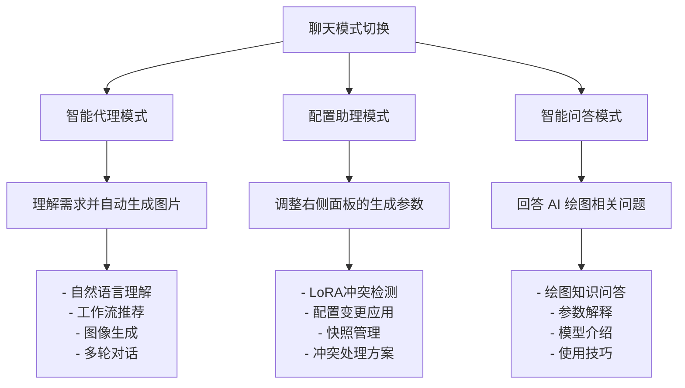
```mermaid
flowchart TD
ModeSwitch["聊天模式切换"] --> AgentMode["智能代理模式"]
ModeSwitch --> ConfigMode["配置助理模式"]
ModeSwitch --> QAMode["智能问答模式"]
AgentMode --> AgentDesc["理解需求并自动生成图片"]
AgentDesc --> AgentFeatures["- 自然语言理解<br/>- 工作流推荐<br/>- 图像生成<br/>- 多轮对话"]
ConfigMode --> ConfigDesc["调整右侧面板的生成参数"]
ConfigDesc --> ConfigFeatures["- LoRA冲突检测<br/>- 配置变更应用<br/>- 快照管理<br/>- 冲突处理方案"]
QAMode --> QADesc["回答 AI 绘图相关问题"]
QADesc --> QAFeatures["- 绘图知识问答<br/>- 参数解释<br/>- 模型介绍<br/>- 使用技巧"]
```

**图表来源**
- [client/src/components/AgentDialog.tsx:27-31](file://client/src/components/AgentDialog.tsx#L27-L31)

#### 智能代理模式 (agent)

智能代理模式是最核心的功能，负责理解用户需求并自动生成相应的图像。

- **主要功能**：自然语言理解、工作流推荐、图像生成
- **特点**：支持多轮对话、自动解析用户意图、推荐合适的模型和参数
- **适用场景**：直接的图像生成需求、创意构思、工作流选择

#### 配置助理模式 (config_assistant)

配置助理模式专注于调整和优化生成参数，提供智能的配置建议和冲突检测。

- **主要功能**：配置参数调整、LoRA冲突检测、智能配置建议
- **特点**：支持LoRA锁定模式、冲突处理、配置快照管理
- **适用场景**：参数微调、风格调整、质量优化

#### 智能问答模式 (smart_qa)

智能问答模式提供专门的绘图知识和技巧解答。

- **主要功能**：绘图知识问答、参数解释、模型介绍、使用技巧
- **特点**：专业性强、知识丰富、易于理解
- **适用场景**：学习新功能、解决技术问题、获取使用建议

**章节来源**
- [client/src/components/AgentDialog.tsx:27-31](file://client/src/components/AgentDialog.tsx#L27-L31)
- [server/src/routes/agent.ts:755-1044](file://server/src/routes/agent.ts#L755-L1044)

### 2. 模式切换机制

系统实现了灵活的聊天模式切换机制，支持用户在不同模式间无缝切换：

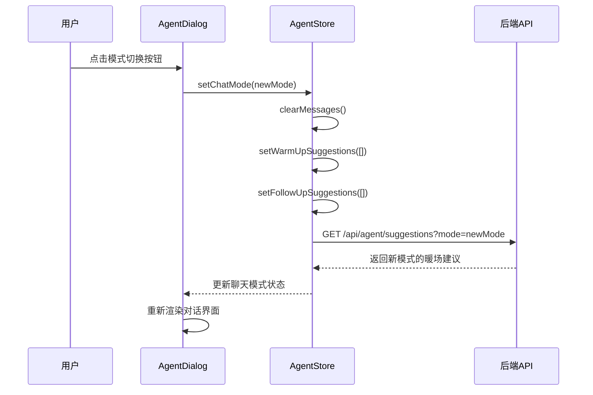
```mermaid
sequenceDiagram
participant User as 用户
participant Dialog as AgentDialog
participant Store as AgentStore
participant API as 后端API
User->>Dialog : 点击模式切换按钮
Dialog->>Store : setChatMode(newMode)
Store->>Store : clearMessages()
Store->>Store : setWarmUpSuggestions([])
Store->>Store : setFollowUpSuggestions([])
Store->>API : GET /api/agent/suggestions?mode=newMode
API-->>Store : 返回新模式的暖场建议
Store-->>Dialog : 更新聊天模式状态
Dialog->>Dialog : 重新渲染对话界面
```

**图表来源**
- [client/src/components/AgentDialog.tsx:257-281](file://client/src/components/AgentDialog.tsx#L257-L281)

**章节来源**
- [client/src/components/AgentDialog.tsx:257-281](file://client/src/components/AgentDialog.tsx#L257-L281)

## 配置助理与冲突检测

### 1. 配置助理系统架构

配置助理模式是系统的重要增强功能，提供了智能的配置管理和冲突检测能力。

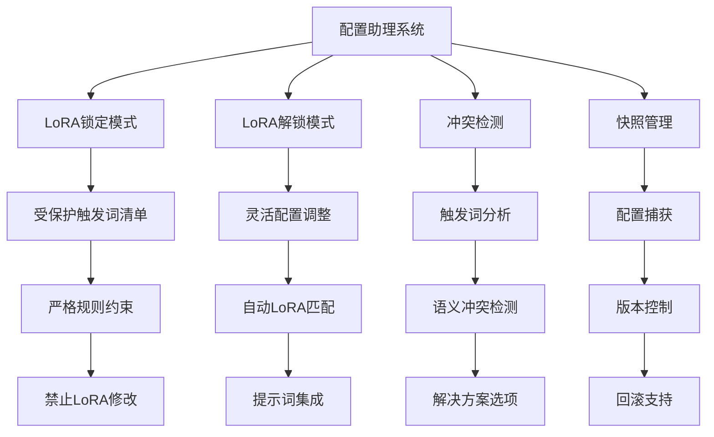
```mermaid
flowchart TD
ConfigAssistant["配置助理系统"] --> LockMode["LoRA锁定模式"]
ConfigAssistant --> UnlockMode["LoRA解锁模式"]
ConfigAssistant --> ConflictDetection["冲突检测"]
ConfigAssistant --> SnapshotManagement["快照管理"]
LockMode --> ProtectedTriggers["受保护触发词清单"]
ProtectedTriggers --> StrictRules["严格规则约束"]
StrictRules --> NoLoraChanges["禁止LoRA修改"]
UnlockMode --> FlexibleConfig["灵活配置调整"]
FlexibleConfig --> AutomaticMatching["自动LoRA匹配"]
AutomaticMatching --> PromptIntegration["提示词集成"]
ConflictDetection --> TriggerWordAnalysis["触发词分析"]
TriggerWordAnalysis --> SemanticConflict["语义冲突检测"]
SemanticConflict --> ResolutionOptions["解决方案选项"]
SnapshotManagement --> ConfigCapture["配置捕获"]
ConfigCapture --> VersionControl["版本控制"]
VersionControl --> RollbackSupport["回滚支持"]
```

**图表来源**
- [server/src/services/llmService.ts:476-669](file://server/src/services/llmService.ts#L476-L669)
- [server/src/routes/agent.ts:784-1044](file://server/src/routes/agent.ts#L784-L1044)

#### LoRA锁定机制

配置助理模式支持LoRA锁定功能，为用户提供更严格的配置控制：

- **锁定模式**：禁止任何LoRA修改，只能调整其他参数
- **受保护触发词**：必须在提示词中原样保留的触发词清单
- **严格规则**：不允许删除或修改受保护触发词
- **冲突检测**：自动检测用户意图与受保护触发词的冲突

#### 冲突检测流程

系统实现了智能的LoRA冲突检测机制：

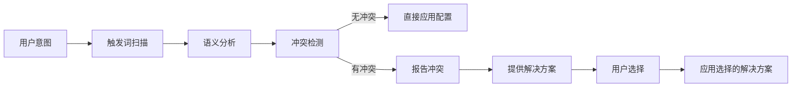
```mermaid
flowchart LR
UserIntent["用户意图"] --> TriggerWordScan["触发词扫描"]
TriggerWordScan --> SemanticAnalysis["语义分析"]
SemanticAnalysis --> ConflictDetection["冲突检测"]
ConflictDetection --> |无冲突| DirectApply["直接应用配置"]
ConflictDetection --> |有冲突| ConflictReport["报告冲突"]
ConflictReport --> ResolutionOptions["提供解决方案"]
ResolutionOptions --> UserChoice["用户选择"]
UserChoice --> ApplyResolution["应用选择的解决方案"]
```

**图表来源**
- [server/src/services/llmService.ts:598-627](file://server/src/services/llmService.ts#L598-L627)
- [server/src/routes/agent.ts:972-1019](file://server/src/routes/agent.ts#L972-L1019)

**章节来源**
- [server/src/services/llmService.ts:476-669](file://server/src/services/llmService.ts#L476-L669)
- [server/src/routes/agent.ts:784-1044](file://server/src/routes/agent.ts#L784-L1044)

### 2. 冲突处理方案

当检测到LoRA冲突时，系统提供四种处理方案供用户选择：

1. **修改LoRA并应用**：同时修改LoRA和提示词，自动匹配新的LoRA
2. **删除冲突LoRA**：移除冲突的LoRA并更新提示词
3. **仅应用提示词**：保持LoRA不变，只修改提示词
4. **忽略操作**：不进行任何修改，仅记录用户的选择

**章节来源**
- [client/src/components/AgentDialog.tsx:832-879](file://client/src/components/AgentDialog.tsx#L832-L879)
- [server/src/routes/agent.ts:972-1019](file://server/src/routes/agent.ts#L972-L1019)

## 配置快照与版本控制

### 1. 配置快照系统

系统引入了完整的配置快照管理功能，支持配置变更的版本控制和回滚：

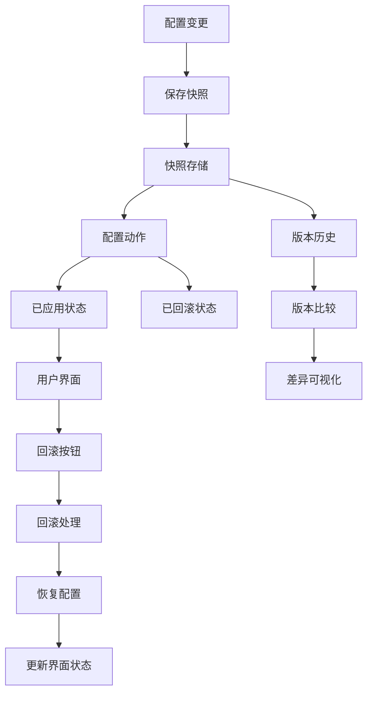
```mermaid
flowchart TD
ConfigChange["配置变更"] --> SaveSnapshot["保存快照"]
SaveSnapshot --> SnapshotStore["快照存储"]
SnapshotStore --> ConfigAction["配置动作"]
ConfigAction --> AppliedState["已应用状态"]
ConfigAction --> RevertedState["已回滚状态"]
AppliedState --> UserInterface["用户界面"]
UserInterface --> RevertButton["回滚按钮"]
RevertButton --> RevertProcess["回滚处理"]
RevertProcess --> RestoreConfig["恢复配置"]
RestoreConfig --> UpdateUI["更新界面状态"]
SnapshotStore --> VersionHistory["版本历史"]
VersionHistory --> Comparison["版本比较"]
Comparison --> DiffVisualization["差异可视化"]
```

**图表来源**
- [client/src/hooks/useAgentStore.ts:5-10](file://client/src/hooks/useAgentStore.ts#L5-L10)
- [client/src/hooks/useAgentStore.ts:181-185](file://client/src/hooks/useAgentStore.ts#L181-L185)

#### 快照保存机制

系统在关键配置变更时自动保存快照：

1. **冲突处理**：用户选择冲突解决方案时保存快照
2. **配置应用**：应用配置变更时保存快照
3. **LoRA修改**：进行LoRA相关修改时保存快照

#### 快照存储结构

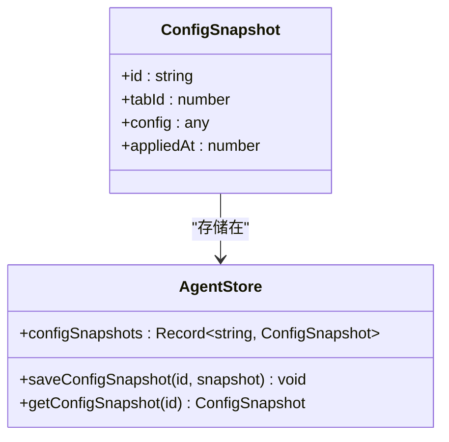
```mermaid
classDiagram
class ConfigSnapshot {
+id : string
+tabId : number
+config : any
+appliedAt : number
}
class AgentStore {
+configSnapshots : Record~string, ConfigSnapshot~
+saveConfigSnapshot(id, snapshot) void
+getConfigSnapshot(id) ConfigSnapshot
}
ConfigSnapshot --> AgentStore : "存储在"
```

**图表来源**
- [client/src/hooks/useAgentStore.ts:5-10](file://client/src/hooks/useAgentStore.ts#L5-L10)

**章节来源**
- [client/src/hooks/useAgentStore.ts:181-185](file://client/src/hooks/useAgentStore.ts#L181-L185)
- [client/src/components/AgentDialog.tsx:849-857](file://client/src/components/AgentDialog.tsx#L849-L857)

### 2. 回滚功能实现

系统提供了完整的配置回滚功能，支持用户撤销配置变更：

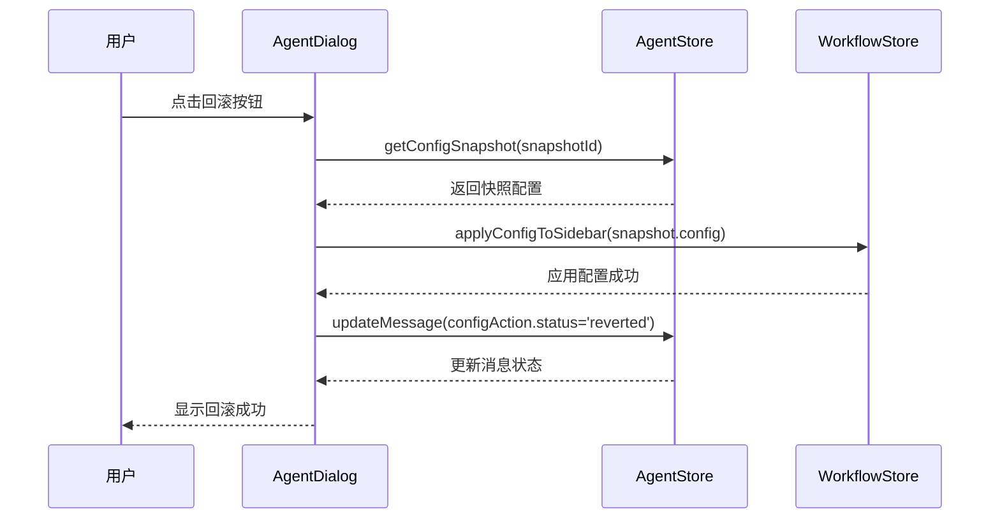
```mermaid
sequenceDiagram
participant User as 用户
participant Dialog as AgentDialog
participant Store as AgentStore
participant WorkflowStore as WorkflowStore
User->>Dialog : 点击回滚按钮
Dialog->>Store : getConfigSnapshot(snapshotId)
Store-->>Dialog : 返回快照配置
Dialog->>WorkflowStore : applyConfigToSidebar(snapshot.config)
WorkflowStore-->>Dialog : 应用配置成功
Dialog->>Store : updateMessage(configAction.status='reverted')
Store-->>Dialog : 更新消息状态
Dialog-->>User : 显示回滚成功
```

**图表来源**
- [client/src/components/AgentDialog.tsx:812-830](file://client/src/components/AgentDialog.tsx#L812-L830)

**章节来源**
- [client/src/components/AgentDialog.tsx:812-830](file://client/src/components/AgentDialog.tsx#L812-L830)

## 提示词差异可视化

### 1. PromptDiff组件设计

系统引入了PromptDiff组件，用于展示提示词的标签级修改差异：

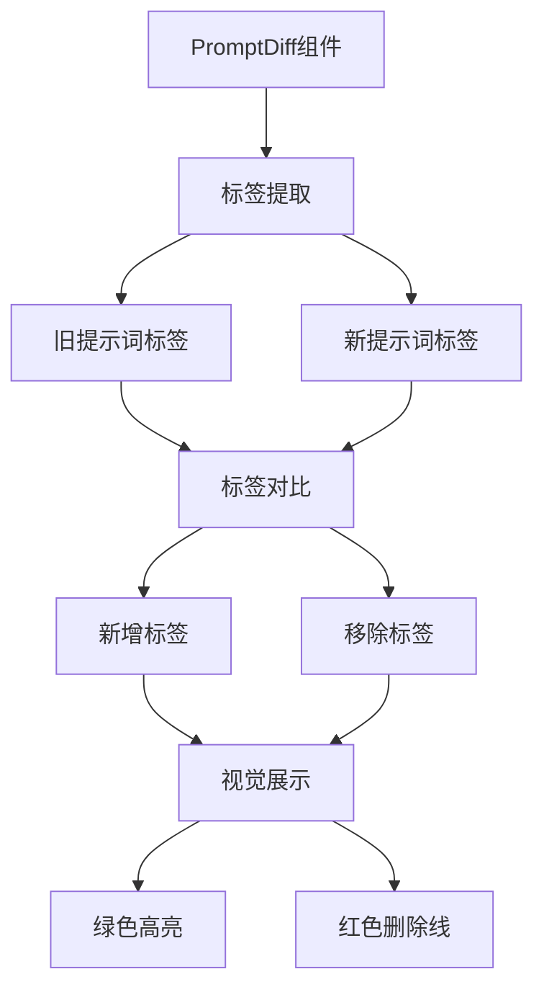
```mermaid
flowchart TD
PromptDiff["PromptDiff组件"] --> TagExtraction["标签提取"]
TagExtraction --> OldTags["旧提示词标签"]
TagExtraction --> NewTags["新提示词标签"]
OldTags --> TagComparison["标签对比"]
NewTags --> TagComparison
TagComparison --> AddedTags["新增标签"]
TagComparison --> RemovedTags["移除标签"]
AddedTags --> VisualDisplay["视觉展示"]
RemovedTags --> VisualDisplay
VisualDisplay --> GreenHighlight["绿色高亮"]
VisualDisplay --> RedStrikethrough["红色删除线"]
```

**图表来源**
- [client/src/components/PromptDiff.tsx:9-24](file://client/src/components/PromptDiff.tsx#L9-L24)

#### 标签级对比算法

PromptDiff组件实现了精确的标签级对比算法：

1. **标签分割**：按逗号分割提示词，去除空白字符
2. **标准化处理**：忽略大小写，标准化标签格式
3. **集合对比**：使用Set数据结构进行高效对比
4. **差异标记**：标记新增和移除的标签

#### 可视化设计

组件提供了直观的视觉反馈：

- **新增标签**：绿色背景高亮显示，使用"+"前缀
- **移除标签**：红色背景显示，带有删除线效果
- **布局设计**：标签以可折叠方式排列，支持大量标签展示

**章节来源**
- [client/src/components/PromptDiff.tsx:1-125](file://client/src/components/PromptDiff.tsx#L1-L125)

### 2. 差异展示集成

系统在多个场景中集成了提示词差异展示功能：

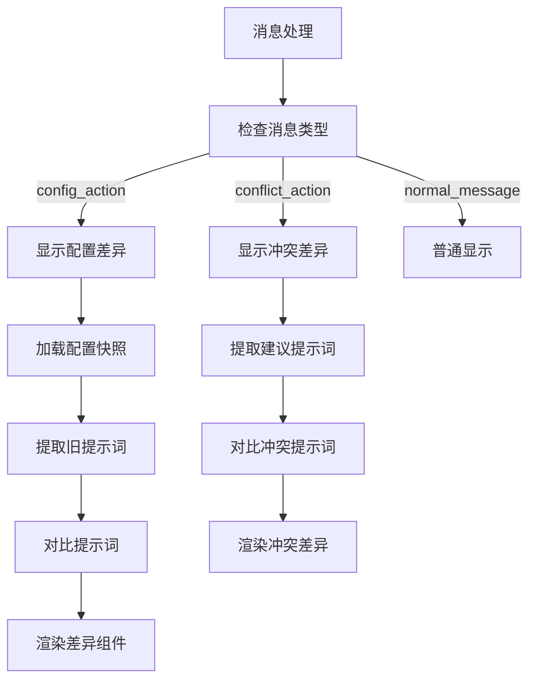
```mermaid
flowchart TD
MessageProcessing["消息处理"] --> CheckMessageType["检查消息类型"]
CheckMessageType --> |config_action| ShowDiff["显示配置差异"]
CheckMessageType --> |conflict_action| ShowConflictDiff["显示冲突差异"]
CheckMessageType --> |normal_message| NormalDisplay["普通显示"]
ShowDiff --> LoadSnapshot["加载配置快照"]
LoadSnapshot --> ExtractOldPrompt["提取旧提示词"]
ExtractOldPrompt --> ComparePrompts["对比提示词"]
ComparePrompts --> RenderDiff["渲染差异组件"]
ShowConflictDiff --> ExtractProposedPrompt["提取建议提示词"]
ExtractProposedPrompt --> CompareConflictPrompts["对比冲突提示词"]
CompareConflictPrompts --> RenderConflictDiff["渲染冲突差异"]
```

**图表来源**
- [client/src/components/AgentDialog.tsx:1827-1833](file://client/src/components/AgentDialog.tsx#L1827-L1833)
- [client/src/components/AgentDialog.tsx:2058-2063](file://client/src/components/AgentDialog.tsx#L2058-L2063)

**章节来源**
- [client/src/components/AgentDialog.tsx:1827-1833](file://client/src/components/AgentDialog.tsx#L1827-L1833)
- [client/src/components/AgentDialog.tsx:2058-2063](file://client/src/components/AgentDialog.tsx#L2058-L2063)

## 用户成熟度与LoRA探索系统

### 1. 三阶段用户成熟度评估

系统引入了基于用户使用行为的三阶段成熟度评估算法，为不同成熟度的用户提供差异化建议生成策略。

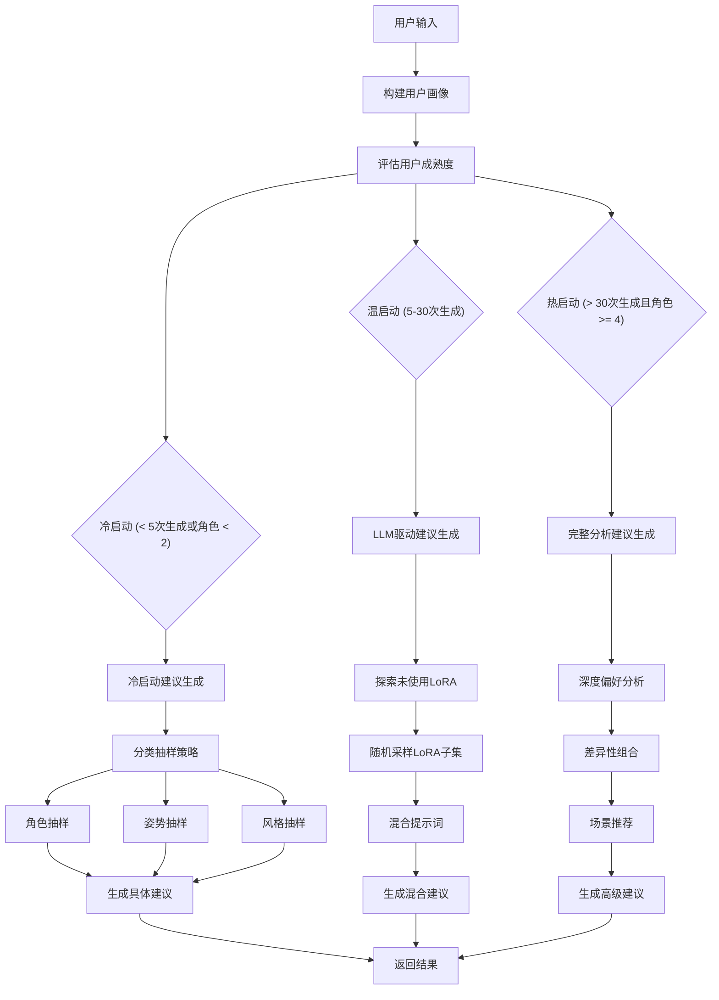
```mermaid
flowchart TD
UserInput[用户输入] --> BuildProfile["构建用户画像"]
BuildProfile --> GetMaturity["评估用户成熟度"]
GetMaturity --> Cold{"冷启动 (< 5次生成或角色 < 2)"}
GetMaturity --> Warm{"温启动 (5-30次生成)"}
GetMaturity --> Hot{"热启动 (> 30次生成且角色 >= 4)"}
Cold --> ColdStart["冷启动建议生成"]
ColdStart --> CategorySampling["分类抽样策略"]
CategorySampling --> RoleSampling["角色抽样"]
CategorySampling --> PoseSampling["姿势抽样"]
CategorySampling --> StyleSampling["风格抽样"]
RoleSampling --> ColdSuggestion["生成具体建议"]
PoseSampling --> ColdSuggestion
StyleSampling --> ColdSuggestion
Warm --> LLMDriven["LLM驱动建议生成"]
LLMDriven --> ExploreUnused["探索未使用LoRA"]
ExploreUnused --> RandomSample["随机采样LoRA子集"]
RandomSample --> MixedPrompt["混合提示词"]
MixedPrompt --> WarmSuggestion["生成混合建议"]
Hot --> FullAnalysis["完整分析建议生成"]
FullAnalysis --> DeepInsight["深度偏好分析"]
DeepInsight --> VarianceCombination["差异性组合"]
VarianceCombination --> SceneRecommendation["场景推荐"]
SceneRecommendation --> HotSuggestion["生成高级建议"]
ColdSuggestion --> ReturnResult["返回结果"]
WarmSuggestion --> ReturnResult
HotSuggestion --> ReturnResult
```

**图表来源**
- [server/src/routes/agent.ts:177-466](file://server/src/routes/agent.ts#L177-L466)
- [docs/系统提示词优化方案.md:135-176](file://docs/系统提示词优化方案.md#L135-L176)

#### 成熟度评估标准

| 阶段 | 评估指标 | 行为特征 | 建议策略 |
|------|----------|----------|----------|
| 冷启动 (cold) | 生成次数 < 5次 或 角色种类 < 2 | 新手用户，缺乏使用经验 | 分类抽样，避免LLM调用 |
| 温启动 (warm) | 5次 ≤ 生成次数 < 30次 或 2 ≤ 角色种类 < 4 | 中级用户，有一定使用经验 | LLM混合画像+探索 |
| 热启动 (hot) | 生成次数 ≥ 30次 且 角色种类 ≥ 4 | 高级用户，熟练使用系统 | 完整分析，深度探索 |

#### 冷启动建议生成算法

冷启动阶段采用分类抽样策略，从可用的LoRA模型中按类别抽取代表性模型：

1. **角色抽样**：从角色类别中随机抽取1个代表性LoRA
2. **姿势抽样**：从姿势类别中随机抽取1个代表性LoRA  
3. **风格抽样**：从风格类别中随机抽取1个代表性LoRA
4. **组合生成**：将抽样的LoRA组合生成具体的图像建议

#### 温启动探索算法

温启动阶段结合用户画像和LoRA探索策略：

1. **用户画像分析**：基于用户历史使用数据构建偏好画像
2. **未使用LoRA探索**：从可用模型库中筛选用户未使用过的LoRA
3. **随机采样**：从探索列表中随机抽取10-15个LoRA作为候选
4. **混合提示词**：将用户画像和探索列表组合生成LLM提示词

#### 热启动深度分析

热启动阶段采用完整的用户偏好分析：

1. **深度偏好挖掘**：分析用户使用模式和偏好趋势
2. **差异性组合**：生成具有明显差异性的LoRA组合建议
3. **场景化推荐**：基于用户风格偏好生成场景/氛围图建议
4. **混搭创新**：将不同维度的LoRA进行创新性混搭

**章节来源**
- [server/src/routes/agent.ts:177-466](file://server/src/routes/agent.ts#L177-L466)
- [docs/系统提示词优化方案.md:135-176](file://docs/系统提示词优化方案.md#L135-L176)

### 2. 基于用户画像的LoRA探索算法

系统实现了智能的LoRA探索算法，帮助用户发现新的模型组合和风格。

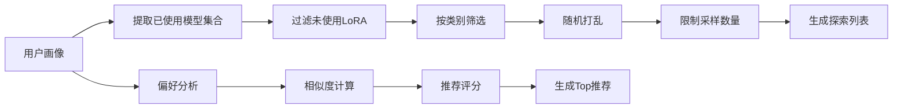
```mermaid
flowchart LR
UserProfile[用户画像] --> UsedModels["提取已使用模型集合"]
UsedModels --> UnusedFilter["过滤未使用LoRA"]
UnusedFilter --> CategoryFilter["按类别筛选"]
CategoryFilter --> RandomShuffle["随机打乱"]
RandomShuffle --> SampleSize["限制采样数量"]
SampleSize --> ExplorationList["生成探索列表"]
UserProfile --> PreferenceAnalysis["偏好分析"]
PreferenceAnalysis --> SimilarityCalculation["相似度计算"]
SimilarityCalculation --> RecommendationScoring["推荐评分"]
RecommendationScoring --> TopRecommendations["生成Top推荐"]
```

**图表来源**
- [server/src/routes/agent.ts:256-279](file://server/src/routes/agent.ts#L256-L279)

#### 探索算法实现

```typescript
function getUnusedLorasForExploration(
  profile: any,
  metadata: any,
  count: number = 15
): Array<{ nickname: string; category: string }> {
  const usedModels = new Set((profile.loraPreferences || []).map((lp: any) => lp.model));
  
  const unused = Object.entries(metadata)
    .filter(([key, meta]: [string, any]) => {
      return meta.nickname
        && ['角色', '姿势', '风格'].includes(meta.category)
        && !usedModels.has(key);
    })
    .map(([key, meta]: [string, any]) => ({
      nickname: meta.nickname,
      category: meta.category,
    }));
  
  // 随机打乱后取指定数量
  unused.sort(() => Math.random() - 0.5);
  return unused.slice(0, count);
}
```

#### 用户画像构建与管理

系统通过`buildUserProfile`函数构建完整的用户偏好画像：

```mermaid
classDiagram
class UserPreferenceProfile {
+modelPreferences : ModelPreference[]
+loraPreferences : LoRAPreference[]
+paramPreferences : ParamPreference
+styleFeatures : StyleFeature[]
+usageStats : UsageStat
+frequentCombinations : Combination[]
}
class ModelPreference {
+model : string
+score : number
+useCount : number
+favoriteCount : number
}
class LoRAPreference {
+model : string
+score : number
+useCount : number
+favoriteCount : number
+avgStrength : number
}
class ParamPreference {
+preferredSize : Size
+preferredSteps : number
+preferredCfg : number
+preferredSampler : string
+preferredScheduler : string
}
class StyleFeature {
+tag : string
+count : number
}
class UsageStat {
+totalGenerations : number
+totalFavorites : number
+tab7Count : number
+tab9Count : number
+lastActiveTime : number
}
class Combination {
+model : string
+loras : string[]
+count : number
}
UserPreferenceProfile --> ModelPreference : "包含"
UserPreferenceProfile --> LoRAPreference : "包含"
UserPreferenceProfile --> ParamPreference : "包含"
UserPreferenceProfile --> StyleFeature : "包含"
UserPreferenceProfile --> UsageStat : "包含"
UserPreferenceProfile --> Combination : "包含"
```

**图表来源**
- [server/src/services/profileService.ts:6-49](file://server/src/services/profileService.ts#L6-L49)

**章节来源**
- [server/src/services/profileService.ts:1-238](file://server/src/services/profileService.ts#L1-L238)
- [server/src/routes/agent.ts:256-279](file://server/src/routes/agent.ts#L256-L279)

## 依赖关系分析

### 1. 技术栈依赖

```mermaid
graph TB
subgraph "前端依赖"
A[React 19.0.0]
B[TypeScript 5.7.0]
C[Zustand 5.0.0]
D[Lucide React 0.468.0]
E[AgentDialog组件]
F[PromptDiff组件]
G[AgentFab浮动按钮]
end
subgraph "后端依赖"
H[Express 4.21.0]
I[TypeScript 5.7.0]
J[WS 8.18.0]
K[node-fetch 3.3.2]
end
subgraph "AI服务"
L[Grok API]
M[OpenAI兼容接口]
N[配置助理服务]
O[冲突检测器]
end
subgraph "图像处理"
P[ComfyUI 1.0+]
Q[WebSocket]
R[FormData]
end
subgraph "用户画像服务"
S[ProfileService]
T[UserPreferenceProfile]
U[ConfigSnapshot管理]
end
A --> C
E --> F
E --> G
H --> J
L --> M
N --> O
P --> Q
P --> R
S --> T
S --> U
```

**图表来源**
- [client/package.json:11-25](file://client/package.json#L11-L25)
- [server/package.json:11-28](file://server/package.json#L11-L28)

### 2. 核心模块依赖

```mermaid
graph LR
subgraph "核心模块"
A[Agent Router]
B[LLM Service]
C[Intent Parser]
D[Agent Service]
E[Profile Service]
F[Config Assistant]
G[PromptDiff Component]
end
subgraph "支持模块"
H[ComfyUI Service]
I[Session Manager]
J[Model Metadata]
K[Workflow Adapters]
L[Suggestion Generator]
M[Config Snapshot Store]
end
subgraph "前端模块"
N[Agent Store]
O[UI Components]
P[WebSocket Hook]
Q[AgentDialog]
R[PromptDiff]
end
A --> B
A --> C
A --> D
A --> E
A --> F
A --> G
B --> H
C --> J
D --> H
D --> I
E --> J
F --> M
G --> N
Q --> R
Q --> M
R --> N
N --> O
O --> P
P --> A
```

**图表来源**
- [server/src/index.ts:8-16](file://server/src/index.ts#L8-L16)
- [server/src/routes/agent.ts:1-14](file://server/src/routers/agent.ts#L1-L14)

**章节来源**
- [package.json:1-15](file://package.json#L1-L15)
- [server/src/index.ts:1-264](file://server/src/index.ts#L1-L264)

## 性能考虑

### 1. 并发处理优化

系统采用以下策略优化并发性能：

- **单实例WebSocket连接**：确保每个客户端只有一个WebSocket连接
- **事件缓冲机制**：防止客户端连接延迟导致的进度丢失
- **异步文件操作**：生成日志和收藏操作不阻塞主线程
- **缓存机制**：模型元数据缓存减少文件读取开销
- **成熟度评估缓存**：避免重复计算用户成熟度
- **配置快照缓存**：减少重复的配置比较操作

### 2. 内存管理

- **及时清理**：完成的执行任务自动清理事件缓冲
- **会话隔离**：每个会话独立的输出目录和日志
- **资源释放**：WebSocket断开时自动释放相关资源
- **画像数据管理**：定期清理过期的用户画像数据
- **快照生命周期管理**：自动清理过期的配置快照

### 3. 网络优化

- **CORS配置**：允许本地开发环境访问
- **静态文件服务**：直接提供输出文件和模型缩略图
- **压缩传输**：WebSocket消息的高效序列化
- **建议生成优化**：冷启动阶段避免LLM调用，提升响应速度
- **模式切换优化**：懒加载模式相关的建议数据

## 故障排除指南

### 1. 常见问题诊断

#### ComfyUI连接问题

**症状**：WebSocket连接失败，无法接收进度更新

**解决方案**：
1. 确认ComfyUI在`http://localhost:8188`运行
2. 检查防火墙设置
3. 验证网络连接稳定性

#### LLM API错误

**症状**：AI代理无法生成建议或回复

**解决方案**：
1. 检查Grok API密钥配置
2. 验证网络连接
3. 查看API响应状态码
4. 检查成熟度评估算法的输入数据格式

#### 模型加载失败

**症状**：工作流执行时报模型找不到错误

**解决方案**：
1. 确认模型文件存在于ComfyUI模型目录
2. 检查模型元数据文件完整性
3. 验证模型文件格式正确性

#### 成熟度评估异常

**症状**：用户成熟度评估结果不准确

**解决方案**：
1. 检查用户画像数据的完整性
2. 验证LoRA使用记录的准确性
3. 确认评估标准的合理性
4. 查看日志中的评估过程

#### 配置助理模式问题

**症状**：配置助理无法正常工作或冲突检测失效

**解决方案**：
1. 检查LoRA锁定设置是否正确
2. 验证受保护触发词清单的完整性
3. 确认冲突检测算法的输入参数
4. 查看配置快照的保存和恢复过程

#### 提示词差异显示问题

**症状**：PromptDiff组件无法正确显示标签差异

**解决方案**：
1. 检查旧提示词和新提示词的数据格式
2. 验证标签分割和标准化处理
3. 确认差异对比算法的正确性
4. 查看组件的渲染逻辑

### 2. 日志分析

系统提供了详细的日志记录机制：

- **服务器启动日志**：显示端口、输出目录等信息
- **WebSocket连接日志**：记录连接建立和断开
- **执行错误日志**：捕获工作流执行异常
- **LLM调用日志**：记录API调用和响应
- **成熟度评估日志**：记录用户成熟度计算过程
- **LoRA探索日志**：记录模型探索和推荐过程
- **配置助理日志**：记录配置变更和冲突处理
- **快照管理日志**：记录配置快照的保存和恢复

**章节来源**
- [server/src/index.ts:247-261](file://server/src/index.ts#L247-L261)
- [server/src/services/llmService.ts:72-76](file://server/src/services/llmService.ts#L72-L76)

## 结论

AI智能代理系统通过将先进的LLM技术和传统的图像生成工作流相结合，为用户提供了一个强大而易用的AI图像创作平台。系统的主要优势包括：

### 核心优势

1. **自然语言交互**：用户可以通过自然语言描述复杂的图像生成需求
2. **智能推荐**：基于用户偏好和上下文的智能模型和参数推荐
3. **工作流编排**：支持多步骤任务的自动编排和执行
4. **实时反馈**：通过WebSocket提供实时的执行进度反馈
5. **可扩展性**：模块化的架构设计支持新功能的轻松扩展
6. **用户成熟度适应**：智能识别用户学习曲线并提供相应级别的建议
7. **LoRA智能探索**：基于用户画像的模型发现和推荐算法
8. **多模式聊天界面**：智能代理、配置助理、智能问答三种模式满足不同需求
9. **配置快照管理**：支持配置变更的版本控制和回滚
10. **智能冲突检测**：自动识别和处理LoRA配置冲突
11. **提示词差异可视化**：直观展示标签级修改对比

### 技术特色

- **适配器模式**：为不同工作流提供统一的接口
- **意图解析**：复杂的自然语言理解和意图提取
- **状态管理**：完整的会话和执行状态跟踪
- **实时通信**：高效的WebSocket通信机制
- **三阶段成熟度评估**：冷启动、温启动、热启动三级用户适应策略
- **智能LoRA探索**：基于用户画像的模型发现算法
- **用户画像管理**：全面的用户偏好和使用行为分析
- **配置助理系统**：智能的参数调整和冲突处理
- **快照管理**：完整的配置版本控制
- **差异可视化**：直观的提示词修改对比

### 应用前景

该系统不仅适用于个人创作者，也可作为企业级图像生成服务平台的基础架构，为各种图像处理需求提供智能化解决方案。通过持续的功能扩展和技术优化，系统有望成为AI图像创作领域的重要工具。

**更新** 本次更新新增了AgentDialog组件的三种聊天模式（智能代理、配置助理、智能问答）、PromptDiff组件用于提示词差异可视化、增强的LoRA冲突检测和配置快照功能。这些新功能显著提升了系统的智能化程度、用户体验和配置管理能力，使系统能够更好地适应不同用户的需求和使用场景。