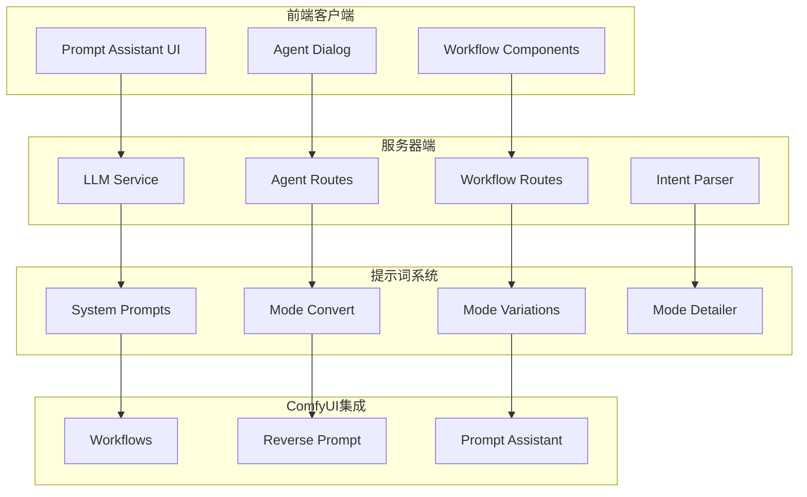
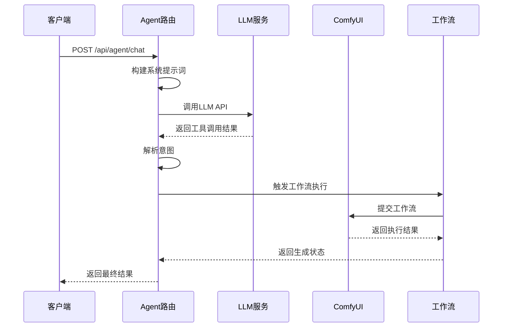
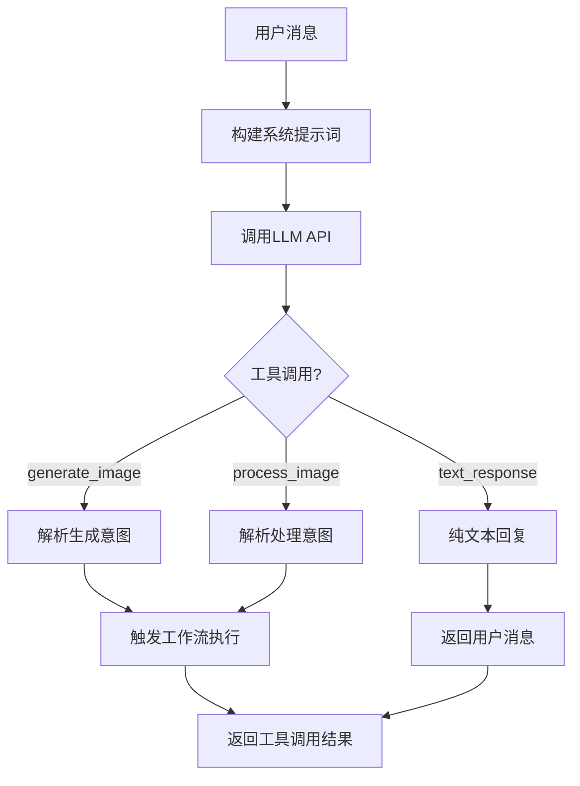
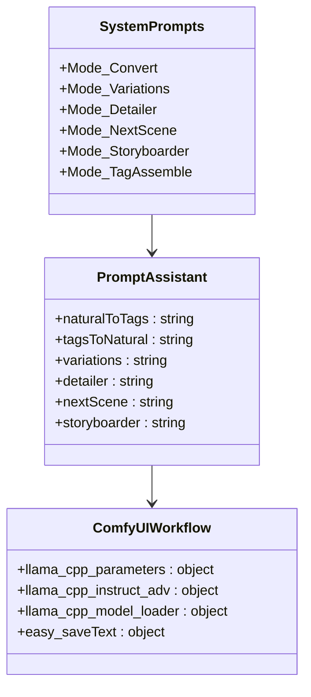
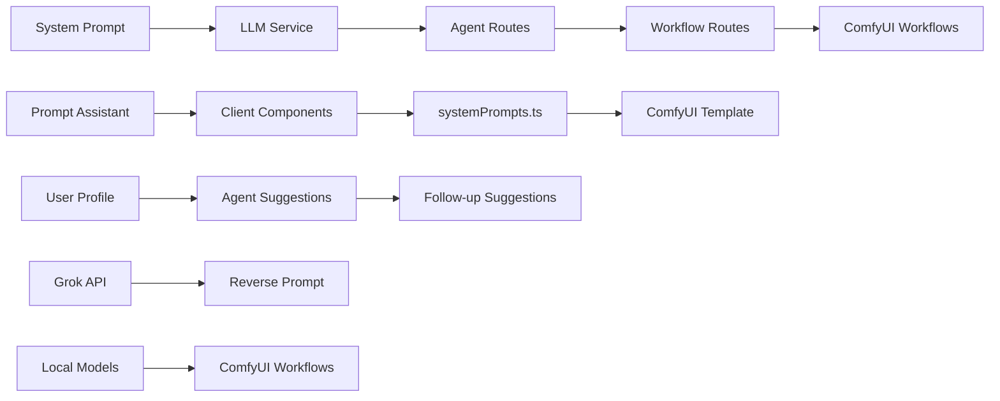

# LLM系统提示词汇总

<cite>
**本文档引用的文件**
- [docs/SystemPrompt.txt](file://docs/SystemPrompt.txt)
- [docs/LLM系统提示词汇总.md](file://docs/LLM系统提示词汇总.md)
- [docs/提示词助理开发需求/SystemPrompt.txt](file://docs/提示词助理开发需求/SystemPrompt.txt)
- [docs/系统提示词优化方案.md](file://docs/系统提示词优化方案.md)
- [client/src/components/prompt-assistant/systemPrompts.ts](file://client/src/components/prompt-assistant/systemPrompts.ts)
- [server/src/services/llmService.ts](file://server/src/services/llmService.ts)
- [server/src/routes/agent.ts](file://server/src/routes/agent.ts)
- [server/src/routes/workflow.ts](file://server/src/routes/workflow.ts)
- [ComfyUI_API/Pix2Real-提示词助手.json](file://ComfyUI_API/Pix2Real-提示词助手.json)
</cite>

## 更新摘要
**变更内容**
- 增强了系统提示词的安全性设计，包括明确的角色定义和XML隔离机制
- 优化了提示词助手模式的输出格式标准化和视觉直译主义
- 完善了Grok图像反推功能的风格检测规则
- 提升了系统提示词文档的组织结构和清晰度
- 改进了用户消息模板的安全性，增加了XML隔离标签

## 目录
1. [简介](#简介)
2. [项目结构](#项目结构)
3. [核心组件](#核心组件)
4. [架构概览](#架构概览)
5. [详细组件分析](#详细组件分析)
6. [依赖关系分析](#依赖关系分析)
7. [性能考虑](#性能考虑)
8. [故障排除指南](#故障排除指南)
9. [结论](#结论)

## 简介

本项目是一个基于LLM的AI图像生成助手系统，专注于二次元与真实人物之间的转换以及相关的图像处理功能。系统通过精心设计的系统提示词（System Prompt）来指导大语言模型的行为，确保生成的图像符合用户需求和项目规范。

系统的核心特点包括：
- 多模态提示词处理：支持自然语言到标签语言的转换
- 智能图像生成：基于用户偏好画像的个性化生成
- 工作流集成：与ComfyUI工作流无缝对接
- 安全防护：防止提示词注入攻击
- 多种提示词模式：涵盖标签生成、自然语言转换、变体生成等

## 项目结构

**图表来源**
- [client/src/components/prompt-assistant/systemPrompts.ts:1-154](file://client/src/components/prompt-assistant/systemPrompts.ts#L1-L154)
- [server/src/services/llmService.ts:1-385](file://server/src/services/llmService.ts#L1-L385)
- [server/src/routes/agent.ts:1-800](file://server/src/routes/agent.ts#L1-L800)

## 核心组件

### 系统提示词管理

系统维护了完整的提示词体系，包含10个主要的提示词模式：

1. **AI Agent主对话** - 图像生成助手
2. **暖场建议生成器** - 基于用户画像的个性化建议
3. **后续建议生成器** - 基于生成结果的下一步建议
4. **Grok图片反推** - 图片到提示词的转换
5. **提示词助手 - 标签转换** - 自然语言到标签语言
6. **提示词助手 - 自然语言转换** - 标签到自然语言
7. **提示词助手 - 变体生成** - 提示词变体创建
8. **提示词助手 - 按需扩写** - 细节扩展
9. **提示词助手 - 脑补后续** - 分镜场景延续
10. **提示词助手 - 生成剧本** - 故事板创作

### LLM服务层

LLM服务提供了统一的接口来调用各种大语言模型，目前主要使用Grok-4-fast-non-reasoning模型：

- **API配置**：集中管理Grok API的URL、密钥和模型参数
- **工具定义**：定义了generate_image、process_image、text_response三个核心工具
- **函数调用**：支持OpenAI风格的函数调用协议
- **错误处理**：完善的错误捕获和处理机制

### 工作流路由

工作流路由模块负责处理各种图像处理任务：

- **图像生成**：支持多种工作流（快速出图、ZIT快出等）
- **图像处理**：二次元转真人、精修放大、真人转二次元
- **提示词反推**：支持多种模型的图片反推功能
- **提示词助手**：集成ComfyUI工作流的提示词处理

**章节来源**
- [server/src/services/llmService.ts:227-385](file://server/src/services/llmService.ts#L227-L385)
- [server/src/routes/agent.ts:496-606](file://server/src/routes/agent.ts#L496-L606)
- [server/src/routes/workflow.ts:952-1016](file://server/src/routes/workflow.ts#L952-L1016)

## 架构概览

**图表来源**
- [server/src/routes/agent.ts:496-606](file://server/src/routes/agent.ts#L496-L606)
- [server/src/services/llmService.ts:50-109](file://server/src/services/llmService.ts#L50-L109)

## 详细组件分析

### AI Agent主对话系统

AI Agent是整个系统的核心，负责理解用户意图并调用相应的工具。

#### 系统提示词构建

系统提示词通过动态拼接的方式构建，包含以下关键信息：

- **用户画像数据**：常用模型、偏好风格、参数偏好
- **LoRA组合信息**：常用组合和分类偏好
- **可用模型列表**：checkpoint和LoRA模型的完整列表
- **批量变体生成规则**：多变体生成的约束条件

#### 工具调用机制

系统定义了三种核心工具：

1. **generate_image**：处理图像生成请求
2. **process_image**：处理图像处理请求
3. **text_response**：处理纯文本回复

**图表来源**
- [server/src/services/llmService.ts:113-223](file://server/src/services/llmService.ts#L113-L223)
- [server/src/routes/agent.ts:564-595](file://server/src/routes/agent.ts#L564-L595)

**章节来源**
- [server/src/services/llmService.ts:227-385](file://server/src/services/llmService.ts#L227-L385)
- [server/src/routes/agent.ts:496-606](file://server/src/routes/agent.ts#L496-L606)

### 提示词助手系统

提示词助手提供了多种模式来处理不同类型的提示词转换需求。

#### 模式转换系统

系统支持六种主要的提示词转换模式：

1. **Mode_Convert**: 自然语言↔标签语言双向转换
2. **Mode_Variations**: 提示词变体生成
3. **Mode_Detailer**: 按需扩写细节
4. **Mode_NextScene**: 脑补后续场景
5. **Mode_Storyboarder**: 生成剧本分镜
6. **Mode_TagAssemble**: 标签组装（无需系统提示词）

#### ComfyUI集成

提示词助手通过ComfyUI工作流实现：

- **参数配置**：温度、top_p、重复惩罚等参数
- **模型加载**：Qwen3-VL模型的加载和配置
- **文本保存**：结果文本的自动保存机制
- **工作流执行**：完整的提示词处理流程

**图表来源**
- [client/src/components/prompt-assistant/systemPrompts.ts:4-153](file://client/src/components/prompt-assistant/systemPrompts.ts#L4-L153)
- [ComfyUI_API/Pix2Real-提示词助手.json:1-106](file://ComfyUI_API/Pix2Real-提示词助手.json#L1-L106)

**章节来源**
- [client/src/components/prompt-assistant/systemPrompts.ts:1-154](file://client/src/components/prompt-assistant/systemPrompts.ts#L1-L154)
- [ComfyUI_API/Pix2Real-提示词助手.json:1-106](file://ComfyUI_API/Pix2Real-提示词助手.json#L1-L106)

### 图片反推系统

图片反推功能支持多种模型：

- **Grok模型**：直接调用云端API
- **Qwen3VL**：ComfyUI工作流处理
- **Florence**：ComfyUI工作流处理
- **WD-14**：ComfyUI工作流处理

#### 反推规则

系统定义了明确的反推规则：

1. **二次元/卡通图片**：输出英文tag风格标签
2. **真实照片**：输出中文自然语言描述
3. **混合风格**：按主要风格判断并标注
4. **无法识别**：提示上传更清晰的图片
5. **输出限制**：不超过200字，15-40个标签

**章节来源**
- [server/src/routes/workflow.ts:812-950](file://server/src/routes/workflow.ts#L812-L950)

### 用户画像系统

系统实现了多层次的用户画像管理：

#### 画像构建

- **常用角色**：基于用户使用频率的角色偏好
- **常用姿势**：用户偏好的动作和姿态
- **常用表情**：用户喜欢的表情类型
- **风格偏好**：用户偏好的视觉风格
- **常用模型**：用户经常使用的基础模型
- **常用组合**：用户频繁使用的LoRA组合

#### 画像应用

画像数据在多个场景中发挥作用：

- **主对话系统**：提供个性化建议和偏好参考
- **暖场建议**：生成个性化的初始建议
- **后续建议**：基于生成历史的下一步推荐
- **工具调用**：影响LoRA模型的选择和配置

**章节来源**
- [server/src/routes/agent.ts:99-175](file://server/src/routes/agent.ts#L99-L175)
- [server/src/routes/agent.ts:241-305](file://server/src/routes/agent.ts#L241-L305)

## 依赖关系分析

**图表来源**
- [server/src/services/llmService.ts:1-385](file://server/src/services/llmService.ts#L1-L385)
- [client/src/components/prompt-assistant/systemPrompts.ts:1-154](file://client/src/components/prompt-assistant/systemPrompts.ts#L1-L154)

### 外部依赖

系统的主要外部依赖包括：

- **Grok API**：用于图片反推和主对话
- **ComfyUI**：图像生成和处理的工作流引擎
- **Qwen3-VL模型**：本地部署的多模态模型
- **Node.js生态系统**：Express、Multer、Fetch等

### 内部模块耦合

系统采用松耦合的设计：

- **服务层**：LLM服务独立于具体实现
- **路由层**：HTTP接口与业务逻辑分离
- **组件层**：前端组件与后端服务解耦
- **工作流层**：ComfyUI工作流独立管理

**章节来源**
- [server/src/routes/agent.ts:1-800](file://server/src/routes/agent.ts#L1-L800)
- [server/src/routes/workflow.ts:1-1068](file://server/src/routes/workflow.ts#L1-L1068)

## 性能考虑

### 提示词优化策略

系统采用了多项性能优化措施：

1. **缓存机制**：模型元数据缓存1分钟，减少文件读取开销
2. **批量处理**：支持批量图像处理和提示词生成
3. **异步操作**：日志写入和收藏同步采用异步处理
4. **资源清理**：自动释放GPU内存和VRAM

### 并发处理

系统支持高并发场景：

- **队列管理**：ComfyUI队列的优先级调度
- **超时控制**：180秒的超时机制防止长时间等待
- **错误恢复**：完善的错误处理和重试机制

### 内存管理

- **VRAM清理**：工作流执行后的显存自动清理
- **临时文件**：提示词结果的临时文件管理
- **模型卸载**：支持模型的强制卸载和重新加载

## 故障排除指南

### 常见问题诊断

#### LLM API错误

**症状**：调用LLM API返回错误状态码

**解决方案**：
1. 检查API密钥是否正确配置
2. 验证网络连接和防火墙设置
3. 查看服务器日志获取详细错误信息
4. 确认Grok API服务状态

#### 工作流执行失败

**症状**：ComfyUI工作流执行超时或失败

**解决方案**：
1. 检查GPU内存是否充足
2. 验证模型文件完整性
3. 确认工作流模板正确性
4. 查看ComfyUI日志获取错误详情

#### 提示词助手异常

**症状**：提示词转换功能无法正常工作

**解决方案**：
1. 验证ComfyUI服务状态
2. 检查临时文件目录权限
3. 确认模型加载成功
4. 查看工作流执行日志

### 调试工具

系统提供了多种调试工具：

- **日志系统**：详细的错误日志记录
- **状态监控**：系统资源使用情况监控
- **队列查看**：当前执行队列状态检查
- **内存清理**：手动释放系统资源

**章节来源**
- [server/src/services/llmService.ts:72-109](file://server/src/services/llmService.ts#L72-L109)
- [server/src/routes/workflow.ts:915-950](file://server/src/routes/workflow.ts#L915-L950)

## 结论

本项目建立了一个完整的LLM驱动的图像生成系统，通过精心设计的系统提示词和工作流管理，实现了从简单的图像生成到复杂的提示词处理的全方位功能。

### 系统优势

1. **模块化设计**：清晰的组件分离和职责划分
2. **安全性保障**：多重安全防护机制防止提示词注入
3. **灵活性强**：支持多种提示词模式和工作流配置
4. **性能优化**：缓存、异步处理等性能优化措施
5. **用户体验**：个性化的建议和智能的工具调用

### 技术特色

- **多模态处理**：同时支持文本和图像的提示词处理
- **智能画像**：基于用户行为的学习和推荐
- **工作流集成**：与ComfyUI的深度集成
- **安全防护**：针对LLM应用的安全最佳实践

### 未来发展方向

1. **模型扩展**：支持更多类型的LLM模型
2. **功能增强**：增加更多的提示词处理模式
3. **性能优化**：进一步提升系统响应速度
4. **用户体验**：改进界面设计和交互体验

该系统为AI图像生成领域提供了一个可靠的技术框架，具有良好的扩展性和实用性。