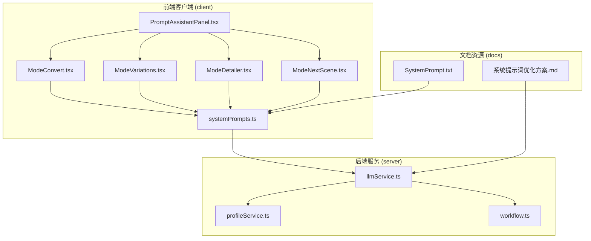
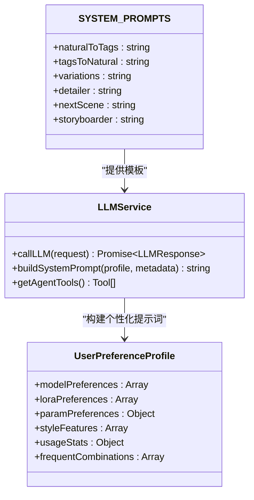
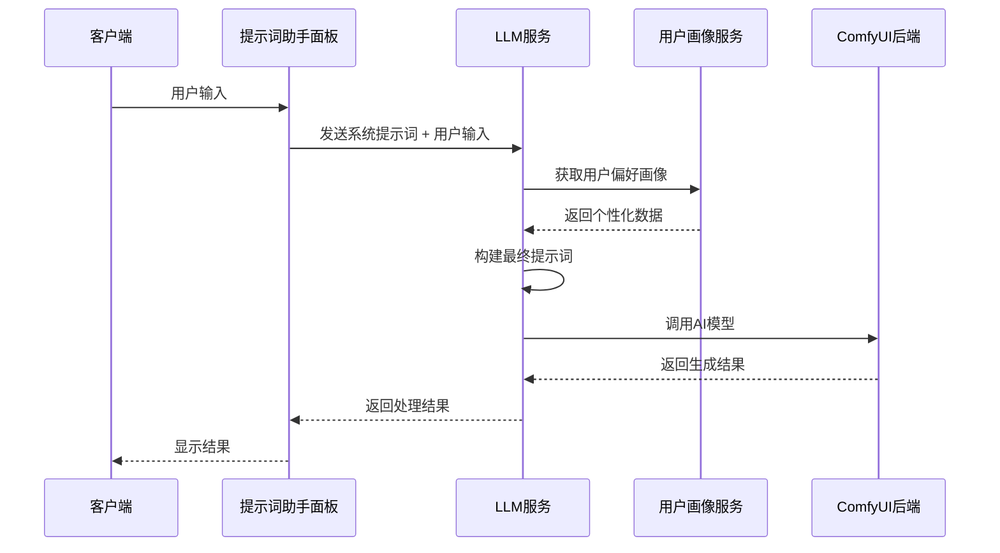
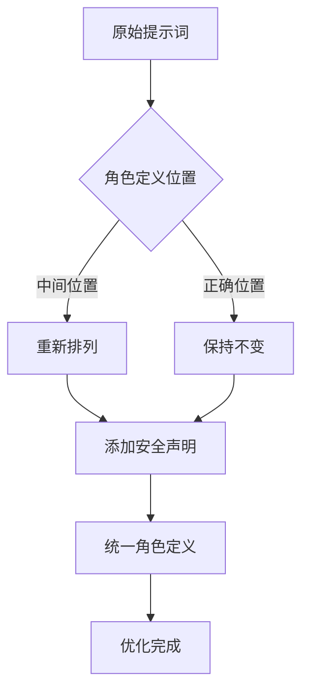
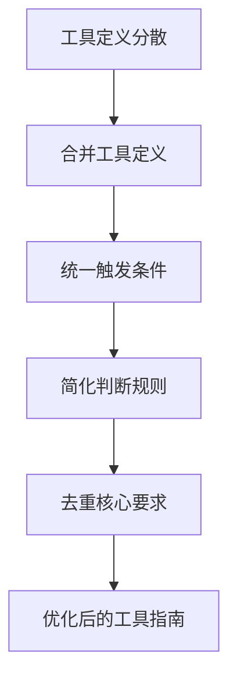
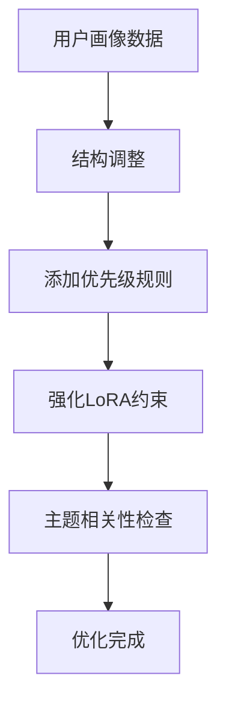
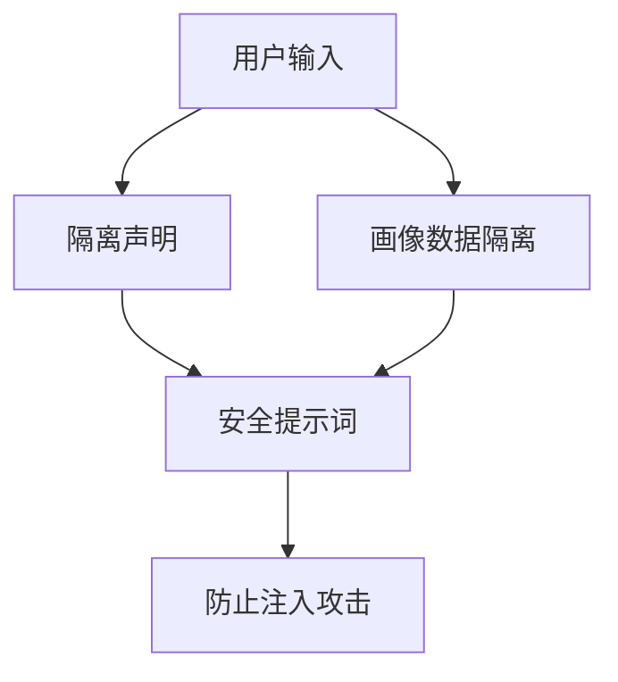
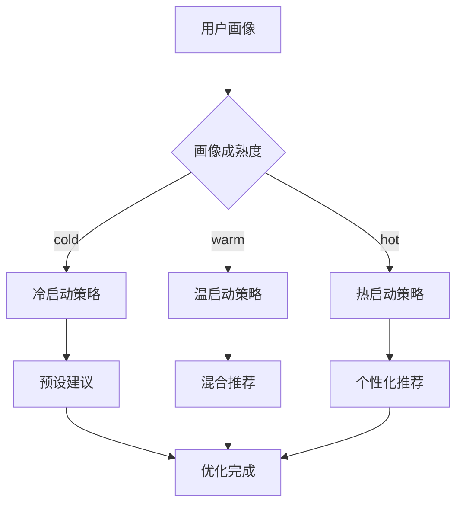
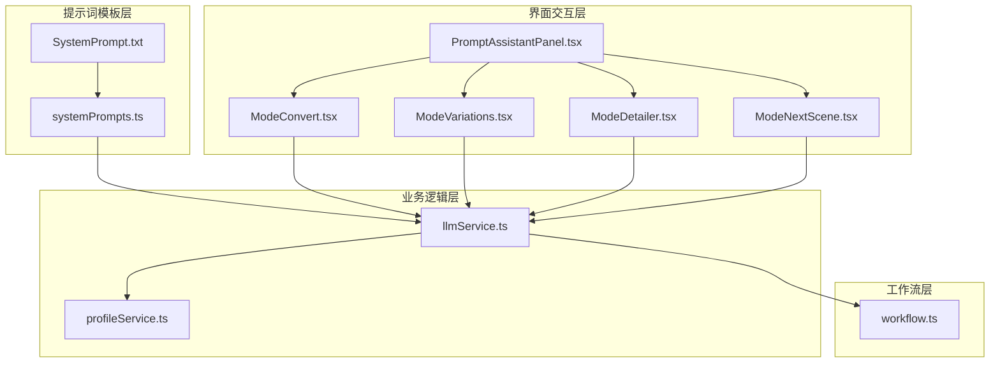

# 系统提示词优化方案

<cite>
**本文档引用的文件**
- [系统提示词优化方案.md](file://docs/系统提示词优化方案.md)
- [SystemPrompt.txt](file://docs/SystemPrompt.txt)
- [systemPrompts.ts](file://client/src/components/prompt-assistant/systemPrompts.ts)
- [llmService.ts](file://server/src/services/llmService.ts)
- [profileService.ts](file://server/src/services/profileService.ts)
- [PromptAssistantPanel.tsx](file://client/src/components/PromptAssistantPanel.tsx)
- [ModeConvert.tsx](file://client/src/components/prompt-assistant/ModeConvert.tsx)
- [ModeVariations.tsx](file://client/src/components/prompt-assistant/ModeVariations.tsx)
- [ModeDetailer.tsx](file://client/src/components/prompt-assistant/ModeDetailer.tsx)
- [ModeNextScene.tsx](file://client/src/components/prompt-assistant/ModeNextScene.tsx)
- [workflow.ts](file://server/src/routes/workflow.ts)
- [README.md](file://README.md)
</cite>

## 更新摘要
**变更内容**
- 系统性优化现有系统提示词，包括角色定义明确化、安全增强、输出格式标准化
- 完善风格检测规则，增加权重示例和边界声明
- 优化冷启动暖场推荐策略，实现分层处理机制
- 增强用户画像双格式方案，提升个性化推荐效果

## 目录
1. [简介](#简介)
2. [项目结构](#项目结构)
3. [核心组件](#核心组件)
4. [架构概览](#架构概览)
5. [详细组件分析](#详细组件分析)
6. [依赖关系分析](#依赖关系分析)
7. [性能考虑](#性能考虑)
8. [故障排除指南](#故障排除指南)
9. [结论](#结论)

## 简介

CorineKit Pix2Real 是一个基于 ComfyUI 的本地 Web 界面，提供批量图像/视频处理功能。该项目的核心优势在于其完善的系统提示词体系和智能提示词助手功能。

本优化方案重点关注系统提示词的重构与优化，旨在提升 AI 图像生成助手的准确性和用户体验。方案涵盖了从角色定义、工具选择、安全防护到输出格式统一的全方位优化策略。

## 项目结构

项目采用前后端分离架构，主要分为以下模块：

**图表来源**
- [PromptAssistantPanel.tsx:1-139](file://client/src/components/PromptAssistantPanel.tsx#L1-L139)
- [llmService.ts:1-385](file://server/src/services/llmService.ts#L1-L385)
- [systemPrompts.ts:1-154](file://client/src/components/prompt-assistant/systemPrompts.ts#L1-L154)

**章节来源**
- [README.md:41-79](file://README.md#L41-L79)

## 核心组件

### 系统提示词管理

系统提示词采用集中管理模式，通过 `SYSTEM_PROMPTS` 对象统一管理各个模式的提示词模板：

**图表来源**
- [systemPrompts.ts:4-153](file://client/src/components/prompt-assistant/systemPrompts.ts#L4-L153)
- [llmService.ts:227-384](file://server/src/services/llmService.ts#L227-L384)

### 提示词助手面板

提示词助手面板提供多种工作模式，每种模式对应特定的提示词转换任务：

| 模式 | 功能 | 输入类型 | 输出类型 |
|------|------|----------|----------|
| convert | 自然语言 ↔ 标签转换 | 文本 | 文本 |
| variations | 创建变体 | 标签 + 权重 | 5个变体 |
| detailer | 按需扩写 | 标记内容 | 扩展文本 |
| nextScene | 脑补后续 | 当前镜头 | 下一镜头 |
| storyboarder | 分镜生成 | 故事大纲 | 多个镜头 |

**章节来源**
- [PromptAssistantPanel.tsx:10-17](file://client/src/components/PromptAssistantPanel.tsx#L10-L17)
- [ModeConvert.tsx:32-195](file://client/src/components/prompt-assistant/ModeConvert.tsx#L32-L195)

## 架构概览

系统采用三层架构设计，确保提示词优化的层次化管理：

**图表来源**
- [ModeConvert.tsx:5-14](file://client/src/components/prompt-assistant/ModeConvert.tsx#L5-L14)
- [llmService.ts:227-384](file://server/src/services/llmService.ts#L227-L384)
- [workflow.ts:1-50](file://server/src/routes/workflow.ts#L1-L50)

## 详细组件分析

### 角色定义优化

**问题分析**：原始提示词中角色定义位置不当，导致 LLM 对关键信息的权重分配不合理。

**优化方案**：
1. 将角色定义移至提示词第一行
2. 添加安全隔离声明，防止 Prompt Injection 攻击
3. 统一角色冲突，删除冗余的角色定义

**图表来源**
- [系统提示词优化方案.md:5-8](file://docs/系统提示词优化方案.md#L5-L8)
- [llmService.ts:314-317](file://server/src/services/llmService.ts#L314-L317)

**章节来源**
- [系统提示词优化方案.md:3-41](file://docs/系统提示词优化方案.md#L3-L41)

### 工具选择指南重构

**问题分析**：工具定义重复且规则分散，影响 LLM 的决策准确性。

**优化方案**：
1. 合并重复的工具定义
2. 统一触发条件说明
3. 简化判断规则
4. 去重"必须调用 generate_image"

**图表来源**
- [系统提示词优化方案.md:8-16](file://docs/系统提示词优化方案.md#L8-L16)
- [llmService.ts:318-325](file://server/src/services/llmService.ts#L318-L325)

**章节来源**
- [系统提示词优化方案.md:8-38](file://docs/系统提示词优化方案.md#L8-L38)

### 用户偏好画像优化

**问题分析**：用户画像数据平铺显示，导致 LLM 在用户明确描述时仍混入无关偏好。

**优化方案**：
1. 重新组织用户偏好画像结构
2. 添加优先级规则
3. 强化 LoRA 选择约束
4. 实现主题相关性检查

**图表来源**
- [系统提示词优化方案.md:17-38](file://docs/系统提示词优化方案.md#L17-L38)
- [llmService.ts:333-341](file://server/src/services/llmService.ts#L333-L341)

**章节来源**
- [系统提示词优化方案.md:17-38](file://docs/系统提示词优化方案.md#L17-L38)

### 安全性增强

**问题分析**：存在 Prompt Injection 风险，用户输入可能被恶意利用。

**优化方案**：
1. 主对话添加隔离声明
2. 画像数据添加隔离标记
3. 实施输入清洗机制

**图表来源**
- [系统提示词优化方案.md:41-60](file://docs/系统提示词优化方案.md#L41-L60)

**章节来源**
- [系统提示词优化方案.md:41-60](file://docs/系统提示词优化方案.md#L41-L60)

### 输出格式统一

**问题分析**：不同提示词模式使用不同的输出格式，增加下游解析复杂度。

**优化方案**：
1. 统一变体输出格式
2. 确保解析器兼容性
3. 简化格式处理逻辑

**章节来源**
- [系统提示词优化方案.md:124-128](file://docs/系统提示词优化方案.md#L124-L128)

### 冷启动暖场推荐优化

**问题分析**：用户画像稀疏时，严格约束导致建议高度单一。

**优化方案**：
1. 实现画像成熟度评分
2. 设计分层处理策略
3. 优化推荐算法

**图表来源**
- [系统提示词优化方案.md:130-162](file://docs/系统提示词优化方案.md#L130-L162)

**章节来源**
- [系统提示词优化方案.md:130-162](file://docs/系统提示词优化方案.md#L130-L162)

### 风格检测规则完善

**问题分析**：权重示例缺失导致 LLM 难以把握变化程度。

**优化方案**：
1. 增加权重示例说明
2. 完善边界条件规则
3. 统一输出格式标准

**章节来源**
- [系统提示词优化方案.md:86-96](file://docs/系统提示词优化方案.md#L86-L96)

### 图片反推规则补全

**问题分析**：当前规则过于简单，缺少关键边界条件。

**优化方案**：
1. 扩展风格判断规则
2. 增加混合风格处理
3. 完善输出长度限制

**章节来源**
- [系统提示词优化方案.md:70-82](file://docs/系统提示词优化方案.md#L70-L82)

### 脑补后续输出约束放宽

**问题分析**："一句话"约束与"推动故事发展"在复杂场景下矛盾。

**优化方案**：
1. 放宽输出长度限制
2. 保持视觉描述一致性
3. 确保故事连贯性

**章节来源**
- [系统提示词优化方案.md:99-112](file://docs/系统提示词优化方案.md#L99-L112)

### 用户画像双格式方案

**问题分析**：结构化画像对主对话工具调用友好，但对创意任务不够灵活。

**优化方案**：
1. 两套画像并存
2. 结构化画像用于主对话
3. 自然语言摘要用于创意任务
4. 实现惰性生成机制

**章节来源**
- [系统提示词优化方案.md:164-176](file://docs/系统提示词优化方案.md#L164-L176)

## 依赖关系分析

系统提示词优化涉及多个层面的依赖关系：

**图表来源**
- [systemPrompts.ts:1-154](file://client/src/components/prompt-assistant/systemPrompts.ts#L1-L154)
- [llmService.ts:1-385](file://server/src/services/llmService.ts#L1-L385)
- [workflow.ts:1-800](file://server/src/routes/workflow.ts#L1-L800)

**章节来源**
- [systemPrompts.ts:1-154](file://client/src/components/prompt-assistant/systemPrompts.ts#L1-L154)
- [llmService.ts:1-385](file://server/src/services/llmService.ts#L1-L385)

## 性能考虑

### 提示词构建优化

1. **延迟加载机制**：用户画像采用惰性生成，减少不必要的 LLM 调用
2. **缓存策略**：热门提示词模板进行本地缓存
3. **批处理优化**：多个变体生成时的批量处理

### 冷启动优化

- **分层策略**：根据用户画像成熟度采用不同处理方式
- **预设建议**：冷启动时提供预定义的高质量建议
- **随机采样**：温启动时注入随机 LoRA 子集提高多样性

### 安全性优化

- **输入验证**：实施严格的输入清洗和隔离机制
- **权限控制**：限制敏感操作的执行范围
- **审计日志**：记录关键操作以便追踪和分析

## 故障排除指南

### 常见问题诊断

1. **提示词不准确**
   - 检查角色定义是否位于正确位置
   - 验证工具选择指南的完整性
   - 确认用户偏好画像的正确性

2. **安全问题**
   - 检查隔离声明是否正确应用
   - 验证输入清洗机制的有效性
   - 确认画像数据的隔离标记

3. **性能问题**
   - 监控 LLM API 调用频率
   - 检查缓存命中率
   - 优化批处理策略

4. **输出格式问题**
   - 验证变体输出格式统一性
   - 检查解析器兼容性
   - 确认格式处理逻辑

**章节来源**
- [llmService.ts:72-97](file://server/src/services/llmService.ts#L72-L97)

## 结论

本系统提示词优化方案通过结构化重构、安全增强和智能化推荐等措施，显著提升了 AI 图像生成助手的准确性和用户体验。主要改进包括：

1. **结构优化**：重新排列角色定义，合并重复内容，简化判断规则
2. **安全增强**：实施 Prompt Injection 防护，加强输入验证
3. **个性化提升**：优化用户偏好画像，实现智能推荐策略
4. **性能优化**：采用分层处理，减少不必要的计算开销
5. **格式统一**：标准化输出格式，简化下游处理逻辑
6. **规则完善**：补充权重示例和边界条件，提升准确性

这些优化措施不仅提高了系统的稳定性，还为未来的功能扩展奠定了坚实基础。通过持续的监控和迭代，系统将能够更好地满足用户需求，提供更加精准和个性化的图像生成体验。