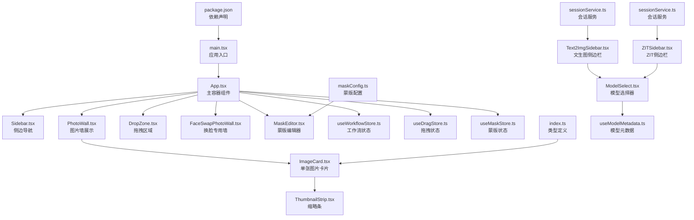
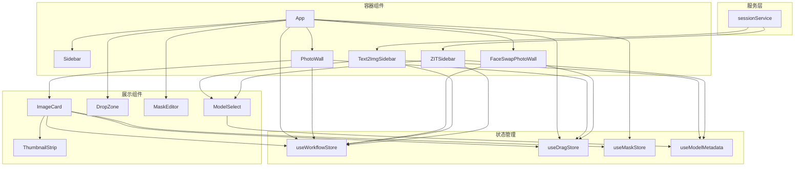
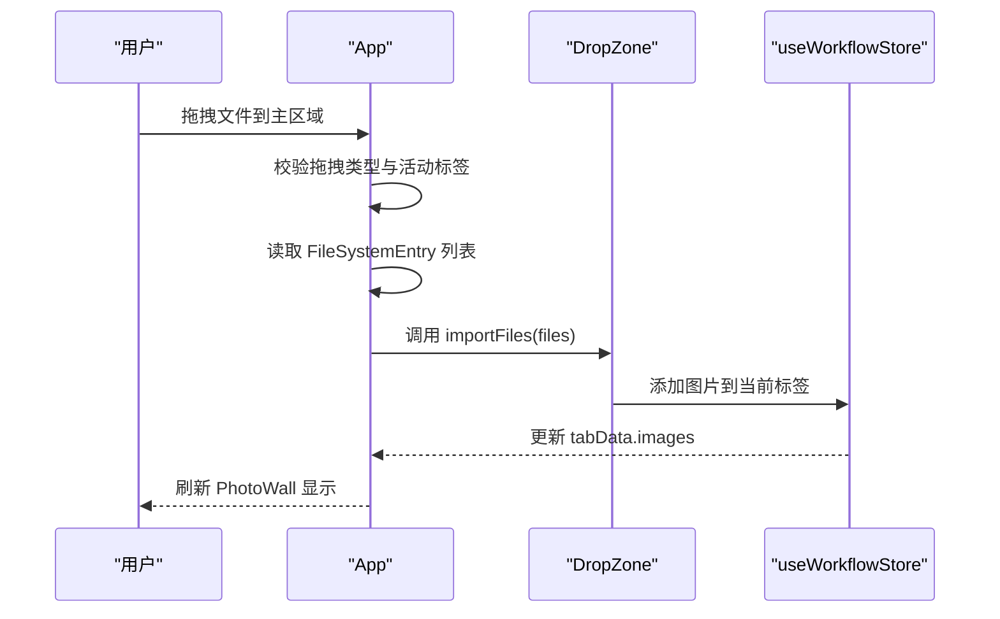
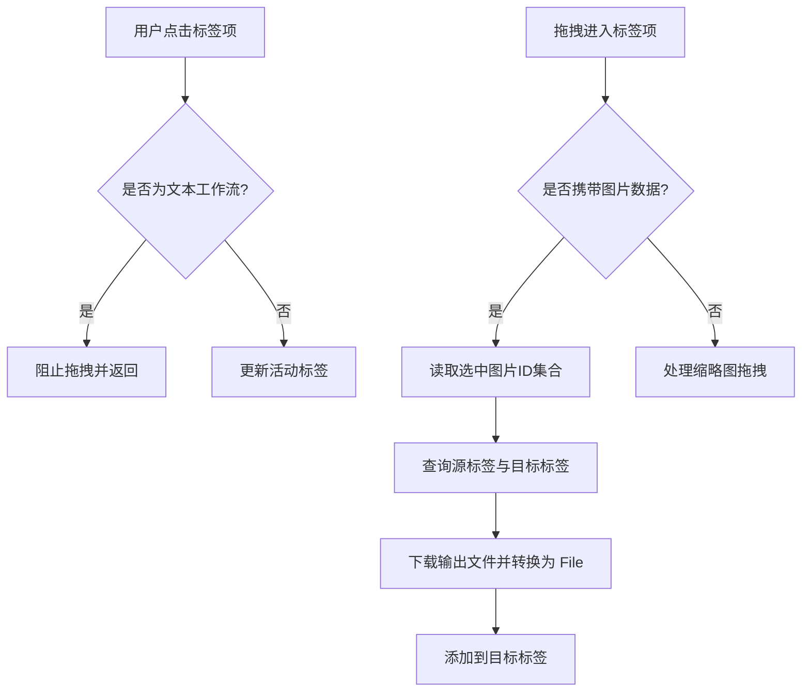
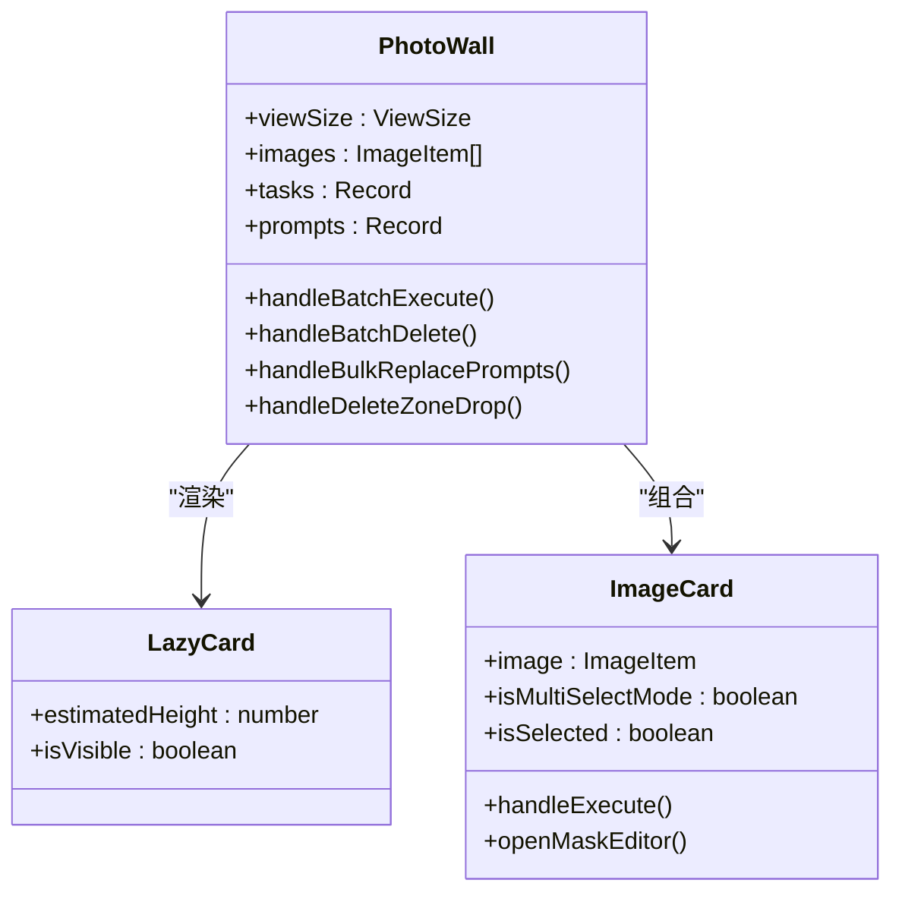
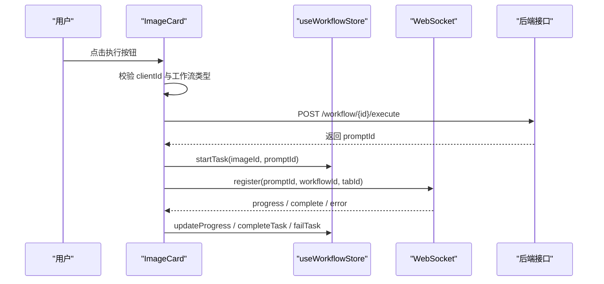
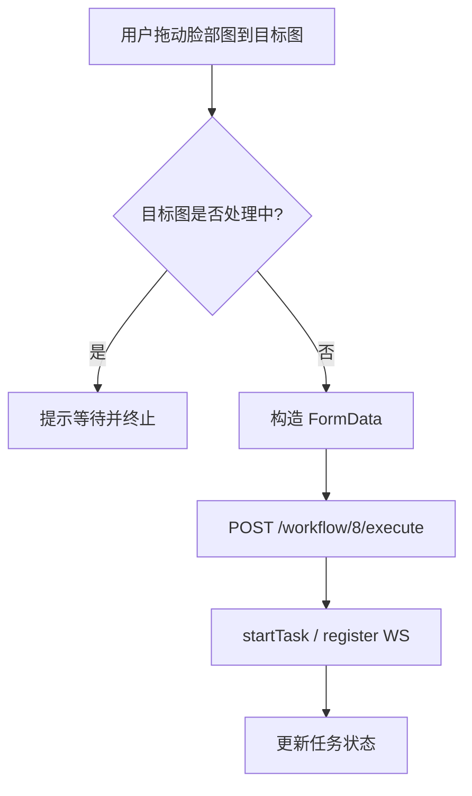
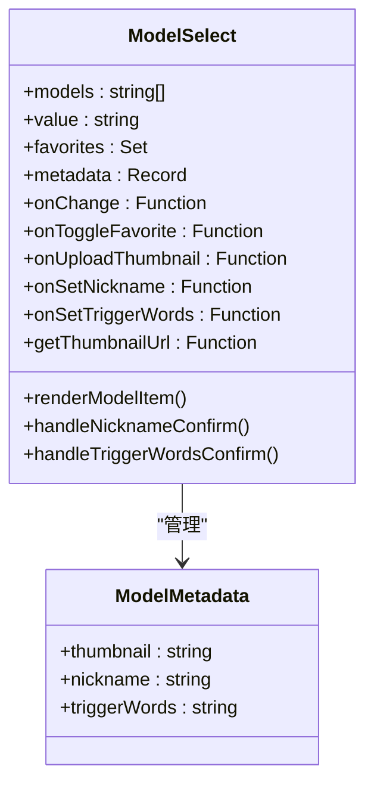
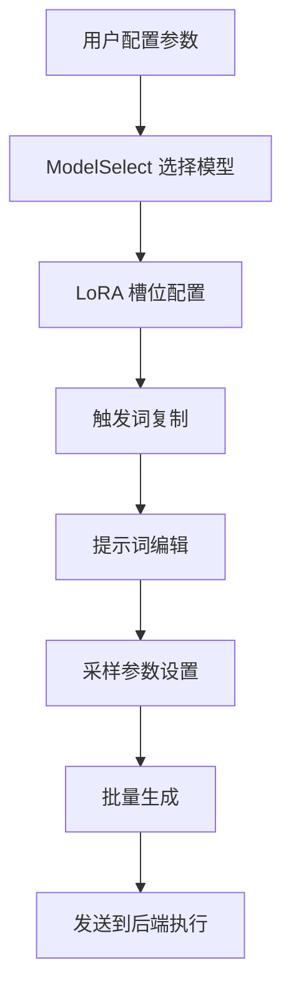
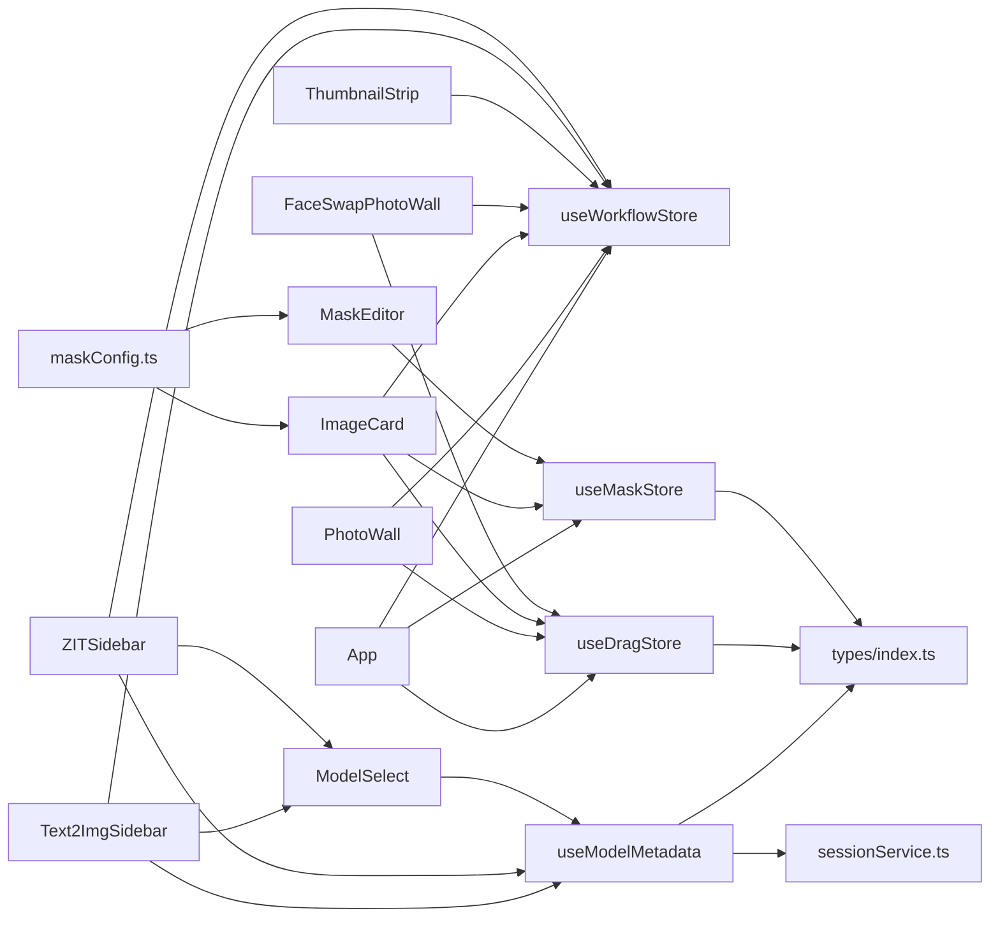

# React 组件体系

<cite>
**本文档引用的文件**
- [main.tsx](file://client/src/main.tsx)
- [App.tsx](file://client/src/components/App.tsx)
- [Sidebar.tsx](file://client/src/components/Sidebar.tsx)
- [PhotoWall.tsx](file://client/src/components/PhotoWall.tsx)
- [DropZone.tsx](file://client/src/components/DropZone.tsx)
- [ImageCard.tsx](file://client/src/components/ImageCard.tsx)
- [FaceSwapPhotoWall.tsx](file://client/src/components/FaceSwapPhotoWall.tsx)
- [ThumbnailStrip.tsx](file://client/src/components/ThumbnailStrip.tsx)
- [MaskEditor.tsx](file://client/src/components/MaskEditor.tsx)
- [ModelSelect.tsx](file://client/src/components/ModelSelect.tsx)
- [Text2ImgSidebar.tsx](file://client/src/components/Text2ImgSidebar.tsx)
- [ZITSidebar.tsx](file://client/src/components/ZITSidebar.tsx)
- [useWorkflowStore.ts](file://client/src/hooks/useWorkflowStore.ts)
- [useDragStore.ts](file://client/src/hooks/useDragStore.ts)
- [useMaskStore.ts](file://client/src/hooks/useMaskStore.ts)
- [useModelMetadata.ts](file://client/src/hooks/useModelMetadata.ts)
- [sessionService.ts](file://client/src/services/sessionService.ts)
- [maskConfig.ts](file://client/src/config/maskConfig.ts)
- [index.ts](file://client/src/types/index.ts)
- [package.json](file://client/package.json)
</cite>

## 目录
1. [简介](#简介)
2. [项目结构](#项目结构)
3. [核心组件](#核心组件)
4. [架构总览](#架构总览)
5. [详细组件分析](#详细组件分析)
6. [依赖关系分析](#依赖关系分析)
7. [性能考虑](#性能考虑)
8. [故障排除指南](#故障排除指南)
9. [结论](#结论)
10. [附录](#附录)

## 简介
本项目是一个基于 React 的图像处理与生成工作流前端应用，围绕 App 主组件构建了完整的组件体系。系统通过多 Tab 工作流、拖拽交互、蒙版编辑、实时进度反馈等能力，支撑从图像导入、处理到结果输出的完整流程。本文档将深入解析 App 主组件的设计架构、组件层次结构、状态传递机制与事件处理模式，并详细说明 Sidebar、PhotoWall、DropZone、ImageCard 等核心组件的职责与协作方式。

**更新** 本版本新增了 ModelSelect 组件的触发词编辑功能、多槽位 LoRA 支持、复制粘贴触发词功能，以及 Text2ImgSidebar 和 ZITSidebar 的增强功能。

## 项目结构
客户端采用按功能模块组织的目录结构，核心入口位于 main.tsx，应用根组件为 App.tsx，其余组件分布在 components 目录下，状态管理通过 hooks 中的 Zustand stores 实现，类型定义集中在 types 目录。

**图表来源**
- [main.tsx:1-11](file://client/src/main.tsx#L1-L11)
- [App.tsx:54-335](file://client/src/components/App.tsx#L54-L335)
- [Sidebar.tsx:30-425](file://client/src/components/Sidebar.tsx#L30-L425)
- [PhotoWall.tsx:103-578](file://client/src/components/PhotoWall.tsx#L103-L578)
- [DropZone.tsx:39-171](file://client/src/components/DropZone.tsx#L39-L171)
- [FaceSwapPhotoWall.tsx:213-800](file://client/src/components/FaceSwapPhotoWall.tsx#L213-L800)
- [ImageCard.tsx:42-800](file://client/src/components/ImageCard.tsx#L42-L800)
- [ThumbnailStrip.tsx:34-231](file://client/src/components/ThumbnailStrip.tsx#L34-L231)
- [MaskEditor.tsx:141-375](file://client/src/components/MaskEditor.tsx#L141-L375)
- [ModelSelect.tsx:1-531](file://client/src/components/ModelSelect.tsx#L1-L531)
- [Text2ImgSidebar.tsx:1-683](file://client/src/components/Text2ImgSidebar.tsx#L1-L683)
- [ZITSidebar.tsx:1-716](file://client/src/components/ZITSidebar.tsx#L1-L716)
- [useWorkflowStore.ts:96-645](file://client/src/hooks/useWorkflowStore.ts#L96-L645)
- [useDragStore.ts:1-17](file://client/src/hooks/useDragStore.ts#L1-L17)
- [useMaskStore.ts:1-51](file://client/src/hooks/useMaskStore.ts#L1-L51)
- [useModelMetadata.ts:1-169](file://client/src/hooks/useModelMetadata.ts#L1-L169)
- [sessionService.ts:1-140](file://client/src/services/sessionService.ts#L1-L140)
- [maskConfig.ts:1-20](file://client/src/config/maskConfig.ts#L1-L20)
- [index.ts:1-58](file://client/src/types/index.ts#L1-L58)
- [package.json:1-25](file://client/package.json#L1-L25)

**章节来源**
- [main.tsx:1-11](file://client/src/main.tsx#L1-L11)
- [package.json:1-25](file://client/package.json#L1-L25)

## 核心组件
本节概述主要组件及其职责：
- App：应用根容器，负责全局布局、主题切换、欢迎页、拖拽处理、状态持久化与子组件编排。
- Sidebar：工作流导航与任务队列管理，支持跨标签拖拽与任务状态指示。
- PhotoWall：图片墙展示与批量操作，支持懒加载、多选、批量执行与删除。
- DropZone：通用拖拽导入区域，支持文件夹与文件拖放。
- ImageCard：单张图片卡片，包含预览、输出缩略条、蒙版控制、提示词编辑、执行与撤销等。
- FaceSwapPhotoWall：换脸专用图片墙，支持左右分区拖拽与批量换脸。
- ThumbnailStrip：输出缩略条，支持原图与结果间切换与拖拽。
- MaskEditor：蒙版编辑器，支持多种模式、笔刷参数、自动识别与导出。
- ModelSelect：增强的模型选择器，支持触发词编辑、收藏管理、缩略图上传、昵称设置。
- Text2ImgSidebar：文生图工作流侧边栏，支持多槽位 LoRA、触发词复制、提示词助手。
- ZITSidebar：ZIT工作流侧边栏，支持 UNet 模型选择、多槽位 LoRA、触发词复制、采样算法偏移。

**更新** 新增了 ModelSelect、Text2ImgSidebar 和 ZITSidebar 的核心功能描述。

**章节来源**
- [App.tsx:54-335](file://client/src/components/App.tsx#L54-L335)
- [Sidebar.tsx:30-425](file://client/src/components/Sidebar.tsx#L30-L425)
- [PhotoWall.tsx:103-578](file://client/src/components/PhotoWall.tsx#L103-L578)
- [DropZone.tsx:39-171](file://client/src/components/DropZone.tsx#L39-L171)
- [ImageCard.tsx:42-800](file://client/src/components/ImageCard.tsx#L42-L800)
- [FaceSwapPhotoWall.tsx:213-800](file://client/src/components/FaceSwapPhotoWall.tsx#L213-L800)
- [ThumbnailStrip.tsx:34-231](file://client/src/components/ThumbnailStrip.tsx#L34-L231)
- [MaskEditor.tsx:141-375](file://client/src/components/MaskEditor.tsx#L141-L375)
- [ModelSelect.tsx:25-485](file://client/src/components/ModelSelect.tsx#L25-L485)
- [Text2ImgSidebar.tsx:57-683](file://client/src/components/Text2ImgSidebar.tsx#L57-L683)
- [ZITSidebar.tsx:57-716](file://client/src/components/ZITSidebar.tsx#L57-L716)

## 架构总览
应用采用"容器-展示"分层与"状态集中管理"的架构模式：
- 容器组件（App、Sidebar、PhotoWall、FaceSwapPhotoWall）负责业务逻辑与用户交互。
- 展示组件（ImageCard、DropZone、ThumbnailStrip、MaskEditor、ModelSelect）专注渲染与最小化重渲染。
- 状态管理通过多个 Zustand stores 实现，避免深层 props 传递与样板代码。
- 模型元数据通过 useModelMetadata hook 管理，支持触发词、缩略图、昵称等信息的持久化。

**图表来源**
- [App.tsx:54-335](file://client/src/components/App.tsx#L54-L335)
- [Sidebar.tsx:30-425](file://client/src/components/Sidebar.tsx#L30-L425)
- [PhotoWall.tsx:103-578](file://client/src/components/PhotoWall.tsx#L103-L578)
- [FaceSwapPhotoWall.tsx:213-800](file://client/src/components/FaceSwapPhotoWall.tsx#L213-L800)
- [ImageCard.tsx:42-800](file://client/src/components/ImageCard.tsx#L42-L800)
- [DropZone.tsx:39-171](file://client/src/components/DropZone.tsx#L39-L171)
- [ThumbnailStrip.tsx:34-231](file://client/src/components/ThumbnailStrip.tsx#L34-L231)
- [MaskEditor.tsx:141-375](file://client/src/components/MaskEditor.tsx#L141-L375)
- [ModelSelect.tsx:25-485](file://client/src/components/ModelSelect.tsx#L25-L485)
- [Text2ImgSidebar.tsx:57-683](file://client/src/components/Text2ImgSidebar.tsx#L57-L683)
- [ZITSidebar.tsx:57-716](file://client/src/components/ZITSidebar.tsx#L57-L716)
- [useWorkflowStore.ts:96-645](file://client/src/hooks/useWorkflowStore.ts#L96-L645)
- [useDragStore.ts:1-17](file://client/src/hooks/useDragStore.ts#L1-L17)
- [useMaskStore.ts:1-51](file://client/src/hooks/useMaskStore.ts#L1-L51)
- [useModelMetadata.ts:9-169](file://client/src/hooks/useModelMetadata.ts#L9-L169)
- [sessionService.ts:1-140](file://client/src/services/sessionService.ts#L1-L140)

## 详细组件分析

### App 主组件设计
App 是整个应用的根容器，承担以下职责：
- 布局与主题：顶部工具栏、侧边导航、主内容区、状态栏与欢迎页切换。
- 文件拖拽：在主区域拦截外部文件拖放，支持文件夹递归读取与视频/图片过滤。
- 视图尺寸：支持小/中/大三种视图模式，使用 localStorage 持久化。
- 子组件编排：根据当前活动标签动态渲染 PhotoWall 或 FaceSwapPhotoWall，以及对应的工作流侧边栏与设置面板。
- 全局对话框：重复文件名导入确认、全局 Toast 通知、遮罩层弹窗（设置、提示词助理、蒙版编辑器）。

**图表来源**
- [App.tsx:84-134](file://client/src/components/App.tsx#L84-L134)
- [DropZone.tsx:42-73](file://client/src/components/DropZone.tsx#L42-L73)
- [useWorkflowStore.ts:197-252](file://client/src/hooks/useWorkflowStore.ts#L197-L252)

**章节来源**
- [App.tsx:54-335](file://client/src/components/App.tsx#L54-L335)

### Sidebar 侧边导航
Sidebar 的职责包括：
- 工作流分组与图标映射，支持活动标签指示器动画定位。
- 任务队列计数轮询与弹出面板。
- 跨标签拖拽：将某张图片拖到其他标签页，实现任务迁移。
- 处理中状态指示：当标签页存在 processing 状态任务时显示脉冲点。

**图表来源**
- [Sidebar.tsx:124-209](file://client/src/components/Sidebar.tsx#L124-L209)
- [useWorkflowStore.ts:236-252](file://client/src/hooks/useWorkflowStore.ts#L236-L252)

**章节来源**
- [Sidebar.tsx:30-425](file://client/src/components/Sidebar.tsx#L30-L425)

### PhotoWall 图片墙展示
PhotoWall 的核心特性：
- 视图配置：小/中/大三种列宽与估算高度，支持动态切换。
- 懒加载卡片：IntersectionObserver 预加载，减少首屏压力；占位符高度补偿滚动偏移。
- 多选模式：全选/反选、批量替换提示词、批量删除蒙版、批量执行。
- 删除拖拽区：拖动卡片或输出到底部删除区域，支持批量删除。
- 任务执行：针对选中图片发起工作流请求，注册 WebSocket 进度。

**图表来源**
- [PhotoWall.tsx:103-578](file://client/src/components/PhotoWall.tsx#L103-L578)
- [ImageCard.tsx:42-800](file://client/src/components/ImageCard.tsx#L42-L800)

**章节来源**
- [PhotoWall.tsx:103-578](file://client/src/components/PhotoWall.tsx#L103-L578)

### DropZone 拖拽区域
DropZone 提供两种形态：
- 全屏模式：用于 App 主区域首次无图片时的引导导入。
- 条形模式：用于现有图片墙上方追加导入。
- 支持文件夹递归读取与文件类型过滤，统一调用 useWorkflowStore 添加图片。

**章节来源**
- [DropZone.tsx:39-171](file://client/src/components/DropZone.tsx#L39-L171)

### ImageCard 图片卡片
ImageCard 是最复杂的展示组件之一，职责包括：
- 预览与输出覆盖：根据工作流类型决定显示原图或输出结果。
- 缩略条：原图与多结果间切换，支持输出拖拽到其他标签页。
- 蒙版控制：根据工作流模式显示蒙版菜单，支持新建/编辑/删除蒙版。
- 提示词编辑：支持反推提示词、提示词助理快捷操作。
- 执行与撤销：发起工作流执行，处理队列取消与错误状态。
- 交互细节：长按进入多选、右键中键行为、视频自动播放/暂停。

**图表来源**
- [ImageCard.tsx:264-334](file://client/src/components/ImageCard.tsx#L264-L334)
- [useWorkflowStore.ts:377-499](file://client/src/hooks/useWorkflowStore.ts#L377-L499)

**章节来源**
- [ImageCard.tsx:42-800](file://client/src/components/ImageCard.tsx#L42-L800)

### FaceSwapPhotoWall 换脸图片墙
专为"黑兽换脸"工作流设计的双分区布局：
- 左侧"脸部参考区"，右侧"目标图区"，支持拖拽互换与跨区导入。
- 支持多选模式：从目标区选择多个图片，对选中的脸部图进行批量换脸。
- 区域高亮与拖拽提示：通过 dragenter/dragleave 计数器精确控制高亮状态。
- 执行流程：校验目标图状态，构造 multipart/form-data，提交到后端并注册 WebSocket。

**图表来源**
- [FaceSwapPhotoWall.tsx:256-282](file://client/src/components/FaceSwapPhotoWall.tsx#L256-L282)
- [useWorkflowStore.ts:377-396](file://client/src/hooks/useWorkflowStore.ts#L377-L396)

**章节来源**
- [FaceSwapPhotoWall.tsx:213-800](file://client/src/components/FaceSwapPhotoWall.tsx#L213-L800)

### ThumbnailStrip 缩略条
- 自适应尺寸：根据容器宽度动态计算缩略图尺寸与间距。
- 滚动同步：选中项自动滚动到可视区域中心。
- 拖拽支持：仅结果项可拖拽，拖拽数据包含输出索引，用于跨组件传递。

**章节来源**
- [ThumbnailStrip.tsx:34-231](file://client/src/components/ThumbnailStrip.tsx#L34-L231)

### MaskEditor 蒙版编辑器
- 模式支持：A 模式（叠加）、B 模式（A/B 混合）。
- 画笔参数：大小、硬度、不透明度，支持键盘快捷键微调。
- 自动识别：基于原图自动识别人像蒙版并填充。
- 导出混合：将蒙版与原图/结果图混合导出至指定路径。
- 历史记录：撤销/重做、清空、反转等操作。

**章节来源**
- [MaskEditor.tsx:141-375](file://client/src/components/MaskEditor.tsx#L141-L375)

### ModelSelect 模型选择器
ModelSelect 是一个增强的模型选择组件，提供以下核心功能：
- 模型列表管理：支持加载、显示、过滤模型列表。
- 收藏功能：支持将常用模型加入收藏，使用 localStorage 持久化。
- 缩略图上传：支持为模型上传缩略图，提供视觉预览。
- 昵称设置：支持为模型设置自定义昵称，提升可读性。
- 触发词编辑：支持为 LoRA 模型设置触发词，便于快速引用。
- 悬停预览：鼠标悬停时显示模型缩略图预览。
- 多槽位支持：支持多个 LoRA 模型槽位的管理。

**图表来源**
- [ModelSelect.tsx:25-485](file://client/src/components/ModelSelect.tsx#L25-L485)
- [useModelMetadata.ts:3-7](file://client/src/hooks/useModelMetadata.ts#L3-L7)

**章节来源**
- [ModelSelect.tsx:25-485](file://client/src/components/ModelSelect.tsx#L25-L485)

### Text2ImgSidebar 文生图侧边栏
Text2ImgSidebar 是文生图工作流的增强侧边栏，具有以下特性：
- 模型选择：集成 ModelSelect 组件，支持 Checkpoint 模型选择。
- 多槽位 LoRA：支持最多 3 个 LoRA 模型槽位，每个槽位可独立启用、调整权重。
- 触发词管理：显示并支持复制 LoRA 模型的触发词。
- 提示词助手：集成提示词助理功能，支持自然语言与标签之间的相互转换。
- 采样设置：支持步数、CFG、采样器、调度器等高级参数调节。
- 批量生成：支持批量生成多张图片，支持自定义命名。

**图表来源**
- [Text2ImgSidebar.tsx:57-683](file://client/src/components/Text2ImgSidebar.tsx#L57-L683)
- [ModelSelect.tsx:25-485](file://client/src/components/ModelSelect.tsx#L25-L485)

**章节来源**
- [Text2ImgSidebar.tsx:57-683](file://client/src/components/Text2ImgSidebar.tsx#L57-L683)

### ZITSidebar ZIT 工作流侧边栏
ZITSidebar 是 ZIT 工作流的增强侧边栏，具有以下特性：
- UNet 模型选择：专门的 UNet 模型选择器，支持模型收藏管理。
- 多槽位 LoRA：与文生图侧边栏相同的多槽位 LoRA 管理功能。
- 触发词管理：支持 LoRA 模型触发词的显示与复制。
- 采样算法偏移：新增 AuraFlow 算法的采样偏移功能，支持启用/禁用和偏移量调节。
- 提示词助手：集成提示词助理功能，支持自然语言与标签之间的相互转换。
- 采样设置：支持步数、CFG、采样器、调度器等高级参数调节。
- 批量生成：支持批量生成多张图片，支持自定义命名。

**章节来源**
- [ZITSidebar.tsx:57-716](file://client/src/components/ZITSidebar.tsx#L57-L716)

## 依赖关系分析
- 组件耦合：容器组件之间低耦合，通过 props 与 stores 通信；展示组件尽量无副作用，提升可测试性。
- 状态依赖：useWorkflowStore 管理全局工作流状态；useDragStore 管理拖拽上下文；useMaskStore 管理蒙版数据；useModelMetadata 管理模型元数据。
- 类型约束：sessionService.ts 定义了 LoraSlot、Text2ImgConfig、ZitConfig 等核心类型，支持多槽位 LoRA 的配置管理。
- 外部依赖：lucide-react 提供图标；zustand 提供轻量状态管理；React 19 提供并发与性能优化。

**图表来源**
- [useWorkflowStore.ts:96-645](file://client/src/hooks/useWorkflowStore.ts#L96-L645)
- [useDragStore.ts:1-17](file://client/src/hooks/useDragStore.ts#L1-17)
- [useMaskStore.ts:1-51](file://client/src/hooks/useMaskStore.ts#L1-51)
- [useModelMetadata.ts:9-169](file://client/src/hooks/useModelMetadata.ts#L9-L169)
- [sessionService.ts:1-140](file://client/src/services/sessionService.ts#L1-L140)
- [index.ts:1-58](file://client/src/types/index.ts#L1-L58)
- [maskConfig.ts:1-20](file://client/src/config/maskConfig.ts#L1-L20)

**章节来源**
- [index.ts:1-58](file://client/src/types/index.ts#L1-L58)
- [maskConfig.ts:1-20](file://client/src/config/maskConfig.ts#L1-L20)

## 性能考虑
- 懒加载与占位符：PhotoWall 使用 IntersectionObserver 与占位符高度补偿，避免滚动抖动与首屏阻塞。
- 组件记忆化：ImageCard 使用 memo 与自定义比较函数，减少不必要的重渲染。
- 状态订阅优化：ImageCard 通过 useShallow 将多个状态订阅合并，降低订阅粒度。
- 拖拽性能：Sidebar 对原生 dragover 事件绑定，避免 React 合成事件丢失导致的性能问题。
- 蒙版处理：MaskEditor 在导出前将大图转换为离屏画布，避免主线程阻塞。
- WebSocket：统一注册任务，按 promptId 分发进度，避免全局广播带来的性能损耗。
- 模型元数据缓存：useModelMetadata 使用本地缓存机制，避免重复的 API 调用。
- 多槽位 LoRA 优化：Text2ImgSidebar 和 ZITSidebar 通过 localStorage 持久化配置，避免页面切换时的配置丢失。

## 故障排除指南
- 拖拽无效：检查 App 主区域的 dragover/leave 事件处理与标签页类型限制。
- 无法导入文件夹：确认浏览器支持 webkitGetAsEntry 并正确处理目录递归读取。
- 执行失败：查看 ImageCard 的错误状态与 useWorkflowStore 的 failTask 更新。
- 蒙版编辑异常：确认蒙版键值生成规则与 useMaskStore 的存储结构一致。
- 队列计数不更新：检查 /api/workflow/queue 接口可用性与轮询定时器。
- 模型选择器无响应：检查 useModelMetadata 的 API 调用状态与网络连接。
- 触发词复制失败：确认浏览器支持 Clipboard API 且用户已授权剪贴板访问权限。
- 多槽位 LoRA 配置丢失：检查 localStorage 是否正常工作，确认配置序列化/反序列化逻辑。

**章节来源**
- [App.tsx:84-134](file://client/src/components/App.tsx#L84-L134)
- [ImageCard.tsx:478-580](file://client/src/components/ImageCard.tsx#L478-L580)
- [useMaskStore.ts:32-50](file://client/src/hooks/useMaskStore.ts#L32-L50)
- [useModelMetadata.ts:12-21](file://client/src/hooks/useModelMetadata.ts#L12-L21)

## 结论
该 React 组件体系通过清晰的容器-展示分离、集中式状态管理与完善的拖拽/蒙版/进度反馈机制，实现了复杂图像处理工作流的高效交互。App 主组件作为中枢，协调 Sidebar、PhotoWall、DropZone、ImageCard、FaceSwapPhotoWall 等组件，形成高内聚、低耦合的架构。

**更新** 本次更新显著增强了模型管理功能，ModelSelect 组件提供了完整的模型元数据管理能力，包括触发词编辑、收藏管理、缩略图上传等功能。Text2ImgSidebar 和 ZITSidebar 集成了多槽位 LoRA 支持和触发词复制功能，大大提升了用户的模型使用体验。

建议在后续迭代中进一步完善类型安全、错误边界与性能监控，以提升可维护性与用户体验。

## 附录
- 组件复用最佳实践
  - 将通用 UI 行为抽象为独立展示组件（如 DropZone、ThumbnailStrip、ModelSelect），通过 props 传入行为回调。
  - 使用 memo 与 useShallow 减少重渲染，保持稳定引用以避免副作用。
  - 将跨组件共享的状态收敛到 Zustand stores，避免 props 钻取。
  - 利用 useModelMetadata hook 管理模型元数据，提供统一的数据访问接口。
- 组件组合模式
  - PhotoWall 通过 LazyCard 与 ImageCard 组合实现高性能图片墙。
  - ImageCard 内嵌 ThumbnailStrip 与 MaskEditor，形成"卡片内生态"。
  - Text2ImgSidebar 和 ZITSidebar 通过 ModelSelect 组合实现增强的模型管理功能。
- 渲染优化技巧
  - 使用 IntersectionObserver 与占位符高度补偿，减少滚动抖动。
  - 合理拆分状态订阅，避免不必要的组件重渲染。
  - 在导出/蒙版处理等重计算场景使用离屏画布与异步处理。
  - 利用 localStorage 进行配置持久化，提升用户体验。
  - 通过 useModelMetadata 的本地缓存机制减少 API 调用频率。