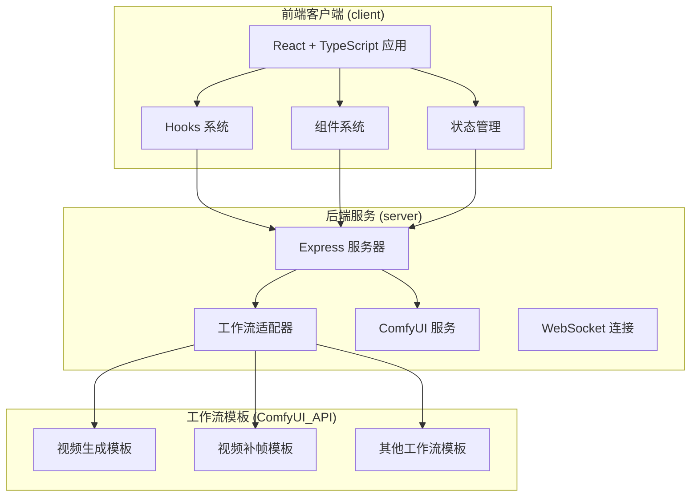
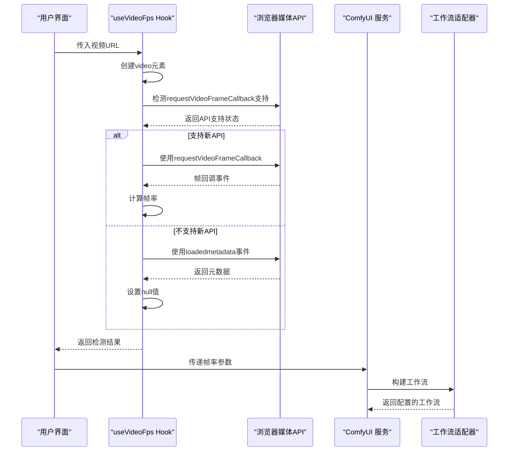
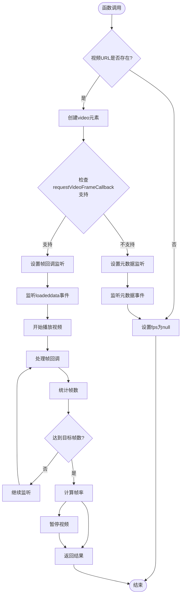
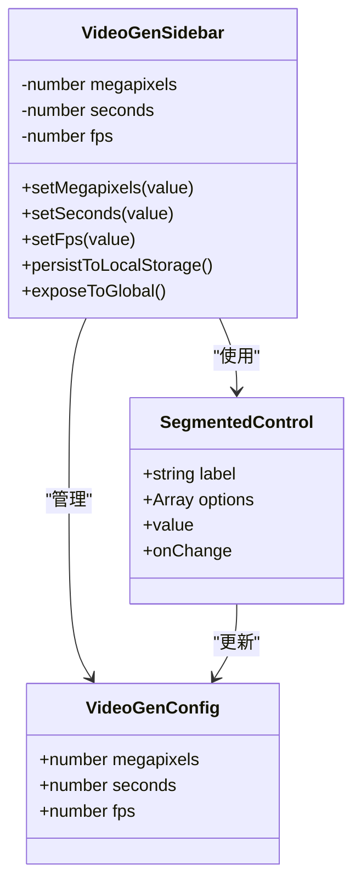
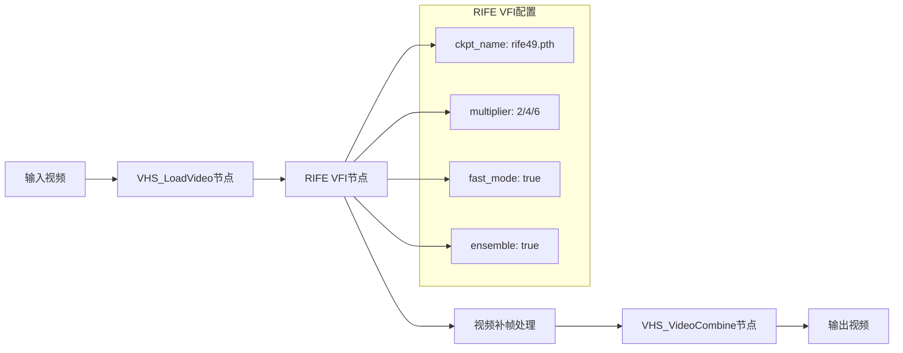
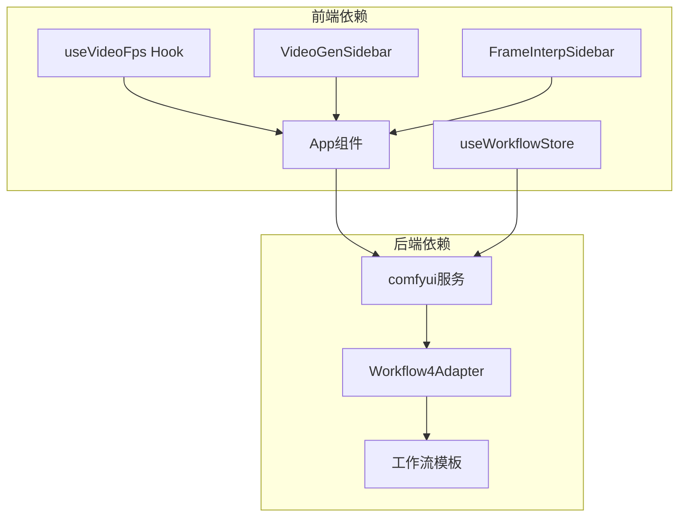

# 视频FPS检测 Hook

<cite>
**本文档引用的文件**
- [README.md](file://README.md)
- [package.json](file://package.json)
- [useVideoFps.ts](file://client/src/hooks/useVideoFps.ts)
- [VideoGenSidebar.tsx](file://client/src/components/VideoGenSidebar.tsx)
- [FrameInterpSidebar.tsx](file://client/src/components/FrameInterpSidebar.tsx)
- [index.ts](file://client/src/types/index.ts)
- [App.tsx](file://client/src/components/App.tsx)
- [useWorkflowStore.ts](file://client/src/hooks/useWorkflowStore.ts)
- [comfyui.ts](file://server/src/services/comfyui.ts)
- [Workflow4Adapter.ts](file://server/src/adapters/Workflow4Adapter.ts)
- [FrameInterp.json](file://ComfyUI_API/FrameInterp.json)
</cite>

## 目录
1. [简介](#简介)
2. [项目结构](#项目结构)
3. [核心组件](#核心组件)
4. [架构概览](#架构概览)
5. [详细组件分析](#详细组件分析)
6. [依赖关系分析](#依赖关系分析)
7. [性能考虑](#性能考虑)
8. [故障排除指南](#故障排除指南)
9. [结论](#结论)

## 简介

视频FPS检测Hook是CorineKit Pix2Real项目中的一个重要功能模块，专门用于检测视频文件的帧率（FPS）。该项目是一个基于Web的本地图像/视频处理工具，通过ComfyUI实现批量图像/视频处理，支持实时进度更新和一键输出文件夹访问。

视频FPS检测Hook的核心目标是在浏览器环境中准确识别视频文件的帧率，为视频生成和视频补帧工作流提供精确的帧率信息。该功能主要依赖现代浏览器的`requestVideoFrameCallback` API来实现高精度的帧率检测。

## 项目结构

CorineKit Pix2Real采用前后端分离的架构设计，主要包含以下核心部分：

**图表来源**
- [README.md:41-62](file://README.md#L41-L62)
- [package.json:1-15](file://package.json#L1-L15)

**章节来源**
- [README.md:1-79](file://README.md#L1-L79)
- [package.json:1-15](file://package.json#L1-L15)

## 核心组件

### 视频FPS检测Hook (useVideoFps)

`useVideoFps`是本次文档关注的核心Hook，它提供了视频帧率检测的主要功能：

- **主要功能**：检测视频文件的帧率
- **API支持**：使用`requestVideoFrameCallback`进行高精度检测
- **回退机制**：在不支持新API时提供粗略估计
- **生命周期管理**：自动处理视频元素的创建、销毁和清理

### 视频生成侧边栏 (VideoGenSidebar)

负责视频生成工作流的参数配置，包括质量、时长和帧率设置：

- **质量选项**：草稿(0.5)、中等(0.8)、原图(1.0)
- **时长选项**：4秒、6秒、8秒
- **帧率选项**：草稿(12fps)、流畅(16fps)、精细(24fps)

### 视频补帧侧边栏 (FrameInterpSidebar)

专注于视频补帧功能的参数配置：

- **补帧倍率**：2x、4x、6x
- **与RIFE VFI插件集成**
- **与ComfyUI工作流无缝对接**

**章节来源**
- [useVideoFps.ts:1-77](file://client/src/hooks/useVideoFps.ts#L1-L77)
- [VideoGenSidebar.tsx:1-154](file://client/src/components/VideoGenSidebar.tsx#L1-L154)
- [FrameInterpSidebar.tsx:1-122](file://client/src/components/FrameInterpSidebar.tsx#L1-L122)

## 架构概览

视频FPS检测在整个系统中的位置和交互关系如下：

**图表来源**
- [useVideoFps.ts:8-76](file://client/src/hooks/useVideoFps.ts#L8-L76)
- [comfyui.ts:168-196](file://server/src/services/comfyui.ts#L168-L196)

## 详细组件分析

### useVideoFps Hook 实现分析

#### 核心算法流程

**图表来源**
- [useVideoFps.ts:11-73](file://client/src/hooks/useVideoFps.ts#L11-L73)

#### 数据结构和复杂度分析

| 组件 | 数据结构 | 时间复杂度 | 空间复杂度 |
|------|----------|------------|------------|
| 帧回调处理器 | 数组计数器 | O(n) | O(1) |
| 帧率计算 | 数学运算 | O(1) | O(1) |
| 视频元素管理 | DOM元素 | O(1) | O(1) |
| 清理函数 | 异步操作 | O(1) | O(1) |

#### 错误处理策略

Hook实现了多层次的错误处理机制：

1. **API兼容性检查**：检测浏览器支持情况
2. **视频加载失败处理**：捕获视频加载错误
3. **取消操作处理**：支持组件卸载时的资源清理
4. **超时保护**：防止无限等待

**章节来源**
- [useVideoFps.ts:1-77](file://client/src/hooks/useVideoFps.ts#L1-L77)

### 视频生成工作流集成

#### 参数配置系统

**图表来源**
- [VideoGenSidebar.tsx:3-97](file://client/src/components/VideoGenSidebar.tsx#L3-L97)

#### 与ComfyUI工作流的集成

视频生成工作流通过以下方式与ComfyUI集成：

1. **配置持久化**：使用localStorage保存用户偏好
2. **全局配置暴露**：通过window对象共享配置
3. **工作流适配器**：动态构建ComfyUI工作流
4. **参数映射**：将前端配置转换为工作流参数

**章节来源**
- [VideoGenSidebar.tsx:1-154](file://client/src/components/VideoGenSidebar.tsx#L1-L154)

### 视频补帧工作流分析

#### RIFE VFI插件集成

视频补帧功能基于RIFE (Random Instantaneous Field Estimation) 插件实现：

**图表来源**
- [Workflow4Adapter.ts:16-26](file://server/src/adapters/Workflow4Adapter.ts#L16-L26)
- [FrameInterp.json:1-58](file://ComfyUI_API/FrameInterp.json#L1-L58)

#### 补帧参数配置

| 参数 | 选项 | 默认值 | 说明 |
|------|------|--------|------|
| multiplier | 2, 4, 6 | 2 | 补帧倍率 |
| fast_mode | 布尔值 | true | 快速模式开关 |
| ensemble | 布尔值 | true | 集成模式开关 |
| clear_cache_after_n_frames | 整数 | 14 | 缓存清理阈值 |

**章节来源**
- [FrameInterpSidebar.tsx:1-122](file://client/src/components/FrameInterpSidebar.tsx#L1-L122)
- [Workflow4Adapter.ts:1-27](file://server/src/adapters/Workflow4Adapter.ts#L1-L27)

## 依赖关系分析

### 组件间依赖关系

**图表来源**
- [App.tsx:329-330](file://client/src/components/App.tsx#L329-L330)
- [comfyui.ts:168-196](file://server/src/services/comfyui.ts#L168-L196)

### 外部依赖分析

项目依赖的关键外部库和API：

| 依赖项 | 版本要求 | 用途 | 支持情况 |
|--------|----------|------|----------|
| React | 18+ | UI框架 | ✅ |
| TypeScript | 最新 | 类型安全 | ✅ |
| node-fetch | 最新 | HTTP请求 | ✅ |
| ws | 最新 | WebSocket | ✅ |
| requestVideoFrameCallback | 现代浏览器 | 高精度帧率检测 | ⚠️ 部分浏览器支持 |
| ComfyUI API | 8188端口 | AI工作流处理 | ✅ |

**章节来源**
- [README.md:16-20](file://README.md#L16-L20)
- [useVideoFps.ts:22-22](file://client/src/hooks/useVideoFps.ts#L22-L22)

## 性能考虑

### 帧率检测性能优化

1. **目标帧数优化**：使用10帧样本平衡准确性与性能
2. **内存管理**：及时清理视频元素和事件监听器
3. **异步处理**：避免阻塞主线程
4. **条件加载**：仅在需要时创建视频元素

### 内存使用分析

| 操作 | 内存影响 | 优化策略 |
|------|----------|----------|
| 视频元素创建 | 中等 | 及时销毁 |
| 帧回调监听 | 低 | 单次监听 |
| 数据URL生成 | 高 | 使用URL.createObjectURL |
| 事件监听器 | 低 | 组件卸载时清理 |

### 浏览器兼容性考虑

- **requestVideoFrameCallback**：仅Chrome/Edge支持
- **回退方案**：使用loadedmetadata事件
- **错误处理**：优雅降级到null值

## 故障排除指南

### 常见问题及解决方案

#### 1. 帧率检测返回null

**可能原因**：
- 浏览器不支持requestVideoFrameCallback
- 视频文件加载失败
- 视频格式不受支持

**解决方法**：
- 检查浏览器兼容性
- 验证视频文件完整性
- 尝试不同的视频格式

#### 2. 视频播放异常

**可能原因**：
- 自动播放限制
- 音频上下文问题
- 视频源URL无效

**解决方法**：
- 确保视频元素静音
- 检查网络连接
- 验证视频URL有效性

#### 3. 内存泄漏问题

**症状**：长时间使用后内存占用持续增长

**预防措施**：
- 确保组件卸载时清理所有监听器
- 及时调用URL.revokeObjectURL
- 监控视频元素的生命周期

**章节来源**
- [useVideoFps.ts:63-72](file://client/src/hooks/useVideoFps.ts#L63-L72)

### 调试技巧

1. **开发者工具**：使用Performance面板监控帧率检测性能
2. **控制台日志**：添加适当的错误处理和调试信息
3. **网络监控**：检查ComfyUI API的响应时间和错误
4. **内存分析**：定期检查内存使用情况

## 结论

视频FPS检测Hook作为CorineKit Pix2Real项目的重要组成部分，成功实现了在浏览器环境中的高精度视频帧率检测。该实现具有以下特点：

### 技术优势

1. **高精度检测**：利用现代浏览器的requestVideoFrameCallback API实现精确的帧率测量
2. **优雅降级**：在不支持新API的环境下提供可靠的回退机制
3. **性能优化**：通过目标帧数控制和及时清理机制确保良好的性能表现
4. **用户体验**：提供即时的反馈和直观的配置界面

### 应用价值

该功能为视频生成和视频补帧工作流提供了关键的参数支持，使得用户能够：
- 精确控制视频输出质量
- 优化处理时间和资源消耗
- 获得更符合预期的视频效果

### 未来发展

随着Web技术的不断演进，该Hook可以进一步优化的方向包括：
- 支持更多的浏览器API
- 增强错误处理和用户反馈
- 优化性能和内存使用
- 扩展到其他媒体格式的支持

通过持续的技术改进和用户体验优化，视频FPS检测Hook将继续为CorineKit Pix2Real项目提供强大的技术支持。