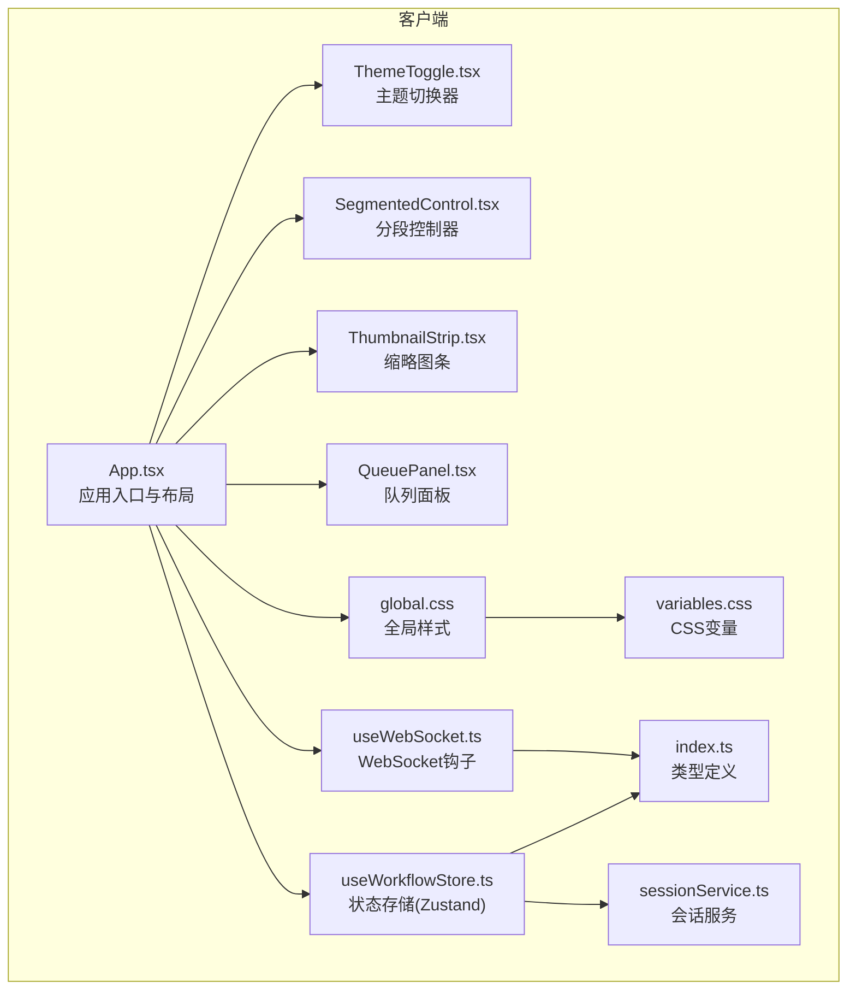
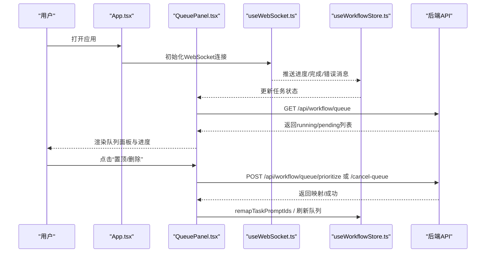
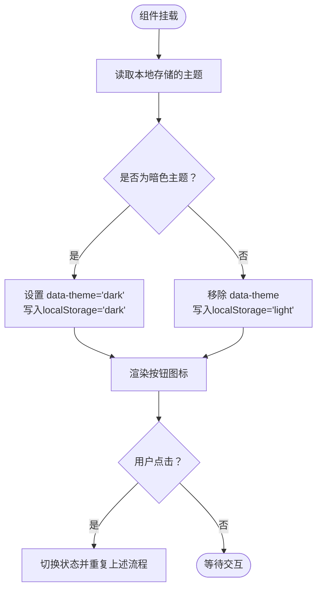
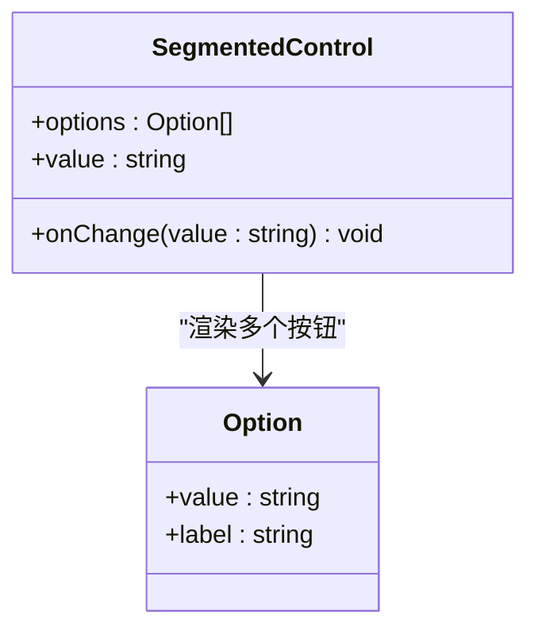
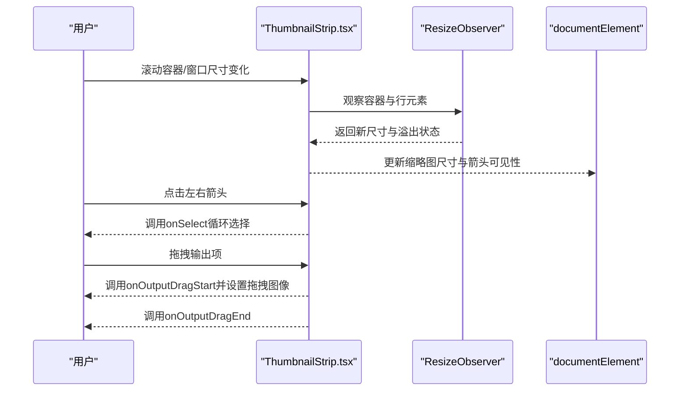
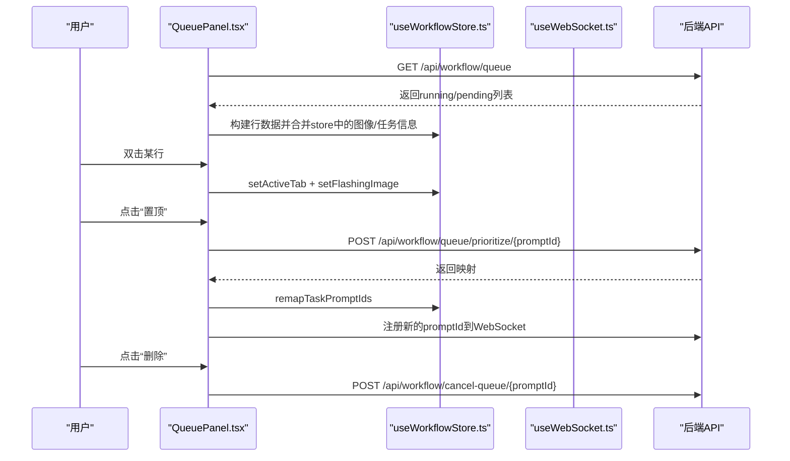
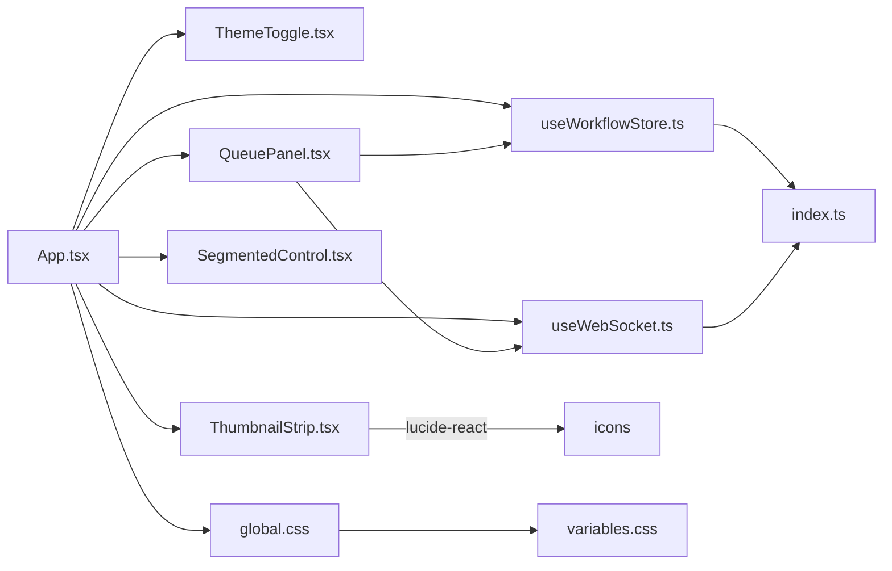

# UI 组件库

<cite>
**本文引用的文件**
- [ThemeToggle.tsx](file://client/src/components/ThemeToggle.tsx)
- [SegmentedControl.tsx](file://client/src/components/SegmentedControl.tsx)
- [ThumbnailStrip.tsx](file://client/src/components/ThumbnailStrip.tsx)
- [QueuePanel.tsx](file://client/src/components/QueuePanel.tsx)
- [App.tsx](file://client/src/components/App.tsx)
- [global.css](file://client/src/styles/global.css)
- [variables.css](file://client/src/styles/variables.css)
- [useWorkflowStore.ts](file://client/src/hooks/useWorkflowStore.ts)
- [useWebSocket.ts](file://client/src/hooks/useWebSocket.ts)
- [index.ts](file://client/src/types/index.ts)
- [sessionService.ts](file://client/src/services/sessionService.ts)
- [README.md](file://README.md)
</cite>

## 目录
1. [简介](#简介)
2. [项目结构](#项目结构)
3. [核心组件](#核心组件)
4. [架构总览](#架构总览)
5. [组件详解](#组件详解)
6. [依赖关系分析](#依赖关系分析)
7. [性能与可访问性](#性能与可访问性)
8. [故障排查指南](#故障排查指南)
9. [结论](#结论)
10. [附录：最佳实践与示例路径](#附录最佳实践与示例路径)

## 简介
本文件面向 UI 组件库的使用者与维护者，系统梳理并深入解析项目中的自定义 UI 组件，包括 ThemeToggle 主题切换器、SegmentedControl 分段控制器、ThumbnailStrip 缩略图条、QueuePanel 队列面板等。文档从设计理念、功能特性、属性配置、事件处理、样式定制、响应式与无障碍、性能与兼容性等方面进行说明，并提供最佳实践、组合技巧与扩展建议，帮助初学者快速上手，同时为有经验的开发者提供深度定制参考。

## 项目结构
该前端采用 Vite + React + TypeScript 架构，组件集中在 client/src/components 下，样式通过 CSS 变量与全局样式统一管理，状态通过 Zustand 的 useWorkflowStore 管理，实时进度通过 WebSocket useWebSocket 钩子接收。

图表来源
- [App.tsx:136-334](file://client/src/components/App.tsx#L136-L334)
- [ThemeToggle.tsx:1-39](file://client/src/components/ThemeToggle.tsx#L1-L39)
- [SegmentedControl.tsx:1-48](file://client/src/components/SegmentedControl.tsx#L1-L48)
- [ThumbnailStrip.tsx:1-231](file://client/src/components/ThumbnailStrip.tsx#L1-L231)
- [QueuePanel.tsx:1-306](file://client/src/components/QueuePanel.tsx#L1-L306)
- [global.css:1-224](file://client/src/styles/global.css#L1-L224)
- [variables.css:1-31](file://client/src/styles/variables.css#L1-L31)
- [useWorkflowStore.ts:1-645](file://client/src/hooks/useWorkflowStore.ts#L1-L645)
- [useWebSocket.ts:1-99](file://client/src/hooks/useWebSocket.ts#L1-L99)
- [index.ts:1-58](file://client/src/types/index.ts#L1-L58)
- [sessionService.ts:1-134](file://client/src/services/sessionService.ts#L1-L134)

章节来源
- [README.md:41-79](file://README.md#L41-L79)

## 核心组件
- ThemeToggle：基于本地存储与 HTML 元素属性切换明暗主题，支持图标按钮与标题提示。
- SegmentedControl：轻量分段选择控件，支持动态选项、选中态样式与过渡动画。
- ThumbnailStrip：响应式缩略图滚动条，支持左右导航、选中高亮、拖拽输出、视频预览、溢出检测。
- QueuePanel：任务队列面板，轮询后端队列状态，支持置顶、取消、定位到对应图像卡片，带进度条与动画。

章节来源
- [ThemeToggle.tsx:1-39](file://client/src/components/ThemeToggle.tsx#L1-L39)
- [SegmentedControl.tsx:1-48](file://client/src/components/SegmentedControl.tsx#L1-L48)
- [ThumbnailStrip.tsx:1-231](file://client/src/components/ThumbnailStrip.tsx#L1-L231)
- [QueuePanel.tsx:1-306](file://client/src/components/QueuePanel.tsx#L1-L306)

## 架构总览
组件间通过状态与事件协作：
- App.tsx 作为根容器，挂载主题切换器、分段控制器、缩略图条与队列面板，并负责拖拽导入与视图大小切换。
- useWorkflowStore 提供工作流状态、任务进度、输出索引等数据；useWebSocket 提供与 ComfyUI 的实时通信。
- QueuePanel 基于后端接口轮询队列，结合 store 数据渲染任务行与进度。
- 样式通过 CSS 变量与全局动画统一风格，支持明暗主题切换。

图表来源
- [App.tsx:74-81](file://client/src/components/App.tsx#L74-L81)
- [useWebSocket.ts:1-99](file://client/src/hooks/useWebSocket.ts#L1-L99)
- [useWorkflowStore.ts:166-195](file://client/src/hooks/useWorkflowStore.ts#L166-L195)
- [QueuePanel.tsx:37-121](file://client/src/components/QueuePanel.tsx#L37-L121)

## 组件详解

### ThemeToggle 主题切换器
- 功能特性
  - 读取本地存储决定初始主题，切换时更新 documentElement 的 data-theme 属性并持久化。
  - 使用图标按钮显示当前主题，title 提示切换操作。
- 属性与事件
  - 无外部 props；内部通过点击事件切换状态。
- 样式定制
  - 使用 CSS 变量控制颜色与透明度，适配明暗主题。
- 无障碍与兼容性
  - 按钮具备 title 提示；使用语义化 button；支持键盘访问。
- 使用示例路径
  - 在 App.tsx 中直接引入并渲染，用于页面头部右侧区域。

图表来源
- [ThemeToggle.tsx:5-17](file://client/src/components/ThemeToggle.tsx#L5-L17)

章节来源
- [ThemeToggle.tsx:1-39](file://client/src/components/ThemeToggle.tsx#L1-L39)
- [variables.css:1-31](file://client/src/styles/variables.css#L1-L31)
- [global.css:16-22](file://client/src/styles/global.css#L16-L22)

### SegmentedControl 分段控制器
- 功能特性
  - 支持动态选项数组，根据当前值高亮选中项，未选中项使用次级文本色。
  - 内置过渡动画，提升交互体验。
- 属性与事件
  - options: 选项数组，包含 value 与 label。
  - value: 当前选中值。
  - onChange: 回调函数，参数为选中值。
- 样式定制
  - 通过 CSS 变量控制背景、边框、圆角、文字颜色与过渡时间。
- 使用示例路径
  - 在需要进行二选一或多选一的场景中使用，如视图尺寸、模型选择等。

图表来源
- [SegmentedControl.tsx:1-10](file://client/src/components/SegmentedControl.tsx#L1-L10)

章节来源
- [SegmentedControl.tsx:1-48](file://client/src/components/SegmentedControl.tsx#L1-L48)
- [variables.css:1-31](file://client/src/styles/variables.css#L1-L31)

### ThumbnailStrip 缩略图条
- 功能特性
  - 响应式尺寸：根据容器宽度自动选择缩略图尺寸、间距与箭头大小。
  - 溢出检测：当内容超出容器时显示左右导航按钮。
  - 选中高亮：选中项显示强调轮廓与不透明度变化。
  - 拖拽输出：支持将输出项拖拽到其他位置，使用自定义拖拽图像。
  - 视频预览：对视频项使用 video 标签，封面为第一帧。
  - 原始与结果分隔：在第1个结果处插入垂直分隔线。
- 属性与事件
  - items: 条目数组，包含 filename、url、isVideo。
  - selectedIndex: 当前选中索引。
  - onSelect(index): 选中回调。
  - onOutputDragStart(outputIndex): 输出拖拽开始回调。
  - onOutputDragEnd(): 拖拽结束回调。
  - onMouseEnter/onMouseLeave: 鼠标进入/离开回调。
- 样式定制
  - 通过 CSS 变量控制尺寸、间距、颜色与阴影滤镜。
- 使用示例路径
  - 在 PhotoWall/PhotoWall 相关组件中作为底部缩略图条使用。

图表来源
- [ThumbnailStrip.tsx:48-61](file://client/src/components/ThumbnailStrip.tsx#L48-L61)
- [ThumbnailStrip.tsx:70-78](file://client/src/components/ThumbnailStrip.tsx#L70-L78)
- [ThumbnailStrip.tsx:154-168](file://client/src/components/ThumbnailStrip.tsx#L154-L168)

章节来源
- [ThumbnailStrip.tsx:1-231](file://client/src/components/ThumbnailStrip.tsx#L1-L231)
- [variables.css:1-31](file://client/src/styles/variables.css#L1-L31)
- [global.css:125-125](file://client/src/styles/global.css#L125-L125)

### QueuePanel 队列面板
- 功能特性
  - 定时轮询后端队列，构建行数据（运行中/排队中），关联工作流名称与图像信息。
  - 支持置顶（将任务移到下一个执行）、取消队列、双击定位到对应图像卡片并高亮。
  - 运行中任务显示进度条与脉冲动画。
  - 支持传入关闭动画样式与关闭状态。
- 属性与事件
  - onClose(): 关闭回调。
  - popupStyle?: 自定义面板样式。
  - closing?: 是否处于关闭动画中。
- 样式定制
  - 使用 CSS 变量控制背景、边框、圆角与阴影；通过动画类实现面板进入/退出效果。
- 使用示例路径
  - 在 App.tsx 中作为弹出面板使用，位于页面右下角，随任务状态变化自动刷新。

图表来源
- [QueuePanel.tsx:37-81](file://client/src/components/QueuePanel.tsx#L37-L81)
- [QueuePanel.tsx:89-121](file://client/src/components/QueuePanel.tsx#L89-L121)
- [QueuePanel.tsx:123-133](file://client/src/components/QueuePanel.tsx#L123-L133)
- [useWorkflowStore.ts:166-195](file://client/src/hooks/useWorkflowStore.ts#L166-L195)
- [useWebSocket.ts:91-95](file://client/src/hooks/useWebSocket.ts#L91-L95)

章节来源
- [QueuePanel.tsx:1-306](file://client/src/components/QueuePanel.tsx#L1-L306)
- [useWorkflowStore.ts:1-645](file://client/src/hooks/useWorkflowStore.ts#L1-L645)
- [useWebSocket.ts:1-99](file://client/src/hooks/useWebSocket.ts#L1-L99)
- [global.css:160-171](file://client/src/styles/global.css#L160-L171)

## 依赖关系分析
- 组件依赖
  - App.tsx 依赖 ThemeToggle、QueuePanel、状态与 WebSocket 钩子。
  - QueuePanel 依赖 useWorkflowStore 与 useWebSocket，调用后端 API。
  - ThumbnailStrip 依赖 ResizeObserver 与 lucide-react 图标。
  - SegmentedControl 为纯函数组件，无外部依赖。
- 样式依赖
  - 所有组件共享 variables.css 的 CSS 变量，global.css 提供动画与通用样式。
- 类型与服务
  - 类型定义在 index.ts；会话与上传服务在 sessionService.ts。

图表来源
- [App.tsx:1-335](file://client/src/components/App.tsx#L1-L335)
- [ThemeToggle.tsx:1-39](file://client/src/components/ThemeToggle.tsx#L1-L39)
- [QueuePanel.tsx:1-306](file://client/src/components/QueuePanel.tsx#L1-L306)
- [ThumbnailStrip.tsx:1-231](file://client/src/components/ThumbnailStrip.tsx#L1-L231)
- [SegmentedControl.tsx:1-48](file://client/src/components/SegmentedControl.tsx#L1-L48)
- [useWorkflowStore.ts:1-645](file://client/src/hooks/useWorkflowStore.ts#L1-L645)
- [useWebSocket.ts:1-99](file://client/src/hooks/useWebSocket.ts#L1-L99)
- [index.ts:1-58](file://client/src/types/index.ts#L1-L58)
- [global.css:1-224](file://client/src/styles/global.css#L1-L224)
- [variables.css:1-31](file://client/src/styles/variables.css#L1-L31)

章节来源
- [index.ts:1-58](file://client/src/types/index.ts#L1-L58)
- [sessionService.ts:1-134](file://client/src/services/sessionService.ts#L1-L134)

## 性能与可访问性
- 性能
  - QueuePanel 使用定时器轮询队列，建议在组件卸载时清理定时器，避免内存泄漏。
  - ThumbnailStrip 使用 ResizeObserver 监听容器尺寸变化，注意在组件卸载时断开观察者。
  - QueuePanel 的定位动画使用 smooth 滚动，建议在大量卡片时评估滚动性能。
- 可访问性
  - ThemeToggle 使用按钮与 title 提示，具备键盘可达性。
  - SegmentedControl 使用 button 渲染选项，具备语义化与键盘导航。
  - QueuePanel 行项具备 hover 状态与双击定位，建议补充键盘快捷键。
- 兼容性
  - 使用 CSS 变量与现代动画，确保在主流浏览器中正常渲染。
  - 拖拽 API 与 ResizeObserver 在现代浏览器中可用，需关注旧版浏览器降级策略。

[本节为通用指导，无需特定文件来源]

## 故障排查指南
- 队列面板不刷新
  - 检查后端 /api/workflow/queue 是否返回正确格式；确认轮询定时器是否被清理。
  - 参考路径：[QueuePanel.tsx:37-87](file://client/src/components/QueuePanel.tsx#L37-L87)
- WebSocket 无法接收进度
  - 确认 useWebSocket 已初始化且连接状态为 OPEN；检查消息类型匹配。
  - 参考路径：[useWebSocket.ts:75-98](file://client/src/hooks/useWebSocket.ts#L75-L98)
- 缩略图条不显示箭头
  - 检查 ResizeObserver 是否正确计算溢出状态；确认容器宽度变化触发逻辑。
  - 参考路径：[ThumbnailStrip.tsx:48-61](file://client/src/components/ThumbnailStrip.tsx#L48-L61)
- 主题切换无效
  - 检查 localStorage 中的 theme 值与 documentElement 的 data-theme 设置。
  - 参考路径：[ThemeToggle.tsx:5-17](file://client/src/components/ThemeToggle.tsx#L5-L17)

章节来源
- [QueuePanel.tsx:37-87](file://client/src/components/QueuePanel.tsx#L37-L87)
- [useWebSocket.ts:75-98](file://client/src/hooks/useWebSocket.ts#L75-L98)
- [ThumbnailStrip.tsx:48-61](file://client/src/components/ThumbnailStrip.tsx#L48-L61)
- [ThemeToggle.tsx:5-17](file://client/src/components/ThemeToggle.tsx#L5-L17)

## 结论
本 UI 组件库以简洁、可复用为核心目标，通过 CSS 变量与全局样式实现一致的视觉语言，配合 Zustand 与 WebSocket 实现高效的状态与实时通信。四个核心组件分别覆盖主题切换、分段选择、缩略图浏览与任务队列管理，满足批量图像/视频处理场景下的交互需求。建议在实际项目中遵循本文的最佳实践，结合业务场景进行扩展与定制。

[本节为总结，无需特定文件来源]

## 附录：最佳实践与示例路径
- 组件组合
  - 将 ThemeToggle 放置于页面头部右侧，与 SessionBar、Settings 等并列。
  - 在需要二选一或多选一的设置中使用 SegmentedControl。
  - 在 PhotoWall 底部使用 ThumbnailStrip 作为输出浏览与拖拽入口。
  - 在主界面右下角使用 QueuePanel 作为任务队列入口。
- 样式覆盖
  - 通过 CSS 变量覆盖主题色与间距；避免直接修改组件内部样式。
  - 如需调整动画时长，可在 global.css 中修改相关 keyframes。
- 事件处理
  - 对于 QueuePanel 的置顶与取消，务必在调用后端接口后刷新队列数据。
  - 对于 ThumbnailStrip 的拖拽输出，确保 onOutputDragStart 正确传递 outputIndex 并设置拖拽图像。
- 示例路径
  - 主题切换器使用：[App.tsx:183-204](file://client/src/components/App.tsx#L183-L204)
  - 分段控制器使用：[App.tsx:66-73](file://client/src/components/App.tsx#L66-L73)
  - 缩略图条使用：[App.tsx:240-253](file://client/src/components/App.tsx#L240-L253)
  - 队列面板使用：[App.tsx:208-279](file://client/src/components/App.tsx#L208-L279)

章节来源
- [App.tsx:136-334](file://client/src/components/App.tsx#L136-L334)
- [global.css:1-224](file://client/src/styles/global.css#L1-L224)
- [variables.css:1-31](file://client/src/styles/variables.css#L1-L31)