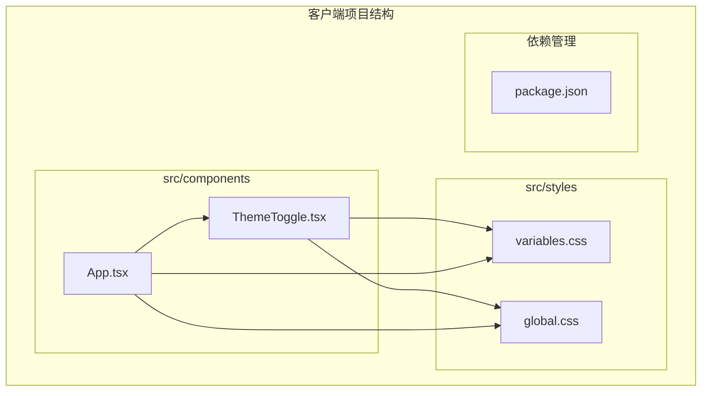
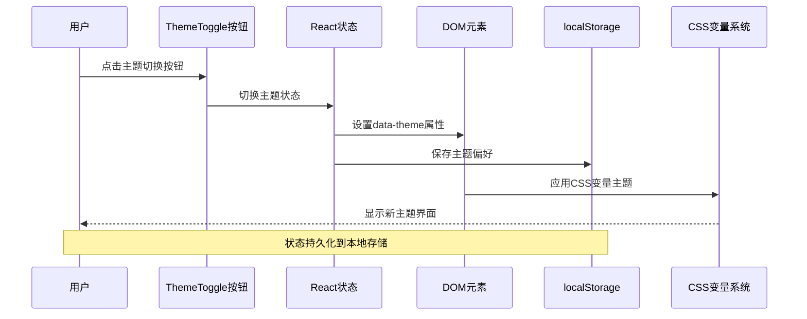
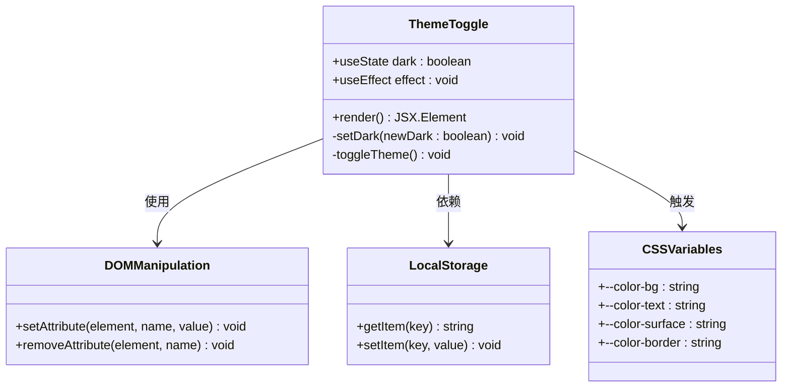
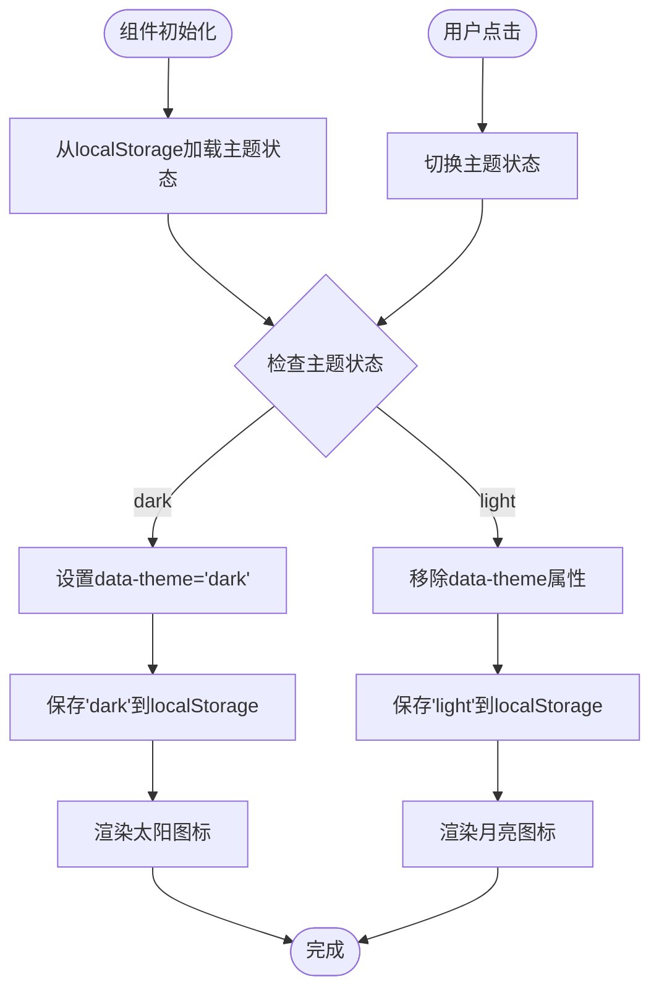
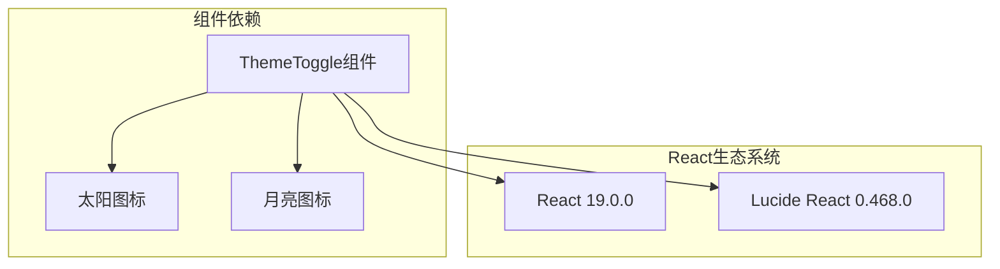
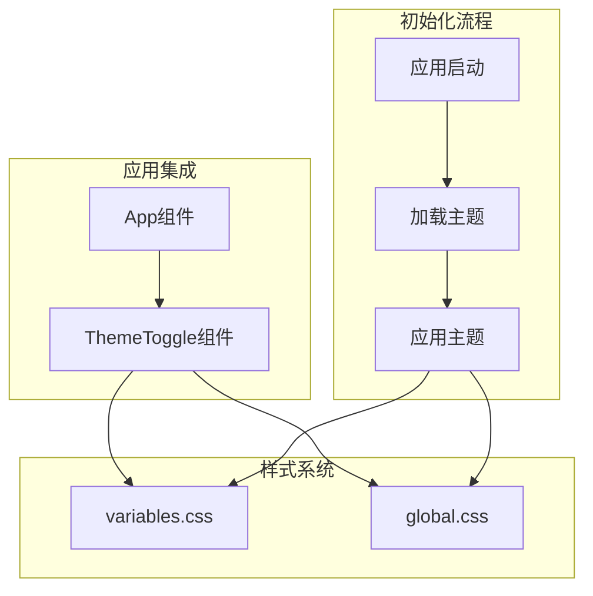

# 主题切换组件

<cite>
**本文档引用的文件**
- [ThemeToggle.tsx](file://client/src/components/ThemeToggle.tsx)
- [App.tsx](file://client/src/components/App.tsx)
- [variables.css](file://client/src/styles/variables.css)
- [global.css](file://client/src/styles/global.css)
- [package.json](file://client/package.json)
- [vite.config.ts](file://client/vite.config.ts)
</cite>

## 目录
1. [简介](#简介)
2. [项目结构](#项目结构)
3. [核心组件](#核心组件)
4. [架构概览](#架构概览)
5. [详细组件分析](#详细组件分析)
6. [依赖关系分析](#依赖关系分析)
7. [性能考虑](#性能考虑)
8. [故障排除指南](#故障排除指南)
9. [结论](#结论)
10. [附录](#附录)

## 简介

ThemeToggle 是一个轻量级的主题切换组件，用于在明暗主题之间进行切换。该组件采用现代前端技术栈构建，结合了 React Hooks、CSS 变量系统和本地存储持久化机制，为用户提供流畅的主题切换体验。

该组件的核心特性包括：
- 基于 CSS 变量的主题系统
- 本地存储状态持久化
- 图标动态切换
- 性能优化的 DOM 操作
- 与现有应用架构的无缝集成

## 项目结构

ThemeToggle 组件位于客户端项目的组件目录中，与全局样式系统紧密集成：



**图表来源**
- [ThemeToggle.tsx:1-39](file://client/src/components/ThemeToggle.tsx#L1-L39)
- [App.tsx:14-185](file://client/src/components/App.tsx#L14-L185)
- [variables.css:1-31](file://client/src/styles/variables.css#L1-L31)

**章节来源**
- [ThemeToggle.tsx:1-39](file://client/src/components/ThemeToggle.tsx#L1-L39)
- [App.tsx:14-185](file://client/src/components/App.tsx#L14-L185)
- [variables.css:1-31](file://client/src/styles/variables.css#L1-L31)

## 核心组件

ThemeToggle 组件是一个纯函数式组件，实现了完整的主题切换功能。其核心实现包含三个主要部分：

### 状态管理机制
组件使用 React 的 useState Hook 来管理主题状态，并通过 useEffect Hook 处理副作用逻辑。

### DOM 属性切换
组件通过操作 `document.documentElement` 的 `data-theme` 属性来切换主题状态。

### 本地存储持久化
组件使用 localStorage API 来持久化用户的主题偏好设置。

**章节来源**
- [ThemeToggle.tsx:4-17](file://client/src/components/ThemeToggle.tsx#L4-L17)

## 架构概览

ThemeToggle 组件与整个应用的架构集成如下：



**图表来源**
- [ThemeToggle.tsx:9-17](file://client/src/components/ThemeToggle.tsx#L9-L17)
- [App.tsx:76-81](file://client/src/components/App.tsx#L76-L81)

## 详细组件分析

### 组件类图



**图表来源**
- [ThemeToggle.tsx:1-39](file://client/src/components/ThemeToggle.tsx#L1-L39)
- [variables.css:1-31](file://client/src/styles/variables.css#L1-L31)

### 主题切换流程



**图表来源**
- [ThemeToggle.tsx:5-17](file://client/src/components/ThemeToggle.tsx#L5-L17)

### CSS 变量系统

组件依赖于 CSS 变量系统来实现主题切换：

```mermaid
graph LR
subgraph "CSS变量定义"
Root[:root变量]
Dark:[data-theme='dark']变量
end
subgraph "主题切换"
Light[亮色主题]
DarkTheme[暗色主题]
end
subgraph "颜色映射"
BG[背景色]
TEXT[文本色]
SURFACE[表面色]
BORDER[边框色]
end
Root --> BG
Root --> TEXT
Root --> SURFACE
Root --> BORDER
Dark --> BG
Dark --> TEXT
Dark --> SURFACE
Dark --> BORDER
Light --> Root
DarkTheme --> Dark
```

**图表来源**
- [variables.css:1-31](file://client/src/styles/variables.css#L1-L31)
- [global.css:155-158](file://client/src/styles/global.css#L155-L158)

**章节来源**
- [ThemeToggle.tsx:19-37](file://client/src/components/ThemeToggle.tsx#L19-L37)
- [variables.css:1-31](file://client/src/styles/variables.css#L1-L31)
- [global.css:155-158](file://client/src/styles/global.css#L155-L158)

## 依赖关系分析

### 外部依赖

ThemeToggle 组件依赖于以下外部库：



**图表来源**
- [ThemeToggle.tsx:1-2](file://client/src/components/ThemeToggle.tsx#L1-L2)
- [package.json:11-16](file://client/package.json#L11-L16)

### 内部依赖关系



**图表来源**
- [App.tsx:14](file://client/src/components/App.tsx#L14)
- [App.tsx:76-81](file://client/src/components/App.tsx#L76-L81)

**章节来源**
- [package.json:11-16](file://client/package.json#L11-L16)
- [App.tsx:14](file://client/src/components/App.tsx#L14)
- [App.tsx:76-81](file://client/src/components/App.tsx#L76-L81)

## 性能考虑

### 渲染优化

ThemeToggle 组件采用了多项性能优化策略：

1. **最小化重渲染**: 使用 useState Hook 管理单一布尔值状态
2. **高效的 DOM 操作**: 直接操作 `document.documentElement` 属性
3. **CSS 变量切换**: 通过 CSS 变量而非内联样式的切换实现硬件加速
4. **懒加载初始化**: 仅在组件挂载时从 localStorage 加载状态

### 内存管理

组件具有良好的内存管理特性：
- 无外部订阅或事件监听器
- useEffect 清理函数未使用（因为是全局状态）
- 无大型数据结构占用

### 浏览器兼容性

组件考虑了现代浏览器的兼容性：
- 使用标准的 localStorage API
- 支持 CSS 变量系统
- 兼容现代 JavaScript 特性

## 故障排除指南

### 常见问题及解决方案

#### 主题状态不同步
**问题**: 页面刷新后主题状态不正确
**解决方案**: 检查 App 组件中的初始化逻辑是否正确执行

#### 图标不显示
**问题**: 主题切换按钮显示为空白
**解决方案**: 确认 lucide-react 包已正确安装和导入

#### 样式不生效
**问题**: 主题切换后样式没有变化
**解决方案**: 验证 CSS 变量是否正确定义和应用

**章节来源**
- [App.tsx:76-81](file://client/src/components/App.tsx#L76-L81)
- [ThemeToggle.tsx:35](file://client/src/components/ThemeToggle.tsx#L35)

## 结论

ThemeToggle 组件是一个设计精良的主题切换解决方案，它成功地将现代前端最佳实践与实用功能相结合。组件的主要优势包括：

1. **简洁高效**: 实现了最小化的代码复杂度
2. **性能优秀**: 通过 CSS 变量实现硬件加速的主题切换
3. **用户体验良好**: 提供即时反馈和持久化状态
4. **易于集成**: 与现有应用架构无缝集成
5. **可扩展性强**: 为未来的主题定制提供了基础

该组件为开发者提供了一个可靠的起点，可以在此基础上添加更多高级功能，如动画效果、多主题支持等。

## 附录

### 使用示例

#### 基本用法
```typescript
// 在应用头部引入
import { ThemeToggle } from './components/ThemeToggle';

// 在组件中使用
<header>
  <ThemeToggle />
</header>
```

#### 自定义配置选项
虽然当前版本不支持直接的配置参数，但可以通过以下方式实现自定义：

1. **自定义图标**: 替换 Lucide 图标库中的图标
2. **自定义样式**: 通过 CSS 变量覆盖默认样式
3. **动画效果**: 添加 CSS 过渡动画

### 扩展指导

#### 多主题支持
要支持多个主题，可以考虑：
1. 扩展 localStorage 存储格式
2. 添加主题枚举类型
3. 实现主题预设切换

#### 动画效果
可以为主题切换添加动画效果：
1. CSS 过渡动画
2. React Spring 动画库
3. Web Animations API

#### 高级功能
未来可以考虑的功能增强：
1. 系统主题检测
2. 颜色方案自定义
3. 主题预览功能
4. 主题同步到服务器