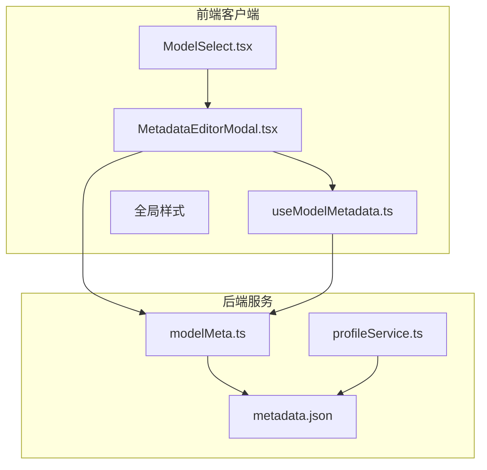
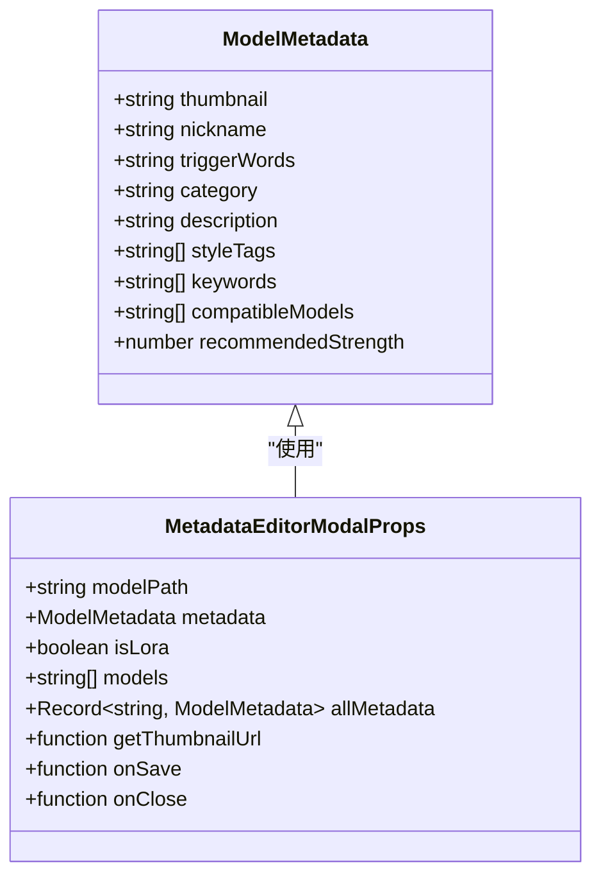
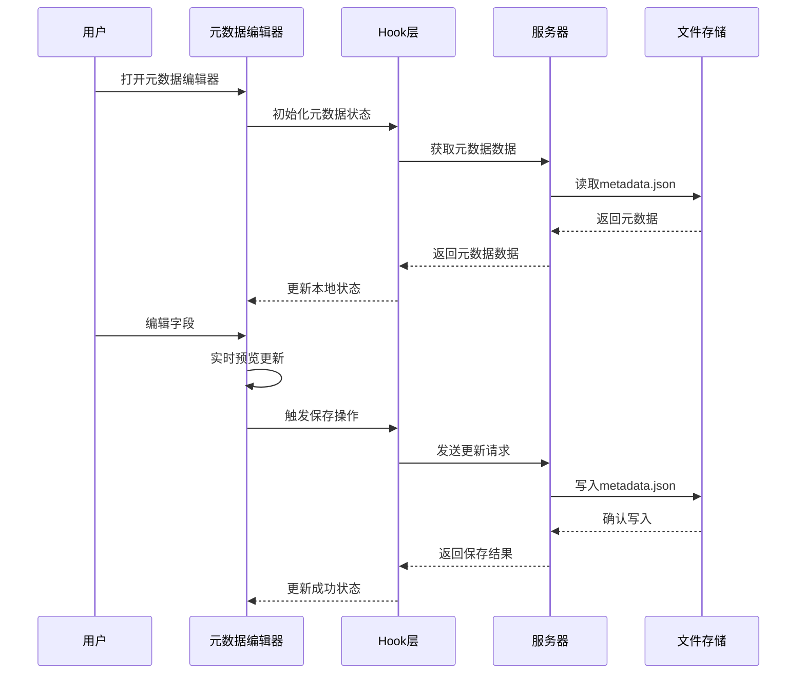
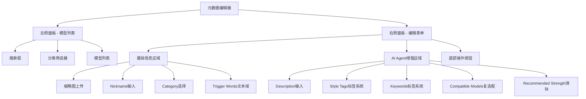
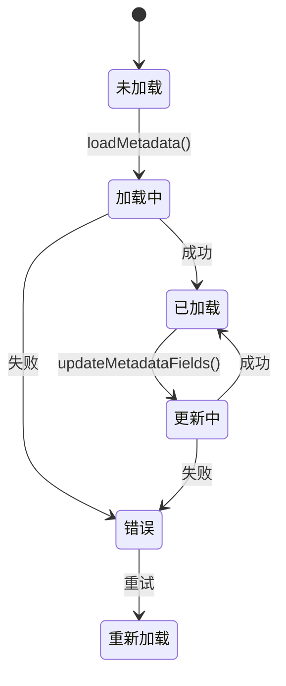
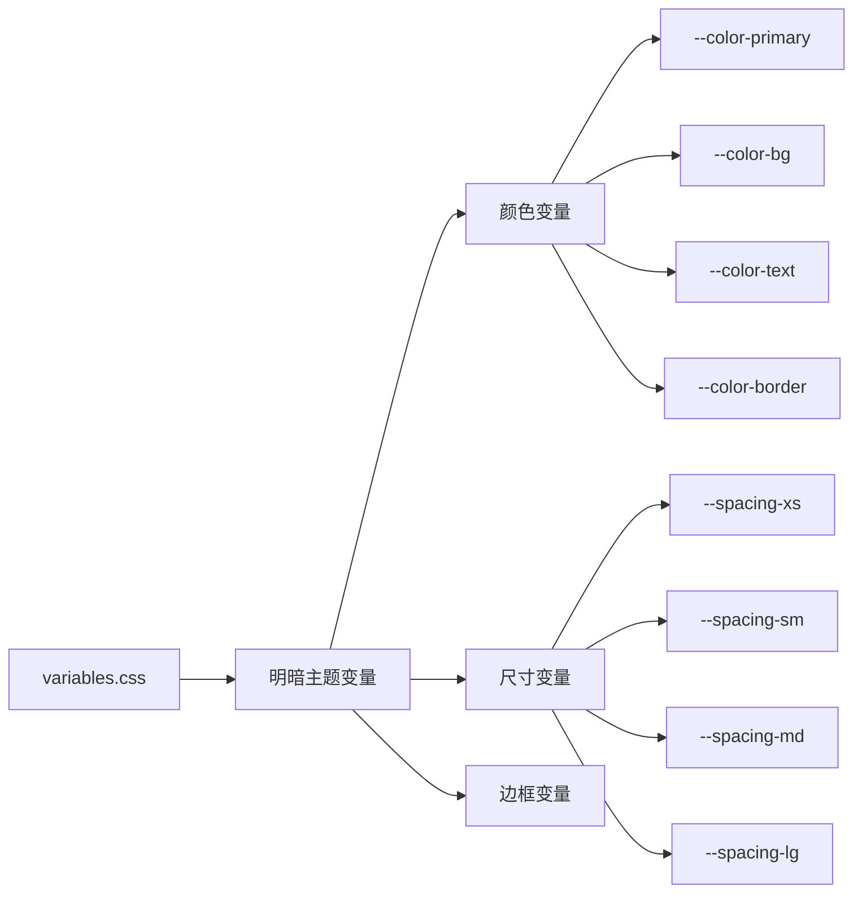
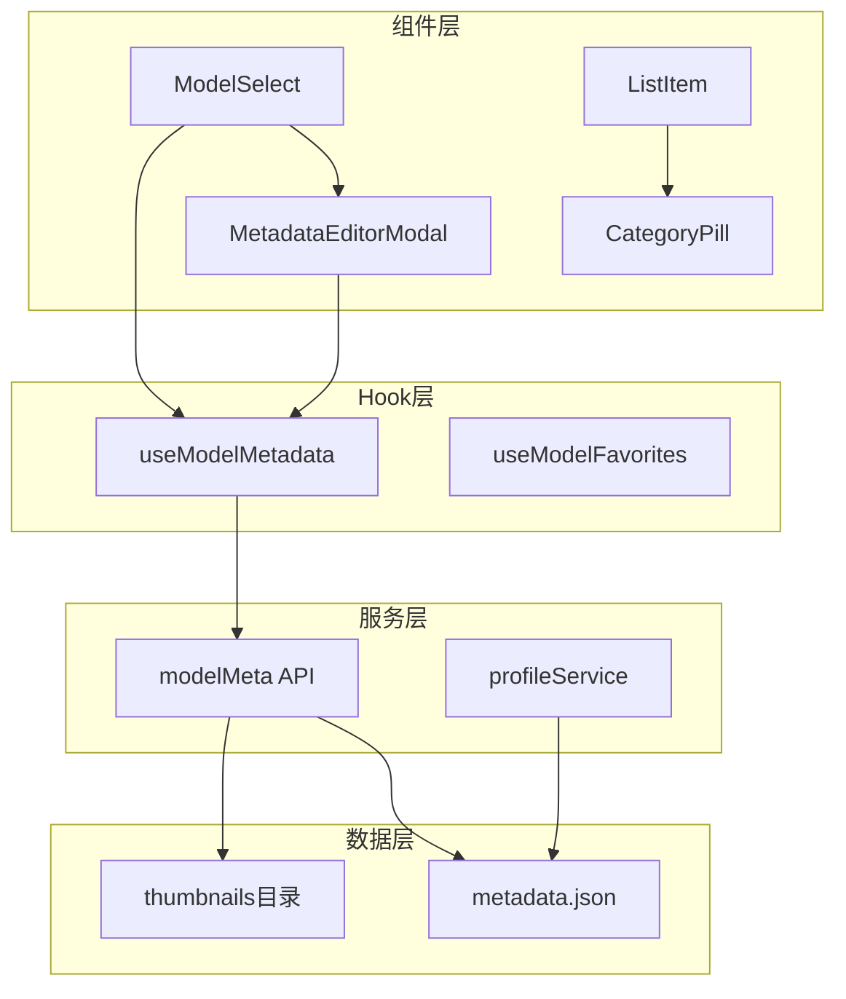

# 元数据编辑器模态框

<cite>
**本文档引用的文件**
- [MetadataEditorModal.tsx](file://client/src/components/MetadataEditorModal.tsx)
- [useModelMetadata.ts](file://client/src/hooks/useModelMetadata.ts)
- [modelMeta.ts](file://server/src/routes/modelMeta.ts)
- [metadata.json](file://model_meta/metadata.json)
- [ModelSelect.tsx](file://client/src/components/ModelSelect.tsx)
- [profileService.ts](file://server/src/services/profileService.ts)
- [global.css](file://client/src/styles/global.css)
- [variables.css](file://client/src/styles/variables.css)
</cite>

## 目录
1. [简介](#简介)
2. [项目结构](#项目结构)
3. [核心组件](#核心组件)
4. [架构概览](#架构概览)
5. [详细组件分析](#详细组件分析)
6. [依赖关系分析](#依赖关系分析)
7. [性能考虑](#性能考虑)
8. [故障排除指南](#故障排除指南)
9. [结论](#结论)

## 简介

元数据编辑器模态框是 CorineKit Pix2Real 项目中的一个重要功能模块，用于管理和编辑模型元数据信息。该组件提供了直观的界面来管理模型的缩略图、昵称、分类、触发词以及 AI Agent 增强功能所需的各类元数据字段。

该模态框支持单模型和多模型编辑模式，具备智能的自动填充功能、实时预览和批量操作能力。通过与服务器端的元数据管理系统集成，实现了完整的元数据生命周期管理。

## 项目结构

该项目采用前后端分离的架构设计，元数据编辑器位于前端客户端，通过 API 与后端服务进行交互。

**图表来源**
- [MetadataEditorModal.tsx:1-802](file://client/src/components/MetadataEditorModal.tsx#L1-L802)
- [useModelMetadata.ts:1-248](file://client/src/hooks/useModelMetadata.ts#L1-L248)
- [modelMeta.ts:1-272](file://server/src/routes/modelMeta.ts#L1-L272)

**章节来源**
- [MetadataEditorModal.tsx:1-802](file://client/src/components/MetadataEditorModal.tsx#L1-L802)
- [useModelMetadata.ts:1-248](file://client/src/hooks/useModelMetadata.ts#L1-L248)
- [modelMeta.ts:1-272](file://server/src/routes/modelMeta.ts#L1-L272)

## 核心组件

### 元数据编辑器主组件

元数据编辑器模态框是整个功能的核心组件，提供了完整的元数据管理界面。该组件支持以下主要功能：

- **双面板布局**：左侧为模型列表和筛选器，右侧为编辑表单
- **多模型支持**：可以同时编辑多个模型的元数据
- **智能自动填充**：根据模型路径和内容自动填充相关字段
- **实时预览**：编辑过程中实时显示缩略图和效果
- **批量操作**：支持一键保存所有更改

### 数据模型定义

**图表来源**
- [useModelMetadata.ts:3-14](file://client/src/hooks/useModelMetadata.ts#L3-L14)
- [MetadataEditorModal.tsx:7-16](file://client/src/components/MetadataEditorModal.tsx#L7-L16)

**章节来源**
- [useModelMetadata.ts:1-248](file://client/src/hooks/useModelMetadata.ts#L1-L248)
- [MetadataEditorModal.tsx:1-802](file://client/src/components/MetadataEditorModal.tsx#L1-L802)

## 架构概览

元数据编辑器采用响应式设计和现代前端技术栈构建，确保良好的用户体验和性能表现。

**图表来源**
- [MetadataEditorModal.tsx:273-293](file://client/src/components/MetadataEditorModal.tsx#L273-L293)
- [useModelMetadata.ts:204-228](file://client/src/hooks/useModelMetadata.ts#L204-L228)
- [modelMeta.ts:227-269](file://server/src/routes/modelMeta.ts#L227-L269)

## 详细组件分析

### 元数据编辑器主组件

#### 组件结构分析

元数据编辑器采用双面板设计，左侧提供模型浏览和筛选功能，右侧提供详细的编辑表单。

**图表来源**
- [MetadataEditorModal.tsx:456-763](file://client/src/components/MetadataEditorModal.tsx#L456-L763)

#### 自动填充机制

组件内置了智能的自动填充功能，能够根据模型路径和现有数据自动填充相关字段：

- **中文关键词提取**：从模型昵称中提取中文字符作为关键词
- **兼容模型推断**：根据模型路径包含的关键字推断兼容的基础模型
- **描述自动生成**：基于昵称和分类自动生成描述文本
- **缩略图预览**：实时显示上传的缩略图

**章节来源**
- [MetadataEditorModal.tsx:22-35](file://client/src/components/MetadataEditorModal.tsx#L22-L35)
- [MetadataEditorModal.tsx:232-266](file://client/src/components/MetadataEditorModal.tsx#L232-L266)

### Hook层数据管理

#### useModelMetadata Hook

Hook层提供了完整的元数据管理功能，包括数据加载、更新和同步：

**图表来源**
- [useModelMetadata.ts:16-33](file://client/src/hooks/useModelMetadata.ts#L16-L33)
- [useModelMetadata.ts:204-228](file://client/src/hooks/useModelMetadata.ts#L204-L228)

#### 服务器端API集成

服务器端提供了完整的元数据管理API，支持多种操作：

- **GET /metadata**：获取所有元数据
- **POST /metadata/thumbnail**：上传缩略图
- **POST /metadata/nickname**：设置昵称
- **DELETE /metadata/thumbnail**：删除缩略图
- **PUT /metadata/update**：批量更新元数据

**章节来源**
- [useModelMetadata.ts:19-28](file://client/src/hooks/useModelMetadata.ts#L19-L28)
- [modelMeta.ts:43-47](file://server/src/routes/modelMeta.ts#L43-L47)
- [modelMeta.ts:49-83](file://server/src/routes/modelMeta.ts#L49-L83)

### 样式系统

#### 主题变量系统

组件使用 CSS 变量实现主题切换，支持明暗两种主题模式：

**图表来源**
- [variables.css:1-31](file://client/src/styles/variables.css#L1-L31)

#### 动画和过渡效果

组件集成了丰富的动画效果，提升用户体验：

- **模态框进入/退出动画**
- **按钮悬停效果**
- **滚动条自定义样式**
- **加载状态动画**

**章节来源**
- [global.css:16-292](file://client/src/styles/global.css#L16-L292)

## 依赖关系分析

### 组件间依赖关系

**图表来源**
- [MetadataEditorModal.tsx:1-802](file://client/src/components/MetadataEditorModal.tsx#L1-L802)
- [ModelSelect.tsx:1-1046](file://client/src/components/ModelSelect.tsx#L1-L1046)
- [useModelMetadata.ts:1-248](file://client/src/hooks/useModelMetadata.ts#L1-L248)

### 外部依赖

组件依赖于以下外部库和工具：

- **React 18**：核心框架
- **Lucide React**：图标库
- **Multer**：文件上传处理
- **Express**：Web 服务器框架

**章节来源**
- [MetadataEditorModal.tsx:1-6](file://client/src/components/MetadataEditorModal.tsx#L1-L6)
- [modelMeta.ts:1-7](file://server/src/routes/modelMeta.ts#L1-L7)

## 性能考虑

### 优化策略

1. **虚拟滚动**：对于大量模型的情况，考虑实现虚拟滚动以提高渲染性能
2. **懒加载**：缩略图采用懒加载策略，减少初始加载时间
3. **防抖处理**：搜索和筛选操作使用防抖机制，避免频繁的API调用
4. **内存管理**：及时清理事件监听器和定时器，防止内存泄漏

### 数据缓存

- **本地存储**：分类颜色映射和用户偏好存储在 localStorage 中
- **HTTP缓存**：缩略图URL包含时间戳参数，避免浏览器缓存问题
- **状态同步**：本地状态与服务器状态保持同步，避免数据不一致

## 故障排除指南

### 常见问题及解决方案

#### 缩略图上传失败

**问题症状**：
- 上传按钮无响应
- 控制台出现网络错误

**可能原因**：
- 文件格式不支持
- 服务器磁盘空间不足
- 权限配置问题

**解决步骤**：
1. 检查文件格式是否为支持的图片类型
2. 验证服务器磁盘空间
3. 确认文件权限设置正确

#### 元数据保存失败

**问题症状**：
- 保存按钮显示加载状态但无法完成
- 页面出现错误提示

**可能原因**：
- 网络连接异常
- 服务器端验证失败
- JSON格式错误

**解决步骤**：
1. 检查网络连接状态
2. 查看服务器端日志
3. 验证JSON数据格式

**章节来源**
- [modelMeta.ts:50-83](file://server/src/routes/modelMeta.ts#L50-L83)
- [useModelMetadata.ts:204-228](file://client/src/hooks/useModelMetadata.ts#L204-L228)

## 结论

元数据编辑器模态框是一个功能完善、设计精良的组件，它为用户提供了直观便捷的模型元数据管理体验。通过合理的架构设计和丰富的功能特性，该组件有效地提升了整个系统的可用性和用户体验。

主要优势包括：
- **直观的双面板设计**：清晰的界面布局和功能分区
- **智能的自动填充**：减少手动输入的工作量
- **完善的错误处理**：提供友好的错误反馈和恢复机制
- **优秀的性能表现**：优化的渲染和数据处理机制

未来可以考虑的功能改进包括：
- 增加元数据模板功能
- 实现元数据导入导出
- 添加元数据版本控制
- 优化移动端适配