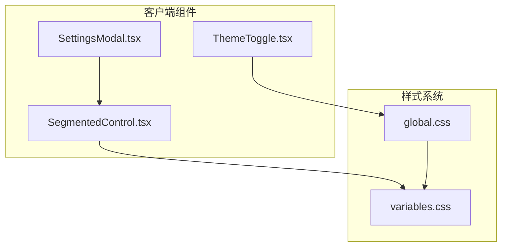
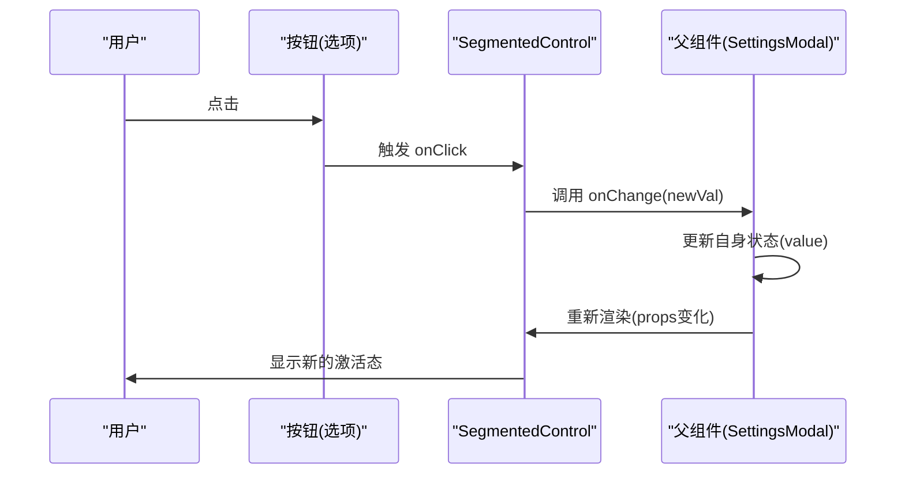
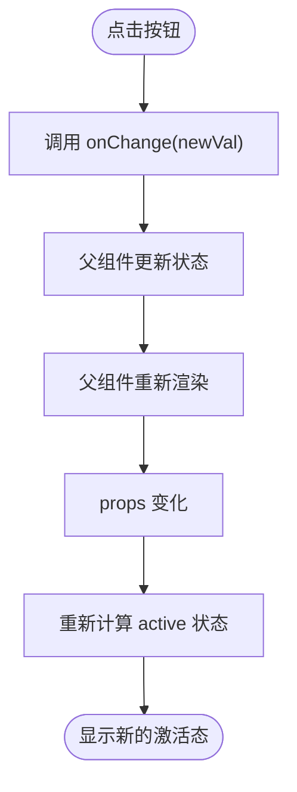
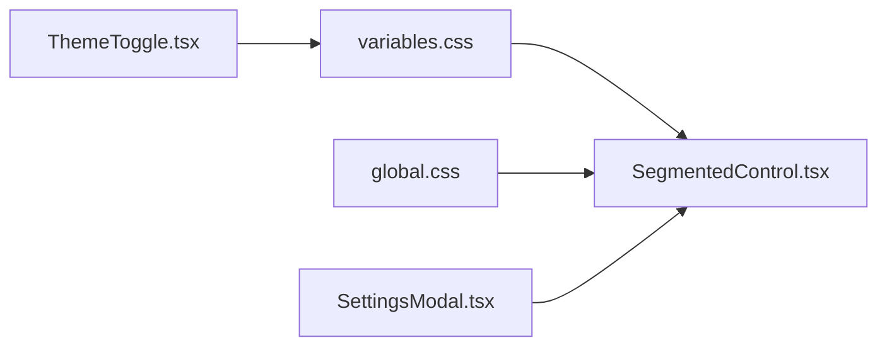

# 分段控制器

<cite>
**本文引用的文件**
- [SegmentedControl.tsx](file://client/src/components/SegmentedControl.tsx)
- [SettingsModal.tsx](file://client/src/components/SettingsModal.tsx)
- [variables.css](file://client/src/styles/variables.css)
- [global.css](file://client/src/styles/global.css)
- [ThemeToggle.tsx](file://client/src/components/ThemeToggle.tsx)
</cite>

## 目录
1. [简介](#简介)
2. [项目结构](#项目结构)
3. [核心组件](#核心组件)
4. [架构总览](#架构总览)
5. [详细组件分析](#详细组件分析)
6. [依赖关系分析](#依赖关系分析)
7. [性能考量](#性能考量)
8. [故障排查指南](#故障排查指南)
9. [结论](#结论)
10. [附录](#附录)

## 简介
本文件系统性介绍 SegmentedControl 分段控制器组件的设计与实现，涵盖状态管理、样式切换、事件处理、配置选项、使用场景、响应式设计与无障碍支持、样式定制指南以及扩展建议。该组件以纯函数形式实现，通过 props 接收选项列表、当前值与变更回调，渲染一组可点击的按钮，并根据当前值动态切换视觉状态。

## 项目结构
SegmentedControl 位于客户端组件目录中，作为通用 UI 组件被上层设置面板复用。其样式依赖全局 CSS 变量，主题切换通过根元素上的 data 属性驱动。

图表来源
- [SegmentedControl.tsx:12-47](file://client/src/components/SegmentedControl.tsx#L12-L47)
- [SettingsModal.tsx:189-193](file://client/src/components/SettingsModal.tsx#L189-L193)
- [variables.css:1-31](file://client/src/styles/variables.css#L1-L31)
- [global.css:1-224](file://client/src/styles/global.css#L1-L224)
- [ThemeToggle.tsx:1-39](file://client/src/components/ThemeToggle.tsx#L1-L39)

章节来源
- [SegmentedControl.tsx:1-48](file://client/src/components/SegmentedControl.tsx#L1-L48)
- [SettingsModal.tsx:1-238](file://client/src/components/SettingsModal.tsx#L1-L238)
- [variables.css:1-31](file://client/src/styles/variables.css#L1-L31)
- [global.css:1-224](file://client/src/styles/global.css#L1-L224)
- [ThemeToggle.tsx:1-39](file://client/src/components/ThemeToggle.tsx#L1-L39)

## 核心组件
- 组件名称：SegmentedControl
- 类型：函数组件（React）
- 输入参数（props）：
  - options: 选项数组，每个元素包含 value 与 label
  - value: 当前选中的值
  - onChange: 值变更回调，接收新的 value
- 渲染行为：渲染一个内联弹性容器，内部为多个按钮；按钮的激活态由当前值与选项值比较决定；激活态按钮具有主色调背景与白色文字，非激活态按钮使用次级文字颜色。

章节来源
- [SegmentedControl.tsx:6-10](file://client/src/components/SegmentedControl.tsx#L6-L10)
- [SegmentedControl.tsx:12-47](file://client/src/components/SegmentedControl.tsx#L12-L47)

## 架构总览
SegmentedControl 采用“受控组件”模式：外部通过 value 控制当前选中项，通过 onChange 获取变更事件。组件内部不维护本地状态，仅根据 props 计算渲染结果。样式通过 CSS 变量与内联样式的组合实现，确保与主题一致。

图表来源
- [SegmentedControl.tsx:25-27](file://client/src/components/SegmentedControl.tsx#L25-L27)
- [SegmentedControl.tsx:27-27](file://client/src/components/SegmentedControl.tsx#L27-L27)
- [SettingsModal.tsx:189-193](file://client/src/components/SettingsModal.tsx#L189-L193)

## 详细组件分析

### 数据结构与类型
- 选项接口：包含 value 与 label 字段
- 属性接口：options、value、onChange
- 渲染逻辑：遍历 options，计算 active 状态，为激活项设置主色背景与白色文字，其余项使用次级文字颜色

章节来源
- [SegmentedControl.tsx:1-4](file://client/src/components/SegmentedControl.tsx#L1-L4)
- [SegmentedControl.tsx:6-10](file://client/src/components/SegmentedControl.tsx#L6-L10)
- [SegmentedControl.tsx:22-44](file://client/src/components/SegmentedControl.tsx#L22-L44)

### 状态管理
- 外部状态：父组件负责保存当前选中值与变更逻辑
- 内部状态：组件不维护任何本地状态，完全由 props 驱动
- 事件处理：每个按钮的点击事件直接调用传入的 onChange 回调

章节来源
- [SegmentedControl.tsx:12-12](file://client/src/components/SegmentedControl.tsx#L12-L12)
- [SegmentedControl.tsx:25-27](file://client/src/components/SegmentedControl.tsx#L25-L27)
- [SettingsModal.tsx:189-193](file://client/src/components/SettingsModal.tsx#L189-L193)

### 样式切换机制
- 主题变量：组件使用 CSS 变量如 --color-primary、--color-bg、--color-border、--color-text-secondary 等
- 激活态样式：激活项背景为主色，文字为白色；非激活项背景透明，文字为次级色
- 过渡动画：颜色与背景过渡时间均为 0.15 秒，提升交互顺滑度
- 容器样式：容器为内联弹性布局，圆角、边框、间距与间隙均通过内联样式控制

章节来源
- [SegmentedControl.tsx:14-21](file://client/src/components/SegmentedControl.tsx#L14-L21)
- [SegmentedControl.tsx:28-39](file://client/src/components/SegmentedControl.tsx#L28-L39)
- [variables.css:1-31](file://client/src/styles/variables.css#L1-L31)

### 事件处理流程
- 点击任一分段按钮触发 onClick
- onClick 中调用 onChange 并传入对应选项的 value
- 父组件更新状态后重新渲染，组件根据新的 props 重新计算激活态

图表来源
- [SegmentedControl.tsx:25-27](file://client/src/components/SegmentedControl.tsx#L25-L27)
- [SegmentedControl.tsx:22-23](file://client/src/components/SegmentedControl.tsx#L22-L23)
- [SettingsModal.tsx:189-193](file://client/src/components/SettingsModal.tsx#L189-L193)

### 使用场景与示例
- 设置面板中的“反推模型”选择：使用三个选项，当前值来自设置存储，变更时写回存储
- 设置面板中的“启动时行为”选择：使用三个选项，当前值来自设置存储，变更时写回存储
- 以上两个场景均通过相同的 SegmentedControl 实例完成，体现组件的通用性与可复用性

章节来源
- [SettingsModal.tsx:6-16](file://client/src/components/SettingsModal.tsx#L6-L16)
- [SettingsModal.tsx:189-193](file://client/src/components/SettingsModal.tsx#L189-L193)
- [SettingsModal.tsx:224-229](file://client/src/components/SettingsModal.tsx#L224-L229)

### 响应式设计与无障碍支持
- 响应式设计：容器采用内联弹性布局，按钮使用紧凑内边距与紧凑字体大小，适合在窄屏与紧凑布局中使用
- 无障碍支持：组件使用原生 button 元素，具备默认键盘可达性；未实现额外的键盘导航（如左右箭头切换），但符合基本无障碍要求

章节来源
- [SegmentedControl.tsx:14-21](file://client/src/components/SegmentedControl.tsx#L14-L21)
- [SegmentedControl.tsx:28-39](file://client/src/components/SegmentedControl.tsx#L28-L39)

### 样式定制指南
- CSS 变量覆盖：通过修改根作用域的 CSS 变量即可统一调整主题色、背景色、边框色与文字色
- 主题切换：通过在根元素设置 data-theme="dark" 切换深色主题，组件自动适配
- 自定义尺寸与间距：可通过容器内联样式或外部容器类名调整圆角、边框宽度、内边距与按钮间距
- 文字与背景：激活态与非激活态的颜色由 CSS 变量驱动，可按需调整变量值

章节来源
- [variables.css:1-31](file://client/src/styles/variables.css#L1-L31)
- [global.css:1-224](file://client/src/styles/global.css#L1-L224)
- [ThemeToggle.tsx:10-16](file://client/src/components/ThemeToggle.tsx#L10-L16)
- [SegmentedControl.tsx:14-21](file://client/src/components/SegmentedControl.tsx#L14-L21)
- [SegmentedControl.tsx:28-39](file://client/src/components/SegmentedControl.tsx#L28-L39)

### 扩展建议
- 动画效果：可在激活态切换时增加平滑过渡动画（如淡入淡出或位移动画），提升视觉反馈
- 键盘导航：支持 Tab 键聚焦与左右箭头键切换，增强无障碍体验
- 禁用状态：新增 disabled 属性，禁用状态下按钮不可点击且呈现弱化样式
- 更多交互模式：支持双击切换、长按菜单等高级交互
- 尺寸与主题变体：提供小/大尺寸与更多主题风格（如胶囊形、带图标等）

## 依赖关系分析
- 组件依赖：SegmentedControl 依赖 CSS 变量与全局样式，不依赖第三方库
- 上层依赖：SettingsModal 作为父组件，负责提供 options、value 与 onChange
- 主题依赖：ThemeToggle 通过切换根元素的 data-theme 影响全局 CSS 变量，从而影响组件外观

图表来源
- [SegmentedControl.tsx:14-21](file://client/src/components/SegmentedControl.tsx#L14-L21)
- [variables.css:1-31](file://client/src/styles/variables.css#L1-L31)
- [global.css:1-224](file://client/src/styles/global.css#L1-L224)
- [ThemeToggle.tsx:10-16](file://client/src/components/ThemeToggle.tsx#L10-L16)
- [SettingsModal.tsx:189-193](file://client/src/components/SettingsModal.tsx#L189-L193)

章节来源
- [SegmentedControl.tsx:1-48](file://client/src/components/SegmentedControl.tsx#L1-L48)
- [SettingsModal.tsx:1-238](file://client/src/components/SettingsModal.tsx#L1-L238)
- [variables.css:1-31](file://client/src/styles/variables.css#L1-L31)
- [global.css:1-224](file://client/src/styles/global.css#L1-L224)
- [ThemeToggle.tsx:1-39](file://client/src/components/ThemeToggle.tsx#L1-L39)

## 性能考量
- 渲染复杂度：单次渲染遍历 options 数组，时间复杂度 O(n)，n 为选项数；在合理范围内（<20）性能可忽略
- 重渲染触发：父组件状态变更导致重新渲染，组件根据 props 重新计算 active 状态；建议父组件使用稳定引用与必要的 memo 化避免不必要的重渲染
- 样式计算：内联样式与 CSS 变量计算开销极低，整体性能良好

## 故障排查指南
- 无选中态：确认父组件传入的 value 与某个选项的 value 完全匹配（字符串比较）
- 样式异常：检查根元素是否正确设置了主题变量，或自定义 CSS 变量是否生效
- 点击无效：确认 onChange 回调在父组件中正确更新状态并传递给子组件

章节来源
- [SegmentedControl.tsx:22-23](file://client/src/components/SegmentedControl.tsx#L22-L23)
- [SettingsModal.tsx:189-193](file://client/src/components/SettingsModal.tsx#L189-L193)
- [variables.css:1-31](file://client/src/styles/variables.css#L1-L31)

## 结论
SegmentedControl 是一个简洁、可复用的受控组件，通过 props 驱动状态与渲染，结合 CSS 变量实现主题适配。它在设置面板中承担了关键的配置选择功能，具备良好的可扩展性与定制空间。未来可在动画、键盘导航与交互模式方面进一步增强用户体验。

## 附录
- 组件 API 摘要
  - 参数
    - options: 选项数组，元素包含 value 与 label
    - value: 当前选中值
    - onChange: (value: string) => void
  - 行为
    - 渲染一组按钮，激活态按钮使用主色背景与白色文字
    - 点击按钮触发 onChange 回调
  - 样式
    - 使用 CSS 变量控制颜色与主题
    - 支持通过容器内联样式微调尺寸与间距

章节来源
- [SegmentedControl.tsx:6-10](file://client/src/components/SegmentedControl.tsx#L6-L10)
- [SegmentedControl.tsx:12-47](file://client/src/components/SegmentedControl.tsx#L12-L47)
- [SettingsModal.tsx:189-193](file://client/src/components/SettingsModal.tsx#L189-L193)