# 增强的图片卡片组件

<cite>
**本文档引用的文件**
- [ImageCard.tsx](file://client/src/components/ImageCard.tsx)
- [PhotoWall.tsx](file://client/src/components/PhotoWall.tsx)
- [FaceSwapPhotoWall.tsx](file://client/src/components/FaceSwapPhotoWall.tsx)
- [ThumbnailStrip.tsx](file://client/src/components/ThumbnailStrip.tsx)
- [ProgressOverlay.tsx](file://client/src/components/ProgressOverlay.tsx)
- [useWorkflowStore.ts](file://client/src/hooks/useWorkflowStore.ts)
- [useMaskStore.ts](file://client/src/hooks/useMaskStore.ts)
- [maskConfig.ts](file://client/src/config/maskConfig.ts)
- [index.ts](file://client/src/types/index.ts)
- [App.tsx](file://client/src/components/App.tsx)
- [sessionService.ts](file://client/src/services/sessionService.ts)
- [sidebarGroups.ts](file://client/src/data/sidebarGroups.ts)
- [package.json](file://client/package.json)
</cite>

## 目录
1. [简介](#简介)
2. [项目结构概览](#项目结构概览)
3. [核心组件架构](#核心组件架构)
4. [图片卡片系统详解](#图片卡片系统详解)
5. [蒙版编辑系统](#蒙版编辑系统)
6. [批量处理功能](#批量处理功能)
7. [性能优化策略](#性能优化策略)
8. [交互设计与用户体验](#交互设计与用户体验)
9. [扩展性与可维护性](#扩展性与可维护性)
10. [故障排除指南](#故障排除指南)
11. [总结](#总结)

## 简介

Pix2Real 是一个基于 Web 的本地图像处理工具，专门用于通过 ComfyUI 进行批量图像/视频处理。该项目的核心是增强的图片卡片组件系统，它提供了直观、高效的用户界面来管理大量的图像处理任务。

该系统支持多种工作流程，包括二次元转真人、真人精修、图像放大、视频生成等，并通过实时进度更新和一键输出文件夹访问等功能，为用户提供流畅的批处理体验。

## 项目结构概览

项目采用模块化架构，主要分为客户端前端和服务器后端两大部分：

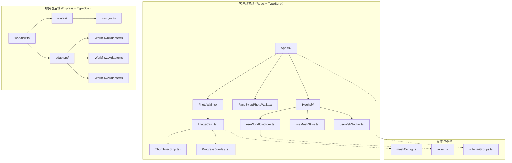

**图表来源**
- [App.tsx:58-408](file://client/src/components/App.tsx#L58-L408)
- [PhotoWall.tsx:100-624](file://client/src/components/PhotoWall.tsx#L100-L624)
- [ImageCard.tsx:44-1372](file://client/src/components/ImageCard.tsx#L44-L1372)

**章节来源**
- [README.md:41-62](file://README.md#L41-L62)
- [package.json:1-25](file://client/package.json#L1-L25)

## 核心组件架构

### 状态管理系统

系统采用 Zustand 状态管理库构建了一个集中式的状态管理系统，支持跨组件的状态共享和响应式更新。

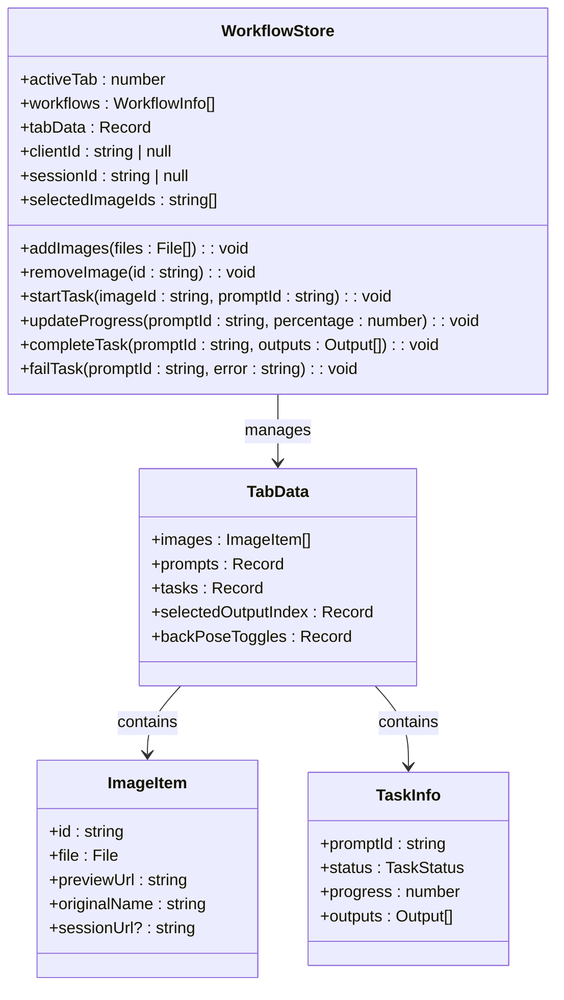

**图表来源**
- [useWorkflowStore.ts:37-92](file://client/src/hooks/useWorkflowStore.ts#L37-L92)
- [index.ts:1-58](file://client/src/types/index.ts#L1-L58)

### 组件层次结构

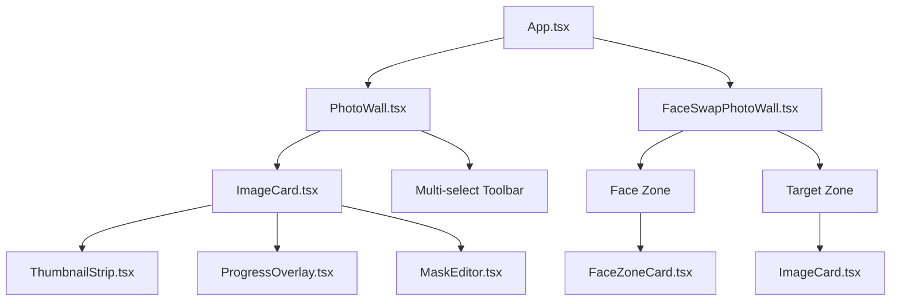

**图表来源**
- [App.tsx:8-27](file://client/src/components/App.tsx#L8-L27)
- [PhotoWall.tsx:96-122](file://client/src/components/PhotoWall.tsx#L96-L122)
- [FaceSwapPhotoWall.tsx:219-511](file://client/src/components/FaceSwapPhotoWall.tsx#L219-L511)

**章节来源**
- [useWorkflowStore.ts:100-711](file://client/src/hooks/useWorkflowStore.ts#L100-L711)
- [PhotoWall.tsx:100-122](file://client/src/components/PhotoWall.tsx#L100-L122)

## 图片卡片系统详解

### ImageCard 组件核心功能

ImageCard 是整个系统的核心组件，负责展示单个图像处理任务的完整生命周期。

#### 组件状态管理

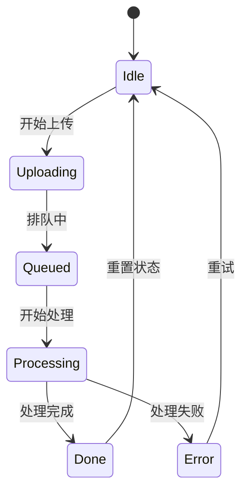

**图表来源**
- [index.ts:17-25](file://client/src/types/index.ts#L17-L25)
- [ImageCard.tsx:104-111](file://client/src/components/ImageCard.tsx#L104-L111)

#### 交互事件处理

ImageCard 实现了丰富的用户交互功能：

1. **拖拽操作**: 支持卡片内拖拽和外部拖拽导出
2. **长按选择**: 通过长按进入多选模式
3. **悬停预览**: 鼠标悬停时自动播放视频预览
4. **蒙版编辑**: 双击触发蒙版编辑器
5. **进度监控**: 实时显示处理进度和状态

#### 性能优化策略

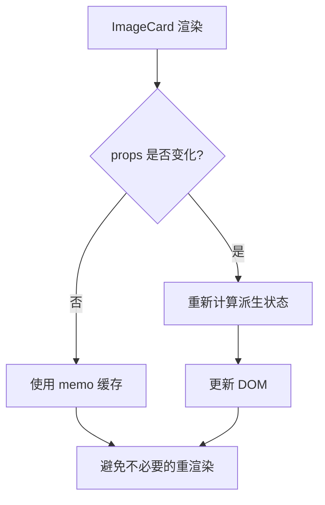

**图表来源**
- [ImageCard.tsx:29-42](file://client/src/components/ImageCard.tsx#L29-L42)
- [ImageCard.tsx:44-91](file://client/src/components/ImageCard.tsx#L44-L91)

**章节来源**
- [ImageCard.tsx:44-1372](file://client/src/components/ImageCard.tsx#L44-L1372)
- [ThumbnailStrip.tsx:34-235](file://client/src/components/ThumbnailStrip.tsx#L34-L235)

## 蒙版编辑系统

### 蒙版存储架构

蒙版编辑系统为特定工作流程提供精确的区域编辑能力：

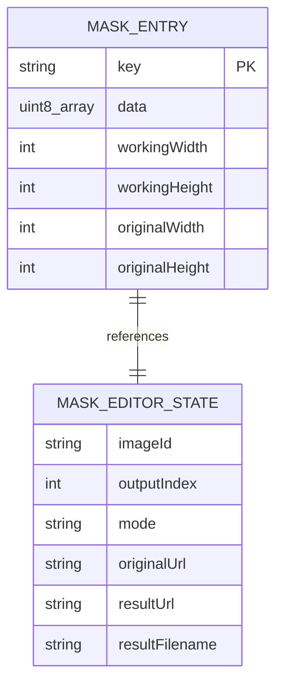

**图表来源**
- [useMaskStore.ts:4-30](file://client/src/hooks/useMaskStore.ts#L4-L30)
- [maskConfig.ts:19-21](file://client/src/config/maskConfig.ts#L19-L21)

### 蒙版模式支持

系统支持两种蒙版编辑模式：

| 模式 | 用途 | 特点 |
|------|------|------|
| Mode A | 覆盖编辑 | 适用于解除装备、区域编辑等覆盖式操作 |
| Mode B | 实时混合 | 适用于真人精修等需要实时预览效果的场景 |

**章节来源**
- [maskConfig.ts:5-17](file://client/src/config/maskConfig.ts#L5-L17)
- [useMaskStore.ts:32-51](file://client/src/hooks/useMaskStore.ts#L32-L51)

## 批量处理功能

### PhotoWall 批量操作

PhotoWall 组件提供了强大的批量处理能力：

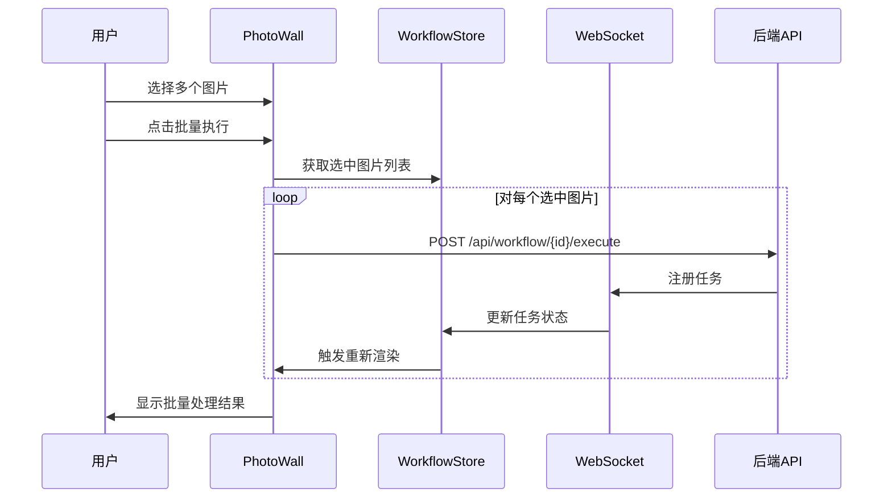

**图表来源**
- [PhotoWall.tsx:190-279](file://client/src/components/PhotoWall.tsx#L190-L279)
- [useWorkflowStore.ts:384-403](file://client/src/hooks/useWorkflowStore.ts#L384-L403)

### 多选模式实现

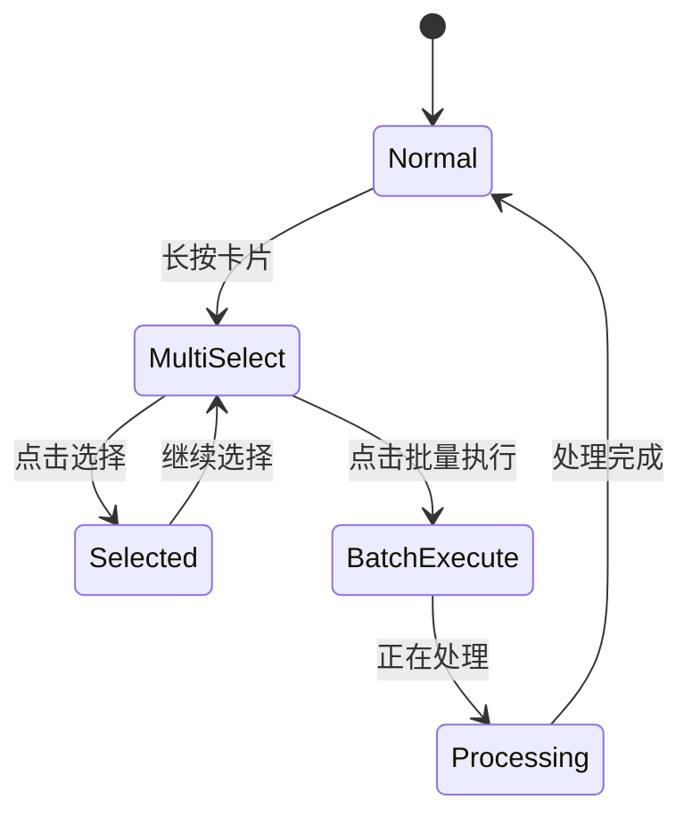

**图表来源**
- [PhotoWall.tsx:148-180](file://client/src/components/PhotoWall.tsx#L148-L180)
- [ImageCard.tsx:179-223](file://client/src/components/ImageCard.tsx#L179-L223)

**章节来源**
- [PhotoWall.tsx:100-624](file://client/src/components/PhotoWall.tsx#L100-L624)
- [FaceSwapPhotoWall.tsx:219-990](file://client/src/components/FaceSwapPhotoWall.tsx#L219-L990)

## 性能优化策略

### 懒加载机制

系统实现了智能的懒加载策略来优化大量图片的渲染性能：

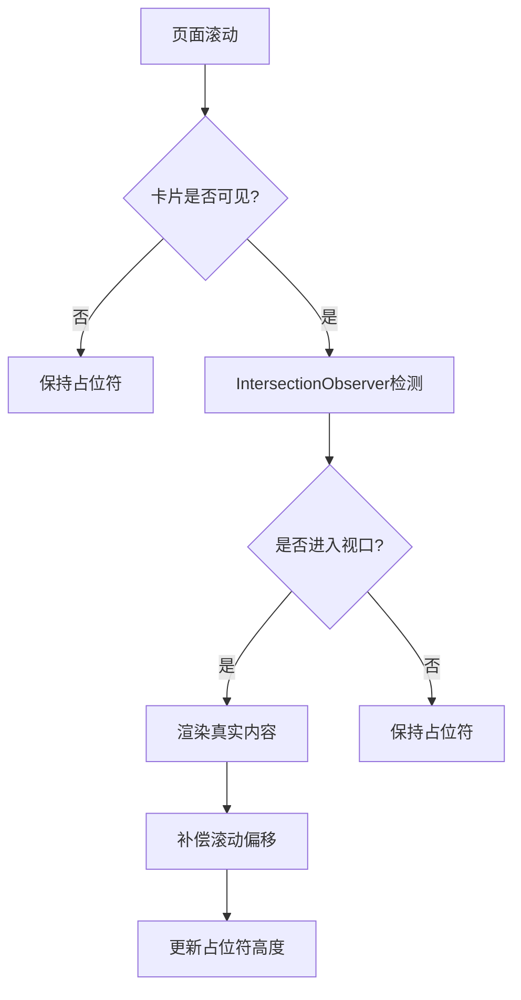

**图表来源**
- [PhotoWall.tsx:18-94](file://client/src/components/PhotoWall.tsx#L18-L94)

### 内存管理

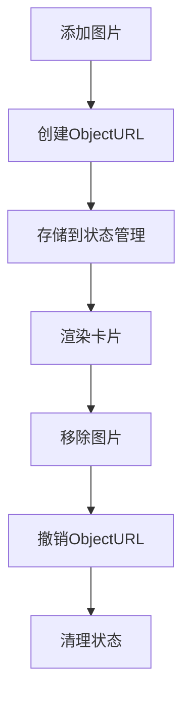

**图表来源**
- [useWorkflowStore.ts:202-219](file://client/src/hooks/useWorkflowStore.ts#L202-L219)
- [useWorkflowStore.ts:259-290](file://client/src/hooks/useWorkflowStore.ts#L259-L290)

**章节来源**
- [PhotoWall.tsx:18-94](file://client/src/components/PhotoWall.tsx#L18-L94)
- [useWorkflowStore.ts:202-290](file://client/src/hooks/useWorkflowStore.ts#L202-L290)

## 交互设计与用户体验

### 响应式布局

系统支持三种视图尺寸，自适应不同屏幕分辨率：

| 视图尺寸 | 卡片宽度 | 预估卡片高度 | 字体大小 |
|----------|----------|--------------|----------|
| Small | 180px | 320px | 12px |
| Medium | 280px | 450px | 14px |
| Large | 600px | 600px | 16px |

### 拖拽体验优化

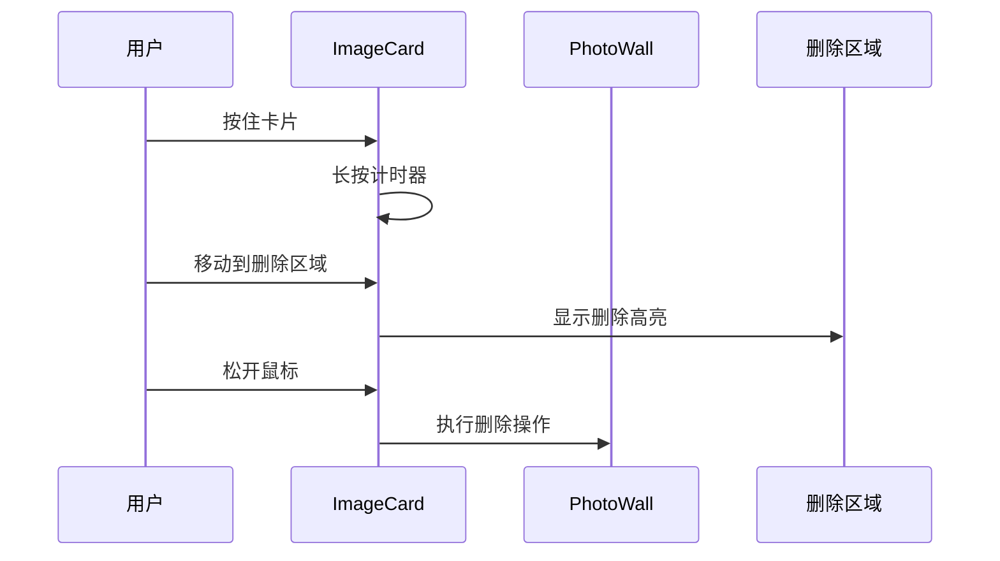

**图表来源**
- [ImageCard.tsx:179-264](file://client/src/components/ImageCard.tsx#L179-L264)
- [PhotoWall.tsx:309-338](file://client/src/components/PhotoWall.tsx#L309-L338)

**章节来源**
- [PhotoWall.tsx:557-621](file://client/src/components/PhotoWall.tsx#L557-L621)
- [ImageCard.tsx:491-800](file://client/src/components/ImageCard.tsx#L491-L800)

## 扩展性与可维护性

### 类型安全设计

系统采用 TypeScript 提供完整的类型安全保障：

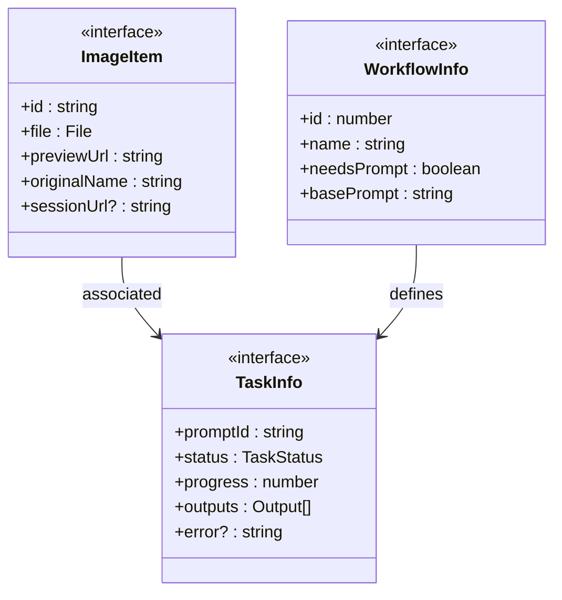

**图表来源**
- [index.ts:1-58](file://client/src/types/index.ts#L1-L58)

### 插件化架构

系统支持通过适配器模式轻松扩展新的工作流程：

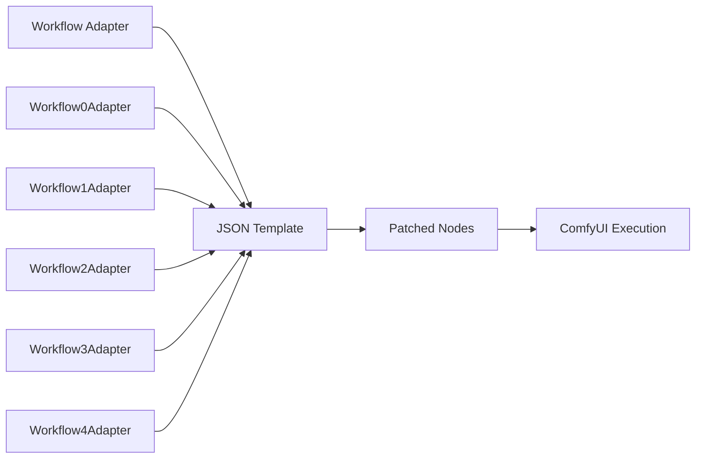

**图表来源**
- [README.md:76-77](file://README.md#L76-L77)

**章节来源**
- [index.ts:1-58](file://client/src/types/index.ts#L1-L58)
- [sidebarGroups.ts:4-14](file://client/src/data/sidebarGroups.ts#L4-L14)

## 故障排除指南

### 常见问题诊断

| 问题 | 可能原因 | 解决方案 |
|------|----------|----------|
| 图片不显示 | ObjectURL 未正确创建 | 检查文件类型和大小限制 |
| 进度条不更新 | WebSocket 连接中断 | 重启应用或检查网络连接 |
| 蒙版编辑无效 | 蒙版数据格式错误 | 重新绘制蒙版或检查存储状态 |
| 批量操作失败 | 部分图片状态异常 | 清理缓存或重新加载页面 |

### 性能问题排查

1. **内存泄漏**: 定期检查 ObjectURL 是否正确撤销
2. **渲染卡顿**: 检查懒加载配置和视口检测
3. **拖拽延迟**: 验证事件处理器的防抖实现

**章节来源**
- [useWorkflowStore.ts:264-289](file://client/src/hooks/useWorkflowStore.ts#L264-L289)
- [PhotoWall.tsx:46-70](file://client/src/components/PhotoWall.tsx#L46-L70)

## 总结

增强的图片卡片组件系统通过精心设计的架构和多项性能优化，为用户提供了高效、流畅的图像处理体验。该系统的主要优势包括：

1. **模块化设计**: 清晰的组件层次和职责分离
2. **高性能渲染**: 智能懒加载和状态缓存机制
3. **丰富的交互**: 多种用户交互模式和反馈机制
4. **类型安全**: 完整的 TypeScript 类型定义
5. **可扩展性**: 插件化架构支持新功能添加

该系统不仅满足了当前的功能需求，还为未来的功能扩展奠定了坚实的基础。通过持续的性能优化和用户体验改进，Pix2Real 将成为图像处理领域的优秀工具。