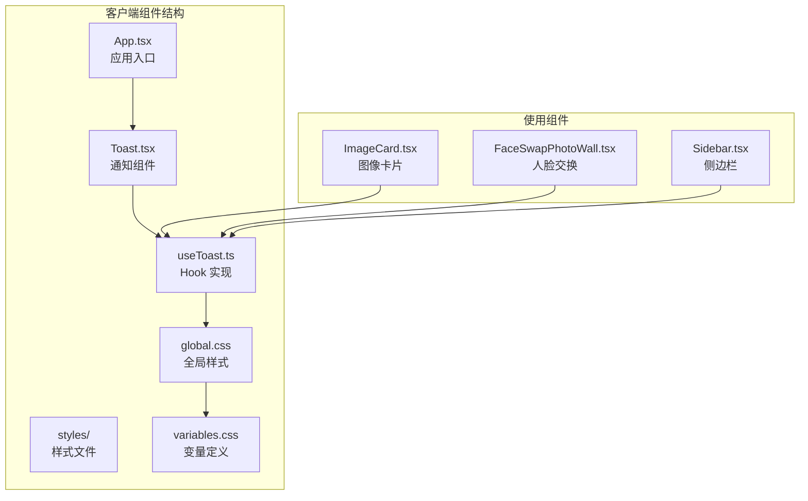
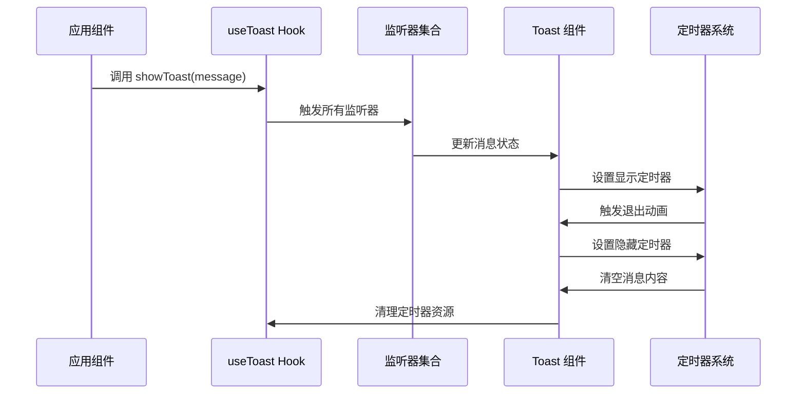
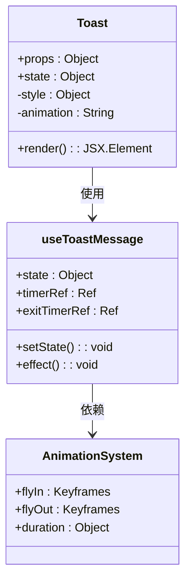
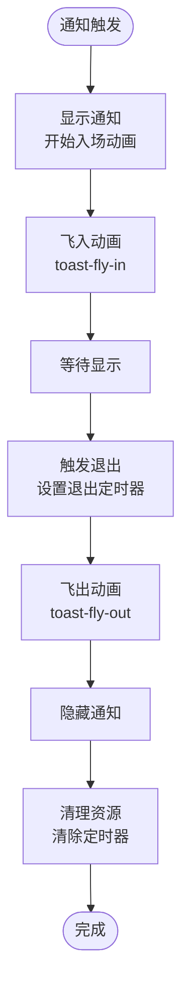
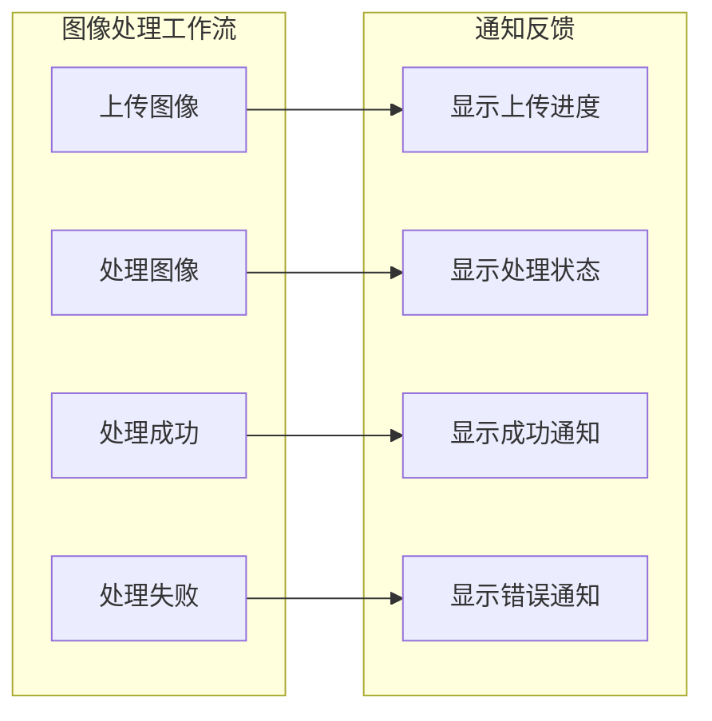
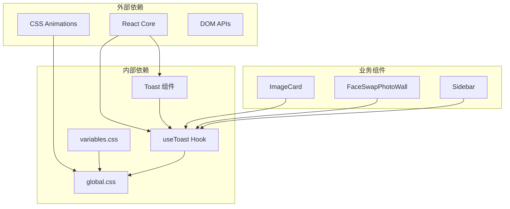

# 消息通知组件

<cite>
**本文档引用的文件**
- [client/src/components/Toast.tsx](file://client/src/components/Toast.tsx)
- [client/src/hooks/useToast.ts](file://client/src/hooks/useToast.ts)
- [client/src/styles/global.css](file://client/src/styles/global.css)
- [client/src/styles/variables.css](file://client/src/styles/variables.css)
- [client/src/components/App.tsx](file://client/src/components/App.tsx)
- [client/src/components/ImageCard.tsx](file://client/src/components/ImageCard.tsx)
- [client/src/components/FaceSwapPhotoWall.tsx](file://client/src/components/FaceSwapPhotoWall.tsx)
- [client/src/components/Sidebar.tsx](file://client/src/components/Sidebar.tsx)
- [client/src/main.tsx](file://client/src/main.tsx)
</cite>

## 目录
1. [简介](#简介)
2. [项目结构](#项目结构)
3. [核心组件](#核心组件)
4. [架构概览](#架构概览)
5. [详细组件分析](#详细组件分析)
6. [依赖关系分析](#依赖关系分析)
7. [性能考虑](#性能考虑)
8. [故障排除指南](#故障排除指南)
9. [结论](#结论)
10. [附录](#附录)

## 简介

消息通知组件是 CorineKit Pix2Real 应用程序中的一个关键 UI 组件，用于向用户提供即时的状态反馈和操作结果通知。该组件实现了现代化的通知系统，具有以下核心特性：

- **通知队列管理**：通过全局监听器模式管理多个通知的显示顺序
- **自动消失机制**：智能的定时器管理确保通知在适当的时间自动消失
- **流畅的动画系统**：使用 CSS 动画提供平滑的入场和出场效果
- **响应式设计**：固定定位布局，适配各种屏幕尺寸
- **主题化支持**：基于 CSS 变量的主题系统，支持明暗模式切换

## 项目结构

消息通知组件在项目中的组织结构如下：



**图表来源**
- [client/src/components/App.tsx:327-328](file://client/src/components/App.tsx#L327-L328)
- [client/src/components/Toast.tsx:1-32](file://client/src/components/Toast.tsx#L1-L32)
- [client/src/hooks/useToast.ts:1-33](file://client/src/hooks/useToast.ts#L1-L33)

**章节来源**
- [client/src/components/App.tsx:327-328](file://client/src/components/App.tsx#L327-L328)
- [client/src/main.tsx:1-11](file://client/src/main.tsx#L1-L11)

## 核心组件

### Toast 组件

Toast 组件是一个轻量级的 React 组件，负责渲染和显示通知消息。其核心实现特点包括：

- **固定定位布局**：使用 `position: fixed` 和 `left: 50%` 实现水平居中
- **z-index 管理**：设置 `z-index: 9999` 确保通知始终显示在最上层
- **动态样式**：根据 `isExiting` 状态切换不同的动画效果
- **指针事件禁用**：`pointerEvents: 'none'` 避免通知遮挡其他交互元素

### useToast Hook

useToast Hook 实现了完整的通知系统逻辑，包括：

- **全局监听器模式**：使用 `Set<Listener>` 管理多个订阅者
- **定时器管理**：精确控制通知的显示时长和消失时机
- **状态管理**：维护 `message`、`key`、`isExiting` 状态
- **生命周期清理**：组件卸载时自动清理定时器和监听器

**章节来源**
- [client/src/components/Toast.tsx:1-32](file://client/src/components/Toast.tsx#L1-L32)
- [client/src/hooks/useToast.ts:1-33](file://client/src/hooks/useToast.ts#L1-L33)

## 架构概览

消息通知系统的整体架构采用发布-订阅模式，实现了松耦合的设计：



**图表来源**
- [client/src/hooks/useToast.ts:6-29](file://client/src/hooks/useToast.ts#L6-L29)
- [client/src/components/Toast.tsx:3-31](file://client/src/components/Toast.tsx#L3-L31)

### 数据流分析

通知系统的数据流向清晰明确：

1. **输入阶段**：各业务组件调用 `showToast()` 函数
2. **分发阶段**：Hook 将消息广播给所有监听器
3. **渲染阶段**：Toast 组件接收状态并重新渲染
4. **生命周期管理**：定时器自动管理通知的显示和隐藏

**章节来源**
- [client/src/hooks/useToast.ts:15-29](file://client/src/hooks/useToast.ts#L15-L29)

## 详细组件分析

### Toast 组件实现

Toast 组件采用了简洁而高效的实现方式：



**图表来源**
- [client/src/components/Toast.tsx:3-31](file://client/src/components/Toast.tsx#L3-L31)
- [client/src/hooks/useToast.ts:10-32](file://client/src/hooks/useToast.ts#L10-L32)

#### 样式系统分析

组件的样式系统基于 CSS 变量和关键帧动画：

- **颜色系统**：使用 `var(--color-primary)` 获取主题色
- **阴影效果**：`box-shadow: 0 4px 16px rgba(0,0,0,0.25)` 提供层次感
- **字体规范**：`fontSize: '13px'` 和 `fontWeight: 500` 确保可读性
- **动画曲线**：入场使用 `cubic-bezier(0.22,1,0.36,1)` 提供自然的缓动效果

### 动画系统详解

动画系统是通知组件的核心特色，实现了流畅的用户体验：



**图表来源**
- [client/src/styles/global.css:127-135](file://client/src/styles/global.css#L127-L135)
- [client/src/hooks/useToast.ts:19-21](file://client/src/hooks/useToast.ts#L19-L21)

#### 动画参数配置

动画系统的关键参数经过精心调优：

- **入场动画**：持续 0.22 秒，使用 `cubic-bezier(0.22,1,0.36,1)` 缓动函数
- **退出动画**：持续 0.28 秒，使用 `ease` 缓动函数
- **显示时长**：总显示时间为 1700 毫秒（从触发到开始退出）
- **完全消失**：总生命周期为 2000 毫秒

**章节来源**
- [client/src/styles/global.css:127-135](file://client/src/styles/global.css#L127-L135)
- [client/src/hooks/useToast.ts:19-21](file://client/src/hooks/useToast.ts#L19-L21)

### 使用场景分析

消息通知组件在多个业务场景中发挥重要作用：

#### 图像处理场景

在图像处理流程中，通知组件提供了关键的用户反馈：



**图表来源**
- [client/src/components/ImageCard.tsx:269-271](file://client/src/components/ImageCard.tsx#L269-L271)
- [client/src/components/ImageCard.tsx:386-390](file://client/src/components/ImageCard.tsx#L386-L390)

#### 人脸交换场景

人脸交换功能中的通知管理：

- **执行失败通知**：当换脸操作失败时显示错误通知
- **队列状态通知**：批量处理时显示队列数量
- **状态检查通知**：处理中状态时提醒用户等待

**章节来源**
- [client/src/components/FaceSwapPhotoWall.tsx:270-272](file://client/src/components/FaceSwapPhotoWall.tsx#L270-L272)
- [client/src/components/FaceSwapPhotoWall.tsx:459-460](file://client/src/components/FaceSwapPhotoWall.tsx#L459-L460)

#### 侧边栏导入场景

侧边栏导入功能的通知实现：

- **导入成功通知**：显示导入的文件数量和目标标签
- **拖拽反馈**：提供实时的拖拽状态反馈
- **跨标签操作**：支持输出文件的跨标签导入

**章节来源**
- [client/src/components/Sidebar.tsx:178-179](file://client/src/components/Sidebar.tsx#L178-L179)
- [client/src/components/Sidebar.tsx:206-207](file://client/src/components/Sidebar.tsx#L206-L207)

## 依赖关系分析

消息通知组件的依赖关系清晰且模块化：



**图表来源**
- [client/src/components/Toast.tsx:1-2](file://client/src/components/Toast.tsx#L1-L2)
- [client/src/hooks/useToast.ts:1-1](file://client/src/hooks/useToast.ts#L1-L1)
- [client/src/components/ImageCard.tsx:11-11](file://client/src/components/ImageCard.tsx#L11-L11)

### 组件间交互

各业务组件与通知系统的交互模式统一：

1. **导入阶段**：组件导入 `showToast` 函数
2. **触发阶段**：在适当的业务逻辑节点调用 `showToast()`
3. **状态管理**：Hook 自动处理状态更新和生命周期管理
4. **渲染阶段**：Toast 组件自动重新渲染显示最新消息

**章节来源**
- [client/src/components/ImageCard.tsx:11-11](file://client/src/components/ImageCard.tsx#L11-L11)
- [client/src/components/FaceSwapPhotoWall.tsx:5-5](file://client/src/components/FaceSwapPhotoWall.tsx#L5-L5)
- [client/src/components/Sidebar.tsx:4-4](file://client/src/components/Sidebar.tsx#L4-L4)

## 性能考虑

消息通知组件在性能方面采用了多项优化策略：

### 内存管理

- **定时器清理**：组件卸载时自动清理所有定时器，防止内存泄漏
- **监听器管理**：使用 `Set` 结构存储监听器，支持高效添加和删除
- **状态最小化**：只维护必要的状态数据，减少不必要的重渲染

### 动画性能

- **GPU 加速**：使用 `transform` 和 `opacity` 属性，这些属性可以由 GPU 加速
- **关键帧优化**：动画仅涉及位置和透明度变化，计算开销较小
- **动画时序**：经过精心调优的动画时序，平衡用户体验和性能

### 渲染优化

- **条件渲染**：当没有消息时返回 `null`，避免不必要的 DOM 元素
- **样式内联**：使用内联样式减少额外的 CSS 类查找
- **指针事件**：禁用指针事件避免影响底层交互

**章节来源**
- [client/src/hooks/useToast.ts:24-28](file://client/src/hooks/useToast.ts#L24-L28)
- [client/src/components/Toast.tsx:5-5](file://client/src/components/Toast.tsx#L5-L5)

## 故障排除指南

### 常见问题及解决方案

#### 通知不显示

**症状**：调用了 `showToast()` 但界面上没有显示任何通知

**可能原因**：
1. Toast 组件未正确渲染
2. App 组件中未包含 Toast 组件
3. 样式变量未正确加载

**解决方法**：
1. 确认 App 组件中包含 `<Toast />` 标签
2. 检查全局样式文件是否正确导入
3. 验证 CSS 变量是否正确定义

#### 通知立即消失

**症状**：通知出现后立即消失

**可能原因**：
1. 定时器设置过短
2. 状态更新逻辑异常
3. 动画时长配置错误

**解决方法**：
1. 检查 `useToastMessage` 中的定时器设置
2. 验证 `isExiting` 状态的切换逻辑
3. 确认动画时长与定时器时长匹配

#### 多个通知重叠

**症状**：同时显示多个通知，造成界面混乱

**可能原因**：
1. 业务逻辑中频繁调用 `showToast()`
2. 缺少通知队列管理
3. 用户交互过于频繁

**解决方法**：
1. 在业务逻辑中添加防抖机制
2. 实现通知队列管理
3. 合并相似的通知消息

**章节来源**
- [client/src/components/App.tsx:327-328](file://client/src/components/App.tsx#L327-L328)
- [client/src/hooks/useToast.ts:15-29](file://client/src/hooks/useToast.ts#L15-L29)

## 结论

消息通知组件在 CorineKit Pix2Real 项目中展现了优秀的架构设计和实现质量。该组件通过简洁的 API 设计、完善的生命周期管理和优雅的动画效果，为用户提供了流畅的交互体验。

### 主要优势

1. **设计简洁**：API 设计直观易用，学习成本低
2. **性能优秀**：动画和状态管理都经过性能优化
3. **扩展性强**：基于 Hook 的设计便于功能扩展
4. **主题友好**：完全支持 CSS 变量和主题切换

### 改进建议

虽然当前实现已经相当完善，但仍有一些可以改进的地方：

1. **类型安全**：可以添加更严格的 TypeScript 类型定义
2. **配置选项**：允许自定义动画时长和样式参数
3. **无障碍支持**：增加屏幕阅读器支持
4. **国际化**：支持多语言通知文本

## 附录

### 使用示例

#### 基本使用

```typescript
// 导入通知函数
import { showToast } from '../hooks/useToast.js';

// 显示简单通知
showToast('操作已完成');

// 显示错误通知
showToast('发生了一个错误');
```

#### 在组件中使用

```typescript
import { showToast } from '../hooks/useToast.js';

function MyComponent() {
  const handleClick = () => {
    try {
      // 执行某些操作
      performOperation();
      showToast('操作成功完成');
    } catch (error) {
      showToast('操作失败: ' + error.message);
    }
  };

  return <button onClick={handleClick}>执行操作</button>;
}
```

### 样式定制指南

#### 主题变量

组件使用以下 CSS 变量进行样式定制：

- `--color-primary`: 主色调（默认蓝色）
- `--spacing-lg`: 顶部间距（默认 24px）
- `--color-bg`: 背景色
- `--color-text`: 文本色

#### 自定义样式

可以通过覆盖 CSS 变量来自定义通知样式：

```css
:root {
  --color-primary: #ff6b6b; /* 更改为红色 */
  --spacing-lg: 40px;       /* 调整垂直位置 */
}

[data-theme="dark"] {
  --color-primary: #ee5a24; /* 深色主题下的主色调 */
}
```

### 扩展建议

#### 添加通知历史

```typescript
interface ToastHistoryItem {
  id: string;
  message: string;
  timestamp: number;
  type: 'success' | 'error' | 'warning' | 'info';
}

class ToastManager {
  private history: ToastHistoryItem[] = [];
  
  showToast(message: string, type: ToastType = 'info') {
    // 实现通知显示逻辑
    this.addToHistory(message, type);
  }
  
  private addToHistory(message: string, type: ToastType) {
    this.history.push({
      id: Date.now().toString(),
      message,
      timestamp: Date.now(),
      type
    });
    
    // 限制历史记录数量
    if (this.history.length > 100) {
      this.history.shift();
    }
  }
}
```

#### 实现通知权限管理

```typescript
interface ToastPermission {
  enabled: boolean;
  types: {
    success: boolean;
    error: boolean;
    warning: boolean;
    info: boolean;
  };
}

class ToastPermissionManager {
  private permission: ToastPermission = {
    enabled: true,
    types: {
      success: true,
      error: true,
      warning: true,
      info: true
    }
  };
  
  checkPermission(type: ToastType): boolean {
    return this.permission.enabled && this.permission.types[type];
  }
  
  updatePermission(permission: Partial<ToastPermission>) {
    this.permission = { ...this.permission, ...permission };
  }
}
```

#### 集成第三方通知服务

```typescript
interface NotificationService {
  sendNotification(message: string, options?: NotificationOptions): Promise<void>;
}

class ThirdPartyToastIntegration {
  private service: NotificationService | null = null;
  
  async showWithService(message: string, serviceType: 'email' | 'push' | 'sms') {
    if (this.service) {
      try {
        await this.service.sendNotification(message, {
          type: serviceType,
          timestamp: Date.now()
        });
      } catch (error) {
        // 回退到本地通知
        showToast(message);
      }
    } else {
      showToast(message);
    }
  }
}
```