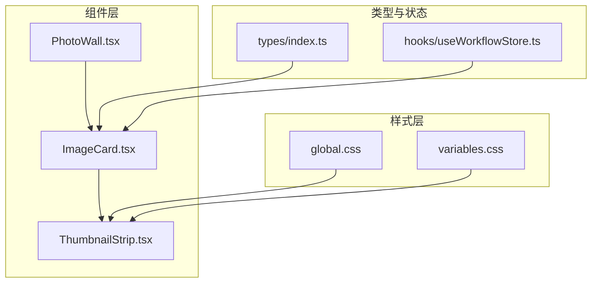
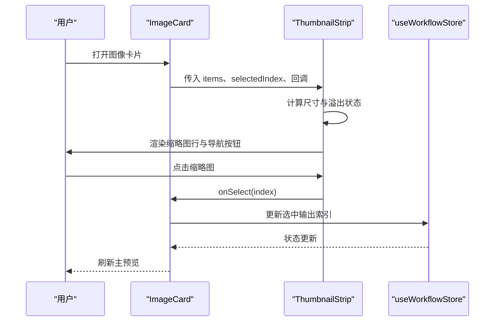
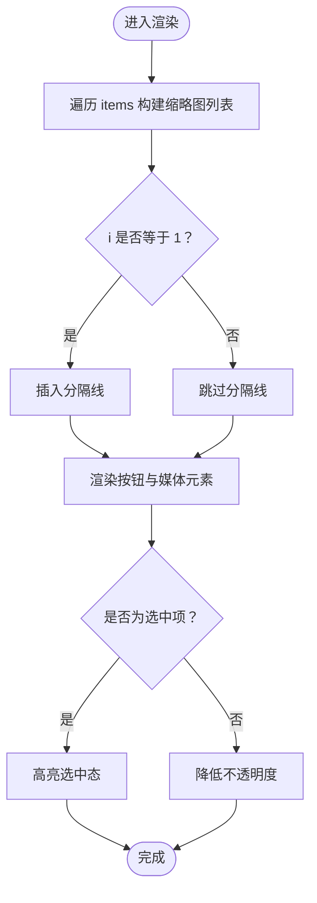
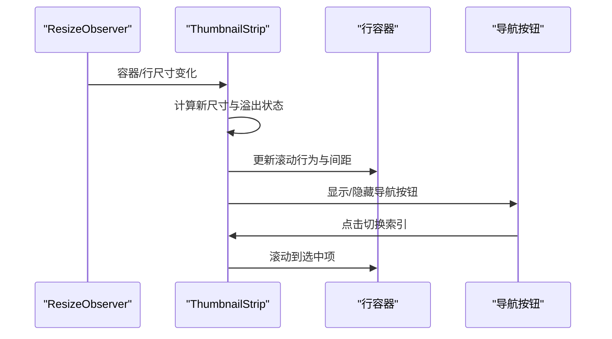
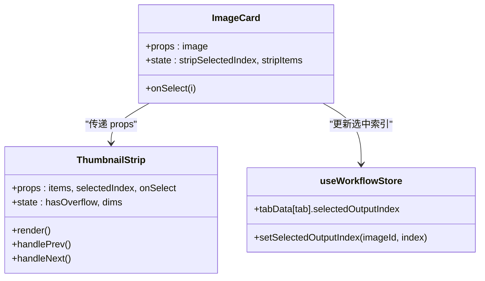
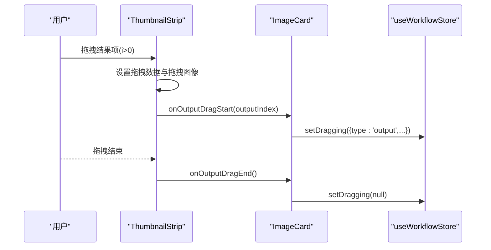
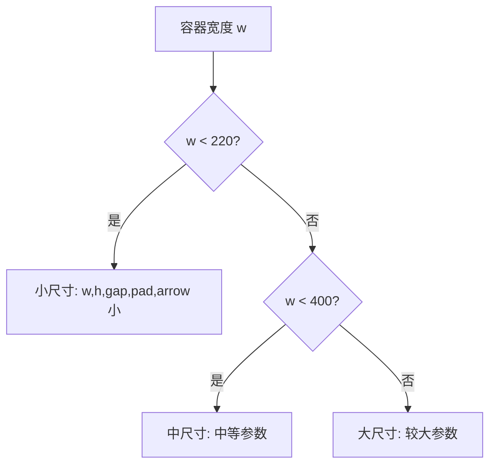
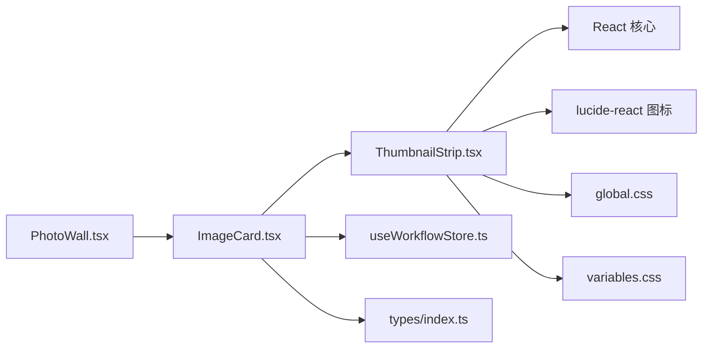

# 缩略图条组件

<cite>
**本文档引用的文件**
- [ThumbnailStrip.tsx](file://client/src/components/ThumbnailStrip.tsx)
- [ImageCard.tsx](file://client/src/components/ImageCard.tsx)
- [PhotoWall.tsx](file://client/src/components/PhotoWall.tsx)
- [global.css](file://client/src/styles/global.css)
- [variables.css](file://client/src/styles/variables.css)
- [index.ts](file://client/src/types/index.ts)
- [useWorkflowStore.ts](file://client/src/hooks/useWorkflowStore.ts)
</cite>

## 目录
1. [简介](#简介)
2. [项目结构](#项目结构)
3. [核心组件](#核心组件)
4. [架构总览](#架构总览)
5. [详细组件分析](#详细组件分析)
6. [依赖关系分析](#依赖关系分析)
7. [性能考虑](#性能考虑)
8. [故障排除指南](#故障排除指南)
9. [结论](#结论)
10. [附录](#附录)

## 简介
ThumbnailStrip 是一个用于展示图片或视频缩略图的轻量级 React 组件，常用于图像卡片底部的输出结果浏览与切换。它支持响应式尺寸适配、水平滚动、左右导航按钮、选中态高亮、拖拽输出以及基于 CSS 变量的主题化样式。该组件通过 ResizeObserver 实现自适应布局，并结合滚动行为与可见性检测，确保在大量内容场景下仍保持流畅体验。

## 项目结构
ThumbnailStrip 位于客户端组件目录中，通常被 ImageCard 组件复用以展示每张输入图的原始图与生成结果序列。全局样式与 CSS 变量定义了主题色彩与通用滚动条样式，为组件提供一致的视觉与交互基础。

**图表来源**
- [ThumbnailStrip.tsx:1-230](file://client/src/components/ThumbnailStrip.tsx#L1-L230)
- [ImageCard.tsx:768-787](file://client/src/components/ImageCard.tsx#L768-L787)
- [PhotoWall.tsx:1-200](file://client/src/components/PhotoWall.tsx#L1-L200)
- [global.css:1-224](file://client/src/styles/global.css#L1-L224)
- [variables.css:1-31](file://client/src/styles/variables.css#L1-L31)
- [index.ts:1-58](file://client/src/types/index.ts#L1-L58)
- [useWorkflowStore.ts:1-200](file://client/src/hooks/useWorkflowStore.ts#L1-L200)

**章节来源**
- [ThumbnailStrip.tsx:1-230](file://client/src/components/ThumbnailStrip.tsx#L1-L230)
- [ImageCard.tsx:768-787](file://client/src/components/ImageCard.tsx#L768-L787)
- [PhotoWall.tsx:1-200](file://client/src/components/PhotoWall.tsx#L1-L200)
- [global.css:1-224](file://client/src/styles/global.css#L1-L224)
- [variables.css:1-31](file://client/src/styles/variables.css#L1-L31)
- [index.ts:1-58](file://client/src/types/index.ts#L1-L58)
- [useWorkflowStore.ts:1-200](file://client/src/hooks/useWorkflowStore.ts#L1-L200)

## 核心组件
ThumbnailStrip 的核心职责包括：
- 接收缩略图数据项数组（包含文件名、URL、是否为视频）
- 基于容器宽度动态计算缩略图尺寸与间距
- 监听溢出状态以显示/隐藏导航按钮
- 根据当前选中索引自动滚动到可视区域
- 支持点击切换、左右箭头切换、拖拽输出
- 使用 CSS 变量实现主题化外观

关键接口与数据结构：
- 数据项接口：包含 filename、url、isVideo 字段
- 尺寸计算函数：根据容器宽度返回 w/h/gap/pad/arrowSize
- 事件回调：onSelect、onOutputDragStart、onOutputDragEnd、onMouseEnter、onMouseLeave

**章节来源**
- [ThumbnailStrip.tsx:4-32](file://client/src/components/ThumbnailStrip.tsx#L4-L32)
- [ThumbnailStrip.tsx:34-80](file://client/src/components/ThumbnailStrip.tsx#L34-L80)

## 架构总览
ThumbnailStrip 作为底层展示组件，被上层 ImageCard 复用以呈现每张输入图的“原始图 + 生成结果”序列。PhotoWall 负责整体画廊的懒加载与滚动补偿，而样式系统通过 CSS 变量与全局滚动条样式统一视觉风格。

**图表来源**
- [ImageCard.tsx:768-787](file://client/src/components/ImageCard.tsx#L768-L787)
- [ThumbnailStrip.tsx:34-80](file://client/src/components/ThumbnailStrip.tsx#L34-L80)
- [useWorkflowStore.ts:65-74](file://client/src/hooks/useWorkflowStore.ts#L65-L74)

## 详细组件分析

### 数据绑定与渲染流程
- 输入数据：items 数组，每个元素包含 filename、url、isVideo
- 渲染逻辑：遍历 items 渲染按钮；当 i=1 时插入分隔线；根据 isVideo 渲染 video 或 img
- 选中态：通过 outline 与透明度区分当前选中项
- 拖拽输出：仅对 i>0 的结果启用拖拽，设置拖拽数据与拖拽图像

**图表来源**
- [ThumbnailStrip.tsx:135-204](file://client/src/components/ThumbnailStrip.tsx#L135-L204)
- [ThumbnailStrip.tsx:170-183](file://client/src/components/ThumbnailStrip.tsx#L170-L183)

**章节来源**
- [ThumbnailStrip.tsx:135-204](file://client/src/components/ThumbnailStrip.tsx#L135-L204)
- [ThumbnailStrip.tsx:170-183](file://client/src/components/ThumbnailStrip.tsx#L170-L183)

### 滚动控制与导航
- ResizeObserver：监听容器与行元素宽度变化，动态更新尺寸与溢出状态
- 自动滚动：根据 selectedIndex 将目标项滚动至最近可视位置
- 导航按钮：仅在存在溢出时显示，点击切换相邻索引

**图表来源**
- [ThumbnailStrip.tsx:48-68](file://client/src/components/ThumbnailStrip.tsx#L48-L68)
- [ThumbnailStrip.tsx:70-78](file://client/src/components/ThumbnailStrip.tsx#L70-L78)

**章节来源**
- [ThumbnailStrip.tsx:48-68](file://client/src/components/ThumbnailStrip.tsx#L48-L68)
- [ThumbnailStrip.tsx:70-78](file://client/src/components/ThumbnailStrip.tsx#L70-L78)

### 选中状态管理
- 选中态样式：使用 CSS 变量的主色调边框与透明度过渡
- 选中同步：外部通过 selectedIndex 与 onSelect 控制当前选中项
- 与工作流状态集成：ImageCard 将选中结果映射到工作流存储中的 selectedOutputIndex

**图表来源**
- [ThumbnailStrip.tsx:10-18](file://client/src/components/ThumbnailStrip.tsx#L10-L18)
- [ImageCard.tsx:768-787](file://client/src/components/ImageCard.tsx#L768-L787)
- [useWorkflowStore.ts:65-74](file://client/src/hooks/useWorkflowStore.ts#L65-L74)

**章节来源**
- [ThumbnailStrip.tsx:10-18](file://client/src/components/ThumbnailStrip.tsx#L10-L18)
- [ImageCard.tsx:768-787](file://client/src/components/ImageCard.tsx#L768-L787)
- [useWorkflowStore.ts:65-74](file://client/src/hooks/useWorkflowStore.ts#L65-L74)

### 拖拽输出与交互
- 拖拽启用条件：仅对结果项（i>0）启用拖拽
- 拖拽数据：设置自定义 MIME 类型数据，携带输出索引
- 拖拽图像：使用当前缩略图作为拖拽图标
- 回调通知：开始与结束时触发 onOutputDragStart/onOutputDragEnd

**图表来源**
- [ThumbnailStrip.tsx:154-168](file://client/src/components/ThumbnailStrip.tsx#L154-L168)
- [ImageCard.tsx:780-783](file://client/src/components/ImageCard.tsx#L780-L783)

**章节来源**
- [ThumbnailStrip.tsx:154-168](file://client/src/components/ThumbnailStrip.tsx#L154-L168)
- [ImageCard.tsx:780-783](file://client/src/components/ImageCard.tsx#L780-L783)

### 响应式设计与自适应布局
- 尺寸断点：根据容器宽度选择不同的缩略图尺寸与间距
- 滚动行为：启用平滑滚动与无滚动条样式类
- 可见性：溢出时显示导航按钮，未溢出时隐藏以节省空间

**图表来源**
- [ThumbnailStrip.tsx:28-32](file://client/src/components/ThumbnailStrip.tsx#L28-L32)

**章节来源**
- [ThumbnailStrip.tsx:28-32](file://client/src/components/ThumbnailStrip.tsx#L28-L32)
- [ThumbnailStrip.tsx:122-133](file://client/src/components/ThumbnailStrip.tsx#L122-L133)

### 样式定制与主题化
- CSS 变量：通过 variables.css 定义主色、背景、文本、边框等变量
- 全局样式：global.css 引入变量并在滚动条、动画等方面统一风格
- 组件样式：使用 CSS 变量实现主题化边框、阴影与过渡效果

可用样式钩子（基于现有变量）：
- 主题色：--color-primary、--color-primary-hover
- 背景色：--color-bg、--card-bg
- 文本色：--color-text、--color-text-secondary
- 边框色：--color-border
- 间距：--spacing-xs、--spacing-sm、--spacing-md、--spacing-lg、--spacing-xl

**章节来源**
- [variables.css:1-31](file://client/src/styles/variables.css#L1-L31)
- [global.css:1-224](file://client/src/styles/global.css#L1-L224)
- [ThumbnailStrip.tsx:170-183](file://client/src/components/ThumbnailStrip.tsx#L170-L183)

### 性能优化策略
- 惰性渲染与滚动补偿：PhotoWall 使用 IntersectionObserver 与异步滚动补偿减少首屏与滚动抖动
- 平滑滚动：启用 scrollBehavior: smooth，提升导航体验
- 无滚动条样式：通过 no-scrollbar 类隐藏原生滚动条，避免布局偏移
- 尺寸计算：仅在 ResizeObserver 触发时更新，避免频繁重排

注意：当前组件未实现虚拟滚动与图片缓存，建议在大量缩略图场景下引入虚拟列表与资源缓存策略。

**章节来源**
- [PhotoWall.tsx:28-70](file://client/src/components/PhotoWall.tsx#L28-L70)
- [ThumbnailStrip.tsx](file://client/src/components/ThumbnailStrip.tsx#L131)
- [global.css](file://client/src/styles/global.css#L125)

### 使用示例与最佳实践
- 基本用法：传入 items、selectedIndex、onSelect 即可渲染
- 输出拖拽：在需要将结果拖拽到其他面板时，提供 onOutputDragStart/onOutputDragEnd
- 鼠标悬停：可选地传入 onMouseEnter/onMouseLeave 以配合卡片交互
- 与工作流集成：通过 useWorkflowStore 的 setSelectedOutputIndex 同步选中状态

常见场景：
- 图像卡片底部：展示原始图与多个生成结果的快速切换
- 多媒体支持：isVideo 为真时渲染视频缩略图，支持 metadata 预加载
- 移动端优化：导航按钮仅在溢出时显示，避免遮挡内容

**章节来源**
- [ImageCard.tsx:768-787](file://client/src/components/ImageCard.tsx#L768-L787)
- [ThumbnailStrip.tsx:185-201](file://client/src/components/ThumbnailStrip.tsx#L185-L201)

### 错误处理与边界情况
- 溢出检测：通过比较 scrollWidth 与 clientWidth 决定导航按钮显示
- 自动滚动：当 selectedIndex 变化时，确保目标项出现在可视区域内
- 拖拽保护：对原始图（i=0）禁用拖拽，防止误操作
- 视频预加载：使用 metadata 预加载以减少首帧延迟

**章节来源**
- [ThumbnailStrip.tsx:48-68](file://client/src/components/ThumbnailStrip.tsx#L48-L68)
- [ThumbnailStrip.tsx:154-168](file://client/src/components/ThumbnailStrip.tsx#L154-L168)
- [ThumbnailStrip.tsx:189-192](file://client/src/components/ThumbnailStrip.tsx#L189-L192)

## 依赖关系分析
ThumbnailStrip 的直接依赖与耦合关系如下：

**图表来源**
- [ThumbnailStrip.tsx:1-2](file://client/src/components/ThumbnailStrip.tsx#L1-L2)
- [ImageCard.tsx](file://client/src/components/ImageCard.tsx#L8)
- [useWorkflowStore.ts:1-4](file://client/src/hooks/useWorkflowStore.ts#L1-L4)
- [index.ts:1-58](file://client/src/types/index.ts#L1-L58)
- [PhotoWall.tsx:1-6](file://client/src/components/PhotoWall.tsx#L1-L6)

**章节来源**
- [ThumbnailStrip.tsx:1-2](file://client/src/components/ThumbnailStrip.tsx#L1-L2)
- [ImageCard.tsx](file://client/src/components/ImageCard.tsx#L8)
- [useWorkflowStore.ts:1-4](file://client/src/hooks/useWorkflowStore.ts#L1-L4)
- [index.ts:1-58](file://client/src/types/index.ts#L1-L58)
- [PhotoWall.tsx:1-6](file://client/src/components/PhotoWall.tsx#L1-L6)

## 性能考虑
- 当前实现优点
  - 使用 ResizeObserver 动态适配，避免强制布局
  - 平滑滚动提升交互体验
  - 无滚动条样式减少视觉干扰
- 潜在优化方向
  - 虚拟滚动：在大量缩略图时仅渲染可视区域
  - 图片缓存：对已加载的缩略图进行缓存，避免重复请求
  - 内存管理：在组件卸载时清理 ResizeObserver 与事件监听
  - 懒加载：对非可见缩略图采用懒加载策略

[本节为通用性能讨论，无需特定文件来源]

## 故障排除指南
- 导航按钮不显示
  - 检查容器与行元素是否正确挂载
  - 确认溢出检测逻辑是否生效
- 选中态不更新
  - 确保外部传入的 selectedIndex 与 onSelect 正确同步
  - 检查工作流状态中 selectedOutputIndex 的更新
- 拖拽无效
  - 确认 i>0 的结果项已启用拖拽
  - 检查 onOutputDragStart/onOutputDragEnd 回调是否正确传递
- 视频缩略图无法播放
  - 确认 isVideo 为真且 URL 可访问
  - 检查 muted 与 playsInline 属性是否影响移动端表现

**章节来源**
- [ThumbnailStrip.tsx:48-68](file://client/src/components/ThumbnailStrip.tsx#L48-L68)
- [ThumbnailStrip.tsx:154-168](file://client/src/components/ThumbnailStrip.tsx#L154-L168)
- [ThumbnailStrip.tsx:189-192](file://client/src/components/ThumbnailStrip.tsx#L189-L192)
- [ImageCard.tsx:768-787](file://client/src/components/ImageCard.tsx#L768-L787)

## 结论
ThumbnailStrip 通过简洁的接口与响应式布局，为图像卡片提供了高效、可定制的缩略图浏览体验。其与工作流状态的紧密集成使得用户可以在原始图与生成结果之间无缝切换。未来可在虚拟滚动、图片缓存与内存管理方面进一步优化，以支撑更大规模的缩略图集合。

[本节为总结性内容，无需特定文件来源]

## 附录

### API 定义
- props
  - items: 缩略图数据项数组
  - selectedIndex: 当前选中项索引
  - onSelect: 切换选中项回调
  - onOutputDragStart: 开始拖拽输出回调
  - onOutputDragEnd: 结束拖拽输出回调
  - onMouseEnter/onMouseLeave: 鼠标进入/离开回调

- 事件与行为
  - 点击缩略图：触发 onSelect
  - 左右箭头：循环切换相邻索引
  - 拖拽输出：仅对结果项启用
  - 自动滚动：选中项进入可视区域

**章节来源**
- [ThumbnailStrip.tsx:10-18](file://client/src/components/ThumbnailStrip.tsx#L10-L18)
- [ThumbnailStrip.tsx:70-78](file://client/src/components/ThumbnailStrip.tsx#L70-L78)
- [ThumbnailStrip.tsx:154-168](file://client/src/components/ThumbnailStrip.tsx#L154-L168)