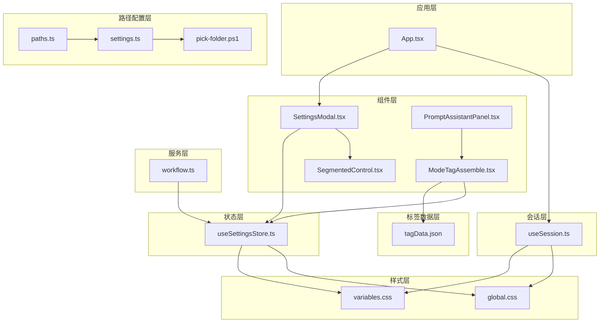
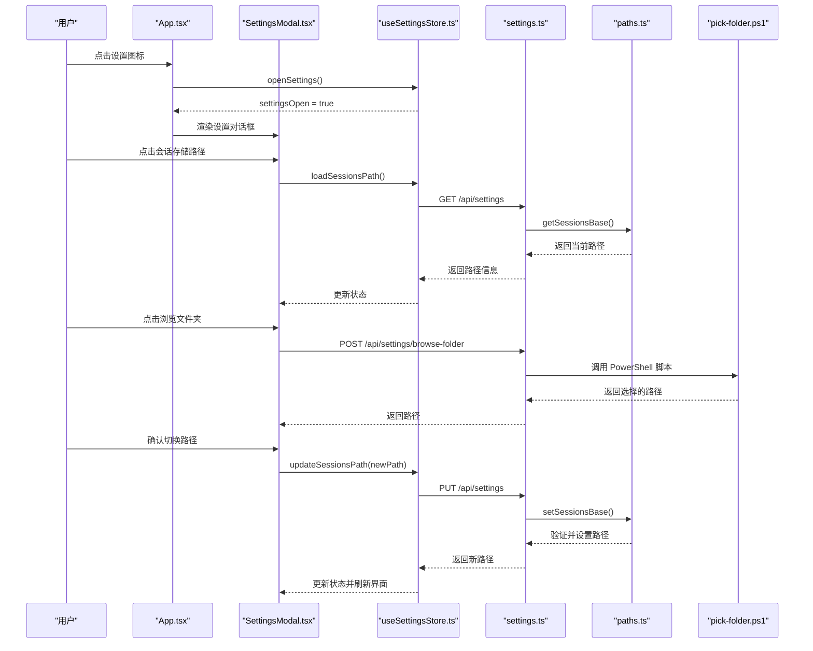
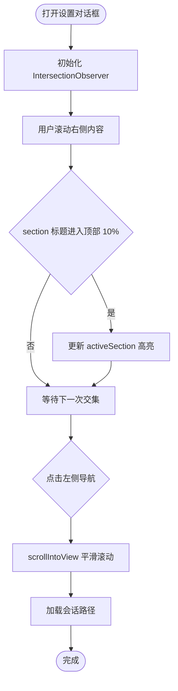
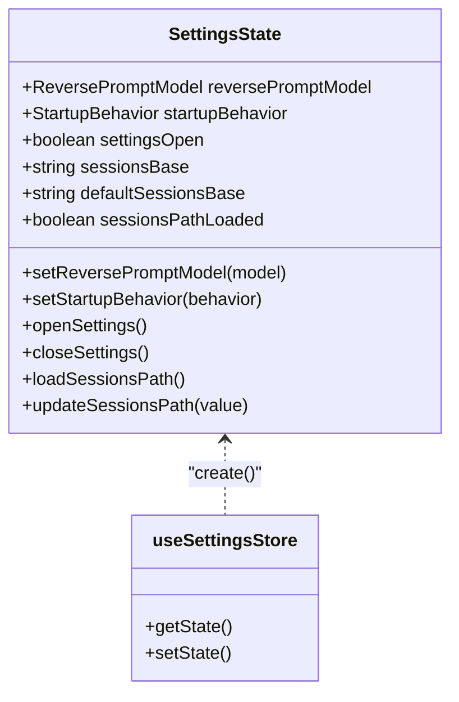
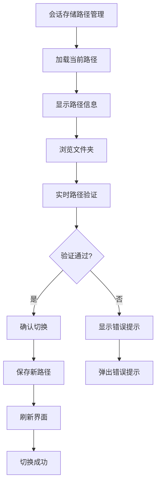
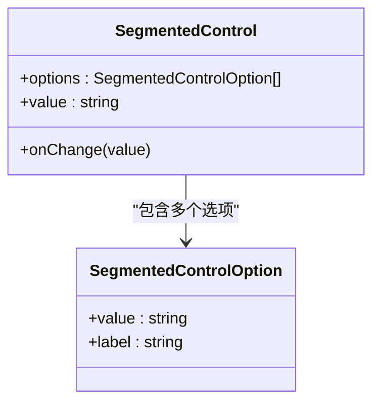
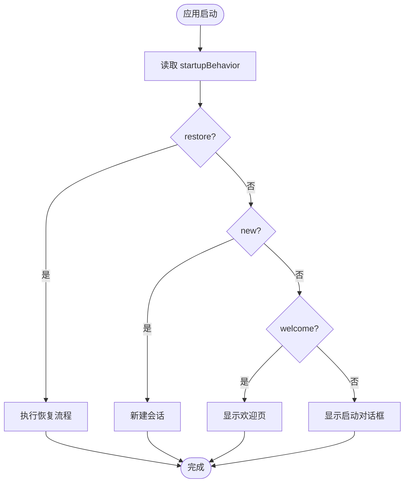
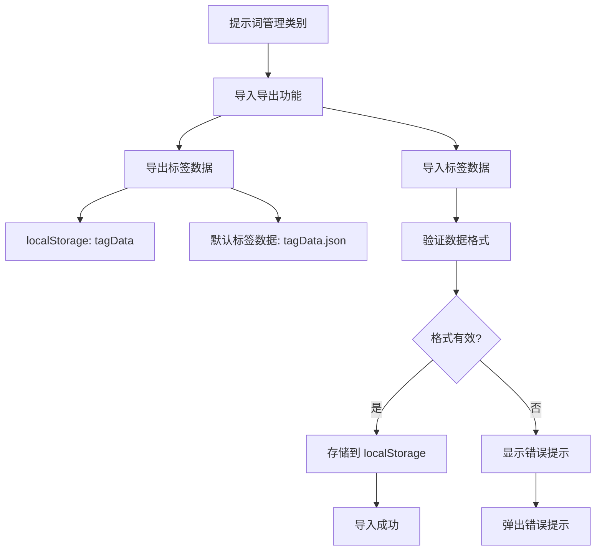
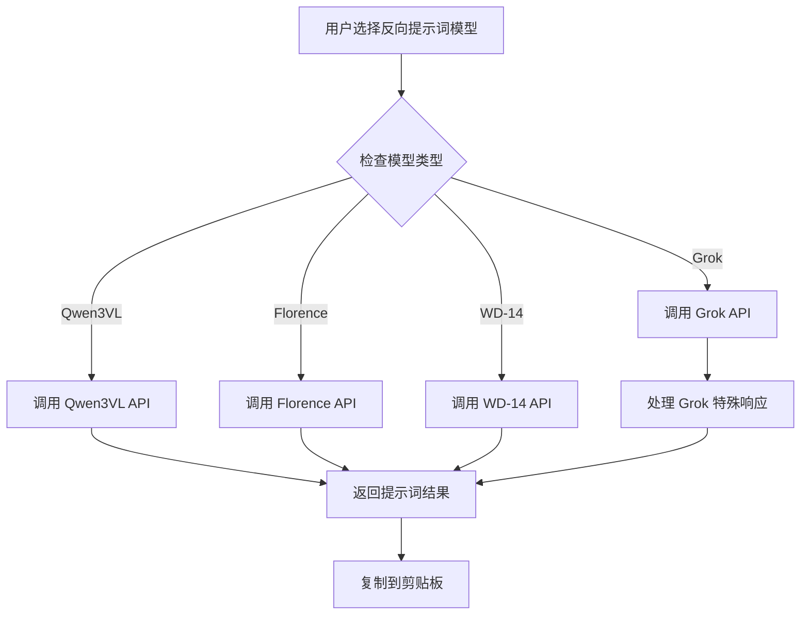
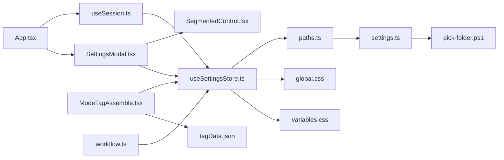

# 设置对话框组件

<cite>
**本文档引用的文件**
- [SettingsModal.tsx](file://client/src/components/SettingsModal.tsx)
- [useSettingsStore.ts](file://client/src/hooks/useSettingsStore.ts)
- [SegmentedControl.tsx](file://client/src/components/SegmentedControl.tsx)
- [App.tsx](file://client/src/components/App.tsx)
- [useSession.ts](file://client/src/hooks/useSession.ts)
- [variables.css](file://client/src/styles/variables.css)
- [global.css](file://client/src/styles/global.css)
- [settings-panel.md](file://docs/settings-panel.md)
- [2026-03-01-settings-panel.md](file://docs/plans/2026-03-01-settings-panel.md)
- [Workflow0SettingsPanel.tsx](file://client/src/components/Workflow0SettingsPanel.tsx)
- [Workflow2SettingsPanel.tsx](file://client/src/components/Workflow2SettingsPanel.tsx)
- [workflow.ts](file://server/src/routes/workflow.ts)
- [tagData.json](file://client/src/data/tagData.json)
- [ModeTagAssemble.tsx](file://client/src/components/prompt-assistant/ModeTagAssemble.tsx)
- [PromptAssistantPanel.tsx](file://client/src/components/PromptAssistantPanel.tsx)
- [systemPrompts.ts](file://client/src/components/prompt-assistant/systemPrompts.ts)
- [settings.ts](file://server/src/routes/settings.ts)
- [paths.ts](file://server/src/config/paths.ts)
- [pick-folder.ps1](file://server/scripts/pick-folder.ps1)
</cite>

## 更新摘要
**变更内容**
- 新增会话存储路径管理功能，提供 Windows Vista+ 风格文件夹选择器
- 增加实时路径验证和无缝路径切换机制
- 扩展设置面板架构，支持动态路径配置管理
- 完善会话数据存储的灵活性和可移植性

## 目录
1. [简介](#简介)
2. [项目结构](#项目结构)
3. [核心组件](#核心组件)
4. [架构总览](#架构总览)
5. [详细组件分析](#详细组件分析)
6. [依赖关系分析](#依赖关系分析)
7. [性能考虑](#性能考虑)
8. [故障排除指南](#故障排除指南)
9. [结论](#结论)
10. [附录](#附录)

## 简介
本文件详细介绍 SettingsModal 设置对话框组件的设计与实现，涵盖设置管理系统的架构、配置项组织、表单验证、状态同步、数据持久化、响应式设计、样式定制以及扩展指导。SettingsModal 是一个固定定位的模态对话框，采用左侧导航 + 右侧滚动内容的布局，通过 IntersectionObserver 实现导航高亮与滚动同步，并使用 Segment 控件进行设置项的选择与切换。

**更新** 本版本新增了会话存储路径管理功能，提供 Windows Vista+ 风格文件夹选择器，支持实时路径验证和无缝路径切换。用户现在可以通过设置面板灵活管理会话数据的存储位置，包括自定义路径选择、默认路径恢复等功能。

## 项目结构
SettingsModal 组件位于客户端前端代码中，与全局状态管理、主题变量、会话管理、标签数据管理、路径配置管理等模块协同工作：
- 组件层：SettingsModal.tsx、SegmentedControl.tsx
- 状态层：useSettingsStore.ts（Zustand + localStorage）
- 应用层：App.tsx（入口渲染 SettingsModal）
- 会话层：useSession.ts（启动行为分支逻辑）
- 标签数据层：tagData.json（默认标签数据）、ModeTagAssemble.tsx（标签数据管理）
- 路径配置层：paths.ts（路径管理）、settings.ts（设置路由）、pick-folder.ps1（文件夹选择器）
- 样式层：variables.css、global.css（CSS 变量与全局样式）
- 服务层：workflow.ts（反向提示词模型 API 调用）

**图表来源**
- [SettingsModal.tsx:1-542](file://client/src/components/SettingsModal.tsx#L1-L542)
- [useSettingsStore.ts:1-106](file://client/src/hooks/useSettingsStore.ts#L1-L106)
- [SegmentedControl.tsx:1-48](file://client/src/components/SegmentedControl.tsx#L1-L48)
- [App.tsx:1-335](file://client/src/components/App.tsx#L1-L335)
- [useSession.ts:1-422](file://client/src/hooks/useSession.ts#L1-L422)
- [tagData.json:1-174](file://client/src/data/tagData.json#L1-L174)
- [ModeTagAssemble.tsx:1-200](file://client/src/components/prompt-assistant/ModeTagAssemble.tsx#L1-L200)
- [PromptAssistantPanel.tsx:1-37](file://client/src/components/PromptAssistantPanel.tsx#L1-L37)
- [variables.css:1-31](file://client/src/styles/variables.css#L1-L31)
- [global.css:1-224](file://client/src/styles/global.css#L1-L224)
- [workflow.ts:711-814](file://server/src/routes/workflow.ts#L711-L814)
- [paths.ts:1-156](file://server/src/config/paths.ts#L1-L156)
- [settings.ts:1-106](file://server/src/routes/settings.ts#L1-L106)
- [pick-folder.ps1:1-126](file://server/scripts/pick-folder.ps1#L1-L126)

## 核心组件
- SettingsModal：设置对话框主组件，负责渲染左侧导航与右侧内容区域，处理键盘事件（Esc 关闭）、滚动同步与导航高亮，**新增** 会话存储路径管理功能。
- useSettingsStore：集中管理设置状态与本地存储，提供设置项的读取、更新与持久化，**扩展** 包含会话路径加载和更新功能。
- SegmentedControl：可复用的分段控制组件，用于设置项的选项选择。
- App：应用入口，负责渲染 SettingsModal 并触发打开/关闭操作。
- useSession：会话管理钩子，根据设置项 startupBehavior 分支执行不同的启动行为。
- tagData.json：默认标签数据库，包含预定义的标签分类结构。
- ModeTagAssemble：标签合成器组件，管理标签数据的加载、编辑和存储。
- workflow.ts：服务器端路由，处理反向提示词请求，支持多种 AI 模型包括新增的 Grok 模型。
- **新增** paths.ts：路径配置管理模块，提供会话存储路径的获取、设置和验证功能。
- **新增** settings.ts：设置路由模块，处理会话路径的读取、更新和文件夹选择器调用。
- **新增** pick-folder.ps1：PowerShell 脚本，实现 Windows Vista+ 风格的原生文件夹选择器。

**章节来源**
- [SettingsModal.tsx:86-171](file://client/src/components/SettingsModal.tsx#L86-L171)
- [useSettingsStore.ts:31-105](file://client/src/hooks/useSettingsStore.ts#L31-L105)
- [SegmentedControl.tsx:12-48](file://client/src/components/SegmentedControl.tsx#L12-L48)
- [App.tsx:54-335](file://client/src/components/App.tsx#L54-L335)
- [useSession.ts:116-422](file://client/src/hooks/useSession.ts#L116-L422)
- [tagData.json:1-174](file://client/src/data/tagData.json#L1-L174)
- [ModeTagAssemble.tsx:60-200](file://client/src/components/prompt-assistant/ModeTagAssemble.tsx#L60-L200)
- [workflow.ts:711-814](file://server/src/routes/workflow.ts#L711-L814)
- [paths.ts:68-137](file://server/src/config/paths.ts#L68-L137)
- [settings.ts:21-103](file://server/src/routes/settings.ts#L21-L103)
- [pick-folder.ps1:17-126](file://server/scripts/pick-folder.ps1#L17-L126)

## 架构总览
SettingsModal 的架构围绕"状态驱动 UI + 本地存储持久化 + 服务端配置管理"的模式构建：
- 状态来源：useSettingsStore 使用 Zustand 创建状态容器，并通过 localStorage 进行持久化。
- UI 渲染：SettingsModal 基于状态渲染设置项，使用 Segment 控件进行交互。
- 导航与滚动：左侧导航按钮与右侧内容区域通过 IntersectionObserver 实现滚动同步与高亮。
- 启动行为：useSession 根据 settings 中的 startupBehavior 决定恢复、新建或询问用户的行为。
- 模odel选择：反向提示词模型支持四种选择，包括新增的 Grok 模型。
- **更新** 路径管理：新增会话存储路径管理功能，支持动态路径配置和实时验证。
- **更新** 文件夹选择：通过 PowerShell 脚本实现 Windows 原生文件夹选择器，提供 Vista+ 风格的用户体验。

**图表来源**
- [App.tsx:186-204](file://client/src/components/App.tsx#L186-L204)
- [SettingsModal.tsx:117-171](file://client/src/components/SettingsModal.tsx#L117-L171)
- [useSettingsStore.ts:69-104](file://client/src/hooks/useSettingsStore.ts#L69-L104)
- [settings.ts:21-103](file://server/src/routes/settings.ts#L21-L103)
- [paths.ts:84-100](file://server/src/config/paths.ts#L84-L100)
- [pick-folder.ps1:119-126](file://server/scripts/pick-folder.ps1#L119-L126)

## 详细组件分析

### SettingsModal 组件分析
- 结构组成：标题栏、左侧导航、右侧滚动内容区。
- 功能特性：
  - Esc 键关闭：监听窗口键盘事件，按 Esc 关闭对话框。
  - 导航高亮：使用 IntersectionObserver 监听右侧内容区域，当某个 section 标题进入可视区域顶部附近时，更新 activeSection。
  - 滚动同步：点击左侧导航按钮时，平滑滚动到对应 section。
  - 设置项：工作流、会话、通知和**更新**提示词管理四大类设置，分别使用 Segment 控件进行选择。
  - **更新** 会话存储路径管理：新增会话存储路径配置界面，包括文件夹浏览、路径验证和无缝切换功能。

**图表来源**
- [SettingsModal.tsx:107-122](file://client/src/components/SettingsModal.tsx#L107-L122)
- [SettingsModal.tsx:126-133](file://client/src/components/SettingsModal.tsx#L126-L133)

**章节来源**
- [SettingsModal.tsx:86-542](file://client/src/components/SettingsModal.tsx#L86-L542)

### useSettingsStore 状态管理分析
- 数据类型：定义了设置项的类型别名，如 ReversePromptModel、StartupBehavior、DropdownMenuStyle。
- 状态结构：包含设置项值、开关状态及对应的 setter 方法，**扩展** 新增会话路径相关状态。
- 持久化策略：所有 setter 在更新状态的同时写入 localStorage，确保刷新后仍保持最新设置。
- 默认值：从 localStorage 读取，若不存在则使用默认值。
- **更新** 会话路径管理：新增 loadSessionsPath 和 updateSessionsPath 方法，支持动态路径加载和更新。

**图表来源**
- [useSettingsStore.ts:8-29](file://client/src/hooks/useSettingsStore.ts#L8-L29)

**章节来源**
- [useSettingsStore.ts:1-106](file://client/src/hooks/useSettingsStore.ts#L1-L106)

### 会话存储路径管理系统
- **更新** 新增会话存储路径管理类别：在设置面板中新增 '会话' 分类，专门用于会话数据存储路径的管理。
- 路径配置结构：支持自定义绝对路径和默认路径，包含路径加载、验证和切换功能。
- 文件夹选择器：
  - Windows Vista+ 风格：通过 PowerShell 脚本实现原生文件夹选择器，提供现代化的用户体验。
  - 实时验证：选择路径后立即进行有效性检查，包括路径格式、可写性和安全性验证。
  - 无缝切换：支持即时路径切换，切换后自动刷新界面并返回欢迎页。
- 路径验证机制：
  - 绝对路径检查：确保路径为绝对路径格式。
  - 目录存在性检查：尝试创建目录以验证路径有效性。
  - 权限检查：通过写入测试文件验证目录可写性。
  - 安全性检查：防止嵌套在当前会话目录的子 tab 目录下。
- 数据持久化：路径配置存储在 config.json 文件中，确保应用重启后路径仍然有效。

**图表来源**
- [SettingsModal.tsx:135-171](file://client/src/components/SettingsModal.tsx#L135-L171)
- [paths.ts:102-137](file://server/src/config/paths.ts#L102-L137)
- [settings.ts:69-103](file://server/src/routes/settings.ts#L69-L103)
- [pick-folder.ps1:91-126](file://server/scripts/pick-folder.ps1#L91-L126)

**章节来源**
- [SettingsModal.tsx:327-416](file://client/src/components/SettingsModal.tsx#L327-L416)
- [paths.ts:68-137](file://server/src/config/paths.ts#L68-L137)
- [settings.ts:21-103](file://server/src/routes/settings.ts#L21-L103)
- [pick-folder.ps1:17-126](file://server/scripts/pick-folder.ps1#L17-L126)

### SegmentedControl 组件分析
- 设计目标：提供统一的分段选择控件，支持多选项切换。
- 样式策略：使用 CSS 变量实现主题适配，激活态与非激活态颜色区分明显。
- 交互行为：点击选项触发 onChange 回调，由父组件更新状态。

**图表来源**
- [SegmentedControl.tsx:1-10](file://client/src/components/SegmentedControl.tsx#L1-L10)

**章节来源**
- [SegmentedControl.tsx:1-48](file://client/src/components/SegmentedControl.tsx#L1-L48)

### 启动行为与会话管理集成
- 设置项：startupBehavior 支持 'restore' | 'new' | 'welcome'。
- 分支逻辑：useSession 在挂载时根据设置项决定恢复、新建或显示欢迎页。
- 用户交互：当选择 'welcome' 时，显示欢迎页；当选择 'ask' 时，会话管理器返回一个阻塞对话框状态，由 App 渲染 StartupDialog。

**图表来源**
- [useSession.ts:290-387](file://client/src/hooks/useSession.ts#L290-L387)
- [settings-panel.md:86-104](file://docs/settings-panel.md#L86-L104)

**章节来源**
- [useSession.ts:116-422](file://client/src/hooks/useSession.ts#L116-L422)
- [settings-panel.md:86-104](file://docs/settings-panel.md#L86-L104)

### 提示词管理与标签数据库系统
- **更新** 新增提示词管理类别：在设置面板中新增 '提示词管理' 分类，专门用于标签数据库的管理。
- 标签数据结构：支持多层级分类结构，包括主分类、子分类和标签项，每个标签包含标签名和值。
- 导入导出功能：
  - 导出：从 localStorage 读取标签数据，如果不存在则使用默认数据，生成 JSON 文件下载。
  - 导入：支持用户上传自定义标签数据文件，进行格式验证后存储到 localStorage。
- 兼容性处理：自动检测旧格式标签数据，必要时进行格式转换。
- 数据持久化：标签数据存储在 localStorage 中，确保用户关闭浏览器后数据仍然保留。

**图表来源**
- [SettingsModal.tsx:451-534](file://client/src/components/SettingsModal.tsx#L451-L534)
- [tagData.json:1-174](file://client/src/data/tagData.json#L1-L174)
- [ModeTagAssemble.tsx:60-90](file://client/src/components/prompt-assistant/ModeTagAssemble.tsx#L60-L90)

**章节来源**
- [SettingsModal.tsx:451-534](file://client/src/components/SettingsModal.tsx#L451-L534)
- [tagData.json:1-174](file://client/src/data/tagData.json#L1-L174)
- [ModeTagAssemble.tsx:60-90](file://client/src/components/prompt-assistant/ModeTagAssemble.tsx#L60-L90)

### 反向提示词模型系统
- **更新** 模型支持：现在支持四种反向提示词模型：
  - Qwen3VL：通义千问视觉语言模型
  - Florence：图像理解与描述模型
  - WD-14：Waifu Diffusion 模型
  - Grok：新增的 GROK 模型，提供强大的图像分析能力
- 服务器端实现：workflow.ts 路由处理不同模型的 API 调用，包括 Grok 模型的特殊处理逻辑。
- 错误处理：每种模型都有相应的错误处理机制，确保用户获得清晰的反馈信息。

**图表来源**
- [workflow.ts:711-814](file://server/src/routes/workflow.ts#L711-L814)
- [SettingsModal.tsx:7-12](file://client/src/components/SettingsModal.tsx#L7-L12)

**章节来源**
- [workflow.ts:711-814](file://server/src/routes/workflow.ts#L711-L814)
- [SettingsModal.tsx:7-12](file://client/src/components/SettingsModal.tsx#L7-L12)

### 响应式设计与无障碍访问
- 响应式尺寸：对话框宽度使用 min(92vw, 1200px)，高度使用 min(90vh, 820px)，保证在不同屏幕尺寸下都有良好体验。
- 滚动区域：右侧内容区域 overflowY: auto，配合 smooth scroll 实现流畅滚动。
- 键盘导航：Esc 键关闭对话框，符合常见 Web 交互习惯。
- 无障碍建议：可增加 aria-label、role="dialog"、tabIndex 等属性以提升可访问性（当前实现未包含）。

**章节来源**
- [SettingsModal.tsx:192-217](file://client/src/components/SettingsModal.tsx#L192-L217)
- [SettingsModal.tsx:109-115](file://client/src/components/SettingsModal.tsx#L109-L115)

### 样式定制与主题适配
- CSS 变量：通过 variables.css 定义主题色板，dark 主题通过 data-theme 属性切换。
- 组件样式：SettingsModal 与 SegmentedControl 均使用 var(--color-*) 变量，无需修改源码即可实现主题定制。
- 全局样式：global.css 提供基础样式与动画，确保组件在不同主题下具有一致外观。

**章节来源**
- [variables.css:1-31](file://client/src/styles/variables.css#L1-L31)
- [global.css:1-224](file://client/src/styles/global.css#L1-L224)
- [SettingsModal.tsx:205-216](file://client/src/components/SettingsModal.tsx#L205-L216)
- [SegmentedControl.tsx:14-46](file://client/src/components/SegmentedControl.tsx#L14-L46)

### 扩展指导与最佳实践
- 添加新的设置类别：
  - 在 SettingsModal.tsx 的 CATEGORIES 数组中新增条目，并在右侧内容区域添加对应 section。
  - 确保每个 section 根节点包含 data-section 属性与 ref 注册。
- 添加新的设置项：
  - 在 useSettingsStore.ts 中定义类型、状态字段与 setter，并实现 localStorage 持久化。
  - 在 SettingsModal.tsx 对应 section 中添加一行设置项，使用 Segment 控件。
- **更新** 集成新的反向提示词模型：
  - 在 SettingsModal.tsx 的 REVERSE_PROMPT_MODELS 数组中添加新模型选项。
  - 在 useSettingsStore.ts 的 ReversePromptModel 类型定义中包含新模型。
  - 在服务器端 workflow.ts 中实现新模型的 API 调用逻辑。
- **更新** 集成标签数据库管理：
  - 在 SettingsModal.tsx 中新增提示词管理类别和相关设置项。
  - 在 ModeTagAssemble.tsx 中实现标签数据的加载、验证和存储逻辑。
  - 确保标签数据格式的向后兼容性和错误处理。
- **更新** 集成会话存储路径管理：
  - 在 SettingsModal.tsx 中新增会话类别和路径管理设置项。
  - 在 useSettingsStore.ts 中实现路径加载和更新方法。
  - 在服务器端 paths.ts 中实现路径验证和设置逻辑。
  - 在 settings.ts 中实现 RESTful API 接口。
  - 在 pick-folder.ps1 中实现 Windows 原生文件夹选择器。
- 集成第三方配置：
  - 可通过自定义控件替代 Segment 控件，例如下拉选择、开关、数值输入等。
  - 将第三方配置写入 localStorage 或其他持久化存储，保持与现有模式一致。
- 设置导入导出：
  - 可基于 localStorage 的键值对实现导入导出功能，注意版本兼容与校验。
  - 导入时进行类型校验与默认值回退，避免破坏现有设置。

**章节来源**
- [settings-panel.md:13-71](file://docs/settings-panel.md#L13-L71)
- [2026-03-01-settings-panel.md:13-71](file://docs/plans/2026-03-01-settings-panel.md#L13-L71)

## 依赖关系分析
- 组件耦合：
  - SettingsModal 依赖 useSettingsStore 与 SegmentedControl。
  - App 依赖 SettingsModal 与 useSettingsStore。
  - useSession 依赖 useSettingsStore 以读取启动行为设置。
  - ModeTagAssemble 依赖 tagData.json 和 localStorage 进行标签数据管理。
  - **更新** 会话路径管理：SettingsModal 依赖 useSettingsStore 的路径管理方法。
  - **更新** 服务器端集成：settings.ts 依赖 paths.ts 进行路径配置管理。
  - **更新** Windows 文件夹选择：settings.ts 依赖 pick-folder.ps1 脚本。
  - 服务器端 workflow.ts 依赖反向提示词配置和外部 API。
- 外部依赖：
  - Zustand：状态管理。
  - localStorage：设置持久化。
  - IntersectionObserver：滚动同步。
  - CSS 变量：主题适配。
  - **更新** Grok API：新增的外部服务依赖。
  - **更新** 标签数据：localStorage 存储的标签数据库。
  - **更新** PowerShell：Windows 文件夹选择器依赖。
  - **更新** 文件系统：路径验证和目录操作。

**图表来源**
- [App.tsx:186-204](file://client/src/components/App.tsx#L186-L204)
- [SettingsModal.tsx:86-171](file://client/src/components/SettingsModal.tsx#L86-L171)
- [useSettingsStore.ts:31-105](file://client/src/hooks/useSettingsStore.ts#L31-L105)
- [useSession.ts:307-387](file://client/src/hooks/useSession.ts#L307-L387)
- [ModeTagAssemble.tsx:60-90](file://client/src/components/prompt-assistant/ModeTagAssemble.tsx#L60-L90)
- [tagData.json:1-174](file://client/src/data/tagData.json#L1-L174)
- [variables.css:1-31](file://client/src/styles/variables.css#L1-L31)
- [global.css:1-224](file://client/src/styles/global.css#L1-L224)
- [workflow.ts:711-814](file://server/src/routes/workflow.ts#L711-L814)
- [paths.ts:68-137](file://server/src/config/paths.ts#L68-L137)
- [settings.ts:21-103](file://server/src/routes/settings.ts#L21-L103)
- [pick-folder.ps1:17-126](file://server/scripts/pick-folder.ps1#L17-L126)

**章节来源**
- [App.tsx:1-335](file://client/src/components/App.tsx#L1-L335)
- [SettingsModal.tsx:1-542](file://client/src/components/SettingsModal.tsx#L1-L542)
- [useSettingsStore.ts:1-106](file://client/src/hooks/useSettingsStore.ts#L1-L106)
- [useSession.ts:1-422](file://client/src/hooks/useSession.ts#L1-L422)
- [ModeTagAssemble.tsx:1-200](file://client/src/components/prompt-assistant/ModeTagAssemble.tsx#L1-L200)
- [tagData.json:1-174](file://client/src/data/tagData.json#L1-L174)
- [workflow.ts:711-814](file://server/src/routes/workflow.ts#L711-L814)
- [paths.ts:1-156](file://server/src/config/paths.ts#L1-L156)
- [settings.ts:1-106](file://server/src/routes/settings.ts#L1-L106)
- [pick-folder.ps1:1-126](file://server/scripts/pick-folder.ps1#L1-L126)

## 性能考虑
- IntersectionObserver：仅在对话框打开时启用，减少不必要的计算。
- 状态更新：Zustand 的局部状态更新避免了全量重渲染。
- 滚动优化：smooth scroll 与合理的 rootMargin 配置减少滚动抖动。
- 本地存储：设置项读写集中在 setter 中，避免频繁 I/O。
- **更新** 路径管理优化：会话路径加载采用懒加载策略，仅在需要时才进行网络请求。
- **更新** 文件夹选择器：PowerShell 调用具有超时保护，避免长时间阻塞。
- **更新** 路径验证：验证过程异步执行，避免阻塞主线程。
- 标签数据处理：标签数据导入导出使用异步处理，避免阻塞主线程。
- 模型选择优化：Grok 模型的 API 调用可能比其他模型更耗时，需要适当的超时处理和错误提示。

## 故障排除指南
- 设置项未保存：
  - 检查 useSettingsStore 的 setter 是否正确写入 localStorage。
  - 确认页面刷新后 localStorage 中是否存在对应键值。
- 滚动同步异常：
  - 确保每个 section 根节点包含 data-section 属性且已注册到 sectionRefs。
  - 检查 IntersectionObserver 初始化条件（settingsOpen 为 true）。
- Esc 键无效：
  - 确认键盘事件监听在 settingsOpen 为 true 时才绑定。
- 启动行为未生效：
  - 检查 useSession 中对 startupBehavior 的读取与分支逻辑。
  - 确认 useSettingsStore 中的默认值与实际存储值一致。
- **更新** 会话路径管理问题：
  - 检查 /api/settings 接口是否正常响应。
  - 确认 PowerShell 脚本是否正确执行。
  - 验证路径格式是否为绝对路径。
  - 检查目录权限和磁盘空间。
  - 确认 config.json 文件写入是否成功。
- **更新** 文件夹选择器失败：
  - 检查 PowerShell 执行权限和策略设置。
  - 确认 pick-folder.ps1 脚本路径是否正确。
  - 验证 Windows 平台检测逻辑。
  - 检查脚本编码和输出格式。
- **更新** 路径验证失败：
  - 检查路径是否为绝对路径。
  - 确认目录是否存在且可访问。
  - 验证写权限和磁盘空间。
  - 检查安全限制（不能嵌套在会话目录内部）。
- 标签数据导入失败：
  - 检查上传文件是否为有效的 JSON 格式。
  - 确认标签数据结构包含必需的 categories 字段。
  - 验证标签数据格式是否符合预期结构。
- 标签数据导出为空：
  - 确认 localStorage 中是否存在 'tagData' 键值。
  - 检查默认标签数据文件是否正常加载。
- Grok 模型调用失败：
  - 检查网络连接和 API 密钥配置。
  - 查看服务器端错误日志，确认 Grok API 响应格式。
  - 确认图像文件格式和大小符合要求。

**章节来源**
- [useSettingsStore.ts:41-105](file://client/src/hooks/useSettingsStore.ts#L41-L105)
- [SettingsModal.tsx:109-122](file://client/src/components/SettingsModal.tsx#L109-L122)
- [useSession.ts:307-387](file://client/src/hooks/useSession.ts#L307-L387)
- [SettingsModal.tsx:135-171](file://client/src/components/SettingsModal.tsx#L135-L171)
- [paths.ts:102-137](file://server/src/config/paths.ts#L102-L137)
- [settings.ts:69-103](file://server/src/routes/settings.ts#L69-L103)
- [ModeTagAssemble.tsx:60-90](file://client/src/components/prompt-assistant/ModeTagAssemble.tsx#L60-L90)
- [workflow.ts:711-814](file://server/src/routes/workflow.ts#L711-L814)

## 结论
SettingsModal 通过清晰的状态管理、可复用的控件与良好的响应式设计，实现了简洁高效的设置界面。其基于 localStorage 的持久化策略与基于 IntersectionObserver 的滚动同步机制，确保了良好的用户体验。**更新** 新增的会话存储路径管理功能，通过 Windows Vista+ 风格文件夹选择器、实时路径验证和无缝路径切换，显著提升了会话数据管理的灵活性和用户体验。**更新** 新增的提示词管理类别和标签数据库导入导出功能，进一步增强了系统的数据管理能力，为用户提供了更灵活的标签数据定制选项。**更新** 新增的 Grok 反向提示词模型进一步增强了系统的 AI 能力，为用户提供了更多样化的图像分析选择。结合文档中的扩展指导，开发者可以轻松添加新的设置类别与项，实现更丰富的配置能力。

## 附录

### 使用示例与行为说明
- 打开设置对话框：点击应用头部的设置图标，触发 openSettings。
- 切换设置项：使用 SegmentedControl 进行选择，立即生效并持久化。
- 导航与滚动：点击左侧导航项或滚动右侧内容，自动高亮对应导航项。
- 启动行为：根据 startupBehavior 决定应用启动时的行为（恢复、新建、欢迎页）。
- **更新** 选择反向提示词模型：在设置中选择 Qwen3VL、Florence、WD-14 或 Grok 模型进行图像提示词反推。
- **更新** 管理标签数据：在提示词管理类别中导入或导出标签数据库，支持自定义标签分类和标签项。
- **更新** 管理会话路径：在会话类别中浏览文件夹选择器，选择自定义路径或恢复默认路径，支持实时验证和无缝切换。

**章节来源**
- [App.tsx:186-204](file://client/src/components/App.tsx#L186-L204)
- [SettingsModal.tsx:282-325](file://client/src/components/SettingsModal.tsx#L282-L325)
- [useSession.ts:368-387](file://client/src/hooks/useSession.ts#L368-L387)
- [SettingsModal.tsx:327-416](file://client/src/components/SettingsModal.tsx#L327-L416)
- [SettingsModal.tsx:451-534](file://client/src/components/SettingsModal.tsx#L451-L534)

### 样式定制方案
- 主题变量：通过 variables.css 修改颜色变量，实现主题切换。
- 组件样式：直接覆盖 SettingsModal 与 SegmentedControl 的内联样式或为其添加额外类名。
- 全局样式：在 global.css 中调整字体、间距等基础样式。

**章节来源**
- [variables.css:1-31](file://client/src/styles/variables.css#L1-L31)
- [global.css:1-224](file://client/src/styles/global.css#L1-L224)
- [SettingsModal.tsx:192-217](file://client/src/components/SettingsModal.tsx#L192-L217)
- [SegmentedControl.tsx:14-46](file://client/src/components/SegmentedControl.tsx#L14-L46)

### 会话存储路径配置详解
- **更新** 路径配置结构：支持 sessionsBase（当前生效路径）和 defaultSessionsBase（默认路径）两个字段。
- **更新** 文件夹选择器：通过 PowerShell 脚本实现 Windows Vista+ 风格的原生文件夹选择器。
- **更新** 路径验证规则：
  - 必须为绝对路径
  - 目录必须存在或可创建
  - 必须具有写权限
  - 不能嵌套在当前会话目录的子 tab 目录下
- **更新** 切换流程：选择路径 → 实时验证 → 用户确认 → 保存配置 → 刷新界面。

**章节来源**
- [paths.ts:68-137](file://server/src/config/paths.ts#L68-L137)
- [settings.ts:69-103](file://server/src/routes/settings.ts#L69-L103)
- [pick-folder.ps1:91-126](file://server/scripts/pick-folder.ps1#L91-L126)
- [SettingsModal.tsx:135-171](file://client/src/components/SettingsModal.tsx#L135-L171)

### 标签数据结构与格式
- **更新** 标签数据格式：支持多层级分类结构，包括主分类、子分类和标签项。
- 结构定义：
  - categories：主分类数组
  - id：分类唯一标识符
  - label：分类显示名称
  - subcategories：子分类数组
  - multiSelect：是否允许多选
  - tags：标签项数组，包含标签名和值
- **更新** 兼容性处理：自动检测旧格式并进行转换，确保向后兼容。

**章节来源**
- [tagData.json:1-174](file://client/src/data/tagData.json#L1-L174)
- [ModeTagAssemble.tsx:5-21](file://client/src/components/prompt-assistant/ModeTagAssemble.tsx#L5-L21)
- [ModeTagAssemble.tsx:60-90](file://client/src/components/prompt-assistant/ModeTagAssemble.tsx#L60-L90)

### 反向提示词模型对比
- **Qwen3VL**：通义千问视觉语言模型，适合中文场景和复杂图像理解任务。
- **Florence**：图像理解与描述模型，擅长详细的图像描述和场景分析。
- **WD-14**：Waifu Diffusion 模型，专注于动漫风格图像的特征提取。
- **Grok**：新增模型，提供强大的图像分析能力，适合专业级图像理解和提示词生成。

**章节来源**
- [SettingsModal.tsx:7-12](file://client/src/components/SettingsModal.tsx#L7-L12)
- [workflow.ts:711-814](file://server/src/routes/workflow.ts#L711-L814)

### Windows 文件夹选择器技术实现
- **更新** 技术架构：通过 Node.js child_process.execFile 调用 PowerShell 脚本。
- **更新** Vista 风格：使用 COM 接口实现 Windows 原生文件夹选择对话框。
- **更新** DPI 适配：包含多级 DPI 适配函数，确保高分辨率显示器上的清晰显示。
- **更新** 参数传递：通过命令行参数传递标题和初始路径，支持国际化。

**章节来源**
- [settings.ts:69-103](file://server/src/routes/settings.ts#L69-L103)
- [pick-folder.ps1:17-126](file://server/scripts/pick-folder.ps1#L17-L126)