# 队列面板组件

<cite>
**本文档引用的文件**
- [QueuePanel.tsx](file://client/src/components/QueuePanel.tsx)
- [useWebSocket.ts](file://client/src/hooks/useWebSocket.ts)
- [useWorkflowStore.ts](file://client/src/hooks/useWorkflowStore.ts)
- [index.ts](file://client/src/types/index.ts)
- [Sidebar.tsx](file://client/src/components/Sidebar.tsx)
- [global.css](file://client/src/styles/global.css)
- [App.tsx](file://client/src/components/App.tsx)
</cite>

## 更新摘要
**变更内容**
- 新增跨标签页清理功能：`removeImageByPromptId` 方法实现跨标签页同步清理
- 增强删除功能：队列取消时自动清理前端 UI 状态
- 改进状态同步机制：确保队列状态与 UI 状态保持一致

## 目录
1. [简介](#简介)
2. [项目结构](#项目结构)
3. [核心组件](#核心组件)
4. [架构概览](#架构概览)
5. [详细组件分析](#详细组件分析)
6. [依赖关系分析](#依赖关系分析)
7. [性能考虑](#性能考虑)
8. [故障排除指南](#故障排除指南)
9. [结论](#结论)
10. [附录](#附录)

## 简介

QueuePanel 队列面板组件是 Pix2Real 图像处理工作流系统中的关键组件，负责展示和管理异步任务队列。该组件提供了实时的任务状态监控、进度跟踪、用户交互控制等功能，支持多种工作流场景下的任务管理需求。

该组件采用现代化的 React 架构设计，结合 WebSocket 实时通信、Zustand 状态管理、以及响应式 UI 设计，为用户提供流畅的任务队列管理体验。

**更新** 新增跨标签页清理功能，确保队列取消时能够同步清理前端 UI 状态，提供更完整的状态管理体验。

## 项目结构

QueuePanel 组件位于客户端前端代码结构中，与相关的核心模块协同工作：

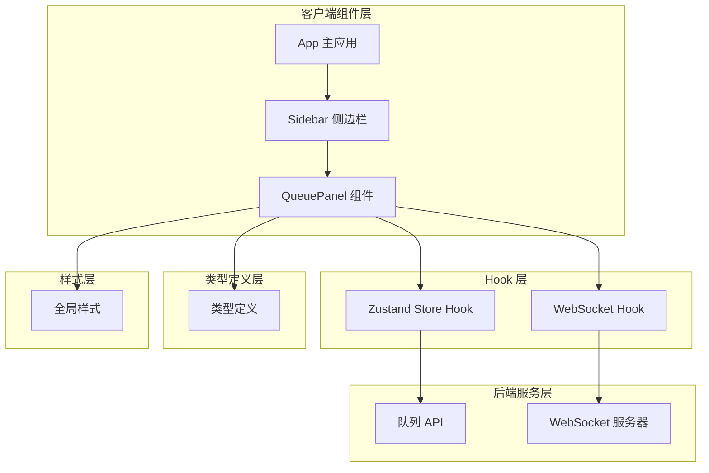

**图表来源**
- [QueuePanel.tsx:1-308](file://client/src/components/QueuePanel.tsx#L1-L308)
- [Sidebar.tsx:364-424](file://client/src/components/Sidebar.tsx#L364-L424)
- [useWebSocket.ts:1-99](file://client/src/hooks/useWebSocket.ts#L1-L99)

**章节来源**
- [QueuePanel.tsx:1-308](file://client/src/components/QueuePanel.tsx#L1-L308)
- [Sidebar.tsx:1-200](file://client/src/components/Sidebar.tsx#L1-L200)

## 核心组件

### 数据结构设计

QueuePanel 采用了精心设计的数据结构来管理任务信息：

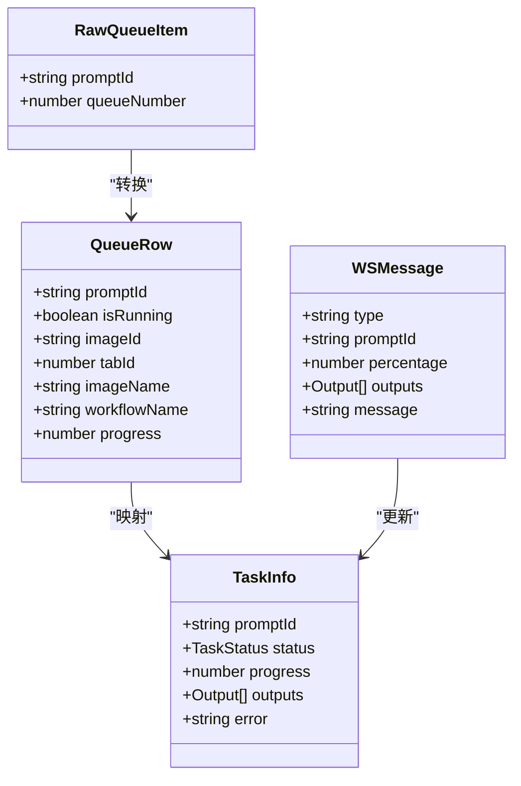

**图表来源**
- [QueuePanel.tsx:5-18](file://client/src/components/QueuePanel.tsx#L5-L18)
- [index.ts:17-25](file://client/src/types/index.ts#L17-L25)
- [index.ts:27-57](file://client/src/types/index.ts#L27-L57)

### 任务状态管理

组件实现了完整的任务生命周期管理：

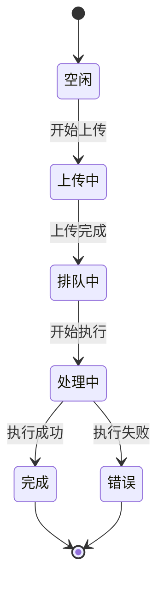

**更新** 新增跨标签页清理状态管理，确保删除操作能够同步清理所有相关状态。

**章节来源**
- [QueuePanel.tsx:37-81](file://client/src/components/QueuePanel.tsx#L37-L81)
- [useWorkflowStore.ts:67-75](file://client/src/hooks/useWorkflowStore.ts#L67-L75)

## 架构概览

QueuePanel 采用分层架构设计，确保各组件职责清晰分离：

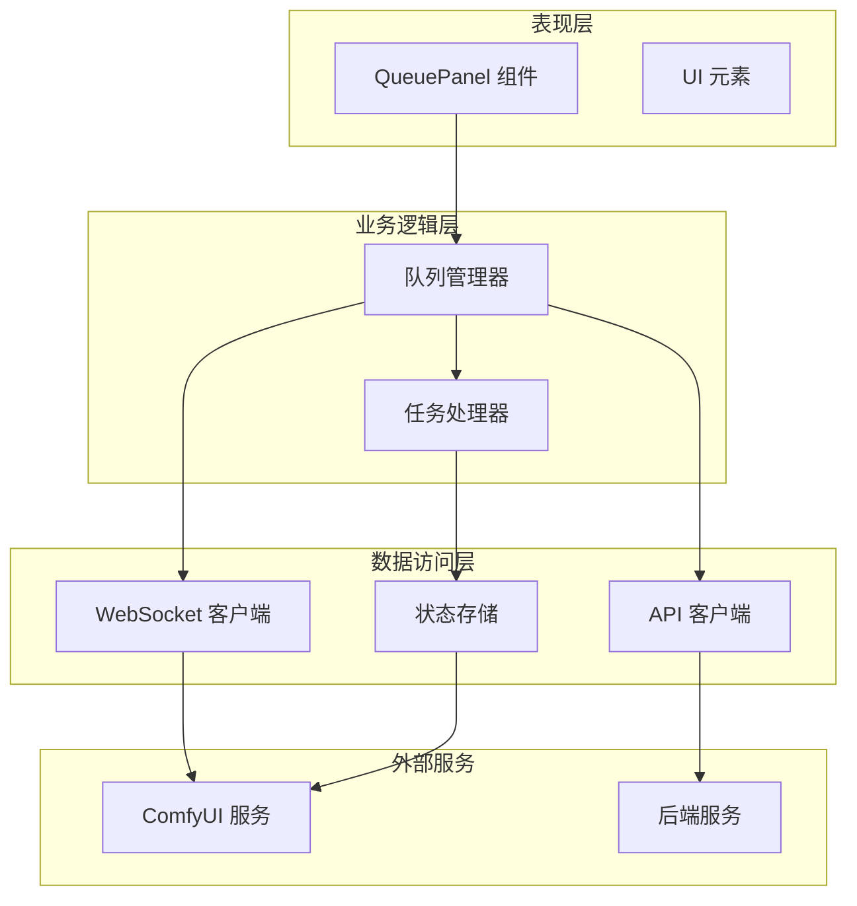

**图表来源**
- [QueuePanel.tsx:26-35](file://client/src/components/QueuePanel.tsx#L26-L35)
- [useWebSocket.ts:10-73](file://client/src/hooks/useWebSocket.ts#L10-L73)
- [useWorkflowStore.ts:96-645](file://client/src/hooks/useWorkflowStore.ts#L96-L645)

## 详细组件分析

### 组件结构与渲染

QueuePanel 组件采用函数式组件设计，具备完整的生命周期管理和状态控制：

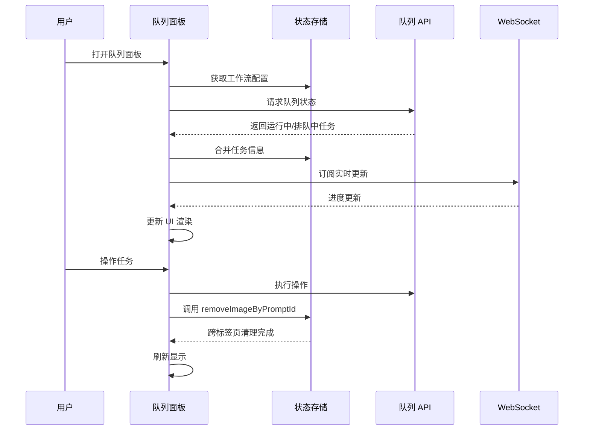

**图表来源**
- [QueuePanel.tsx:37-87](file://client/src/components/QueuePanel.tsx#L37-L87)
- [useWebSocket.ts:26-51](file://client/src/hooks/useWebSocket.ts#L26-L51)

### 实时更新机制

组件通过 WebSocket 实现与后端的实时通信：

| 事件类型 | 触发条件 | 处理逻辑 |
|---------|---------|---------|
| connected | 建立连接 | 设置客户端 ID |
| execution_start | 任务开始 | 标记任务启动 |
| progress | 进度更新 | 更新任务进度 |
| complete | 任务完成 | 完成任务处理 |
| error | 任务错误 | 标记任务失败 |

**章节来源**
- [useWebSocket.ts:31-47](file://client/src/hooks/useWebSocket.ts#L31-L47)
- [QueuePanel.tsx:89-121](file://client/src/components/QueuePanel.tsx#L89-L121)

### 交互设计

组件提供了丰富的用户交互功能：

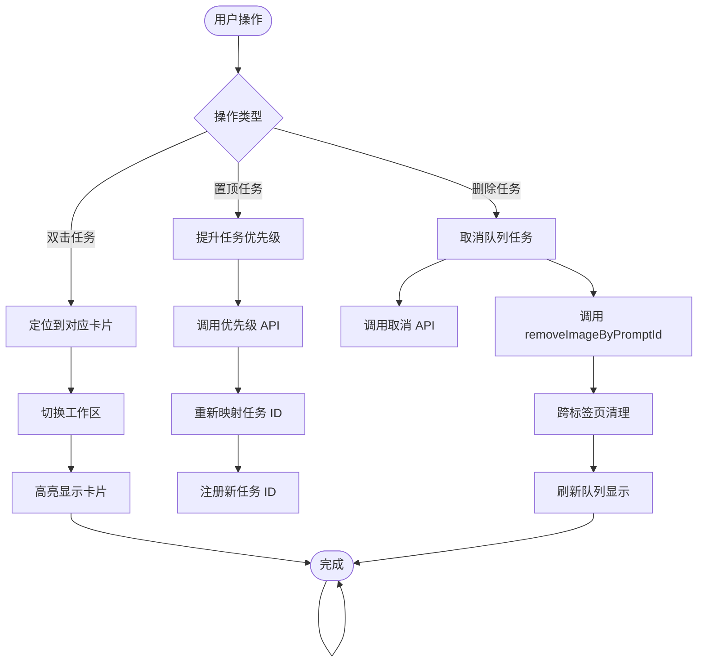

**更新** 新增跨标签页清理流程，确保删除操作能够同步清理所有相关状态。

**图表来源**
- [QueuePanel.tsx:123-133](file://client/src/components/QueuePanel.tsx#L123-L133)
- [QueuePanel.tsx:89-116](file://client/src/components/QueuePanel.tsx#L89-L116)
- [QueuePanel.tsx:118-121](file://client/src/components/QueuePanel.tsx#L118-L121)

**章节来源**
- [QueuePanel.tsx:169-308](file://client/src/components/QueuePanel.tsx#L169-L308)

### 删除功能增强

**新增** `removeImageByPromptId` 跨标签页清理功能，确保队列取消时能够同步清理前端 UI 状态：

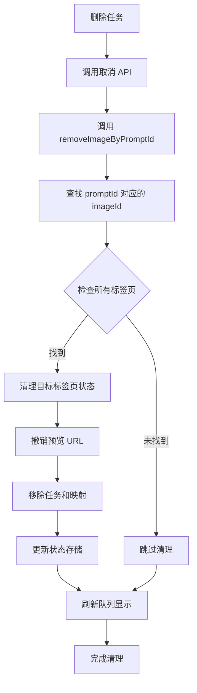

**图表来源**
- [QueuePanel.tsx:119-123](file://client/src/components/QueuePanel.tsx#L119-L123)
- [useWorkflowStore.ts:522-559](file://client/src/hooks/useWorkflowStore.ts#L522-L559)

**章节来源**
- [QueuePanel.tsx:119-123](file://client/src/components/QueuePanel.tsx#L119-L123)
- [useWorkflowStore.ts:522-559](file://client/src/hooks/useWorkflowStore.ts#L522-L559)

### 样式系统

组件采用 CSS 变量和动画系统实现主题适配：

| 样式属性 | 值 | 用途 |
|---------|----|------|
| --color-surface | 变量 | 面板背景色 |
| --color-border | 变量 | 边框颜色 |
| --color-primary | 变量 | 主色调 |
| --color-text | 变量 | 文本颜色 |
| --color-text-secondary | 变量 | 次要文本颜色 |
| --color-error | 变量 | 错误状态颜色 |

**章节来源**
- [QueuePanel.tsx:136-151](file://client/src/components/QueuePanel.tsx#L136-L151)
- [global.css:56-105](file://client/src/styles/global.css#L56-L105)

## 依赖关系分析

### 组件间依赖

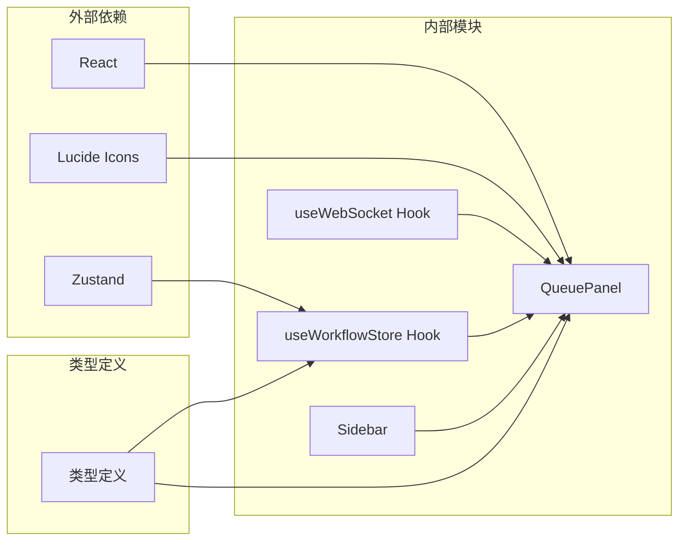

**图表来源**
- [QueuePanel.tsx:1-4](file://client/src/components/QueuePanel.tsx#L1-L4)
- [useWorkflowStore.ts:1-4](file://client/src/hooks/useWorkflowStore.ts#L1-L4)

### 状态管理依赖

组件的状态管理遵循单向数据流原则：

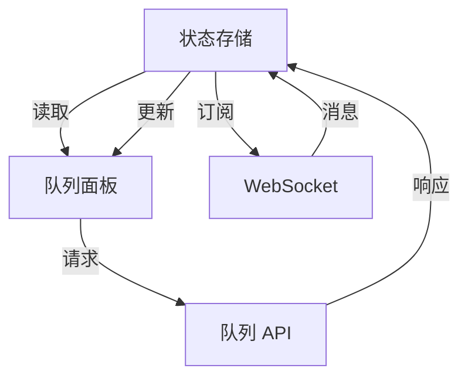

**更新** 新增跨标签页清理状态管理，确保状态一致性。

**图表来源**
- [useWorkflowStore.ts:96-645](file://client/src/hooks/useWorkflowStore.ts#L96-L645)
- [useWebSocket.ts:26-51](file://client/src/hooks/useWebSocket.ts#L26-L51)

**章节来源**
- [QueuePanel.tsx:29-35](file://client/src/components/QueuePanel.tsx#L29-L35)
- [useWorkflowStore.ts:166-195](file://client/src/hooks/useWorkflowStore.ts#L166-L195)

## 性能考虑

### 实时轮询优化

组件采用智能轮询策略，平衡实时性和性能：

| 轮询间隔 | 用途 | 优化策略 |
|---------|------|---------|
| 2秒 | 队列状态查询 | 减少 API 调用频率 |
| 2秒 | 队列数量统计 | 使用轻量级请求 |
| 2秒 | WebSocket 连接维护 | 自动重连机制 |

### 内存管理

组件实现了有效的内存管理策略：

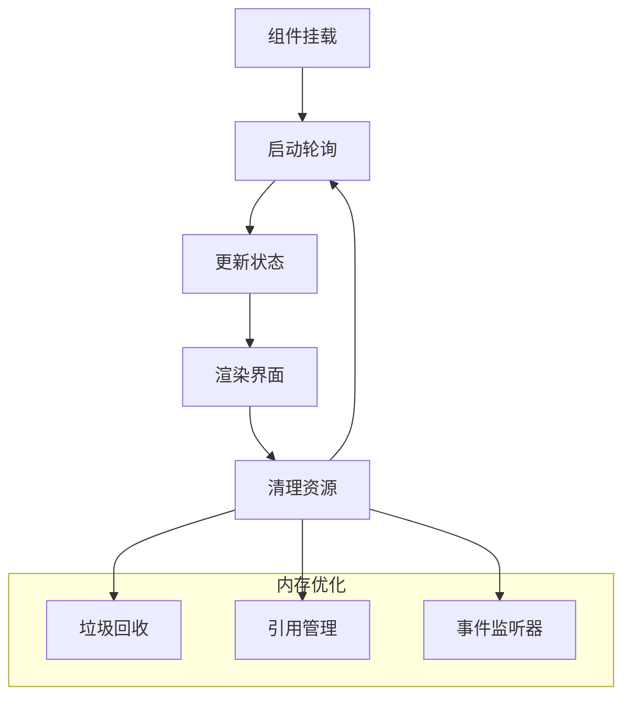

**更新** 新增跨标签页清理的内存管理，确保撤销预览 URL 和清理状态存储。

### 动画性能

组件使用 GPU 加速动画：

| 动画类型 | 性能特性 | 实现方式 |
|---------|---------|---------|
| 缩放动画 | GPU 加速 | transform 属性 |
| 透明度变化 | GPU 加速 | opacity 属性 |
| 进度条动画 | GPU 加速 | width 变化 |
| 脉冲效果 | GPU 加速 | animation 属性 |

**章节来源**
- [global.css:160-171](file://client/src/styles/global.css#L160-L171)
- [global.css:56-59](file://client/src/styles/global.css#L56-L59)

## 故障排除指南

### 常见问题诊断

| 问题症状 | 可能原因 | 解决方案 |
|---------|---------|---------|
| 队列状态不更新 | WebSocket 连接中断 | 检查网络连接，等待自动重连 |
| 进度条不显示 | 任务未开始执行 | 等待任务进入处理状态 |
| 任务无法取消 | API 请求失败 | 检查后端服务状态 |
| UI 卡顿 | 大量任务同时更新 | 优化渲染性能，减少重绘 |
| 删除后状态不一致 | 跨标签页清理失败 | 检查 removeImageByPromptId 实现 |

**更新** 新增删除功能相关的故障排除指南。

### 错误恢复机制

组件具备完善的错误处理和恢复能力：

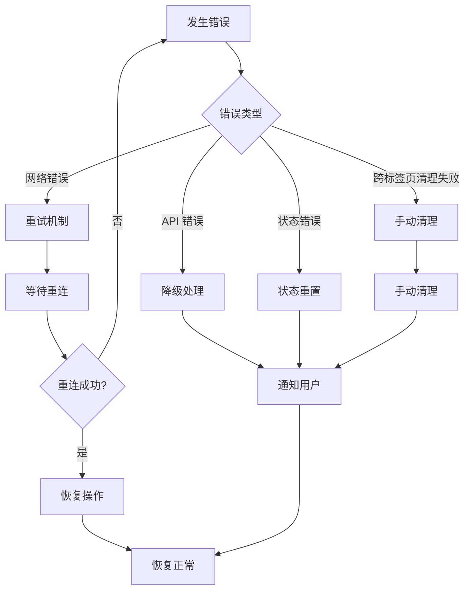

**更新** 新增跨标签页清理失败的错误恢复机制。

**章节来源**
- [useWebSocket.ts:53-65](file://client/src/hooks/useWebSocket.ts#L53-L65)
- [QueuePanel.tsx:78-81](file://client/src/components/QueuePanel.tsx#L78-L81)

## 结论

QueuePanel 队列面板组件是一个功能完整、架构清晰的任务管理组件。它通过以下关键特性为用户提供了优秀的使用体验：

1. **实时性**：基于 WebSocket 的双向通信确保任务状态的实时更新
2. **可靠性**：完善的错误处理和自动重连机制保证系统稳定性
3. **可扩展性**：模块化的架构设计便于功能扩展和维护
4. **性能优化**：智能轮询、GPU 加速动画等技术提升用户体验
5. **用户友好**：直观的交互设计和丰富的视觉反馈

**更新** 新增跨标签页清理功能，确保删除操作能够同步清理前端 UI 状态，提供更完整的状态管理体验。

该组件为 Pix2Real 工作流系统提供了坚实的基础，支持多种工作流场景下的任务管理需求。

## 附录

### 使用示例

#### 基本使用
```typescript
// 在侧边栏中集成队列面板
<Sidebar>
  <QueuePanel onClose={closeQueue} />
</Sidebar>
```

#### 自定义样式
```css
/* 修改队列面板宽度 */
.custom-queue-panel {
  width: 450px !important;
}

/* 修改主题颜色 */
[data-theme="dark"] .custom-queue-panel {
  --color-primary: #00bcd4;
}
```

### 扩展建议

#### 添加任务过滤功能
```typescript
// 可以添加按工作流类型过滤的任务
const filteredTasks = rows.filter(row => 
  row.workflowName === selectedWorkflow
);
```

#### 导出功能
```typescript
// 实现任务状态导出
const exportTasks = () => {
  const exportData = rows.map(row => ({
    promptId: row.promptId,
    status: row.isRunning ? 'running' : 'pending',
    progress: row.progress,
    imageName: row.imageName
  }));
  
  const blob = new Blob([JSON.stringify(exportData)]);
  const url = URL.createObjectURL(blob);
  // 下载文件逻辑...
};
```

#### 与其他组件集成
```typescript
// 与状态栏集成显示队列统计
<StatusBar queueCount={queueCount} />
```

### 跨标签页清理功能详解

**新增** `removeImageByPromptId` 方法提供了完整的跨标签页清理能力：

```typescript
// 跨标签页清理流程
removeImageByPromptId: (promptId) => {
  set((state) => {
    const newTabData = { ...state.tabData };
    for (const [tabKey, tabVal] of Object.entries(newTabData)) {
      if (!tabVal) continue;
      // 查找 imagePromptMap 中匹配 promptId 的 imageId
      const imageId = Object.entries(tabVal.imagePromptMap || {}).find(
        ([, pid]) => pid === promptId
      )?.[0];
      if (imageId) {
        const img = tabVal.images.find((i) => i.id === imageId);
        if (img) URL.revokeObjectURL(img.previewUrl);
        // 清理相关状态
        const { [imageId]: _t, ...restTasks } = tabVal.tasks || {};
        const { [imageId]: _m, ...restMap } = tabVal.imagePromptMap || {};
        const { [imageId]: _s, ...restSelectedOutputIndex } = tabVal.selectedOutputIndex || {};
        const { [imageId]: _b, ...restBackPoseToggles } = tabVal.backPoseToggles || {};
        const { [imageId]: _tc, ...restText2ImgConfigs } = tabVal.text2imgConfigs || {};
        const { [imageId]: _z, ...restZitConfigs } = tabVal.zitConfigs || {};
        const { [imageId]: _fz, ...restFaceSwapZones } = tabVal.faceSwapZones || {};
        const { [imageId]: _p, ...restPrompts } = tabVal.prompts || {};
        newTabData[Number(tabKey)] = {
          ...tabVal,
          images: tabVal.images.filter((i) => i.id !== imageId),
          prompts: restPrompts,
          tasks: restTasks,
          imagePromptMap: restMap,
          selectedOutputIndex: restSelectedOutputIndex,
          backPoseToggles: restBackPoseToggles,
          text2imgConfigs: restText2ImgConfigs,
          zitConfigs: restZitConfigs,
          faceSwapZones: restFaceSwapZones,
        };
        break; // 一个 promptId 只对应一个卡片
      }
    }
    return { tabData: newTabData };
  });
}
```

**章节来源**
- [useWorkflowStore.ts:522-559](file://client/src/hooks/useWorkflowStore.ts#L522-L559)
- [QueuePanel.tsx:119-123](file://client/src/components/QueuePanel.tsx#L119-L123)