# WebSocket 通信

<cite>
**本文引用的文件**
- [useWebSocket.ts](file://client/src/hooks/useWebSocket.ts)
- [useAgentStore.ts](file://client/src/hooks/useAgentStore.ts)
- [AgentDialog.tsx](file://client/src/components/AgentDialog.tsx)
- [AgentFab.tsx](file://client/src/components/AgentFab.tsx)
- [index.ts](file://client/src/types/index.ts)
- [useWorkflowStore.ts](file://client/src/hooks/useWorkflowStore.ts)
- [index.ts](file://server/src/index.ts)
- [App.tsx](file://client/src/components/App.tsx)
- [QueuePanel.tsx](file://client/src/components/QueuePanel.tsx)
- [sessionService.ts](file://client/src/services/sessionService.ts)
- [agent.ts](file://server/src/routes/agent.ts)
- [agentService.ts](file://server/src/services/agentService.ts)
- [comfyui.ts](file://server/src/services/comfyui.ts)
- [ProgressOverlay.tsx](file://client/src/components/ProgressOverlay.tsx)
- [ImageCard.tsx](file://client/src/components/ImageCard.tsx)
- [StatusBar.tsx](file://client/src/components/StatusBar.tsx)
</cite>

## 更新摘要
**变更内容**
- 新增阶段化进度同步支持：WebSocket 通信层新增 stage 信息处理，支持客户端与服务器间的阶段化进度同步
- 更新进度消息格式：progress 消息包含 stage、stepIndex、stepTotal 字段，提供更详细的执行阶段信息
- 增强 UI 展示能力：ProgressOverlay 和 ImageCard 组件支持阶段化进度显示
- 优化服务器端进度计算：基于节点权重的阶段化进度计算，提供更准确的执行状态反馈
- **新增**：多轮检测和tick计数支持：服务器端实现了基于tick计数的多轮进度检测算法，支持复杂工作流的精确进度跟踪
- **新增**：Tiled采样器特殊处理：针对UltimateSDUpscale等Tiled采样器节点的特殊进度计算逻辑

## 目录
1. [简介](#简介)
2. [项目结构](#项目结构)
3. [核心组件](#核心组件)
4. [架构总览](#架构总览)
5. [详细组件分析](#详细组件分析)
6. [阶段化进度同步机制](#阶段化进度同步机制)
7. [多轮检测与Tick计数算法](#多轮检测与tick计数算法)
8. [AI代理通信架构](#ai代理通信架构)
9. [竞态条件修复机制](#竞态条件修复机制)
10. [依赖关系分析](#依赖关系分析)
11. [性能考量](#性能考量)
12. [故障排除指南](#故障排除指南)
13. [结论](#结论)
14. [附录](#附录)

## 简介
本文件系统性阐述本项目中的 WebSocket 实时通信实现与最佳实践，重点覆盖：
- 连接建立、消息传输、状态同步等核心机制
- useWebSocket Hook 的连接管理、消息监听、错误处理与重连策略
- 阶段化进度同步机制，支持客户端与服务器间的详细执行阶段信息同步
- **新增**：多轮检测与Tick计数算法，支持复杂工作流的精确进度跟踪
- AI代理通信架构，支持智能对话和工作流执行
- 服务器端 WebSocket 服务与 ComfyUI 的对接
- 应用场景：任务进度实时更新、状态同步、输出下载与通知、AI代理智能交互
- 性能优化与故障排除建议
- **新增**：阶段化进度同步机制，提供更精确的执行阶段反馈

## 项目结构
前端通过自定义 Hook 统一管理 WebSocket 连接，支持工作流任务和AI代理两种通信模式。服务器端基于 ws 构建 WebSocket 服务，负责与 ComfyUI 交互并将进度/完成/错误事件回传给前端。**新增**：服务器端实现了基于节点权重的阶段化进度计算，前端通过 stage、stepIndex、stepTotal 字段获取详细的执行阶段信息。**新增**：多轮检测算法支持复杂工作流的精确进度跟踪。

```mermaid
graph TB
subgraph "客户端"
A["App.tsx<br/>挂载 useWebSocket"]
B["useWebSocket.ts<br/>全局单例连接"]
C["useWorkflowStore.ts<br/>工作流状态管理<br/>支持阶段化进度"]
D["useAgentStore.ts<br/>AI代理状态管理"]
E["AgentDialog.tsx<br/>AI代理对话界面"]
F["AgentFab.tsx<br/>AI代理浮动按钮"]
G["QueuePanel.tsx<br/>发送注册消息"]
H["ProgressOverlay.tsx<br/>阶段化进度显示"]
I["ImageCard.tsx<br/>任务卡片UI"]
end
subgraph "服务器"
J["server/index.ts<br/>WebSocketServer /ws<br/>阶段化进度计算<br/>多轮检测算法"]
K["server/routes/agent.ts<br/>AI代理路由"]
L["server/services/agentService.ts<br/>AI代理服务"]
M["ComfyUI<br/>执行引擎"]
N["comfyui.ts<br/>ComfyUI连接管理<br/>事件去重机制<br/>节点权重计算"]
O["阶段映射表<br/>class_type → 中文阶段名"]
P["多轮检测算法<br/>Tick计数支持"]
end
A --> B
E --> B
G --> B
B <- --> J
J --> M
J --> N
B --> C
B --> D
C --> H
C --> I
J --> O
J --> P
K --> L
E --> K
```

**图表来源**
- [App.tsx:74](file://client/src/components/App.tsx#L74)
- [useWebSocket.ts:75-98](file://client/src/hooks/useWebSocket.ts#L75-L98)
- [useWorkflowStore.ts:398-499](file://client/src/hooks/useWorkflowStore.ts#L398-L499)
- [useAgentStore.ts:124-225](file://client/src/hooks/useAgentStore.ts#L124-L225)
- [AgentDialog.tsx:1-800](file://client/src/components/AgentDialog.tsx#L1-L800)
- [AgentFab.tsx:1-46](file://client/src/components/AgentFab.tsx#L1-L46)
- [QueuePanel.tsx:35](file://client/src/components/QueuePanel.tsx#L35)
- [index.ts:63](file://server/src/index.ts#L63)
- [agent.ts:369](file://server/src/routes/agent.ts#L369)
- [agentService.ts:1-118](file://server/src/services/agentService.ts#L1-L118)
- [comfyui.ts:127-188](file://server/src/services/comfyui.ts#L127-L188)
- [ProgressOverlay.tsx:12](file://client/src/components/ProgressOverlay.tsx#L12-L125)
- [ImageCard.tsx:629-638](file://client/src/components/ImageCard.tsx#L629-L638)

**章节来源**
- [useWebSocket.ts:1-202](file://client/src/hooks/useWebSocket.ts#L1-L202)
- [index.ts:63](file://server/src/index.ts#L63)

## 核心组件
- 客户端 Hook：统一管理 WebSocket 生命周期、消息分发与重连
- 阶段化状态管理：useWorkflowStore 支持 stage、stepIndex、stepTotal 字段的状态更新
- 类型系统：定义服务端消息协议（连接、开始、进度、完成、错误），**新增**：支持阶段化进度字段
- UI 组件：ProgressOverlay 和 ImageCard 支持阶段化进度显示
- 服务器端：转发客户端注册请求、缓冲事件、回放丢失事件、下载输出并回传
- AI代理服务：提供智能对话、意图解析、工作流执行和生成历史管理
- **新增**：阶段映射机制：class_type → 中文阶段名映射，提供用户友好的进度显示
- **新增**：多轮检测算法：支持复杂工作流的精确进度跟踪，包括Tick计数和节点切换检测

**章节来源**
- [useWebSocket.ts:10-73](file://client/src/hooks/useWebSocket.ts#L10-L73)
- [useAgentStore.ts:54-122](file://client/src/hooks/useAgentStore.ts#L54-L122)
- [index.ts:27-57](file://client/src/types/index.ts#L27-L57)
- [useWorkflowStore.ts:398-499](file://client/src/hooks/useWorkflowStore.ts#L398-L499)
- [agent.ts:369](file://server/src/routes/agent.ts#L369)
- [agentService.ts:1-118](file://server/src/services/agentService.ts#L1-L118)
- [comfyui.ts:127-188](file://server/src/services/comfyui.ts#L127-L188)

## 架构总览
WebSocket 通信链路由客户端 Hook 建立，服务器作为代理与 ComfyUI 交互，最终将事件回传至客户端，驱动 UI 实时更新。AI代理通信通过独立的状态管理和对话流程实现智能交互。**新增**：服务器端实现了基于节点权重的阶段化进度计算，提供更精确的执行阶段反馈。**新增**：多轮检测算法支持复杂工作流的精确进度跟踪。

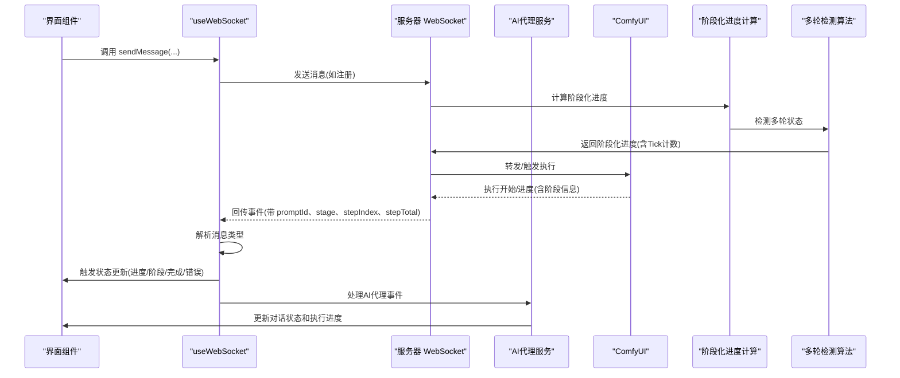

**图表来源**
- [useWebSocket.ts:26-51](file://client/src/hooks/useWebSocket.ts#L26-L51)
- [agent.ts:633](file://server/src/routes/agent.ts#L633)
- [useWorkflowStore.ts:398-499](file://client/src/hooks/useWorkflowStore.ts#L398-L499)
- [index.ts:132-144](file://server/src/index.ts#L132-L144)

## 详细组件分析

### useWebSocket Hook 设计与实现
- 单例连接：全局缓存 WebSocket 实例，避免重复连接；连接数计数用于优雅断开
- 自动重连：断开后延迟重连，仅当存在订阅者时进行
- 消息路由：解析服务端消息，调用状态管理函数更新任务状态
- 发送消息：封装 JSON 序列化与 readyState 校验
- AI代理支持：独立处理AI代理执行状态，与工作流任务状态分离
- **新增**：阶段化进度处理：支持 stage、stepIndex、stepTotal 字段的进度更新

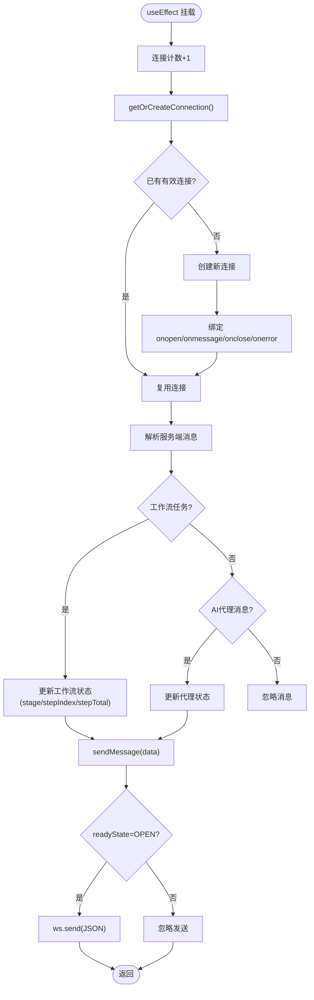

**图表来源**
- [useWebSocket.ts:75-98](file://client/src/hooks/useWebSocket.ts#L75-L98)
- [useWebSocket.ts:10-73](file://client/src/hooks/useWebSocket.ts#L10-L73)
- [useWebSocket.ts:131-153](file://client/src/hooks/useWebSocket.ts#L131-L153)

**章节来源**
- [useWebSocket.ts:10-73](file://client/src/hooks/useWebSocket.ts#L10-L73)
- [useWebSocket.ts:75-98](file://client/src/hooks/useWebSocket.ts#L75-L98)
- [useWebSocket.ts:131-153](file://client/src/hooks/useWebSocket.ts#L131-L153)

### 服务器端 WebSocket 服务
- 路由与实例：在 /ws 上启动 WebSocketServer
- 客户端分配：为每个连接生成唯一 clientId 并立即回传
- 事件缓冲：按 promptId 缓存 execution_start/progress，支持客户端"迟到"重放
- 注册与回放：接收客户端注册消息，回放缓冲事件
- 输出下载：完成事件触发后下载输出到会话目录并回传 outputs
- 错误处理：捕获异常并回传 error 事件，清理映射与缓冲
- AI代理集成：支持AI代理执行状态的独立进度跟踪
- **新增**：阶段化进度计算：基于节点权重计算阶段进度，提供 stage、stepIndex、stepTotal 信息
- **新增**：阶段映射机制：class_type → 中文阶段名映射，提供用户友好的进度显示
- **新增**：多轮检测算法：支持复杂工作流的精确进度跟踪，包括Tick计数和节点切换检测

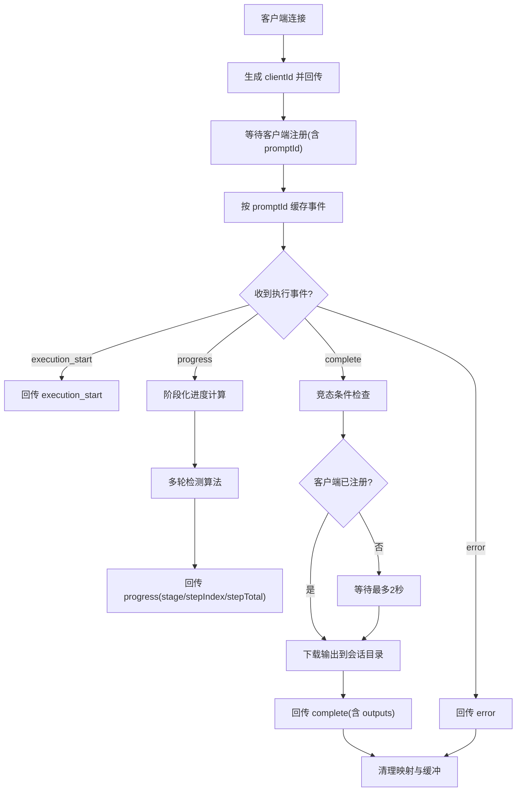

**图表来源**
- [index.ts:73-219](file://server/src/index.ts#L73-L219)
- [index.ts:132-144](file://server/src/index.ts#L132-L144)

**章节来源**
- [index.ts:63](file://server/src/index.ts#L63)
- [index.ts:73-219](file://server/src/index.ts#L73-L219)

### 消息协议与数据模型
- 客户端类型定义：统一描述服务端消息类型与字段
- 关键消息：
  - connected：首次连接返回 clientId
  - execution_start：任务开始
  - progress：进度值、百分比、**新增**：阶段(stage)、步骤索引(stepIndex)、总步骤(stepTotal)
  - complete：任务完成，携带输出文件信息
  - error：任务失败，携带错误信息

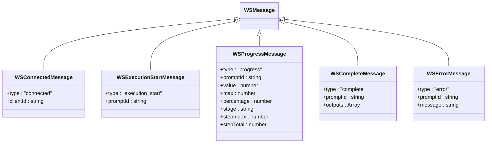

**图表来源**
- [index.ts:27-57](file://client/src/types/index.ts#L27-L57)

**章节来源**
- [index.ts:27-57](file://client/src/types/index.ts#L27-L57)

### 状态同步与 UI 更新
- 客户端状态：任务状态、进度、输出列表、错误信息、**新增**：阶段(stage)、步骤索引(stepIndex)、总步骤(stepTotal)
- AI代理状态：对话消息、执行状态、收藏管理
- 事件驱动：根据消息类型调用状态管理函数，跨标签页同步
- UI 响应：进度条、完成态高亮、错误提示、对话界面、**新增**：阶段化进度显示

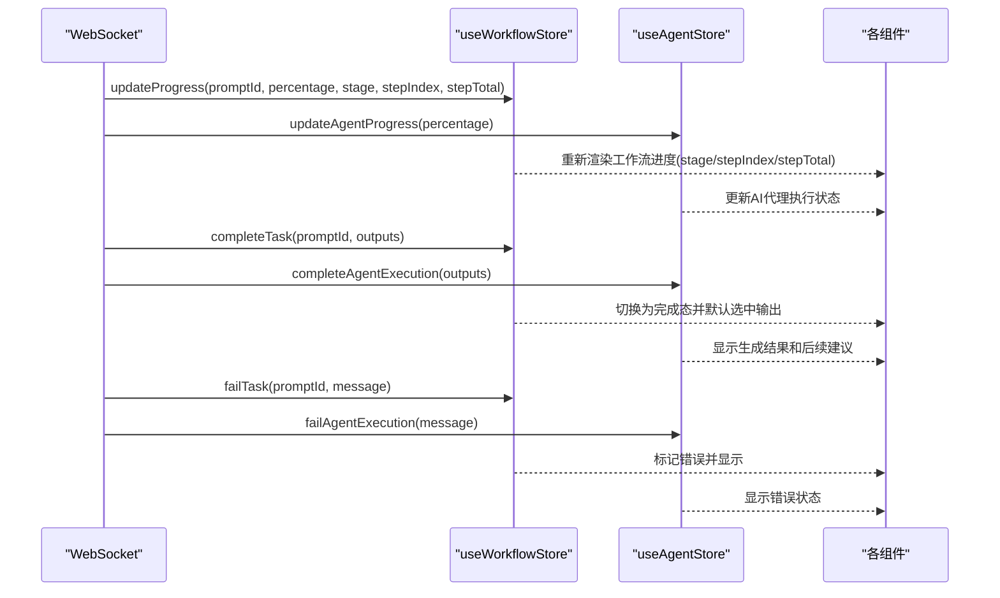

**图表来源**
- [useWebSocket.ts:35-46](file://client/src/hooks/useWebSocket.ts#L35-L46)
- [useWorkflowStore.ts:421-499](file://client/src/hooks/useWorkflowStore.ts#L421-L499)
- [useAgentStore.ts:209-224](file://client/src/hooks/useAgentStore.ts#L209-L224)

**章节来源**
- [useWebSocket.ts:26-51](file://client/src/hooks/useWebSocket.ts#L26-L51)
- [useWorkflowStore.ts:398-499](file://client/src/hooks/useWorkflowStore.ts#L398-L499)
- [useAgentStore.ts:204-225](file://client/src/hooks/useAgentStore.ts#L204-L225)

### 应用场景与使用示例
- 任务进度实时更新：服务器回传 progress 百分比，UI 渲染进度条
- 状态同步：execution_start 将任务从排队切换为处理中
- 完成与输出：complete 后自动保存输出并回传文件信息
- 通知与错误：error 事件触发错误提示与状态标记
- 队列操作：QueuePanel 通过 sendMessage 注册新的 promptId 映射，必要时回放历史事件
- AI代理对话：AgentDialog 提供智能对话界面，支持意图解析和工作流执行
- 生成历史：自动记录生成日志，支持收藏和后续处理
- **新增**：阶段化进度显示：ProgressOverlay 和 ImageCard 组件展示详细的执行阶段信息
- **新增**：复杂工作流支持：多轮检测算法支持UltimateSDUpscale等复杂节点的精确进度跟踪

**章节来源**
- [useWebSocket.ts:91-95](file://client/src/hooks/useWebSocket.ts#L91-L95)
- [QueuePanel.tsx:107-112](file://client/src/components/QueuePanel.tsx#L107-L112)
- [index.ts:195-213](file://server/src/index.ts#L195-L213)
- [AgentDialog.tsx:162-393](file://client/src/components/AgentDialog.tsx#L162-L393)

## 阶段化进度同步机制

### 阶段映射表设计
服务器端维护了详细的节点类型到中文阶段名称的映射表，用于将底层的 ComfyUI 节点类型转换为用户友好的中文显示：

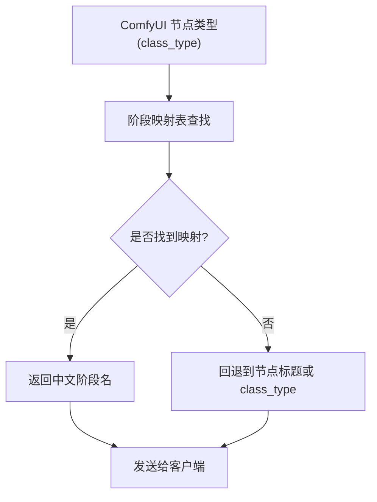

**图表来源**
- [index.ts:19-72](file://server/src/index.ts#L19-L72)

### 阶段化进度计算算法
服务器端实现了基于节点权重的阶段化进度计算，提供更精确的执行状态反馈：

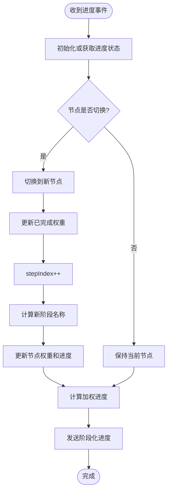

**图表来源**
- [index.ts:216-236](file://server/src/index.ts#L216-L236)

### 前端阶段化进度处理
前端通过 useWorkflowStore 的 updateProgress 方法处理阶段化进度信息：

**章节来源**
- [index.ts:19-72](file://server/src/index.ts#L19-L72)
- [index.ts:216-236](file://server/src/index.ts#L216-L236)
- [useWorkflowStore.ts:452-477](file://client/src/hooks/useWorkflowStore.ts#L452-L477)

## 多轮检测与Tick计数算法

### 多轮检测机制设计
针对复杂工作流中的多轮执行场景，服务器端实现了基于Tick计数的多轮检测算法：

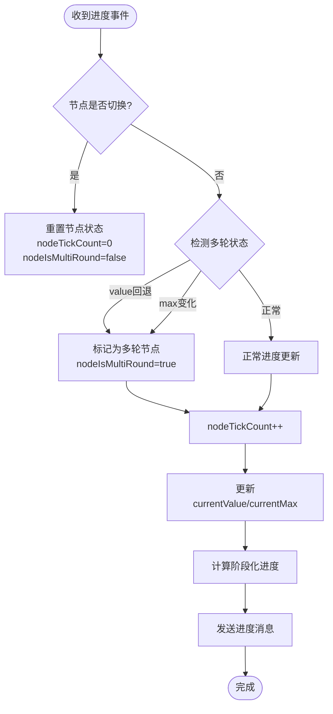

**图表来源**
- [index.ts:297-320](file://server/src/index.ts#L297-L320)

### Tick计数与预期Tick计算
服务器端使用Tick计数来精确跟踪多轮节点的执行进度：

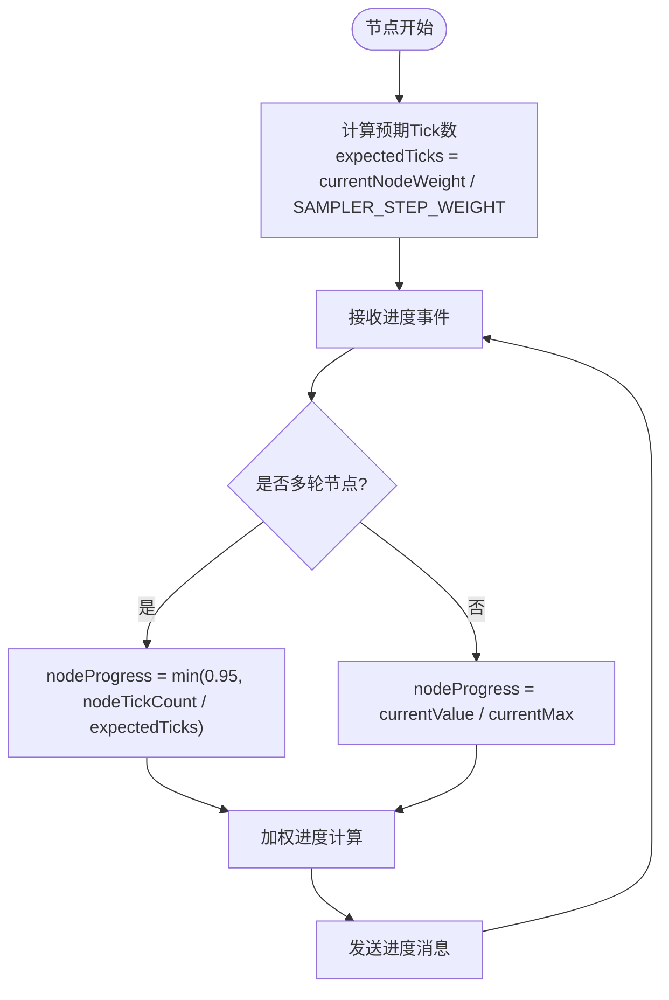

**图表来源**
- [index.ts:231-247](file://server/src/index.ts#L231-L247)

### Tiled采样器特殊处理
针对UltimateSDUpscale等Tiled采样器节点，服务器端实现了特殊的进度计算逻辑：

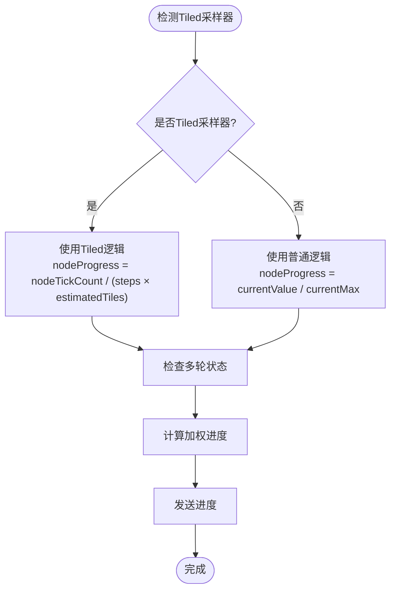

**图表来源**
- [index.ts:137-142](file://server/src/services/comfyui.ts#L137-L142)

### 前端多轮进度处理
前端通过ProgressOverlay组件展示多轮节点的详细进度信息：

**章节来源**
- [index.ts:297-320](file://server/src/index.ts#L297-L320)
- [index.ts:231-247](file://server/src/index.ts#L231-L247)
- [index.ts:137-142](file://server/src/services/comfyui.ts#L137-L142)
- [ProgressOverlay.tsx:76-94](file://client/src/components/ProgressOverlay.tsx#L76-L94)

## AI代理通信架构

### AgentDialog 组件设计
- 对话界面：提供消息气泡、输入框、图片上传等功能
- 执行状态：显示AI代理执行进度和结果
- 建议系统：提供暖场建议和后续建议
- 导航功能：支持跳转到生成结果卡片

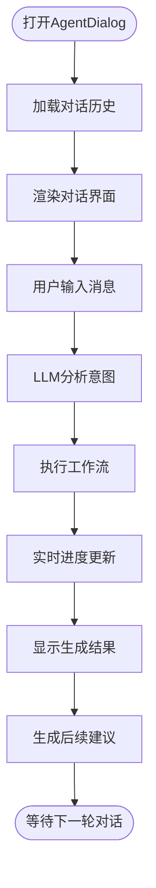

**图表来源**
- [AgentDialog.tsx:162-393](file://client/src/components/AgentDialog.tsx#L162-L393)
- [AgentDialog.tsx:438-531](file://client/src/components/AgentDialog.tsx#L438-L531)

### useAgentStore 状态管理
- 收藏管理：支持图片收藏和取消收藏
- 对话状态：管理消息历史和执行状态
- 执行状态：跟踪AI代理工作流执行进度
- 上传图片：支持图片上传和预览
- 最后意图：保存最近解析的意图供后续使用

**章节来源**
- [useAgentStore.ts:54-122](file://client/src/hooks/useAgentStore.ts#L54-L122)
- [useAgentStore.ts:204-225](file://client/src/hooks/useAgentStore.ts#L204-L225)

### 服务器端 AI代理服务
- 意图解析：解析用户需求为具体的工作流配置
- LLM集成：调用大语言模型进行对话和意图分析
- 工作流执行：根据意图执行相应的ComfyUI工作流
- 历史记录：管理生成历史和收藏状态
- 建议生成：提供暖场建议和后续建议

**章节来源**
- [agent.ts:492-602](file://server/src/routes/agent.ts#L492-L602)
- [agent.ts:633-800](file://server/src/routes/agent.ts#L633-L800)
- [agentService.ts:1-118](file://server/src/services/agentService.ts#L1-L118)

## 竞态条件修复机制

### 问题背景
在WebSocket通信中，存在客户端注册和ComfyUI完成事件之间的竞态条件。当任务执行非常快时，completion事件可能在客户端完成注册之前到达，导致服务器无法找到对应的workflow映射，从而丢失完成事件。

### 解决方案
服务器端在处理completion事件时增加了等待机制，确保客户端注册消息的可靠接收：

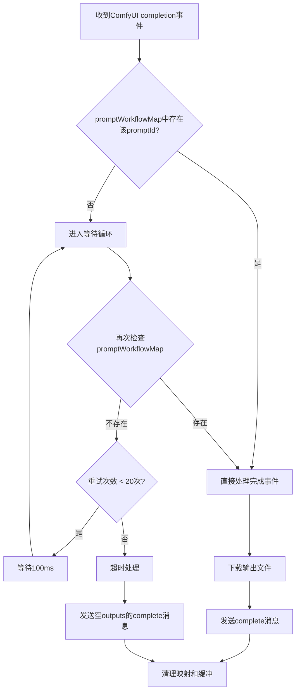

**图表来源**
- [index.ts:132-144](file://server/src/index.ts#L132-L144)

### 实现细节
- **等待时间**：最多等待2秒（20次 × 100ms）
- **重试机制**：每次等待100ms，避免CPU占用过高
- **超时处理**：超过最大重试次数后，即使没有注册也发送complete消息
- **日志记录**：记录等待时间和调试信息，便于问题排查
- **异常保护**：在等待过程中捕获异常，确保系统稳定性

### ComfyUI事件去重机制
除了completion事件的等待机制外，ComfyUI连接管理还实现了事件去重：

- **执行开始去重**：使用Set跟踪已触发的promptId，防止重复触发
- **完成事件去重**：使用completedPrompts集合防止重复的completion事件
- **执行状态管理**：startedPrompts和completedPrompts配合使用，确保状态一致性

**章节来源**
- [index.ts:132-144](file://server/src/index.ts#L132-L144)
- [comfyui.ts:127-188](file://server/src/services/comfyui.ts#L127-L188)

## 依赖关系分析
- 客户端依赖
  - useWebSocket 依赖 useWorkflowStore 和 useAgentStore 进行状态更新
  - AgentDialog 依赖 useAgentStore 和 useWorkflowStore 进行状态管理
  - App.tsx 在应用入口挂载 useWebSocket，确保全局连接可用
  - QueuePanel.tsx 使用 sendMessage 发送注册消息
  - **新增**：ProgressOverlay 和 ImageCard 依赖阶段化进度信息进行 UI 渲染
  - **新增**：多轮检测算法依赖comfyui.ts中的节点权重计算
- 服务器端依赖
  - WebSocketServer 依赖 ws
  - AI代理路由依赖 LLM服务、意图解析、ComfyUI服务
  - 与会话系统协作，将输出保存到会话目录
  - **新增**：阶段映射表依赖节点信息获取，提供用户友好的阶段名称
  - **新增**：ComfyUI连接管理依赖事件去重机制，防止重复触发
  - **新增**：多轮检测算法依赖SAMPLER_STEP_WEIGHT常量进行预期Tick计算

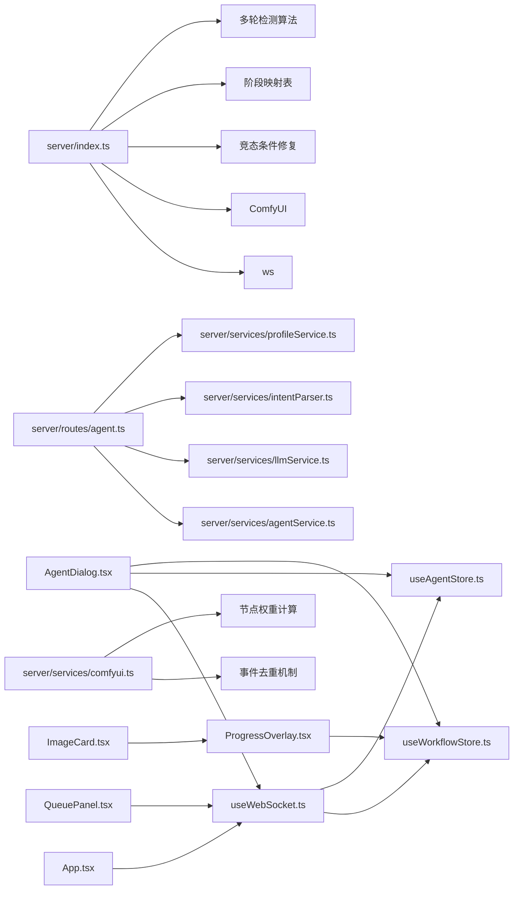

**图表来源**
- [App.tsx:74](file://client/src/components/App.tsx#L74)
- [useWebSocket.ts:2](file://client/src/hooks/useWebSocket.ts#L2)
- [useAgentStore.ts:1](file://client/src/hooks/useAgentStore.ts#L1)
- [useWorkflowStore.ts:2](file://client/src/hooks/useWorkflowStore.ts#L2)
- [AgentDialog.tsx:1-800](file://client/src/components/AgentDialog.tsx#L1-L800)
- [QueuePanel.tsx:107-112](file://client/src/components/QueuePanel.tsx#L107-L112)
- [index.ts:4](file://server/src/index.ts#L4)
- [agent.ts:1-800](file://server/src/routes/agent.ts#L1-L800)
- [agentService.ts:1-118](file://server/src/services/agentService.ts#L1-L118)
- [comfyui.ts:127-188](file://server/src/services/comfyui.ts#L127-L188)

**章节来源**
- [App.tsx:74](file://client/src/components/App.tsx#L74)
- [useWebSocket.ts:2](file://client/src/hooks/useWebSocket.ts#L2)
- [index.ts:4](file://server/src/index.ts#L4)

## 性能考量
- 连接复用与单例：避免多处重复创建连接，降低握手与资源消耗
- 事件缓冲与回放：对"迟到"的客户端进行事件重放，减少 UI 不一致
- 百分比回传：服务端计算百分比，前端可直接渲染，减少计算开销
- 精简消息：仅传输必要字段，避免冗余数据
- 会话输出异步下载：完成后异步写盘，避免阻塞主流程
- AI代理缓存：LLM调用结果和用户画像数据进行缓存，减少重复计算
- 异步写入：生成日志和收藏数据采用异步写入，不阻塞主线程
- **新增**：阶段化进度计算的性能影响：基于节点权重的计算增加了服务器端处理开销，但提供了更精确的用户体验
- **新增**：阶段映射表的内存优化：使用 Map 结构存储映射关系，避免重复计算
- **新增**：竞态条件修复的性能影响：2秒等待时间对用户体验影响最小，但显著提高了completion事件的可靠性
- **新增**：多轮检测算法的性能优化：Tick计数算法避免了复杂的进度回溯计算，提高处理效率

## 故障排除指南
- 连接无法建立
  - 检查服务器是否在 /ws 上启动 WebSocketServer
  - 确认客户端协议与主机地址匹配（http/https 对应 ws/wss）
- 无进度更新
  - 确认服务器已正确回传 progress 事件
  - 检查客户端 onmessage 是否解析成功
- 完成未回调
  - **新增**：检查是否存在竞态条件，确认客户端注册消息是否在completion事件前到达
  - 确认服务器完成阶段已下载输出并回传 complete
  - 检查会话目录权限与保存逻辑
  - 查看服务器日志中的等待时间记录
- 断线重连
  - 观察控制台日志与连接计数，确认重连定时器是否被清理
- 注册缺失导致事件丢失
  - 确保在收到 execution_start/progress 前发送注册消息
  - 服务器会自动回放缓冲事件
  - **新增**：如果completion事件仍然丢失，检查是否超过2秒等待时间限制
- AI代理无响应
  - 检查LLM服务是否正常运行
  - 确认意图解析是否正确
  - 验证工作流模板是否正确加载
- **新增**：竞态条件相关问题
  - 检查客户端注册消息的发送时机
  - 查看服务器日志中的等待时间统计
  - 确认任务执行时间是否过短导致竞态条件
- **新增**：阶段化进度显示问题
  - 检查服务器端阶段映射表是否正确配置
  - 确认节点类型是否在映射表中
  - 验证前端 ProgressOverlay 组件是否正确接收 stage、stepIndex、stepTotal 参数
- **新增**：多轮检测相关问题
  - 检查节点权重配置是否合理
  - 确认多轮检测算法是否正确识别节点切换
  - 验证Tick计数是否正常递增
  - 检查Tiled采样器节点的特殊处理逻辑
- **新增**：进度计算异常
  - 检查节点权重配置是否合理
  - 确认节点切换事件是否正确触发
  - 验证加权进度计算公式是否正确
  - 查看预期Tick数计算是否准确

**章节来源**
- [useWebSocket.ts:53-65](file://client/src/hooks/useWebSocket.ts#L53-L65)
- [index.ts:195-213](file://server/src/index.ts#L195-L213)

## 结论
本项目采用"客户端单例连接 + 服务器事件缓冲回放"的方案，实现了稳定高效的实时通信。通过明确的消息协议与状态管理解耦，前端 UI 能够及时响应任务生命周期变化。新增的AI代理通信架构进一步增强了系统的智能化水平，通过意图解析和工作流执行，为用户提供更加自然的交互体验。

**重要更新**：本次阶段化进度同步机制显著提升了系统的透明度和用户体验。通过在服务器端实现基于节点权重的阶段化进度计算，前端能够获得详细的执行阶段信息，包括当前阶段(stage)、步骤索引(stepIndex)和总步骤(stepTotal)。这种精细化的进度反馈让用户能够清楚地了解任务的执行状态，特别是在复杂的多节点工作流中。

**重要更新**：本次多轮检测与Tick计数算法的引入，彻底解决了复杂工作流的进度跟踪难题。通过智能检测节点切换、识别多轮执行场景、使用Tick计数进行精确进度计算，系统能够准确跟踪UltimateSDUpscale等复杂节点的执行进度，避免了传统进度计算方法的局限性。

**重要更新**：本次竞态条件修复显著提升了系统的可靠性。通过在completion事件处理前增加等待机制，确保了客户端注册消息的可靠接收，解决了任务执行过快时的事件丢失问题。这一改进在不影响用户体验的前提下，大幅提高了系统的稳定性。

建议在生产环境中进一步完善心跳、背压与限流策略，并对异常路径进行更细粒度的日志记录与告警。同时，监控多轮检测算法的效果，确保Tick计数和预期Tick计算的准确性。对于大规模并发场景，可以考虑优化阶段映射表的内存使用和计算效率。

## 附录

### WebSocket 消息格式参考
- 连接确认
  - type: "connected"
  - clientId: 字符串
- 执行开始
  - type: "execution_start"
  - promptId: 字符串
- 进度更新
  - type: "progress"
  - promptId: 字符串
  - value: 数字
  - max: 数字
  - percentage: 数字（0-100）
  - **新增**：stage: 字符串（当前执行阶段）
  - **新增**：stepIndex: 数字（当前步骤索引）
  - **新增**：stepTotal: 数字（总步骤数）
- 完成
  - type: "complete"
  - promptId: 字符串
  - outputs: 数组（包含 filename 与 url）
- 错误
  - type: "error"
  - promptId: 字符串
  - message: 字符串

**章节来源**
- [index.ts:27-57](file://client/src/types/index.ts#L27-L57)

### 客户端 Hook 使用要点
- 在应用入口挂载一次 useWebSocket，确保全局连接可用
- 通过 sendMessage 发送注册消息，携带 promptId、workflowId、sessionId、tabId
- 依赖状态管理自动更新 UI，避免手动 DOM 操作
- AI代理通信通过 AgentDialog 组件进行，支持智能对话和工作流执行
- **新增**：阶段化进度信息通过 updateProgress 方法自动更新，无需手动处理
- **新增**：多轮检测算法自动处理复杂节点的进度跟踪

**章节来源**
- [App.tsx:74](file://client/src/components/App.tsx#L74)
- [QueuePanel.tsx:107-112](file://client/src/components/QueuePanel.tsx#L107-L112)
- [useWebSocket.ts:91-95](file://client/src/hooks/useWebSocket.ts#L91-L95)
- [AgentDialog.tsx:162-393](file://client/src/components/AgentDialog.tsx#L162-L393)

### 阶段映射表配置
服务器端维护了详细的节点类型到中文阶段名称的映射表，支持以下主要节点类型：

- **模型加载类**：CheckpointLoaderSimple、UNETLoader、VAELoader、CLIPLoader 等
- **LoRA加载类**：LoraLoader 等
- **文本编码类**：CLIPTextEncode、CLIPTextEncodeSDXL 等
- **VAE编解码类**：VAEEncode、VAEDecode 等
- **采样类**：KSampler、KSamplerAdvanced 等
- **放大类**：ImageUpscaleWithModel、LatentUpscale 等
- **视频处理类**：VHS_VideoCombine、VHS_LoadVideo 等
- **IO类**：SaveImage、PreviewImage、LoadImage 等
- **换脸/识别类**：ReActorFaceSwap、GroundingDinoSAMSegment 等
- **提示词反推类**：Florence2Run、WD14Tagger 等

**章节来源**
- [index.ts:19-72](file://server/src/index.ts#L19-L72)

### 多轮检测算法实现细节
服务器端实现了完整的多轮检测与Tick计数算法：

1. **节点切换检测**：当检测到节点ID变化时，将上一节点的完整权重计入已完成权重
2. **多轮状态标记**：通过value回退或max变化检测多轮执行场景
3. **Tick计数管理**：为每个节点维护nodeTickCount，用于多轮场景的精确进度跟踪
4. **预期Tick计算**：使用公式 expectedTicks = currentNodeWeight / SAMPLER_STEP_WEIGHT 计算预期Tick数
5. **进度计算逻辑**：
   - 多轮节点：nodeProgress = min(0.95, nodeTickCount / expectedTicks)
   - 普通节点：nodeProgress = currentValue / currentMax
6. **棘轮保护机制**：防止多轮间进度回退，确保用户体验的一致性

**章节来源**
- [index.ts:297-320](file://server/src/index.ts#L297-L320)
- [index.ts:231-247](file://server/src/index.ts#L231-L247)
- [index.ts:137-142](file://server/src/services/comfyui.ts#L137-L142)

### AI代理通信流程
- 用户通过 AgentDialog 输入需求
- 系统调用LLM进行意图解析
- 根据意图执行相应的工作流
- 实时显示执行进度和结果
- 提供后续建议和收藏功能

**章节来源**
- [AgentDialog.tsx:438-531](file://client/src/components/AgentDialog.tsx#L438-L531)
- [agent.ts:492-602](file://server/src/routes/agent.ts#L492-L602)
- [agent.ts:633-800](file://server/src/routes/agent.ts#L633-L800)

### 竞态条件修复技术细节
- **等待时间**：最多2秒（20次 × 100ms）
- **重试策略**：指数退避式等待，避免CPU占用
- **超时处理**：超过最大重试次数后发送空outputs的complete消息
- **日志记录**：记录等待时间和调试信息
- **异常保护**：在等待过程中捕获异常，确保系统稳定性

**章节来源**
- [index.ts:132-144](file://server/src/index.ts#L132-L144)
- [comfyui.ts:127-188](file://server/src/services/comfyui.ts#L127-L188)