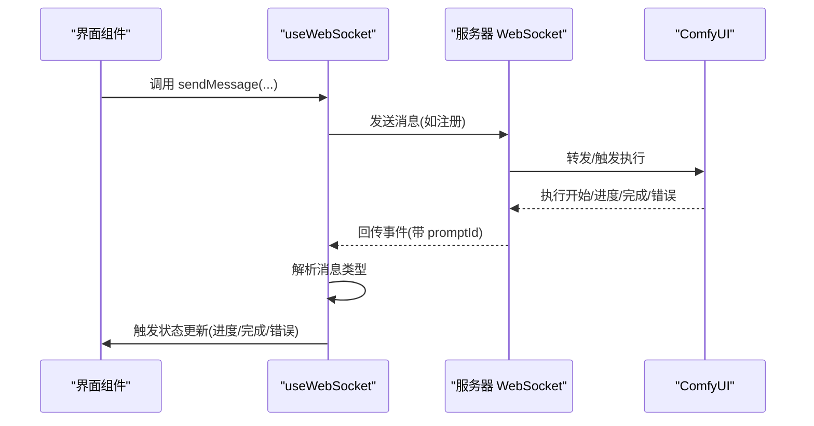
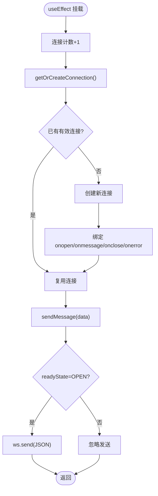
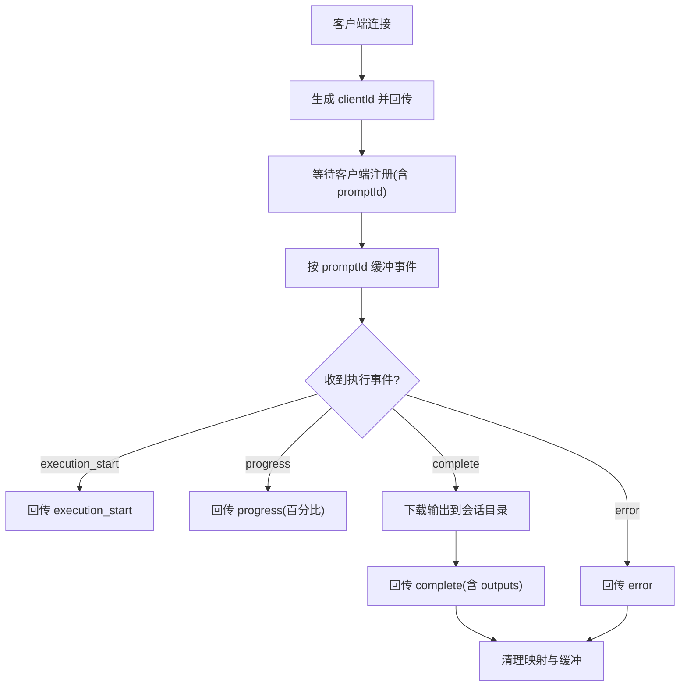
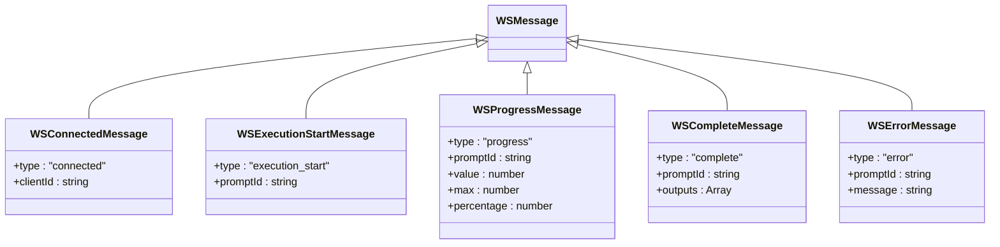
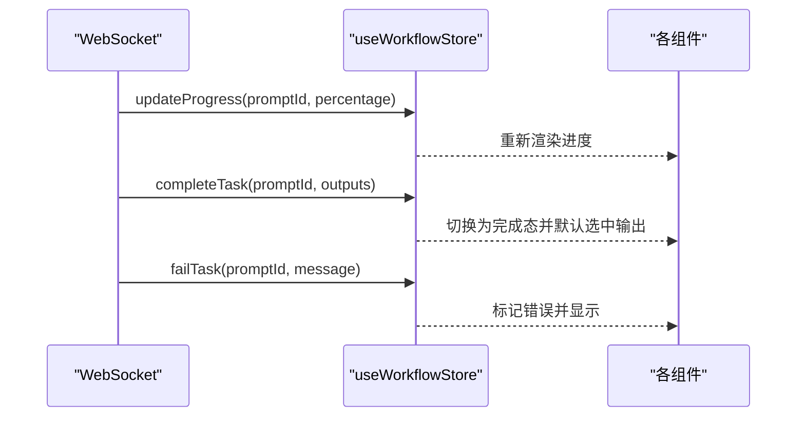
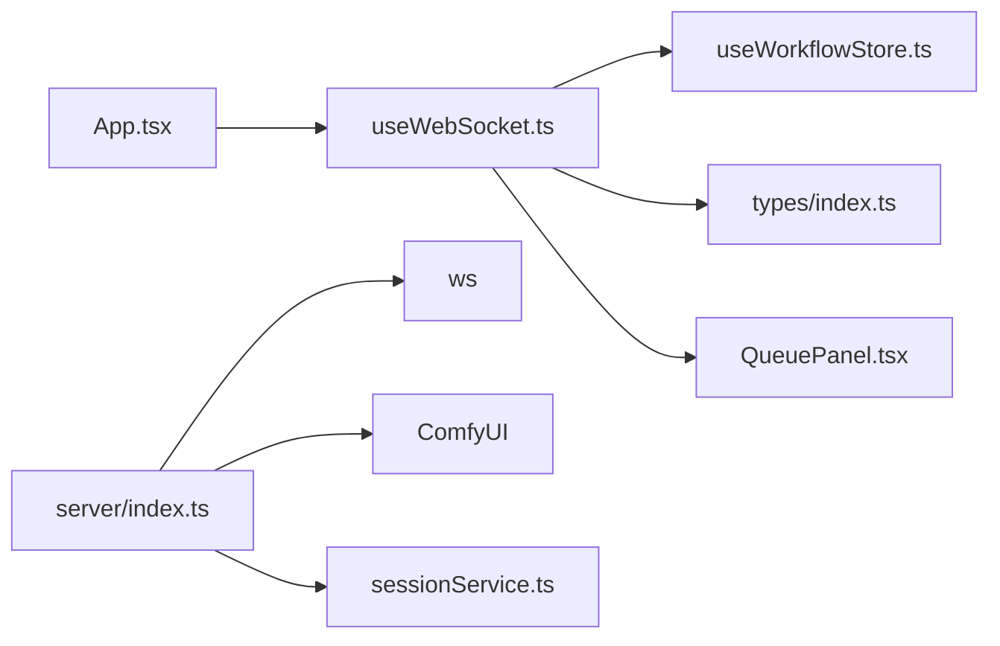

# WebSocket 通信

<cite>
**本文引用的文件**
- [useWebSocket.ts](file://client/src/hooks/useWebSocket.ts)
- [index.ts](file://client/src/types/index.ts)
- [useWorkflowStore.ts](file://client/src/hooks/useWorkflowStore.ts)
- [index.ts](file://server/src/index.ts)
- [App.tsx](file://client/src/components/App.tsx)
- [QueuePanel.tsx](file://client/src/components/QueuePanel.tsx)
- [sessionService.ts](file://client/src/services/sessionService.ts)
</cite>

## 目录
1. [简介](#简介)
2. [项目结构](#项目结构)
3. [核心组件](#核心组件)
4. [架构总览](#架构总览)
5. [详细组件分析](#详细组件分析)
6. [依赖关系分析](#依赖关系分析)
7. [性能考量](#性能考量)
8. [故障排除指南](#故障排除指南)
9. [结论](#结论)
10. [附录](#附录)

## 简介
本文件系统性阐述本项目中的 WebSocket 实时通信实现与最佳实践，重点覆盖：
- 连接建立、消息传输、状态同步等核心机制
- useWebSocket Hook 的连接管理、消息监听、错误处理与重连策略
- 服务器端 WebSocket 服务与 ComfyUI 的对接
- 应用场景：任务进度实时更新、状态同步、输出下载与通知
- 性能优化与故障排除建议

## 项目结构
前端通过自定义 Hook 统一管理 WebSocket 连接，服务器端基于 ws 构建 WebSocket 服务，负责与 ComfyUI 交互并将进度/完成/错误事件回传给前端。

```mermaid
graph TB
subgraph "客户端"
A["App.tsx<br/>挂载 useWebSocket"]
B["useWebSocket.ts<br/>全局单例连接"]
C["useWorkflowStore.ts<br/>状态管理"]
D["QueuePanel.tsx<br/>发送注册消息"]
end
subgraph "服务器"
E["server/index.ts<br/>WebSocketServer /ws"]
F["ComfyUI<br/>执行引擎"]
end
A --> B
D --> B
B <- --> E
E --> F
B --> C
```

图表来源
- [App.tsx:74](file://client/src/components/App.tsx#L74)
- [useWebSocket.ts:75-98](file://client/src/hooks/useWebSocket.ts#L75-L98)
- [useWorkflowStore.ts:398-499](file://client/src/hooks/useWorkflowStore.ts#L398-L499)
- [QueuePanel.tsx:35](file://client/src/components/QueuePanel.tsx#L35)
- [index.ts:63](file://server/src/index.ts#L63)

章节来源
- [useWebSocket.ts:1-99](file://client/src/hooks/useWebSocket.ts#L1-L99)
- [index.ts:63](file://server/src/index.ts#L63)

## 核心组件
- 客户端 Hook：统一管理 WebSocket 生命周期、消息分发与重连
- 类型系统：定义服务端消息协议（连接、开始、进度、完成、错误）
- 状态管理：将 WebSocket 事件映射为 UI 状态变更
- 服务器端：转发客户端注册请求、缓冲事件、回放丢失事件、下载输出并回传

章节来源
- [useWebSocket.ts:10-73](file://client/src/hooks/useWebSocket.ts#L10-L73)
- [index.ts:27-57](file://client/src/types/index.ts#L27-L57)
- [useWorkflowStore.ts:398-499](file://client/src/hooks/useWorkflowStore.ts#L398-L499)
- [index.ts:73-219](file://server/src/index.ts#L73-L219)

## 架构总览
WebSocket 通信链路由客户端 Hook 建立，服务器作为代理与 ComfyUI 交互，最终将事件回传至客户端，驱动 UI 实时更新。



图表来源
- [useWebSocket.ts:26-51](file://client/src/hooks/useWebSocket.ts#L26-L51)
- [index.ts:94-188](file://server/src/index.ts#L94-L188)
- [useWorkflowStore.ts:398-499](file://client/src/hooks/useWorkflowStore.ts#L398-L499)

## 详细组件分析

### useWebSocket Hook 设计与实现
- 单例连接：全局缓存 WebSocket 实例，避免重复连接；连接数计数用于优雅断开
- 自动重连：断开后延迟重连，仅当存在订阅者时进行
- 消息路由：解析服务端消息，调用状态管理函数更新任务状态
- 发送消息：封装 JSON 序列化与 readyState 校验



图表来源
- [useWebSocket.ts:75-98](file://client/src/hooks/useWebSocket.ts#L75-L98)
- [useWebSocket.ts:10-73](file://client/src/hooks/useWebSocket.ts#L10-L73)

章节来源
- [useWebSocket.ts:10-73](file://client/src/hooks/useWebSocket.ts#L10-L73)
- [useWebSocket.ts:75-98](file://client/src/hooks/useWebSocket.ts#L75-L98)

### 服务器端 WebSocket 服务
- 路由与实例：在 /ws 上启动 WebSocketServer
- 客户端分配：为每个连接生成唯一 clientId 并立即回传
- 事件缓冲：按 promptId 缓存 execution_start/progress，支持客户端“迟到”重放
- 注册与回放：接收客户端注册消息，回放缓冲事件
- 输出下载：完成事件触发后下载输出到会话目录并回传 outputs
- 错误处理：捕获异常并回传 error 事件，清理映射与缓冲



图表来源
- [index.ts:73-219](file://server/src/index.ts#L73-L219)

章节来源
- [index.ts:63](file://server/src/index.ts#L63)
- [index.ts:73-219](file://server/src/index.ts#L73-L219)

### 消息协议与数据模型
- 客户端类型定义：统一描述服务端消息类型与字段
- 关键消息：
  - connected：首次连接返回 clientId
  - execution_start：任务开始
  - progress：进度值与百分比
  - complete：任务完成，携带输出文件信息
  - error：任务失败，携带错误信息



图表来源
- [index.ts:27-57](file://client/src/types/index.ts#L27-L57)

章节来源
- [index.ts:27-57](file://client/src/types/index.ts#L27-L57)

### 状态同步与 UI 更新
- 客户端状态：任务状态、进度、输出列表、错误信息
- 事件驱动：根据消息类型调用状态管理函数，跨标签页同步
- UI 响应：进度条、完成态高亮、错误提示



图表来源
- [useWebSocket.ts:35-46](file://client/src/hooks/useWebSocket.ts#L35-L46)
- [useWorkflowStore.ts:421-499](file://client/src/hooks/useWorkflowStore.ts#L421-L499)

章节来源
- [useWebSocket.ts:26-51](file://client/src/hooks/useWebSocket.ts#L26-L51)
- [useWorkflowStore.ts:398-499](file://client/src/hooks/useWorkflowStore.ts#L398-L499)

### 应用场景与使用示例
- 任务进度实时更新：服务器回传 progress 百分比，UI 渲染进度条
- 状态同步：execution_start 将任务从排队切换为处理中
- 完成与输出：complete 后自动保存输出并回传文件信息
- 通知与错误：error 事件触发错误提示与状态标记
- 队列操作：QueuePanel 通过 sendMessage 注册新的 promptId 映射，必要时回放历史事件

章节来源
- [useWebSocket.ts:91-95](file://client/src/hooks/useWebSocket.ts#L91-L95)
- [QueuePanel.tsx:107-112](file://client/src/components/QueuePanel.tsx#L107-L112)
- [index.ts:195-213](file://server/src/index.ts#L195-L213)

## 依赖关系分析
- 客户端依赖
  - useWebSocket 依赖 useWorkflowStore 进行状态更新
  - App.tsx 在应用入口挂载 useWebSocket，确保全局连接可用
  - QueuePanel.tsx 使用 sendMessage 发送注册消息
- 服务器端依赖
  - WebSocketServer 依赖 ws
  - 与 ComfyUI 通过 connectWebSocket 交互
  - 与会话系统协作，将输出保存到会话目录



图表来源
- [App.tsx:74](file://client/src/components/App.tsx#L74)
- [useWebSocket.ts:2](file://client/src/hooks/useWebSocket.ts#L2)
- [useWorkflowStore.ts:2](file://client/src/hooks/useWorkflowStore.ts#L2)
- [index.ts:4](file://server/src/index.ts#L4)
- [sessionService.ts:1](file://client/src/services/sessionService.ts#L1)

章节来源
- [App.tsx:74](file://client/src/components/App.tsx#L74)
- [useWebSocket.ts:2](file://client/src/hooks/useWebSocket.ts#L2)
- [index.ts:4](file://server/src/index.ts#L4)

## 性能考量
- 连接复用与单例：避免多处重复创建连接，降低握手与资源消耗
- 事件缓冲与回放：对“迟到”的客户端进行事件重放，减少 UI 不一致
- 百分比回传：服务端计算百分比，前端可直接渲染，减少计算开销
- 精简消息：仅传输必要字段，避免冗余数据
- 会话输出异步下载：完成后异步写盘，避免阻塞主流程

## 故障排除指南
- 连接无法建立
  - 检查服务器是否在 /ws 上启动 WebSocketServer
  - 确认客户端协议与主机地址匹配（http/https 对应 ws/wss）
- 无进度更新
  - 确认服务器已正确回传 progress 事件
  - 检查客户端 onmessage 是否解析成功
- 完成未回调
  - 确认服务器完成阶段已下载输出并回传 complete
  - 检查会话目录权限与保存逻辑
- 断线重连
  - 观察控制台日志与连接计数，确认重连定时器是否被清理
- 注册缺失导致事件丢失
  - 确保在收到 execution_start/progress 前发送注册消息
  - 服务器会自动回放缓冲事件

章节来源
- [useWebSocket.ts:53-65](file://client/src/hooks/useWebSocket.ts#L53-L65)
- [index.ts:195-213](file://server/src/index.ts#L195-L213)

## 结论
本项目采用“客户端单例连接 + 服务器事件缓冲回放”的方案，实现了稳定高效的实时通信。通过明确的消息协议与状态管理解耦，前端 UI 能够及时响应任务生命周期变化。建议在生产环境中进一步完善心跳、背压与限流策略，并对异常路径进行更细粒度的日志记录与告警。

## 附录

### WebSocket 消息格式参考
- 连接确认
  - type: "connected"
  - clientId: 字符串
- 执行开始
  - type: "execution_start"
  - promptId: 字符串
- 进度更新
  - type: "progress"
  - promptId: 字符串
  - value: 数字
  - max: 数字
  - percentage: 数字（0-100）
- 完成
  - type: "complete"
  - promptId: 字符串
  - outputs: 数组（包含 filename 与 url）
- 错误
  - type: "error"
  - promptId: 字符串
  - message: 字符串

章节来源
- [index.ts:27-57](file://client/src/types/index.ts#L27-L57)

### 客户端 Hook 使用要点
- 在应用入口挂载一次 useWebSocket，确保全局连接可用
- 通过 sendMessage 发送注册消息，携带 promptId、workflowId、sessionId、tabId
- 依赖状态管理自动更新 UI，避免手动 DOM 操作

章节来源
- [App.tsx:74](file://client/src/components/App.tsx#L74)
- [QueuePanel.tsx:107-112](file://client/src/components/QueuePanel.tsx#L107-L112)
- [useWebSocket.ts:91-95](file://client/src/hooks/useWebSocket.ts#L91-L95)