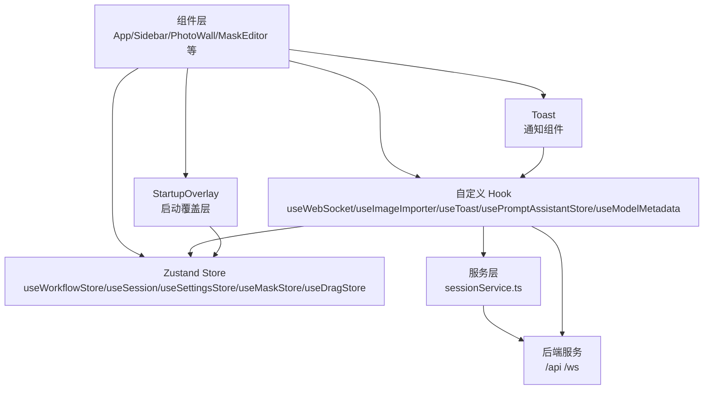
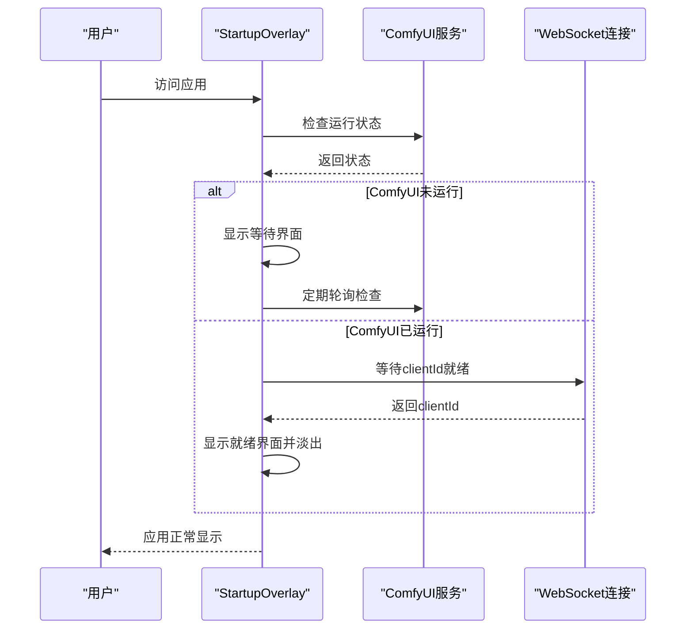
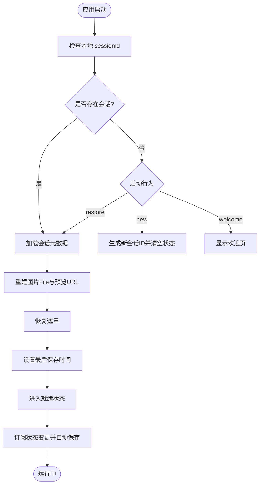
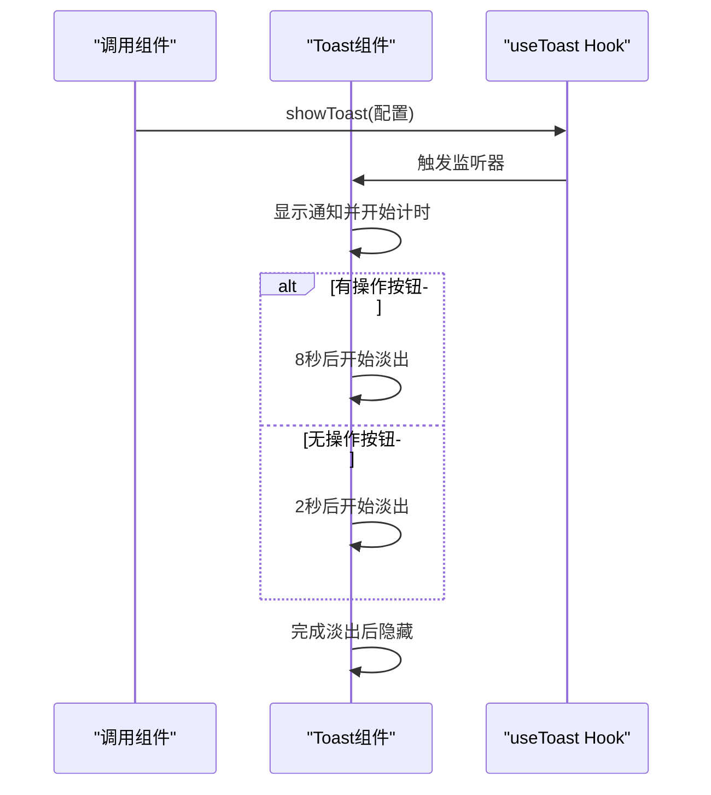
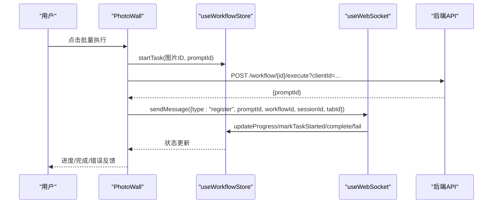
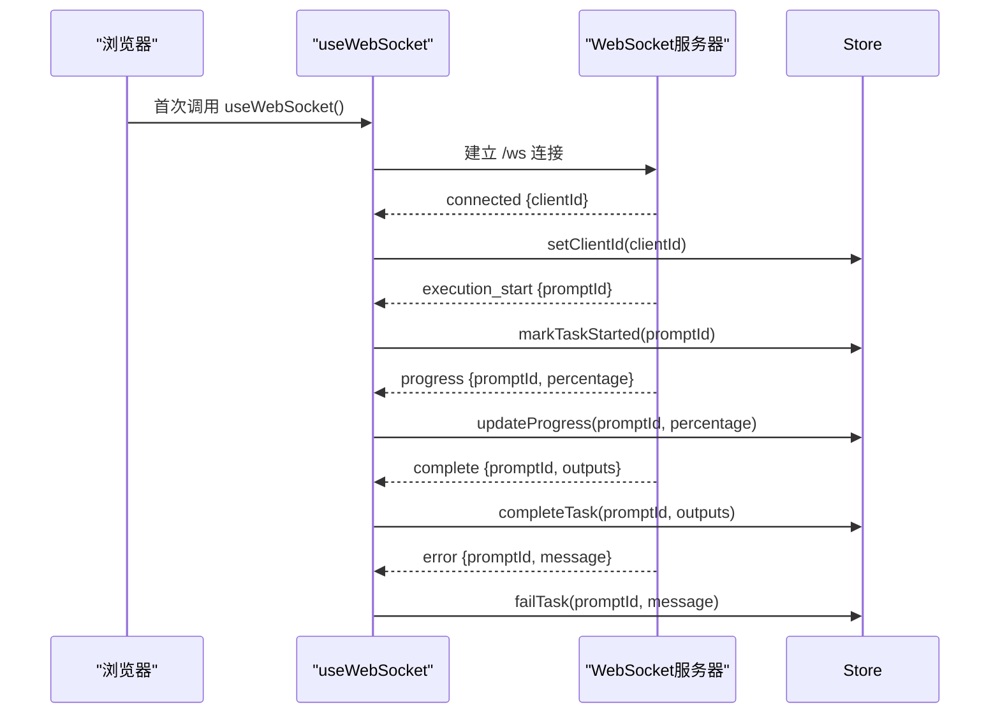
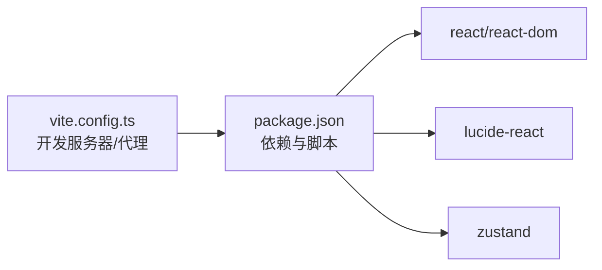

# 前端应用

<cite>
**本文引用的文件**
- [client/package.json](file://client/package.json)
- [client/vite.config.ts](file://client/vite.config.ts)
- [client/src/main.tsx](file://client/src/main.tsx)
- [client/src/components/App.tsx](file://client/src/components/App.tsx)
- [client/src/components/StartupOverlay.tsx](file://client/src/components/StartupOverlay.tsx)
- [client/src/components/Toast.tsx](file://client/src/components/Toast.tsx)
- [client/src/types/index.ts](file://client/src/types/index.ts)
- [client/src/hooks/useWorkflowStore.ts](file://client/src/hooks/useWorkflowStore.ts)
- [client/src/hooks/useSession.ts](file://client/src/hooks/useSession.ts)
- [client/src/hooks/useSettingsStore.ts](file://client/src/hooks/useSettingsStore.ts)
- [client/src/hooks/useWebSocket.ts](file://client/src/hooks/useWebSocket.ts)
- [client/src/hooks/useDragStore.ts](file://client/src/hooks/useDragStore.ts)
- [client/src/hooks/useMaskStore.ts](file://client/src/hooks/useMaskStore.ts)
- [client/src/hooks/useImageImporter.ts](file://client/src/hooks/useImageImporter.ts)
- [client/src/hooks/useToast.ts](file://client/src/hooks/useToast.ts)
- [client/src/hooks/usePromptAssistantStore.ts](file://client/src/hooks/usePromptAssistantStore.ts)
- [client/src/hooks/useModelMetadata.ts](file://client/src/hooks/useModelMetadata.ts)
- [client/src/services/sessionService.ts](file://client/src/services/sessionService.ts)
- [client/src/components/Sidebar.tsx](file://client/src/components/Sidebar.tsx)
- [client/src/components/PhotoWall.tsx](file://client/src/components/PhotoWall.tsx)
- [client/src/components/MaskEditor.tsx](file://client/src/components/MaskEditor.tsx)
- [client/src/components/DropZone.tsx](file://client/src/components/DropZone.tsx)
- [client/src/components/StatusBar.tsx](file://client/src/components/StatusBar.tsx)
- [client/src/components/SessionBar.tsx](file://client/src/components/SessionBar.tsx)
- [client/src/components/ThemeToggle.tsx](file://client/src/components/ThemeToggle.tsx)
- [client/src/components/SettingsModal.tsx](file://client/src/components/SettingsModal.tsx)
- [client/src/components/WelcomePage.tsx](file://client/src/components/WelcomePage.tsx)
- [client/src/components/Workflow0SettingsPanel.tsx](file://client/src/components/Workflow0SettingsPanel.tsx)
- [client/src/components/Workflow2SettingsPanel.tsx](file://client/src/components/Workflow2SettingsPanel.tsx)
- [client/src/components/Text2ImgSidebar.tsx](file://client/src/components/Text2ImgSidebar.tsx)
- [client/src/components/ZITSidebar.tsx](file://client/src/components/ZITSidebar.tsx)
- [client/src/components/PromptAssistantPanel.tsx](file://client/src/components/PromptAssistantPanel.tsx)
- [client/src/styles/global.css](file://client/src/styles/global.css)
- [client/src/styles/variables.css](file://client/src/styles/variables.css)
</cite>

## 更新摘要
**所做更改**
- 新增 StartupOverlay 组件以解决冷启动问题
- 增强会话管理的启动行为设置，支持 'welcome' 选项
- 改进 Toast 通知组件的交互体验
- 优化模型元数据获取的依赖关系
- 增强 WebSocket 连接的稳定性

## 目录
1. [简介](#简介)
2. [项目结构](#项目结构)
3. [核心组件](#核心组件)
4. [架构总览](#架构总览)
5. [详细组件分析](#详细组件分析)
6. [依赖关系分析](#依赖关系分析)
7. [性能考量](#性能考量)
8. [故障排查指南](#故障排查指南)
9. [结论](#结论)
10. [附录](#附录)

## 简介
本项目是一个基于 React + TypeScript + Vite 的前端应用，用于与后端 ComfyUI 工作流进行交互，支持多标签页工作流、蒙版编辑、任务队列管理、会话持久化与恢复、WebSocket 实时进度推送等功能。应用采用 Zustand 进行状态管理，通过自定义 Hook 将状态与 UI 组件解耦；通过 WebSocket 与后端保持长连接，接收任务进度、完成与错误事件；通过本地存储与服务端会话 API 实现跨页面状态持久化。

**更新** 本次更新重点改进了应用的启动体验和可靠性，包括冷启动问题的修复、启动行为设置的增强、Toast 通知组件的改进以及模型元数据获取的优化。

## 项目结构
客户端采用按功能模块组织的目录结构，主要分为组件层、Hooks 层、服务层与样式层：
- 组件层：页面布局、工具面板、工作区与交互控件
- Hooks 层：状态管理（Zustand）、WebSocket、拖拽、蒙版、会话、设置等
- 服务层：会话上传/下载、文件上传、队列查询等 API 封装
- 样式层：全局样式与主题变量

```mermaid
graph TB
subgraph "入口"
MAIN["main.tsx<br/>应用入口"]
APP["App.tsx<br/>根组件"]
STARTUP["StartupOverlay.tsx<br/>启动覆盖层"]
TOAST["Toast.tsx<br/>通知组件"]
end
subgraph "组件层"
SIDEBAR["Sidebar.tsx<br/>侧边栏"]
PHOTO["PhotoWall.tsx<br/>图片墙"]
MASK["MaskEditor.tsx<br/>蒙版编辑器"]
DZ["DropZone.tsx<br/>拖拽区域"]
SBAR["StatusBar.tsx<br/>状态栏"]
SBAR["SessionBar.tsx<br/>会话条"]
THEME["ThemeToggle.tsx<br/>主题切换"]
SETMODAL["SettingsModal.tsx<br/>设置弹窗"]
WEL["WelcomePage.tsx<br/>欢迎页"]
WF0["Workflow0SettingsPanel.tsx<br/>工作流0设置"]
WF2["Workflow2SettingsPanel.tsx<br/>工作流2设置"]
T2I["Text2ImgSidebar.tsx<br/>文本生图侧栏"]
ZIT["ZITSidebar.tsx<br/>ZIT侧栏"]
PA["PromptAssistantPanel.tsx<br/>提示词助理面板"]
end
subgraph "Hooks 层"
UWS["useWebSocket.ts<br/>WebSocket 管理"]
UWS2["useWorkflowStore.ts<br/>工作流状态"]
USession["useSession.ts<br/>会话管理"]
USettings["useSettingsStore.ts<br/>设置状态"]
UDrag["useDragStore.ts<br/>拖拽状态"]
UMask["useMaskStore.ts<br/>蒙版状态"]
UImgImp["useImageImporter.ts<br/>图片导入"]
UToast["useToast.ts<br/>提示消息"]
UPrompt["usePromptAssistantStore.ts<br/>提示词助理状态"]
UMeta["useModelMetadata.ts<br/>模型元数据"]
end
subgraph "服务层"
SES["sessionService.ts<br/>会话API封装"]
end
MAIN --> APP
APP --> STARTUP
APP --> TOAST
APP --> SIDEBAR
APP --> PHOTO
APP --> MASK
APP --> DZ
APP --> SBAR
APP --> SBAR
APP --> THEME
APP --> SETMODAL
APP --> WEL
APP --> WF0
APP --> WF2
APP --> T2I
APP --> ZIT
APP --> PA
APP --> UWS
APP --> UWS2
APP --> USession
APP --> USettings
APP --> UDrag
APP --> UMask
APP --> UImgImp
APP --> UToast
APP --> UPrompt
APP --> UMeta
USession --> SES
UWS --> UWS2
PHOTO --> UWS
PHOTO --> UWS2
PHOTO --> UMask
PHOTO --> UDrag
MASK --> UMask
MASK --> UWS2
```

**图表来源**
- [client/src/main.tsx:1-11](file://client/src/main.tsx#L1-L11)
- [client/src/components/App.tsx:1-408](file://client/src/components/App.tsx#L1-L408)
- [client/src/components/StartupOverlay.tsx:1-197](file://client/src/components/StartupOverlay.tsx#L1-L197)
- [client/src/components/Toast.tsx:1-55](file://client/src/components/Toast.tsx#L1-L55)
- [client/src/hooks/useSession.ts:1-430](file://client/src/hooks/useSession.ts#L1-L430)
- [client/src/hooks/useSettingsStore.ts:1-47](file://client/src/hooks/useSettingsStore.ts#L1-L47)
- [client/src/hooks/useToast.ts:1-70](file://client/src/hooks/useToast.ts#L1-L70)
- [client/src/hooks/useModelMetadata.ts:1-254](file://client/src/hooks/useModelMetadata.ts#L1-L254)

**章节来源**
- [client/src/main.tsx:1-11](file://client/src/main.tsx#L1-L11)
- [client/src/components/App.tsx:58-408](file://client/src/components/App.tsx#L58-L408)

## 核心组件
- 应用根组件 App：负责全局布局、欢迎页、主题初始化、拖拽导入、视图尺寸切换、状态栏渲染与全局模态组件挂载。
- 启动覆盖层 StartupOverlay：监控 ComfyUI 状态和 WebSocket 连接，解决冷启动问题，提供用户友好的启动体验。
- 通知组件 Toast：改进的消息提示系统，支持可选的操作按钮和自动消失机制。
- 侧边栏 Sidebar：展示工作流分组与列表，支持拖拽复制图片到目标标签页，显示队列数量并打开队列面板。
- 图片墙 PhotoWall：按列布局展示图片卡片，支持多选、批量操作、执行任务、删除、批量替换提示词、删除蒙版等。
- 蒙版编辑器 MaskEditor：提供画笔、自动识别、撤销/重做、遮罩覆盖、导出混合结果等能力。
- 会话管理 useSession：负责会话初始化、序列化/反序列化、图片与蒙版上传、自动保存、恢复策略与卸载前保存，支持新的 'welcome' 启动行为。
- WebSocket useWebSocket：单例连接管理，订阅进度、完成、错误事件并更新工作流状态。
- 工作流状态 useWorkflowStore：集中管理标签页数据、任务状态、提示词、输出索引、选择集、闪屏等。
- 设置 useSettingsStore：启动行为与逆向提示词模型配置，新增 'welcome' 选项。
- 模型元数据 useModelMetadata：增强的模型列表获取，支持缩略图、昵称、触发词等元数据管理。
- 服务 sessionService：对会话相关 API 的类型化封装。

**更新** 新增 StartupOverlay 和增强的 Toast 组件显著改善了用户体验，同时会话管理的启动行为设置更加灵活。

**章节来源**
- [client/src/components/App.tsx:58-408](file://client/src/components/App.tsx#L58-L408)
- [client/src/components/StartupOverlay.tsx:11-197](file://client/src/components/StartupOverlay.tsx#L11-L197)
- [client/src/components/Toast.tsx:3-55](file://client/src/components/Toast.tsx#L3-L55)
- [client/src/hooks/useSession.ts:118-430](file://client/src/hooks/useSession.ts#L118-L430)
- [client/src/hooks/useSettingsStore.ts:8-47](file://client/src/hooks/useSettingsStore.ts#L8-L47)
- [client/src/hooks/useModelMetadata.ts:16-254](file://client/src/hooks/useModelMetadata.ts#L16-L254)

## 架构总览
应用采用"组件 + Zustand 状态 + 自定义 Hook + 服务层"的分层架构：
- 组件层：负责 UI 呈现与用户交互
- Zustand 状态：集中管理业务状态（工作流、会话、设置、拖拽、蒙版）
- 自定义 Hook：封装副作用（WebSocket、会话、设置、拖拽、蒙版、导入、提示词助理、模型元数据）
- 服务层：统一调用后端 API，提供类型安全的接口

**图表来源**
- [client/src/components/App.tsx:1-408](file://client/src/components/App.tsx#L1-L408)
- [client/src/components/StartupOverlay.tsx:1-197](file://client/src/components/StartupOverlay.tsx#L1-L197)
- [client/src/components/Toast.tsx:1-55](file://client/src/components/Toast.tsx#L1-L55)
- [client/src/hooks/useWorkflowStore.ts:1-645](file://client/src/hooks/useWorkflowStore.ts#L1-L645)
- [client/src/hooks/useSession.ts:1-430](file://client/src/hooks/useSession.ts#L1-L430)
- [client/src/hooks/useSettingsStore.ts:1-47](file://client/src/hooks/useSettingsStore.ts#L1-L47)
- [client/src/hooks/useModelMetadata.ts:1-254](file://client/src/hooks/useModelMetadata.ts#L1-L254)

## 详细组件分析

### 启动流程与冷启动修复
- StartupOverlay 组件监控 ComfyUI 服务状态和 WebSocket 连接，确保应用在所有依赖服务就绪后再显示界面。
- 通过 sessionStorage 标记启动覆盖层已完成，避免页面刷新后的重复显示。
- 等待 ComfyUI 运行状态和 WebSocket clientId 就绪两个条件，防止生成按钮在连接完成前处于禁用状态。

**图表来源**
- [client/src/components/StartupOverlay.tsx:55-115](file://client/src/components/StartupOverlay.tsx#L55-L115)

**章节来源**
- [client/src/components/StartupOverlay.tsx:11-197](file://client/src/components/StartupOverlay.tsx#L11-L197)

### 会话管理的启动行为设置
- 新增 'welcome' 启动行为选项，允许用户在欢迎页面选择会话或创建新会话。
- 改进的启动逻辑分支，支持三种行为：'restore'（恢复）、'new'（新建）、'welcome'（欢迎页面）。
- 增强的错误处理，在会话恢复失败时仍尊重用户设置的启动行为。

**图表来源**
- [client/src/hooks/useSession.ts:307-392](file://client/src/hooks/useSession.ts#L307-L392)

**章节来源**
- [client/src/hooks/useSession.ts:118-430](file://client/src/hooks/useSession.ts#L118-L430)
- [client/src/hooks/useSettingsStore.ts:8-47](file://client/src/hooks/useSettingsStore.ts#L8-L47)

### Toast 通知组件增强
- 改进的通知系统，支持可选的操作按钮和自动消失机制。
- 默认持续时间：有操作按钮时8秒，无操作按钮时2秒。
- 平滑的进入和退出动画，提供更好的视觉反馈。
- 支持手动关闭和自动清理定时器。

**图表来源**
- [client/src/hooks/useToast.ts:39-66](file://client/src/hooks/useToast.ts#L39-L66)
- [client/src/components/Toast.tsx:3-55](file://client/src/components/Toast.tsx#L3-L55)

**章节来源**
- [client/src/hooks/useToast.ts:1-70](file://client/src/hooks/useToast.ts#L1-L70)
- [client/src/components/Toast.tsx:1-55](file://client/src/components/Toast.tsx#L1-L55)

### 模型元数据获取优化
- 增强的模型元数据管理系统，支持缩略图、昵称、触发词、分类等属性。
- 改进的搜索和过滤功能，支持多字段匹配和拼音回退。
- 优化的快速模式，仅显示有缩略图的模型以提高性能。
- 支持元数据的动态更新和批量操作。

**章节来源**
- [client/src/hooks/useModelMetadata.ts:16-254](file://client/src/hooks/useModelMetadata.ts#L16-L254)
- [client/src/components/ModelSelect.tsx:269-306](file://client/src/components/ModelSelect.tsx#L269-L306)

### 组件层次与数据流
- App 作为根容器，协调欢迎页、主题、会话、拖拽导入、状态栏与全局模态。
- PhotoWall 读取当前标签页的图片与任务状态，触发批量执行并通过 WebSocket 注册任务。
- Sidebar 切换标签页并监听队列变化，支持跨标签页拖拽复制图片。
- MaskEditor 从蒙版状态读取/写入遮罩，支持自动识别与导出混合结果。
- useSession 订阅工作流与蒙版状态变更，异步上传图片与蒙版，并保存会话状态。

**图表来源**
- [client/src/components/PhotoWall.tsx:181-240](file://client/src/components/PhotoWall.tsx#L181-L240)
- [client/src/hooks/useWorkflowStore.ts:377-515](file://client/src/hooks/useWorkflowStore.ts#L377-L515)
- [client/src/hooks/useWebSocket.ts:26-51](file://client/src/hooks/useWebSocket.ts#L26-L51)

**章节来源**
- [client/src/components/PhotoWall.tsx:103-578](file://client/src/components/PhotoWall.tsx#L103-L578)
- [client/src/hooks/useWorkflowStore.ts:96-645](file://client/src/hooks/useWorkflowStore.ts#L96-L645)
- [client/src/hooks/useWebSocket.ts:75-99](file://client/src/hooks/useWebSocket.ts#L75-L99)

### Zustand 状态管理设计
- 工作流状态（useWorkflowStore）：包含 activeTab、workflows、tabData（每标签页的图片、提示词、任务、输出索引、回姿开关、文本生图/ZIT配置、换脸区域）、clientId、sessionId、selectedImageIds、flashImageId 等。
- 会话状态（useSession）：维护 sessionId、lastSavedAt、欢迎页显示控制；序列化工作流与蒙版状态，上传图片与蒙版，自动保存与恢复。
- 设置状态（useSettingsStore）：启动行为与逆向提示词模型。
- 蒙版状态（useMaskStore）：遮罩数据、编辑器状态、历史记录、遮罩键值管理。
- 拖拽状态（useDragStore）：跨组件拖拽卡片与输出的元信息。
- 图片导入（useImageImporter）：处理拖拽与对话框确认。
- 提示词助理（usePromptAssistantStore）：提示词面板状态与系统提示词集合。
- 模型元数据（useModelMetadata）：模型列表、缩略图、昵称、触发词等元数据管理。

**章节来源**
- [client/src/hooks/useWorkflowStore.ts:35-88](file://client/src/hooks/useWorkflowStore.ts#L35-L88)
- [client/src/hooks/useSession.ts:108-114](file://client/src/hooks/useSession.ts#L108-L114)
- [client/src/hooks/useSettingsStore.ts:6-14](file://client/src/hooks/useSettingsStore.ts#L6-L14)
- [client/src/hooks/useWebSocket.ts:75-99](file://client/src/hooks/useWebSocket.ts#L75-L99)
- [client/src/hooks/useModelMetadata.ts:3-14](file://client/src/hooks/useModelMetadata.ts#L3-L14)

### WebSocket 通信实现
- 单例连接：useWebSocket 内部维护全局 WebSocket 实例与重连计时器，连接数计数确保正确关闭。
- 消息类型：connected、execution_start、progress、complete、error。
- 状态同步：根据消息类型调用工作流状态的对应方法，如 markTaskStarted、updateProgress、completeTask、failTask。
- 发送消息：暴露 sendMessage 方法，供 PhotoWall 在任务注册时发送注册消息。

**图表来源**
- [client/src/hooks/useWebSocket.ts:10-73](file://client/src/hooks/useWebSocket.ts#L10-L73)
- [client/src/hooks/useWorkflowStore.ts:398-499](file://client/src/hooks/useWorkflowStore.ts#L398-L499)
- [client/src/types/index.ts:27-57](file://client/src/types/index.ts#L27-L57)

**章节来源**
- [client/src/hooks/useWebSocket.ts:75-99](file://client/src/hooks/useWebSocket.ts#L75-L99)
- [client/src/types/index.ts:1-58](file://client/src/types/index.ts#L1-L58)

### 会话持久化与恢复
- 初始化：首次加载时读取本地 sessionId 或生成新 ID；根据启动行为决定是否恢复、新建或显示欢迎页。
- 序列化：仅序列化可持久化的字段（不含 File 对象），包括图片元数据、提示词、任务、输出索引、回姿开关、文本生图/ZIT配置、换脸区域。
- 上传：订阅工作流状态变更，检测新增图片并上传至对应标签目录，成功后更新 sessionUrl 并再次保存。
- 蒙版：订阅蒙版状态变更，将遮罩转换为灰度 PNG 并上传至会话目录。
- 恢复：拉取会话元数据，重建图片 File 对象与预览 URL，恢复遮罩，设置最后保存时间。
- 卸载前保存：使用 navigator.sendBeacon 发送最终状态，避免丢失。

**图表来源**
- [client/src/hooks/useSession.ts:290-387](file://client/src/hooks/useSession.ts#L290-L387)
- [client/src/hooks/useSession.ts:137-182](file://client/src/hooks/useSession.ts#L137-L182)
- [client/src/hooks/useSession.ts:235-265](file://client/src/hooks/useSession.ts#L235-L265)
- [client/src/services/sessionService.ts:102-121](file://client/src/services/sessionService.ts#L102-L121)

**章节来源**
- [client/src/hooks/useSession.ts:116-422](file://client/src/hooks/useSession.ts#L116-L422)
- [client/src/services/sessionService.ts:69-134](file://client/src/services/sessionService.ts#L69-L134)

### 用户界面与交互模式
- 响应式布局：顶部导航、侧边栏固定宽度、主内容区自适应滚动；PhotoWall 使用多列布局随视图尺寸调整。
- 主题切换：通过 data-theme 属性切换深色/浅色主题，CSS 变量驱动颜色体系。
- 交互模式：支持拖拽导入、跨标签页拖拽复制、批量选择、长按进入多选、删除拖拽区域、蒙版自动识别、画笔参数调节、撤销/重做、导出混合结果等。
- 动画与反馈：卡片闪烁、队列指示器脉冲动画、吐司提示、骨架屏、面板进出动画等。

**章节来源**
- [client/src/components/App.tsx:58-408](file://client/src/components/App.tsx#L58-L408)
- [client/src/components/PhotoWall.tsx:103-578](file://client/src/components/PhotoWall.tsx#L103-L578)
- [client/src/styles/global.css:1-224](file://client/src/styles/global.css#L1-L224)
- [client/src/styles/variables.css:1-31](file://client/src/styles/variables.css#L1-L31)

## 依赖关系分析
- 构建与开发：Vite 提供开发服务器与代理，代理规则将 /api 与 /ws 转发至后端。
- 运行时依赖：React、React DOM、lucide-react（图标）、zustand（状态管理）。
- 类型与脚本：TypeScript、Vite 插件、预览与构建脚本。

**图表来源**
- [client/vite.config.ts:1-20](file://client/vite.config.ts#L1-L20)
- [client/package.json:1-25](file://client/package.json#L1-L25)

**章节来源**
- [client/vite.config.ts:1-20](file://client/vite.config.ts#L1-L20)
- [client/package.json:1-25](file://client/package.json#L1-L25)

## 性能考量
- 图片懒加载：PhotoWall 中的 LazyCard 使用 IntersectionObserver 控制可见性，减少初始渲染压力。
- 滚动锚定：启用 CSS scroll anchoring，避免内容高度变化导致的滚动位置抖动。
- 状态订阅去抖：会话保存使用定时器去抖，避免频繁网络请求。
- 文件对象释放：移除图片时及时 revokeObjectURL，防止内存泄漏。
- WebSocket 单例：避免重复连接，降低资源消耗与连接风暴风险。
- 大图处理：蒙版导出与混合使用 OffscreenCanvas，避免主线程阻塞。
- 启动覆盖层：StartupOverlay 优化冷启动体验，避免用户看到未完全初始化的界面。
- Toast 性能：useToast Hook 使用 Set 存储监听器，避免重复创建函数对象。

**更新** 新增的 StartupOverlay 组件显著改善了冷启动体验，Toast 组件的性能优化减少了不必要的重渲染。

**章节来源**
- [client/src/components/PhotoWall.tsx:18-97](file://client/src/components/PhotoWall.tsx#L18-L97)
- [client/src/components/PhotoWall.tsx:458-509](file://client/src/components/PhotoWall.tsx#L458-L509)
- [client/src/hooks/useSession.ts:177-181](file://client/src/hooks/useSession.ts#L177-L181)
- [client/src/hooks/useWorkflowStore.ts:254-282](file://client/src/hooks/useWorkflowStore.ts#L254-L282)
- [client/src/hooks/useWebSocket.ts:10-73](file://client/src/hooks/useWebSocket.ts#L10-L73)
- [client/src/components/MaskEditor.tsx:68-83](file://client/src/components/MaskEditor.tsx#L68-L83)
- [client/src/components/StartupOverlay.tsx:11-197](file://client/src/components/StartupOverlay.tsx#L11-L197)
- [client/src/hooks/useToast.ts:16-21](file://client/src/hooks/useToast.ts#L16-L21)

## 故障排查指南
- WebSocket 连接失败：检查后端 /ws 是否可用，确认协议（http/https）与主机名匹配；查看控制台日志与重连逻辑。
- 任务无进度：确认 PhotoWall 已发送注册消息；检查后端是否正确推送 progress/complete/error；核对 promptId 映射。
- 会话保存失败：检查 /api/session/{id}/state PUT 请求返回；确认本地 sessionId 存在且未被删除；关注 beforeunload 保存。
- 图片上传失败：检查 /api/session/{id}/images POST；确认文件类型与大小限制；查看订阅上传逻辑。
- 蒙版上传失败：检查 /api/session/{id}/masks POST；确认遮罩像素数据格式；注意保存时机与 key 唯一性。
- 主题切换无效：确认 data-theme 属性设置与 CSS 变量生效；检查全局样式优先级。
- 启动覆盖层问题：检查 ComfyUI 服务状态和 WebSocket 连接；确认 StartupOverlay 组件正确渲染。
- Toast 通知不显示：检查 useToast Hook 的监听器注册；确认 Toast 组件正确挂载到 App。

**更新** 新增了 StartupOverlay 和 Toast 组件的故障排查指导。

**章节来源**
- [client/src/hooks/useWebSocket.ts:26-65](file://client/src/hooks/useWebSocket.ts#L26-L65)
- [client/src/hooks/useSession.ts:164-175](file://client/src/hooks/useSession.ts#L164-L175)
- [client/src/services/sessionService.ts:69-100](file://client/src/services/sessionService.ts#L69-L100)
- [client/src/components/App.tsx:76-81](file://client/src/components/App.tsx#L76-L81)
- [client/src/components/StartupOverlay.tsx:55-93](file://client/src/components/StartupOverlay.tsx#L55-L93)
- [client/src/hooks/useToast.ts:39-66](file://client/src/hooks/useToast.ts#L39-L66)

## 结论
该前端应用通过清晰的分层架构与 Zustand 状态管理，实现了复杂的工作流交互与实时状态同步。结合会话持久化与 WebSocket 推送，提供了良好的用户体验。本次更新重点改进了启动体验和可靠性，包括冷启动问题的修复、启动行为设置的增强、Toast 通知组件的改进以及模型元数据获取的优化。建议在后续迭代中进一步完善错误边界、性能监控与国际化支持，并持续优化大图处理与动画性能。

## 附录
- 最佳实践
  - 使用 memo 包装昂贵子组件（如 LazyCard）
  - 在组件卸载时清理订阅与定时器
  - 对大文件操作使用 OffscreenCanvas 与 Blob URL
  - 严格区分 UI 状态与持久化状态，避免将不可序列化对象放入 store
  - 使用类型化 API 封装，提升可维护性与可测试性
  - 启动覆盖层只在必要时显示，避免影响用户体验
  - Toast 组件应提供明确的用户操作反馈
- 初学者指导
  - 从 App 与 Sidebar 入手，理解组件职责与数据流向
  - 通过 useWorkflowStore 的 actions 学习状态更新模式
  - 使用 useSession 理解订阅与副作用管理
  - 通过 useWebSocket 掌握实时通信与状态同步
  - 通过 StartupOverlay 理解启动流程管理
  - 通过 useToast 掌握用户反馈机制
- 性能优化建议
  - 图片懒加载与虚拟滚动
  - 状态订阅去抖与批量更新
  - 避免不必要的重渲染，合理拆分组件
  - 使用 CSS 动画替代昂贵的 JavaScript 动画
  - 优化启动覆盖层的渲染频率
  - 减少 Toast 组件的重渲染次数