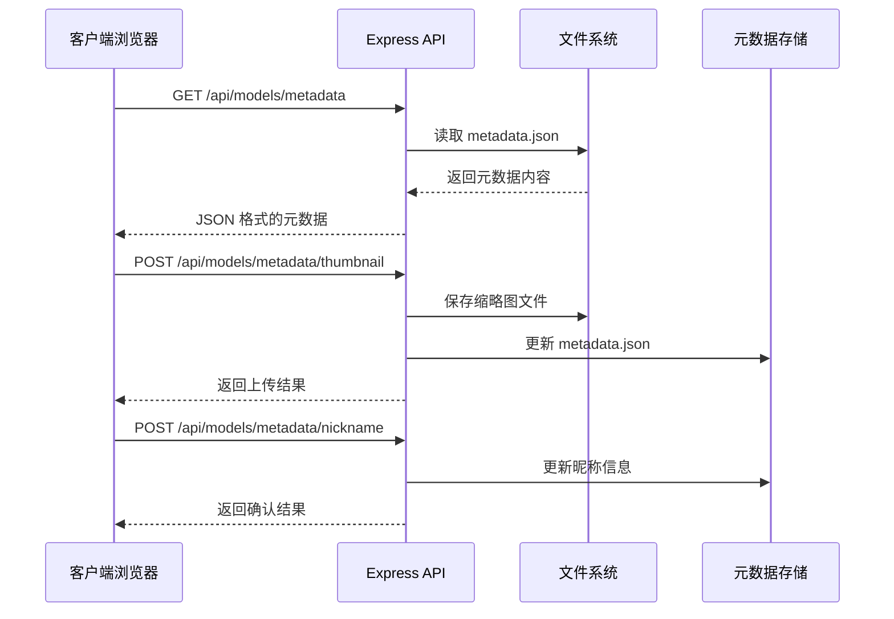
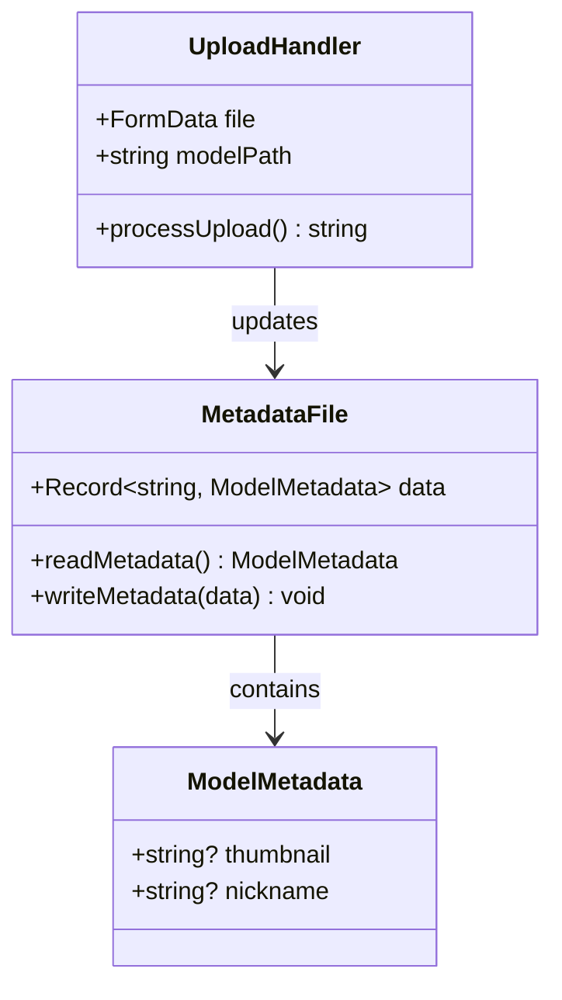
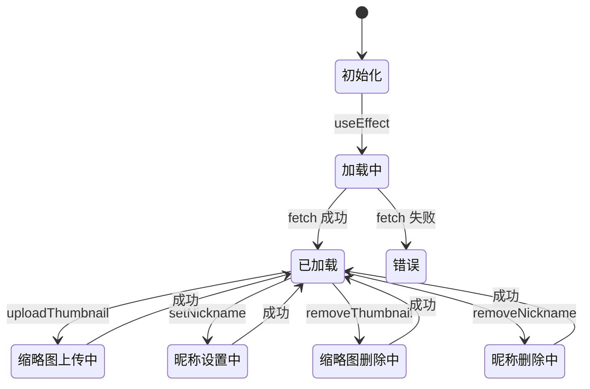
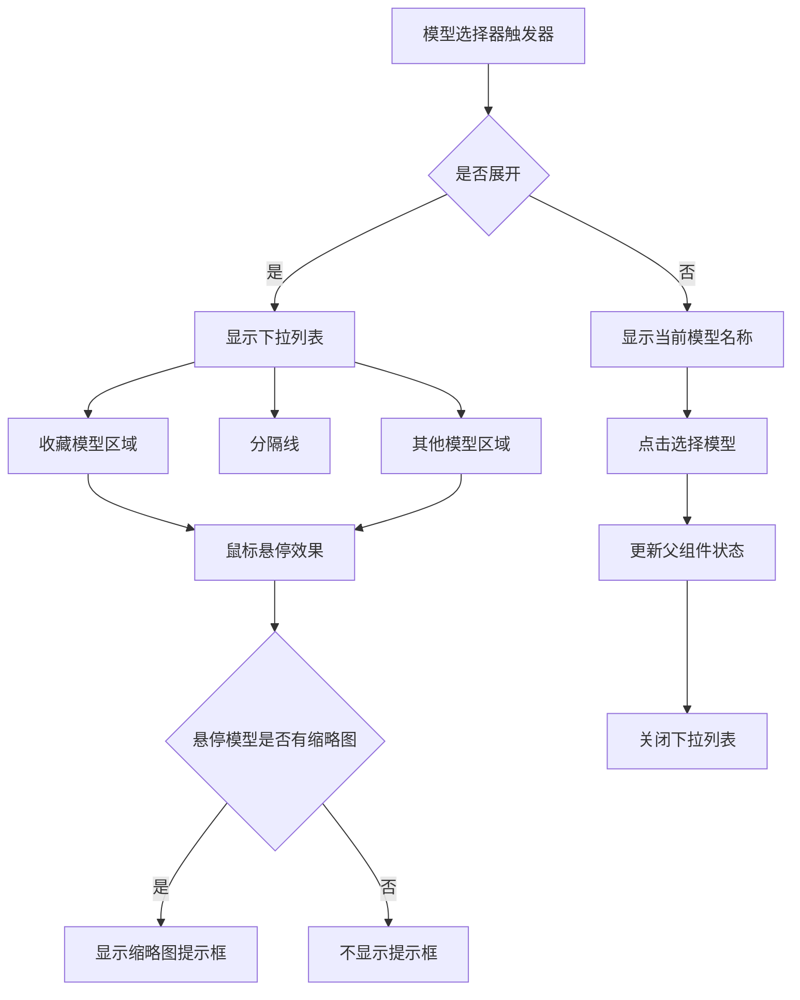
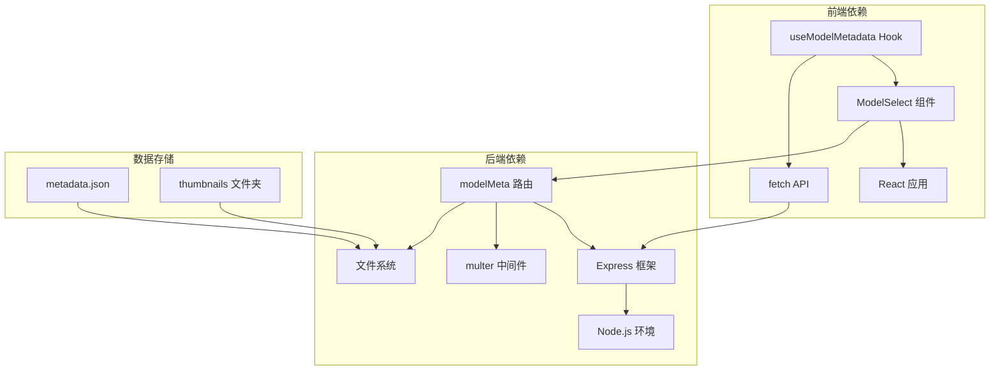

# 模型元数据管理

<cite>
**本文档引用的文件**
- [metadata.json](file://model_meta/metadata.json)
- [modelMeta.ts](file://server/src/routes/modelMeta.ts)
- [useModelMetadata.ts](file://client/src/hooks/useModelMetadata.ts)
- [ModelSelect.tsx](file://client/src/components/ModelSelect.tsx)
- [index.ts](file://server/src/index.ts)
- [README.md](file://README.md)
</cite>

## 目录
1. [简介](#简介)
2. [项目结构](#项目结构)
3. [核心组件](#核心组件)
4. [架构概览](#架构概览)
5. [详细组件分析](#详细组件分析)
6. [依赖关系分析](#依赖关系分析)
7. [性能考虑](#性能考虑)
8. [故障排除指南](#故障排除指南)
9. [结论](#结论)

## 简介

模型元数据管理系统是 CorineKit Pix2Real 项目中的一个关键功能模块，负责管理和组织 AI 模型的相关信息。该系统允许用户为不同的模型设置自定义昵称、上传缩略图，并提供了一个直观的界面来浏览和管理这些元数据。

该项目基于本地 Web UI 架构，通过 ComfyUI 进行批量图像/视频处理，支持实时进度更新和一键输出文件夹访问。模型元数据管理功能增强了用户体验，使用户能够更好地组织和识别各种 AI 模型。

## 项目结构

项目采用前后端分离的架构设计，主要包含以下关键目录：

```mermaid
graph TB
subgraph "项目根目录"
A[client/] -- 前端应用
B[server/] -- 后端服务
C[model_meta/] -- 模型元数据存储
D[ComfyUI_API/] -- 工作流模板
E[output/] -- 输出文件
end
subgraph "前端 (client)"
A1[src/components/] -- UI 组件
A2[src/hooks/] -- React Hooks
A3[src/services/] -- 服务层
A4[src/types/] -- 类型定义
end
subgraph "后端 (server)"
B1[src/routes/] -- 路由处理
B2[src/services/] -- 业务服务
B3[src/adapters/] -- 工作流适配器
B4[src/types/] -- 类型定义
end
subgraph "模型元数据 (model_meta)"
C1[metadata.json] -- 元数据文件
C2[thumbnails/] -- 缩略图存储
end
```

**图表来源**
- [README.md:41-62](file://README.md#L41-L62)

**章节来源**
- [README.md:41-62](file://README.md#L41-L62)

## 核心组件

模型元数据管理系统由三个主要组件构成：

### 1. 数据存储层
- **metadata.json**: 存储所有模型的元数据信息
- **thumbnails/**: 存储模型缩略图文件

### 2. 后端服务层
- **modelMeta 路由**: 处理模型元数据的 CRUD 操作
- **文件上传处理**: 支持多种图片格式的上传和管理

### 3. 前端交互层
- **useModelMetadata Hook**: 提供模型元数据的状态管理和操作方法
- **ModelSelect 组件**: 实现模型选择器的 UI 组件

**章节来源**
- [metadata.json:1-78](file://model_meta/metadata.json#L1-L78)
- [modelMeta.ts:1-150](file://server/src/routes/modelMeta.ts#L1-L150)
- [useModelMetadata.ts:1-123](file://client/src/hooks/useModelMetadata.ts#L1-L123)

## 架构概览

系统采用客户端-服务器架构，通过 RESTful API 进行通信：



**图表来源**
- [modelMeta.ts:44-101](file://server/src/routes/modelMeta.ts#L44-L101)
- [useModelMetadata.ts:11-121](file://client/src/hooks/useModelMetadata.ts#L11-L121)

## 详细组件分析

### 后端路由组件 (modelMeta.ts)

后端路由组件提供了完整的模型元数据管理功能：

#### 数据结构设计


**图表来源**
- [modelMeta.ts:28-39](file://server/src/routes/modelMeta.ts#L28-L39)

#### 核心功能实现

1. **元数据读取**: 从 JSON 文件中读取所有模型元数据
2. **缩略图上传**: 支持多种图片格式的上传和管理
3. **昵称设置**: 允许用户为模型设置自定义显示名称
4. **文件清理**: 自动清理不再使用的缩略图文件

**章节来源**
- [modelMeta.ts:28-83](file://server/src/routes/modelMeta.ts#L28-L83)
- [modelMeta.ts:85-147](file://server/src/routes/modelMeta.ts#L85-L147)

### 前端 Hook 组件 (useModelMetadata.ts)

前端 Hook 组件提供了响应式的状态管理和异步操作：

#### 状态管理模式


**图表来源**
- [useModelMetadata.ts:8-122](file://client/src/hooks/useModelMetadata.ts#L8-L122)

#### 主要功能特性

1. **自动加载**: 组件挂载时自动从服务器加载元数据
2. **响应式更新**: 所有操作都会同步更新本地状态
3. **错误处理**: 内置错误处理机制，确保应用稳定性
4. **URL 生成**: 自动生成缩略图的访问 URL

**章节来源**
- [useModelMetadata.ts:8-122](file://client/src/hooks/useModelMetadata.ts#L8-L122)

### UI 组件 (ModelSelect.tsx)

ModelSelect 组件实现了完整的模型选择器功能：

#### 用户界面设计


**图表来源**
- [ModelSelect.tsx:37-401](file://client/src/components/ModelSelect.tsx#L37-L401)

#### 交互功能实现

1. **收藏功能**: 支持将常用模型添加到收藏夹
2. **缩略图预览**: 鼠标悬停时显示模型缩略图
3. **自定义昵称**: 支持编辑模型的显示名称
4. **缩略图上传**: 直接从 UI 上传模型缩略图
5. **分类显示**: 将收藏模型和其他模型分开显示

**章节来源**
- [ModelSelect.tsx:19-115](file://client/src/components/ModelSelect.tsx#L19-L115)
- [ModelSelect.tsx:165-293](file://client/src/components/ModelSelect.tsx#L165-L293)

## 依赖关系分析

系统各组件之间的依赖关系如下：



**图表来源**
- [index.ts:11-11](file://server/src/index.ts#L11-L11)
- [index.ts:70-71](file://server/src/index.ts#L70-L71)

**章节来源**
- [index.ts:11-71](file://server/src/index.ts#L11-L71)

## 性能考虑

### 文件存储优化
- **缓存策略**: 前端使用 React 状态缓存元数据，减少重复请求
- **懒加载**: 缩略图仅在需要时加载，提升页面性能
- **文件清理**: 自动清理不再使用的缩略图文件，控制存储空间

### 网络传输优化
- **增量更新**: 只更新受影响的模型元数据，而非整页刷新
- **错误恢复**: 网络请求失败时保持应用可用性
- **并发控制**: 防止重复的元数据请求

### 内存管理
- **状态清理**: 组件卸载时自动清理相关状态
- **文件句柄**: 及时关闭文件描述符，防止内存泄漏

## 故障排除指南

### 常见问题及解决方案

#### 1. 缩略图上传失败
**症状**: 上传缩略图后无法显示或返回错误
**可能原因**:
- 文件格式不支持
- 磁盘空间不足
- 权限问题

**解决步骤**:
1. 检查文件格式是否为支持的类型（jpg, jpeg, png, webp, gif）
2. 确认磁盘空间充足
3. 验证文件写入权限

#### 2. 元数据无法加载
**症状**: 页面显示空列表或加载指示器持续显示
**可能原因**:
- 服务器未启动
- 网络连接问题
- JSON 文件损坏

**解决步骤**:
1. 确认服务器正常运行
2. 检查网络连接状态
3. 验证 metadata.json 文件完整性

#### 3. 收藏功能异常
**症状**: 收藏的模型无法保存或丢失
**可能原因**:
- 浏览器存储限制
- 本地存储损坏

**解决步骤**:
1. 清除浏览器缓存
2. 检查本地存储容量
3. 重新添加收藏

**章节来源**
- [modelMeta.ts:18-26](file://server/src/routes/modelMeta.ts#L18-L26)
- [useModelMetadata.ts:17-19](file://client/src/hooks/useModelMetadata.ts#L17-L19)

## 结论

模型元数据管理系统为 CorineKit Pix2Real 项目提供了完整的模型管理解决方案。通过精心设计的架构和用户友好的界面，该系统有效地解决了 AI 模型组织和识别的问题。

### 主要优势

1. **易用性**: 直观的 UI 设计和丰富的交互功能
2. **可靠性**: 完善的错误处理和数据验证机制
3. **扩展性**: 模块化的架构设计便于功能扩展
4. **性能**: 优化的文件存储和网络传输策略

### 技术亮点

- **前后端分离**: 清晰的职责划分和独立的开发流程
- **响应式设计**: 适应不同设备和屏幕尺寸
- **状态管理**: 有效的状态同步和缓存策略
- **文件处理**: 安全的文件上传和存储机制

该系统不仅提升了用户体验，还为项目的长期发展奠定了坚实的技术基础。通过持续的优化和功能扩展，模型元数据管理功能将继续为用户提供更好的服务。