# 模型元数据管理

<cite>
**本文档引用的文件**
- [metadata.json](file://model_meta/metadata.json)
- [modelMeta.ts](file://server/src/routes/modelMeta.ts)
- [useModelMetadata.ts](file://client/src/hooks/useModelMetadata.ts)
- [ModelSelect.tsx](file://client/src/components/ModelSelect.tsx)
- [Text2ImgSidebar.tsx](file://client/src/components/Text2ImgSidebar.tsx)
- [ZITSidebar.tsx](file://client/src/components/ZITSidebar.tsx)
- [autoFillMetadata.ts](file://server/src/scripts/autoFillMetadata.ts)
- [index.ts](file://server/src/index.ts)
- [README.md](file://README.md)
</cite>

## 更新摘要
**变更内容**
- 新增超过1200行的模型目录数据，扩展了LoRA模型、基础模型和专用分类的元数据
- 扩展metadata.json数据结构，新增description、styleTags、keywords、compatibleModels、recommendedStrength等字段
- 增强AI Agent智能增强功能，提供更丰富的模型描述和标签
- 优化LoRA模型兼容性和推荐强度管理
- 新增触发词管理系统和分类管理系统
- 新增自动填充系统，支持基于文件命名约定的智能元数据填充

## 目录
1. [简介](#简介)
2. [项目结构](#项目结构)
3. [核心组件](#核心组件)
4. [架构概览](#架构概览)
5. [详细组件分析](#详细组件分析)
6. [触发词管理系统](#触发词管理系统)
7. [分类管理系统](#分类管理系统)
8. [自动填充系统](#自动填充系统)
9. [AI Agent智能增强](#ai-agent智能增强)
10. [依赖关系分析](#依赖关系分析)
11. [性能考虑](#性能考虑)
12. [故障排除指南](#故障排除指南)
13. [结论](#结论)

## 简介

模型元数据管理系统是 CorineKit Pix2Real 项目中的一个关键功能模块，负责管理和组织 AI 模型的相关信息。该系统允许用户为不同的模型设置自定义昵称、上传缩略图，并提供了一个直观的界面来浏览和管理这些元数据。

**更新** 该系统现已扩展为支持 LoRA 触发词管理、模型分类管理以及 AI Agent 智能增强功能。新增的自动填充脚本能够基于文件命名约定智能生成元数据，包括模型描述、风格标签、兼容性信息和推荐强度等，大大提升了模型管理的自动化程度和智能化水平。

该项目基于本地 Web UI 架构，通过 ComfyUI 进行批量图像/视频处理，支持实时进度更新和一键输出文件夹访问。模型元数据管理功能增强了用户体验，使用户能够更好地组织和识别各种 AI 模型。

**更新** 本次更新显著扩展了模型目录数据，新增了超过1200行的模型元数据，涵盖了角色、姿态、表情、风格、滑块和多视角等多个详细分类系统，包括来自不同游戏系列（如原神、碧蓝档案、鸣潮等）的专业模型。

## 项目结构

项目采用前后端分离的架构设计，主要包含以下关键目录：

```mermaid
graph TB
subgraph "项目根目录"
A[client/] -- 前端应用
B[server/] -- 后端服务
C[model_meta/] -- 模型元数据存储
D[ComfyUI_API/] -- 工作流模板
E[output/] -- 输出文件
end
subgraph "前端 (client)"
A1[src/components/] -- UI 组件
A2[src/hooks/] -- React Hooks
A3[src/services/] -- 服务层
A4[src/types/] -- 类型定义
end
subgraph "后端 (server)"
B1[src/routes/] -- 路由处理
B2[src/services/] -- 业务服务
B3[src/adapters/] -- 工作流适配器
B4[src/scripts/] -- 自动化脚本
B5[src/types/] -- 类型定义
end
subgraph "模型元数据 (model_meta)"
C1[metadata.json] -- 元数据文件
C2[thumbnails/] -- 缩略图存储
end
```

**图表来源**
- [README.md:41-62](file://README.md#L41-L62)

**章节来源**
- [README.md:41-62](file://README.md#L41-L62)

## 核心组件

模型元数据管理系统由七个主要组件构成：

### 1. 数据存储层
- **metadata.json**: 存储所有模型的元数据信息，包括新增的 AI Agent 增强字段
- **thumbnails/**: 存储模型缩略图文件

### 2. 后端服务层
- **modelMeta 路由**: 处理模型元数据的 CRUD 操作，包括新增的触发词和分类管理
- **文件上传处理**: 支持多种图片格式的上传和管理
- **自动填充脚本**: 智能生成缺失的元数据字段

### 3. 前端交互层
- **useModelMetadata Hook**: 提供模型元数据的状态管理和操作方法，包括 AI Agent 增强功能
- **ModelSelect 组件**: 实现模型选择器的 UI 组件，支持触发词编辑和分类管理
- **Text2ImgSidebar 组件**: 文本到图像侧边栏，显示和管理 LoRA 触发词
- **ZITSidebar 组件**: ZIT 工作流侧边栏，同样支持触发词管理

### 4. 触发词管理组件
- **触发词编辑器**: 在模型选择器中提供触发词编辑功能
- **触发词显示**: 在侧边栏中显示和复制触发词
- **触发词存储**: 将触发词与模型关联并持久化存储

### 5. 分类管理组件
- **分类颜色系统**: 为不同分类分配唯一的颜色标识
- **右键菜单**: 支持分类的创建、编辑和删除操作
- **分类筛选**: 支持按分类对模型进行筛选和组织

### 6. 自动填充组件
- **智能识别引擎**: 基于文件命名约定识别模型类型和属性
- **元数据生成器**: 自动生成描述、标签、兼容性等信息
- **批量处理工具**: 支持对大量模型元数据进行批量填充

### 7. AI Agent增强组件
- **智能描述生成**: 基于模型特征生成详细的描述文本
- **风格标签增强**: 自动识别并添加特定的游戏系列标签
- **兼容性分析**: 智能识别模型兼容性和推荐强度

**章节来源**
- [metadata.json:1-1635](file://model_meta/metadata.json#L1-L1635)
- [modelMeta.ts:1-272](file://server/src/routes/modelMeta.ts#L1-L272)
- [useModelMetadata.ts:1-248](file://client/src/hooks/useModelMetadata.ts#L1-L248)
- [ModelSelect.tsx:1-1046](file://client/src/components/ModelSelect.tsx#L1-L1046)
- [autoFillMetadata.ts:1-257](file://server/src/scripts/autoFillMetadata.ts#L1-L257)

## 架构概览

系统采用客户端-服务器架构，通过 RESTful API 进行通信：

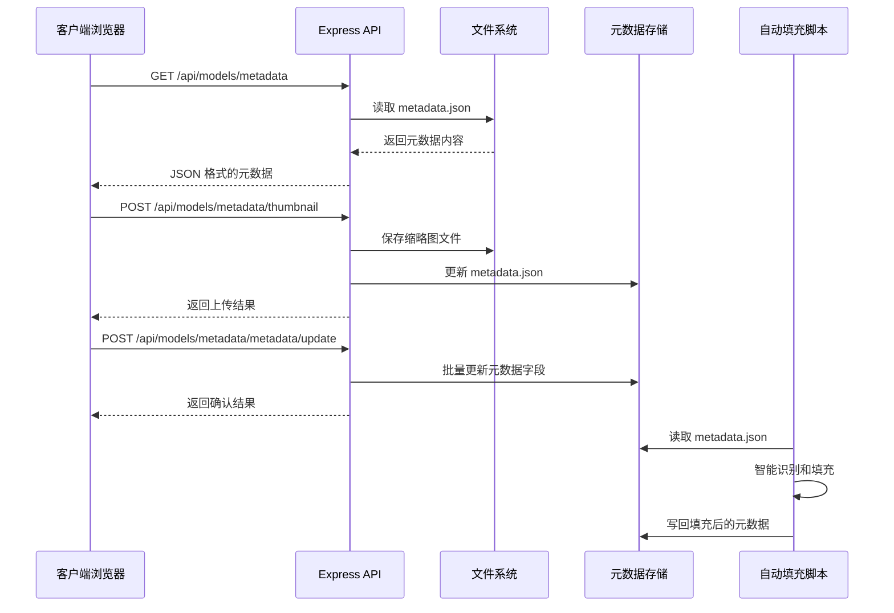

**图表来源**
- [modelMeta.ts:44-272](file://server/src/routes/modelMeta.ts#L44-L272)
- [useModelMetadata.ts:204-246](file://client/src/hooks/useModelMetadata.ts#L204-L246)
- [autoFillMetadata.ts:201-257](file://server/src/scripts/autoFillMetadata.ts#L201-L257)

## 详细组件分析

### 后端路由组件 (modelMeta.ts)

后端路由组件提供了完整的模型元数据管理功能，包括新增的触发词和分类管理：

#### 数据结构设计
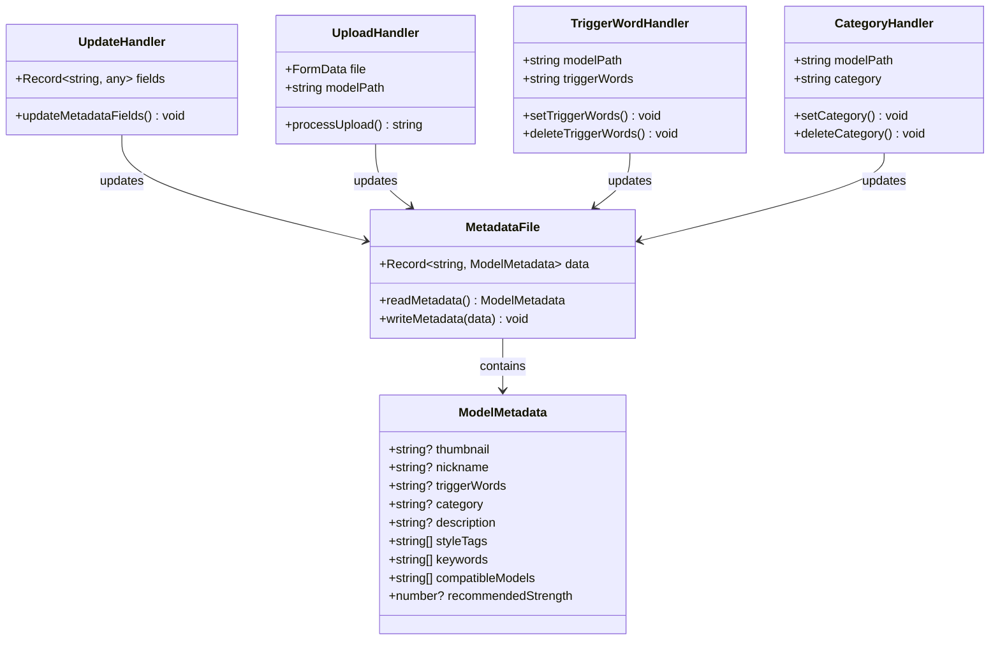

**图表来源**
- [modelMeta.ts:28-39](file://server/src/routes/modelMeta.ts#L28-L39)

#### 核心功能实现

1. **元数据读取**: 从 JSON 文件中读取所有模型元数据，包括新增的 AI Agent 增强字段
2. **缩略图上传**: 支持多种图片格式的上传和管理
3. **昵称设置**: 允许用户为模型设置自定义显示名称
4. **触发词管理**: 新增触发词的设置和删除功能
5. **分类管理**: 新增分类的设置和删除功能
6. **批量更新**: 支持批量更新元数据字段，包括 AI Agent 增强字段
7. **文件清理**: 自动清理不再使用的缩略图文件

**章节来源**
- [modelMeta.ts:28-83](file://server/src/routes/modelMeta.ts#L28-L83)
- [modelMeta.ts:85-272](file://server/src/routes/modelMeta.ts#L85-L272)

### 前端 Hook 组件 (useModelMetadata.ts)

前端 Hook 组件提供了响应式的状态管理和异步操作，包括新增的 AI Agent 增强功能：

#### 状态管理模式
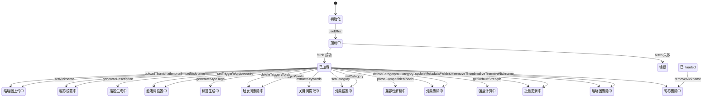

**图表来源**
- [useModelMetadata.ts:8-248](file://client/src/hooks/useModelMetadata.ts#L8-L248)

#### 主要功能特性

1. **自动加载**: 组件挂载时自动从服务器加载元数据
2. **响应式更新**: 所有操作都会同步更新本地状态，包括 AI Agent 增强字段
3. **错误处理**: 内置错误处理机制，确保应用稳定性
4. **URL 生成**: 自动生成缩略图的访问 URL
5. **触发词管理**: 新增触发词的设置、删除和获取功能
6. **分类管理**: 新增分类的设置、删除和获取功能
7. **批量更新**: 支持批量更新元数据字段，包括 AI Agent 增强字段

**章节来源**
- [useModelMetadata.ts:8-248](file://client/src/hooks/useModelMetadata.ts#L8-L248)

### UI 组件 (ModelSelect.tsx)

ModelSelect 组件实现了完整的模型选择器功能，包括新增的触发词编辑和分类管理功能：

#### 用户界面设计
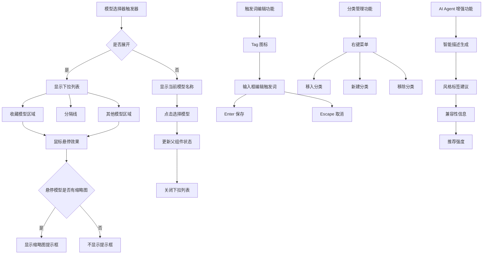

**图表来源**
- [ModelSelect.tsx:37-1046](file://client/src/components/ModelSelect.tsx#L37-L1046)

#### 交互功能实现

1. **收藏功能**: 支持将常用模型添加到收藏夹
2. **缩略图预览**: 鼠标悬停时显示模型缩略图
3. **自定义昵称**: 支持编辑模型的显示名称
4. **触发词编辑**: 新增触发词的编辑功能，通过 Tag 图标激活
5. **分类管理**: 新增分类的编辑功能，通过右键菜单激活
6. **缩略图上传**: 直接从 UI 上传模型缩略图
7. **分类筛选**: 支持按分类对模型进行筛选
8. **分类颜色**: 为不同分类分配唯一的颜色标识
9. **AI Agent 增强**: 支持智能生成模型描述和标签

**章节来源**
- [ModelSelect.tsx:19-115](file://client/src/components/ModelSelect.tsx#L19-L115)
- [ModelSelect.tsx:165-377](file://client/src/components/ModelSelect.tsx#L165-L377)
- [ModelSelect.tsx:800-1046](file://client/src/components/ModelSelect.tsx#L800-L1046)

## 触发词管理系统

**新增** LoRA 触发词管理系统是本次更新的核心功能，为 LoRA 模型提供了专门的触发词管理能力。

### 触发词数据结构

触发词系统使用以下数据结构存储：

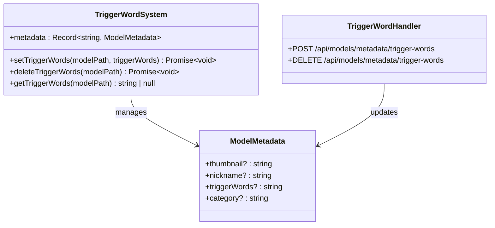

**图表来源**
- [modelMeta.ts:149-186](file://server/src/routes/modelMeta.ts#L149-L186)
- [useModelMetadata.ts:120-156](file://client/src/hooks/useModelMetadata.ts#L120-L156)

### 触发词管理流程

#### 后端处理流程
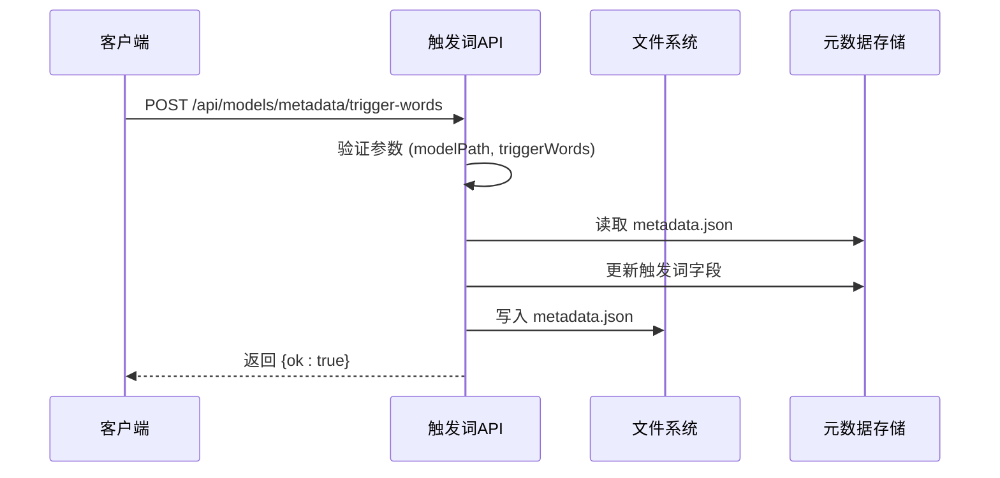

**图表来源**
- [modelMeta.ts:149-165](file://server/src/routes/modelMeta.ts#L149-L165)

#### 前端交互流程
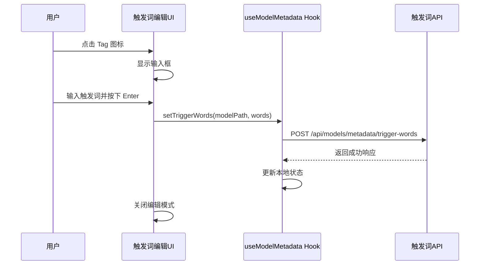

**图表来源**
- [ModelSelect.tsx:104-109](file://client/src/components/ModelSelect.tsx#L104-L109)
- [useModelMetadata.ts:120-136](file://client/src/hooks/useModelMetadata.ts#L120-L136)

### 触发词显示和使用

#### 侧边栏集成
触发词系统在多个侧边栏组件中得到集成：

1. **Text2ImgSidebar**: 文本到图像生成界面
2. **ZITSidebar**: ZIT 工作流界面

#### 触发词显示功能
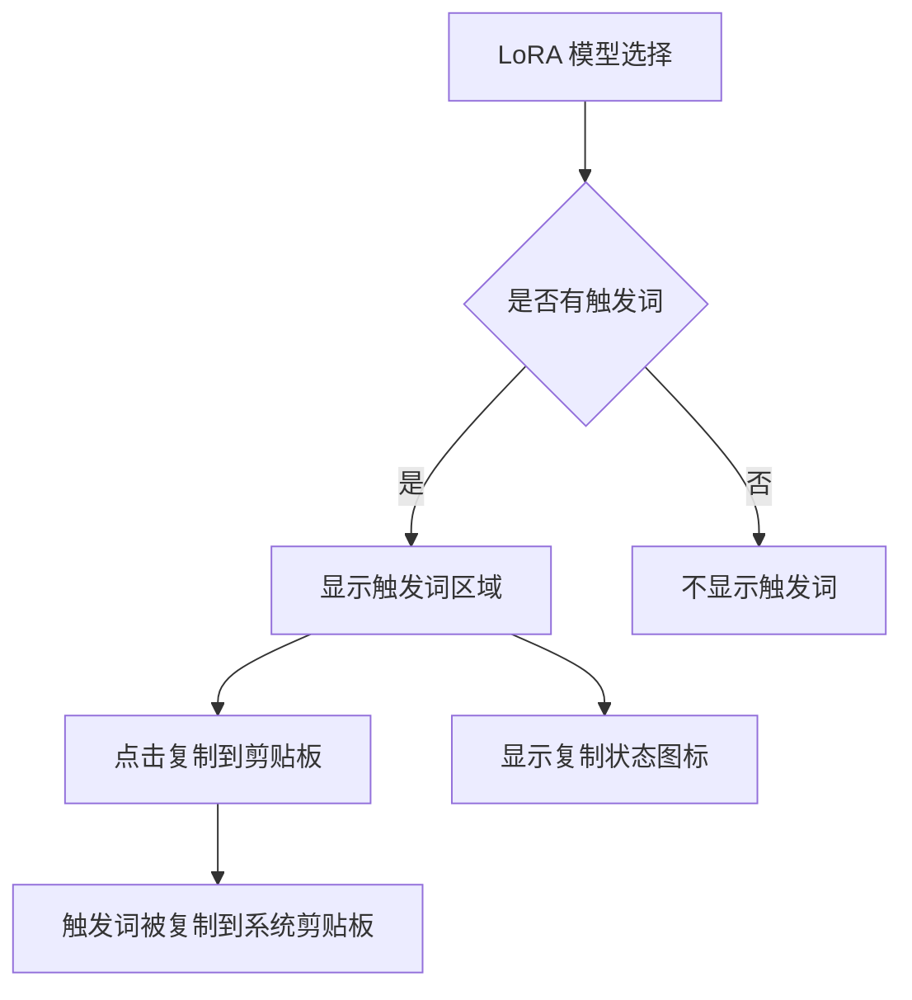

**图表来源**
- [Text2ImgSidebar.tsx:466-478](file://client/src/components/Text2ImgSidebar.tsx#L466-L478)

**章节来源**
- [modelMeta.ts:149-186](file://server/src/routes/modelMeta.ts#L149-L186)
- [useModelMetadata.ts:120-156](file://client/src/hooks/useModelMetadata.ts#L120-L156)
- [ModelSelect.tsx:104-109](file://client/src/components/ModelSelect.tsx#L104-L109)
- [Text2ImgSidebar.tsx:466-478](file://client/src/components/Text2ImgSidebar.tsx#L466-L478)

## 分类管理系统

**新增** 模型分类管理系统为用户提供了强大的模型组织能力，支持为模型设置分类标签并进行智能筛选。

### 分类数据结构

分类系统使用以下数据结构存储：

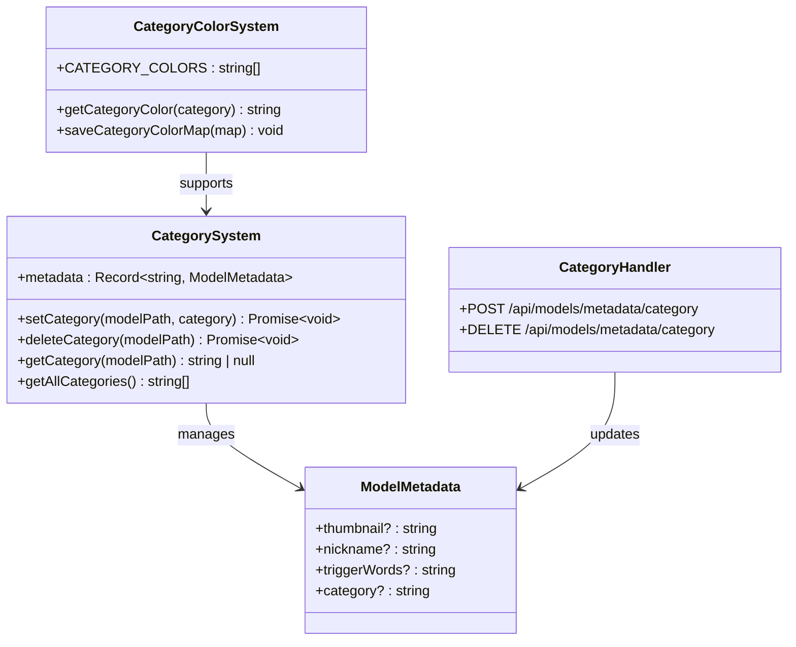

**图表来源**
- [modelMeta.ts:188-225](file://server/src/routes/modelMeta.ts#L188-L225)
- [useModelMetadata.ts:162-199](file://client/src/hooks/useModelMetadata.ts#L162-L199)

### 分类管理流程

#### 分类颜色系统
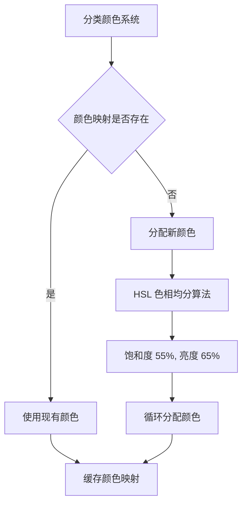

**图表来源**
- [ModelSelect.tsx:8-71](file://client/src/components/ModelSelect.tsx#L8-L71)

#### 右键菜单操作
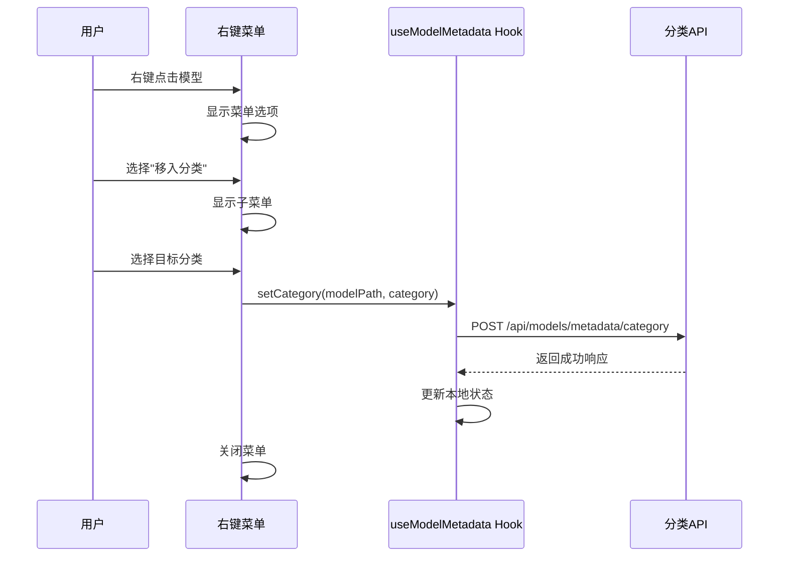

**图表来源**
- [ModelSelect.tsx:800-911](file://client/src/components/ModelSelect.tsx#L800-L911)

### 分类筛选和显示

#### 分类筛选功能
```mermaid
flowchart TD
A[模型列表] --> B{是否有分类}
B --> |是| C[显示分类筛选条]
B --> |否| D[不显示筛选条]
C --> E[点击分类标签]
E --> F[按分类过滤模型]
F --> G[显示对应模型列表]
H[未分类模型] --> I[特殊显示]
I --> J[显示在"未分类"标签下]
```

**图表来源**
- [ModelSelect.tsx:585-618](file://client/src/components/ModelSelect.tsx#L585-L618)

**章节来源**
- [modelMeta.ts:188-225](file://server/src/routes/modelMeta.ts#L188-L225)
- [useModelMetadata.ts:162-199](file://client/src/hooks/useModelMetadata.ts#L162-L199)
- [ModelSelect.tsx:8-71](file://client/src/components/ModelSelect.tsx#L8-L71)
- [ModelSelect.tsx:585-618](file://client/src/components/ModelSelect.tsx#L585-L618)

## 自动填充系统

**新增** 自动填充系统是本次更新的重要功能，能够基于文件命名约定智能生成模型元数据。

### 自动填充数据结构

自动填充系统使用以下数据结构处理元数据：

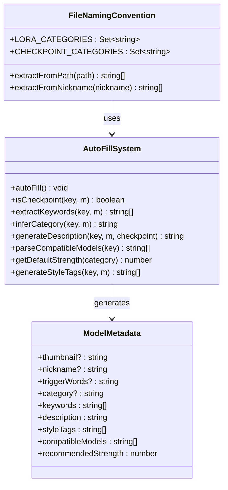

**图表来源**
- [autoFillMetadata.ts:22-257](file://server/src/scripts/autoFillMetadata.ts#L22-L257)

### 自动填充流程

#### 智能识别流程
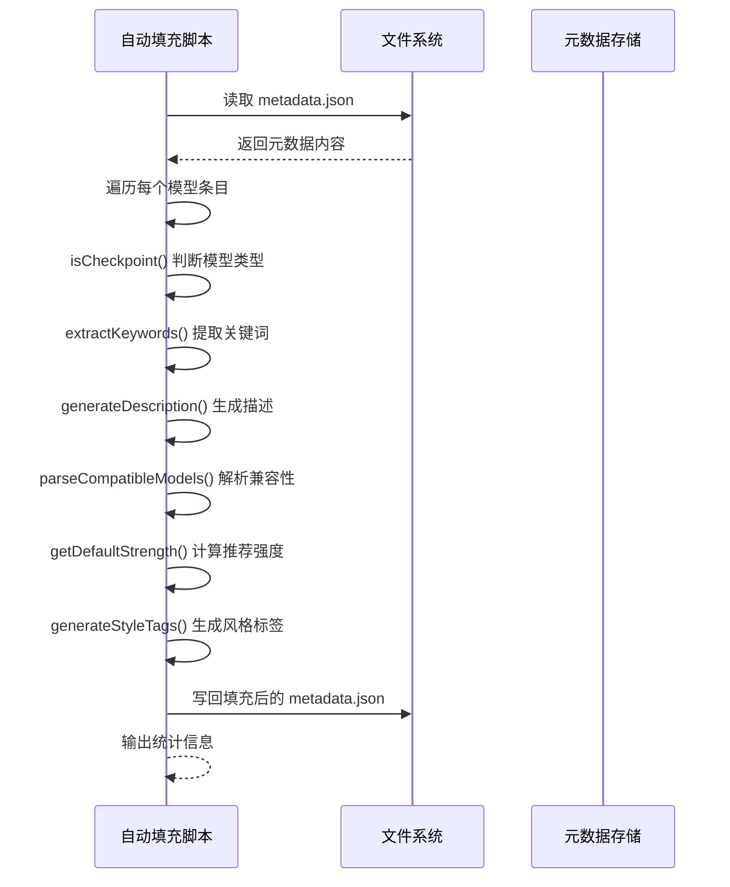

**图表来源**
- [autoFillMetadata.ts:201-257](file://server/src/scripts/autoFillMetadata.ts#L201-L257)

#### 文件命名约定识别
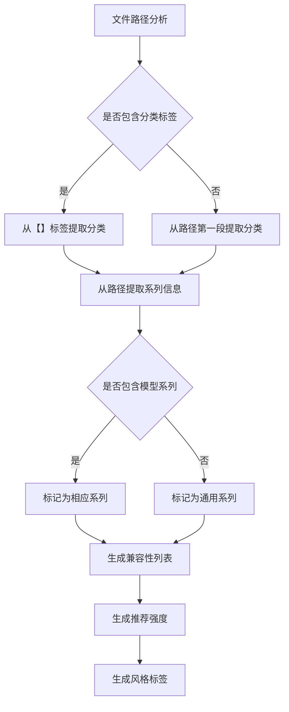

**图表来源**
- [autoFillMetadata.ts:87-198](file://server/src/scripts/autoFillMetadata.ts#L87-L198)

### 自动填充功能

#### 关键词提取
自动填充系统能够从以下来源提取关键词：
- 模型昵称中的纯名称
- 括号内容中的描述信息
- 文件路径中的【】标签
- 现有的触发词内容

#### 描述生成
根据模型类型和分类自动生成描述：
- Checkpoint 模型：生成"基础模型 - 昵称"格式
- LoRA 模型：生成"{分类}LoRA - 昵称"格式
- 包含系列信息时：添加"系列适配"说明

#### 兼容性解析
自动解析模型兼容性：
- 光辉系列：兼容"光辉"
- PONY系列：兼容"PONY"
- IL系列：兼容"IL"
- 通用系列：兼容"通用"

#### 推荐强度计算
根据分类自动设置推荐强度：
- 角色：0.8
- 姿势：0.7
- 表情：0.65
- 风格：0.6
- 性别：0.7
- 多视角：0.7
- 滑块：0.5

#### 风格标签生成
根据分类和系列自动生成风格标签：
- 角色：character，以及特定游戏系列标签
- 姿势：pose
- 表情：expression
- 风格：style
- 性别：gender
- 多视角：multi_angle
- 滑块：slider

**章节来源**
- [autoFillMetadata.ts:22-257](file://server/src/scripts/autoFillMetadata.ts#L22-L257)

## AI Agent智能增强

**新增** AI Agent智能增强功能为模型元数据提供了更丰富的描述和标签，提升了模型的智能化程度。

### 智能增强数据结构

AI Agent增强系统扩展了元数据结构：

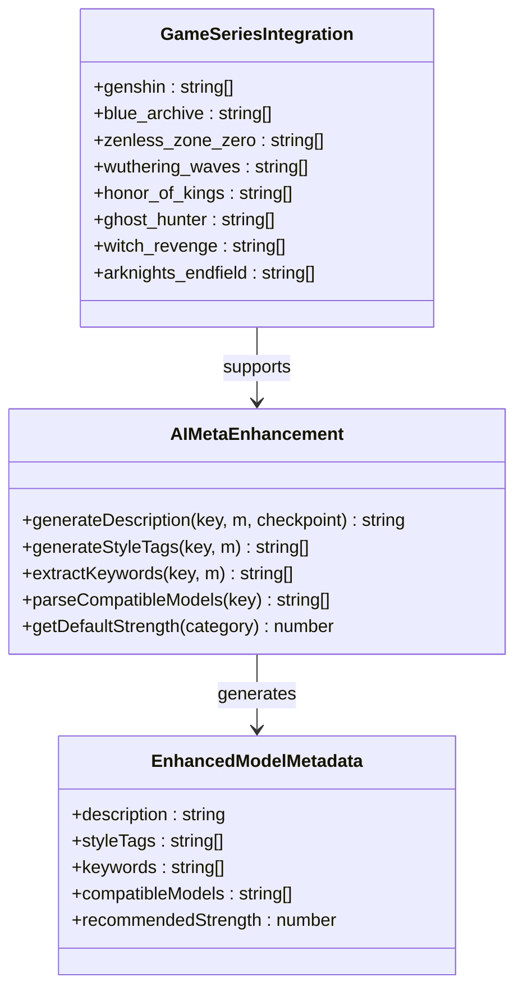

**图表来源**
- [autoFillMetadata.ts:109-198](file://server/src/scripts/autoFillMetadata.ts#L109-L198)

### 智能增强流程

#### 描述增强
AI Agent能够根据模型特征生成更详细的描述：
- 基于分类的描述模板
- 基于系列的适配说明
- 基于触发词的用途描述

#### 风格标签增强
系统能够识别并添加特定的游戏系列标签：
- 原神：genshin
- 碧蓝档案：blue_archive
- 绝区零：zenless
- 鸣潮：wuthering_waves
- 王者荣耀：honor_of_kings
- 探灵直播：ghost_hunter
- 魔女的复仇之夜：witch_revenge
- 终末地：arknights_endfield

#### 关键词增强
自动提取更多有用的关键词：
- 从触发词中提取英文关键词
- 从文件路径中提取系列前缀
- 从昵称中提取游戏名称

#### 兼容性增强
智能识别模型兼容性：
- 自动检测系列标签
- 推断默认兼容性
- 生成兼容性列表

**章节来源**
- [autoFillMetadata.ts:109-198](file://server/src/scripts/autoFillMetadata.ts#L109-L198)
- [metadata.json:809-830](file://model_meta/metadata.json#L809-L830)

## 依赖关系分析

系统各组件之间的依赖关系如下：

```mermaid
graph TB
subgraph "前端依赖"
A[useModelMetadata Hook] --> B[ModelSelect 组件]
A --> C[Text2ImgSidebar 组件]
A --> D[ZITSidebar 组件]
B --> E[React 应用]
A --> F[fetch API]
G[触发词编辑功能] --> A
H[触发词显示功能] --> A
I[分类管理功能] --> A
J[分类颜色系统] --> B
K[右键菜单功能] --> B
L[AI Agent 增强功能] --> A
M[批量更新功能] --> A
end
subgraph "后端依赖"
N[modelMeta 路由] --> O[Express 框架]
N --> P[multer 中间件]
N --> Q[文件系统]
O --> R[Node.js 环境]
S[自动填充脚本] --> T[JSON 文件处理]
S --> U[正则表达式匹配]
S --> V[字符串处理]
end
subgraph "数据存储"
W[metadata.json] --> Q
X[thumbnails 文件夹] --> Q
B --> N
C --> N
D --> N
F --> O
G --> N
H --> N
I --> N
L --> N
M --> N
S --> W
```

**图表来源**
- [index.ts:11-11](file://server/src/index.ts#L11-L11)
- [index.ts:70-71](file://server/src/index.ts#L70-L71)

**章节来源**
- [index.ts:11-71](file://server/src/index.ts#L11-L71)

## 性能考虑

### 文件存储优化
- **缓存策略**: 前端使用 React 状态缓存元数据，减少重复请求
- **懒加载**: 缩略图仅在需要时加载，提升页面性能
- **文件清理**: 自动清理不再使用的缩略图文件，控制存储空间
- **触发词缓存**: 触发词信息在本地缓存，避免重复网络请求
- **分类颜色缓存**: 分类颜色映射存储在本地，避免重复计算
- **AI Agent 缓存**: 智能生成的内容可缓存以提升性能

### 网络传输优化
- **增量更新**: 只更新受影响的模型元数据，而非整页刷新
- **错误恢复**: 网络请求失败时保持应用可用性
- **并发控制**: 防止重复的元数据请求
- **触发词批量处理**: 支持多个模型的触发词同时管理
- **分类颜色预计算**: 分类颜色在本地计算和缓存
- **批量更新优化**: 批量更新操作减少网络往返次数

### 内存管理
- **状态清理**: 组件卸载时自动清理相关状态
- **文件句柄**: 及时关闭文件描述符，防止内存泄漏
- **触发词状态管理**: 优化触发词状态的内存使用
- **分类颜色映射**: 使用本地存储优化颜色分配性能
- **自动填充缓存**: 智能填充结果可缓存以减少重复计算

### 自动填充性能
- **异步处理**: 自动填充脚本异步执行，不影响主应用性能
- **增量填充**: 支持增量填充，只处理缺失的字段
- **正则表达式优化**: 使用高效的正则表达式进行模式匹配
- **文件系统缓存**: 读取元数据文件时利用系统缓存

## 故障排除指南

### 常见问题及解决方案

#### 1. 缩略图上传失败
**症状**: 上传缩略图后无法显示或返回错误
**可能原因**:
- 文件格式不支持
- 磁盘空间不足
- 权限问题

**解决步骤**:
1. 检查文件格式是否为支持的类型（jpg, jpeg, png, webp, gif）
2. 确认磁盘空间充足
3. 验证文件写入权限

#### 2. 元数据无法加载
**症状**: 页面显示空列表或加载指示器持续显示
**可能原因**:
- 服务器未启动
- 网络连接问题
- JSON 文件损坏

**解决步骤**:
1. 确认服务器正常运行
2. 检查网络连接状态
3. 验证 metadata.json 文件完整性

#### 3. 收藏功能异常
**症状**: 收藏的模型无法保存或丢失
**可能原因**:
- 浏览器存储限制
- 本地存储损坏

**解决步骤**:
1. 清除浏览器缓存
2. 检查本地存储容量
3. 重新添加收藏

#### 4. 触发词功能异常
**症状**: 触发词无法设置、删除或显示
**可能原因**:
- 触发词 API 未正确配置
- 网络连接问题
- 元数据文件权限问题

**解决步骤**:
1. 检查 /api/models/metadata/trigger-words 端点是否可达
2. 确认网络连接正常
3. 验证 metadata.json 文件的写入权限
4. 检查浏览器控制台是否有错误信息

#### 5. 分类功能异常
**症状**: 分类无法设置、删除或显示
**可能原因**:
- 分类 API 未正确配置
- 右键菜单功能异常
- 分类颜色系统问题

**解决步骤**:
1. 检查 /api/models/metadata/category 端点是否可达
2. 确认右键菜单功能正常
3. 验证分类颜色映射是否正确
4. 检查浏览器控制台是否有错误信息

#### 6. 自动填充功能异常
**症状**: 自动填充脚本无法运行或填充结果不正确
**可能原因**:
- Node.js 环境问题
- TypeScript 编译错误
- 文件权限问题
- 正则表达式匹配失败

**解决步骤**:
1. 确认 Node.js 环境已安装并可执行
2. 检查 TypeScript 编译是否成功
3. 验证 metadata.json 文件的读写权限
4. 检查正则表达式模式是否正确
5. 查看控制台输出的错误信息

#### 7. AI Agent 增强功能异常
**症状**: 智能生成的描述、标签或强度不正确
**可能原因**:
- 文件命名约定不符合预期
- 正则表达式匹配错误
- 分类识别逻辑问题

**解决步骤**:
1. 检查文件路径是否符合命名约定
2. 验证正则表达式模式
3. 确认分类识别逻辑
4. 手动调整元数据以修正错误

**章节来源**
- [modelMeta.ts:18-26](file://server/src/routes/modelMeta.ts#L18-L26)
- [useModelMetadata.ts:17-19](file://client/src/hooks/useModelMetadata.ts#L17-L19)
- [autoFillMetadata.ts:1-257](file://server/src/scripts/autoFillMetadata.ts#L1-257)

## 结论

模型元数据管理系统为 CorineKit Pix2Real 项目提供了完整的模型管理解决方案。通过精心设计的架构和用户友好的界面，该系统有效地解决了 AI 模型组织和识别的问题。

**更新** 本次更新显著增强了系统的功能，特别是新增的 LoRA 触发词管理系统、模型分类管理系统和自动填充系统，为用户提供了更强大的模型管理能力。自动填充脚本的引入使得系统能够基于文件命名约定智能生成元数据，包括模型描述、风格标签、兼容性信息和推荐强度等，大大提升了模型管理的自动化程度和智能化水平。

### 主要优势

1. **易用性**: 直观的 UI 设计和丰富的交互功能，包括触发词编辑、分类管理和 AI Agent 增强
2. **可靠性**: 完善的错误处理和数据验证机制
3. **扩展性**: 模块化的架构设计便于功能扩展
4. **性能**: 优化的文件存储和网络传输策略
5. **专业性**: 专业的 LoRA 触发词管理和分类管理功能
6. **智能化**: 触发词、分类和自动填充功能的智能集成，提升生成质量
7. **自动化**: 自动填充脚本减少手动维护工作量
8. **AI 增强**: 智能生成的描述和标签提升模型理解度

### 技术亮点

- **前后端分离**: 清晰的职责划分和独立的开发流程
- **响应式设计**: 适应不同设备和屏幕尺寸
- **状态管理**: 有效的状态同步和缓存策略
- **文件处理**: 安全的文件上传和存储机制
- **触发词系统**: 专业的 LoRA 触发词管理功能
- **分类系统**: 智能的模型分类和筛选功能
- **右键菜单**: 便捷的分类操作和管理功能
- **颜色系统**: 可视化的分类标识和组织方式
- **多组件集成**: 触发词、分类和 AI Agent 功能在多个界面组件中得到集成
- **自动填充**: 基于文件命名约定的智能元数据生成
- **AI 增强**: 智能生成的描述、标签和兼容性信息
- **批量更新**: 支持批量更新元数据字段

该系统不仅提升了用户体验，还为项目的长期发展奠定了坚实的技术基础。通过持续的优化和功能扩展，模型元数据管理功能将继续为用户提供更好的服务。