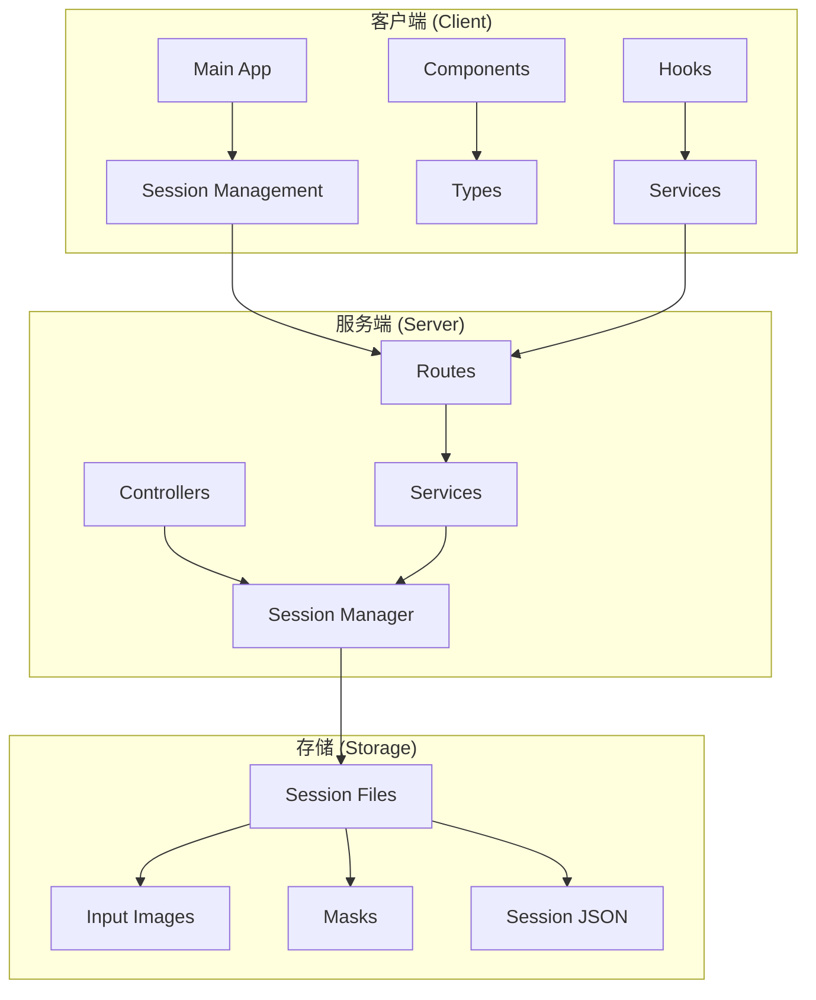
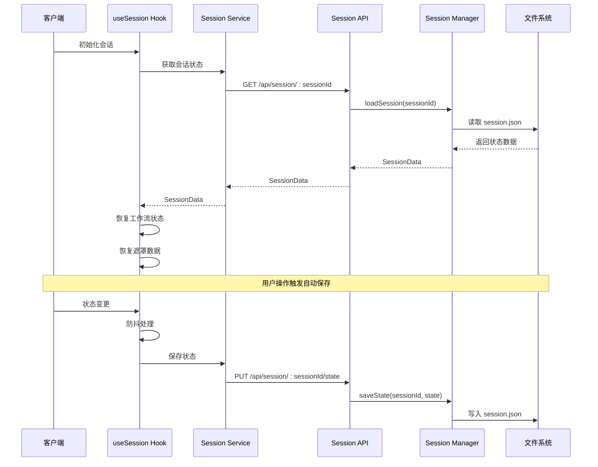
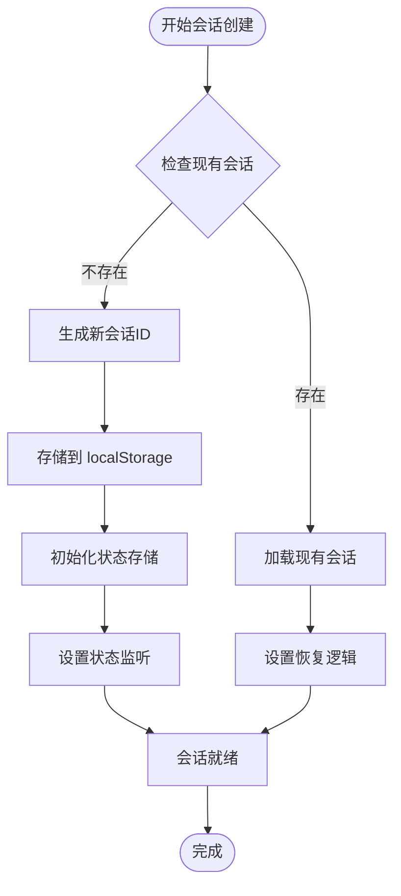
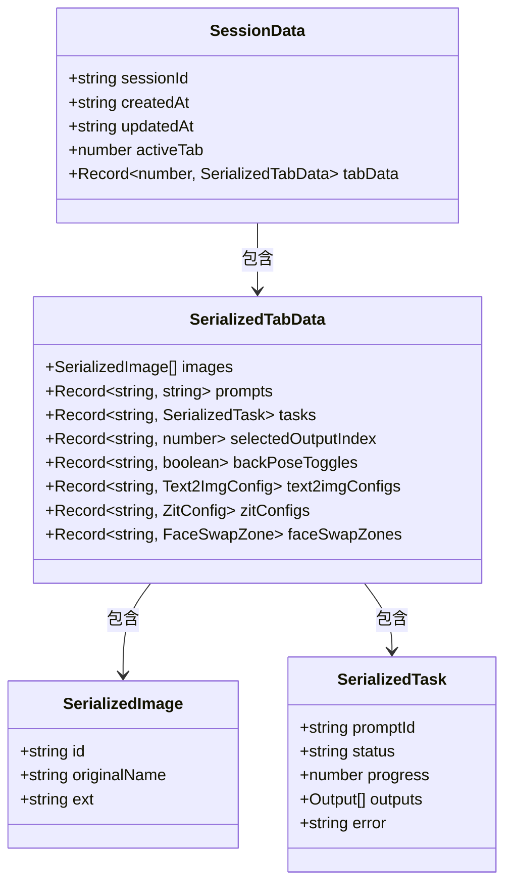
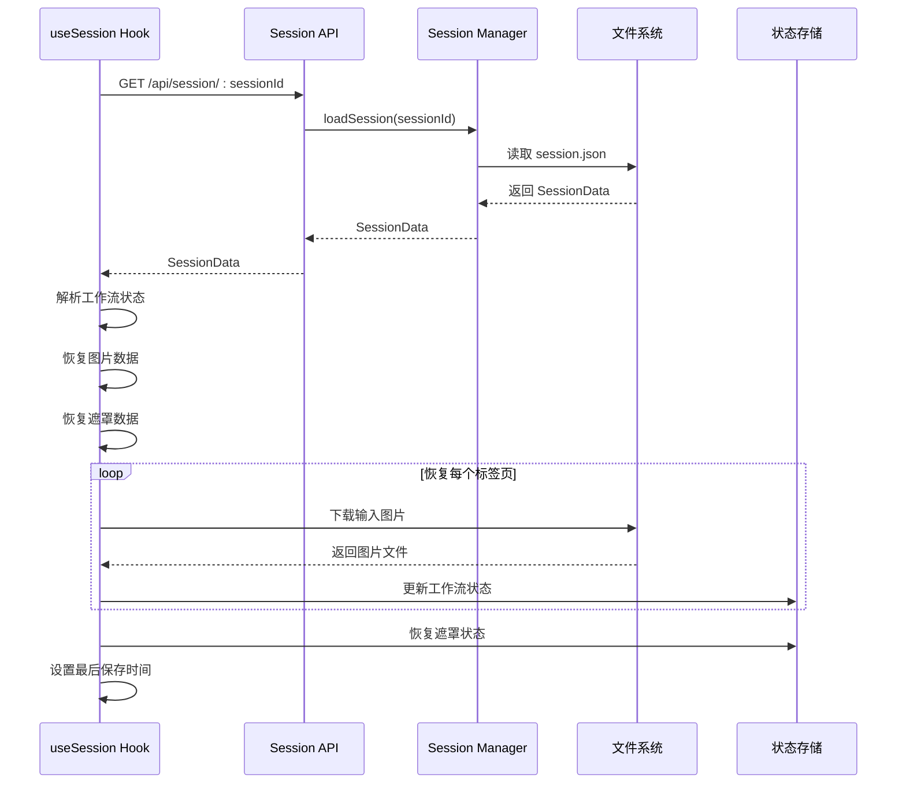
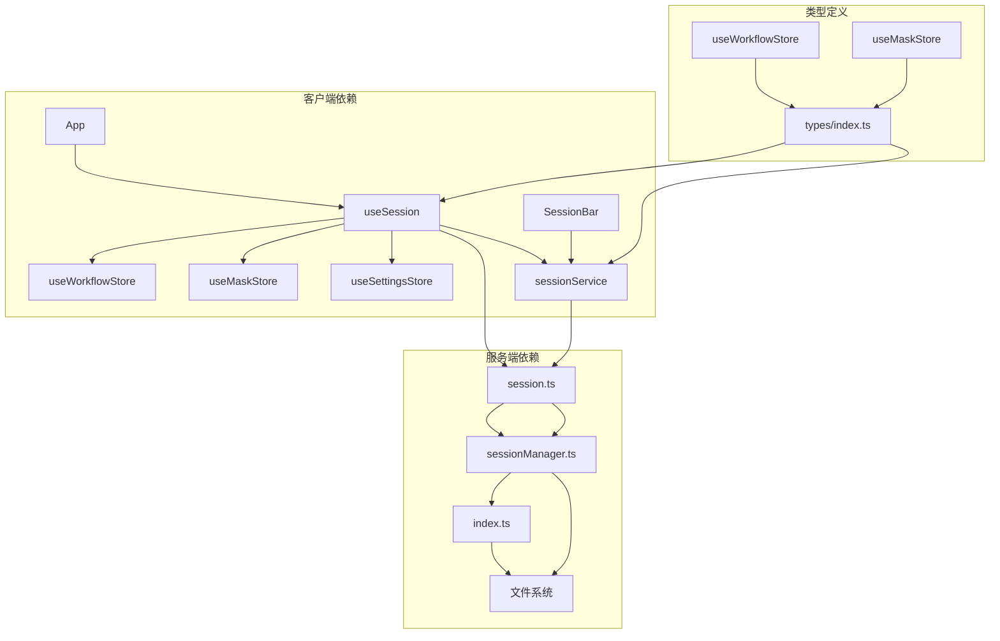

# 会话状态管理

<cite>
**本文档引用的文件**
- [useSession.ts](file://client/src/hooks/useSession.ts)
- [sessionService.ts](file://client/src/services/sessionService.ts)
- [session.ts](file://server/src/routes/session.ts)
- [sessionManager.ts](file://server/src/services/sessionManager.ts)
- [useWorkflowStore.ts](file://client/src/hooks/useWorkflowStore.ts)
- [useMaskStore.ts](file://client/src/hooks/useMaskStore.ts)
- [useSettingsStore.ts](file://client/src/hooks/useSettingsStore.ts)
- [index.ts](file://server/src/index.ts)
- [index.ts](file://client/src/types/index.ts)
- [SessionBar.tsx](file://client/src/components/SessionBar.tsx)
- [App.tsx](file://client/src/components/App.tsx)
- [TODO-session-persistence.md](file://TODO-session-persistence.md)
</cite>

## 目录
1. [简介](#简介)
2. [项目结构](#项目结构)
3. [核心组件](#核心组件)
4. [架构概览](#架构概览)
5. [详细组件分析](#详细组件分析)
6. [依赖关系分析](#依赖关系分析)
7. [性能考虑](#性能考虑)
8. [故障排除指南](#故障排除指南)
9. [结论](#结论)

## 简介

Pix2Real 是一个基于 Web 的图像处理应用，支持多种工作流（如二次元转真人、真人精修、视频生成等）。会话状态管理是该系统的核心功能之一，负责在用户关闭/重新打开浏览器后自动恢复上次的工作状态。

该系统实现了完整的会话生命周期管理，包括会话创建、状态保存、会话恢复、数据序列化和反序列化等功能。系统采用前后端分离的架构设计，前端使用 React 和 Zustand 状态管理，后端使用 Express 和 Node.js。

## 项目结构

项目采用模块化的文件组织结构，主要分为以下几个部分：

**图表来源**
- [useSession.ts:1-422](file://client/src/hooks/useSession.ts#L1-L422)
- [sessionService.ts:1-134](file://client/src/services/sessionService.ts#L1-L134)
- [session.ts:1-95](file://server/src/routes/session.ts#L1-L95)
- [sessionManager.ts:1-164](file://server/src/services/sessionManager.ts#L1-L164)

**章节来源**
- [useSession.ts:1-422](file://client/src/hooks/useSession.ts#L1-L422)
- [sessionService.ts:1-134](file://client/src/services/sessionService.ts#L1-L134)
- [session.ts:1-95](file://server/src/routes/session.ts#L1-L95)
- [sessionManager.ts:1-164](file://server/src/services/sessionManager.ts#L1-L164)

## 核心组件

### 会话状态钩子 (useSession)

`useSession` 是会话管理的核心钩子，负责协调整个会话生命周期：

- **会话标识管理**: 使用 localStorage 存储会话 ID，支持自动生成和恢复
- **状态序列化**: 将工作流状态转换为可持久化的格式
- **文件上传**: 处理输入图片和遮罩的异步上传
- **自动保存**: 实现防抖机制的自动状态保存
- **会话恢复**: 支持从服务器恢复完整的工作状态

### 会话服务 (sessionService)

提供类型安全的 API 封装，定义了会话数据的结构和操作方法：

- **SessionData**: 完整的会话状态结构
- **SerializedTabData**: 序列化后的标签页数据
- **API 方法**: 图片上传、遮罩保存、状态持久化等

### 会话管理器 (sessionManager)

后端服务负责实际的文件系统操作：

- **目录管理**: 确保会话目录结构的完整性
- **文件存储**: 处理输入图片、输出文件和遮罩的存储
- **状态持久化**: 管理 session.json 文件的读写
- **会话清理**: 提供会话列表和删除功能

**章节来源**
- [useSession.ts:108-422](file://client/src/hooks/useSession.ts#L108-L422)
- [sessionService.ts:30-134](file://client/src/services/sessionService.ts#L30-L134)
- [sessionManager.ts:61-164](file://server/src/services/sessionManager.ts#L61-L164)

## 架构概览

系统采用分层架构设计，实现了清晰的关注点分离：

**图表来源**
- [useSession.ts:290-387](file://client/src/hooks/useSession.ts#L290-L387)
- [session.ts:51-68](file://server/src/routes/session.ts#L51-L68)
- [sessionManager.ts:91-110](file://server/src/services/sessionManager.ts#L91-L110)

## 详细组件分析

### 会话创建流程

会话创建是一个多步骤的过程，涉及客户端和服务器端的协调：

**图表来源**
- [useSession.ts:268-288](file://client/src/hooks/useSession.ts#L268-L288)
- [useSession.ts:116-124](file://client/src/hooks/useSession.ts#L116-L124)

### 状态序列化机制

系统实现了智能的状态序列化，确保只保存必要的数据：

**图表来源**
- [sessionService.ts:61-67](file://client/src/services/sessionService.ts#L61-L67)
- [sessionService.ts:50-59](file://client/src/services/sessionService.ts#L50-L59)
- [sessionService.ts:36-48](file://client/src/services/sessionService.ts#L36-L48)

### 数据持久化策略

系统采用了多层次的数据持久化策略：

| 数据类型 | 存储位置 | 序列化方式 | 生命周期 |
|---------|----------|-----------|----------|
| 工作流状态 | session.json | JSON | 完整状态快照 |
| 输入图片 | sessions/:id/tab-:tab/input/ | 文件系统 | 永久存储 |
| 输出文件 | sessions/:id/tab-:tab/output/ | 文件系统 | 永久存储 |
| 遮罩数据 | sessions/:id/tab-:tab/masks/ | PNG 文件 | 永久存储 |
| 用户设置 | localStorage | JSON | 浏览器持久 |

**章节来源**
- [useSession.ts:138-162](file://client/src/hooks/useSession.ts#L138-L162)
- [sessionManager.ts:91-110](file://server/src/services/sessionManager.ts#L91-L110)
- [TODO-session-persistence.md:13-26](file://TODO-session-persistence.md#L13-L26)

### 会话恢复流程

会话恢复是一个复杂的多阶段过程：

**图表来源**
- [useSession.ts:305-384](file://client/src/hooks/useSession.ts#L305-L384)
- [session.ts:70-79](file://server/src/routes/session.ts#L70-L79)
- [sessionManager.ts:112-120](file://server/src/services/sessionManager.ts#L112-L120)

**章节来源**
- [useSession.ts:315-366](file://client/src/hooks/useSession.ts#L315-L366)
- [sessionService.ts:115-121](file://client/src/services/sessionService.ts#L115-L121)

### 并发访问控制

系统实现了多重并发控制机制：

1. **React StrictMode 防护**: 使用 `_switchIntentConsumed` 标志防止双重初始化
2. **恢复状态标志**: `isRestoring` 防止恢复期间的状态保存
3. **防抖机制**: 500ms 防抖避免频繁保存
4. **上传去重**: `uploadedImages` 和 `savedMasks` 集合避免重复上传

**章节来源**
- [useSession.ts:23-27](file://client/src/hooks/useSession.ts#L23-L27)
- [useSession.ts:135-136](file://client/src/hooks/useSession.ts#L135-L136)
- [useSession.ts:177-181](file://client/src/hooks/useSession.ts#L177-L181)
- [useSession.ts:194-197](file://client/src/hooks/useSession.ts#L194-L197)

## 依赖关系分析

系统各组件之间的依赖关系如下：

**图表来源**
- [useSession.ts:4-16](file://client/src/hooks/useSession.ts#L4-L16)
- [session.ts:1-13](file://server/src/routes/session.ts#L1-L13)
- [index.ts:10-12](file://server/src/index.ts#L10-L12)

**章节来源**
- [useSession.ts:1-16](file://client/src/hooks/useSession.ts#L1-L16)
- [session.ts:1-13](file://server/src/routes/session.ts#L1-L13)
- [index.ts:10-12](file://server/src/index.ts#L10-L12)

## 性能考虑

### 优化策略

1. **防抖保存**: 500ms 防抖减少不必要的网络请求
2. **增量更新**: 只保存发生变化的状态部分
3. **文件缓存**: 使用 Blob URL 缓存图片预览
4. **懒加载**: 遮罩文件按需下载

### 内存管理

- 自动清理过期的 Blob URL
- 及时释放图片预览资源
- 控制同时进行的上传任务数量

### 网络优化

- 使用 FormData 进行文件上传
- 实现断点续传支持
- 错误重试机制

## 故障排除指南

### 常见问题及解决方案

| 问题类型 | 症状 | 可能原因 | 解决方案 |
|---------|------|---------|----------|
| 会话恢复失败 | 页面空白或部分数据丢失 | session.json 损坏 | 删除损坏的会话文件 |
| 图片上传失败 | 上传进度卡住 | 网络连接问题 | 检查网络连接，重新上传 |
| 遮罩数据丢失 | 遮罩编辑后数据消失 | 遮罩文件未正确保存 | 检查文件权限，重新绘制遮罩 |
| 状态不同步 | 工作流状态与界面不一致 | 状态监听异常 | 刷新页面，重新初始化会话 |

### 调试技巧

1. **检查浏览器控制台**: 查看网络请求和错误信息
2. **验证文件权限**: 确保 sessions 目录可读写
3. **监控存储空间**: 检查磁盘空间是否充足
4. **查看日志文件**: 分析服务器端错误日志

**章节来源**
- [useSession.ts:172-174](file://client/src/hooks/useSession.ts#L172-L174)
- [useSession.ts:380-383](file://client/src/hooks/useSession.ts#L380-L383)

## 结论

Pix2Real 的会话状态管理系统实现了完整的生命周期管理，包括会话创建、状态保存、会话恢复等功能。系统采用前后端分离的架构设计，通过智能的序列化机制和多层次的持久化策略，确保了数据的安全性和可靠性。

该系统的主要优势包括：

1. **完整的状态恢复**: 支持工作流状态、图片数据、遮罩数据的完整恢复
2. **智能序列化**: 只保存必要的数据，避免冗余存储
3. **并发控制**: 多重机制防止并发访问冲突
4. **错误处理**: 完善的错误处理和恢复机制
5. **性能优化**: 防抖、缓存等优化策略提升用户体验

未来可以考虑的改进方向包括：

1. **增量备份**: 实现更细粒度的数据变更跟踪
2. **云同步**: 支持跨设备的会话数据同步
3. **版本控制**: 提供会话历史版本管理功能
4. **压缩存储**: 实现数据压缩以节省存储空间