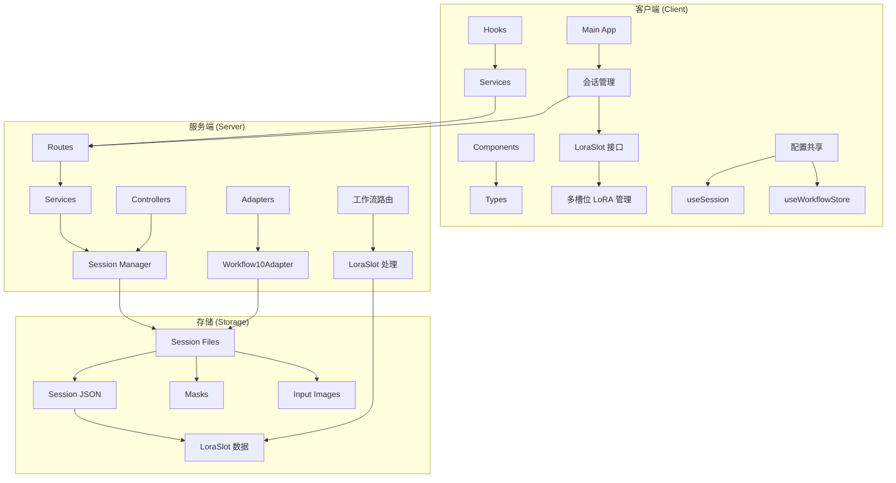
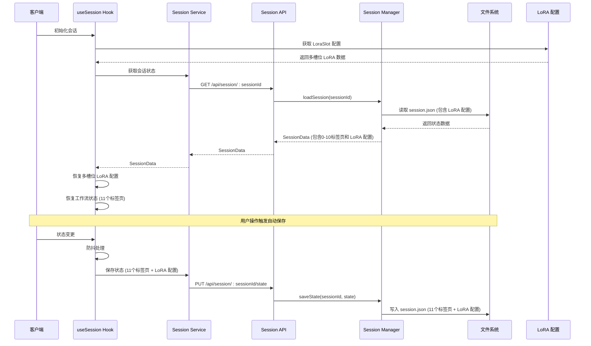
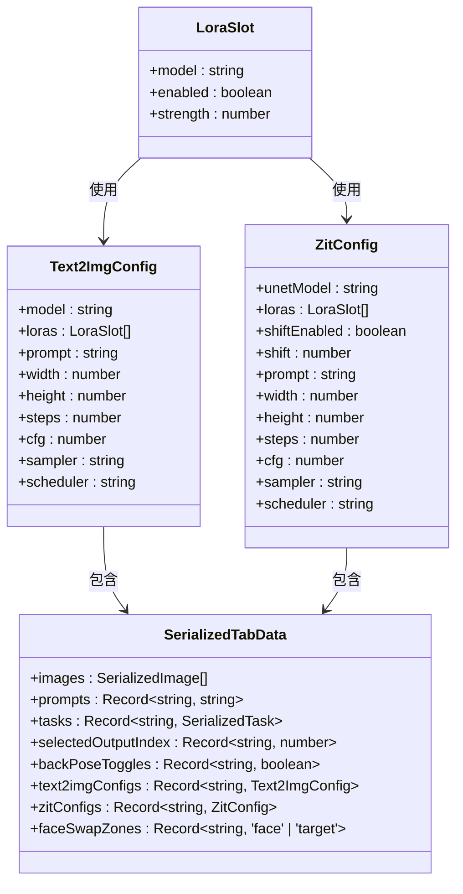
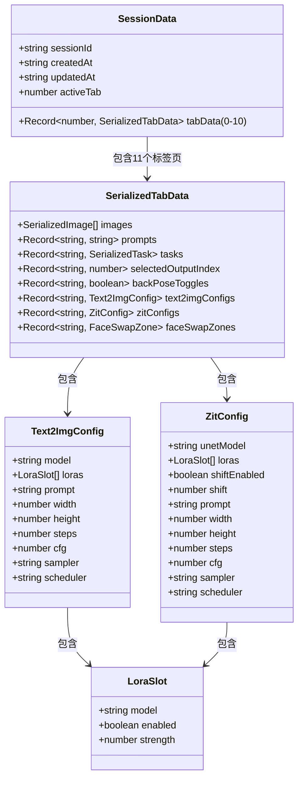
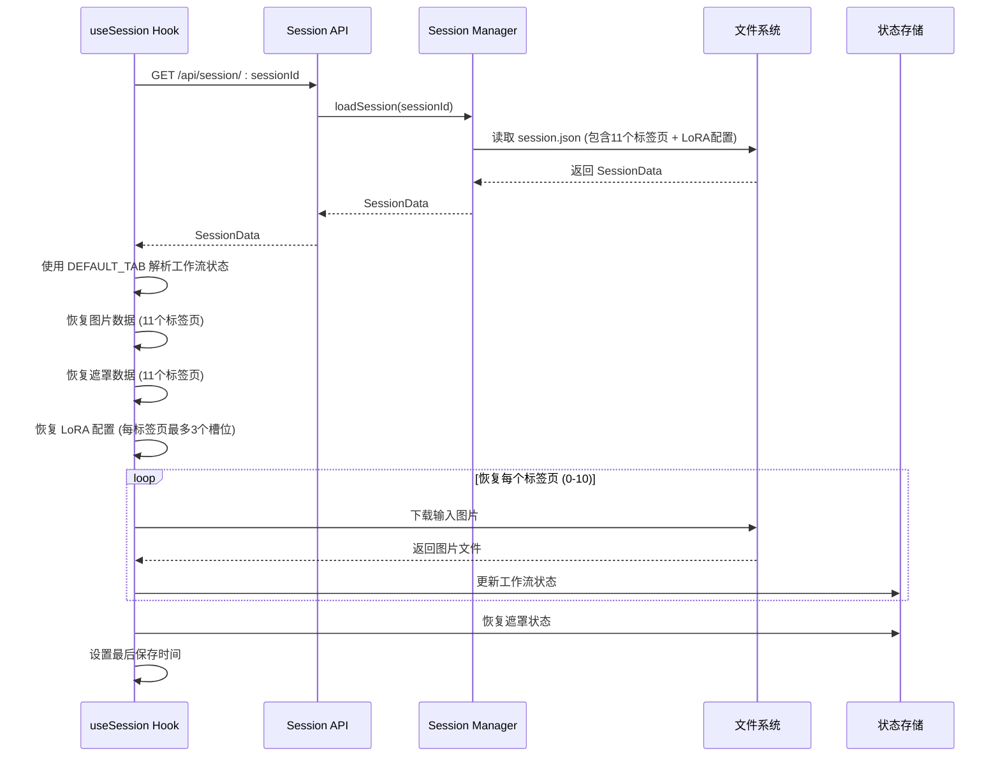
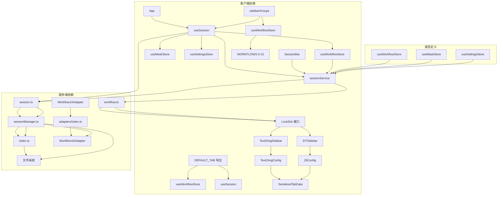

# 会话状态管理

<cite>
**本文档引用的文件**
- [useSession.ts](file://client/src/hooks/useSession.ts)
- [useWorkflowStore.ts](file://client/src/hooks/useWorkflowStore.ts)
- [sidebarGroups.ts](file://client/src/data/sidebarGroups.ts)
- [sessionService.ts](file://client/src/services/sessionService.ts)
- [session.ts](file://server/src/routes/session.ts)
- [sessionManager.ts](file://server/src/services/sessionManager.ts)
- [useMaskStore.ts](file://client/src/hooks/useMaskStore.ts)
- [useSettingsStore.ts](file://client/src/hooks/useSettingsStore.ts)
- [index.ts](file://server/src/index.ts)
- [index.ts](file://client/src/types/index.ts)
- [SessionBar.tsx](file://client/src/components/SessionBar.tsx)
- [App.tsx](file://client/src/components/App.tsx)
- [TODO-session-persistence.md](file://TODO-session-persistence.md)
- [Workflow10Adapter.ts](file://server/src/adapters/Workflow10Adapter.ts)
- [index.ts](file://server/src/adapters/index.ts)
- [ZITSidebar.tsx](file://client/src/components/ZITSidebar.tsx)
- [Text2ImgSidebar.tsx](file://client/src/components/Text2ImgSidebar.tsx)
- [workflow.ts](file://server/src/routes/workflow.ts)
</cite>

## 更新摘要
**所做更改**
- 新增 LoraSlot 接口定义，支持多槽位 LoRA 管理
- 更新会话数据结构以支持 LoRA 槽位数组管理
- 增强文本生成和 ZIT 工作流的 LoRA 配置持久化
- 更新工作流模板以支持多 LoRA 槽位的动态连接
- 添加 LoRA 槽位的启用状态和强度属性管理

## 目录
1. [简介](#简介)
2. [项目结构](#项目结构)
3. [核心组件](#核心组件)
4. [架构概览](#架构概览)
5. [详细组件分析](#详细组件分析)
6. [依赖关系分析](#依赖关系分析)
7. [性能考虑](#性能考虑)
8. [故障排除指南](#故障排除指南)
9. [结论](#结论)

## 简介

Pix2Real 是一个基于 Web 的图像处理应用，支持多种工作流（如二次元转真人、真人精修、视频生成等）。会话状态管理是该系统的核心功能之一，负责在用户关闭/重新打开浏览器后自动恢复上次的工作状态。

该系统实现了完整的会话生命周期管理，包括会话创建、状态保存、会话恢复、数据序列化和反序列化等功能。系统采用前后端分离的架构设计，前端使用 React 和 Zustand 状态管理，后端使用 Express 和 Node.js。

**更新** 系统现已引入 LoraSlot 接口，从单 LoRA 模型支持升级为多槽位 LoRA 管理。这一重大更新支持最多三个 LoRA 槽位，每个槽位包含模型名称、启用状态和强度属性，为用户提供了更灵活的 LoRA 管理能力。

## 项目结构

项目采用模块化的文件组织结构，主要分为以下几个部分：



**图表来源**
- [useSession.ts:1-425](file://client/src/hooks/useSession.ts#L1-L425)
- [useWorkflowStore.ts:1-690](file://client/src/hooks/useWorkflowStore.ts#L1-L690)
- [sidebarGroups.ts:1-14](file://client/src/data/sidebarGroups.ts#L1-L14)
- [sessionService.ts:1-140](file://client/src/services/sessionService.ts#L1-L140)
- [session.ts:1-95](file://server/src/routes/session.ts#L1-L95)
- [sessionManager.ts:1-164](file://server/src/services/sessionManager.ts#L1-L164)
- [Workflow10Adapter.ts:1-15](file://server/src/adapters/Workflow10Adapter.ts#L1-L15)
- [workflow.ts:328-357](file://server/src/routes/workflow.ts#L328-L357)

**章节来源**
- [useSession.ts:1-425](file://client/src/hooks/useSession.ts#L1-L425)
- [useWorkflowStore.ts:1-690](file://client/src/hooks/useWorkflowStore.ts#L1-L690)
- [sidebarGroups.ts:1-14](file://client/src/data/sidebarGroups.ts#L1-L14)
- [sessionService.ts:1-140](file://client/src/services/sessionService.ts#L1-L140)
- [session.ts:1-95](file://server/src/routes/session.ts#L1-L95)
- [sessionManager.ts:1-164](file://server/src/services/sessionManager.ts#L1-L164)

## 核心组件

### 会话状态钩子 (useSession)

`useSession` 是会话管理的核心钩子，负责协调整个会话生命周期：

- **会话标识管理**: 使用 localStorage 存储会话 ID，支持自动生成和恢复
- **状态序列化**: 将工作流状态转换为可持久化的格式，支持0-10标签页范围
- **文件上传**: 处理输入图片和遮罩的异步上传
- **自动保存**: 实现防抖机制的自动状态保存
- **会话恢复**: 支持从服务器恢复完整的工作状态，包括新的标签页数据
- **默认标签页初始化**: 使用 DEFAULT_TAB 导出确保会话恢复时的正确标签页状态
- **LoRA 配置管理**: 支持多槽位 LoRA 配置的序列化和反序列化

### LoraSlot 接口定义

**新增** LoraSlot 接口定义了多槽位 LoRA 管理的核心数据结构：

- **model**: 字符串类型，表示 LoRA 模型名称
- **enabled**: 布尔类型，表示 LoRA 槽位是否启用
- **strength**: 数字类型，表示 LoRA 强度，范围0-2，默认1，步长0.05

### 会话服务 (sessionService)

提供类型安全的 API 封装，定义了会话数据的结构和操作方法：

- **LoraSlot 接口**: 新增多槽位 LoRA 管理接口
- **Text2ImgConfig**: 包含 loras 属性的文本生成配置
- **ZitConfig**: 包含 loras 属性的 ZIT 配置
- **SerializedTabData**: 支持 LoRA 配置的序列化数据结构
- **SessionData**: 完整的会话状态结构，支持扩展的标签页范围

### 会话管理器 (sessionManager)

后端服务负责实际的文件系统操作：

- **目录管理**: 确保会话目录结构的完整性，支持0-10标签页
- **文件存储**: 处理输入图片、输出文件和遮罩的存储
- **状态持久化**: 管理 session.json 文件的读写，包含 LoRA 配置
- **会话清理**: 提供会话列表和删除功能

**更新** 会话管理器现已支持扩展的标签页ID范围和 LoRA 配置的持久化。

**章节来源**
- [useSession.ts:108-425](file://client/src/hooks/useSession.ts#L108-L425)
- [sessionService.ts:4-8](file://client/src/services/sessionService.ts#L4-L8)
- [sessionService.ts:10-34](file://client/src/services/sessionService.ts#L10-L34)
- [sessionService.ts:56-73](file://client/src/services/sessionService.ts#L56-L73)
- [sessionManager.ts:61-164](file://server/src/services/sessionManager.ts#L61-L164)

## 架构概览

系统采用分层架构设计，实现了清晰的关注点分离。**更新** 新增了多 LoRA 槽位管理的完整架构：



**图表来源**
- [useSession.ts:290-387](file://client/src/hooks/useSession.ts#L290-L387)
- [session.ts:51-68](file://server/src/routes/session.ts#L51-L68)
- [sessionManager.ts:91-110](file://server/src/services/sessionManager.ts#L91-L110)
- [workflow.ts:328-357](file://server/src/routes/workflow.ts#L328-L357)

## 详细组件分析

### 会话创建流程

会话创建是一个多步骤的过程，涉及客户端和服务器端的协调。**更新** 现在包含了多 LoRA 槽位配置的初始化：

```mermaid
flowchart TD
Start([开始会话创建]) --> CheckExisting{检查现有会话}
CheckExisting --> |存在| LoadExisting[加载现有会话]
CheckExisting --> |不存在| GenerateId[生成新会话ID]
GenerateId --> StoreId[存储到 localStorage]
StoreId --> GetDefaultTab[获取 DEFAULT_TAB 配置]
GetDefaultTab --> InitLoraSlots[初始化 LoraSlot 配置]
InitLoraSlots --> InitStores[初始化状态存储 (11个标签页)]
InitStores --> SetupSubscriptions[设置状态监听]
SetupSubscriptions --> Ready[会话就绪]
LoadExisting --> SetupRestore[设置恢复逻辑 (11个标签页 + LoRA 配置)]
SetupRestore --> Ready
Ready --> End([完成])
```

**图表来源**
- [useSession.ts:268-288](file://client/src/hooks/useSession.ts#L268-L288)
- [sessionService.ts:35-39](file://client/src/services/sessionService.ts#L35-L39)
- [useSession.ts:116-124](file://client/src/hooks/useSession.ts#L116-L124)

### LoRA 槽位管理机制

**新增** 多槽位 LoRA 管理的核心机制：



**图表来源**
- [sessionService.ts:4-8](file://client/src/services/sessionService.ts#L4-L8)
- [sessionService.ts:10-34](file://client/src/services/sessionService.ts#L10-L34)
- [sessionService.ts:56-65](file://client/src/services/sessionService.ts#L56-L65)

### 状态序列化机制

系统实现了智能的状态序列化，确保只保存必要的数据，并支持扩展的标签页范围和 LoRA 配置：



**图表来源**
- [sessionService.ts:67-73](file://client/src/services/sessionService.ts#L67-L73)
- [sessionService.ts:56-65](file://client/src/services/sessionService.ts#L56-L65)
- [sessionService.ts:10-34](file://client/src/services/sessionService.ts#L10-L34)

### 数据持久化策略

系统采用了多层次的数据持久化策略，现已扩展支持新的标签页范围和 LoRA 配置：

| 数据类型 | 存储位置 | 序列化方式 | 生命周期 | 支持范围 |
|---------|----------|-----------|----------|----------|
| 工作流状态 | session.json | JSON | 完整状态快照 | 0-10标签页 |
| 输入图片 | sessions/:id/tab-:tab/input/ | 文件系统 | 永久存储 | 0-10标签页 |
| 输出文件 | sessions/:id/tab-:tab/output/ | 文件系统 | 永久存储 | 0-10标签页 |
| 遮罩数据 | sessions/:id/tab-:tab/masks/ | PNG 文件 | 永久存储 | 0-10标签页 |
| 用户设置 | localStorage | JSON | 浏览器持久 | 所有标签页 |
| **更新** LoRA 配置 | session.json | JSON | 完整状态快照 | 0-10标签页，每标签页最多3个槽位 |

**更新** 数据持久化策略现已扩展支持 LoRA 配置，每个标签页最多支持3个 LoRA 槽位，每个槽位包含模型、启用状态和强度信息。

**章节来源**
- [useSession.ts:138-162](file://client/src/hooks/useSession.ts#L138-L162)
- [sessionManager.ts:91-110](file://server/src/services/sessionManager.ts#L91-L110)
- [TODO-session-persistence.md:13-26](file://TODO-session-persistence.md#L13-L26)

### 会话恢复流程

会话恢复是一个复杂的多阶段过程，现已支持扩展的标签页范围和 LoRA 配置。**更新** 现在使用 DEFAULT_TAB 确保正确的标签页恢复：



**图表来源**
- [useSession.ts:305-384](file://client/src/hooks/useSession.ts#L305-L384)
- [session.ts:70-79](file://server/src/routes/session.ts#L70-L79)
- [sessionManager.ts:112-120](file://server/src/services/sessionManager.ts#L112-L120)

**章节来源**
- [useSession.ts:315-366](file://client/src/hooks/useSession.ts#L315-L366)
- [sessionService.ts:115-121](file://client/src/services/sessionService.ts#L115-L121)

### 并发访问控制

系统实现了多重并发控制机制，现已支持扩展的标签页范围和 LoRA 配置：

1. **React StrictMode 防护**: 使用 `_switchIntentConsumed` 标志防止双重初始化
2. **恢复状态标志**: `isRestoring` 防止恢复期间的状态保存
3. **防抖机制**: 500ms 防抖避免频繁保存
4. **上传去重**: `uploadedImages` 和 `savedMasks` 集合避免重复上传
5. **标签页遍历**: 统一使用0-10范围遍历所有标签页
6. **默认标签页一致性**: 使用 DEFAULT_TAB 确保会话恢复时的标签页状态一致性
7. **LoRA 配置同步**: 确保多槽位 LoRA 配置的原子性更新

**更新** 并发访问控制现已扩展支持新的标签页范围和 LoRA 配置，确保所有11个标签页的 LoRA 数据都能正确处理。

**章节来源**
- [useSession.ts:23-27](file://client/src/hooks/useSession.ts#L23-L27)
- [useSession.ts:135-136](file://client/src/hooks/useSession.ts#L135-L136)
- [useSession.ts:177-181](file://client/src/hooks/useSession.ts#L177-L181)
- [useSession.ts:194-197](file://client/src/hooks/useSession.ts#L194-L197)

## 依赖关系分析

系统各组件之间的依赖关系如下。**更新** 新增了 LoRA 槽位管理的依赖关系：



**图表来源**
- [useSession.ts:4-18](file://client/src/hooks/useSession.ts#L4-L18)
- [useWorkflowStore.ts:4](file://client/src/hooks/useWorkflowStore.ts#L4)
- [session.ts:1-13](file://server/src/routes/session.ts#L1-L13)
- [workflow.ts:328-357](file://server/src/routes/workflow.ts#L328-L357)
- [index.ts:10-12](file://server/src/index.ts#L10-L12)
- [Workflow10Adapter.ts:1-15](file://server/src/adapters/Workflow10Adapter.ts#L1-L15)
- [index.ts:1-33](file://server/src/adapters/index.ts#L1-L33)

**章节来源**
- [useSession.ts:1-18](file://client/src/hooks/useSession.ts#L1-L18)
- [useWorkflowStore.ts:1-6](file://client/src/hooks/useWorkflowStore.ts#L1-L6)
- [session.ts:1-13](file://server/src/routes/session.ts#L1-L13)
- [workflow.ts:328-357](file://server/src/routes/workflow.ts#L328-L357)
- [index.ts:10-12](file://server/src/index.ts#L10-L12)

## 性能考虑

### 优化策略

1. **防抖保存**: 500ms 防抖减少不必要的网络请求
2. **增量更新**: 只保存发生变化的状态部分
3. **文件缓存**: 使用 Blob URL 缓存图片预览
4. **懒加载**: 遮罩文件按需下载
5. **标签页优化**: 统一遍历0-10范围，避免重复计算
6. **配置缓存**: DEFAULT_TAB 配置的单次计算和缓存
7. **LoRA 配置优化**: 多槽位 LoRA 配置的批量更新和缓存

### 内存管理

- 自动清理过期的 Blob URL
- 及时释放图片预览资源
- 控制同时进行的上传任务数量
- **更新** 优化11个标签页的状态管理，避免内存泄漏
- **更新** 默认标签页配置的单次导入和缓存
- **更新** LoRA 配置的内存优化，避免重复序列化

### 网络优化

- 使用 FormData 进行文件上传
- 实现断点续传支持
- 错误重试机制
- **更新** 支持更大范围的标签页数据传输
- **更新** LoRA 配置的增量同步，减少网络开销

## 故障排除指南

### 常见问题及解决方案

| 问题类型 | 症状 | 可能原因 | 解决方案 |
|---------|------|---------|----------|
| 会话恢复失败 | 页面空白或部分数据丢失 | session.json 损坏 | 删除损坏的会话文件 |
| 图片上传失败 | 上传进度卡住 | 网络连接问题 | 检查网络连接，重新上传 |
| 遮罩数据丢失 | 遮罩编辑后数据消失 | 遮罩文件未正确保存 | 检查文件权限，重新绘制遮罩 |
| 状态不同步 | 工作流状态与界面不一致 | 状态监听异常 | 刷新页面，重新初始化会话 |
| **更新** LoRA 配置丢失 | LoRA 设置重置 | LoRA 配置未正确序列化 | 检查 LoraSlot 接口定义 |
| **更新** 多槽位 LoRA 不生效 | 启用的 LoRA 未起作用 | LoRA 槽位连接问题 | 检查工作流模板中的 LoRA 连接 |
| **更新** 默认标签页错误 | 启动时标签页不正确 | DEFAULT_TAB 配置问题 | 检查 sidebarGroups.ts 配置 |
| **更新** 标签页数据缺失 | 新标签页数据无法显示 | 标签页ID范围限制 | 确认使用0-10范围的标签页 |

### 调试技巧

1. **检查浏览器控制台**: 查看网络请求和错误信息
2. **验证文件权限**: 确保 sessions 目录可读写
3. **监控存储空间**: 检查磁盘空间是否充足
4. **查看日志文件**: 分析服务器端错误日志
5. **验证 LoRA 配置**: 检查 LoraSlot 接口的正确性
6. **检查工作流模板**: 确认多 LoRA 槽位的正确连接
7. **验证默认标签页配置**: 确认 sidebarGroups.ts 中的 DEFAULT_TAB 正确设置
8. **检查标签页范围**: 确认新标签页数据正确存储

**章节来源**
- [useSession.ts:172-174](file://client/src/hooks/useSession.ts#L172-L174)
- [useSession.ts:380-383](file://client/src/hooks/useSession.ts#L380-L383)
- [sessionService.ts:4-8](file://client/src/services/sessionService.ts#L4-L8)
- [workflow.ts:328-357](file://server/src/routes/workflow.ts#L328-L357)

## 结论

Pix2Real 的会话状态管理系统实现了完整的生命周期管理，包括会话创建、状态保存、会话恢复等功能。系统采用前后端分离的架构设计，通过智能的序列化机制和多层次的持久化策略，确保了数据的安全性和可靠性。

**更新** 系统现已成功集成了 LoraSlot 接口，从单 LoRA 模型支持升级为多槽位 LoRA 管理。这一重大更新支持最多三个 LoRA 槽位，每个槽位包含模型名称、启用状态和强度属性，为用户提供了更灵活的 LoRA 管理能力。

系统的主要优势包括：

1. **完整的状态恢复**: 支持工作流状态、图片数据、遮罩数据的完整恢复，涵盖11个标签页
2. **智能序列化**: 只保存必要的数据，避免冗余存储
3. **并发控制**: 多重机制防止并发访问冲突
4. **错误处理**: 完善的错误处理和恢复机制
5. **性能优化**: 防抖、缓存等优化策略提升用户体验
6. **动态配置**: 基于侧边栏配置的智能默认标签页选择
7. **多 LoRA 槽位管理**: 支持最多三个 LoRA 槽位的灵活配置
8. **向后兼容**: 保持与现有单 LoRA 配置的兼容性

未来可以考虑的改进方向包括：

1. **增量备份**: 实现更细粒度的数据变更跟踪
2. **云同步**: 支持跨设备的会话数据同步
3. **版本控制**: 提供会话历史版本管理功能
4. **压缩存储**: 实现数据压缩以节省存储空间
5. **动态标签页管理**: 考虑实现动态标签页配置，适应更多工作流需求
6. **配置热重载**: 支持运行时修改侧边栏配置并实时反映到默认标签页选择
7. **LoRA 配置模板**: 支持 LoRA 配置的模板管理和快速应用
8. **LoRA 效果预览**: 提供 LoRA 效果的实时预览功能