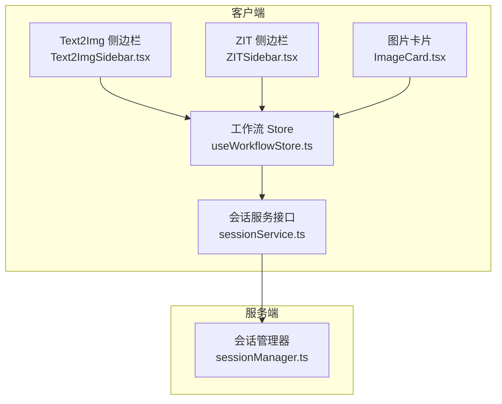
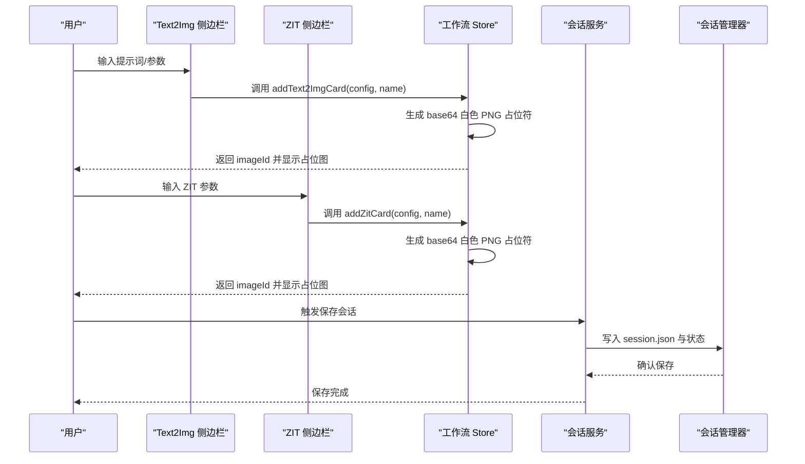
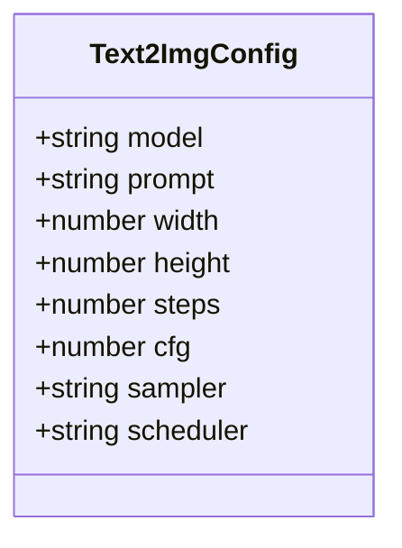
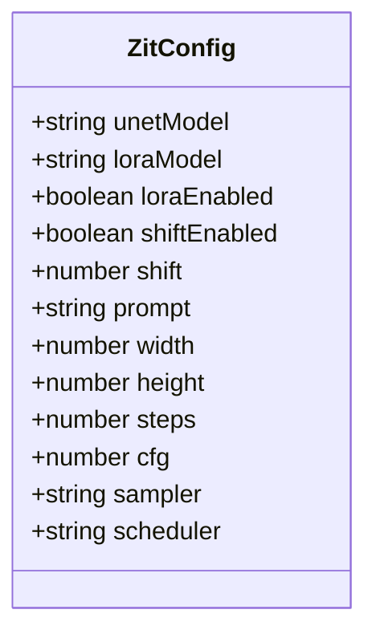
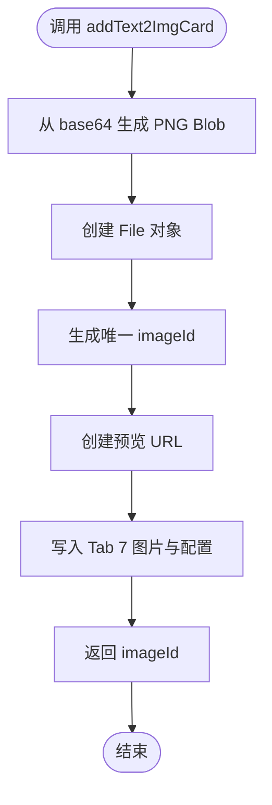
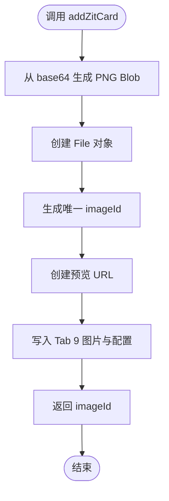
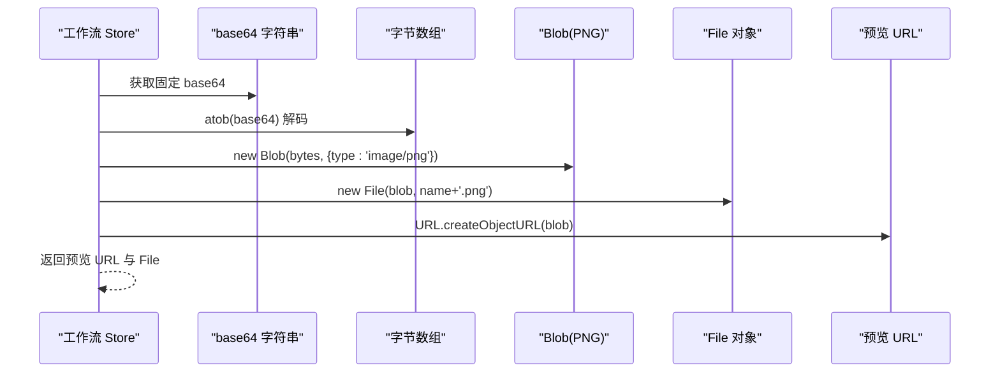
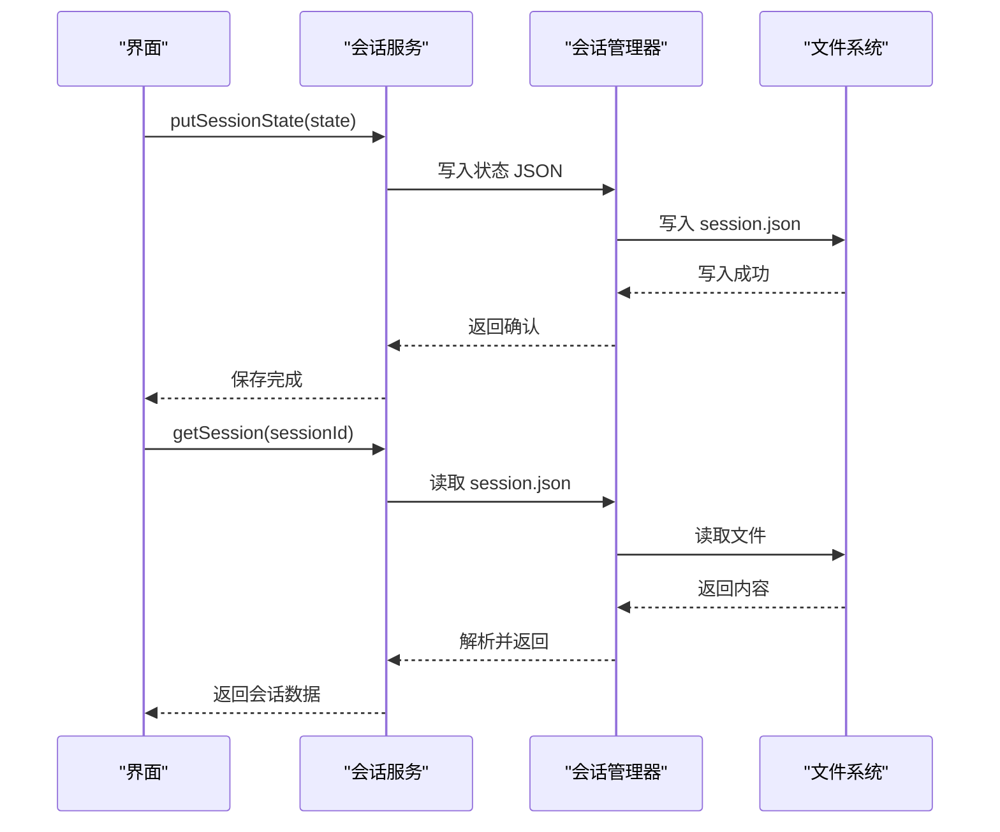
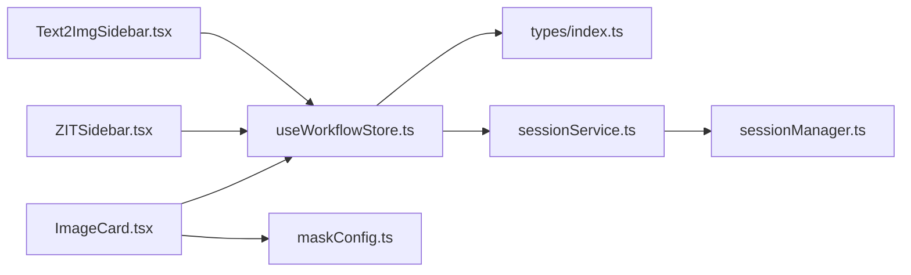

# 专业配置管理

<cite>
**本文档引用的文件**
- [Text2ImgSidebar.tsx](file://client/src/components/Text2ImgSidebar.tsx)
- [ZITSidebar.tsx](file://client/src/components/ZITSidebar.tsx)
- [useWorkflowStore.ts](file://client/src/hooks/useWorkflowStore.ts)
- [sessionService.ts](file://client/src/services/sessionService.ts)
- [types/index.ts](file://client/src/types/index.ts)
- [useSettingsStore.ts](file://client/src/hooks/useSettingsStore.ts)
- [ImageCard.tsx](file://client/src/components/ImageCard.tsx)
- [systemPrompts.ts](file://client/src/components/prompt-assistant/systemPrompts.ts)
- [maskConfig.ts](file://client/src/config/maskConfig.ts)
- [sessionManager.ts](file://server/src/services/sessionManager.ts)
</cite>

## 目录
1. [简介](#简介)
2. [项目结构](#项目结构)
3. [核心组件](#核心组件)
4. [架构总览](#架构总览)
5. [详细组件分析](#详细组件分析)
6. [依赖关系分析](#依赖关系分析)
7. [性能考虑](#性能考虑)
8. [故障排除指南](#故障排除指南)
9. [结论](#结论)
10. [附录](#附录)

## 简介
本文件面向专业配置管理，系统性阐述 Text2ImgConfig 与 ZitConfig 的配置结构、使用场景与实现细节，并深入解析 addText2ImgCard 与 addZitCard 方法的工作机制。文档还解释了占位符图片的生成机制（base64 白色 PNG），以及配置数据的存储与检索流程。最后提供使用示例、最佳实践与优化建议，帮助开发者高效管理配置并提升用户体验。

## 项目结构
该工程采用前端 React + Zustand 状态管理 + 服务端会话持久化的架构。配置管理主要集中在以下模块：
- 文本到图像配置：Text2ImgConfig 定义于会话服务层，由工作流侧边栏收集用户参数并通过工作流 Store 创建卡片。
- ZIT 快出配置：ZitConfig 定义于会话服务层，由 ZIT 侧边栏收集 UNet/Lora/Shift 等参数并通过工作流 Store 创建卡片。
- 占位符图片：通过 base64 白色 PNG 生成临时文件，确保会话上传与恢复流程正常进行。
- 存储与检索：客户端通过会话服务接口保存/加载状态；服务端负责会话目录与状态文件的读写。

图表来源
- [Text2ImgSidebar.tsx:1-536](file://client/src/components/Text2ImgSidebar.tsx#L1-L536)
- [ZITSidebar.tsx:1-635](file://client/src/components/ZITSidebar.tsx#L1-L635)
- [useWorkflowStore.ts:1-645](file://client/src/hooks/useWorkflowStore.ts#L1-L645)
- [sessionService.ts:1-134](file://client/src/services/sessionService.ts#L1-L134)
- [sessionManager.ts:101-163](file://server/src/services/sessionManager.ts#L101-L163)

章节来源
- [Text2ImgSidebar.tsx:1-536](file://client/src/components/Text2ImgSidebar.tsx#L1-L536)
- [ZITSidebar.tsx:1-635](file://client/src/components/ZITSidebar.tsx#L1-L635)
- [useWorkflowStore.ts:1-645](file://client/src/hooks/useWorkflowStore.ts#L1-L645)
- [sessionService.ts:1-134](file://client/src/services/sessionService.ts#L1-L134)
- [sessionManager.ts:101-163](file://server/src/services/sessionManager.ts#L101-L163)

## 核心组件
- Text2ImgConfig：描述文本到图像生成所需的模型、尺寸、采样器、调度器等参数。
- ZitConfig：描述 ZIT 快出所需的 UNet 模型、LoRA 模型、是否启用 LoRA、Shift 偏移、采样器、调度器等参数。
- 工作流 Store：提供 addText2ImgCard 与 addZitCard 方法，用于创建卡片并绑定配置。
- 会话服务：定义配置接口与序列化结构，支持会话状态的保存与加载。
- 侧边栏组件：收集用户输入，构建配置对象并调用 Store 方法执行生成任务。

章节来源
- [sessionService.ts:4-28](file://client/src/services/sessionService.ts#L4-L28)
- [useWorkflowStore.ts:76-80](file://client/src/hooks/useWorkflowStore.ts#L76-L80)
- [useWorkflowStore.ts:546-593](file://client/src/hooks/useWorkflowStore.ts#L546-L593)

## 架构总览
配置管理贯穿“采集—建模—存储—恢复—渲染”的完整链路。用户在侧边栏输入参数，组件将参数封装为配置对象，Store 使用 addText2ImgCard/addZitCard 创建卡片并注入占位符图片，随后通过会话服务持久化状态，最终在 UI 中渲染输出。

图表来源
- [Text2ImgSidebar.tsx:86-132](file://client/src/components/Text2ImgSidebar.tsx#L86-L132)
- [ZITSidebar.tsx:107-156](file://client/src/components/ZITSidebar.tsx#L107-L156)
- [useWorkflowStore.ts:546-593](file://client/src/hooks/useWorkflowStore.ts#L546-L593)
- [sessionService.ts:102-113](file://client/src/services/sessionService.ts#L102-L113)
- [sessionManager.ts:103-110](file://server/src/services/sessionManager.ts#L103-L110)

## 详细组件分析

### Text2ImgConfig 配置结构与使用场景
- 字段构成：模型名称、提示词、宽高、采样步数、CFG 强度、采样器、调度器。
- 使用场景：快速出图（Tab 7）工作流，适合需要快速生成图像的用户，参数简单直观。
- 数据来源：Text2Img 侧边栏收集用户输入，构建配置对象后交由 Store 创建卡片。

图表来源
- [sessionService.ts:4-13](file://client/src/services/sessionService.ts#L4-L13)

章节来源
- [sessionService.ts:4-13](file://client/src/services/sessionService.ts#L4-L13)
- [Text2ImgSidebar.tsx:89-98](file://client/src/components/Text2ImgSidebar.tsx#L89-L98)

### ZitConfig 配置结构与使用场景
- 字段构成：UNet 模型、LoRA 模型、是否启用 LoRA、是否启用 Shift、Shift 偏移、提示词、宽高、采样步数、CFG 强度、采样器、调度器。
- 使用场景：ZIT 快出（Tab 9）工作流，适合需要更精细控制的生成流程，支持 LoRA 与 AuraFlow Shift 偏移。
- 数据来源：ZIT 侧边栏收集用户输入，构建配置对象后交由 Store 创建卡片。

图表来源
- [sessionService.ts:15-28](file://client/src/services/sessionService.ts#L15-L28)

章节来源
- [sessionService.ts:15-28](file://client/src/services/sessionService.ts#L15-L28)
- [ZITSidebar.tsx:110-123](file://client/src/components/ZITSidebar.tsx#L110-L123)

### addText2ImgCard 方法实现
- 功能：创建文本到图像卡片，注入 base64 白色 PNG 占位符，记录配置并返回 imageId。
- 关键步骤：
  - 从 base64 生成字节数组与 Blob，构造 PNG 文件。
  - 生成唯一 imageId 与预览 URL。
  - 将图片与配置写入 Tab 7 的数据结构。
- 返回值：新卡片的 imageId，供后续任务注册与进度跟踪使用。

图表来源
- [useWorkflowStore.ts:546-569](file://client/src/hooks/useWorkflowStore.ts#L546-L569)

章节来源
- [useWorkflowStore.ts:546-569](file://client/src/hooks/useWorkflowStore.ts#L546-L569)

### addZitCard 方法实现
- 功能：创建 ZIT 快出卡片，注入 base64 白色 PNG 占位符，记录配置并返回 imageId。
- 关键步骤：
  - 从 base64 生成字节数组与 Blob，构造 PNG 文件。
  - 生成唯一 imageId 与预览 URL。
  - 将图片与配置写入 Tab 9 的数据结构。
- 返回值：新卡片的 imageId，供后续任务注册与进度跟踪使用。

图表来源
- [useWorkflowStore.ts:571-593](file://client/src/hooks/useWorkflowStore.ts#L571-L593)

章节来源
- [useWorkflowStore.ts:571-593](file://client/src/hooks/useWorkflowStore.ts#L571-L593)

### 占位符图片生成机制（base64 白色 PNG）
- 机制：使用固定 base64 字符串解码为字节数组，构造 PNG Blob，再包装为 File 对象，用于创建预览 URL。
- 目的：确保会话上传与恢复流程正常进行，避免空图片导致的异常。
- 位置：两个卡片创建方法均使用相同的 base64 白色 PNG。

图表来源
- [useWorkflowStore.ts:547-554](file://client/src/hooks/useWorkflowStore.ts#L547-L554)
- [useWorkflowStore.ts:572-579](file://client/src/hooks/useWorkflowStore.ts#L572-L579)

章节来源
- [useWorkflowStore.ts:547-554](file://client/src/hooks/useWorkflowStore.ts#L547-L554)
- [useWorkflowStore.ts:572-579](file://client/src/hooks/useWorkflowStore.ts#L572-L579)

### 配置数据的存储与检索机制
- 序列化结构：SerializedTabData 包含 images、prompts、tasks、selectedOutputIndex、backPoseToggles、text2imgConfigs、zitConfigs、faceSwapZones 等字段。
- 存储接口：
  - 保存会话状态：putSessionState
  - 加载会话：getSession
  - 列出会话：listSessions
  - 删除会话：deleteSession
- 服务端实现：sessionManager 负责将状态写入 session.json，并提供列出、删除、清理过期会话等功能。

图表来源
- [sessionService.ts:102-121](file://client/src/services/sessionService.ts#L102-L121)
- [sessionManager.ts:103-110](file://server/src/services/sessionManager.ts#L103-L110)
- [sessionManager.ts:112-120](file://server/src/services/sessionManager.ts#L112-L120)

章节来源
- [sessionService.ts:50-59](file://client/src/services/sessionService.ts#L50-L59)
- [sessionService.ts:102-121](file://client/src/services/sessionService.ts#L102-L121)
- [sessionManager.ts:101-163](file://server/src/services/sessionManager.ts#L101-L163)

### 使用示例与最佳实践

- 添加文本到图像卡片
  - 步骤：在 Text2Img 侧边栏填写模型、提示词、比例、采样参数等，点击生成按钮。
  - 行为：组件构建 Text2ImgConfig，调用 addText2ImgCard 创建卡片，显示 base64 占位图，随后发起工作流执行请求。
  - 参考路径：[Text2ImgSidebar.tsx:86-132](file://client/src/components/Text2ImgSidebar.tsx#L86-L132)，[useWorkflowStore.ts:546-569](file://client/src/hooks/useWorkflowStore.ts#L546-L569)

- 添加 ZIT 卡片
  - 步骤：在 ZIT 侧边栏选择 UNet/LoRA 模型，配置 Shift 偏移与采样参数，点击生成按钮。
  - 行为：组件构建 ZitConfig，调用 addZitCard 创建卡片，显示 base64 占位图，随后发起工作流执行请求。
  - 参考路径：[ZITSidebar.tsx:107-156](file://client/src/components/ZITSidebar.tsx#L107-L156)，[useWorkflowStore.ts:571-593](file://client/src/hooks/useWorkflowStore.ts#L571-L593)

- 管理配置参数
  - 本地草稿：Text2Img 与 ZIT 侧边栏分别使用 localStorage 键保存草稿，切换标签页不丢失参数。
  - 设置项：通过 useSettingsStore 管理逆向提示词模型与启动行为等全局设置。
  - 参考路径：[Text2ImgSidebar.tsx:31-75](file://client/src/components/Text2ImgSidebar.tsx#L31-L75)，[ZITSidebar.tsx:31-94](file://client/src/components/ZITSidebar.tsx#L31-L94)，[useSettingsStore.ts:16-30](file://client/src/hooks/useSettingsStore.ts#L16-L30)

- 提示词助手集成
  - 支持“自然语言→标签”、“标签→自然语言”、“按需扩写”等模式，通过系统提示词模板与后端接口交互。
  - 参考路径：[systemPrompts.ts:4-144](file://client/src/components/prompt-assistant/systemPrompts.ts#L4-L144)，[Text2ImgSidebar.tsx:134-155](file://client/src/components/Text2ImgSidebar.tsx#L134-L155)，[ZITSidebar.tsx:158-179](file://client/src/components/ZITSidebar.tsx#L158-L179)

- 配置优化建议
  - 合理设置采样步数与 CFG：步数过低易欠拟合，过高可能引入噪声；CFG 过高可能导致风格过度。
  - 比例选择：根据目标用途选择 1:1、3:4、9:16、4:3、16:9 等预设，平衡视觉效果与显存占用。
  - LoRA 与 Shift：在 ZIT 流程中谨慎启用 LoRA 与 Shift，避免破坏稳定性；必要时逐步调整偏移量。
  - 批量生成：合理设置批量数量（1-32），避免一次性提交过多任务导致资源紧张。
  - 参考路径：[Text2ImgSidebar.tsx:8-29](file://client/src/components/Text2ImgSidebar.tsx#L8-L29)，[ZITSidebar.tsx:8-29](file://client/src/components/ZITSidebar.tsx#L8-L29)

章节来源
- [Text2ImgSidebar.tsx:86-132](file://client/src/components/Text2ImgSidebar.tsx#L86-L132)
- [ZITSidebar.tsx:107-156](file://client/src/components/ZITSidebar.tsx#L107-L156)
- [useWorkflowStore.ts:546-593](file://client/src/hooks/useWorkflowStore.ts#L546-L593)
- [useSettingsStore.ts:16-30](file://client/src/hooks/useSettingsStore.ts#L16-L30)
- [systemPrompts.ts:4-144](file://client/src/components/prompt-assistant/systemPrompts.ts#L4-L144)

## 依赖关系分析
- 组件与 Store 的耦合：Text2ImgSidebar 与 ZITSidebar 通过 useWorkflowStore 访问 addText2ImgCard/addZitCard，降低耦合度。
- Store 与类型：useWorkflowStore 导出 Text2ImgConfig/ZitConfig 类型，确保类型一致性。
- 会话服务与服务端：sessionService.ts 定义接口，sessionManager.ts 实现状态持久化，二者通过 REST API 交互。
- 渲染与配置：ImageCard 读取 Store 中的 text2imgConfigs/zitConfigs，实现配置驱动的 UI 渲染。

图表来源
- [Text2ImgSidebar.tsx:1-7](file://client/src/components/Text2ImgSidebar.tsx#L1-L7)
- [ZITSidebar.tsx:1-7](file://client/src/components/ZITSidebar.tsx#L1-L7)
- [useWorkflowStore.ts:1-4](file://client/src/hooks/useWorkflowStore.ts#L1-L4)
- [types/index.ts:1-58](file://client/src/types/index.ts#L1-L58)
- [sessionService.ts:1-134](file://client/src/services/sessionService.ts#L1-L134)
- [sessionManager.ts:101-163](file://server/src/services/sessionManager.ts#L101-L163)
- [ImageCard.tsx:1-16](file://client/src/components/ImageCard.tsx#L1-L16)
- [maskConfig.ts:1-19](file://client/src/config/maskConfig.ts#L1-L19)

章节来源
- [useWorkflowStore.ts:1-4](file://client/src/hooks/useWorkflowStore.ts#L1-L4)
- [sessionService.ts:1-134](file://client/src/services/sessionService.ts#L1-L134)
- [sessionManager.ts:101-163](file://server/src/services/sessionManager.ts#L101-L163)
- [ImageCard.tsx:1-16](file://client/src/components/ImageCard.tsx#L1-L16)
- [maskConfig.ts:1-19](file://client/src/config/maskConfig.ts#L1-L19)

## 性能考虑
- 占位符图片：base64 PNG 体积极小，仅用于会话上传与恢复流程，不会显著影响性能。
- 批量生成：限制批量数量（1-32），避免一次性提交过多任务导致资源紧张。
- 本地草稿：localStorage 草稿减少网络请求与重复计算，但注意清理过期草稿以避免占用空间。
- 会话保存：使用浏览器 sendBeacon 在页面卸载时异步保存，提高稳定性与兼容性。
- 参考路径：[Text2ImgSidebar.tsx:72-75](file://client/src/components/Text2ImgSidebar.tsx#L72-L75)，[ZITSidebar.tsx:89-94](file://client/src/components/ZITSidebar.tsx#L89-L94)，[useSession.ts:397-418](file://client/src/hooks/useSession.ts#L397-L418)

## 故障排除指南
- 生成失败或无输出
  - 检查 clientId 是否存在，确保 WebSocket 连接正常。
  - 查看控制台错误信息，确认工作流执行接口返回状态。
  - 参考路径：[Text2ImgSidebar.tsx:113-127](file://client/src/components/Text2ImgSidebar.tsx#L113-L127)，[ZITSidebar.tsx:137-151](file://client/src/components/ZITSidebar.tsx#L137-L151)

- 卡片未显示或占位图缺失
  - 确认 addText2ImgCard/addZitCard 是否正确返回 imageId。
  - 检查 base64 PNG 生成逻辑与 Blob/File 创建过程。
  - 参考路径：[useWorkflowStore.ts:546-569](file://client/src/hooks/useWorkflowStore.ts#L546-L569)，[useWorkflowStore.ts:571-593](file://client/src/hooks/useWorkflowStore.ts#L571-L593)

- 会话保存失败
  - 检查 putSessionState 请求是否成功，确认服务端 sessionManager 写入权限。
  - 参考路径：[sessionService.ts:102-113](file://client/src/services/sessionService.ts#L102-L113)，[sessionManager.ts:103-110](file://server/src/services/sessionManager.ts#L103-L110)

- 提示词助手无响应
  - 确认系统提示词模板与后端接口连通性。
  - 参考路径：[systemPrompts.ts:4-144](file://client/src/components/prompt-assistant/systemPrompts.ts#L4-L144)，[Text2ImgSidebar.tsx:134-155](file://client/src/components/Text2ImgSidebar.tsx#L134-L155)，[ZITSidebar.tsx:158-179](file://client/src/components/ZITSidebar.tsx#L158-L179)

章节来源
- [Text2ImgSidebar.tsx:113-127](file://client/src/components/Text2ImgSidebar.tsx#L113-L127)
- [ZITSidebar.tsx:137-151](file://client/src/components/ZITSidebar.tsx#L137-L151)
- [useWorkflowStore.ts:546-593](file://client/src/hooks/useWorkflowStore.ts#L546-L593)
- [sessionService.ts:102-113](file://client/src/services/sessionService.ts#L102-L113)
- [sessionManager.ts:103-110](file://server/src/services/sessionManager.ts#L103-L110)
- [systemPrompts.ts:4-144](file://client/src/components/prompt-assistant/systemPrompts.ts#L4-L144)

## 结论
本配置管理体系通过明确的配置结构、稳定的卡片创建机制与可靠的会话持久化，实现了从参数采集到结果渲染的完整闭环。Text2ImgConfig 与 ZitConfig 分别针对不同工作流场景提供精细化参数控制，配合 base64 占位符图片与本地草稿机制，既保证了用户体验，也提升了系统的健壮性。建议在实际使用中遵循性能与稳定性原则，结合提示词助手与会话管理工具，持续优化生成质量与效率。

## 附录
- 相关类型定义参考：[types/index.ts:1-58](file://client/src/types/index.ts#L1-L58)
- 掩码配置映射：[maskConfig.ts:1-19](file://client/src/config/maskConfig.ts#L1-L19)
- 图片卡片渲染逻辑：[ImageCard.tsx:79-83](file://client/src/components/ImageCard.tsx#L79-L83)