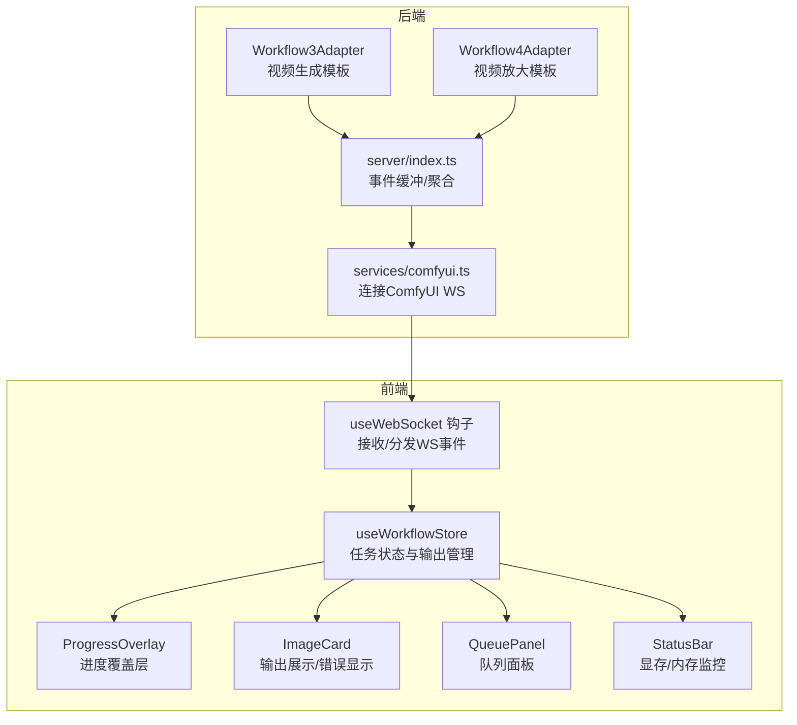
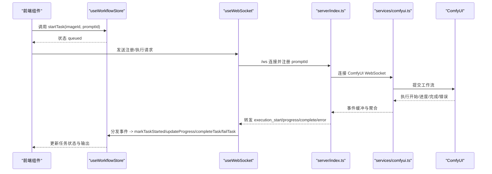
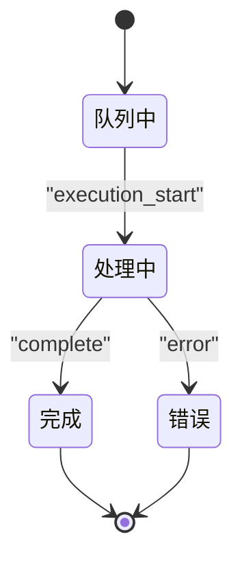
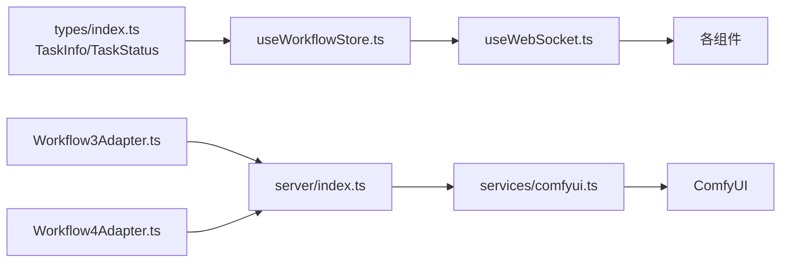

# 任务状态管理

<cite>
**本文引用的文件列表**
- [useWorkflowStore.ts](file://client/src/hooks/useWorkflowStore.ts)
- [types/index.ts](file://client/src/types/index.ts)
- [useWebSocket.ts](file://client/src/hooks/useWebSocket.ts)
- [ProgressOverlay.tsx](file://client/src/components/ProgressOverlay.tsx)
- [ImageCard.tsx](file://client/src/components/ImageCard.tsx)
- [QueuePanel.tsx](file://client/src/components/QueuePanel.tsx)
- [StatusBar.tsx](file://client/src/components/StatusBar.tsx)
- [comfyui.ts](file://server/src/services/comfyui.ts)
- [index.ts（服务端）](file://server/src/index.ts)
- [Workflow3Adapter.ts](file://server/src/adapters/Workflow3Adapter.ts)
- [Workflow4Adapter.ts](file://server/src/adapters/Workflow4Adapter.ts)
- [Pix2Real-快速生成视频RAM.json](file://ComfyUI_API/Pix2Real-快速生成视频RAM.json)
- [4-Pix2Real-视频放大.json](file://ComfyUI_API/4-Pix2Real-视频放大.json)
</cite>

## 目录
1. [简介](#简介)
2. [项目结构与角色定位](#项目结构与角色定位)
3. [核心组件总览](#核心组件总览)
4. [架构概览](#架构概览)
5. [详细组件解析](#详细组件解析)
6. [依赖关系分析](#依赖关系分析)
7. [性能与优化建议](#性能与优化建议)
8. [故障排查指南](#故障排查指南)
9. [结论](#结论)

## 简介
本文件聚焦“任务状态管理”，系统性阐述 TaskInfo 接口结构、任务生命周期方法、状态转换流程、输出管理策略（含视频工作流的特殊处理），以及在前端与后端之间的数据流与事件流。目标是帮助开发者与使用者理解从提交任务到完成或失败的全过程，并提供可操作的使用示例与优化建议。

## 项目结构与角色定位
- 前端 Zustand 状态管理：集中维护每个工作流标签页内的任务集合、图像映射、选中输出索引等。
- WebSocket 事件桥接：将 ComfyUI 的进度、开始、完成、错误事件转发到前端状态。
- 组件层渲染：根据任务状态渲染进度覆盖层、错误徽章、输出预览等。
- 服务器适配器与路由：加载模板、拼装参数、连接 ComfyUI WebSocket 并回传事件。

图表来源
- [useWorkflowStore.ts:377-515](file://client/src/hooks/useWorkflowStore.ts#L377-L515)
- [useWebSocket.ts:26-47](file://client/src/hooks/useWebSocket.ts#L26-L47)
- [comfyui.ts:127-153](file://server/src/services/comfyui.ts#L127-L153)
- [index.ts（服务端）:92-186](file://server/src/index.ts#L92-L186)
- [Workflow3Adapter.ts:1-32](file://server/src/adapters/Workflow3Adapter.ts#L1-L32)
- [Workflow4Adapter.ts:1-27](file://server/src/adapters/Workflow4Adapter.ts#L1-L27)

章节来源
- [useWorkflowStore.ts:1-645](file://client/src/hooks/useWorkflowStore.ts#L1-L645)
- [useWebSocket.ts:1-99](file://client/src/hooks/useWebSocket.ts#L1-L99)
- [comfyui.ts:124-153](file://server/src/services/comfyui.ts#L124-L153)
- [index.ts（服务端）:81-186](file://server/src/index.ts#L81-L186)
- [Workflow3Adapter.ts:1-32](file://server/src/adapters/Workflow3Adapter.ts#L1-L32)
- [Workflow4Adapter.ts:1-27](file://server/src/adapters/Workflow4Adapter.ts#L1-L27)

## 核心组件总览
- TaskInfo 接口：描述单个任务的标识、状态、进度、输出数组与错误信息。
- 任务生命周期方法：startTask、markTaskStarted、updateProgress、completeTask、failTask、resetTask。
- 事件驱动：WebSocket 事件（execution_start、progress、complete、error）驱动状态变更。
- 输出管理：outputs 数组追加、selectedOutputIndex 默认选择策略（含视频工作流的“插帧”偏好）。

章节来源
- [types/index.ts:17-25](file://client/src/types/index.ts#L17-L25)
- [useWorkflowStore.ts:377-515](file://client/src/hooks/useWorkflowStore.ts#L377-L515)
- [useWebSocket.ts:26-47](file://client/src/hooks/useWebSocket.ts#L26-L47)

## 架构概览
下图展示从前端发起任务到后端连接 ComfyUI、再通过 WebSocket 将进度与结果回传给前端的整体流程。

图表来源
- [useWorkflowStore.ts:377-515](file://client/src/hooks/useWorkflowStore.ts#L377-L515)
- [useWebSocket.ts:26-47](file://client/src/hooks/useWebSocket.ts#L26-L47)
- [comfyui.ts:127-153](file://server/src/services/comfyui.ts#L127-L153)
- [index.ts（服务端）:92-186](file://server/src/index.ts#L92-L186)

## 详细组件解析

### TaskInfo 接口与属性语义
- promptId：任务唯一标识，用于跨标签页匹配与事件路由。
- status：任务状态枚举，支持 idle/uploading/queued/processing/done/error。
- progress：百分比进度值，范围通常为 0~100。
- outputs：输出数组，元素包含 filename 与 url；视频输出由后端统一保存并返回。
- error：当任务失败时记录错误文本。

章节来源
- [types/index.ts:17-25](file://client/src/types/index.ts#L17-L25)

### 任务生命周期方法与实现机制
- startTask(imageId, promptId)
  - 在当前活动标签页创建任务条目，初始状态为 queued，进度为 0，保留已有 outputs。
  - 同时建立 imageId → promptId 的映射，便于后续查找。
- markTaskStarted(promptId)
  - 将所有标签页中与该 promptId 匹配且状态为 queued 的任务标记为 processing。
- updateProgress(promptId, percentage)
  - 允许进度事件出现在任意标签页，遍历所有标签页查找匹配项并更新 progress。
- completeTask(promptId, outputs)
  - 将 outputs 追加到现有 outputs，状态置为 done，进度置为 100。
  - 默认选择策略：
    - 新增输出批次的第一个作为默认选中；
    - 对于视频工作流（tab 3/4），若新批次包含“插帧”关键词，则优先选择该帧作为默认选中。
- failTask(promptId, error)
  - 将任务状态置为 error，并写入错误信息。
- resetTask(imageId)
  - 移除指定 imageId 的任务条目及其映射与选中索引。

章节来源
- [useWorkflowStore.ts:377-515](file://client/src/hooks/useWorkflowStore.ts#L377-L515)

### 任务状态转换图

图表来源
- [useWorkflowStore.ts:398-499](file://client/src/hooks/useWorkflowStore.ts#L398-L499)
- [useWebSocket.ts:35-46](file://client/src/hooks/useWebSocket.ts#L35-L46)

### WebSocket 事件与状态联动
- connected：记录 clientId，用于后续事件关联。
- execution_start：调用 markTaskStarted(promptId)。
- progress：调用 updateProgress(promptId, percentage)。
- complete：调用 completeTask(promptId, outputs)。
- error：调用 failTask(promptId, message)。

章节来源
- [useWebSocket.ts:26-47](file://client/src/hooks/useWebSocket.ts#L26-L47)

### 输出管理与默认选择逻辑
- outputs 追加：每次 complete 时将新批次 outputs 与旧批次合并。
- 默认选中策略：
  - 一般情况：默认选中新批次的第一个输出。
  - 视频工作流（tab 3/4）：若新批次包含“插帧”关键词，则默认选中该帧。
- 选中索引修正：删除输出时会自动调整选中索引，避免越界。

章节来源
- [useWorkflowStore.ts:445-475](file://client/src/hooks/useWorkflowStore.ts#L445-L475)
- [useWorkflowStore.ts:517-544](file://client/src/hooks/useWorkflowStore.ts#L517-L544)

### 视频工作流的特殊处理
- 视频生成与放大工作流（tab 3/4）在完成时可能产生多帧输出，其中“插帧”帧通常更适合作为默认选中。
- 后端在聚合输出时会处理图片与视频两类节点，确保保存到会话目录并返回统一的输出数组。

章节来源
- [useWorkflowStore.ts:460-466](file://client/src/hooks/useWorkflowStore.ts#L460-L466)
- [index.ts（服务端）:109-159](file://server/src/index.ts#L109-L159)

### 前端渲染与交互
- ProgressOverlay：在 queued/processing 状态显示覆盖层，processing 且进度为 0 时显示加载态。
- ImageCard：根据任务状态显示输出（图片或视频）、错误徽章、进度覆盖层。
- QueuePanel：展示运行中与待处理队列，支持定位到对应卡片。
- StatusBar：显示系统资源使用率，提供释放显存/内存按钮。

章节来源
- [ProgressOverlay.tsx:1-53](file://client/src/components/ProgressOverlay.tsx#L1-L53)
- [ImageCard.tsx:508-560](file://client/src/components/ImageCard.tsx#L508-L560)
- [QueuePanel.tsx:37-87](file://client/src/components/QueuePanel.tsx#L37-L87)
- [StatusBar.tsx:69-242](file://client/src/components/StatusBar.tsx#L69-L242)

## 依赖关系分析
- 前端
  - useWorkflowStore 依赖 types 中的 TaskInfo 与 TaskStatus 类型。
  - useWebSocket 依赖 useWorkflowStore 的状态更新方法。
  - 组件层依赖 store 的状态与动作。
- 后端
  - server/index.ts 通过 services/comfyui.ts 连接 ComfyUI WebSocket，并将事件转发给前端。
  - 适配器（Workflow3/4）负责加载模板并注入输入参数。

图表来源
- [types/index.ts:17-25](file://client/src/types/index.ts#L17-L25)
- [useWorkflowStore.ts:1-645](file://client/src/hooks/useWorkflowStore.ts#L1-L645)
- [useWebSocket.ts:1-99](file://client/src/hooks/useWebSocket.ts#L1-L99)
- [Workflow3Adapter.ts:1-32](file://server/src/adapters/Workflow3Adapter.ts#L1-L32)
- [Workflow4Adapter.ts:1-27](file://server/src/adapters/Workflow4Adapter.ts#L1-L27)
- [comfyui.ts:127-153](file://server/src/services/comfyui.ts#L127-L153)
- [index.ts（服务端）:92-186](file://server/src/index.ts#L92-L186)

## 性能与优化建议
- 显存/内存释放
  - 通过 StatusBar 的“释放缓存”按钮触发后端清理，适合长时间运行或显存紧张时使用。
  - 释放内存的模板包含 RAMCleanup 与 VRAMCleanup 节点，可在工作流末尾串联以减少碎片。
- 进度更新节流
  - 前端 updateProgress 可能来自多个标签页，建议在 store 层增加去抖/合并策略，降低渲染压力。
- 输出管理
  - 大量输出时，避免一次性渲染全部缩略图，采用虚拟滚动或分页加载。
- 视频输出
  - 视频预览使用 muted 与 preload="metadata"，减少首帧等待与带宽占用。
- 事件缓冲
  - 后端对同一 promptId 的事件进行缓冲，避免重复发送与客户端抖动。

章节来源
- [StatusBar.tsx:110-121](file://client/src/components/StatusBar.tsx#L110-L121)
- [Pix2Real-快速生成视频RAM.json:418-447](file://ComfyUI_API/Pix2Real-快速生成视频RAM.json#L418-L447)
- [4-Pix2Real-视频放大.json:66-114](file://ComfyUI_API/4-Pix2Real-视频放大.json#L66-L114)
- [index.ts（服务端）:81-90](file://server/src/index.ts#L81-L90)

## 故障排查指南
- 任务卡在 queued
  - 检查 WebSocket 是否连通，确认后端是否收到 execution_start。
  - 若队列较长，等待队列调度；必要时使用 QueuePanel 的“置顶/取消”功能。
- 任务卡在 processing 且进度不动
  - 查看 ComfyUI 日志，确认节点执行是否正常。
  - 前端 StatusBar 的显存/内存使用率是否异常升高，考虑释放缓存。
- 任务失败
  - 查看 failTask 写入的错误信息，结合 ComfyUI 报错定位问题。
- 输出缺失或不完整
  - 确认后端已正确保存输出并返回 outputs 数组。
  - 视频工作流注意“插帧”输出的默认选择逻辑。

章节来源
- [useWebSocket.ts:53-65](file://client/src/hooks/useWebSocket.ts#L53-L65)
- [useWorkflowStore.ts:478-499](file://client/src/hooks/useWorkflowStore.ts#L478-L499)
- [index.ts（服务端）:109-174](file://server/src/index.ts#L109-L174)

## 结论
本文从接口定义、生命周期方法、事件驱动、输出管理与视频工作流特殊处理五个维度，全面梳理了任务状态管理的设计与实现。通过明确的状态转换与默认选择策略，配合前端渲染与后端事件缓冲，系统实现了稳定、可追踪的任务执行体验。建议在实际使用中结合性能优化建议与故障排查流程，进一步提升稳定性与效率。