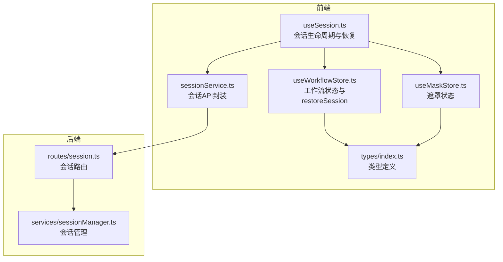
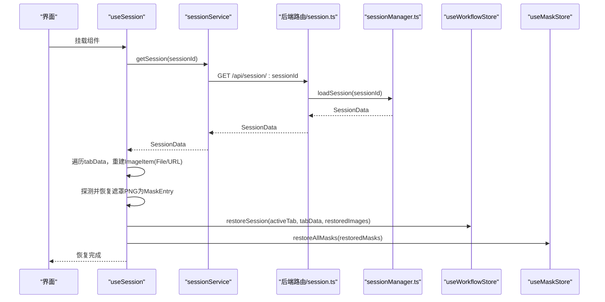
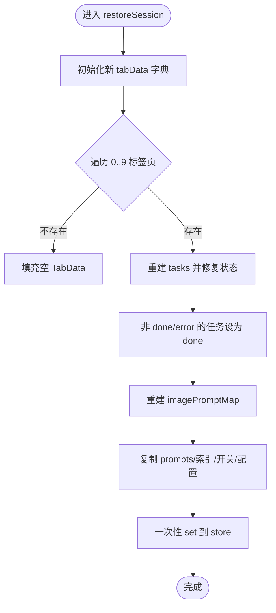
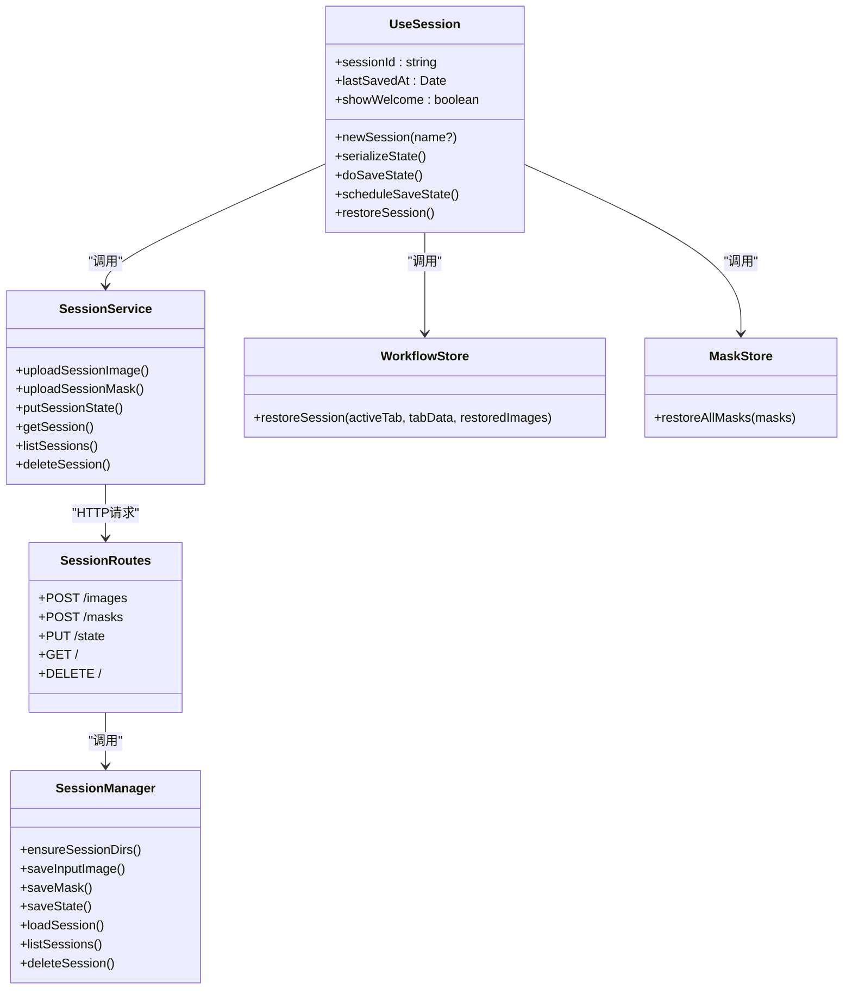

# 会话恢复机制

<cite>
**本文引用的文件**
- [useSession.ts](file://client/src/hooks/useSession.ts)
- [sessionService.ts](file://client/src/services/sessionService.ts)
- [session.ts](file://server/src/routes/session.ts)
- [sessionManager.ts](file://server/src/services/sessionManager.ts)
- [useWorkflowStore.ts](file://client/src/hooks/useWorkflowStore.ts)
- [useMaskStore.ts](file://client/src/hooks/useMaskStore.ts)
- [index.ts](file://client/src/types/index.ts)
- [TODO-session-persistence.md](file://TODO-session-persistence.md)
- [README.md](file://README.md)
</cite>

## 目录
1. [简介](#简介)
2. [项目结构](#项目结构)
3. [核心组件](#核心组件)
4. [架构总览](#架构总览)
5. [详细组件分析](#详细组件分析)
6. [依赖关系分析](#依赖关系分析)
7. [性能考量](#性能考量)
8. [故障排查指南](#故障排查指南)
9. [结论](#结论)
10. [附录](#附录)

## 简介
本文件系统性阐述会话恢复机制，重点围绕前端 hook useSession 中的恢复流程与后端会话管理协作，解释 restoreSession 方法的完整实现、SerializedTabData 接口结构、状态恢复过程中的数据转换与修复策略，并提供使用示例与最佳实践。

## 项目结构
会话恢复涉及前后端协同：
- 前端负责：会话标识管理、状态序列化、文件与遮罩上传、会话加载与恢复、自动保存与清理。
- 后端负责：会话目录结构维护、输入图像与遮罩持久化、会话状态 JSON 写入与读取、静态文件服务。

图表来源
- [useSession.ts:116-387](file://client/src/hooks/useSession.ts#L116-L387)
- [sessionService.ts:103-121](file://client/src/services/sessionService.ts#L103-L121)
- [session.ts:18-95](file://server/src/routes/session.ts#L18-L95)
- [sessionManager.ts:10-164](file://server/src/services/sessionManager.ts#L10-L164)
- [useWorkflowStore.ts:600-636](file://client/src/hooks/useWorkflowStore.ts#L600-L636)
- [useMaskStore.ts:29](file://client/src/hooks/useMaskStore.ts#L29)
- [index.ts:1-58](file://client/src/types/index.ts#L1-L58)

章节来源
- [README.md:41-79](file://README.md#L41-L79)
- [TODO-session-persistence.md:13-26](file://TODO-session-persistence.md#L13-L26)

## 核心组件
- 会话标识与生命周期：useSession 负责 sessionId 的生成与持久化、空会话清理、挂载时恢复、页面卸载前保存。
- 状态序列化与保存：serializeState 将 store 中可序列化部分导出；putSessionState 通过 API 写入后端 session.json。
- 恢复流程：getSession 获取后端会话；对每个 tab 的 images 重建 File 对象并生成预览 URL；对 masks 进行探测式恢复；最终调用 restoreSession 与 restoreAllMasks。
- 工作流状态恢复：restoreSession 将 SerializedTabData 映射为运行时 TabData，修复任务状态，重建 imagePromptMap。
- 遮罩恢复：restoreAllMasks 将后端存储的遮罩 PNG 解码为 RGBA 像素数据并恢复到 store。

章节来源
- [useSession.ts:137-175](file://client/src/hooks/useSession.ts#L137-L175)
- [useSession.ts:305-387](file://client/src/hooks/useSession.ts#L305-L387)
- [useWorkflowStore.ts:600-636](file://client/src/hooks/useWorkflowStore.ts#L600-L636)
- [useMaskStore.ts:29](file://client/src/hooks/useMaskStore.ts#L29)
- [sessionService.ts:103-121](file://client/src/services/sessionService.ts#L103-L121)

## 架构总览
会话恢复的关键交互如下：

图表来源
- [useSession.ts:305-387](file://client/src/hooks/useSession.ts#L305-L387)
- [sessionService.ts:116-121](file://client/src/services/sessionService.ts#L116-L121)
- [session.ts:70-79](file://server/src/routes/session.ts#L70-L79)
- [sessionManager.ts:112-120](file://server/src/services/sessionManager.ts#L112-L120)
- [useWorkflowStore.ts:600-636](file://client/src/hooks/useWorkflowStore.ts#L600-L636)
- [useMaskStore.ts:29](file://client/src/hooks/useMaskStore.ts#L29)

## 详细组件分析

### SerializedTabData 接口与参数要求
SerializedTabData 是会话持久化的核心数据结构，用于描述单个标签页的状态。其字段包括：
- images: 序列化后的图像元数据数组（仅包含 id、originalName、ext），不包含 File 对象。
- prompts: 图像到提示词的映射。
- tasks: 图像到任务的映射，任务包含 promptId、status、progress、outputs、error 等。
- selectedOutputIndex: 图像到选中输出索引的映射。
- backPoseToggles: 图像到姿态切换开关的映射。
- text2imgConfigs/zitConfigs/faceSwapZones: 可选的配置映射（在某些标签页有效）。

restoreSession 的参数要求：
- activeTab: 恢复后的活动标签页索引。
- tabData: Record<number, SerializedTabData>，表示各标签页的序列化状态。
- restoredImages: Record<number, ImageItem[]>，表示已从后端恢复的图像集合（包含 File、预览 URL、会话 URL 等）。

章节来源
- [sessionService.ts:50-67](file://client/src/services/sessionService.ts#L50-L67)
- [useWorkflowStore.ts:600-636](file://client/src/hooks/useWorkflowStore.ts#L600-L636)
- [index.ts:1-58](file://client/src/types/index.ts#L1-L58)

### restoreSession 方法实现详解
restoreSession 的职责是将后端返回的 SerializedTabData 转换为前端运行时的 TabData，并修复任务状态以保证一致性。

关键步骤：
- 初始化新 tabData 字典，遍历 0..9 标签页。
- 对于不存在的标签页，填充空的 TabData。
- 对于存在的标签页：
  - 从 restoredImages 中取出该标签页的图像列表，若无则为空。
  - 重建 tasks：将任务状态修复为“已完成”或“错误”以外的任务一律视为“已完成”，以避免恢复后仍处于进行中导致 UI 卡住；同时保留 outputs、progress、error。
  - 重建 imagePromptMap：将任务的 promptId 映射到对应图像。
  - 复制 prompts、selectedOutputIndex、backPoseToggles、text2imgConfigs、zitConfigs、faceSwapZones 等字段。
- 最终一次性 set 到 store，完成恢复。

图表来源
- [useWorkflowStore.ts:600-636](file://client/src/hooks/useWorkflowStore.ts#L600-L636)

章节来源
- [useWorkflowStore.ts:600-636](file://client/src/hooks/useWorkflowStore.ts#L600-L636)

### 状态恢复过程中的数据转换与修复
- 任务状态修复：将“进行中/排队”等中间态统一修复为“已完成”，防止恢复后 UI 一直显示处理中。
- 输出文件处理：outputs 中的文件 URL 保持不变，直接沿用后端返回的 URL；对于输入图像，先从后端下载为 File，再生成预览 URL。
- 配置数据重建：text2imgConfigs、zitConfigs、faceSwapZones 等可选字段在 restoreSession 中被安全地合并到新的 TabData。
- 遮罩处理：后端以 PNG 形式存储遮罩，前端通过 HEAD 探测文件是否存在，存在则下载并解码为 RGBA 像素数据，再恢复到 useMaskStore。

章节来源
- [useSession.ts:316-366](file://client/src/hooks/useSession.ts#L316-L366)
- [useSession.ts:345-359](file://client/src/hooks/useSession.ts#L345-L359)
- [useMaskStore.ts:49](file://client/src/hooks/useMaskStore.ts#L49)

### 与后端会话管理的协作机制
- 目录结构：sessions/<sessionId>/tab-<n>/input、masks、output。
- 输入图像与遮罩：通过 multipart 表单上传至 /api/session/:sessionId/images 与 /api/session/:sessionId/masks，后端保存为文件并返回可访问 URL。
- 会话状态：通过 PUT /api/session/:sessionId/state 或 POST /api/session/:sessionId/state 写入 session.json；GET /api/session/:sessionId 读取会话；DELETE /api/session/:sessionId 删除会话。
- 静态文件服务：后端将 sessions/ 目录作为静态资源，提供 /api/session-files/ 前缀访问。

章节来源
- [TODO-session-persistence.md:13-26](file://TODO-session-persistence.md#L13-L26)
- [session.ts:18-95](file://server/src/routes/session.ts#L18-L95)
- [sessionManager.ts:10-164](file://server/src/services/sessionManager.ts#L10-L164)

### 使用示例

- 保存会话状态
  - 在工作流状态变化时，useSession 会通过 serializeState 序列化并调用 putSessionState 保存到后端。
  - 关键路径参考：[useSession.ts:137-175](file://client/src/hooks/useSession.ts#L137-L175)、[sessionService.ts:103-113](file://client/src/services/sessionService.ts#L103-L113)。

- 恢复会话状态
  - 组件挂载时，useSession 会调用 getSession 获取后端会话，然后重建图像与遮罩，最后调用 restoreSession 与 restoreAllMasks。
  - 关键路径参考：[useSession.ts:305-387](file://client/src/hooks/useSession.ts#L305-L387)、[useWorkflowStore.ts:600-636](file://client/src/hooks/useWorkflowStore.ts#L600-L636)、[useMaskStore.ts:29](file://client/src/hooks/useMaskStore.ts#L29)。

- 处理恢复过程中的异常
  - 图像下载失败：控制台警告并跳过该图像。
  - 遮罩不存在：HEAD 请求失败则跳过该遮罩。
  - 会话不存在：根据设置行为决定是否显示欢迎页或新建会话。
  - 关键路径参考：[useSession.ts:327-341](file://client/src/hooks/useSession.ts#L327-L341)、[useSession.ts:351-358](file://client/src/hooks/useSession.ts#L351-L358)、[useSession.ts:380-383](file://client/src/hooks/useSession.ts#L380-L383)。

- 新建会话
  - 清空当前会话标识，清空上传与遮罩缓存，调用 restoreSession 与 restoreAllMasks 清空状态。
  - 关键路径参考：[useSession.ts:268-288](file://client/src/hooks/useSession.ts#L268-L288)。

章节来源
- [useSession.ts:137-175](file://client/src/hooks/useSession.ts#L137-L175)
- [useSession.ts:268-288](file://client/src/hooks/useSession.ts#L268-L288)
- [useSession.ts:305-387](file://client/src/hooks/useSession.ts#L305-L387)
- [sessionService.ts:103-113](file://client/src/services/sessionService.ts#L103-L113)

## 依赖关系分析

图表来源
- [useSession.ts:116-387](file://client/src/hooks/useSession.ts#L116-L387)
- [sessionService.ts:69-133](file://client/src/services/sessionService.ts#L69-L133)
- [useWorkflowStore.ts:600-636](file://client/src/hooks/useWorkflowStore.ts#L600-L636)
- [useMaskStore.ts:29](file://client/src/hooks/useMaskStore.ts#L29)
- [session.ts:18-95](file://server/src/routes/session.ts#L18-L95)
- [sessionManager.ts:10-164](file://server/src/services/sessionManager.ts#L10-L164)

章节来源
- [useSession.ts:116-387](file://client/src/hooks/useSession.ts#L116-L387)
- [sessionService.ts:69-133](file://client/src/services/sessionService.ts#L69-L133)
- [session.ts:18-95](file://server/src/routes/session.ts#L18-L95)
- [sessionManager.ts:10-164](file://server/src/services/sessionManager.ts#L10-L164)

## 性能考量
- 避免重复上传：useSession 维护 uploadedImages 与 savedMasks 集合，防止订阅触发时重复上传。
- 延迟保存：500ms 防抖，减少频繁写入 session.json。
- 静态文件缓存：后端将 sessions/ 作为静态资源，减少重复 IO。
- 任务状态修复：将中间态统一修复为已完成，避免长时间卡在处理中导致 UI 不响应。

章节来源
- [useSession.ts:130-134](file://client/src/hooks/useSession.ts#L130-L134)
- [useSession.ts:177-181](file://client/src/hooks/useSession.ts#L177-L181)
- [useWorkflowStore.ts:613](file://client/src/hooks/useWorkflowStore.ts#L613)

## 故障排查指南
- 恢复失败
  - 现象：控制台出现“Failed to restore session”警告。
  - 排查：检查后端 /api/session/:sessionId 是否可达，确认 session.json 是否存在且格式正确。
  - 参考：[useSession.ts:380-383](file://client/src/hooks/useSession.ts#L380-L383)、[session.ts:70-79](file://server/src/routes/session.ts#L70-L79)、[sessionManager.ts:112-120](file://server/src/services/sessionManager.ts#L112-L120)

- 图像无法恢复
  - 现象：某张输入图像未出现在 UI。
  - 排查：确认 /api/session-files/ 下对应路径是否存在；检查 fetchAsFile 是否抛错；确认 session.json 中 images 条目 ext 是否正确。
  - 参考：[useSession.ts:326-341](file://client/src/hooks/useSession.ts#L326-L341)

- 遮罩缺失
  - 现象：遮罩未恢复。
  - 排查：确认 masks 目录下是否存在对应 PNG；HEAD 请求是否返回 200；maskKey 是否包含非法字符（冒号）。
  - 参考：[useSession.ts:350-358](file://client/src/hooks/useSession.ts#L350-L358)、[sessionManager.ts:54-56](file://server/src/services/sessionManager.ts#L54-L56)

- 空会话清理
  - 现象：关闭页面后会话被删除。
  - 说明：当页面卸载时，若会话为空则删除后端记录；若已保存过但为空则不会删除。
  - 参考：[useSession.ts:398-418](file://client/src/hooks/useSession.ts#L398-L418)

## 结论
会话恢复机制通过前后端协作，实现了输入图像、遮罩、任务状态与配置的完整持久化与恢复。restoreSession 方法在恢复过程中对任务状态进行修复，确保 UI 一致性；SerializedTabData 作为跨端传输的数据契约，明确了各字段的职责。结合防抖保存、静态文件服务与异常容错，整体具备良好的可用性与稳定性。

## 附录

### 会话持久化最佳实践
- 事件驱动保存：导入图片、任务完成、遮罩绘制结束、提示词变更、页面卸载前均触发保存。
- 目录结构清晰：按标签页划分 input/masks/output，便于定位与清理。
- 类型约束：前后端严格遵循 SerializedTabData 与 SessionData 接口，避免字段遗漏。
- 异常隔离：恢复失败不影响应用启动，支持“欢迎页/新建会话/继续恢复”三种策略。

章节来源
- [TODO-session-persistence.md:6-11](file://TODO-session-persistence.md#L6-L11)
- [TODO-session-persistence.md:13-26](file://TODO-session-persistence.md#L13-L26)
- [TODO-session-persistence.md:57-100](file://TODO-session-persistence.md#L57-L100)